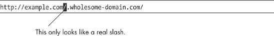
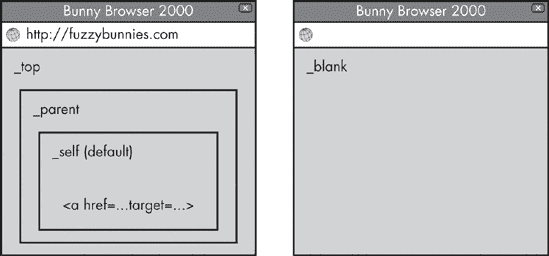
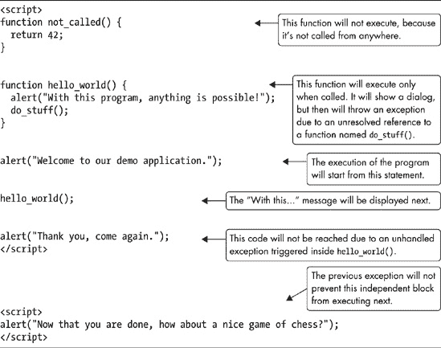
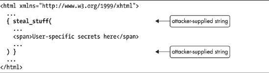

# 第一部分。网络解剖学

本书的第一部分专注于支配网络浏览器操作的原理性概念，即使一切运转的协议、文档格式和编程语言。因为所有现代浏览器中使用的熟悉、用户可见的安全机制都与这些内部工作紧密相连，所以在深入森林之前，我们应该给予这些裸露的内部相当多的关注。

# 第二章。一切从 URL 开始

网络最显著的特征是被称为*统一资源定位符（URL）*的简单文本字符串。每个格式良好、完全合格的 URL 旨在最终确定地定位和唯一标识远程服务器上的单个资源（并在这样做的同时实现一些相关的辅助功能）。URL 语法是地址栏的基石，是每个浏览器中最重要用户界面（UI）安全指示器。

除了用于内容检索的真实 URL 之外，还有几类*伪 URL*使用类似的语法来提供方便地访问浏览器级功能，包括集成脚本引擎、几个特殊的文档渲染模式等。也许不出所料，这些伪 URL 操作可以对决定链接到它们的任何网站的安全性产生重大影响。

确定特定 URL 将被浏览器如何解释及其副作用的能力，是人类和 Web 应用尝试的最基本和最常见的安全任务之一，但它可能是一个有问题的任务。通用 URL 语法，由蒂姆·伯纳斯-李的工作，主要在 RFC 3986 中编码；^([94])其 Web 上的实际用途在 RFC 1738，^([95]) 2616，^([96])和其他几个不那么重要的标准中概述。这些文件非常详细，导致了一个相当复杂的解析模型，但它们并不足够精确，以至于在所有客户端软件中都能导致和谐、兼容的实现。此外，各个软件供应商出于自己的原因选择偏离规范。

让我们更详细地看看这个谦逊的 URL 在实际中是如何工作的。

# 统一资源定位符结构

图 2-1 显示了*完全合格的绝对 URL*的格式，它指定了访问特定资源所需的所有信息，并且不依赖于导航开始的任何位置。相比之下，*相对 URL*，例如*../file.php?text=hello+world*省略了一些信息，并且必须在与当前浏览上下文相关的基础 URL 的上下文中进行解释。


图 2-1. 绝对 URL 的结构

绝对 URL 的各个部分看起来很直观，但每个部分都伴随着一些陷阱，所以现在让我们来回顾一下。

## 方案名称

*方案名称* 是一个不区分大小写的字符串，以单个冒号结尾，表示用于检索资源的协议。有效 URL 方案的官方注册由 *互联网数字分配机构* (*IANA*) 维护，该机构更广为人知的是其对于 IP 地址空间的管理。97] IANA 当前的有效方案名称列表包括数十个条目，如 *http:*、*https:* 和 *ftp:*；在实践中，更广泛的方案集合被常见的浏览器和第三方应用程序非正式地认可，其中一些方案具有特殊的网络安全后果。（特别值得注意的是几种伪 URL 类型，如 *data:* 或 *javascript:*，这些将在本章后面和本书的其余部分进行讨论。）

在进行任何进一步的解析之前，浏览器和 Web 应用程序需要区分完全限定的绝对 URL 和相对 URL。地址前存在有效方案的存在意味着这是关键的区别，如 RFC 1738 中定义：在一个符合规范的绝对 URL 中，只有字母数字“+”、“−”和“.”可以出现在必需的“:”之前。然而，在实践中，浏览器对此指导有一些偏差。所有浏览器都忽略了前导的新行和空白字符。Internet Explorer 忽略了 ASCII 码 0x01 到 0x1F 的非打印字符范围。Chrome 还跳过了 0x00，即空字符。大多数实现也忽略了方案名称中间的新行和制表符，而 Opera 接受字符串中的高位字符。

由于这些不兼容性，依赖于区分相对和绝对 URL 的应用程序必须保守地拒绝任何异常的语法——但正如我们很快就会发现的，即使这样也不够。

## 层次化 URL 的指示符

为了符合 RFC 1738 中规定的通用语法规则，每个绝对、层次化 URL 都必须包含固定字符串“//”，位于授权部分之前。如果该字符串缺失，该规范中剩余 URL 的格式和功能是未定义的，必须将其视为不透明的、方案特定的值。

### 注意

一个非层次化 URL 的例子是 *mailto:* 协议，用于指定电子邮件地址和可能的主题行（*mailto:*user@example.com?subject=Hello+world）。此类 URL 在传递给默认邮件客户端时不会进行任何进一步的解析尝试。

一个通用、分层的 URL 语法的概念在理论上是非常优雅的。它应该能够使应用程序在不知道特定方案如何工作的情况下提取关于地址的一些信息。例如，在没有预先设定的关于*wacky-widget:*协议的概念，仅通过应用通用 URL 语法的概念，浏览器可以决定[`example.com/test1/`](http://example.com/test1/)和*wacky-widget://example.com/test2/*引用的是同一个，可信任的远程主机。

很遗憾，该规范有一个有趣的缺陷：上述 RFC 没有提及当遇到方案已知为非分层但仍然出现“//”前缀的 URL 时，实现者应该做什么，反之亦然。实际上，RFC 1630 中提供的一个参考解析器实现中包含了一个无意中的漏洞，给后一类 URL 赋予了反直觉的含义。在几年后发布的 RFC 3986 中，作者尴尬地承认了这个缺陷，并允许实现者出于兼容性原因尝试解析这样的 URL。因此，许多浏览器以意想不到的方式解释了以下示例：

+   http:example.com/ 在 Firefox、Chrome 和 Safari 中，当没有完全限定的基本 URL 上下文存在时，这个地址可能被处理成与[`example.com/`](http://example.com/)相同，当有有效的基本 URL 时，它被视为对名为*example.com*的目录的相对引用。

+   javascript://example.com/%0Aalert(1) 这个字符串在所有现代浏览器中被解释为有效的非分层伪 URL，并且 JavaScript *alert(1)*代码将被执行，显示一个简单的对话框窗口。

+   mailto://user@example.com Internet Explorer 接受这个 URL 作为对电子邮件地址的有效非分层引用；“//”部分被简单地跳过。其他浏览器持不同意见。

## 资源访问凭据

URL 的凭据部分是可选的。此位置可以指定一个用户名，也许还需要一个密码，这些信息可能是从服务器检索数据所必需的。这些凭据交换的方法不是抽象 URL 语法的组成部分，并且总是特定于协议。对于不支持认证的协议，带有凭据的 URL 的行为是未定义的。

当没有提供凭据时，浏览器将尝试匿名获取资源。在 HTTP 和几个其他协议的情况下，这意味着不发送任何认证数据；对于 FTP，这涉及到使用名为*ftp*的虚假密码登录到访客账户。

大多数浏览器接受除了一般 URL 部分分隔符之外几乎任何字符，在这个部分有两个例外：由于不明原因，Safari 拒绝了一组更广泛的字符，包括“<”，“>”，“{”，和“}”，而 Firefox 也拒绝换行符.^([10])

## 服务器地址

对于所有完全限定的分层 URL，服务器地址部分必须指定一个不区分大小写的 DNS 名称（例如 *example.com*），一个原始 IPv4 地址（例如 *127.0.0.1*），或一个方括号中的 IPv6 地址（例如 *[0:0:0:0:0:0:0:1]*），以指示托管请求资源的服务器位置。Firefox 也将接受方括号中的 IPv4 地址和主机名，但其他实现会立即拒绝它们。

虽然 RFC 只允许 IP 地址的规范表示法，但大多数应用程序使用的标准 C 库要宽松得多，接受混合八进制、十进制和十六进制表示的非规范 IPv4 地址，或者将某些或所有八位字节连接成一个单一整数。因此，以下选项被视为等效：

+   http://127.0.0.1/ 这是 IPv4 地址的一个规范表示。

+   http://0x7f.1/ 这是一种使用十六进制数表示第一个八位字节，并将所有剩余的八位字节连接成一个单一十进制值的地址表示。

+   http://017700000001/ 使用 0 前缀的八进制值表示相同的地址，所有八位字节连接成一个单一的 32 位整数。

类似的轻松态度也可以在 DNS 名称中看到。理论上，DNS 标签需要符合一个非常窄的字符集（具体来说，是字母数字、“.”和“-”，如 RFC 1035 定义），但许多浏览器都会愉快地请求底层操作系统的解析器查找几乎任何内容，而操作系统通常也不会对此大惊小怪。主机名和传递给解析器的字符集的确切集合因客户端而异。Safari 最为严格，而 Internet Explorer 最为宽容。值得注意的是，0x0A-0x0D 和 0xA0-0xAD 范围内的几个控制字符在大多数浏览器中在这个 URL 部分被忽略。

### 注意

一个令人着迷的行为是所有主流浏览器中的 URL 解析器都愿意将字符“”（汉字句号，Unicode 点 U+3002）与主机名中的句点同等对待，但在 URL 的其他地方则不是。据报道，这是因为某些中文键盘映射使得输入这个符号比预期的 7 位 ASCII 值要容易得多。

## 服务器端口

这个服务器端口是一个可选部分，描述了在之前指定的服务器上连接的非标准网络端口。几乎所有的浏览器和第三方应用程序支持的应用层协议都使用 TCP 或 UDP 作为底层传输方法，而 TCP 和 UDP 都依赖于 16 位端口号来区分运行在单个机器上的无关服务之间的流量。每个方案都与该协议服务器通常运行的默认端口相关联（HTTP 为 80，FTP 为 21 等），但默认值可以在 URL 级别被覆盖。

### 注意

这个特性的一个有趣且未预料到的副作用是，浏览器可以被欺骗，向随机网络服务发送攻击者提供的数据，而这些服务并不使用浏览器期望它们使用的协议。例如，可以将浏览器指向 [`mail.example.com:25/`](http://mail.example.com:25/)，其中 25 是 Simple Mail Transfer Protocol (SMTP)服务使用的端口，而不是 HTTP。这一事实导致了各种安全问题，并促使许多不完美的解决方案，这些解决方案在本书的第二部分中进行了更详细的讨论。

## 层次化文件路径

URL 的下一部分，即层次化文件路径，设想为识别要从服务器检索的特定资源的一种方式，例如 */documents/2009/my_diary.txt*。规范相当明确地建立在 Unix 目录语义之上，要求解析路径中的“/../”和“/./”段，并为非完全限定的 URL 中的相对引用提供基于目录的方法。

在 20 世纪 90 年代，使用文件系统模型似乎是一个自然的选择，当时网络服务器只是作为一组静态文件和偶尔的执行脚本的简单网关。但自那时起，许多当代网络应用程序框架已经切断了与文件系统的任何剩余联系，直接与数据库对象或驻留程序代码中注册的位置进行交互。将这些数据结构映射到良好的 URL 路径是可能的，但并不总是实践或谨慎实践。所有这些都使得自动内容检索、索引和安全测试比应有的要复杂。

## 查询字符串

查询字符串是一个可选部分，用于将任意、非层次化的参数传递给路径中先前标识的资源。一个常见的例子是将用户提供的术语传递给实现搜索功能的服务器端脚本，例如：

```
http://example.com/`search.php?query=Hello+world`
```

大多数网络开发者习惯于查询字符串的特定布局；这种熟悉的格式是由浏览器在处理基于 HTML 的表单时生成的，遵循以下语法：

```
name1=value1&name2=value2...
```

令人惊讶的是，这种布局在 URL RFCs 中并没有被强制要求。相反，查询字符串被视为一个不透明的数据块，最终接收者可以按照自己的理解进行解释，而且与路径不同，它没有特定的解析规则的限制。

常用格式的提示可以在信息 RFC 1630 中找到，这是一个与邮件相关的 RFC 2368，以及处理表单的 HTML 规范中。^([[99])]^([[100])]^([[101])] 这一切都是非约束性的，因此，尽管这可能不太礼貌，但网络应用程序为 URL 的这一部分使用任意格式并不是错误。

## 片段 ID

片段 ID 是一个不透明的值，其角色类似于查询字符串，但为客户端应用程序提供可选的指令而不是服务器。（实际上，这个值根本不应该发送到服务器。）片段 ID 的格式和功能在 RFCs 中没有明确规定，但暗示它可以用来定位检索到的文档中的“子资源”或提供其他文档特定的渲染提示。

实际上，在浏览器中，片段标识符只有一个官方用途：指定文档中锚点 HTML 元素的名称，用于文档内导航。逻辑很简单。如果 URL 中提供了锚点名称并且可以找到匹配的 HTML 标签，则文档将滚动到该位置进行查看；否则，不会发生任何操作。由于信息编码在 URL 中，因此可以轻松与他人共享或书签这种长文档的特定视图。在这种情况下，片段 ID 的含义仅限于滚动现有文档，因此当仅更新 URL 的这部分以响应用户操作时，无需从服务器检索任何新数据。

这个有趣的属性导致了另一种更近期的、完全临时的使用：存储客户端脚本所需的杂项状态信息。例如，考虑一个地图浏览应用程序，它将当前查看的地图坐标放在片段标识符中，以便在链接被书签或分享时知道从该位置恢复。与更新查询字符串不同，即时更改片段 ID 不会触发耗时的页面重新加载，这使得这种数据存储技巧成为一个杀手级功能。

## 再次将所有内容组合在一起

如上所述的每个 URL 段落都由某些保留字符分隔：斜杠、冒号、问号等。为了使整个方法可用，这些分隔字符不应出现在 URL 的任何其他目的中。基于这个假设，想象一个示例算法，将绝对 URL 分割成上述功能部分，至少在某种程度上与浏览器完成此任务的方式一致。这样一个相当合理的算法示例可能是：

**步骤 1：提取方案名称**。

查找第一个“:”字符。URL 左侧的部分是方案名称。如果方案名称不符合预期的字符集，则退出；如果这样，URL 可能需要被当作相对 URL 处理。

**步骤 2：消费层次 URL 标识符**。

方案名称之后应该跟着字符串“//”。如果找到它，则跳过；如果没有找到，则退出。

### 注意

在某些解析上下文中，为了提高可用性，实现可能会接受零个、一个甚至三个或更多斜杠而不是两个。同样，从其诞生之初，Internet Explorer 就接受在 URL 的任何位置使用反斜杠 (\) 代替斜杠，这可能是为了帮助不熟练的用户.^([11]) 除了 Firefox 之外的所有浏览器最终都跟随了这个趋势，并识别了如 *http:\\example.com\* 这样的 URL。

**步骤 3：获取权限部分**。

扫描下一个“/”、“?”或“#”，以从 URL 中提取权限部分。如上所述，大多数浏览器也会接受“\”作为正斜杠的替代分隔符，这可能需要考虑。分号 (;) 也是除 Internet Explorer 和 Safari 之外浏览器中可接受的权限分隔符；做出这一决定的原因尚不清楚。

**步骤 3A：查找凭证（如果存在）**。

一旦提取了权限部分，在子字符串中定位到符号 (@)。如果找到，则前导片段构成登录凭证，应进一步在第一个冒号（如果存在）处进行标记，以分割登录和密码数据。

**步骤 3B：提取目标地址**。

权限部分的其余部分是目标地址。寻找第一个冒号以将主机名与端口号分开。对于括号内的 IPv6 地址也需要一个特殊情况。

**步骤 4：识别路径（如果存在）**。

如果权限部分后面紧跟着一个正斜杠——或者在某些实现中，如前所述，一个反斜杠或分号，扫描下一个“?”、“#”或字符串末尾，以先到者为准。中间的文本构成路径部分，应根据 Unix 路径语义进行标准化。

**步骤 5：提取查询字符串（如果存在）**。

如果最后一个成功解析的段后面跟着一个问号，扫描下一个“#”字符或字符串末尾，以先到者为准。中间的文本是查询字符串。

**步骤 6：提取片段标识符（如果存在）**。

如果最后一个成功解析的段后面跟着“#”，则从该字符到字符串末尾的所有内容都是片段标识符。无论如何，你就可以完成了！

这个算法可能看起来很平凡，但它揭示了即使是经验丰富的程序员通常也不会考虑的微妙细节。它还说明了对于普通用户来说，理解特定 URL 的解析方式极其困难。让我们从一个相当简单的情况开始：

```
http://example.com&gibberish=1234@167772161/
```

这个 URL 的目标——一个解码为 10.0.0.1 的连续 IP 地址——对于一个非专家来说并不明显，许多用户会认为他们正在访问 *example.com*，而不是其他地址.^([12]) 好吧，那是一个简单的例子！那么，让我们来看看这个语法：

```
http://example.com\@coredump.cx/
```

在 Firefox 中，该 URL 将用户带到 *coredump.cx*，因为 *example.com\* 被解释为登录字段的合法值。在几乎所有其他浏览器中，“\” 被解释为路径分隔符，用户将到达 *example.com*。

对于 Internet Explorer，还有一个更加令人沮丧的例子。考虑以下情况：

```
http://example.com;.coredump.cx/
```

微软的浏览器允许在主机名中使用“;”，并且由于 *coredump.cx* 域的适当配置，成功解析了这个标签。大多数其他浏览器会自动更正 URL 为 *http://example.com/;.coredump.cx* 并将用户带到 *example.com*（Safari 除外，那里的语法会导致错误）。如果这看起来很混乱，请记住，我们只是刚开始了解浏览器的工作方式！

* * *

^([10]) 这可能是出于对 FTP 的担忧，FTP 在传输用户凭据时没有进行编码；在这个协议中，作为 FTP 命令开始的换行符会被服务器错误地解释。其他浏览器可能会以不合规的百分号编码形式传输 FTP 凭据，或者简单地删除任何有问题的字符。

^([11]) 与基于 UNIX 的操作系统不同，Microsoft Windows 使用反斜杠而不是斜杠来分隔文件路径（例如，*c:\windows\system32\calc.exe*）。微软可能试图通过用户在网络上需要输入不同类型的斜杠而感到困惑的可能性来补偿，或者希望解决与 *file:* URL 和类似机制的其他可能的矛盾，这些机制将直接与本地文件系统交互。然而，其他 Windows 文件系统特定的内容（如不区分大小写）并未复制。

^([12]) 这种基于 @ 的技巧很快就被接受，以方便各种针对普通用户的在线欺诈。减轻其影响的尝试从重手和奇怪的具体措施（例如，在 Internet Explorer 中禁用基于 URL 的身份验证或在 Firefox 中通过警告来削弱它）到相当合理的措施（例如，在几个浏览器的地址栏中突出显示主机名）。

# 保留字符和百分号编码

上一个章节中概述的 URL 解析算法依赖于这样一个假设，即某些保留的、用于语法分隔的字符不会以任何其他形式出现在 URL 中（也就是说，它们不会是用户名、请求路径的一部分等）。这些通用的、破坏语法的分隔符是：

```
: / ? # [ ] @
```

RFC 还提到了一些低级别的分隔符，但没有为它们指定任何特定用途，这可能是为了允许在顶级部分的任何部分实现方案或应用特定的功能：

```
! $ & ' ( ) * + , ; =
```

所有上述字符原则上都是禁止使用的，但在某些合法情况下，人们可能希望将它们包含在 URL 中（例如，为了适应用户输入的任意搜索词，并通过查询字符串传递给服务器）。因此，而不是禁止它们，标准提供了一种方法来编码所有这些值的虚假出现。这种方法简单地称为*百分编码*或*URL 编码*，用百分号（%）后跟表示匹配 ASCII 值的两个十六进制数字来替换字符。例如，`/`将被编码为*%2F*（大写是惯例但不是强制性的）。因此，为了避免歧义，裸百分号本身必须编码为*%25*。任何处理现有 URL 的中介（包括浏览器和 Web 应用程序）都进一步被迫不得尝试解码或编码传递的 URL 中的保留字符，因为这样的 URL 的含义可能会突然改变。

殊为遗憾，现有 URL 中保留字符的不可变性与其需要响应任何技术上非法的 URL 的需求相矛盾，因为这些 URL 错误地使用了这些字符，并且在浏览器中遇到。这个主题在规范中完全没有涉及，这迫使浏览器供应商进行临时改进，并导致跨实现不一致。例如，URL *http://a@b@c/* 应该被转换为 *http://a@b%40c/* 还是可能转换为 *http://a%40b@c/*？Internet Explorer 和 Safari 认为前者更有意义；其他浏览器则支持后者观点。

在保留集合之外的字符在 URL 语法本身中不应有任何特定的意义。然而，其中一些（如不可打印的 ASCII 控制字符）显然与 URL 应该是人类可读和传输安全的理念不相符。因此，RFC 概述了一个名为*未保留*字符的子集（包括字母数字，`-`，`.`，`_`和“~”），并表示只有这个子集以及它们在预期用途中的保留字符正式允许出现在 URL 中。

### 注意

奇怪的是，这些未保留字符仅*允许*以未转义的形式出现；它们不是*必须*这样做。用户代理可以随意编码或解码它们，这样做并不会改变 URL 的含义。这种属性提出了另一种混淆用户的方法：使用未规范化的未保留字符表示。具体来说，以下所有表示都是等效的：

+   [`example.com/`](http://example.com/)

+   *http://example.com/*

+   *http://example.com/*^([13])

一些本应非保留的可打印字符被排除在所谓的非保留集之外。因此，严格来说，RFC 要求它们无条件地进行百分编码。然而，由于浏览器没有明确负责执行这项规则，所以它并没有被认真对待。特别是，所有浏览器都允许“`^`”、“`{`”、“`|`”和“`}`”出现在 URL 中而不进行转义，并将这些字符原样发送到服务器。Internet Explorer 进一步允许“`<`”、“`>`”和“`` ` ``”通过；Internet Explorer、Firefox 和 Chrome 都接受“`\`”；Chrome 和 Internet Explorer 将允许双引号；而 Opera 和 Internet Explorer 都允许非打印字符 0x7F（DEL）原样通过。

最后，与 RFC 中明确要求的内容相反，大多数浏览器甚至根本不对片段标识符进行编码。这对依赖于这个字符串并期望某些潜在不安全的字符永远不会以字面形式出现的客户端脚本构成了一个意想不到的挑战。我们将在第六章中重新探讨这个话题。

## 非 US-ASCII 文本的处理

全球许多语言依赖于基本 7 位 ASCII 字符集之外的字符，或者依赖于所有 PC 兼容系统传统上使用的默认 8 位代码页（CP437）。实际上，一些语言依赖于根本不是基于拉丁字母的字母表。

为了满足一个经常被忽视但强大的非英语用户群体的需求，在 Web 出现之前就设计了各种带有替代高比特字符集的 8 位代码页：ISO 8859-1、CP850 和 Windows 1252 用于西欧语言；ISO 8859-2、CP852 和 Windows 1250 用于东欧和中欧；KOI8-R 和 Windows 1251 用于俄罗斯。而且，由于几个字母表无法适应 256 字符的空间，我们看到了复杂变宽编码的兴起，例如 Shift JIS 用于片假名。

这些字符映射的不兼容性使得在不同代码页配置的计算机之间交换文档变得困难。到 20 世纪 90 年代初，这个日益增长的问题导致了*Unicode*的创建——一种几乎可以包含人类已知所有区域脚本和专业象形文字的通用字符集。Unicode 之后是 UTF-8，这是一种相对简单、变宽的字符表示形式，理论上对能够处理传统 8 位格式的所有应用程序都是安全的。不幸的是，UTF-8 编码高比特字符所需的字节数比大多数竞争对手都要多，对许多用户来说，这似乎是浪费且不必要的。由于这种批评，UTF-8 在 Web 上获得认可花了十多年时间，而且是在所有相关协议都巩固之后才实现的。

这个不幸的延迟对处理包含用户输入的 URL 的处理产生了一定的影响。浏览器需要很早就适应这种使用，但当开发者转向相关标准时，他们发现没有有意义的建议。甚至多年以后，在 2005 年，RFC 3986 也只有以下内容：

> 在本地或区域环境中，以及随着技术的改进，用户可能会从能够使用更广泛的字符中受益；这种使用并未由本规范定义。
> 
> 百分比编码的八位字节……可以在 URI 中使用，以表示超出 US-ASCII 编码字符集范围的字符，如果这种表示由方案或 URI 引用中的协议元素允许。这样的定义应指定用于将那些字符映射到八位字节并在进行 URI 百分比编码之前进行编码的字符编码。

悲哉，尽管有这种美好的愿望，但剩余的标准都没有解决这个问题。始终可以将原始高位字符放入 URL 中，但如果没有知道它们应该解释的代码页，服务器将无法判断那个*%B1*是否应该表示“±”、“ą”或用户母语脚本中的一些其他波浪形字符。

很遗憾，浏览器供应商没有采取主动行动，提出一个一致的解决方案来解决这个问题。大多数浏览器在内部将 URL 路径段转码为 UTF-8（或者在足够的情况下，为 ISO 8859-1），但随后它们在引用页面的代码页中生成查询字符串。在某些情况下，当 URL 是手动输入或传递给某些专用 API 时，高位字符也可能被降级为其 7 位 US-ASCII 相似字符，用问号替换，或者由于实现缺陷而完全损坏。

无论实现得多么糟糕，将非英语字符传递到查询字符串和路径中的能力都满足了明显的需求。传统的百分比编码方法只让一个 URL 段完全处于不利地位：在指定目标服务器名称时，不允许直接使用高位输入，因为至少在原则上，已经建立的标准 DNS 仅允许点分隔的字母数字和破折号出现在域名中——尽管没有人遵守规则，但例外情况因名称服务器而异。

一个敏锐的读者可能会想知道为什么这种限制很重要；也就是说，为什么在非拉丁字母表中也要有本地化域名？这个问题现在可能很难回答。简单地说，有几个人认为缺乏这些编码将阻止全球的企业和个人完全拥抱和享受互联网——而且，无论对错，他们都决心让它成为现实。

这种追求导致了应用程序中国际化域名（IDNA）的形成。首先，RFC 3490，^([102])概述了一个相当复杂的方案，用于使用字母数字和破折号对任意 Unicode 字符串进行编码，然后是 RFC 3492，^([103])，它描述了使用称为*Punycode*的格式将此编码应用于 DNS 标签的方法。Punycode 看起来大致如下：

```
xn--[US-ASCII part]-[encoded Unicode data]
```

一个合规的浏览器在遇到一个技术上非法的 URL，其中在任何位置包含一个非 US-ASCII 字符时，应该将名称转换为 Punycode，然后再执行 DNS 查找。因此，当在现有 URL 中遇到 Punycode 时，它应该在地址栏中显示该字符串的解码、可读形式。

### 注意

将所有这些不兼容的编码策略结合起来，可能会产生有趣的混合。考虑以下一个虚构的波兰语毛巾店的示例 URL：


在所有基于 URL 的编码方法中，IDNA 很快证明是最有问题的。本质上，浏览器地址栏中显示的 URL 中的域名是 Web 上最重要的安全指示之一，因为它使用户能够快速区分他们信任并与之进行过交易的网站与互联网上的其他网站。当浏览器显示的域名由 38 个熟悉且独特的字符组成时，只有相当粗心的受害者才会被骗，认为他们最喜欢的*examp*l*e.com*域名和冒充的*examp*1*e.com*网站是同一件事。但 IDNA 随意且不加区分地将这 38 个字符扩展到 Unicode 支持的约 10 万个符号中，其中许多符号看起来几乎相同，并且仅基于功能差异而彼此分离。

这有多糟糕？以西里尔字母为例。这个字母表有几个与拉丁字母表中的字母几乎相同的同形异义词，但它们的 Unicode 值完全不同，并且解析为完全不同的 Punycode DNS 名称：

| 拉丁 | a | c | e | i | j | o | p | s | x | y |
| --- | --- | --- | --- | --- | --- | --- | --- | --- | --- | --- |
| U+0061 | U+0063 | U+0065 | U+0069 | U+006A | U+006F | U+0070 | U+0073 | U+0078 | U+0079 |
| 西里尔 | a | c | e | i | j | o | p | s | x | y |
| U+0430 | U+0441 | U+0435 | U+0456 | U+0458 | U+043E | U+0440 | U+0455 | U+0445 | U+0443 |

当 IDNA 被提出并在浏览器中首次实现时，没有人认真考虑这个问题带来的后果。浏览器供应商显然认为 DNS 注册商将阻止人们注册类似的名字，而注册商认为在地址栏中保持清晰的视觉是浏览器供应商的问题。

在 2002 年，所有相关方终于认识到了这个问题的严重性。那年，叶夫根尼·加布里洛维奇和亚历克斯·冈特马克赫发表了“同音攻击”^([104])，一篇详细探讨漏洞的论文。他们指出，任何注册级别的工作方案，即使实施，也会有一个致命的缺陷。攻击者总是可以购买一个健全的顶级域名，然后在自己的域名服务器上设置一个子域名记录，应用 IDNA 转换后，会解码成一个与*example.com/*（最后一个字符仅是一个非功能的类似 ASCII 斜杠的替代品）视觉上相同的字符串。结果将是：



注册商无法采取任何措施来防止这种攻击，球现在在浏览器供应商的场地上。但他们到底有什么选择呢？

实际上，并不多。我们现在意识到，构思不佳的 IDNA 标准无法以简单和痛苦的方式修复。浏览器开发者通过在用户的区域设置与特定 DNS 标签中看到的脚本不匹配时回退到难以理解的 Punycode 来应对这种风险（这在使用外国网站或使用导入或配置错误的计算机时会导致问题）；仅在某些特定国家的顶级域名中允许使用 IDNA（排除了在*.com*和其他高知名度 TLD 中使用国际化域名）；并列入某些类似斜杠、点、空格等“坏”字符的黑名单（鉴于全球使用的字体数量，这是一项徒劳的任务）。

这些措施足够激进，足以严重阻碍国际化域名的采用，可能到了这种程度，标准的持续存在带来的安全问题比它为非英语用户带来的实际可用性好处还要多。

* * *

^([13]) 类似的不规范编码被广泛用于各种类型的社会工程攻击，因此，多年来部署了各种对策。像往常一样，其中一些对策是破坏性的（例如，Firefox 明确拒绝在主机名中使用百分号编码的文本），而另一些则相当不错（例如，通过解码所有不必要的编码文本以用于显示目的，强制执行地址栏的“规范转换”）。

# 常见 URL 方案及其功能

让我们抛开奇特的 URL 解析世界，回到基础。在本章的早期，我们暗示某些方案可能会有意外的安全后果，并且由于这个原因，任何处理用户提供的 URL 的 Web 应用程序都必须谨慎。为了更好地解释这一点，回顾在典型浏览器环境中通常支持的 URL 方案是有用的。这些可以组合成四个基本组。

## 浏览器支持的文档获取协议

这些方案由浏览器内部处理，提供了一种使用特定传输协议检索任意内容，然后使用常见的浏览器级渲染逻辑显示它的方法。这是 URL 的最基本和最预期的功能。

在这个类别中，常见支持的方案列表出奇地短：*http:*（RFC 2616），在 Web 上使用的首选传输模式，也是本书下一章的重点；*https:*，HTTP 的加密版本（RFC 2818^([105]））；以及 *ftp:*，一种较老的文件传输协议（RFC 959^([106]））。所有浏览器也支持 *file:*（以前也称为 *local:*），一种特定于系统的访问本地文件系统或 NFS 和 SMB 共享的方法。（这个最后的方案通常不能通过源自互联网的页面直接访问。）

还有两个额外的、不为人知的案例也值得简要提及：内置对 *gopher:* 方案的支持，这是 Web 的一个失败的先驱（RFC 1436^([107]）），仍然存在于 Firefox 中，以及 *shttp:*，一种对 HTTPS 的替代、失败的尝试（RFC 2660^([108]）），仍然在 Internet Explorer 中被认可（但今天，它简单地被别名为 HTTP）。

## 第三方应用程序和插件声明的协议

对于这些方案，匹配的 URL 简单地被发送到外部、专门的应用程序，这些应用程序实现了媒体播放、文档查看或 IP 电话等功能。到此，浏览器（主要）的参与就结束了。

目前存在大量外部协议处理器，要涵盖它们所有内容需要另一本厚厚的书。其中一些最常见例子包括 *acrobat:* 方案，可预测地路由到 Adobe Acrobat Reader；*callto:* 和 *sip:* 方案被各种即时通讯软件和电话软件所声称；*daap:*, *itpc:*, 和 *itms:* 方案由 Apple iTunes 使用；*mailto:*, *news:*, 和 *nntp:* 协议由邮件和 Usenet 客户端声称；*mmst:*, *mmsu:*, *msbd:*, 和 *rtsp:* 协议用于流媒体播放器；等等。浏览器有时也会包含在列表中。之前提到的 *firefoxurl:* 方案可以在另一个浏览器中启动 Firefox，而 *cf:* 则可以从 Internet Explorer 访问 Chrome。

对于这些方案，当它们出现在 URL 中时，通常对允许它们通过的 Web 应用程序的安全性没有影响（尽管这并不保证，尤其是在插件支持的内容的情况下）。值得注意的是，第三方协议处理器往往臭名昭著地存在漏洞，有时被滥用以损害操作系统。因此，限制导航到神秘协议的能力是对任何合理可信网站用户的一种常见礼节。

## 非封装伪协议

一系列协议被保留，以提供方便地访问浏览器的脚本引擎和其他内部功能，而无需实际检索任何远程内容，也许无需建立独立的文档上下文来显示结果。许多这些伪协议非常特定于浏览器，要么不能直接从互联网访问，要么无法造成伤害。然而，有几个重要的例外。

最著名的例外可能是 *javascript:* 方案（在早年，在 Netscape 浏览器中也可通过别名如 *livescript:* 或 *mocha:* 访问）。此方案允许在当前查看的网站上下文中访问 JavaScript 编程引擎。在 Internet Explorer 中，*vbscript:* 通过专有的 Visual Basic 界面提供类似的功能。

另一个重要的情况是 *data:* 协议（RFC 2397^([109]))，它允许创建简短的、内联的文档，而无需任何额外的网络请求，有时它们的大部分操作上下文都来自引用页面。一个 *data:* URL 的例子是：

```
*`data:text/plain,Why,%20hello%20there!`*
```

这些外部可访问的伪 URL 对于站点安全至关重要。当导航到这些 URL 时，其有效载荷可能在原始域的上下文中执行，可能窃取敏感数据或更改受影响用户的页面外观。我们将在第六章中讨论浏览器脚本语言的特定功能，但正如你所预期的那样，它们是相当重要的。（另一方面，URL 上下文继承规则是第十章的重点。）

## 封装伪协议

这一类特殊的伪协议可以用来作为任何其他 URL 的前缀，以强制对检索到的资源进行特殊的解码或渲染模式。或许最著名的例子是 Firefox 和 Chrome 支持的 *view-source:* 方案，用于显示 HTML 页面的格式化源代码。此方案的使用方式如下：

```
view-source:http://www.example.com/
```

其他功能类似的协议包括 *jar:*，它允许在 Firefox 中动态提取 ZIP 文件中的内容；*wyciwyg:* 和 *view-cache:*，分别提供 Firefox 和 Chrome 中缓存页面的访问权限；一个奇特的 *feed:* 方案，旨在访问 Safari 中的新闻源；^([110]) 以及与 Windows 帮助子系统和其他 Microsoft Windows 组件相关的一大批文档不充分的协议（*hcp:*, *its:*, *mhtml:*, *mk:*, *ms-help:*, *ms-its:*, 和 *ms-itss:*）。

许多封装协议的共同特性是它们允许攻击者隐藏浏览器最终将解释的实际 URL，从而避开天真过滤器：`view-source:javascript:`（甚至`view-source:view-source:javascript:`）后跟恶意代码是完成这一点的简单方法。可能存在一些安全限制来限制这种诡计，但不应依赖于它们。另一个显著的问题，尤其是在微软的*mhtml:*中反复出现，是使用该协议可能会忽略服务器在 HTTP 级别提供的某些内容指令，这可能导致普遍的不幸.^([111])

## 关于方案检测的结束语

伪协议的数量众多是为什么 Web 应用需要仔细筛选用户提供的 URL 的主要原因。古怪且特定于浏览器的 URL 解析模式，加上支持方案列表的开放性，意味着简单地黑名单已知的坏方案是不安全的；例如，如果这个关键字与制表符或换行符拼接，替换为*vbscript:*，或者以另一个封装方案为前缀，那么对*javascript:*的检查可能会被规避。

# 相对 URL 的解析

相对 URL 在章节的前几部分已经被提到，现在也需要给予更多的关注。它们存在的原因是，在互联网上的几乎每个网页上，都会有相当数量的 URL 引用同一服务器上托管的资源，可能是在同一个目录下。每次需要此类引用时都要求出现完全限定的 URL 将是不方便且浪费的，因此使用简短的相对 URL（如*../other_file.txt*）代替。缺失的细节可以从引用文档的 URL 中推断出来。

由于相对 URL 可以出现在任何绝对 URL 可能出现的完全相同的场景中，因此浏览器内部需要有一种方法来区分这两种 URL。Web 应用也受益于这种区分能力，因为大多数类型的 URL 过滤器可能只想仔细检查绝对 URL，并允许本地引用按原样通过。

规范可能使这项任务看起来非常简单：如果 URL 字符串不以有效的方案名称开头，后面跟一个分号和，最好是有效的“//”序列，则应将其解释为相对引用。如果没有解析此类相对 URL 的上下文，则应拒绝。其他一切都是安全的相对链接，对吧？

预计这并不像看起来那么简单。首先，如前几节所述，有效方案名称中接受的字符集，以及代替“//”接受的模式，因实现而异。也许更有趣的是，一个常见的误解是相对链接只能指向同一服务器上的资源；实际上存在许多其他不那么明显的相对 URL 变体。

让我们快速浏览一下已知的相对 URL 类别，以更好地说明这种可能性。

**有方案，但没有权限** (http:foo.txt)

这种臭名昭著的漏洞在 RFC 3986 中有所暗示，并归因于早期规范中的一个疏忽。虽然这些规范描述性地将这些 URL 分类为（无效）绝对引用，但它们还提供了一个对它们进行错误解释的贪婪引用解析算法。

在后一种解释中，这些 URL 将设置新的协议和路径、查询或片段标识符，但权限部分将从引用位置复制。这种语法被几个浏览器接受，但并不一致。例如，在某些情况下，*http:foo.txt* 可能被视为相对引用，而 *https:example.com* 可能被解析为绝对引用！

**没有方案，但有权限** (//example.com)

这是一种臭名昭著但至少有良好文档记录的怪癖。虽然 */example.com* 是对当前服务器上本地资源的引用，但标准强制浏览器将 *//example.com* 视为一个非常不同的情况：对当前协议的不同权限的引用。在这种情况下，方案将从引用位置复制，所有其他 URL 细节都将从相对 URL 派生。

**没有方案，没有权限，但有路径** (../notes.txt)

这是相对链接最常见的变体。协议和权限信息是从引用 URL 复制的。如果相对 URL 不以斜杠开头，路径也将复制到最右侧的“/”。例如，如果基本 URL 是 [`www.example.com/files/`](http://www.example.com/files/)，则路径相同，但在 [`www.example.com/files/index.html`](http://www.example.com/files/index.html) 中，文件名被截断。然后，将新路径附加到上面，并在连接值上执行标准路径规范化。查询字符串和片段标识符仅从相对 URL 派生。

**没有方案，没有权限，没有路径，但有查询字符串** (?search=bunnies)

在此场景中，协议、权限和路径信息直接从引用 URL 复制。查询字符串和片段标识符是从相对 URL 派生出来的。

**仅存在片段标识符** (#bunnies)

除了片段标识符之外的所有信息都是直接从引用 URL 复制的；只有片段标识符被替换。遵循此类相对 URL 在正常情况下不会导致页面重新加载，如前所述。

由于在处理这些类型的相对引用时，应用级 URL 过滤器与浏览器之间可能存在潜在误解的风险，因此，始终直接输出用户提供的相对 URL 是一个良好的设计实践。在可行的情况下，它们应被明确重写为绝对引用，并且所有安全检查都应针对生成的完全合格地址进行。

安全工程速查表

当基于用户输入构建全新的 URL 时

+   **如果您允许用户在路径、查询或片段 ID 中提供数据：** 如果某个部分分隔符在没有适当转义的情况下成功通过，URL 可能会产生与您预期不同的效果（例如，将一个用户可见的 HTML 按钮链接到错误的服务器端操作）。谨慎行事是正确的：当插入攻击者控制的字段值时，您只需对非字母数字字符进行百分号转义即可。

+   **如果您允许用户提供的方案名称或授权部分：** 这是一种主要的代码注入和钓鱼风险！应用以下概述的相关输入验证规则。

当设计 URL 输入过滤器时

+   **相对 URL：** 禁止或显式重写它们为绝对引用以避免麻烦。其他任何内容都极有可能是不安全的。

+   **方案名称：** 仅允许已知的前缀，例如 *http://*、*https://* 或 *ftp://*。不要使用黑名单；这极其不安全。

+   **授权部分：** 主机名应仅包含字母数字、“-”和“.”，并且只能由“/”、“?”、“#”或字符串末尾跟随。允许任何其他内容都会适得其反。如果您需要检查主机名，请确保进行适当的右侧子字符串匹配。

    在罕见的情况下，您可能需要考虑 IDNA、IPv6 括号表示法、端口号或 HTTP 凭证在 URL 中的情况。如果是这样，您必须完全解析 URL，验证所有部分，拒绝异常值，并将它们重新序列化为一个非歧义、规范、正确转义的表示形式。

当解码通过 URL 接收到的参数时

+   不要假设任何特定字符会因为标准如此规定或因为您的浏览器这样做而被转义。在回显任何由 URL 派生的值或将它们放入数据库查询、新 URL 等之前，仔细清除危险字符。

# 第三章. 超文本传输协议

我们接下来需要讨论的下一个基本概念是超文本传输协议（HTTP）：Web 的核心传输机制，以及服务器和客户端之间交换 URL 引用文档的首选方法。尽管 HTTP 的名字中有超文本，但 HTTP 和实际的超文本内容（HTML 语言）通常独立存在。话虽如此，它们有时以令人惊讶的方式交织在一起。

HTTP 的历史为作者们的雄心和互联网日益增长的相关性提供了有趣的见解。蒂姆·伯纳斯-李（Tim Berners-Lee）1991 年最早的协议草案（HTTP/0.9^([112]））仅有不到一页半长，并且未能考虑到甚至是最直观的未来需求，例如传输非 HTML 数据所需的扩展性。

五年后，经过几个版本的规范迭代，第一个官方的 HTTP/1.0 标准（RFC 1945^([113]))在约 50 页密集的文字中试图纠正许多这些不足。快进到 1999 年，在 HTTP/1.1（RFC 2616^([114]))中，七位认可的作者试图预测几乎该协议的每一种可能的使用，创作了一部超过 150 页的杰作。不仅如此：截至本文撰写时，对 HTTPbis 的工作，^([115]))基本上是 HTTP/1.1 规范的替代品，达到了大约 360 页。虽然其中大部分逐渐积累的内容对现代网络来说并不相关，但这种进展清楚地表明，添加新特性的愿望远远超过了修剪失败特性的愿望。

现在，所有客户端和服务器都支持 HTTP/1.0 的一个不完全准确的超集，并且大多数都能说一口相当完整的 HTTP/1.1 方言，并附加了一些扩展。尽管实际上没有这样的需求，但一些 Web 服务器和所有常见的浏览器也保持了与 HTTP/0.9 的向后兼容性。

# HTTP 流量基本语法

初看之下，HTTP 是一种相当简单、基于文本的协议，它建立在 TCP/IP 之上.^([14]) 每个 HTTP 会话都是通过建立到服务器的 TCP 连接来启动的，通常是端口 80，然后发出一个概述请求 URL 的请求。作为回应，服务器返回请求的文件，在最基本的使用案例中，随后立即终止 TCP 连接。

原始的 HTTP/0.9 协议为参与方之间交换任何额外的元数据没有提供空间。客户端请求始终由一行组成，以 GET 开头，后跟 URL 路径和查询字符串，并以单个 CRLF 换行符（ASCII 字符 0x0D 0x0A；服务器也被建议接受单独的 LF）。一个示例 HTTP/0.9 请求可能看起来像这样：

```
GET /fuzzy_bunnies.txt
```

作为对此消息的回应，服务器会立即返回适当的 HTML 有效负载。（规范要求服务器将返回文档的行包装在 80 个字符处，但这些建议并没有真正得到遵循。）

HTTP/0.9 方法存在许多实质性的缺陷。例如，它为浏览器提供不了与用户语言偏好进行通信的方式，提供支持的文档类型列表等。它也使服务器无法通知客户端请求的文件找不到，它已移动到不同的位置，或者返回的文件根本不是 HTML 文档。最后，该方案对服务器管理员来说并不友好：当传输的 URL 信息仅限于路径和查询字符串时，服务器无法在单个 IP 地址下托管多个网站，这些网站通过它们的域名区分开来——而且与 DNS 记录不同，IP 地址并不便宜。

为了解决这些不足（并为未来的调整留出空间），HTTP/1.0 和 HTTP/1.1 标准采用了略微不同的对话格式：请求的第一行被修改以包含协议版本信息，其后跟随零个或多个 *name: value* 对（也称为 *headers*），每个对占据一行。此类请求中常见的请求头包括 *User-Agent*（浏览器版本信息）、*Host*（URL 主机名）、*Accept*（支持的 MIME 文档类型^([15]))）、*Accept-Language*（支持的语言代码）和 *Referer*（一个拼写错误的字段，表示请求的起始页面，如果已知）。

这些头部以一个单独的空行结束，之后可以跟随客户端希望传递给服务器的任何有效负载（其长度必须通过额外的 *Content-Length* 头部明确指定）。从协议本身的角度来看，有效负载的内容是透明的；在 HTML 中，这个位置通常用于以几种可能的格式提交表单数据，尽管这并不是一个要求。

总体而言，一个简单的 HTTP/1.1 请求可能看起来像这样：

```
POST /fuzzy_bunnies/bunny_dispenser.php HTTP/1.1
Host: www.fuzzybunnies.com
User-Agent: Bunny-Browser/1.7
Content-Type: text/plain
Content-Length: 17
Referer: http://www.fuzzybunnies.com/main.html

I REQUEST A BUNNY
```

服务器预计会通过一行来响应这个查询，该行指定支持的协议版本、一个数值状态码（用于指示错误条件和其他特殊情况），以及一个可选的、可读的状态消息。接下来是一组自解释的头部，以一个空行结束。响应接着是请求资源的正文：

```
HTTP/1.1 200 OK
Server: Bunny-Server/0.9.2
Content-Type: text/plain
Connection: close

BUNNY WISH HAS BEEN GRANTED
```

RFC 2616 也允许在传输过程中使用三种支持的方法（*gzip*、*compress*、*deflate*）压缩响应，除非客户端通过提供合适的 *Accept-Encoding* 头部明确退出。

## 支持 HTTP/0.9 的后果

尽管 HTTP/1.0 和 HTTP/1.1 做出了改进，但不受欢迎的“愚蠢”HTTP/0.9 协议的遗留问题仍然存在，即使它通常隐藏在视线之外。HTTP/1.0 的规范部分应为此负责，因为它要求所有未来的 HTTP 客户端和服务器支持原始的、半成品草案。具体来说，第 3.1 节说：

> HTTP/1.0 客户端必须 . . . 理解任何有效的 HTTP/0.9 或 HTTP/1.0 格式的响应。

在后来的年份里，RFC 2616 试图撤销这一要求（第 19.6 节：“协议规范的范围之外是强制遵守先前版本。”），但根据早期的建议，所有现代浏览器仍然继续支持这个遗留协议。

为了理解这种模式为何危险，回想一下 HTTP/0.9 服务器只回复请求的文件。没有任何迹象表明响应方实际上理解 HTTP 并愿意提供 HTML 文档。考虑到这一点，让我们分析一下如果浏览器向运行在 *example.com* 端口 25 的不知情的 SMTP 服务发送 HTTP/1.1 请求会发生什么：

```
GET /`<html><body><h1>Hi!` HTTP/1.1
Host: example.com:25
...
```

因为 SMTP 服务器不理解发生了什么，它很可能会这样响应：

```
220 example.com ESMTP
500 5.5.1 Invalid command: "GET /`<html><body><h1>Hi!` HTTP/1.1"
500 5.1.1 Invalid command: "Host: example.com:25"
...
421 4.4.1 Timeout
```

所有愿意遵循 RFC 的浏览器被迫将这些消息作为有效 HTTP/0.9 响应的正文，并假设返回的文档确实是 HTML。这些浏览器将解释出现在错误消息中的一个引用的攻击者控制的片段，就像它来自 *example.com* 的合法网站所有者一样。这严重干扰了本书第二部分（Part II）中讨论的浏览器安全模型，因此，这是相当糟糕的。

## 换行处理怪癖

除了 HTTP/0.9 和 HTTP/1.0 之间的根本变化之外，后来还进行了一些其他核心语法的调整。最值得注意的是，与早期版本的字面意思相反，HTTP/1.1 要求客户端不仅尊重 CRLF 和 LF 格式中的换行符，还要识别单独的 CR 字符。尽管这个建议被两个最受欢迎的 Web 服务器（IIS 和 Apache）忽视，但所有浏览器（除了 Firefox）都在客户端遵循了这一建议。

结果的不一致性使得应用程序开发者更容易忘记，不仅 LF，而且 CR 字符必须从 HTTP 标题中任何攻击者控制的值中删除。为了说明这个问题，考虑以下服务器响应，其中用户提供的、未充分清理的值出现在一个标题中，如粗体所示：

```
HTTP/1.1 200 OK[CR][LF]
Set-Cookie: last_search_term=`[CR][CR]<html><body><h1>Hi!`[CR][LF]
[CR][LF]
Action completed.
```

对于 Internet Explorer 来说，这个响应可能看起来是这样的：

```
HTTP/1.1 200 OK
Set-Cookie: last_search_term=

`<html><body><h1>Hi!`

Action completed.
```

事实上，与 HTTP 标题换行符潜入相关的漏洞类别——无论是由于这种不一致性，还是仅仅因为未能过滤任何类型的换行符——已经足够常见，以至于有了自己的名称：*标题注入*或*响应分割*。

另一个鲜为人知且可能影响安全的调整是支持多行标题，这是一个在 HTTP/1.1 中引入的变更。根据标准，任何以空格开头的标题行都被视为上一行的延续。例如：

```
X-Random-Comment: This is a very long string,
  so why not wrap it neatly?
```

IIS 和 Apache 会识别客户端发出的多行标题，但 Internet Explorer、Safari 或 Opera 不支持这种语法。因此，任何依赖于或简单地允许这种语法在攻击者影响的环境中的实现可能会遇到麻烦。幸运的是，这种情况很少发生。

## 代理请求

代理被许多组织和互联网服务提供商用来代表用户拦截、检查和转发 HTTP 请求。这可能是为了提高性能（通过允许某些服务器响应在附近的系统上缓存），为了执行网络使用策略（例如，防止访问色情），或者为了提供受监控和认证的网络环境访问。

传统的 HTTP 代理依赖于显式的浏览器支持：应用程序需要配置为向代理系统发送修改后的请求，而不是尝试与目标目的地通信。要通过此类代理请求 HTTP 资源，浏览器通常会发送如下请求：

```
GET http://www.fuzzybunnies.com/ HTTP/1.1
User-Agent: Bunny-Browser/1.7
Host: www.fuzzybunnies.com
...
```

与上述示例和常规语法之间的关键区别在于请求的第一行中存在一个完全限定的 URL（[`www.fuzzybunnies.com/`](http://www.fuzzybunnies.com/)），指示代理代表用户连接到何处。鉴于*Host*头已经指定了主机名，此信息有些冗余；这种重叠的唯一原因是这些机制独立发展。为了避免被共谋的客户端和服务器欺骗，代理应纠正任何不匹配的*Host*头以匹配请求 URL，或者将缓存的内容与特定的 URL-*Host*对相关联，而不仅仅是这些值之一。

许多 HTTP 代理还允许浏览器请求非 HTTP 资源，例如 FTP 文件或目录。在这些情况下，代理将响应包装在 HTTP 中，并在适当的情况下将其转换为 HTML，然后再将其返回给用户。^([[16])] 话虽如此，如果代理不理解请求的协议，或者它不适合窥探交换的数据（例如，在加密会话中），则必须使用不同的方法。为此目的保留了一种特殊类型的请求，即 CONNECT，但在 HTTP/1.1 RFC 中未进一步解释。相关的请求语法在 1998 年的一份单独的、仅草案的规范中概述。^([[116])] 它看起来是这样的：

```
CONNECT www.fuzzybunnies.com:1234 HTTP/1.1
User-Agent: Bunny-Browser/1.7
...
```

如果代理愿意并且能够连接到请求的目标，它将通过特定的 HTTP 响应代码来确认此请求，此时该协议的作用结束。在此之后，浏览器将开始在建立的 TCP 流中发送和接收原始二进制数据；代理则预期将无差别地转发两个端点之间的流量。

### 注意

搞笑的是，由于草案规范中的一个细微遗漏，许多浏览器错误地处理了在尝试建立加密连接期间返回的非加密、代理起源的错误响应。受影响的实现将此类明文响应解释为似乎来自目标服务器通过安全通道。这个故障实际上消除了与在网络上使用加密通信相关的所有保证。这个缺陷花了十多年才被发现并纠正。^([[117])]

其他一些低级代理类不使用 HTTP 直接与浏览器通信，但仍然检查交换的 HTTP 消息以缓存内容或强制执行某些规则。这种做法的典型例子是透明代理，它在 TCP/IP 级别静默拦截流量。透明代理采取的方法异常危险：任何这样的代理都可以查看被拦截连接中的目标 IP 和*Host*头部，但它无法立即判断该目标 IP 是否真正与指定的服务器名称相关联。除非进行额外的查找和关联，否则共谋的客户端和服务器可以利用这种行为。如果没有这些额外的检查，攻击者只需连接到他的或她的家用服务器，并发送一个误导性的*Host:* [www.google.com](http://www.google.com)头部，就可以让其他所有用户的响应被缓存，就像真正来自[www.google.com](http://www.google.com)一样。

## 重复或冲突头部的解决

尽管 RFC 2616 相对冗长，但它对符合规范的解析器如何解决请求或响应数据中可能存在的歧义和冲突解释得并不好。本 RFC 的第 19.2 节（“宽容的应用”）建议在“明确”情况下对某些字段进行宽松和容错解析，但这个术语本身的意义，可以说，并不特别明确。

例如，由于缺乏规范级别的建议，大约一半的浏览器将优先考虑特定 HTTP 头部的第一次出现，而其余的将优先考虑最后一次出现，确保几乎每个头部注入漏洞，无论多么受限，都能至少被一部分目标用户利用。在服务器端，情况同样随机：Apache 将尊重看到的第一个*Host*头部，而 IIS 将完全拒绝包含多个此字段实例的请求。

相关地，相关的 RFC 没有明确禁止混合可能冲突的 HTTP/1.0 和 HTTP/1.1 头部，也没有要求 HTTP/1.0 服务器或客户端忽略所有 HTTP/1.1 语法。正因为这种设计，很难预测 HTTP/1.0 和 HTTP/1.1 指令之间间接冲突的结果，而这些指令负责相同的事情，例如*Expires*和*Cache-Control*。

最后，在某些罕见的情况下，规范中对头部冲突的解决方法描述得非常清楚，但允许这种冲突最初出现的目的很难理解。例如，HTTP/1.1 客户端要求在所有请求中发送*Host*头部，但服务器（不仅仅是代理！）也要求识别请求的第一行中的绝对 URL，而不是传统的路径和查询方法。这条规则允许这种好奇心：

```
GET http://www.fuzzybunnies.com/ HTTP/1.1
Host: www.bunnyoutlet.com
```

在这种情况下，RFC 2616 的第 5.2 节指示客户端忽略非功能性的（但仍然是强制性的！）*Host*标题，许多实现都遵循这一建议。问题是底层应用程序可能不会意识到这个怪癖，而可能会基于检查的标题值做出一些重要的决定。

### 注意

当抱怨 HTTP RFCs 中的遗漏时，重要的是要认识到替代方案可能同样有问题。在该 RFC 中概述的几个场景中，明确要求处理某些边缘情况的需求导致了明显荒谬的结果。一个这样的例子是关于解析某些 HTTP 标题中日期的建议，这是根据 RFC 1945 第 3.3 节的要求提出的。结果实现（Firefox 代码库中的 *prtime.c* 文件^([118]))包含接近 2,000 行极其混乱且难以阅读的 C 代码，只是为了以足够容错的方式解析指定的日期、时间和时区（例如，用于决定缓存内容过期）。

## 分号分隔的标题值

几个 HTTP 标题，例如 *Cache-Control* 或 *Content-Disposition*，使用分号分隔的语法，将多个单独的 *name=value* 对压缩到一行中。允许这种嵌套记法的原因尚不清楚，但可能是由这样的信念驱动的：它将比使用多个单独的标题更高效或更直观，而这些标题总是必须一起使用。

RFC 2616 中概述的一些用例允许 *quoted-string* 作为此类对中的右侧参数。*quoted-string* 是一种语法，其中一系列任意可打印字符被双引号包围，这些引号充当分隔符。自然地，引号本身不能出现在字符串中，但——重要的是——分号或空白字符可以，允许许多其他情况下可能有问题值被原样发送。

不幸的是，对于开发者来说，Internet Explorer 并不擅长处理 *quoted-string* 语法，实际上使这种编码方案变得无用。浏览器将以意想不到的方式解析以下行（其目的是指示响应是可下载的文件而不是内联文档）：

```
Content-Disposition: attachment; filename="`evil_file.exe;`.txt"
```

在 Microsoft 的实现中，文件名将在分号字符处截断，并看起来像 *evil_file.exe*。这种行为对任何依赖于检查或向攻击者控制的文件名添加“安全”文件扩展名并正确检查此字符串中的引号字符和新行的应用程序构成了潜在的风险。

### 注意

提供了一种额外的 *quoted-pair* 机制，允许在字符串前加上反斜杠时安全地使用引号（以及任何其他字符）。然而，这种机制似乎被错误地指定，并且除了 Opera 以外，没有任何主流浏览器支持。为了使 *quoted-pair* 正确工作，需要禁止 *quoted-string* 中的“\”字符，但在 RFC 2616 中并非如此。*Quoted-pair* 还允许任何 *CHAR*-type 令牌被引用，包括换行符，这与其他 HTTP 解析规则不兼容。

值得注意的是，当在单个 HTTP 标头中找到重复的分号分隔字段时，它们的优先级顺序在 RFC 中并未定义。在 *Content-Disposition* 中的 *filename=* 的情况下，所有主流浏览器都使用第一次出现。但其他地方的一致性很少。例如，当从 *Refresh* 标头（用于在指定时间后强制重新加载页面）中提取 *URL=* 值时，Internet Explorer 6 将回退到最后一个实例，而所有其他浏览器都会选择第一个。当处理 *Content-Type* 时，Internet Explorer、Safari 和 Opera 将使用第一个 *charset=* 值，而 Firefox 和 Chrome 将依赖于最后一个。

### 注意

思考食物：Julian Reschke 维护的一页上可以找到与单个 HTTP 标头——*Content-Disposition*——处理相关的数十个不一致性的迷人但主要与安全无关的调查。[`greenbytes.de/tech/tc2231/`](http://greenbytes.de/tech/tc2231/)

## 标题字符集和编码方案

与为 URL 处理奠定基础的文档一样，所有后续的 HTTP 规范在很大程度上都避免了处理标头值中非 US-ASCII 字符的话题。有几个合理的场景下，非英语文本可能合法地出现在这个上下文中（例如，*Content-Disposition* 中的文件名），但在这方面，预期的浏览器行为基本上是未定义的。

最初，RFC 1945 允许 TEXT 令牌（一种广泛用于定义其他字段语法的原始令牌）包含 8 位字符，提供了以下定义：

```
OCTET          = <any 8-bit sequence of data>
 CTL           = <any US-ASCII control character
                  (octets 0 - 31) and DEL (127)>
 TEXT          = <any OCTET except CTLs,
                  but including LWS>
```

RFC 随后给出了神秘的建议：当在 TEXT 字段中遇到非 US-ASCII 字符时，客户端和服务器*可能*将它们解释为 ISO-8859-1，即标准的西欧代码页，但不必这样做。后来，RFC 2616 复制并粘贴了相同的 TEXT 令牌规范，但增加了一个注释，指出非 ISO-8859-1 字符串必须使用 RFC 2047 中概述的格式进行编码，^([119])该格式最初是为电子邮件通信创建的。公平地说；在这个简单的方案中，编码的字符串以“=?”前缀开始，后面跟一个字符集名称，一个“?q?”或“?b?”编码类型指示器（*quoted-printable*^([17])或*base64*^([18]))，最后是编码的字符串本身。序列以“?=”终止符结束。一个例子可能是：

```
Content-Disposition: attachment; filename="=`?utf-8?q?Hi=21.txt?=`"
```

### 注意

RFC 还应指出，任何虚假的“=?...?=”模式都不应直接允许出现在相关头中，以避免对实际上并未编码的值进行意外的解码。

可惜，对这种 RFC 2047 编码的支持参差不齐。Firefox 和 Chrome 在某些头中识别它，但其他浏览器合作较少。Internet Explorer 选择在*Content-Disposition*字段中识别 URL 风格的百分编码，这种情况也被 Chrome 采纳）并默认使用 UTF-8。另一方面，Firefox 和 Opera 更喜欢支持 RFC 2231 中提出的独特百分编码语法，^([120）这与 HTTP 语法应有的样子有显著差异：

```
Content-Disposition: attachment; filename*=`utf-8'en-us'Hi%21.txt`
```

聪明的读者可能会注意到，没有一种编码方案被所有浏览器同时支持。这种情况促使一些 Web 应用程序开发者求助于在 HTTP 头中使用原始的高位值，通常解释为 UTF-8，但这样做是相当不安全的。例如，在 Firefox 中，一个长期存在的漏洞导致 UTF-8 文本在放入*Cookie*头时被破坏，允许攻击者注入的 cookie 分隔符出现在意想不到的地方.^([121）。换句话说，没有简单且健壮的解决方案来解决这个问题。

当讨论字符编码时，处理空字符（0x00）的问题可能值得提及。这个字符在许多编程语言中用作字符串终止符，在技术上禁止出现在 HTTP 头中（除了上述功能不正常的*quoted-pair*语法），但正如你可能记得的，解析器被鼓励要有容忍度。当这个字符被允许通过时，它可能会产生意外的副作用。例如，*Content-Disposition*头在 NUL 处被 Internet Explorer、Firefox 和 Chrome 截断，但不是 Opera 或 Safari。

## 引用头行为

如本章前面所述，HTTP 请求可能包括一个*Referer*标题。此标题包含以某种方式触发当前导航的文档的 URL。它的目的是帮助进行某些故障排除任务，并通过强调相关网页之间的交叉引用来促进网络的增长。

不幸的是，此标题也可能向某些不友好方透露有关用户浏览习惯的信息，并且它可能泄露在引用页面 URL 查询参数中编码的敏感信息。由于这些担忧以及随后的缓解这些担忧的糟糕建议，该标题经常被误用于安全或政策执行目的，但它并不胜任这项任务。主要问题是无法区分一个客户端没有提供标题是因为用户隐私偏好，一个客户端没有提供标题是因为正在进行的导航类型，以及一个客户端被恶意引用网站故意欺骗以隐藏这些信息。

通常，此标题包含在大多数 HTTP 请求中（并在 HTTP 级别重定向中保留），但在以下场景中除外：

+   在有机地将新 URL 输入地址栏或打开书签页面后。

+   当导航来自伪 URL 文档时，例如*data:*或*javascript:*。

+   当请求是由*Refresh*标题控制的重定向结果（但不是基于*Location*的重定向）。

+   当引用网站加密但请求的页面未加密时。根据 RFC 2616 第 15.1.2 节，这是出于隐私原因，但这并没有太多意义。当从一个加密域导航到不相关的加密域时，*Referer*字符串仍然会向第三方披露，请放心，加密的使用并不等同于可信性。

+   如果用户决定通过调整浏览器设置或安装以隐私为导向的插件来阻止或伪造此标题。

如应明显，这五个条件中有四个可以通过任何恶意网站故意诱导。

* * *

^([14]) 传输控制协议（TCP）是互联网的核心通信协议之一，为构建在其之上的任何应用协议提供传输层。TCP 为网络主机之间提供合理可靠的、对等确认的、有序的、基于会话的连接。在大多数情况下，该协议对其他非本地主机尝试的盲目数据包伪造攻击也相当有弹性。

^([15]) MIME 类型（也称为*Internet 媒体类型*）是一个简单的两分量值，用于标识任何给定计算机文件的类别和格式。该概念起源于 RFC 2045 和 RFC 2046，当时它被用作描述电子邮件附件的方式。官方值注册表（如*text/plain*或*audio/mpeg*）目前由 IANA 维护，但临时类型相当常见。

^([16]) 在这种情况下，客户端提供的某些 HTTP 头部可能被代理内部使用，但它们不会被传输到非 HTTP 终端，这创造了一些有趣但与安全无关的协议歧义。

^([17]) *Quoted-printable* 是一种简单的编码方案，它将任何不可打印或非法字符替换为等号 (=) 后跟要编码的 8 位字符值的 2 位十六进制表示。输入文本中的任何多余的等号都必须替换为“=3D”。

^([18]) *Base64* 是一种非人类可读的编码，它使用大小写敏感的字母数字、加号（“+”）和斜杠（“/”）的 6 位字母表来编码任意 8 位输入。每 3 个字节的输入映射到 4 个字节的输出。如果输入不以 3 个字节的边界结束，则通过在输出字符串末尾附加一个或两个等号来表示。

# HTTP 请求类型

原始 HTTP/0.9 草案提供了一个用于请求文档的单个方法（或“动词”）：GET。随后的提案尝试了一系列越来越奇怪的方法，以允许除了检索文档或运行脚本之外的其他交互，包括诸如 SHOWMETHOD、CHECKOUT 或——为什么不呢——SPACEJUMP 这样的奇特方法.^([122])

大多数这些思想实验在 HTTP/1.1 中已被放弃，它确定了一套更易于管理的八种方法。只有前两种请求类型——GET 和 POST——对大多数现代 Web 具有任何意义。

## GET

GET 方法旨在表示信息检索。在实践中，它被用于正常浏览会话期间几乎所有客户端-服务器交互。常规 GET 请求不携带浏览器提供的有效负载，尽管它们并不严格禁止这样做。

预期 GET 请求不应具有，引用 RFC 中的说法，“采取除检索之外行动的意义”（也就是说，它们不应对应用程序的状态造成持久性更改）。在现代网络应用中，这一要求越来越没有意义，因为应用程序的状态通常甚至不在服务器端完全管理；因此，这一建议被应用程序开发者广泛忽视.^([19])

### 注意

在 HTTP/1.1 中，客户端可以通过在 GET 请求（以及较少见的其他请求类型）中指定 *Range* 头部来请求目标文档的任何一组可能非连续或重叠的片段。服务器没有义务遵守，但如果机制可用，浏览器可以使用它来恢复中断的下载。

## POST

POST 方法旨在将信息（主要是 HTML 表单）提交给服务器进行处理。由于 POST 操作可能具有持久性副作用，许多浏览器在重新加载使用 POST 获取的任何内容之前都会要求用户确认，但就大部分而言，GET 和 POST 以准可互换的方式使用。

POST 请求通常伴随着一个负载，其长度由 *Content-Length* 头部指示。在纯 HTML 的情况下，负载可能由 URL 编码或 MIME 编码的表单数据组成（格式在第四章第四章。超文本标记语言中详细说明），尽管再次强调，在 HTTP 层面上，其语法并没有任何特殊的限制。

## HEAD

HEAD 是一种很少使用的请求类型，它与 GET 实质上相同，但只返回请求内容的 HTTP 头部，而不是实际的负载。浏览器通常不会自行发出 HEAD 请求，但该方法有时会被搜索引擎爬虫和其他自动化工具使用，例如，用于探测文件的存在或检查其修改时间。

## OPTIONS

OPTIONS 是一个元请求，它返回特定 URL（或“*”，表示服务器本身）在响应头中支持的集合方法。在实际情况中，OPTIONS 方法几乎从不使用，除了用于服务器指纹识别；由于其价值有限，返回的信息可能并不非常准确。

### 注意

为了完整性，我们需要指出，OPTIONS 请求也是一项提议的跨域请求授权方案的基础，因此它们可能会很快获得一些重视。我们将在第十六章中重新审视这个方案，并探讨许多即将推出的浏览器安全功能。

## PUT

PUT 请求的目的是允许将文件上传到指定的目标 URL 所在的服务器。由于浏览器不支持 PUT，故有意文件上传功能几乎总是通过 POST 到服务器端脚本实现，而不是使用这种理论上更优雅的方法。

话虽如此，一些非 Web HTTP 客户端和服务器可能会出于自己的目的使用 PUT。同样有趣的是，一些 Web 服务器可能配置错误，会无差别地处理 PUT 请求，从而造成明显的安全风险。

## DELETE

DELETE 是一种自解释的方法，它补充了 PUT（在实际情况中同样不常见）。

## TRACE

TRACE 是一种“ping”请求的形式，它返回有关处理请求所涉及的所有代理跳转的信息，并回显原始请求。TRACE 请求不是由 Web 浏览器发出的，并且很少用于合法目的。TRACE 的主要用途是安全测试，它可能会揭示远程网络中 HTTP 服务器内部结构的有趣细节。正是出于这个原因，服务器管理员通常会禁用此方法。

## CONNECT

CONNECT 方法是为通过 HTTP 代理建立非 HTTP 连接而保留的。它不是直接发送给服务器的。如果某个服务器意外启用了 CONNECT 请求的支持，它可能会通过为攻击者提供一种将 TCP 流量隧道到本应受保护的网络中的方式，从而构成安全风险。

## 其他 HTTP 方法

许多其他请求方法可能被其他非浏览器应用程序或浏览器扩展使用；最受欢迎的一组 HTTP 扩展可能是 WebDAV，这是一个在 RFC 4918 中描述的作者和版本控制协议.^([123])

此外，*XMLHttpRequest* API 名义上允许客户端 JavaScript 以几乎任意的方法向原始服务器发出请求——尽管这种最后的功能在某些浏览器中受到严格限制（我们将在第九章内容隔离逻辑中探讨这一点）。

* * *

^([19]) 有一个关于不幸的网站管理员约翰·布雷克曼的轶事（也许甚至是真的）。据故事所说，约翰的网站被搜索引擎索引机器人意外删除。机器人无意中发现了约翰为他的网站构建的一个未经身份验证的基于 GET 的行政界面……并且高兴地跟随它找到的每一个“删除”链接。

# 服务器响应代码

RFC 2616 的第十部分列出了服务器在构建响应时可能选择的近 50 个状态代码。其中大约有 15 个在实际生活中使用，其余的用于表示越来越奇怪或不寻常的状态，例如“402 需要付款”或“415 不支持的媒体类型”。大多数 RFC 列出的状态与现代 Web 应用程序的行为不匹配；它们存在的唯一原因是有人希望它们最终会这样。

一些代码值得记忆，因为它们很常见或具有特殊含义，如下所述。

## 200-299：成功

这个状态代码范围用于表示请求的成功完成：

**200 OK**

这是对成功 GET 或 POST 的正常响应。浏览器将显示随后返回的有效载荷给用户，或以某种其他上下文特定的方式处理它。

**204 无内容**

此代码有时用于表示一个成功的请求，不需要详细的响应。204 响应会中止触发它的 URL 的导航，并保持用户在原始页面上。

**206 部分内容**

此代码类似于 200，但它是服务器在响应范围请求时返回的。浏览器必须已经拥有文档的一部分（否则它不会发出范围请求），并且通常会在进一步处理之前检查*Content-Range*响应头以重新组装文档。

## 300-399：重定向和其他状态消息

这些代码用于传达各种状态，这些状态不表示错误，但需要在浏览器端进行特殊处理：

**301 永久移动，302 找到，303 查看其他**

这个响应指示浏览器在新位置重试请求，该位置由 *Location* 响应头指定。尽管 RFC 中有明确的区分，但当遇到这些响应代码中的任何一个时，所有现代浏览器都会自动将 POST 替换为 GET，删除有效载荷，然后重新提交请求。

### 注意

重定向消息可能包含有效载荷，但如果包含，除非重定向不可行（例如，由于缺少或不支持的 *Location* 值），否则此消息不会显示给用户。实际上，在某些浏览器中，即使在那种情况下，也可能抑制消息的显示。

**304 未修改**

这个非重定向响应指示客户端，请求的文档与客户端已有的副本相比没有修改。这个响应通常出现在带有 *If-Modified-Since* 等头的条件请求之后，这些请求是为了重新验证浏览器文档缓存。响应体不会显示给用户。（如果服务器对无条件请求以这种方式响应，结果将是浏览器特定的，可能非常有趣；例如，Opera 将弹出非功能性的下载提示。）

**307 临时重定向**

与 302 类似，但与其它重定向模式不同，当遵循 307 重定向时，浏览器不会将 POST 降级为 GET。这个代码在 Web 应用程序中不常用，一些浏览器在处理它时表现并不一致。

## 400-499: 客户端错误

这个代码范围用于指示由客户端行为引起的错误条件：

**400 错误请求（及相关消息）**

服务器无法或不愿意以某种未指定原因处理请求。响应有效载荷通常会在一定程度上解释问题，并且通常会被浏览器像 200 响应一样处理。

存在更多具体的变体，例如“411 长度要求”，“405 方法不允许”或“414 请求-URI 太长”，也都有。为什么在需要指定 *Content-Length* 时有专门的 411 响应代码，而未指定 *Host* 只需要通用的 400 响应代码，这谁也说不清。

**401 未授权**

这个代码意味着用户需要提供协议级别的 HTTP 认证凭据才能访问资源。浏览器通常会提示用户输入登录信息，并且只有在认证过程失败时才会呈现响应体。这个机制将在稍后的 HTTP 认证 中详细介绍。

**403 禁止访问**

请求的 URL 存在，但由于除不正确的 HTTP 认证之外的其他原因无法访问。可能的原因包括文件系统权限不足、阻止此请求处理的配置规则，或某些类型的凭证不足（例如，无效的 cookie 或未识别的源 IP 地址）。通常，响应将显示给用户。

**404 未找到**

请求的 URL 不存在。通常，响应体将显示给用户。

## 500-599：服务器端错误

这是一类响应服务器端问题的错误消息：

**500 内部服务器错误，503 服务不可用，等等**

服务器遇到问题，阻止其满足请求。这可能是一种暂时状态，是配置错误的结果，或者仅仅是请求一个意外位置的效果。通常，响应会显示给用户。

## HTTP 状态码信号的一致性

由于返回大多数 2xx、4xx 和 5xx 状态码之间没有立即可观察的差异，因此这些值没有用任何特殊的热情来选择。特别是，Web 应用程序因在发生应用程序错误并在结果页面上进行通信时返回“200 OK”而臭名昭著。（这是使 Web 应用程序的自动化测试比实际需要的更困难的多因素之一。）

在罕见的情况下，会为特定用途发明新的、不一定合适的 HTTP 状态码。其中一些是标准化的，例如在 WebDAV RFC 中引入的几条消息.^([124]) 其他，如微软的 Microsoft Exchange “449 重试”状态，则不是。

# 持久连接

最初，HTTP 会话旨在一次性发生：为每个 TCP 连接发送一个请求，冲洗，然后重复。反复完成三次 TCP 握手（以及在传统的 Unix 服务器设计模型中启动一个新进程）的开销很快证明是一个瓶颈，因此 HTTP/1.1 标准化了持久连接的想法。

现有的协议已经让服务器理解客户端请求的结束位置（一个空行，可选地后跟 *Content-Length* 字节的数据），但为了继续使用现有的连接，客户端也需要了解返回的文档相同的信息；连接的终止不能再作为指示器。因此，持久连接需要响应包括一个 *Content-Length* 标头，始终指定后续数据的数量。一旦收到这么多有效载荷字节，客户端就知道可以发送第二个请求并开始等待另一个响应。

虽然从性能角度来看非常有益，但这种机制的设计加剧了 HTTP 请求和响应拆分错误的影响。客户端和服务器在同步哪个响应属于哪个请求时很容易出现误导。为了说明这一点，让我们考虑一个认为自己在发送单个 HTTP 响应的服务器，其结构如下：

```
HTTP/1.1 200 OK[CR][LF]
Set-Cookie: term=`[CR]Content-Length: 0[CR][CR]HTTP/1.1 200 OK[CR]Gotcha: Yup`[CR][LF]
Content-Length: 17[CR][LF]
[CR][LF]
Action completed.
```

另一方面，客户端可能会看到两个响应，并将第一个响应与其最新的请求关联起来，将第二个响应与尚未发出的查询^([20])（这甚至可能指向同一 IP 上的不同主机名）关联起来：

```
HTTP/1.1 200 OK
Set-Cookie: term=
Content-Length: 0

`HTTP/1.1 200 OK`
`Gotcha: Yup`
`Content-Length: 17`

Action completed.
```

如果缓存 HTTP 代理看到这个响应，错误的结果也可能被全局缓存并返回给其他用户，这真的是一个坏消息。一个更安全的 keepalive 会话设计应该包括提前指定头和负载的长度，或者使用随机生成且不可预测的边界来界定每个响应。遗憾的是，该设计并没有做到这一点。

在 HTTP/1.1 中，除非明确关闭（*Connection: close*），否则默认使用 keepalive 连接，并且当启用*Connection: keep-alive*头时，许多 HTTP/1.0 服务器也支持它。服务器和浏览器都可以限制每个连接可以服务的并发请求数量，并可以指定空闲连接保持的最大时间。

* * *

^([20]) 从原则上讲，客户端可以被设计成在 keepalive 会话中发出任何后续请求之前，吸收任何未经请求的服务器响应数据，从而限制攻击的影响。然而，由于 HTTP 管道化的实践；出于性能原因，一些客户端被设计成一次丢弃多个请求，而不等待接收完整响应。

# 分块数据传输

基于*Content-Length*的 keepalive 会话的一个重大限制是服务器需要提前知道返回响应的确切大小。当处理静态文件时，这是一个相当简单的工作，因为信息已经在文件系统中可用。当提供动态生成数据时，问题变得更加复杂，因为输出必须在发送到客户端之前完整地缓存。如果负载非常大或逐渐生成（例如，实时视频流），挑战变得无法克服。在这些情况下，预先缓存以计算负载大小根本不可行。

针对这一挑战，RFC 2616 第 3.6.1 节赋予服务器使用*Transfer-Encoding: chunked*的能力，这是一种在数据可用时将其分部分发送的方案。文档每一部分的长度都通过一个单独的行上的十六进制整数提前声明，但直到看到一个长度为零的最终块，文档的总长度是不确定的。

一个示例分块响应可能看起来像这样：

```
HTTP/1.1 200 OK
Transfer-Encoding: chunked
...

5
Hello
6
world!
0
```

支持分块数据传输没有显著的缺点，除了可能导致浏览器代码中的整数溢出或需要解决 *Content-Length* 和块长度之间的不匹配的可能性（尽管任何尝试优雅地处理这种情况似乎都是不明智的）。所有流行的浏览器都正确处理这些条件，但新的实现需要小心行事。

# 缓存行为

由于性能和带宽节约的原因，HTTP 客户端和一些中间代理渴望缓存 HTTP 响应以供以后重用。在 Web 的早期，这似乎是一个简单的任务，但随着 Web 包含越来越多的敏感、用户特定信息，以及这些信息更新得越来越频繁，这变得越来越充满危险。

RFC 2616 第 13.4 节指出，对于以一系列 HTTP 代码（最显著的是“200 OK”和“301 Moved Permanently”）响应的 GET 请求，在没有其他服务器提供的指令的情况下，可以隐式缓存。这样的响应可以无限期地存储在缓存中，并且可以用于任何涉及相同请求方法和目标 URL 的未来请求，即使其他参数（如 *Cookie* 头部）不同。禁止缓存使用 HTTP 认证的请求（参见 HTTP 认证），但规范中未认可其他认证方法，如 cookies。

当响应被缓存时，实现方式可以选择在重用之前对其进行重新验证，但大多数情况下并不需要这样做。重新验证是通过带有特殊条件头部的请求来实现的，例如 *If-Modified-Since*（后面跟着之前缓存的响应中记录的日期）或 *If-None-Match*（后面跟着服务器与较早副本一起返回的不透明 *ETag* 头部值）。服务器可能会以“304 Not Modified”代码响应，或者返回资源的较新副本。

### 注意

当 *Date/If-Modified-Since* 和 *ETag/If-None-Match* 头部对与 *Cache-Control: private* 结合使用时，为网站提供了一个方便且完全意外的存储长期、唯一令牌的方法，在浏览器中。^([125]) 同样，也可以通过在可缓存的 JavaScript 文件中存储一个唯一令牌，并对所有未来的针对生成令牌位置的带条件请求返回“304 Not Modified”，来实现这一点。与专门构建的机制，如 HTTP cookies（在下节中讨论）不同，用户对存储在浏览器缓存中的信息、存储条件以及存储时间几乎没有任何控制权。

隐式缓存问题很大，因此，服务器几乎总是应该求助于使用显式的 HTTP 缓存指令。为此，HTTP/1.0 提供了一个 *Expires* 头部，指定缓存副本应丢弃的日期；如果此值等于服务器提供的 *Date* 头部，则响应不可缓存。除了这个简单的规则之外，*Expires* 和 *Date* 之间的关系是不明确的：不清楚 *Expires* 是否应该与缓存系统的系统时钟进行比较（如果客户端和服务器时钟不同步，则可能存在问题）或者基于 *Expires - Date* 差值进行评估（这更稳健，但如果 *Date* 误被省略，则可能停止工作）。Firefox 和 Opera 使用后一种解释，而其他浏览器则更喜欢前者。在大多数浏览器中，无效的 *Expires* 值也会阻止缓存，但依赖它是风险很大的。

HTTP/1.0 客户端还可以包含一个 *Pragma: no-cache* 请求头部，这可以被代理解释为获取请求资源的新的副本，而不是返回现有的副本。一些 HTTP/1.0 代理也识别一个非标准的 *Pragma: no-cache* 响应头部作为不制作文档副本的指令。

与之相反，HTTP/1.1 对缓存指令采用了更为实质性的方法，引入了一个新的 *Cache-Control* 头部。该头部包含诸如 *public*（文档可以公开缓存）、*private*（代理不允许缓存）、*no-cache*（有点令人困惑——响应可以被缓存但不应用于未来的请求）^([21]) 和 *no-store*（绝对不缓存）等值。公共和私有缓存指令可以伴随一个限定符，例如 *max-age*，指定旧副本应保留的最大时间，或者 *must-revalidate*，请求在内容重用之前进行条件请求。

不幸的是，服务器通常需要返回 HTTP/1.0 和 HTTP/1.1 缓存指令，因为某些类型的旧版商业代理无法正确理解 *Cache-Control*。为了可靠地防止通过 HTTP 缓存，可能需要使用以下响应头集合：

```
Expires: [current date]
Date: [current date]
Pragma: no-cache
Cache-Control: no-cache, no-store
```

当这些缓存指令不一致时，行为难以预测：一些浏览器将优先考虑 HTTP/1.1 指令，并优先考虑 *no-cache*，即使它错误地跟在 *public* 之后；而其他浏览器则不是这样。

HTTP 缓存的一个风险与不安全的网络有关，例如公共 Wi-Fi 网络，这些网络允许攻击者拦截对某些 URL 的请求，并在对受害者的请求中返回修改后的、长时间可缓存的 内容。如果这种受污染的浏览器缓存随后在受信任的网络中使用，注入的内容将意外地再次出现。奇怪的是，受害者甚至不必访问目标应用程序：攻击者可以将对精心选择的敏感域的引用注入到其他上下文中。目前还没有好的解决方案来解决这个问题；在访问星巴克后清除浏览器缓存可能是一个非常不错的选择。

* * *

^([21]) RFC 在这方面有些模糊，但看起来意图是允许缓存的文档用于诸如在浏览器中操作“后退”和“前进”导航按钮等目的，但不适用于请求正确页面加载的情况。Firefox 采用这种方法，而所有其他浏览器认为 *no-cache* 和 *no-store* 大致相同。

# HTTP Cookie 语义

HTTP cookies 并不是 RFC 2616 的一部分，但它们是 Web 上使用的重要协议扩展之一。cookie 机制允许服务器通过发送 *Set-Cookie* 响应头来在浏览器中存储短而透明的 *name=value* 对，并在未来的请求中通过客户端提供的 *Cookie* 参数接收它们。cookie 是迄今为止维护会话和验证用户请求最受欢迎的方式；它们是 Web 上四种规范形式的 *环境权限*^([22]) 之一（其他形式包括内置的 HTTP 认证、IP 检查和客户端证书）。

该机制最初由 Lou Montulli 在 1994 年左右在 Netscape 实现，并在一份简短的四页草案文档中描述，^([126]) 在过去 17 年中，该机制并未在适当的标准中进行概述。1997 年，RFC 2109^([127]) 试图记录现状，但有些令人费解地，它还提出了一系列广泛的变更，这些变更至今仍使该规范与任何现代浏览器的实际行为存在实质性不兼容。另一个雄心勃勃的努力——*Cookie2*——出现在 RFC 2965^([128]) 中，但十年后，它几乎在浏览器级别上没有支持，这种情况不太可能改变。在本书出版前不久，一项新的努力——RFC 6265^([129])——完成了对合理准确的 cookie 规范的编写，最终结束了这一规范相关的痛苦。

由于长期缺乏任何真正的标准，实际的实现以非常有趣且有时不兼容的方式发展。在实践中，可以使用 *Set-Cookie* 头部后跟一个单个的 *name=value* 对和一系列可选的分号分隔的参数来设置新的 cookie，这些参数定义了 cookie 的作用域和生存期。

**过期时间**

以类似于 *Date* 或 *Expires* HTTP 报头使用的格式指定 cookie 的过期日期。如果 cookie 没有提供明确的过期日期，它通常会被保存在内存中，直到浏览器会话结束（特别是在具有挂起功能的便携式计算机上，这可以轻松跨越几周）。具有明确过期日期的 cookie 可能会被常规地保存到磁盘上，并在会话之间持续存在，除非用户的隐私设置明确阻止这种可能性。

**Max-age**

这种替代的、RFC 建议的过期机制在 Internet Explorer 中不受支持，因此在实践中没有使用。

**域名**

此参数允许 cookie 范围限定到比返回 *Set-Cookie* 报头的 hostname 更宽泛的域名。此范围机制的精确规则和安全后果将在 第九章 中探讨。

### 注意

与 RFC 2109 中暗示的不同，使用此参数时无法将 cookie 范围限定到特定的主机名。例如，*domain=example.com* 总是会匹配 [www.example.com](http://www.example.com)。省略 *domain* 是创建主机范围 cookie 的唯一方法，但即使这种方法在 Internet Explorer 中也没有按预期工作。

**路径**

允许 cookie 范围限定到特定的请求路径前缀。这不是一个可行的安全机制，原因已在 第九章 中解释，但它可能用于方便起见，防止应用不同部分中使用的同名 cookie 发生冲突。

**Secure 属性**

防止生成的 cookie 通过非加密连接发送。

**HttpOnly 属性**

移除了通过 JavaScript 中的 *document.cookie* API 读取 cookie 的能力。这是一个微软的扩展，尽管现在所有主流浏览器都支持它。

当向在 cookie jar 中找到有效 cookie 的域名发出未来请求时，浏览器会将所有适用的 *name=value* 对组合成一个单独的分号分隔的 *Cookie* 报头，不包含任何其他元数据，并将其返回给服务器。如果某个请求需要发送过多的 cookie，服务器强制性的报头大小限制将被超过，请求可能会失败；没有从这种状态恢复的方法，除了手动清空 cookie jar。

奇怪的是，没有明确的方法让 HTTP 服务器删除不必要的 cookie。然而，每个 cookie 都由一个独特的名称-域名-路径三元组（忽略 *secure* 和 *httponly* 属性）唯一标识，这允许简单地覆盖已知范围的旧 cookie。此外，如果覆盖的 cookie 有一个过去的 *expires* 日期，它将立即被丢弃，这实际上提供了一种人为清除数据的方法。

虽然 RFC 2109 要求在单个 *Set-Cookie* 头中接受多个逗号分隔的 cookie，但这种做法是危险的，并且不再被任何浏览器支持。Firefox 允许通过 *document.cookie* JavaScript API 在单个步骤中设置多个 cookie，但不可思议的是，它要求使用换行符作为分隔符。没有浏览器使用逗号作为 *Cookie* 分隔符，在服务器端识别它们应被视为不安全的。

规范与现实之间另一个重要的区别是，cookie 值应使用 HTTP 规范中概述的 *quoted-string* 格式（参见 Semicolon-Delimited Header Values），但只有 Firefox 和 Opera 在实际中识别这种语法。因此，依赖 *quoted-string* 值是不安全的，允许攻击者控制的 cookie 中存在散乱的引号字符也是如此。

Cookies 并不保证特别可靠。用户代理对每个域允许的 cookie 数量和大小执行适度设置，并且作为一种错误的隐私功能，它们还可能限制它们的生存期。由于可以通过其他方式，如前一部分中概述的 *ETag/If-None-Match* 行为，以同样可靠的方式实现用户跟踪，因此限制基于 cookie 的跟踪的努力可能弊大于利。

* * *

^([22]) *环境权限* 是一种基于请求实体全局和持久属性的一种访问控制形式，而不是任何仅对特定操作有效的明确授权形式。在向远程站点发出的每个请求中不加区分地包含用于识别用户的 cookie，而不考虑为什么发起这个请求，就属于这一类别。

# HTTP 认证

根据 RFC 2617 指定的 HTTP 认证，是最初为 Web 应用程序设想的一种凭证处理机制，现在几乎已经完全灭绝。这种结果的原因可能包括与浏览器级别 UI 相关的僵化性、难以适应更复杂的非基于密码的认证方案，或者可能是因为无法控制凭据的缓存时间以及它们共享的其他域。

在任何情况下，基本方案相当简单。它始于浏览器发起一个未经身份验证的请求，服务器随后响应一个“401 未授权”代码.^([23]) 服务器还必须包含一个 *WWW-Authenticate* HTTP 头，指定请求的认证方法、*realm* 字符串（一个任意标识符，输入的凭据应与其绑定），以及适用的方法特定参数。

客户端应通过某种方式获取凭据，将它们编码在*授权*头中，并包含此头重试原始请求。根据规范，出于性能原因，相同的*授权*头也可以包含在随后的对同一服务器路径前缀的请求中，无需第二次*WWW-Authenticate*挑战。如果*realm*字符串和认证方法匹配，也可以在服务器上的其他任何*WWW-Authenticate*挑战中重用相同的凭据。

在实践中，这些建议并没有被严格遵守：除了 Safari 和 Chrome 之外，大多数浏览器忽略了*realm*字符串，或者对路径匹配采取了宽松的态度。另一方面，所有浏览器都将缓存的凭据范围不仅限于目标服务器，还包括特定的协议和端口，这种做法提供了一些安全优势。

原始 RFC 中指定的两种凭据传递方法被称为*基本*和*摘要*。第一种方法本质上是以*base64*编码的明文发送密码。另一种方法计算出一个一次性加密散列，保护密码不被以明文形式查看，并防止*授权*头在之后被重放。不幸的是，现代浏览器支持这两种方法，并且没有以任何明显的方式区分它们。因此，攻击者可以简单地将在初始请求中将单词*摘要*替换为*基本*，一旦用户完成身份验证对话框，就可以立即获得一个干净的明文密码。令人惊讶的是，RFC 的第 4.8 节预测了这种风险，并提供了一些有用的但最终被忽视的建议：

> 用户代理应考虑采取一些措施，例如在请求凭据时提供视觉指示，说明将要使用的认证方案，或者记住服务器请求过的最强认证方案，并在使用较弱的方案之前发出警告信息。也许用户代理还应配置为在一般情况下或从特定站点要求摘要认证。

除了这两种 RFC 指定的认证方案之外，一些浏览器还支持不太常见的方法，例如微软的*NTLM*和*协商*，这些方法用于与 Windows 域凭据无缝认证。^[[131]

虽然 HTTP 认证在互联网上很少遇到，但它仍然对某些类型的 Web 应用投下了长长的阴影。例如，当外部攻击者提供的图像被包含在论坛的一个帖子中，而托管该图像的服务器突然决定在某些请求上返回“401 未授权”时，查看该帖子的用户会突然看到一个有些神秘的密码提示。在仔细检查地址栏后，许多人可能会将提示误认为是输入论坛凭证的请求，并将这些凭证立即转发给攻击者的图像托管服务器。哎呀。

* * *

^([23]) 在这个 RFC 中，似乎将“认证”和“授权”这两个术语互换使用，但在信息安全的其他地方，它们有着独特的含义。“认证”通常用来指证明你的身份的过程，而“授权”则是确定你之前建立的凭证是否允许你执行特定的特权操作。

# 协议级加密和客户端证书

如现在所应显而易见，HTTP 会话中的所有信息都在网络上以明文形式交换。在 20 世纪 90 年代，这不会成为什么大问题：当然，明文会暴露你的浏览选择给好奇的 ISP，也许还会给办公室网络中的另一个淘气的用户或一个过于热情的政府机构，但这似乎并不比 SMTP、DNS 或其他常用应用协议的行为更糟。然而，随着 Web 作为商业平台的日益流行，这种风险加剧了，而公共无线网络固有的不安全性导致的网络安全大幅倒退，又给这个棺材钉上了另一颗钉子。

在几次不太成功的黑客攻击之后，RFC 2818 提出了一个直接解决这个问题的方法：为什么不将正常的 HTTP 请求封装在几年前开发的现有、多用途的传输层安全性（TLS，也称为 SSL）机制中？这种传输方法利用公钥密码学^([24])在两个端点之间建立一个保密、认证的通信通道，而不需要任何 HTTP 级别的调整。

为了让网络服务器证明其身份，每个启用了 HTTPS 的网页浏览器都附带了一组庞大的公钥，这些公钥属于各种**证书颁发机构**。证书颁发机构是那些被浏览器供应商信任的组织，它们通过密码学方式证明特定的公钥属于特定的网站，希望是在验证请求这种证明的人的身份以及验证他对相关域的主张之后。

受信任的组织集合是多样化的、任意的，并且没有特别好的文档记录，这往往引发有效的批评。但最终，系统通常能合理地完成工作。到目前为止，只有少数几个错误被记录下来（包括最近一家名为 Comodo 的公司的高调妥协[133]），并且没有记录广泛滥用 CA 特权的案例。

关于实际实现，当建立新的 HTTPS 连接时，浏览器从服务器接收一个签名后的公钥，验证签名（如果没有访问 CA 的私钥，签名是无法伪造的），检查证书中签名的*cn*（通用名称）或*subjectAltName*字段表明此证书是为浏览器想要与之通信的服务器签发的，并确认该密钥不在公共撤销列表上（例如，由于被破坏或欺诈性地获得）。如果一切检查无误，浏览器就可以通过使用该公钥加密消息到服务器，并确信只有那个特定的当事人能够解密它们。

通常情况下，客户端保持匿名：它生成一个临时的加密密钥，但这个过程并不能证明客户端的身份。尽管如此，这样的证明是可以安排的。某些组织内部接受客户端证书，并在世界上的几个国家达到国家层面（例如，用于电子政府服务）。由于客户端证书的通常目的是提供有关用户现实世界身份的一些信息，因此出于隐私原因，浏览器通常在将它们发送到新遇到的网站之前会提示用户；除此之外，证书还可以作为另一种环境权威的形式。

值得注意的是，尽管 HTTPS 本身是一个能够抵御被动和主动攻击者的健全方案，但它对隐藏访问先前公开信息的证据几乎没有什么帮助。它不会掩盖典型浏览会话中的粗略 HTTP 请求和响应大小、流量方向和时间模式，这使得未受训练的、被动的攻击者能够推断出，例如，受害者通过加密通道正在查看维基百科上的哪个令人尴尬的页面。实际上，在一种极端情况下，微软研究人员展示了使用这种数据包分析来重建在线应用程序中的用户按键的方法[134]）。

## 扩展验证证书

在 HTTPS 的早期阶段，许多公共证书机构在签署证书之前，会进行相当繁琐和复杂的用户身份和域名所有权检查。不幸的是，为了追求便利和降低价格，一些现在只需要一张有效的信用卡和将文件上传到目标服务器的能力，就可以完成验证过程。这种方法使得除了*cn*和*subjectAltName*之外的大多数证书字段都不可信。

为了解决这个问题，一种新的证书类型正在以显著更高的价格进行推广，这种证书使用特殊的标志进行标记：*扩展验证 SSL (EV SSL)*。这些证书不仅预期可以证明域名所有权，而且通过手动验证过程，还能更可靠地证明请求方的身份。EV SSL 通过使地址栏的一部分变为蓝色或绿色而被所有现代浏览器所识别。尽管拥有这一级别的证书很有价值，但将更高价格的证书与一个含糊暗示“更高安全级别”的指示器相结合的想法，通常被批评为一种巧妙伪装的赚钱手段。

## 错误处理规则

在一个理想的世界里，涉及可疑证书错误（如严重不匹配的主机名或未知的证书机构）的 HTTPS 连接应该简单地导致连接失败。不太可疑的错误，如最近到期的证书或主机名不匹配，可能只需伴随一个温和的警告。

不幸的是，大多数浏览器不加区分地将理解问题的责任委托给了用户，努力（但最终失败）用通俗易懂的语言解释密码学，并要求用户做出二选一的决定：你真的想看到这个页面吗？(图 3-1 显示了这样一个提示。)


图 3-1. 在仍然流行的 Internet Explorer 6 中的示例证书警告对话框

SSL 警告的语言和外观在多年中逐渐演变为越来越简单（但仍然有问题）的问题解释和更复杂的绕过警告所需采取的行动。这种趋势可能是错误的：研究表明，即使是令人恐惧和破坏性的警告，也有超过 50%的人会点击通过。^[[135]] 虽然容易责怪用户，但最终，我们可能是在问他们错误的问题，并提供了完全错误的选择。简单来说，如果认为在某些情况下点击通过警告是有利的，提供以清晰标记的“沙盒”模式打开页面的选项，其中危害有限，将是一个更合理的解决方案。如果没有这样的信念，任何覆盖能力都应该完全消除（这是*严格传输安全*的目标，一个将在第十六章中讨论的实验性机制）。

安全工程速查表

当处理内容处置头中的用户控制文件名时

+   **如果您不需要非拉丁字符：** 删除或替换除字母数字、“.”、“-”和“_”之外的所有字符。为了保护您的用户免受可能有害或误导性的文件名的影响，您还可能希望确认至少第一个字符是字母数字的，并将除了最右侧的点之外的所有字符替换为其他内容（例如，下划线）。

    请记住，允许引号、分号、反斜杠和控制字符（0x00-0x1F）将引入漏洞。

+   **如果您需要非拉丁字母的名字：** 您必须以浏览器依赖的方式使用 RFC 2047、RFC 2231 或 URL 风格的百分号编码。确保过滤掉控制字符（0x00-0x1F），并转义任何分号、反斜杠和引号。

当将用户数据放入 HTTP Cookie 中时

+   **除了字母数字之外的所有内容都需要进行百分号编码**。更好的做法是使用 base64。多余的引号字符、控制字符（0x00-0x1F）、高位字符（0x80-0xFF）、逗号、分号和反斜杠可能会允许注入新的 cookie 值，或者改变现有 cookie 的意义和范围。

当发送用户控制的地理位置头时

+   **参考第二章中的速查表**。解析和标准化 URL，并确认方案在允许值的白名单上，并且您对重定向到指定的主机感到满意。

    确保任何控制和高位字符都已被正确转义。使用 Punycode 进行主机名编码，并对 URL 的其余部分使用百分号编码。

当发送用户控制的重定向头时

+   **遵循关于位置的提示**。请注意，分号在这个头中是不安全的，并且无法可靠地转义，但它们在某些 URL 中也有特殊含义。您的选择是完全拒绝这样的 URL，或者对“;”字符进行百分号编码，从而违反 RFC 规定的语法规则。

在构建其他类型的用户可控请求或响应时

+   **检查所涉及头部的语法和潜在副作用**。一般来说，要注意控制和高位字符、逗号、引号、反斜杠和分号；其他字符或字符串可能根据具体情况引起关注。根据需要转义或替换这些值。

+   **在构建新的 HTTP 客户端、服务器或代理时**：除非你绝对有必要，否则不要创建新的实现。如果你无法避免，请仔细阅读本章，并力求尽可能接近模仿现有的主流实现。如果可能，忽略 RFC 提供的关于容错性的建议，并在遇到任何语法歧义时退出。

* * *

^([24]) 公钥密码学依赖于非对称加密算法来创建一对密钥：一个私有的，由所有者保密并用于解密消息，另一个公有的，向全世界广播，仅用于加密发送给该接收者的流量，而不是解密。

# 第四章 超文本标记语言

超文本标记语言（HTML）是编写在线文档的主要方法。关于这种语言的最早书面记录之一是蒂姆·伯纳斯-李在 1991 年发布在互联网上的一篇简要总结。^([[136]) 他的提案概述了一种基于 SGML 的语法，允许文本文档通过内联超链接和几种类型的布局辅助工具进行标注。在接下来的几年里，在伯纳斯-李爵士和丹·康诺利的指导下，该规范逐渐演变，但直到 1995 年，在第一次浏览器大战开始时，该语言的合理全面规范（HTML 2.0）才出现在 RFC 1866 中。^([[137])]

从那时起，一切变得混乱不堪：接下来的几年里，竞争的浏览器供应商不断推出各种花哨的、以展示为导向的功能，并根据自己的喜好调整了语言。已经尝试对原始 RFC 进行多次修订，但最终，由 IETF 管理的标准化方法证明过于僵化。新成立的万维网联盟接管了该语言的维护工作，并于 1997 年最终发布了 HTML 3.2 规范。^([[138])]

新规范试图弥合浏览器实现之间的差异，同时采纳了许多吸引公众的铃声和哨声，如可定制的文本颜色和可变字体。然而，最终，HTML 3.2 在语言的清晰度上退步了，并且在追赶事实方面只取得了有限的成效。

在接下来的几年里，对 HTML 4 和 4.01 的工作主要集中在修剪 HTML 中所有累积的冗余，以及更好地解释文档元素应该如何被解释和渲染。它还定义了一种基于 XML 的替代，严格的 XHTML 语法，这更容易一致地解析，但编写起来更具惩罚性。然而，尽管所有这些工作，然而，互联网上所有网站中只有一小部分真正声称符合这些标准，客户端在解析模式和错误恢复方面几乎看不到任何一致性。因此，一些改进核心语言的工作变得毫无成效，W3C 将注意力转向了样式表、文档对象模型以及其他更抽象或前瞻性的挑战。

在 2000 年代后期，一些底层工作在 HTML5 的旗帜下得到复兴，HTML5 是一个雄心勃勃的项目，旨在规范语言语法的几乎每个方面，定义所有相关 API，并更严格地监控浏览器的一般行为。时间将证明它是否成功；在此之前，语言本身以及四个主要的解析引擎，^([25])都带有它们自己的一套令人沮丧的怪癖。

# HTML 文档的基本概念

从纯粹理论的角度来看，HTML 依赖于相当简单的语法：标签的分层结构、*name=value* 标签参数，以及介于其中的文本节点（构成实际文档主体）。例如，一个简单的文档，包含标题、标题和超链接，可能看起来像这样：

```
<html>
  <head>
    <title>Hello world</title>
  </head>
  <body>
    <h1>Welcome to our example page</h1>
    <a href="http://www.example.com/">Click me!</a>
  </body>
</html>
```

这种语法对参数值或文档主体内部可能出现的元素施加了一些限制。五个字符——尖括号、单引号、双引号和和号——被保留为 HTML 标记的构建块，当它们用于其预期功能之外时，需要避免或以某种方式转义。最重要的规则是：

+   在 HTML 文档的大部分部分中，不应出现多余的和号（&）。

+   两种类型的尖括号在标签内显然是问题性的，除非它们被正确引用。

+   左尖括号（<）在文本节点内是一个危险因素。

+   出现在标签内的引号字符可能会根据它们的确切位置产生不良影响，但在文本节点中是无害的。

为了允许这些字符在不引起副作用的情况下出现在问题位置，提供了一个基于和号（&）的编码方案，这在实体编码中有所讨论，该内容位于 HTML 解析生存技巧。

### 注意

当然，这种编码方案的可用性并不能保证其被使用。在显示用户控制的数据时未能正确过滤或转义保留字符，是导致一系列极其常见且致命的 Web 应用程序安全漏洞的原因。一个特别著名的例子是*跨站脚本（XSS）*，这是一种攻击，恶意攻击者提供的 JavaScript 代码在 HTML 标记中无意中被回显，从而有效地使攻击者完全控制目标网站的外观和操作。

## 文档解析模式

对于任何 HTML 文档，可以使用顶层*<!DOCTYPE>*指令来指示浏览器以至少表面上符合官方定义标准的方式解析文件；在更有限的程度上，相同的信号也可以通过*Content-Type*头传递。在所有可用的解析模式中，XHTML 和传统 HTML 之间的差异最为显著。在传统模式下，解析器将尝试从大多数类型的语法错误中恢复，包括不匹配的开启和关闭标签。此外，标签和参数名称将被视为不区分大小写，参数值不一定需要引用，并且某些类型的标签，如**，将被隐式关闭。换句话说，以下输入将被勉强接受：

```
<hTmL>
  <BODY>
    
    <a HREF=http://www.example.com/>
      Click me!
    </oops>
</html>
```

相反，XML 模式是严格的：所有标签都需要仔细平衡，使用正确的命名大小写，并且必须显式关闭。（允许使用 XML 特定的自闭合标签语法，例如**。）此外，大多数语法错误，即使是微不足道的错误，也会导致错误，并阻止文档显示。

与常规的 HTML 版本不同，基于 XML 的文档可以优雅地结合使用其他 XML 兼容的标记格式，例如 MathML，这是一种数学公式标记语言。这是通过为特定标签指定不同的*xmlns*命名空间设置来实现的，无需进行一次性的语言级别黑客攻击。

值得在此提及的最后一个重要区别是，传统的 HTML 解析策略具有一组特殊的模式，这些模式在遇到某些标签后进入，并在看到特定的终止字符串时退出；介于两者之间的所有内容都被解释为非 HTML 文本。这类特殊标签的例子包括*<style>*, *<script>*, *<textarea>*, 或 *<xmp>*。在实际实现中，这些模式只有在进行字面、不区分大小写的匹配时才会退出，例如匹配*</style>*, *</script>*, 或类似的匹配值；任何此类块内的其他标记都不会被解释为 HTML。（有趣的是，有一个官方上已经废弃的标签*<plaintext>*, 完全无法退出；它将一直有效到文档的末尾。）

与之相比，XML 模式更可预测。它通常禁止在文档内部出现散乱的“<”和“&”字符，但它提供了一种特殊的语法，以“<![CDATA[”开始，以“]]>”结束，作为在任意标签内封装任何原始文本的方法。例如：

```
<script>
<![CDATA[
  alert('>>> Hello world! <<<');
]]>
</script>
```

在 XHTML 和普通 HTML 中都可用的一种值得注意的特殊解析模式是注释块。在 XML 中，它非常简单，以“<!--”开始，以“-->”结束。在 Firefox 版本 4 之前的传统 HTML 解析器中，任何出现“--”，随后是“>”的情况也被认为足够好。

## 语义之战

除了语言的底层语法之外，HTML 也是一场迷人的概念斗争的主题：在线世界的意识形态与现实之间的冲突。蒂姆·伯纳斯-李一直倡导*语义网*的愿景，这是一个相互连接的文档系统，其中每个功能块，如引用、代码片段、邮寄地址或标题，都由适当的机器可读标签（例如，*<cite>*, *<code>*, *<address>*, 或 *<h1>到<h6>*）解释其含义。

他和其他支持者认为，这种方法将使机器更容易以有意义的方式爬取、分析和索引内容，并且在未来不久，它将使计算机能够利用人类知识的总和进行推理。根据这种哲学，标记语言应该提供一种方式来美化文档的外观，但只能作为次要考虑。

伯纳斯-李爵士从未放弃过这个梦想，但在这一方面，HTML 的实际使用证明与他所期望的非常不同。网络开发者迅速地将 HTML 3.2 的精髓提炼成几个改变呈现但语义中性的标签，如*<font>*, *<b>*, 和 *<pre>*, 并没有看到进一步解释他们文档结构的理由。W3C 试图对抗这种趋势，但效果有限。尽管*<font>*这样的标签已经被成功废弃，并大量被 CSS 所取代，但这仅仅是因为样式表提供了更强大和一致的视觉控制。借助 CSS，开发者开始依赖一大堆语义无关的*<span>*和*<div>*标签来构建从标题到用户可点击按钮的一切，所有这些对任何自动内容提取工具来说都是完全透明的。

尽管对语言的设计产生了持久的影响，但在某些方面，语义网的观念可能正在变得过时：在线内容越来越不映射到单一可查看文档的概念，HTML 通常被简化为提供方便的绘图表面和图形原语，供 JavaScript 应用程序构建界面。

* * *

^([25]) 为了处理 HTML 文档，Internet Explorer 使用 Trident 引擎（也称为 MSHTML）；Firefox 和一些派生产品使用 Gecko；Safari、Chrome 以及其他几个浏览器使用 WebKit；而 Opera 则依赖于 Presto。除了 WebKit，这是一个由几家供应商维护的协作开源努力，其他引擎主要是由各自的浏览器团队内部开发的。

# 理解 HTML 解析器行为

在前几节中概述的 HTML 语法基础通常足以理解良好形成的 HTML 和 XHTML 文档的意义。当使用 XHTML 词汇时，故事也就到此为止了：解析器的最小容错性意味着异常语法几乎总是导致解析错误。然而，情况与传统的、放松的 HTML 解析器截然不同，即使在非常模糊或可能有害的情况下，这些解析器也会积极猜测页面开发者的意图。

由于准确理解用户提供的标记对于设计许多类型的网络安全过滤器至关重要，让我们快速了解一下这些行为和特性。首先，考虑以下参考片段：


网页开发者通常会对这种语法可以在不改变其对浏览器意义的情况下被大幅修改感到惊讶。例如，Internet Explorer 允许在标记为  的位置插入 NUL 字符（0x00），这种变化可能会让所有天真的 HTML 过滤器迷失方向。而且，很少有人知道在  和  的空白字符可以用不常见的垂直制表符（0x0B）或换页符（0x0C）字符在所有浏览器中替换，在 Opera 中则可以用非断行 UTF-8 空格（0xA0）替换.^([26]) 哦，还有一件真正令人惊讶的事情：在 Firefox 中， 的空白字符也可以被替换为一个普通的单个斜杠——然而在  的位置则不能。

继续前进，标记为  的位置也值得关注。在这个位置，大多数解析器会忽略 NUL 字符，以及许多类型的空白字符。不久前，WebKit 浏览器接受在这个位置使用斜杠，但最近的解析器改进已经消除了这个特性。

引号字符又是另一个引人入胜的话题。网站开发者知道可以使用单引号和双引号将包含空格或尖括号的字符串放入 HTML 参数中，但通常会让人们感到惊讶的是，在标记为的位置，Internet Explorer 也尊重反引号（`）而不是真正的引号。同样，很少有人意识到在任何浏览器中，在引号参数之后都会插入一个隐式的空格，因此在处的显式空格可以省略，而不会改变标签的意义。

这些模式对安全性的影响并不总是容易理解，但考虑一个 HTML 过滤器，其任务是清除带有攻击者控制的*title*参数的**标签。假设在输入标记中，如果该参数不包含空格和尖括号，则不会对其进行引号处理——这种设计可以在一个流行的博客网站上看到。这种做法可能一开始看起来很安全，但在以下两种情况下，恶意注入的*onerror*参数将出现在标签内部：

```

```

和

```

```

另一个在 Internet Explorer 中非常有趣的与引号相关的怪癖使得这项工作变得更加复杂。虽然大多数浏览器仅在参数值的开头使用引号时才识别引号，但 Internet Explorer 只是检查任何等于号（=）后跟引号的出现，并以一种相当意想不到的方式解析这种语法：

```
Yes, we are still inside a tag!">
```

## 多个标签之间的交互

解析单个标签可能是一项艰巨的任务，但正如你可能想象的那样，多个 HTML 标签的非正常排列将更加不可预测。考虑以下简单的例子：

```
<i <b>
```

当遇到这样的语法时，大多数浏览器只会解释*<i>*，并将“<b”字符串视为无效的标签参数。然而，Firefox 版本在 4 之前，在遇到尖括号时会自动先关闭*<i>*标签，最终会解释*<i>*和*<b>*。本着容错的精神，直到最近 WebKit 也遵循了这一模式。

在处理包含无效字符（在这种情况下，是等于号）的标签名时，可以在 Firefox 的早期版本中观察到类似的行为。解析器不会尽力忽略整个块，而是简单地重置并解释引号内的标签：

```
<i="<b>">
```

在文件末尾之前未关闭的标签的处理同样引人入胜。例如，以下片段将导致大多数浏览器解释*<i>*标签或忽略整个字符串，但 Internet Explorer 和 Opera 使用不同的回溯方法，并将看到*<b>*：

```
<i foo="<b>" [EOF]
```

事实上，Firefox 版本在 4 之前，如果特定的特殊标签（如*<title>*）在文档末尾之前没有关闭，就会进行牵强的重新解析：

```
<title>This text will be interpreted as a title
<i>This text will be shown as document body!
[EOF]
```

最后两个解析怪癖在任何攻击者可能能够提前中断页面加载的场景中都有有趣的后果。即使标记本身相当干净，文档的意义可能会以非常意想不到的方式改变。

## 显式和隐式条件

为了进一步复杂化 HTML 解析的工作，一些浏览器表现出一些行为，可以用来有条件地跳过文档中的一些标记。例如，为了帮助微软 Active Server Pages 开发平台的初级用户，Internet Explorer 将 `<% ... %>` 块视为一个完全非标准的注释，隐藏这两个字符序列之间的任何标记。另一个 Internet Explorer 特有的功能是解析器解释的显式条件表达式，并偷偷地放在标准的 HTML 注释块中：

```
<!--[if IE 6]>
  Markup that will be parsed only for Internet Explorer 6
<![endif]—>
```

许多其他这类怪癖都与 SGML 和 XML 的特性有关。例如，由于前面提到的旁注中的注释处理行为，浏览器在解析 !- 和 ?-指令（如 `<!DOCTYPE>` 或 `<?xml>`）方面存在分歧，是否允许在非 XHTML 模式下使用 XML 风格的 CDATA 块，以及如何确定重叠的特殊解析模式标签（如 `<style><!-- </style> -->`）的优先级。

## HTML 解析生存技巧

前面几节讨论的解析行为远非详尽无遗。实际上，已经有整本书是关于这个主题的：建议好奇的读者获取 Mario Heiderich、Eduardo Alberto Vela Nava、Gareth Heyes 和 David Lindsay 所著的《Web 应用混淆》（Syngress，2011）——然后为人类的命运感到悲伤。底线是，构建试图阻止已知危险模式的 HTML 过滤器，并允许剩余的标记保持原样，这根本不可行。

标签清理的唯一合理方法是使用一个现实的解析器将输入文档转换为层次结构的内存文档树，然后清理这个表示形式中所有未识别的标签和参数，以及任何不希望的标签/参数/值配置。到那时，这个树可以被仔细地重新序列化为格式良好、转义良好的 HTML，不会在浏览器本身中激活任何错误纠正功能。许多开发者认为应该有一个更简单的设计方案，但最终他们以艰难的方式发现了现实。

* * *

^([26]) Opera 表现出的行为尤其狡猾：Unicode 空白字符不被许多用于服务器端 HTML 清理器的标准库函数识别，例如 libc 中的 `isspace(...)`。这增加了实现故障的风险。

# 实体编码

让我们再次谈谈字符编码。正如本章第一页所注明的，某些保留字符在文本节点和标签参数值内通常是危险的，并且它们往往会直接导致 XHTML 中的语法错误。为了允许安全地使用这些字符（并允许方便地嵌入高位文本），开发人员可以使用一个简单的以&符号开头、以分号结尾的编码方案，称为实体编码。

这种编码方法最熟悉的使用是包含某些预定义的命名实体。在 XML 中，只有少数这些实体被指定，但在 HTML 规范中有数百个更多，并且所有现代浏览器都支持。在这种情况下，*&lt;*用于插入左尖括号；*&gt;*替换为右尖括号；*&amp;*替换为自身；而例如*&rarr;*是一个很好的 Unicode 箭头。

### 注意

在 XHTML 文档中，可以使用*<!ENTITY>*指令定义额外的命名实体，并将其解析为内部定义的字符串或外部文件 URL 的内容。（如果允许处理不受信任的内容时使用此选项，则显然是不安全的；这种攻击有时被称为*外部 XML 实体*，或简称 XXE。）

除了命名实体之外，还可以使用十进制*&#number;*表示法插入任意 ASCII 或 Unicode 字符。在这种情况下，*&#60;*映射到左尖括号；*&#62;*替换为右尖括号；而*&#128569;*实际上是一个名为“笑脸猫脸带泪”的 Unicode 6.0 字符。如果数字前缀为“x”，则也可以使用十六进制表示法。在这种情况下，左尖括号变为*&#x3c;*等。

HTML 解析器识别文本节点和参数值内的实体编码，并在构建文档树内存表示时透明地解码它。因此，以下两种情况在功能上是相同的：

```

```

和

```

```

另一方面，以下两个示例将不会按预期工作，因为编码会干扰标签本身的结构：

```

```

和

```

```

实体编码的这种很大程度上透明的行为使得在做出关于文档内容的任何安全决策之前正确解析它变得很重要，如果适用，在稍后对清洗后的输出进行正确恢复。为了说明，以下语法必须被识别为对*javascript:*伪 URL 的绝对引用，而不是对名为“./javascript&”的相对资源内的神秘片段 ID 的引用：

```
<a href="javascript&#x3a;alert(1)">
```

不幸的是，即使是识别和解析 HTML 实体的简单任务也可能很棘手。例如，在传统的解析中，即使尾随的分号被省略，只要下一个字符不是字母数字，实体通常也会被接受。（在 Firefox 中，连字符和点也接受在实体名称中。）数字实体甚至更成问题，因为它们可能有任意数量的尾随零的过长表示法。此外，如果数值大于许多计算机架构中整数的标准大小 232，相应的字符可能被错误计算。

使用 XHTML 的工作开发者也应该意识到该方言中存在的一个潜在陷阱。尽管在大多数特殊解析模式中不识别 HTML 实体，但 XHTML 与传统 HTML 的不同之处在于，如 *<script>* 和 *<style>* 这样的标签不会自动切换到特殊的解析模式。相反，需要任何脚本或样式的 *<![CDATA[...]]>* 块来实现类似的效果。因此，以下带有攻击者控制的字符串（否则会清除尖括号、引号、反斜杠和新行）的片段在 HTML 中是安全的，但在 XHTML 中则不是：

```
<script>
  var tmp = 'I am harmless! &#x27;+alert(1);// Or am I?';
  ...
</script>
```

# HTTP/HTML 集成语义

从第三章中，我们回忆起 HTTP 头部可能给整个响应赋予新的意义（如 *Location*、*Transfer-Encoding* 等），改变有效载荷的呈现方式（如 *Content-Type*、*Content-Disposition*），或者以其他辅助方式影响客户端环境（如 *Refresh*、*Set-Cookie*、*Cache-Control*、*Expires* 等）。

但如果 HTML 文档是通过非 HTTP 协议发送或从本地文件加载的，会怎样呢？显然，在这种情况下，没有简单的方法来表示或保留这些信息。我们可以轻松地放弃其中的一些，但 MIME 类型或字符集等参数是必不可少的，失去它们迫使浏览器在以后进行即兴创作。（例如，考虑 UTF-7、UTF-16 和 UTF-32 这样的字符集与 ASCII 不兼容，因此，HTML 文档甚至在没有确定需要使用哪种转换的情况下都无法解析。）

在第十三章中，将详细探讨用于检测字符集和文档类型的浏览器级启发式方法的安全后果。同时，通过特殊的 HTML 指令 *<meta http-equiv=...>*，以一种多少有些尴尬的方式解决了在文档中保留协议级信息的问题。当浏览器检查标记时，许多内容处理决策可能已经做出，但仍有一些调整可以做出；例如，可能调整字符集到一个普遍兼容的值，或者指定 *Refresh*、*Set-Cookie* 和缓存指令。

作为允许的语法的示例，考虑以下指令，当出现在 8 位 ASCII 文档中时，将向浏览器阐明文档的字符集是 UTF-8，而不是，比如说，ISO-8859-1：

```
<meta http-equiv="Content-Type" content="text/html;charset=utf-8">
```

相反，以下所有指令都将失败，因为此时切换到不兼容的 UTF-32 编码、更改文档类型为视频格式或执行重定向而不是解析文件都太晚了：

```
<meta http-equiv="Content-Type" content="text/html;charset=utf-32">
<meta http-equiv="Content-Type" content="video/mpeg">
<meta http-equiv="Location" content="http://www.example.com">
```

请注意，当 *http-equiv* 值相互冲突或与之前从服务器接收到的 HTTP 头信息相矛盾时，它们的行为并不一致，不应依赖。例如，第一个支持的 *charset=* 值通常占主导地位（在这种情况下，HTTP 头信息优先于 *<meta>*），但有几个冲突的 *Refresh* 值时，行为高度依赖于浏览器。

### 注意

一些浏览器会在实际解析文档之前尝试推测性地提取 <meta http-equiv> 信息，这可能会导致尴尬的错误。例如，Firefox 4 最近修复的一个安全漏洞导致浏览器将以下声明解释为字符集声明：*<meta http-equiv="Refresh" content="10;http://www.example.com/charset=utf-7">*。^([141])

# 超链接和内容包含

HTML 最重要的和与安全相关的特性之一，不出所料，是链接到和嵌入外部内容的能力。除了 HTTP 级别的功能（如 *Location* 和 *Refresh*）之外，这可以通过几种简单的方式实现。

## 平常链接

以下标记示例展示了在文档内引用外部内容最熟悉和最基本的方法：

```
<a href="http://www.example.com/">Click me!</a>
```

此超链接可能指向浏览器识别的任何方案，包括伪 URL（如 *data:*、*javascript:* 等）以及由外部应用程序（如 *mailto:*）处理的协议。点击嵌套在 *<a href=...>* 块内的文本（或任何 HTML 元素）通常会导致浏览器从链接文档导航离开，并前往指定的位置，如果该协议有意义的话。

可以使用可选的 *target* 参数来针对其他窗口或文档视图进行导航。该参数必须指定目标视图的名称。如果找不到该名称，或者访问被拒绝，通常的默认行为是打开一个新窗口。可能被拒绝访问的条件是第十一章的主题。

也可以使用四个特殊的目标名称（如图 4-1 左侧所示）：*_blank* 总是打开一个全新的窗口，*_parent* 导航到一个包含链接文档的更高层级视图（如果有的话），而 *_top* 总是导航到顶级浏览器窗口，无论中间有多少文档嵌入层级。对了，第四个特殊目标，*_self*，与不指定任何值相同，且没有任何原因存在。



图 4-1. 预定义的超链接目标

## 表单和表单触发的请求

可以将 HTML 表单视为一个信息收集的超链接：当点击“提交”按钮时，会动态地从任何数量的输入字段收集数据，即时构建一个动态请求。表单允许用户输入和文件上传到服务器，但在几乎所有其他方面，提交表单的结果与跟随正常链接相似。

简单的表单标记可能看起来像这样：

```
<form method=GET action="/process_form.cgi">
  Given name: <input type=text name=given>
  Family name: <input type=text name=family>
  ...
  <input type=submit value="Click here when done!">
</form>
```

*action* 参数的工作方式与用于正常链接的 *href* 值类似，只有一个细微的差别：如果值不存在，表单将被提交到当前文档的位置，而任何无目标 *<a>* 链接将根本无法工作。还可以指定一个可选的 *target* 参数，其行为将在上一节中概述。

### 注意

不寻常的是，与 *<a>* 标签不同，表单不能嵌套在彼此内部，在这种情况下，只有顶级 *<form>* 标签将保持可用。

当 *method* 值设置为 GET 或根本不存在时，所有嵌套的字段名称及其当前值都将使用在第二章中概述的熟悉百分编码方案进行转义，但有两大相当任意的差异。首先，空格字符（0x20）将被加号替换，而不是编码为“%20”。其次，由此产生的任何现有加号都需要编码为“%2B”，否则它们将被错误地解释为空格。

编码的 *name=value* 对然后用 ampersands 分隔，并合并成一个字符串，例如：

```
given=Erwin+Rudolf+Josef+Alexander&family=Schr%C3%B6dinger
```

结果值被插入到目标 URL 的查询部分（替换该部分的任何现有内容）并提交给服务器。然后，接收到的响应将在目标视口中显示给用户。

如果将 *method* 参数设置为 POST，情况会稍微复杂一些。对于这种类型的 HTTP 请求，有三种数据提交格式可用。在默认模式（称为 *application/x-www-form-urlencoded*）下，消息的构建方式与 GET 相同，但它在请求有效载荷中传输，从而保留查询字符串和目标 URL 的所有其他部分.^([27])

第二种 POST 提交模式的存在，由在 *<form>* 标签上指定 *enctype="text/plain"* 触发，很难证明其合理性。在此模式下，字段名称和值将根本不进行百分编码（但，取决于浏览器，可能使用加号来代替空格），并且将使用换行符代替和号。生成的格式基本上是无用的，因为它无法被明确解析：来自表单的新行和等号与浏览器插入的无法区分。

最后一种模式由 *enctype="multipart/form-data"* 触发，并且必须在通过表单提交用户选择的文件时使用（这可以通过特殊的 *<input type="file">* 标签实现）。生成的请求体由一系列短 MIME 消息组成，对应于每个提交的字段.^([28]) 这些消息由客户端选择的随机、唯一的边界标记分隔，该标记在其他情况下不应出现在封装的数据中：

```
POST /process_form.cgi HTTP/1.1
...
Content-Type: multipart/form-data; boundary=random1234

--random1234
Content-Disposition: form-data; name="given"

Erwin Rudolf Josef Alexander
--random1234
Content-Disposition: form-data; name="family"

Schrödinger
--random1234
Content-Disposition: form-data; name="file"; filename="cat_names.txt"
Content-Type: text/plain

(File contents follow)
--random1234--
```

尽管该标签的语法看似开放，但任何浏览器都不支持其他请求方法或提交格式，并且这种情况不太可能改变。HTML5 标准曾试图在表单中引入 PUT 和 DELETE 方法，但这个提议很快就被否决了。

## 框架

框架是一种标记形式，允许一个 HTML 文档的内容在另一个嵌入页面的矩形区域内显示。现代浏览器支持几种框架标签，但实现这一目标最常见的方式是使用无需麻烦且灵活的内联框架：

```
<iframe src="http://www.example.com/"></iframe>
```

在传统的 HTML 文档中，此标签将解析器置于一种特殊的解析模式，并且所有在开始和结束标签之间的文本在框架感知浏览器中都将被简单地忽略。在不支持 *<iframe>* 的旧浏览器中，开始和结束标签之间的标记将被正常处理，然而，提供了一种明确低成本的条件渲染指令。这种条件行为通常用于提供有洞察力的建议，例如“此页面必须在支持框架的浏览器中查看。”

框架是一个完全独立的文档视图，在许多方面与新的浏览器窗口相同。（它甚至拥有自己的 JavaScript 执行上下文。）像浏览器窗口一样，框架可以配备一个 *name* 参数，然后可以从 *<a>* 和 *<form>* 标签中定位。

对于框架内容的 *src* URL 的限制大致类似于对常规链接实施的规则。这包括将框架指向 `javascript:` 或加载外部处理的协议，这些协议会留空框架并在新进程中打开目标应用程序。

框架对网络安全性特别感兴趣，因为它们允许几乎不受限制的类型的内容从无关网站组合到单个页面上。我们将在第十一章中再次审视与此行为相关的问题。

## 类型特定的内容包含

除了内容无关的链接导航和文档框架之外，HTML 还提供了多种方法以更轻量级的方式包含几种预定义类型的外部内容。

**图像**

可以使用``标签、通过样式表以及通过诸如`<body>`或`<table>`等标记的遗留`background=`参数来检索和显示页面上的图像文件。

互联网上最受欢迎的图像类型是损失但非常高效的 JPEG 文件，其次是无损且功能更丰富（但速度较慢）的 PNG。一个日益过时的无损 GIF 格式也受到每个浏览器的支持，同样，很少遇到的通常未压缩的 Windows 位图文件（BMP）也得到支持。越来越多的渲染引擎支持 SVG，这是一个基于 XML 的矢量图形和动画格式，但通过``标签包含此类图像受到额外的限制。

可以将已识别的图像类型列表总结为一些零散的项目，如 Windows 元文件（WMF 和 EMF）、Windows 媒体照片（WDP 和 HDP）、Windows 图标（ICO）、动画 PNG（APNG）、TIFF 图像，以及最近出现的 WebP。然而，浏览器对这些格式的支持远非普遍。

**层叠样式表**

这些基于文本的文件可以用`<link rel=stylesheet href=...>`标签加载——尽管`<style src=...>`可能是一个更直观的选择——并且可以重新定义其父文档中几乎所有其他 HTML 标签的视觉方面（在某些情况下，甚至可以包含嵌入的 JavaScript）。CSS 的语法和功能是第五章的主题。

如果下载的样式表的`Content-Type`头中没有适当的`charset`值，包含方可以通过`<link>`标签的`charset`参数指定此子资源的解释编码。

**脚本**

脚本是包含在`<script>`标签中的基于文本的程序，并以一种赋予它们对宿主文档完全控制的方式执行。网络的主要脚本语言是 JavaScript，尽管在 Internet Explorer 中也支持嵌入的 Visual Basic 版本，并且可以随意使用。第六章深入探讨了客户端脚本及其功能。

与 CSS 一样，在没有有效的`Content-Type`数据的情况下，脚本解释所依据的字符集可能由包含方控制。

**插件内容**

这个类别涵盖了与 *<embed>* 或 *<object>* 标签一起包含的或通过过时的、Java 特定的 *<applet>* 标签包含的各类二进制文件。浏览器插件内容遵循其自身的安全规则，这在 第八章 和 第九章 中有所探讨。在许多情况下，可以将插件支持的内容视为等同于或比 JavaScript 更强大。

### 注意

标准允许某些类型的浏览器支持的文档，如 *text/html* 或 *text/plain*，通过 *<object>* 标签加载，在这种情况下，它们与 *<iframe>* 形成紧密的等价物。这种功能在实际中并未使用，其背后的理由也难以理解。

**其他补充内容**

这个类别包括各种可能或可能不被浏览器尊重的渲染提示；它们最常见的是通过 *<link>* 指令提供的。例如包括网站图标（称为“favicons”）、页面的替代版本和章节导航链接。

一些曾经支持的内容包含方法，如用于背景音乐的 *<bgsound>* 标签，在过去很常见，但现在已经不再受欢迎。另一方面，作为 HTML5 的一部分，新的标签如 *<video>* 和 *<audio>* 预计很快会流行起来。

在接受类型特定的内容检索的 URL 方案方面，相对一致性较少。应该预期，路由到外部应用程序的协议将被拒绝，因为在这个上下文中它们没有合理的意义，但除此之外，不应做出太多假设。作为安全预防措施，大多数浏览器在加载图像和样式表时也会拒绝与脚本相关的方案，尽管 Internet Explorer 6 和 Opera 不遵循这一做法。截至本文撰写时，*javascript:* URL 在 Firefox 中的 *<embed>* 和 *<applet>* 标签上也是允许的，但例如在 ** 标签上则不允许。

对于几乎所有类型特定的内容包含方法，服务器提供的 *Content-Type* 和 *Content-Disposition* 头部信息通常会被忽略（或许除了 *charset=* 值之外），HTTP 响应码本身也可能如此。最好假设，当任何服务器提供的资源内容被模糊地识别为该节中列举的数据格式之一时，它可能被解释为该格式。

## 关于跨站请求伪造的说明

在所有类型的跨域导航中，浏览器将透明地包含任何环境凭证；因此，对于服务器来说，一个合法源自其客户端代码的请求将大致与源自恶意第三方网站的请求相同，并且可能会被赋予相同的权限。

在处理任何敏感的、状态改变请求时未能考虑到这种可能性的应用程序被认为容易受到*跨站请求伪造*（*XSRF*或*CSRF*）的攻击。这种漏洞可以通过多种方式缓解，其中最常见的是在请求中包含一个秘密的用户和会话特定值（作为一个额外的查询参数或隐藏表单字段）。攻击者将无法获取此值，因为跨域文档的读取访问受到同源策略的限制（参见第九章）。

安全工程备忘单

所有 HTML 文档的良好工程卫生

+   总是输出一致、有效且浏览器支持的*内容类型*和*字符集*信息，以防止文档被解释为与您的原始意图相反。

在生成带有攻击者控制部分的 HTML 文档时

在整个 Web 应用程序中一致地执行此任务很困难，这是 Web 应用程序安全漏洞的最重要来源之一。考虑使用上下文敏感的自动转义框架，如*JSilver*或*CTemplate*来自动化它。如果这不可能，请继续阅读。

+   **文本主体中的用户提供的内联内容：**始终对“<”，“>”，和“&”进行实体编码。请注意，某些其他模式在非 ASCII 兼容的输出编码中可能是危险的。如果适用，请参阅第十三章。

    请记住，某些 Unicode 元字符（例如，U+202E）会改变后续文本的方向或流程。在特别敏感的使用中，可能需要删除它们。

+   **特定标签的样式**和**参数：**需要多级转义。这种做法极其容易出错，意味着这不是一个真正值得尝试的事情。如果绝对不可避免，请查阅第五章和第六章中的备忘单。

+   **所有其他 HTML 参数值：**始终在攻击者控制的输入周围使用引号。对“<”，“>”，“&”和任何多余的引号进行实体编码。请记住，某些参数需要额外的验证。对于 URL，请参阅第二章中的备忘单。

    永远不要尝试在 URL 或任何其他参数中黑名单已知的不良值；这样做会适得其反，可能导致脚本执行漏洞。

+   **特殊解析模式（例如**，<script> **和** <style> **块）：**对于出现在引号字符串内的值，将引号字符、反斜杠、“<”，“>”和所有非打印字符替换为语言适当的转义代码。对于出现在字符串外的值，请采取极端谨慎的态度，并仅允许经过仔细验证的已知字母数字值。

    在 XHTML 模式下，请记住将整个脚本部分包裹在 CDATA 块中。避免需要多级编码的情况，例如使用攻击者提供的字符串构建传递给 JavaScript *eval(...)* 函数的参数。永远不要将用户控制的数据放在 HTML 注释、!-type 或?-type 标签以及其他非必要或异常解析的块中。

当将 HTML 转换为纯文本时

+   一个常见的错误是仅删除格式良好的标签。请记住，所有左尖括号都必须删除，即使找不到匹配的右尖括号。为了最大限度地减少错误的风险，在生成的输出中也总是对尖括号和和符号进行实体转义。

当编写用于用户内容的标记过滤器时

+   仔细阅读本章。使用一个合理健壮的 HTML 解析器来构建内存中的文档树。遍历树，删除任何未识别或不必要的标签和参数，并清除任何不希望出现的标签/参数/值组合。

    完成后，重新序列化文档，确保对参数值和文本内容应用适当的转义规则。（参见本备忘单上的第一个提示。）注意特殊解析模式的影响。

+   由于与 JavaScript 的命名空间交互有些反直觉，不允许在用户提供的标记中使用 *name* 和 *id* 参数——至少在未首先阅读第六章之前不要这样做。

+   不要尝试就地清理现有的、序列化的文档。这样做不可避免地会导致安全问题。

* * *

^([27]) 这可能导致混淆，因为相同的参数可能同时出现在查询字符串和 POST 有效负载中。各种服务器端 Web 应用程序框架解决这种冲突的方式并不一致。

^([28]) MIME（多用途互联网邮件扩展）是一种数据格式，旨在封装和通过电子邮件消息安全地传输各种类型的文档。该格式在浏览器世界中出现了几次意想不到的情况。例如，*Content-Type* 文件格式标识符也有明确的 MIME 根。

# 第五章。层叠样式表

随着 Web 在 20 世纪 90 年代的发展，网站开发者越来越需要一个一致且灵活的方式来控制 HTML 文档的外观；当时可用的随机、供应商特定的标签参数集合根本无法满足需求。在审查了几个竞争性提案后，W3C 最终决定采用*层叠样式表（CSS）*，这是一种由 Håkon Wium Lie 提出的相当简单的基于文本的页面外观描述语言。

CSS 1.0 的初始规范于 1996 年底问世，^([142]) 但对该文档的进一步修订一直持续到 2008 年。CSS 2.0 的初始草案于 1998 年 12 月发布，截至 2011 年仍未最终确定。对最新版本，即 3.0 版本的研发始于 2005 年，并且至今仍在继续。尽管经过多年的试验和错误，CSS2 和 CSS3 所设想的大部分单个功能都已由所有现代浏览器采用，但许多细微的细节在不同实现之间差异很大，而缺乏一个最终标准可能正是导致这种情况的原因。

尽管不同浏览器之间存在差异，CSS 仍然是一个非常强大的工具。仅通过几个限制，样式表允许几乎任意地缩放、定位和装饰几乎每一个 HTML 标签，从而克服了底层标记语言最初对其施加的限制；在某些实现中，JavaScript 程序还可以嵌入到 CSS 展示指令中。因此，将用户控制的值放置在样式表中，或重新编码任何外部提供的 CSS，对网络应用安全来说具有极大的兴趣。

# 基本 CSS 语法

样式表可以通过三种方式放置在 HTML 文档中：通过 *<style>* 块内联全局应用于整个文档，通过 *<link rel=stylesheet>* 指令从外部 URL 获取，或者使用 *style* 参数附加到特定的标签。此外，基于 XML 的文档（包括 XHTML）还可以利用一个鲜为人知的 *<?xml-stylesheet href=... ?>* 指令来实现相同的目标。

包含的前两种方法需要包含任何数量的选择器（描述以下规则集将应用于哪些 HTML 标签的指令）的完全合格的样式表，后跟花括号内分号分隔的 *name: value* 规则。以下是一个此类语法的简单示例，定义了 **、*<span>* 和 *<div>* 标签的外观：

```
img {
  border-size: 1px;
  border-style: solid;
}

span, div {
  color: red;
}
```

选择器可以引用特定类型的标签（如 *img*），以点前缀命名的标签类名（例如，*.photos*，它将应用于所有具有内联 *class=photos* 参数的标签），或者两者的组合（*img.company_logo*）。类似于 *:hover* 或 *:visited* 的选择器后缀也可以用来使选择器仅在特定情况下匹配，例如当鼠标悬停在内容上，或者当特定的显示超链接已经被访问过之前。

所说的 *复杂选择器*^([143]) 是 CSS2 中引入的一个有趣特性，并在 CSS3 中得到扩展。它们允许给定的规则集仅应用于参数值中包含特定字符串的标签，或者位于其他标记的特定关系中的标签。这样一个选择器的例子如下：

```
a[href^="ftp:"] {
  /* Styling applicable only to FTP links. */
}
```

### 注意

哦，顺便说一下：正如这个例子所示，C 样式的 *`/*...*/`* 注释块可以在 CSS 语法中任何非引号字符串之外的地方使用。另一方面，*`//`*-样式的注释则完全不识别。

## 属性定义

在跟随选择器的 *{ ... }* 块内部，以及附加到特定标签的 *style* 参数内部，可以使用任意数量的 *name: value* 规则来重新定义受影响标记的显示的几乎所有方面。可见性、形状、颜色、屏幕位置、渲染顺序、本地或远程字体，甚至任何附加文本（某些伪类支持的内容属性）和鼠标光标形状都可以重新定义。此外，通过 CSS 规则还可以提供简单的自动化类型，例如编号列表的计数器。^([29])

属性值可以格式化为以下形式：

+   **原始文本** 此方法主要用于指定数值（可选单位）、RGB 向量和命名颜色，以及其他预定义的关键字（“绝对”、“左”、“中心”等）。

+   **引号字符串** 应该将任何非关键字值放在单引号或双引号内，但如何执行此规则并不一致。例如，字体名称或某些 URL 的使用不需要引号，但对于前面提到的 *content* 属性则是必需的。

+   **函数表示法** 原始 CSS 规范中提到了两个与参数相关的伪函数：*rgb(...)*，用于将单个 RGB 颜色值转换为单个颜色代码，以及 *url(...)*，在大多数但不是所有上下文中都是必需的。除此之外，近年来还推出了几个更多的伪函数，包括 *scale(...)*、*rotate(...)* 或 *skew(...)*。

    在 Internet Explorer 中也提供了一个专有的 *expression(...)* 函数；它允许在 CSS 中插入 JavaScript 语句。这个函数是攻击者控制的样式表可能构成严重安全风险的最重要原因之一。

## @ 指令和 XBL 绑定

除了选择器和属性之外，在独立样式表中还识别了几个以 @- 前缀的指令。所有这些指令都会修改样式表的意义；例如，通过指定样式表应该应用到的命名空间或显示媒体。但有两个特殊的指令也会影响解析过程的行为。第一个是 *@charset*，它设置当前 CSS 块的字符集；另一个是 *@import*，它将外部文件插入到样式表中。

*@import* 指令本身是 CSS 解析特性的一个很好的例子；解析器认为以下所有示例都是等效的：

```
@import "foo.css";
@import url('foo.css');
@import'foo.css';
```

在 Firefox 中，外部内容指令，包括 JavaScript 代码，也可以通过使用*-moz-binding*属性从外部源加载，这是一种特定于供应商的方法，用于将 XML 绑定语言^([144])文件（一种提供 XML 内容自动化的晦涩方法）编织到文档中。关于在其他浏览器中也支持 XBL 的讨论，此时属性的名称将改变，XSS 风险可能以某种方式得到解决，也可能没有得到解决。

### 注意

如预期的那样，处理伪 URLs 在@import、url(...)*和其他基于 CSS 的内容包含方案中是一个潜在的安全风险。虽然大多数当前浏览器在这些上下文中不接受与脚本相关的方案，但 Internet Explorer 6 允许它们而不加限制，如果 URL 没有经过足够的验证，就会创建一个代码注入向量。

## 与 HTML 的交互

从上一章的讨论可以得出，对于任何内联在 HTML 文档中的样式表，HTML 解析首先执行，并且完全独立于 CSS 语法规则。因此，在 CSS 属性中放置某些 HTML 语法字符是不安全的，如下例所示，即使正确地引用了它们。一个常见的错误是允许这样做：

```
<style>
some_descriptor {
  background: url('http://www.example.com/`</style><h1>Gotcha!'`);
}
</style>
```

我们将在稍后讨论在样式表中编码问题字符的方法，但首先，让我们快速看一下 CSS 的另一个非常独特的属性。

* * *

^([29]) 使用任意位图重新定义鼠标光标的做法，如预期的那样，导致了一些安全漏洞。一个过大的光标结合基于脚本的鼠标位置跟踪，可能被用来隐藏或替换浏览器 UI 中的重要元素，并诱使用户执行危险的操作。

# 解析器重新同步风险

一种无疑受到 HTML 启发的行为，使 CSS 与大多数其他语言区分开来，是符合规范的解析器在遇到语法错误后应继续执行，并在下一个匹配的大括号处重新启动（规范要求进行一些表面上的嵌套级别跟踪）。特别是，以下样式表片段，尽管显然格式不正确，但仍将指定的边框样式应用于所有**标签：

```
a {
  $$$ This syntax makes absolutely no sense $$$
  !(@*#)!!@ 123
}

img {
  border: 1px solid red;
}
```

这种不寻常的行为为以有趣的方式利用解析器不兼容性提供了机会：如果存在任何方法可以通过对其他解析器看似有效但特定 CSS 实现无效的输入来使 CSS 实现脱轨，那么重新同步逻辑可能会导致被攻击的浏览器在错误的位置恢复解析，例如在攻击者提供的字符串中间。

对此问题的简单说明可能是 Internet Explorer 对多行字符串字面量的支持。在这个浏览器中，似乎在用户提供的 CSS 字符串中不删除 CR 和 LF 字符是安全的，因此一些网站管理员可能会允许这样做。不幸的是，相同的模式会导致任何其他浏览器在意外的偏移处恢复，并解释*evil_rule*规则集：

```
some_benign_selector {
  content: `'Attacker-controlled text...`
            `} evil_rule { margin-left: −1000px; }';`
}
```

多行字符串的支持是微软特有的扩展，上述问题可以通过从一开始就避免这种不合规的语法来轻松解决。不幸的是，标准本身引入了其他不同步的风险。例如，回想一下复杂的选择器：这种 CSS3 语法对预 CSS3 解析器来说没有意义。在以下示例中，较旧的实现可能会在遇到意外的尖括号后退出，并从攻击者提供的 *evil_rule* 重新开始解析：

```
a[href^=`'} evil_rule { margin-left: −1000px; }'`] {
  /* Harmless, validated rules here. */
}
```

仍然流行的浏览器 Internet Explorer 6 会容易受到这种技巧的影响。

# 字符编码

为了在字符串内部引用保留字符或其他问题字符，CSS 提供了一种非常规的转义方案：一个反斜杠（\）后跟一到六个十六进制数字。例如，根据此方案，字母 *e* 可以编码为“\65”、“\065”或“\000065”。然而，只有最后的语法“\000065”在下一个字符恰好是有效的十六进制数字时才会是明确的；将“teak”编码为“t\65ak”不会按预期工作，因为转义序列会被解释为“\65A”，这是 Unicode 字符集中的阿拉伯符号。

为了避免这个问题，规范采取了一个尴尬的折衷方案：反斜杠序列之后可以跟一个空格，它将被解释为终止符，然后从字符串中移除（例如，“t\65 ak”）。遗憾的是，更熟悉且可预测的固定长度 C 风格转义序列，如*\ x65*，不能被用来代替。

除了数值转义方案之外，还可以在非十六进制有效数字字符之前放置一个反斜杠。在这种情况下，后续的字符将被视为字面量。这种机制对于编码引号字符和反斜杠本身很有用，但不应用于转义 HTML 控制字符，如尖括号。上述 HTML 解析优先于 CSS 解析的优先级使得这种方法不适用。

在一个奇怪的转折中，由于 W3C 草案中的指导有些含糊不清，许多 CSS 解析器在其他位置也识别任意转义序列。更糟糕的是，在 Internet Explorer 中，这些序列的替换似乎在解析伪函数语法之前发生，实际上使得以下两个示例等效：

```
color: expression(alert(1))
```

```
color: expression\028 alert \028 1 \029 \029
```

更令人困惑的是，为了维护容错性，微软的实现不识别 *url(...)* 值内的反斜杠转义代码；这又一次是为了避免伤害那些在指定 URL 时输入错误类型斜杠的用户感情。

这些以及类似的怪癖使得检测已知的危险 CSS 语法极其容易出错。

安全工程速查表

当加载远程样式表时

+   您正在将您站点的安全性链接到样式表的原始域名。即使在不支持在样式表中使用 JavaScript 表达式的浏览器中，也可以使用条件选择器和*url(...)*引用等特性来泄露您站点的部分内容.^([145])

+   当不确定时，最好创建数据的一个本地副本。

+   在 HTTPS 站点上，要求样式表也通过 HTTPS 提供。

当将攻击者控制的值放入 CSS

+   **独立块内的字符串和 URL**。始终使用引号。使用数字代码转义所有控制字符（0x00-0x1F）、“\”、“<”、“>”、“{”、“}”和引号。还最好转义高位字符。对于 URL，请参考第二章中的速查表，以避免代码注入漏洞。

+   **样式参数中的字符串**。涉及多级转义。这个过程容易出错，所以除非绝对必要，否则不要尝试。如果不可避免，首先应用上述 CSS 转义规则，然后对结果字符串应用 HTML 参数编码。

+   **非字符串属性**。只允许白名单字母数字关键字和经过仔细验证的数值。不要尝试拒绝已知的坏模式。

当过滤用户提供的 CSS

+   移除所有功能规则集之外的内容。不要保留或生成用户控制的注释块、@-指令等。

+   仔细验证选择器语法，只允许字母数字；下划线；空格；以及在“{”之前正确位置的分号、句号和逗号。不允许复杂的文本匹配选择器；它们是不安全的。

+   解析并验证{ ... }块中的每一条规则。只允许具有良好理解后果的白名单属性，并确认它们采用预期的、已知的、安全的值。请注意，传递给某些属性的字符串有时即使没有*url(...)*包装器也可能被解释为 URL。

+   使用本节前面概述的规则对每个参数值进行编码。在出现任何语法异常时退出。

+   请记住，除非明确阻止，否则 CSS 可能会将用户内容定位在预期的绘制区域之外或重新定义应用程序 UI 的任何部分的显示。避免此问题的最安全方法是，在单独的框架内显示不受信任的内容。

当允许在 HTML 标记上指定用户定义的类值

+   确保用户提供的内联内容不能重用用于应用程序 UI 任何部分的类名。如果没有使用单独的框架，建议维护单独的命名空间前缀。

# 第六章。浏览器端脚本

第一个浏览器脚本引擎在 1995 年左右首次出现在 Netscape Navigator 中，归功于布伦丹·艾奇的工作。最初被称为集成 Mocha 语言，它赋予了网络开发者操作 HTML 文档、显示简单的系统级对话框、打开和重新定位浏览器窗口以及以无烦恼的方式使用其他基本类型的客户端自动化的能力。

在迭代测试 beta 版本的过程中，Netscape 最终将 Mocha LiveScript 改名为 JavaScript，并在与 Sun Microsystems 达成一项尴尬的品牌合作后，选择了 JavaScript 作为最终名称。布伦丹的 Mocha 与 Sun 的 Java 之间的相似之处寥寥无几，但 Netscape 公司押注这种由市场营销驱动的奇特联姻将确保 JavaScript 在更具利润空间的网络服务器领域占据主导地位。它在一份著名的、令人困惑的 1995 年新闻稿中表达了这种观点，该新闻稿向世界介绍了这种语言，并立即试图将其与一系列令人印象深刻的随机商业产品联系起来：^([146])

> **Netscape 和 Sun 宣布 JavaScript，面向企业网络和互联网的开放、跨平台对象脚本语言**
> 
> [ . . . ]
> 
> Netscape Navigator Gold 2.0 允许开发者创建和编辑 JavaScript 脚本，而 Netscape LiveWire 允许 JavaScript 程序在 Netscape 服务器上安装、运行和管理，无论是在企业内部还是在互联网上。Netscape LiveWire Pro 增加了连接到 Illustra、Informix、Microsoft、Oracle 和 Sybase 的高性能关系数据库的支持。Java 和 JavaScript 的支持正在集成到所有 Netscape 产品中，以提供统一的前后端、客户端/服务器/工具环境，用于构建和部署实时在线应用程序。

尽管 Netscape 对 Java 的喜爱有些过度，但 JavaScript 在客户端编程中的价值似乎很明确，包括对竞争对手来说也是如此。1996 年，微软通过在 Internet Explorer 3.0 中发布 JavaScript 的几乎完全相同的副本，并提出了自己的反提案：一种名为 VBScript 的 Visual Basic 衍生语言。可能是因为它来得太晚，也可能是因为 VBScript 的语法更笨拙，微软的替代品未能获得显著的关注或任何跨浏览器的支持。最终，JavaScript 在市场上确立了其地位，部分原因是微软的失败，自那时起，主流浏览器中就没有尝试过新的脚本语言。 

在 JavaScript 语言的流行推动下，Netscape 将维护它的一部分责任交给了独立机构，即欧洲计算机制造商协会（ECMA）。新的监管机构成功地在 1999 年发布了 ECMAScript 的第三版^([147])，但在继续前进方面遇到了相当大的困难。第四版，对语言的全面改革，在供应商之间经过几年的争吵后最终被放弃，并于 2009 年发布了一个规模较小的第五版^([148))，但仍然只得到了有限的（尽管持续改善的）浏览器支持。从 2008 年开始的“和谐”新版本的研发工作至今尚未完成。在没有演变和广泛接受的标准的情况下，语言的供应商特定扩展很常见，但它们通常只会带来痛苦。

# JavaScript 的基本特征

JavaScript 是一种相当简单的语言，旨在在运行时进行解释。它具有受 C 语言影响的语法（除了指针运算）；一个简单的无类对象模型，据说受到了一个名为 Self 的鲜为人知的编程语言的启发；自动垃圾回收；以及弱动态类型。

作为一种语言，JavaScript 没有内置的 I/O 机制。在浏览器中，通过一组预定义的方法和属性提供有限的与宿主环境交互的能力，这些方法和属性映射到浏览器内部的本地代码，但与许多其他编程语言中看到的情况不同，这些接口相当有限且专为特定目的而设计。

JavaScript 的大部分核心功能相当普通，应该对已经熟悉 C、C++或在一定程度上熟悉 Java 的开发者来说很熟悉。一个简单的 JavaScript 程序可能看起来像这样：

```
var text = "Hi mom!";

function display_string(str) {
  alert(str);
  return 0;
}

// This will display "Hi mom!".
display_str(text);
```

由于本书的范围不涉及对 JavaScript 语法的更详细概述，我们将在本章后面简要总结其一些更独特和安全相关的属性。对于寻求对语言有更系统介绍的人来说，Marijn Haverbeke 的《优雅的 JavaScript》（No Starch Press，2011 年）是一个不错的选择。

## 脚本处理模型

在浏览器中显示的每个 HTML 文档——无论是单独的窗口还是框架中——都会有一个独立的 JavaScript 执行环境实例，包括由加载的脚本创建的所有全局变量和函数的独立命名空间。在特定文档上下文中执行的脚本共享这个公共沙盒，并且也可以通过浏览器提供的 API 与其他上下文进行交互。这种跨文档交互必须以非常明确的方式进行；意外干扰的可能性很小。表面上，脚本隔离规则让人联想到现代多任务操作系统的进程隔离模型，但包容性要小得多。

在特定的执行上下文中，所有遇到的 JavaScript 块都是单独处理的，并且几乎总是按照一个明确的顺序进行。每个代码块必须由任意数量的自包含、格式良好的语法单元组成，并且将按照三个不同的、连续的步骤进行处理：解析、函数解析和代码执行。

### 解析

解析阶段验证脚本块的语法，并且通常将其转换为中间的二进制表示形式，这可以在随后的执行中以更合理的速度执行。代码在完成此步骤之前没有全局效果。在出现语法错误的情况下，整个有问题的块将被放弃，解析器继续处理下一个可用的代码块。

为了说明符合规范的 JavaScript 解析器的行为，考虑以下 HTML 片段：

```
<script>    **block #1:**
var my_variable1 = 1;
var my_variable2 =
</script>

<script>    **block #2:**
2;
</script>
```

与在 C 中受过教育的开发者可能习惯的做法相反，上述顺序与以下代码片段并不等价：

```
<script>
var my_variable1 = 1;
var my_variable2 = 2;
</script>
```

这是因为 *<script>* 块在解析之前并没有被连接。相反，第一个脚本段将简单地导致语法错误（一个缺少右侧值的赋值），导致整个块被忽略，并且不会达到执行阶段。整个段落在能够产生任何全局副作用之前就被放弃的事实也意味着原始示例与这个示例并不等价：

```
<script>
var my_variable1 = 1;
</script>

<script>
2;
</script>
```

这使得 JavaScript 与许多其他脚本语言（如 Bash）不同，在 Bash 中，解析阶段并没有如此强烈地与执行阶段分离。

在本节前面提供的原始示例中，将会发生的情况是第一个块将被忽略，但第二个块 (*<script>2;</script>*) 将被正确解析。然而，当执行时，第二个块将相当于一个无操作（no-op），因为它使用了一个纯数值表达式作为代码语句。

### 函数解析

一旦解析阶段成功完成，下一步涉及注册解析器在当前处理的块中找到的每个命名全局函数。在此之后，每个找到的函数都将可以从随后执行的代码中访问。由于这个额外的预执行步骤，以下语法将完美工作（与程序员在 C 或 C++ 中可能习惯的做法相反，*hello_world()* 将在执行第一个代码语句（即对该函数的调用）之前被注册）：

```
<script>
hello_world();

function hello_world() {
  alert('Hi mom!');
}
</script>
```

另一方面，下面修改后的示例将不会产生预期的效果：

```
<script>
hello_world();
</script>

<script>
function hello_world() {
  alert('Hi mom!');
}
</script>
```

这种修改后的案例将因运行时错误而失败，因为代码块不是同时处理的，而是根据它们提供给 JavaScript 引擎的顺序来处理的。当第一个块已经开始执行时，定义 *hello_world()* 的块尚未被解析。

为了进一步复杂化这幅图景，这里概述的略显尴尬的全局名称解析模型仅适用于函数，而不适用于变量声明。变量在执行时按顺序注册，方式类似于其他解释型脚本语言。因此，以下代码示例，它只是将我们的全局 *hello_world()* 替换为一个分配给全局变量的未命名函数，将不会按预期工作：

```
<script>
hello_world();

var hello_world = function() {
  alert('Hi mom!');
}
</script>
```

在这种情况下，对 *hello_world* 变量的赋值将不会在尝试调用 *hello_world()* 时完成。

### 代码执行

一旦函数解析完成，JavaScript 引擎通常会继续按顺序执行函数块之外的所有语句。脚本在此处可能由于未处理的异常或其他一些更神秘的原因而失败。然而，如果遇到此类错误，则受影响代码块中的任何已解析函数仍然可以调用，并且已执行代码的任何效果将保留在当前脚本上下文中。

以下长篇但有趣的代码片段展示了异常恢复和其他几个 JavaScript 执行特性：



尝试自己跟随这个例子，看看你是否同意右侧提供的注释。

如此练习所示，任何意外且未处理的异常都有不寻常的后果：它们可能会使应用程序处于不一致但仍然可能可执行的状态。由于异常旨在防止由未预料到的错误引起的错误传播，这种设计显得很奇怪——尤其是在许多其他方面（如禁止 *goto* 语句），JavaScript 表现出更基要主义的立场。

## 执行顺序控制

为了正确分析某些常见网络应用程序设计模式的安全属性，了解 JavaScript 引擎的执行顺序和计时模型非常重要。幸运的是，这个模型非常合理。

几乎所有存在于特定执行上下文中的 JavaScript 都是以同步方式执行的。由于外部事件，代码在执行过程中无法重新进入，并且没有支持能够同时修改任何共享内存的线程。当执行引擎忙碌时，事件处理、计时器、页面导航请求等处理将被推迟；在大多数情况下，整个浏览器，或者至少是 HTML 渲染器，也将保持大部分无响应。只有当执行停止并且脚本引擎进入空闲状态时，排队事件的处理才会继续。此时，JavaScript 代码可以再次进入。

此外，JavaScript 没有提供 *sleep(...)* 或 *pause(...)* 函数来暂时释放 CPU 并稍后从相同位置恢复执行。相反，如果程序员希望推迟脚本的执行，则必须注册一个定时器，稍后启动新的执行流程。这个流程需要从指定的处理函数的开始（或设置定时器时提供的自包含代码片段的开始）开始。尽管这些设计决策可能令人烦恼，但它们在很大程度上减少了代码中发生竞争条件的风险。

### 注意

在这个同步执行模型中存在几个可能并非故意的漏洞。其中之一是在调用 *alert(...)* 或 *showModalDialog(...)* 后，暂时挂起另一段 JavaScript 执行时可能发生代码执行的可能性。尽管这些边缘情况并不经常出现。

忙碌的 JavaScript 循环的破坏性、阻止浏览器行为需要浏览器级别的缓解措施。我们将在 第十四章 中详细探讨这些缓解措施。目前，只需说它们还有一个非常不寻常的后果：任何无限循环实际上都可能终止，类似于抛出一个未处理的异常。然后，引擎将返回空闲状态，但仍然处于运行状态，有问题的代码仍然可以调用，所有定时器和事件处理程序都将保持原位。

当攻击者故意触发时，意外终止 CPU 密集型代码的执行可能会通过中断作者预期总是成功完成的操作，使应用程序处于不一致的状态。而且，这还不是全部：这些语义的另一个密切相关的后果将在 JavaScript 对象表示法和其他数据序列化 中变得明显。JavaScript 对象表示法和其他数据序列化。

## 代码和对象检查功能

JavaScript 语言为检查任何非本地函数的反编译源代码提供了一个基本的规定，只需在开发者希望检查的任何函数上调用 *toString()* 或 *toSource()* 方法即可。除了这个能力之外，检查程序流程的机会是有限的。应用程序可以利用对其宿主文档内存表示的访问来查找所有内联的 *<script>* 块，但无法直接看到任何远程加载或动态生成的代码。也可以通过非标准的 *caller* 属性获得对调用栈的一些了解，但也没有办法知道当前正在执行哪一行代码或下一行将执行哪一行。

动态创建新 JavaScript 代码的能力是语言中更突出的一部分。可以指示引擎同步解释传递给内置的 *eval(...)* 函数的字符串。例如，这将显示一个警告对话框：

```
eval("alert(\"Hi mom!\")")
```

任何提供给 *eval(...)* 的输入文本中的语法错误都会导致此函数抛出异常。同样，如果解析成功，由解释的代码抛出的任何未处理的异常将被传递给调用者。最后，在没有语法错误或运行时问题的情况下，执行器在执行提供的代码时评估的最后一条语句的值将被用作 *eval(...)* 本身的返回值。

除了这个功能之外，还可以利用其他浏览器级别的机制来安排在执行器返回空闲状态后延迟解析和执行新的 JavaScript 块。这类机制的例子包括计时器（*setTimeout*、*setInterval*）、事件处理器（*onclick*、*onload* 等）以及 HTML 解析器的接口（*innerHTML*、*document.write(...)* 等）。

虽然检查代码的能力有些隐蔽，但 JavaScript 中的运行时对象自省能力已经相当成熟。应用程序被允许使用简单的 *for ... in* 或 *for each ... in* 迭代器枚举几乎任何对象的方法或属性，并且可以利用诸如 *typeof*、*instanceof* 或“严格等于”（===）这样的运算符以及诸如 *length* 这样的属性来深入了解每个发现项的身份。

所有上述功能使得在同一上下文中运行的脚本之间很难保守秘密。该功能还使得在文档上下文中保守秘密变得更加困难，这是一个浏览器厂商长期以来必须应对的问题——正如你将在第十一章中了解到的那样，这仍然不是完全过去的事情。

## 修改运行时环境

尽管 JavaScript 语言相对简单，但执行脚本有许多不寻常的方式来深刻地操纵其自身的 JavaScript 沙盒的行为。在某些罕见的情况下，这些行为可能会影响其他文档。

### 覆盖内置函数

一个恶意脚本可用的更不寻常的工具是删除、覆盖或隐藏大多数内置 JavaScript 函数和几乎所有浏览器提供的 I/O 方法的能力。例如，考虑以下代码的行为：

```
// This assignment will not trigger an error.
eval = alert;

// This call will unexpectedly open a dialog prompt.
eval("Hi mom!");
```

这只是乐趣的开始。在 Chrome、Safari 和 Opera 中，可以使用 *delete* 运算符完全删除 *eval(...)* 函数。令人困惑的是，在 Firefox 中尝试同样的操作将恢复原始的内置函数，从而撤销了原始覆盖的效果。最后，在 Internet Explorer 中，删除尝试将生成一个似乎在那个点上没有实际意义的延迟异常。

沿着这些思路进一步，几乎每个对象，包括如 *String* 或 *Array* 这样的内置对象，都有一个可以自由修改的原型。这个原型是一个主对象，所有现有和未来的对象实例都从中继承其方法和属性（形成了一种在功能更全面的编程语言中存在的类继承的粗略等效）。修改对象原型的能力可能导致新创建的对象产生相当反直觉的行为，如下所示：

```
Number.prototype.toString = function() {
  return "Gotcha!";
};

// This will display "Gotcha!" instead of "42":
alert(new Number(42));
```

### 设置器和获取器

在当代 JavaScript 方言中，对象模型的一些更有趣的特性是 *设置器* 和 *获取器*：提供自定义代码以处理宿主对象的属性读取或设置的方式。尽管它们不如 C++中的运算符重载强大，但它们可以用来使现有对象或对象原型以更令人困惑的方式表现。在下面的代码片段中，设置对象属性和稍后读取它的行为都很容易被颠覆：

```
var evil_object = {
    set foo() { alert("Gotcha!"); },
    get foo() { return 2; }
  };

// This will display "Gotcha!" and have no other effect.
evil_object.foo = 1;

// This comparison will fail.
if (evil_object.foo != 1) alert("What's going on?!");
```

### 注意

设置器和获取器最初是作为供应商扩展开发的，但现在在 ECMAScript 第 5 版中得到了标准化。该功能在所有现代浏览器中都是可用的，但在 Internet Explorer 6 或 7 中不可用。

### 对语言潜在用途的影响

由于前两节中讨论的技术，在某个环境中执行脚本，该环境曾经被任何其他不受信任的内容污染，脚本将没有可靠的方式来检查其操作环境或采取纠正措施；即使是简单的条件表达式或循环的行为也不一定能依赖。语言提出的增强功能可能会使情况变得更加复杂。例如，ECMAScript 第 4 版的失败提案包括完整的运算符重载，这个想法可能会回归。

更有趣的是，这些设计决策还使得从页面沙盒外部检查任何执行上下文变得困难。例如，盲目依赖潜在敌对文档的 *location* 对象的可靠性，导致了浏览器插件、基于 JavaScript 的扩展和几类客户端网络应用安全特性中相当数量的安全漏洞。这些漏洞最终导致了浏览器级别的解决方案的开发，旨在部分保护这个特定的对象免受破坏，但大多数剩余的对象层次结构仍然处于争夺之中。

### 注意

在 ECMAScript 第 5 版的“严格”模式下，对自身执行上下文的篡改能力受到限制。然而，截至本文撰写时，任何浏览器都不完全支持这种模式，它旨在是一个可选的、任意的机制。

## JavaScript 对象表示法和其他数据序列化

在 JavaScript 中，一个非常重要的语法结构是其非常紧凑且方便的现场对象序列化，称为 JavaScript 对象表示法，或 JSON（RFC 4627^([149])）。这种数据格式依赖于对花括号符号 ({) 的重载。当这样的花括号用于打开一个完全限定的语句时，它以熟悉的方式处理，作为嵌套代码块的开始。然而，在表达式的情况下，它被假定为序列化对象的开始。以下示例说明了这种语法的正确使用，并将显示一个简单的提示：

```
var impromptu_object = {
    "given_name"    : "John",
    "family_name"   : "Smith",
    "lucky_numbers" : [ 11630, 12067, 12407, 12887 ]
  };

// This will display "John".
alert(impromptu_object.given_name);
```

与数字、字符串或数组的不明确序列化相比，花括号的重载意味着当作为独立语句使用时，JSON 块将无法正确识别。这看起来可能微不足道，但这是一个优点：它防止了任何符合这种语法的服务器提供的响应通过 *<script src=...>* 在域之间有意义地包含。^([30]) 下面的列表将导致语法错误，表面上是因为在解释器试图将其视为代码标签的地方存在非法引号 ())，并且将没有可测量的副作用：

```
<script>
    {
     "given_name"    : "John",
      "family_name"   : "Smith",
      "lucky_numbers" : [ 11630, 12067, 12407, 12887 ]
    };
    </script>
```

### 注意

无法通过 *<script src=...>* 包含 JSON 是一个有趣的特性，但同时也非常脆弱。特别是，将响应包裹在括号或方括号中，或者移除标签周围的引号，将使语法在独立块中易于执行，这可能会产生可观察的副作用。鉴于 JavaScript 语法的快速演变，依赖这种特定的代码布局在未来的几年里始终导致解析错误是不明智的。尽管如此，在许多非关键用途中，这种程度的保证已经足够作为简单的安全机制来依赖。

一旦通过如 *XMLHttpRequest* 这样的通道检索到 JSON 序列化，就可以使用所有常见浏览器中的 *JSON.parse(...)* 函数快速且轻松地将它转换为内存中的对象，除了 Internet Explorer。不幸的是，为了与 Internet Explorer 兼容，有时仅仅是出于习惯，许多开发者求助于一个同样快速但危险得多的黑客手段：

```
var parsed_object = eval("(" + json_text + ")");
```

这个语法的问题是，用于计算 JSON 表达式“值”的 *eval(...)* 函数不仅允许纯 JSON 输入，还允许任何其他有效的 JavaScript 语法出现在字符串中。这可能导致不希望看到的全局副作用。例如，这个伪造 JSON 响应中嵌入的函数调用将会执行：

```
{ "given_name": `alert("Hi mom!")`
 }
```

这种行为给网络开发者带来了额外的负担，他们必须只接受来自可信来源的 JSON 有效载荷，并且始终正确转义他们自己的服务器端代码生成的数据流。可以预见的是，未能这样做已经导致了许多应用程序级别的安全漏洞。

### 注意

获取 *eval(...)* 正确性的难度体现在 JSON 规范（RFC 4627）本身：该文档中包含的声称安全的解析器实现无意中允许恶意的 JSON 响应自由增加或减少任何仅由字母“a”、“e”、“f”、“l”、“n”、“r”、“s”、“t”、“u”以及数字组成的程序变量；这足以构成“不安全”以及大约 1,000 个其他常见的英语单词。在这个 RFC 中合法化的有缺陷的正则表达式遍布整个互联网，并将继续这样做。

由于它们易于使用，JSON 序列化在现代所有网络应用中的服务器到客户端通信中无处不在。这种格式仅被其他更不安全的字符串或数组序列化以及 JSONP 所匹敌.^([32]) 然而，所有这些方案都与 *JSON.parse(...)* 不兼容，并且必须依赖不安全的 *eval(...)* 来转换为内存中的数据。这些格式的另一个特性是，与正确的 JSON 不同，当在第三方页面上使用 *<script src=...>* 加载时，它们可以正确解析。这种特性在某些罕见情况下是有利的，但大多数情况下它仅仅构成了一种不明显风险。例如，考虑即使通过 *<script>* 标签加载数组序列化通常没有可测量的副作用，攻击者至少直到最近，可以修改 *Array* 原型的设置器来检索提供的数据。一种常见的但通常不够充分的预防措施是在响应前加上一个 *while(1);* 循环来防止这种攻击，但如果记住无限循环可能在 JavaScript 中终止，这种做法可能会以有趣的方式产生反效果。

## E4X 和其他语法扩展

与 HTML 一样，JavaScript 正在迅速发展。多年来对其所做的某些更改相当激进，最终可能将以前被解析器拒绝的文本格式转换为有效的 JavaScript 代码。这反过来可能导致意外的数据泄露，尤其是在本章前面讨论的广泛代码和对象检查以及修改能力，以及使用 *<script src=...>* 加载跨域代码的能力。

这种趋势的一个更显著的例子是 *ECMAScript for XML* (E4X)，^([150]) 这是一个完全不必要的但优雅的计划，将 XML 语法直接纳入 JavaScript，作为 JSON 样式序列化的替代方案。在任何 E4X 兼容的引擎中，例如 Firefox，以下两个代码片段大致等价：

```
// Normal object serialization
var my_object = { "user": {
                  "given_name": "John",
                  "family_name": "Smith",
                  "id": make_up_value()
                } };

// E4X serialization
var my_object = <user>
                  <given_name>John</given_name>
                  <family_name>Smith</family_name>
                  <id>{ make_up_value() }</id>
                </user>;
```

E4X 的意外后果是，在这种机制下，任何格式良好的 XML 文档突然变成了一个有效的 *<script src=...>* 目标，它将被解析为一个表达式-语句块。此外，如果攻击者能够在包含的页面上战略性地放置“{”和“}”字符，或者更改正确对象原型的设置器，攻击者可能能够提取在无关文档中显示的用户特定文本。以下示例说明了风险：



值得赞扬的是，在忍受了几年这个缺陷之后，Firefox 开发者决定禁止任何跨越整个解析脚本的 E4X 语句，这在一定程度上关闭了这个漏洞。尽管如此，语言的灵活性是显而易见的，这让人对使用 JSON 响应作为防御跨域脚本包含的手段的稳健性产生了一些怀疑。一旦“{”符号被赋予第三个含义，或者引号作为标签开始发挥作用，这种服务器到客户端数据交换格式的安全性将大大降低。务必提前做好规划。

* * *

^([30]) 与大多数其他提供给脚本的（如 *XMLHttpRequest*）内容包含方案不同，*<script src=...>* 不受第九章中概述的跨域安全限制的影响。因此，当服务器使用环境权限凭据（如 cookies）动态生成用户特定 JavaScript 代码时，这种机制就是一个安全风险。这类漏洞被毫无想象力地称为 *跨站脚本包含*，或 *XSSI*。

^([31]) 比较意外的是，JavaScript 支持 C 样式的标签语句，例如 *my_label: alert(“Hi mom!”)*。这很有趣，因为出于哲学原因，该语言不支持 *goto*，因此在这种情况下，这样的标签通常无法有意义地引用。

^([32]) JSONP 实际上意味着“带有填充的 JSON”，它代表被一些补充代码包裹的 JSON 序列化，这些代码将其转换为一个有效的、独立的 JavaScript 语句，以便于使用。常见的例子可能包括函数调用（例如，*callback_function({ ...JSON 数据... })*）或变量赋值（*var return_value = { ...JSON 数据... }*）。

# 标准对象层次结构

JavaScript 执行环境是围绕一个隐式根对象构建的，该对象用作程序创建的所有全局变量和函数的默认命名空间。除了几个语言强制性的内置函数外，此命名空间还预先填充了一个函数层次结构，这些函数在浏览器环境中实现输入和输出功能。这些功能包括操作浏览器窗口（*open(...)*、*close()*、*moveTo(...)*、*resizeTo(...)*、*focus()*、*blur()* 等）；配置 JavaScript 定时器（*setTimeout(...)*、*setInterval(...)* 等）；显示各种 UI 提示（*alert(...)*、*prompt(...)*、*print(...)*）；以及执行各种供应商特定的和经常有风险的功能，例如访问系统剪贴板、创建书签或更改主页。

顶级对象还提供了对属于相关上下文的根对象的 JavaScript 引用，包括父框架（*parent*）、当前浏览器窗口中的顶级文档（*top*）、创建当前窗口的窗口（*opener*）以及当前文档的所有子框架（*frames[]*）。还包括对当前根对象本身的几个循环引用——例如，*window* 和 *self*。在非 Firefox 浏览器中，具有指定 *id* 或 *name* 参数的元素也将自动注册在此命名空间中，允许使用如下语法：

```

...
<script>
  alert(hello.src);
</script>
```

幸运的是，在 JavaScript 变量或内置函数发生名称冲突的情况下，*id* 数据不会优先考虑，这很大程度上避免了清洁的用户提供的标记和文档内脚本之间可能发生的任何干扰。

顶级层次结构的其余部分主要由几个具有特色的子对象组成，这些对象按主题分组浏览器 API 功能：

位置 **对象**

这是一个属性和方法集合，允许程序读取当前文档的 URL 或启动对新文档的导航。在大多数情况下，此操作对调用者来说是致命的：当前的脚本上下文将在不久之后被销毁并替换为一个新的上下文。更新仅片段标识符（*location.hash*）是此规则的例外，如第二章所述。

注意，当使用 *location.** 数据构建新的字符串（特别是 HTML 和 JavaScript 代码）时，假设它以任何特定方式转义是不安全的。Internet Explorer 将保持 *location.search* 属性（对应于 URL 查询字符串）中的角度括号不变。另一方面，Chrome 会转义它们，但会忽略双引号（`"`）或反斜杠。大多数浏览器也不会对片段 ID 应用任何转义。

history **对象**

这个层次结构提供了几个不常使用的方法，用于在窗口浏览历史中移动，其方式类似于在浏览器 UI 中点击“后退”和“前进”按钮。无法直接检查任何之前访问的 URL；唯一的选择是通过提供数值偏移量，如 *history.go(-2)*，盲目地导航到历史记录。（关于这个层次结构的一些最近添加的内容将在第十七章 Chapter 17 中讨论。）

screen **对象**

一个基本的 API 用于检查屏幕和浏览器窗口的尺寸，监视 DPI、颜色深度等。这有助于网站优化特定显示设备的页面展示。

navigator **对象**

一个用于查询浏览器版本、底层操作系统和已安装插件列表的接口。

document **对象**

这是最复杂的层次结构之一，是进入当前页面文档对象模型（Document Object Model）的入口；我们将在下一节中查看这个模型。在 *document* 层次结构下还出现了一些与文档结构无关的函数，通常是由于任意的设计决策。例如，*document.cookie* 用于操作 cookie，*document.write(...)* 用于将 HTML 附加到当前页面，以及 *document.execCommand(...)* 用于执行某些所见即所得（WYSIWYG）编辑任务。

### 注意

有趣的是，通过 *navigator* 和 *screen* 对象可获得的信息足以以高置信度唯一标识许多用户。这个早已为人所知的属性通过电子前沿基金会（Electronic Frontier Foundation）的项目 *Panopticlick* 得到强调：[`panopticlick.eff.org/`](https://panopticlick.eff.org/)。

几种其他由语言强制规定的对象提供了简单的字符串处理或算术功能。例如，*Math.random()* 实现了一个不安全、可预测的伪随机数生成器（遗憾的是，在大多数浏览器中目前还没有安全的 PRNG 替代方案^([33]))，而 *String.fromCharCode()* 可以用来将数值转换为 Unicode 字符串。在特权执行上下文中，这些上下文无法被普通网络应用程序访问，还将出现许多其他特定任务的对象。

### 注意

当访问任何浏览器提供的对象时，重要的是要记住，虽然 JavaScript 不使用以 NUL 结尾的 ASCIZ 字符串，但底层浏览器（用 C 或 C++ 编写）有时会这样做。因此，将包含 NUL 的字符串分配给各种 DOM 属性，或提供给原生函数的结果可能是不可预测和不一致的。几乎所有浏览器都会在 *location.* 的分配处截断，但只有一些引擎在处理 DOM **.innerHTML** 时会这样做。

## 文档对象模型

文档对象模型（Document Object Model），通过 *document* 层级结构可访问，提供了当前文档的结构化、内存表示，该表示由 HTML 解析器映射。生成的对象树公开了页面上的所有 HTML 元素、它们的特定于标签的方法和属性以及相关的 CSS 数据。这种表示，而不是原始的 HTML 源代码，被浏览器用于渲染和更新当前显示的文档。

JavaScript 可以以非常直接的方式访问 DOM，类似于任何普通对象。例如，以下代码片段将访问文档的 *<body>* 块内的第五个标签，查找第一个嵌套子标签，并将该元素的 CSS 颜色设置为红色：

```
document.body.children[4].children[0].style.color = "red";
```

为了避免在 DOM 树中跋涉以到达特定的深层嵌套元素，浏览器提供了几个全局查找函数，例如 *getElementById(...)* 和 *getElementsByTagName(...)*，以及部分冗余的分组机制，如 *frames[]*, *images[]*, 或 *forms[]*。这些功能允许以下两行代码的语法，这两行代码都直接引用一个元素，无论它在文档层次结构中的位置如何：

```
document.getElementsByTagName("input")[2].value = "Hi mom!";
document.images[7].src = "/example.jpg";
```

由于历史原因，某些 HTML 元素（如 **, *<form>*, *<embed>*, *<object>*, 和 *<applet>*) 的名称也直接映射到 *document* 命名空间，如下面的代码片段所示：

```


<script>
  alert(document.hello.src);
</script>
```

与全局命名空间中更合理的 *name* 和 *id* 映射的情况不同（见上一节），这样的 *document* 条目可能会覆盖内置函数和对象，如 *getElementById* 或 *body*。因此，允许用户指定的标签名称，例如用于构建表单，可能是不安全的。

除了提供对文档的抽象表示的访问外，许多 DOM 节点还可能公开 *innerHTML* 和 *outerHTML* 等属性，这些属性允许将文档树的一部分读取为格式良好的、序列化的 HTML 字符串。有趣的是，相同的属性可以写入以替换 DOM 树的任何部分，并用解析脚本提供的 HTML 片段的结果来替换。以下是一个该用途的例子：

```
document.getElementById("output").innerHTML = "`<b>Hi mom!</b>`";
```

每个对 *innerHTML* 的赋值都必须涉及一个格式良好且自包含的 HTML 块，该块不会改变替换片段之外的文档层次结构。如果不符合此条件，输入将在替换之前被强制转换为格式良好的语法。因此，以下示例将不会按预期工作；也就是说，它不会以粗体显示“Hi mom!”，也不会将文档的其余部分以斜体显示：

```
some_element.innerHTML  = "<b>Hi";
some_element.innerHTML += " mom!</b><i>";
```

相反，这两个赋值将分别处理和纠正，从而产生相当于以下的行为：

```
some_element.innerHTML = "<b>Hi</b> mom!<i></i>";
```

需要注意的是，*innerHTML* 机制应谨慎使用。除了如果未观察到适当的 HTML 转义，其本身容易受到标记注入的影响外，浏览器对 DOM 到 HTML 序列化算法的实现通常也不完美。以下是一个近期（现已修复）的 WebKit 中的此类问题示例：

```
<textarea>
  &lt;/textarea&gt;&lt;script&gt;alert(1)&lt;/script&gt;
</textarea>
```

由于对 *<textarea>* 语义的混淆，这个看似明确的输入标记，在解析为 DOM 树并通过 *innerHTML* 访问时，会被错误地读取为：

```
<textarea>
  </textarea><script>alert(1)</script>
</textarea>
```

在这种情况下，即使执行此序列化的无操作赋值（如 *some_element.innerHTML += ""*），也可能导致意外的脚本注入。类似的问题也常常困扰其他浏览器。例如，正在处理 *innerHTML* 代码的 Internet Explorer 开发者没有意识到 MSHTML 将反引号（`）识别为引号字符，因此最终处理错误。在他们的实现中，以下标记：

```

```

将被重新序列化为以下形式：

```

```

除去个别错误，关于 *innerHTML* 的情况相当严峻：HTML5 当前草案的 10.3 节只是承认某些由脚本创建的 DOM 结构完全无法序列化为 HTML，并且不要求浏览器在这种情况下做出合理的反应。*买者自慎！*

## 访问其他文档

脚本可能会获得指向另一个脚本上下文根层次结构的对象句柄。例如，默认情况下，每个上下文都可以轻松地引用 *parent*、*top*、*opener* 和 *frames[]*，这些都在顶层对象中提供给它。调用 *window.open(...)* 函数创建新窗口也会返回一个引用，同样，尝试使用此语法查找现有命名窗口也会返回引用：

```
var window_handle = window.open("", "`window_name`");
```

一旦程序持有指向另一个脚本上下文的句柄，它可能会尝试与该上下文交互，但需遵守第九章中讨论的安全检查。第九章。一个简单的交互示例可能如下：

```
top.location.path = "/new_path.html";
```

或者

```
frames[2].document.getElementById("output").innerHTML = "Hi mom!";
```

在没有有效句柄的情况下，与无关文档的 JavaScript 级别交互不应可能。特别是，无法查找在完全不同的导航流程中打开的无名窗口，至少直到其中一个访问的页面明确设置了它们的名称（*window.name* 属性允许这样做）。

* * *

^([33]) Chrome 中最近添加了 *window.crypto.getRandomValues(...)* API，而 Firefox 中目前不可用的 *window.crypto.random(...)* API。 

# 脚本字符编码

JavaScript 引擎支持几种熟悉的基于反斜杠的字符串编码方法，可以用来转义引号字符、HTML 标记和其他嵌入文本中的问题部分。这些方法如下：

+   某些控制字符的 C 风格简写表示法：*\b* 表示退格，*\t* 表示水平制表符，*\v* 表示垂直制表符，*\f* 表示换页，*\r* 表示回车，*\n* 表示换行。这个精确的转义码集合被 ECMAScript 和 JSON RFC 都识别。

+   无前缀的三位、零填充的 8 位八进制字符码（例如，“\145”而不是“e”）。这种受 C 语言启发的语法不是 ECMAScript 的一部分，但在实践中所有脚本引擎都支持它，无论是在普通代码中还是在 *JSON.parse(...)* 中。

+   前缀为“x”的两位、零填充的 8 位十六进制字符码（“e”变为“\x65”）。同样，这个方案既不被 ECMAScript 也不被 RFC 4627 所支持，但它起源于 C 语言，在实践中被广泛支持。

+   前缀为“u”的两位、零填充的 16 位十六进制 Unicode 值（“e”变为“\u0065”）。这种格式被 ECMAScript 和 RFC 4627 所认可，并且所有现代浏览器都支持。

+   后跟非八进制数字的任何字符；用于其他预定义转义序列的“b”、“t”、“v”、“f”、“r”或“n”字符；以及“x”或“u”。在这个方案中，后续字符将被视为字面量。ECMAScript 允许使用此方案来转义引号和反斜杠字符本身，但在实践中，任何其他值也被接受。

    这种方法有一定的错误倾向，并且与 CSS 的情况类似，不应用来转义尖括号和其他 HTML 语法分隔符。这是因为 JavaScript 解析发生在 HTML 解析之后，反斜杠前缀本身不会被 HTML 解析器以任何特殊方式处理。

### 注意

令人费解的是，Internet Explorer 不识别垂直制表符（“\v”）简写，从而创造了一种更方便（但非常淘气！）的测试该特定浏览器的方法：

```
if ("\v" == "v") alert("Looks like Internet Explorer!");
```

意外地，基于 Unicode 的转义方法（但不包括其他方法）也在字符串之外被识别。尽管这个想法似乎很随意，但与 CSS 相比，行为要合理一些：转义码只能在标识符中使用，并且不能作为任何语法敏感符号的替代。因此，以下是可以的：

```
\u0061lert("This displays a message!");
```

另一方面，任何以类似方式替换括号或引号的行为都会失败。

与某些 C 或 C++ 实现 不同，JavaScript 引擎不容忍多余的多行字符串字面量。话虽如此，尽管 ECMAScript 规范中有明确的禁止，但有一个例外：行尾的单个反斜杠可以用来无缝连接多行字面量。以下是一个示例：

```
var text = 'This syntax
            is invalid.';

var text = 'This syntax, on the other hand, \
            is OK in all browsers.';
```

# 代码包含模式及嵌套风险

如本章前面的讨论所示，有几种方法可以在当前页面的上下文中执行脚本。可能有用的是列举一些最常见的方法：

+   内联 *<script>* 块

+   使用 *<script src=...>* 加载的远程脚本^([34])

+   *javascript:* 在各种 HTML 参数和 CSS 中的 URL

+   某些浏览器的 CSS *expression(...)* 语法和 XBL 绑定

+   事件处理器 (*onload*, *onerror*, *onclick*, 等)

+   定时器 (*setTimeout*, *setInterval)*

+   *eval(...)* 调用

将这些方法结合起来通常看起来很自然，但这样做可能会创建非常意外且危险的分析链。例如，考虑需要对服务器插入的值应用于此代码中 *user_string* 的转换：

```
<div onclick="setTimeout('do_stuff(\`'user_string`\')', 1000)">
```

很难注意到值将经过不少于三轮的解析！首先，HTML 解析器将提取 *onclick* 参数并将其放入 DOM；接下来，当按钮被点击时，第一轮 JavaScript 解析将提取 *setTimeout(...)* 语法；最后，在初始点击后一秒钟，实际的 *do_stuff(...)* 序列将被解析并执行。

因此，在上面的例子中，为了在过程中幸存下来，*user_string* 需要使用 JavaScript 反斜杠序列进行双重编码，然后使用 HTML 实体再次编码，顺序必须完全一致。任何不同的方法都可能引发代码注入。

下面是一个展示复杂转义情况的示例：

```
<script>
var some_value = `"user_string";`
...
setTimeout("do_stuff('" + some_value + "')", 1000);
</script>
```

即使 *some_value* 的初始赋值只需要对 *user_string* 进行一次转义，但在 *setTimeout(...)* 参数中构建的二级脚本在事先没有进行额外转义的情况下会引入漏洞。

这样的编码模式在 JavaScript 程序中经常出现，而且很容易被忽略。一致地禁止它们比审计产生的代码要好得多。

* * *

^([34]) 在两种类型的 *<script>* 块中，Microsoft 支持一种称为 *JScript.Encode* 的伪方言。可以通过在 *<script>* 标签上指定 *language* 参数来选择此模式，它简单地允许使用简单的字母替换密码对实际脚本进行编码，使其对普通用户不可读。从安全角度来看，这种机制完全无价值，因为“加密”可以很容易地恢复。

# 活着的死者：Visual Basic

在涵盖了与 JavaScript 相关的绝大部分内容后，现在是时候对那个长期被遗忘的脚本王位竞争者表示敬意了。尽管在几乎完全被遗忘的状态中徘徊了 15 年，但浏览器端的 VBScript 在 Internet Explorer 中仍然得到支持。在大多数方面，Microsoft 的语言应该与 JavaScript 功能上等效，并且它能够访问与 JavaScript 完全相同的 Document Object Model API 和其他内置函数。但是，正如人们所预期的，一些调整和扩展是存在的——例如，用几个 VB 特定的函数替换 JavaScript 的内置函数。

几乎没有研究 VBScript 的安全属性、解析器的健壮性或其与现代 DOM 的潜在不兼容性。轶事证据表明，该语言在 Microsoft 端也没有得到一致的审查。例如，内置的*MsgBox*^([153])可以用来显示具有一定程度灵活性的模态、始终在顶部的提示，这在 JavaScript 世界中是完全闻所未闻的，让*alert(...)*相形见绌。

预测 VBScript 在这个浏览器中还将支持多久以及它对用户和 Web 应用安全可能产生的意外后果是困难的。只有时间才能告诉我们。

安全工程速查表

当加载远程脚本时

与 CSS 一样，你将你站点的安全性链接到脚本的原始域名。如有疑问，请制作数据的本地副本。在 HTTPS 站点上，要求所有脚本通过 HTTPS 提供服务。

当解析从服务器接收到的 JSON 时

在支持的地方依赖*JSON.parse(...)*。不要使用*eval(...)*或 RFC 4627 中提供的基于*eval*的实现。两者都不安全，尤其是在处理第三方数据时。RFC 4627 的作者的一个后续实现，*json2.js*^([154])可能没问题。

当在 JavaScript 块中放置用户提供的数据时

+   **<script>块中的独立字符串：**使用数字代码转义所有控制字符（0x00 - 0x1F）、“\”， “<”， “>”和引号。还最好转义高位字符。

    不要依赖于用户提供的字符串来构建动态 HTML。始终使用安全的 DOM 功能，如*innerText*或*createTextNode(...)*，而不是使用用户提供的字符串来构建二阶脚本；避免使用*eval(...)*、*setTimeout(...)*等。

+   **独立于单独提供的脚本中的字符串：**遵循与*<script>*块相同的规则。如果您的脚本包含任何敏感的、用户特定的信息，请确保考虑到跨站脚本包含的风险；在文件开头附近使用可靠的解析器破坏前缀，例如“)}]' \n”，或者在最低限度内，使用没有填充或其他调整的正确 JSON 序列化。此外，请参阅第十三章以获取有关如何防止非 HTML 内容中的跨站脚本的建议。

+   **内联事件处理器中的字符串**、javascript: **URLs**和如此等等：涉及多级转义。不要尝试这样做，因为它容易出错。如果不可避免，首先应用上述 JS 转义规则，然后根据适用情况对结果字符串应用 HTML 或 URL 参数编码。永远不要与*eval(...)*、*setTimeout(...)*、*innerHTML*等一起使用。

+   **非字符串内容：**仅允许白名单中的字母数字关键字和经过仔细验证的数值。不要尝试拒绝已知的坏模式。

当与客户端上的浏览器对象交互时

+   **在客户端生成 HTML 内容：**不要求助于*innerHTML*、*document.write(...)*和类似的工具，因为它们容易引入跨站脚本漏洞，通常以意想不到的方式。使用安全的方法，如*createElement(...)*和*appendChild(...)*以及*innerText*或*textContent*属性来构建文档。

+   **依赖于用户控制的数据：**对从浏览器读取的任何值应用的转义规则不要做任何假设，特别是对*location*属性和其他外部 URL 来源，这些属性不一致，并且因实现而异。始终自行转义。

如果您想在您的页面上允许用户控制的脚本

实际上几乎不可能安全地做到这一点。像 Caja（[`code.google.com/p/google-caja/`](http://code.google.com/p/google-caja/））这样的实验性 JavaScript 重写框架是唯一的便携式选择。有关沙箱框架的信息，请参阅第十六章，这是在网页上嵌入不受信任的小工具的即将推出的替代方案。

# 第七章。非 HTML 文档类型

除了 HTML 文档之外，现代网络浏览器的渲染引擎还识别并显示大约十几种其他文件格式；这个列表可能会随着时间的推移而增长。

由于这些格式中一些格式强大的脚本功能，以及浏览器内容处理的怪异行为，原生支持的非 HTML 输入集值得在此进行更仔细的检查，即使对它们一些不太明显的安全后果的详细讨论——例如*内容嗅探*——将不得不等到本书的第二部分。

# 纯文本文件

每个浏览器都能识别的最常见的非 HTML 文档类型是纯文本文件。在这种渲染模式下，输入内容会原样显示，通常使用非等宽字体，除非进行可选的字符集转换，否则数据不会以任何方式改变。

所有浏览器都识别 HTTP 头中带有`Content-Type: text/plain`的纯文本文件。在所有实现中，除了 Internet Explorer 之外，纯文本也是无头 HTTP/0.9 响应和缺少`Content-Type`的 HTTP/1.*x*数据的回退显示方法；在这两种情况下，当所有其他内容检测启发式方法失败时，都会使用纯文本。 (Internet Explorer 无条件地回退到 HTML 渲染，这符合蒂姆·伯纳斯-李原始协议草案的字面意思。)

为了方便开发者，大多数浏览器还自动将几个其他 MIME 类型映射到纯文本，包括`application/javascript`及其相关类型^([35])或`text/css`。有趣的是，RFC 4627 中规定的 JSON 响应的值`application/json`并不在列表中（可能是因为在实践中很少使用）。

纯文本渲染没有特定的安全后果。尽管如此，由于其他浏览器组件和第三方代码中存在一系列设计不当的决定，即使是看似无害的非 HTML 格式也有被错误识别为 HTML 的风险。攻击者控制的纯文本文档尤其值得关注，因为它们的布局通常相当不受限制，因此特别容易发生误识别。第十三章分析了这些威胁，并提供了减轻风险的建议。

* * *

^([35]) 根据 RFC 4329，JavaScript 的官方 MIME 类型是`application/javascript`，但过去曾使用过大约十种其他值（例如，`text/javascript, application/x-javascript, application/ecmascript`）。

# 位图图像

浏览器渲染引擎在通过``标签加载 HTML 文档时，会识别直接导航到一组通常支持的位图图像格式，包括 JPEG、PNG、GIF、BMP 以及一些其他格式。当用户直接导航到这样的资源时，解码后的位图会在文档窗口中显示，用户只能进行滚动、缩放和将文件保存到磁盘等有限操作。

在没有`Content-Type`信息的情况下，图像的检测基于文件头检查。当存在`Content-Type`值时，它会与大约十种预定义的图像类型进行比较，并根据结果将用户路由到相应的类型。但如果解码图像失败，则会使用文件头进行第二次猜测。因此，尽管如第十三章中探讨的原因，这样做通常是不明智的，但可以将 GIF 文件作为`image/jpeg`提供服务。

与文本文件一样，位图图像是一种被动资源，不携带任何异常的安全风险.^([36]) 然而，每当提供用户提交的图像时，请记住攻击者将对数据进行一定程度的控制，即使格式经过仔细验证并进行了缩放或重新压缩。因此，关于这种文档格式可能被浏览器或插件错误解释的担忧仍然存在。

* * *

^([36]) 自然，处理复杂数据格式的所有程序中偶尔都会发生可利用的编码错误，图像解析器也不例外。

# 音频和视频

很长一段时间内，浏览器没有内置支持播放音频和视频内容的功能，除了在 Internet Explorer 中一个晦涩且常被嘲讽的 *<bgsound>* 标签，它至今仍可用于播放简单的 MID 或 WAV 文件。在没有真正的跨浏览器多媒体播放功能的情况下，音频和视频几乎完全由浏览器插件掌控，无论是专门构建的（如 Windows Media Player 或 Apple QuickTime）还是通用的（如 Adobe Flash、Microsoft Silverlight 等）。

HTML5 的工作正在寻求通过支持 *<audio>* 和 *<video>* 标签来改变这一点：方便的、可脚本化的方法来与内置媒体解码器接口。不幸的是，在支持哪些视频格式以及这一决定可能带来的专利后果方面，存在大量的供应商级别分歧。例如，尽管许多浏览器已经支持 Ogg Theora（一个免费、开源但有些小众的编解码器），但围绕支持非常受欢迎但受专利和版税限制的 H.264 格式以及新的、谷歌支持的 WebM 替代方案的激烈争论可能会在可预见的未来继续下去。

与其他被动媒体格式（以及一些插件渲染的内容不同！）一样，只要适当缓解了内容误识别的可能性，*<bgsound>* 和 HTML5 多媒体都不太可能对 Web 应用程序安全产生任何异常影响.^([37])

* * *

^([37]) 但各种技术之间的一些牵强附会的交互是明确可能的。例如，如果 *<audio>* 标签支持原始、未压缩的音频，并且指向一个敏感的非音频文档，然后另一个网站使用提出的 HTML5 麦克风 API 来捕获生成的波形并重建文件内容呢？

# 基于 XML 的文档

对于那些认为迄今为止讨论的格式处理过于理智的读者来说，他们将得到一份应得的享受。浏览器支持的最大的、无疑也是最有意思的非 HTML 文档类型家族依赖于常见的 XML 语法，并提供了超过公平份额的有趣惊喜。

属于这一类别的几种格式被转发到专门的、单一用途的 XML 分析器，通常基于接收到的*Content-Type*值或其他简单的启发式方法。但更常见的是，有效载荷被路由到依赖于渲染 XHTML 文档的相同解析器，然后使用此通用管道显示。

在后一种情况下，文档的实际含义由标记本身中存在的类似 URL 的*xmlns*命名空间指令决定，命名空间参数可能与最初在*Content-Type*中提供的值无关。简单来说，没有任何机制可以阻止一个作为*application/mathml+xml*提供的文档只包含 XHTML 标记并以*<html >*开始。

在最常见的情况下，整个 XML 文件的命名空间只定义一次，并附加到顶级标签上。然而，原则上，单个文件中可以出现任意数量的不同*xmlns*指令，为文档的每个部分赋予不同的含义。例如：

```
<html >
  <u>Hello world!</u>
  <svg >
    <line x1="0" y1="0" x2="100" y2="100" style="stroke: red" />
  </svg>
</html>
```

面对这样的输入，通用渲染器通常会尽力理解所有被识别的命名空间，并将标记组装成一个具有正常文档对象模型表示的单个、一致的文档。而且，如果任何被识别的命名空间恰好支持脚本，任何嵌入的脚本也将执行。

由于*xmlns*处理行为的某种反直觉性，*Content-Type*不是控制特定 XML 文档如何解析的合适方式；特定顶级*xmlns*指令的存在也不能保证以后不会尊重其他数据格式。因此，任何由攻击者控制的基于 XML 的格式都必须谨慎处理并彻底清理。

## 通用 XML 视图

在大多数浏览器中，一个有效的 XML 文档，其标记中任何地方都没有解析器识别的命名空间，将显示为文档树的交互式、格式化的表示，如图图 7-1 所示。这种模式对最终用户来说并不特别有用，但它可以帮助调试。

话虽如此，当文档中的任何命名空间为浏览器所知（即使顶级命名空间根本不被识别！）时，文档的渲染方式将不同：所有被识别的标记将按预期工作，所有不受支持的标记将简单地没有效果，并且任何位于它们之间的文本将按原样显示。

为了说明这种渲染策略，考虑以下输入：

```
<foo >
     <u>Hello</u>
     <html >
     <u>world!</u>
  </html>
</foo>
```

上述示例将被渲染为“Hello world！”第一个没有与它关联语义定义命名空间的*<u>*标签将没有可见效果。第二个将被理解为触发下划线的 XHTML 标签。


图 7-1. Firefox 显示没有识别命名空间的 XML 文档

这种容错方法对未知 XML 文档和未识别命名空间的渲染后果微妙但相当重要。例如，即使这种格式通常被路由到专门的渲染器，不受到 XSS 风险的影响，也不应该代理未清理的 RSS 源。任何没有内置 RSS 阅读器的浏览器都可能回退到通用渲染，然后发现 HTML 深深地隐藏在源中。

## 可缩放矢量图形

可缩放矢量图形 (SVG)^([155]) 是一种快速发展的、基于 XML 的矢量图形格式。它由 W3C 于 2001 年首次发布，以其集成的动画功能和直接的 JavaScript 脚本功能而著称。以下矢量图像示例绘制了一个圆，并在点击该圆时显示一条消息：

```
<svg >
  <script><![CDATA[
    function clicked() { alert("Hi mom!"); }
  ]]></script>
  <circle onclick="clicked()" cx="50" cy="50"
          r="50" fill="pink" />
</svg>
```

SVG 文件格式被所有现代浏览器所识别，除了 9 版本之前的 Internet Explorer，它由通用 XML 渲染器处理。SVG 图像可以通过适当的 *xmlns* 指令嵌入到 XHTML 中，或者使用预定义的 *<svg>* 标签内联在非 XML HTML5 文档中。

有趣的是，在几个浏览器中，该格式也可以放置在独立的 XML 文档中，然后直接查看，或者可以通过 ** 标记在第三方页面上加载。虽然通过 ** 加载 SVG 图像是安全的（在这种情况下应禁用脚本），但托管用户提供的 SVG 数据相当危险，因为在直接导航的情况下，所有嵌入的脚本都将执行在托管域的上下文中。这个意外的问题意味着，提供任何外部来源的 SVG 图像都需要非常仔细的语法清理，以从 XML 容器中消除非 SVG *xmlns* 内容，并允许在文档的其余部分中仅使用某些类型的标记。

### 注意

相关 HTTP 响应的 *Content-Disposition* 标头是一个潜在的解决方案，允许通过 ** 包含 SVG，但不能直接访问。这种方法并不完美，但它限制了风险。使用一次性域名托管此类图像是另一种可能性。

## 数学标记语言

数学标记语言（MathML）^([156]) 是一种相当直接的方法，用于促进数学方程式的语义表示，尽管有些冗长。该标准最初由 W3C 在 1998 年提出，并且多年来得到了大幅改进。由于其相对狭窄的应用范围，MathML 需要超过十年时间才在 Opera 和 Firefox 浏览器中获得部分支持，但如今它正在逐渐被接受。在支持该语言的浏览器中，它可以被放置在独立的文件中，或者在 XHTML 和 HTML5 文档中内联。

与 SVG 不同，MathML 没有超出通用处理 XML 之外的其他安全考虑。

## XML 用户界面语言

XML 用户界面语言（XUL）^([157]) 是 Mozilla 专门为构建基于浏览器的应用程序而不是文档而创建的表示标记语言。XUL 之所以存在，是因为尽管现代 HTML 通常足够强大以构建基本的图形用户界面，但它并不特别方便用于桌面应用程序擅长的某些特定任务，例如实现常见的对话框窗口或系统菜单。

XUL 目前除了 Firefox 以外的任何浏览器都不支持，并且似乎在最近的 Firefox 6 版本中被禁用。在 Firefox 中，它由基于适当*xmlns*命名空间的通用渲染器处理。Firefox 使用 XUL 来处理其大部分内部用户界面，但除此之外，这种语言在互联网上很少遇到。

从网络应用安全的角度来看，源自互联网的 XUL 文档可以大致等同于 HTML 文档。本质上，这种语言具有 JavaScript 脚本功能，并允许对渲染页面的外观进行广泛控制。除了这个特性外，它没有其他不寻常的怪癖。

## 无线标记语言

无线标记语言（WML）^([158]) 是一种在 20 世纪 90 年代由一群移动手机制造商和蜂窝网络运营商联合开发的“优化”HTML 语法，它已经很大程度上过时了。这种基于 XML 的语言是无线应用协议套件（WAP）的一部分，为带宽和 CPU 资源有限的预智能手机设备提供了简化的类似网页的浏览体验。^([38]) 一个简单的 WML 页面可能看起来像这样：

```
<wml>
  <card title="Hello world!">
      <a href="elsewhere.wml">Click here!</a>
  </card>
</wml>
```

由于 WAP 服务需要独立于正常的 HTML 内容进行设计，并且必须处理封闭和不明确的客户端架构以及其他运营商强加的限制，因此 WML 从未像其支持者所希望的那样流行。在几乎所有发达市场，WML 已经被快速、互联网连接的智能手机和功能齐全的 HTML 浏览器所取代。尽管如此，该语言的遗产仍然存在，并且它仍然在 Opera 和 Internet Explorer Mobile 中的专用渲染器中被路由。

在支持该格式的浏览器中，通常可以使用基于 WML 的脚本。有两种方法可以实现这一点。标准的方法是使用 WMLScript（WMLS），这是一个基于 JavaScript 的执行环境，依赖于独立的脚本文件，并且对片段 ID 进行了极端的不当使用，以实现可能由攻击者控制的*eval(...)*语句：

```
<a href="scriptfile.wmls#some_function()">Click here!</a>
```

在功能更强大的浏览器中，执行脚本的另一种方法是简单地嵌入正常的*javascript:* URL 或将*<script>*块插入到 WML 文件中。

## RSS 和 Atom 源

*源*是客户端定期轮询用户感兴趣站点（如他们最喜欢的博客）以获取机器可读更新的一种标准化方式。真正简单的聚合（RSS）^([159])和 Atom^([160])是两种表面上相似但激烈竞争的基于 XML 的源格式。第一个（RSS）很受欢迎；第二个（Atom）据说很好。

Firefox、Safari 和 Opera 都提供了内置的专门 RSS 和 Atom 渲染器。将 XML 文档路由到这些模块的决定基于简单的、浏览器特定的启发式方法，例如顶级标签被命名为**<rss>**或**<feed>**（并且没有任何冲突的**xmlns**指令）。在 Firefox 中，即使**Content-Type**是**image/svg+xml**或**text/html**，RSS 解析也可能启动。Safari 会高兴地识别更多不相关的 MIME 类型。

这两种源格式的一个有趣特点是它们允许 HTML 的一个子集，包括 CSS，以一种相当奇特、间接的方式嵌入到文档中：作为实体转义文本。以下是一个这种语法的示例：

```
<rss>
  ...
  <description type="html">
    &lt;u&gt; Underlined text! &lt;/u&gt;
  </description>
  ...
</rss>
```

RSS 和 Atom 源中允许的 HTML 子集定义得并不好，一些源渲染器以前允许直接脚本或导航到可能危险的伪 URL。然而，更重要的是，任何没有内置源预览功能的浏览器可能会使用通用的 XML 解析方法来渲染文件；如果这些源没有经过仔细的清理，就会导致脚本执行。

* * *

^([38]) 精明的读者会注意到 XML 并不是特别好的节省带宽或 CPU 资源的方式。为了这个目的，WAP 套件提供了一个 XML 的二进制仅序列化版本，称为 WBXML。

# 关于不可渲染文件类型的一个说明

为了完整性，应该指出，所有现代浏览器都支持一些专门的文件格式，这些格式对渲染器或 Web 应用程序层来说是完全透明的，但仍然被浏览器中的各种子系统所识别。

对这些格式的详细调查超出了本书的范围，但一些值得注意的例子包括插件和扩展安装清单、自动 HTTP 代理自动配置文件（PAC）、可安装的视觉皮肤、证书吊销列表（CRL）、反恶意软件网站黑名单以及可下载的 TrueType 和 OpenType 字体。

在决定允许任何这些格式被提供给用户之前，应该单独研究这些机制的安全性属性。除了在第十三章中概述的通用内容托管考虑因素外，它们不太可能直接损害托管 Web 应用程序，但它们可能会给用户带来问题。

安全工程速查表

当托管基于 XML 的文档格式时

假设负载可能被解释为 XHTML 或其他启用了脚本功能的文档类型，无论`Content-Type`和顶级`xmlns`指令如何。不要允许在文件内部任何地方使用不受约束的攻击者控制的标记。如果数据不是直接查看的，请使用`Content-Disposition: attachment`；``和 feed 仍然可以工作。

在所有非 HTML 文档类型上

使用正确的、浏览器认可的`Content-Type`和`charset`值。尽可能指定`Content-Disposition: attachment`。验证和约束输出语法。参考第十三章中的 cheat sheet，以避免与内容嗅探漏洞相关的安全问题。

# 第八章. 使用浏览器插件进行内容渲染

浏览器插件形式多样，但最常见的类型是能够在浏览器中显示新的文件格式，就像它们是 HTML 一样。浏览器只是将检索到的文件交给插件，在文档窗口中为辅助应用程序提供一个矩形绘图表面，并基本上从场景中退去。这种内容渲染插件与浏览器扩展明显不同，后者是一大批数量众多的插件，通常依赖于 JavaScript 代码来调整已支持的、在浏览器中呈现给用户的内容。

浏览器插件有着漫长且复杂的安全漏洞历史。实际上，根据一些分析人士的说法，2010 年最常见的 15 个客户端漏洞中有 12 个可以归因于插件软件的质量。^([161)] 许多这些问题是因为底层解析器最初并未设计为优雅地处理恶意输入，并且没有从整个网络所经历的严格审查中受益。其他问题则源于插件开发者设计的非传统安全模型，以及这些权限、传统浏览器设计以及应用程序开发者常识性期望之间的干扰。

在本书的下一章中，我们将回顾一些流行插件使用的安全机制。在深入探讨之前，了解插件如何与其他在线内容集成以及它们提供的常见功能是有意义的。

# 调用插件

内容渲染插件可以通过几种方式激活。最流行的一种显式方法是使用“宿主”HTML 文档中的`<embed src=...>`或`<object data=...>`标记，其中`src`或`data`参数指向要检索的实际插件识别文档的 URL。可以通过 CSS（或使用传统的 HTML 参数）来控制分配给插件的绘制区域的尺寸和位置。

在这种情况下，每个 `<embed>` 或 `<object>` 标签都应该伴随一个额外的 `type` 参数。那里指定的 MIME 类型将与所有活动插件注册的 MIME 类型列表进行比较，检索到的文件将被路由到适当的处理程序。如果没有找到匹配项，理论上应该显示一个警告，提示用户下载插件，尽管大多数浏览器在求助于这种不可想象的可能性之前会查看其他信号；检查 `Content-Type` 或在 URL 中发现的明显文件扩展名是两种常见的选择。

### 注意

一个过时的 `<applet>` 标签，用于加载 Java 程序（大致相当于 `<object type="application/x-java-applet">`），以类似的方式工作，但无条件地忽略这些辅助信号。

向插件提供的额外输入通常使用嵌套在 `<object>` 块内的 `<param>` 标签或通过附加到 `<embed>` 标记的非标准额外参数来传递。前者，更现代的方法可能看起来像这样：

```
<object data="app.swf" type="application/x-shockwave-flash">
  <param name="some_param1" value="some_value1">
  <param name="some_param2" value="some_value2">
  ...
</object>
```

在这种内容包含模式下，当检索子资源时，服务器返回的 `Content-Type` 头通常会被忽略，除非浏览器不知道 `type` 参数。这是一个不幸的设计，原因将在稍后解释。

显示插件内容的另一种方法是通过直接导航到合适的文件。在这种情况下，以及当 `<embed>` 或 `<object>` 缺少 `type` 参数时，将从服务器获得的 `Content-Type` 值将被尊重，并将其与插件识别的 MIME 类型列表进行比较。如果找到匹配项，内容将被路由到适当的组件。如果 `Content-Type` 查找失败或缺少头信息，一些浏览器将检查响应体中的已知内容签名；其他浏览器则放弃。

### 注意

除了上述内容聚焦的方法之外，一些类型的插件可以直接从 JavaScript 或 VBScript 程序中加载，而无需显式创建任何 HTML 标记或检索任何外部数据。ActiveX 就是这种情况，这是一个臭名昭著的脚本到系统集成的桥梁，可在 Internet Explorer 中使用。（我们将在本章稍后讨论 ActiveX，但首先应该先了解一些基本概念。）

## 插件内容类型处理的危险

如前所述，在某些场景中，检索的插件处理的文件上的 `Content-Type` 参数会被忽略，而嵌入页面上的相应标记中的 `type` 参数将被使用。虽然这个决定与其他类型特定的内容包含标签（例如，``）的行为有些相似，正如在 类型特定的内容包含 中所讨论的，但在插件世界中，它有一些独特且最终灾难性的后果。

大问题是，几种类型的插件本质上是完全的代码执行环境，并赋予执行的应用程序（*applets*）一系列特殊权限与原始域名交互。例如，从[fuzzybunnies.com](http://fuzzybunnies.com)检索到的 Flash 文件，在嵌入到明显可疑的[bunnyoutlet.com](http://bunnyoutlet.com)时，将获得对其原始域的访问权限（包括用户的 cookies）。

在这种情况下，对于[fuzzybunnies.com](http://fuzzybunnies.com)来说，能够清楚地传达特定类型的文档确实是为了由插件来解释的——并且因此，某些文档并不适合以这种方式使用——这似乎很重要。不幸的是，这种情况根本无法实现：检索到的文件的处理完全由嵌入网站控制（在我们的例子中，由拥有[bunnyoutlet.com](http://bunnyoutlet.com)的刻薄恶霸控制）。因此，如果原始域名托管任何类型的用户可控内容，即使是在名义上无害的格式（如*text/plain*或*image/jpeg*），[bunnyoutlet.com](http://bunnyoutlet.com)的拥有者可以指示浏览器忽略现有的元数据，并将该文档路由到他们选择的插件。为了实现这个险恶的目标，可能需要一个简单的标记来做到这一点。

```
<object data="http://fuzzybunnies.com/avatars/user11630.jpg"
        type="application/x-shockwave-flash">
```

如果这种事件的发展看起来是错误的，那是因为它确实是。安全研究人员反复证明，构建同时是有效图像和有效插件识别的可执行文档是非常容易的。2008 年由 Billy Rios 发现的著名的“GIFAR”漏洞，就利用了这种技巧：它将 Java applet 隐藏在一个完全合法的 GIF 图像中。作为回应，Sun Microsystems 据报道加强了 Java JAR 文件解析器的控制以减轻风险，但此类错误的普遍威胁仍然非常真实，并且可能会再次露出其丑陋的真相。

有趣的是，一些开发者决定在未识别*type*参数时依赖于*Content-Type*和其他信号，这个决定几乎和前者一样糟糕。这个决定使得[well-intentioned fuzzybunnies.com](http://fuzzybunnies.com)无法通过简单地指定*type="video/x-ms-wmv"*来安全地嵌入来自[bunnyoutlet.com](http://bunnyoutlet.com)的无害视频，因为如果访问者中任何一个人没有该特定媒体类型的插件，[bunnyoutlet.com](http://bunnyoutlet.com)将突然有权决定在嵌入网站上加载哪种类型的插件。一些浏览器，如 Internet Explorer、Chrome 或 Opera，也可能求助于在 URL 中寻找明显的文件扩展名，这可能导致一个有趣的情况，即嵌入方和托管方都没有真正控制文档的显示方式——而且通常只有攻击者才是真正掌权的人。

一个更安全的设计将需要嵌入器控制的**类型**参数和主机控制的**Content-Type**头来匹配（至少表面上）。不幸的是，目前还没有办法实现这一点。一些单独的插件试图表现得很好（例如，在 2008 年全面改版后，Adobe Flash 拒绝使用**Content-Disposition: attachment**提供的 applet，Chrome 内置的 PDF 阅读器也是如此），但这些改进是少之又少。

# 文档渲染助手

插件领域的一个显著部分属于允许某些非常传统、非 Web 文档格式直接在浏览器中显示的程序。其中一些程序确实很有用：Windows Media Player、RealNetworks RealPlayer 和 Apple QuickTime 一直是大约十年在线多媒体播放的支柱，至少直到 Adobe Flash 取代它们。然而，其他一些程序的优点则更加可疑。例如，Adobe Reader 和 Microsoft Office 都安装了浏览器文档查看器，大大增加了用户的攻击面，尽管不清楚这些查看器是否比在单独的应用程序中打开同一文档多点击一次真正有益。

当然，在一个完美的世界里，托管或嵌入 PDF 或 Word 文档应该不会对参与网站的安全性产生直接影响。然而，不出所料，现实情况却大相径庭。2009 年，一位研究人员指出，基于 PDF 的表单提交到*javascript:* URL 可能会导致嵌入站点上的客户端代码执行.^([163]) 根据那位研究人员的描述，Adobe 最初以以下注释驳回了这份报告：“我们的立场是，就像一个 HTML 页面一样，PDF 文件是活动内容。”

很遗憾，托管方无法完全控制何时检测和执行这种活动内容，而且其他合理的网站管理员可能会将 PDF 或 Word 文档仅仅视为一种展示文本的华丽方式。实际上，尽管它们看起来无害，但为了看起来酷，许多这样的文档格式都配备了他们自己的超链接功能或甚至脚本语言。例如，JavaScript 代码可以嵌入到 PDF 文档中，在 Microsoft Office 文件中也可以使用 Visual Basic 宏。当一个包含脚本的文档在 HTML 页面上显示时，通常需要某种形式的插件到浏览器的桥梁，允许与嵌入站点进行一定程度的交互，而这些桥梁的设计可以从模糊可疑到明显荒谬不等。

在 2007 年的一起案例中，Petko D. Petkov 注意到，任何托管 PDF 文档的网站都可以通过在片段标识符中提供完全任意的 JavaScript 代码来被攻击。这个字符串将通过插件桥梁在托管页面上执行:^([164])

```
http://example.com/random_document.pdf#foo=`javascript:alert(1)`
```

这里概述的两个漏洞现在已经修复，但教训是，在敏感域中托管或嵌入任何用户提供的文档时，应格外小心。这样做可能带来的后果没有很好地记录，并且难以预测。

# 基于插件的 应用程序框架

将文档渲染的枯燥工作作为浏览器插件的一个既定角色已经是很常见的了，但一些雄心勃勃的供应商已经远远超出了这个模式。一些插件的目标仅仅是通过提供替代的、功能更强大的平台来构建交互式网络应用，从而取代 HTML 和 JavaScript。这种推理并非完全没有道理：浏览器长期以来在性能、图形能力和多媒体编解码器方面存在不足，这限制了 Web 的一些潜在用途。依赖插件是短期内改变现状的合理方式。然而，当专有、受专利和版权保护的插件被宣传为构建在线生态系统的终极方式，而没有意图去改进浏览器本身时，Web 的开放性不可避免地会受到影响。一些批评者，尤其是史蒂夫·乔布斯，认为创建一个严格控制的环境正是几个插件供应商，尤其是 Adobe 所追求的。^([[165])]

作为对这种被认为是对 Web 进行敌意接管威胁的回应，许多导致替代应用程序框架泛滥的不足之处现在正匆忙地在 HTML5 这个模糊定义的大旗下得到解决；*<video>*标签和 WebGL^([[39])]是这一工作的主要例子。尽管如此，一些插件中可用的功能可能在未来的一段时间内不会被纳入任何浏览器标准。例如，目前没有计划添加 Java 支持的危险提升权限程序或隐蔽性内容保护方案（委婉地称为数字版权管理，或 DRM）。

因此，尽管未来几年情况将发生巨大变化，我们可以预期，以某种形式，专有的网络应用程序框架将在这里继续存在。

## Adobe Flash

Adobe Flash 是一个在 1996 年首次浏览器大战期间推出的网络应用程序框架。在 2005 年被 Adobe 收购之前，Flash 平台被称为 Macromedia Flash 或 Shockwave Flash（因此 Flash 文件使用的*.swf*文件扩展名），有时仍然这样称呼。

Flash 是一个相当接地气的平台，建立在基于 JavaScript 的语言 ActionScript 之上。^([[166])] 它包括一个 2D 矢量图形和位图图形渲染引擎，以及内置对多种图像、视频和音频格式的支持，例如流行的、高效的 H.264 编解码器（它被用于今天大部分在线多媒体）。

根据大多数估计，Flash 大约安装在所有桌面系统的 95%到 99%之间.^([167]), ^([168]) 这个用户基础比任何其他媒体播放器插件都要高得多。尽管采取了积极的捆绑策略，Windows Media Player 和 QuickTime 插件的支持仅限于大约 60%的 PC，而越来越不受欢迎的 RealPlayer 仍然占据 25%。这种市场地位促成了该产品最显著且出乎意料的使用：取代了之前用于在网络上流式传输视频的所有多媒体播放插件。尽管该插件也被用于各种其他任务（包括实现在线游戏、交互式广告等），但简单的多媒体占据了相当大的市场份额。

### 注意

令人困惑的是，还有一个名为 Adobe Shockwave Player（不包含“Flash”一词）的独立插件也可供使用，它可以用来播放使用 Adobe Director 创建的内容。这个插件有时会被错误地安装，取代或与 Adobe Flash 一起安装，导致大约 20%的安装基础，^([169])但它几乎总是不必要的。这个插件的安全特性并没有得到特别深入的研究。

### ActionScript 属性

SWF 文件中 ActionScript 的功能通常与嵌入 HTML 页面中的 JavaScript 代码的功能类似，有一些细微但有趣的差异。例如，Flash 程序可以自由地列出系统上安装的所有字体，并收集其他有用的系统指纹信号，这些信号对于普通脚本不可用。Flash 程序还可以使用全屏渲染，便于 UI 欺骗攻击，并且可以请求访问输入设备，如摄像头或麦克风（这需要用户的同意）。Flash 还倾向于忽略浏览器的安全性和隐私设置，并使用自己的配置来处理机制，如插件内持久数据存储（尽管在 2011 年 5 月宣布了该领域的某些改进）。

剩余的功能并不令人惊讶。我们将在下一章更详细地讨论 Flash 应用程序的网络和 DOM 访问权限，但简而言之，默认情况下，每个 Flash 小程序都可以使用浏览器 HTTP 堆栈（以及其中管理的任何环境凭证）与其原始服务器进行通信，从其他站点请求有限范围的子资源，并导航当前浏览器窗口或打开一个新窗口。ActionScript 程序还可以协商对其他当前运行的 Flash 应用程序的浏览器级别访问，并在某些情况下访问嵌入页面的 DOM。这种最后的功能是通过向目标 JavaScript 上下文中注入类似*eval(...)*的语句来实现的。

ActionScript 为 Web 应用程序漏洞提供了肥沃的土壤。例如，用于导航浏览器或打开新窗口的*getURL(...)*和*navigateToURL(...)*函数有时会使用攻击者控制的输入来调用。这种用法是危险的。尽管*javascript:* URL 对 Flash 没有特殊含义，但该函数会将此类字符串传递给浏览器，在某些情况下导致嵌入网站上的脚本注入。

直到最近，其他 URL 处理 API，如*loadMovie(...)*，也存在相关的问题。尽管该函数不依赖于浏览器来加载文档，但它会识别内部*asfunction:*方案，该方案与*eval(...)*类似，可以轻易地被利用来执行对*getURL(...)*的调用：

```
asfunction:getURL,javascript:alert('Hi mom!')
```

在第六章中讨论的从不受信任的源加载脚本的问题，在插件中也有一个等效问题。在 Flash 中，使用攻击者控制的 URL 调用影响 ActionScript 执行环境状态的某些函数（如*LoadVars.load(*)）是非常不安全的，即使加载资源的方案是*http:*或*https:*。

另一个常被忽视的攻击面是 Flash 插件提供的内部简化 HTML 解析器：基本 HTML 标记可以分配给诸如*TextField.htmlText*和*TextArea.htmlText*这样的属性。很容易忘记在这个设置中用户提供的内 容必须正确转义。未能这样做可能会允许攻击者修改应用程序 UI 的外观或注入可能存在问题的以脚本为导向的链接。

另一类与 Flash 相关的安全漏洞可能源于插件本身的设计或实现问题。例如，考虑*ExternalInterface.call(...)* API。它的目的是允许 ActionScript 调用嵌入页面上现有的 JavaScript 函数，并接受两个参数：要调用的 JavaScript 函数的名称和一个可选的字符串，该字符串将被传递给此例程。虽然人们理解第一个参数不应该由攻击者控制，但似乎将用户数据放在第二个参数中是安全的。实际上，文档提供了以下代码片段来概述此特定用例^([170]).

```
ExternalInterface.call("sendToJavaScript", input.text);
```

此调用将在嵌入页面上注入以下*eval(...)*语句：

```
try {
  __flash__toXML(sendToJavaScript, `"value of input.text"`));
} catch (e) {
  "<undefined/>";
}
```

在编写此调用背后的代码时，插件的作者记得在输出第二个参数时使用反斜杠转义：*hello"world*变为*hello\"world*。不幸的是，他们忽略了需要转义任何多余的转义字符。因此，如果*input.text*的值设置为以下字符串，嵌入的脚本将意外执行：

```
Hello world!\"+`alert(1)`); } catch(e) {} //
```

我于 2010 年 3 月联系了 Adobe 关于这个特定问题。一年多后，它的回应是这样的：“出于向后兼容性的原因，我们没有对此行为做出任何更改。”

这似乎很不幸。

## 微软 Silverlight

微软 Silverlight 是一个基于 Windows Presentation Foundation（一个微软.NET 堆栈中的 GUI 框架）的多功能开发平台。它于 2007 年首次亮相，结合了可扩展应用程序标记语言（XAML）^([171])（微软对 Mozilla 的 XUL 的替代品）以及用几种托管.NET 语言之一编写的代码，例如 C#或 Visual Basic。

尽管在设计上存在显著差异，并且架构更加雄心勃勃（但也更加复杂），这个插件的主要目的是与 Adobe Flash 竞争。许多 Silverlight 应用程序的功能与其竞争对手实现的功能相似，包括几乎相同的网络安全模型和基于*eval(...)*的嵌入页面桥接。然而，值得微软称道的是，Silverlight 没有提供*asfunction:*方案，也没有内置的 HTML 渲染器。

微软对 Silverlight 进行了相当积极的推广，并将其捆绑在一些版本的 Internet Explorer 中。因此，根据来源不同，它被认为大约有 60%到 75%的桌面渗透率.^([172]) 尽管其普及，但 Silverlight 在开发实际 Web 应用程序时使用得相当少，可能是因为它通常没有提供比其更成熟的替代品更有吸引力的优势，或者因为其架构被视为更牵强和特定于平台。（Netflix，一个流行的视频流媒体和租赁服务，是极少数真正依赖 Silverlight 在某些设备上进行播放的高知名度网站之一。）

## Sun Java

Java 是一种与平台无关的、托管代码执行平台相结合的编程语言。由詹姆斯·高斯林在 20 世纪 90 年代初为 Sun Microsystems 开发，Java 在服务器端编程语言中有着稳固的地位，并在许多其他领域，包括移动设备中有着非常强大的存在。然而，从一开始，Sun 就希望 Java 也能在浏览器端占据一个突出的位置。

浏览器中的 Java 在 Flash 和大多数类似插件之前，现在已废弃的*<applet>*标签证明了在当时这个添加是多么的重要、独特和新颖。尽管如此，Java 语言作为浏览器开发平台几乎已经灭绝，即使在它的鼎盛时期，它也从未真正享有真正的突出地位。它保持了惊人的 80%的安装基数，但这个高比例主要归因于 Java 插件与 Java 运行时环境（JRE）捆绑在一起，这是一个更实用且通常预先安装的组件，它使得在系统上运行正常的桌面 Java 应用程序成为可能，而无需浏览器端的任何参与。

Java 作为浏览器技术的失败原因难以确定。可能是因为插件的启动性能不佳，或者是因为笨拙的 UI 库使得开发快速且用户友好的 Web 应用程序变得困难，亦或是由于 Sun 和 Microsoft 之间长期的恶意诉讼，这对微软操作系统上语言的未来造成了长期的影响.^([41]) 无论原因是什么，Java 的高安装基数加上其边缘化的使用意味着它带来的风险远远超过了对用户潜在的好处。（该插件在 2010 年几乎有 80 个安全漏洞，^([173]) 而供应商通常因修补这些漏洞缓慢而受到批评。）

Java 的安全策略与其他插件有些相似，但在某些方面，例如对同源策略的理解或限制对嵌入页面的访问的能力，它并不占优势。（下一章将概述这一点。）值得注意的是，与 Flash 或 Silverlight 不同，某些类型的加密签名小程序可能请求访问潜在的操作系统功能，如不受限制的网络访问或文件访问，而只有用户的容易诱导的同意才能阻止。

## XML 浏览器应用程序（XBAP）

XML 浏览器应用程序（XBAP)^([174]) 是微软在 Web 应用程序框架领域的强势介入，这一尝试发生在 Java 之战开始变得糟糕的年份，以及公司在发布 Silverlight 之前。

XBAP 与 Silverlight 相似，因为它利用了相同的 Windows Presentation Foundation 和.NET 架构。然而，它并非是一个独立且快速的浏览器插件，而是依赖于庞大且难以驾驭的.NET 运行时，这与 Java 插件的 JRE 依赖方式类似。它在一个名为*PresentationHost.exe*的独立进程中执行托管代码，通常在初始化时加载大量的依赖项。根据微软自己的说法，一个中等大小的先前未缓存的程序加载时间可能轻易达到 10 秒或更多。当这项技术在 2002 年首次推出时，大多数用户已经期待互联网应用程序的响应速度要远高于此。

XBAP 应用程序的安全模型文档不完善，迄今为止尚未进行研究，可能是因为 XBAP 在现实世界中的使用微乎其微，并且其架构复杂、层次繁多。人们合理地预期，XBAP 的安全特性最终将与 Silverlight 所采用的模型相平行，但将拥有对某些.NET 库和 UI 小部件的更广泛访问权限。显然，由于从 Sun 那里借鉴，XBAP 程序在从本地文件系统加载或使用加密证书签名时也可以获得提升的权限。

微软将 XBAP 插件捆绑到其.NET 框架中，以至于悄无声息地安装了不可删除的 Windows Presentation Foundation 插件——不仅限于 Internet Explorer，还包括竞争的 Firefox 和 Chrome。这一举动引起了一些应得的争议，尤其是当第一个漏洞报告开始涌现时。（Mozilla 甚至通过自动更新暂时禁用了插件以保护其用户。）尽管如此，尽管有这些大胆且可疑的举措来推广它，实际上没有人想要编写 XBAP 小程序，并且这项技术一步一步地跟随 Java 进入了历史的垃圾堆。

最终，微软似乎承认了这一失败，并选择专注于 Silverlight。从 Internet Explorer 9 开始，XBAP 默认禁用对互联网来源内容的支持，可疑的 Firefox 和 Chrome 插件也不再自动推送给用户。尽管如此，合理地假设至少有 10%的所有互联网用户可能仍在使用安装在他们的机器上的复杂、部分废弃且很大程度上不必要的插件进行浏览，并且在未来几年内将继续这样做。

* * *

^([39]) WebGL 是相对较近的一次尝试，旨在将基于 OpenGL 的 3D 图形引入 JavaScript 应用程序。该标准的第一个规范于 2011 年 3 月出现，预计将得到广泛的浏览器级支持。

^([40]) 管理代码不是直接由 CPU 执行的（这本质上是不可取的，因为 CPU 并未设计用来强制执行网络安全规则）。相反，它被编译成中间二进制形式，然后在运行时由一个专门的虚拟机进行解释。这种方法比在运行时解释脚本要快，并且允许在程序执行过程中实施自定义的安全策略。

^([41]) 法律斗争始于 1997 年，当时微软决定推出自己的（在某些方面，更优越的）Java 虚拟机版本。太阳微系统公司提起诉讼，希望赢得一项禁令，迫使微软捆绑其版本。两家公司最初在 2001 年达成和解，但不久之后，他们又回到了法庭。在 2004 年的最终和解中，太阳微系统公司获得了 16 亿美元现金，但 Windows 用户根本无法获得任何 Java 运行时。

# ActiveX 控件

在其核心，ActiveX 是对象链接和嵌入 (OLE) 的继承者，OLE 是一种 1990 年的技术，它使得程序能够以标准化的、语言无关的方式重用其他应用程序的组件。ActiveX 的一个简单用例是一个电子表格应用程序希望嵌入来自图形编辑程序的可编辑矢量图像，或者一个简单的游戏希望嵌入视频播放器。

这个想法并不具有争议性，但到了 1990 年代中期，微软已经决定 ActiveX 在浏览器中也是有意义的。毕竟，网站不会希望从桌面应用程序可以依赖的相同 Windows 组件中受益吗？这种方法违反了培育一个开放、操作系统无关的网络的观念，但就以下 JavaScript 示例所示，它仍然令人印象深刻，该示例随意创建、编辑和保存了一个 Excel 电子表格：

```
var sheet = new ActiveXObject("Excel.Sheet");
sheet.ActiveSheet.Cells(42,42).Value = "Hi mom!";
sheet.SaveAs("c:\\spreadsheet.xls");
sheet.Application.Quit();
```

除了标准兼容性之外，微软转向 ActiveX 的举措从安全角度来看是灾难性的。许多暴露的 ActiveX 组件在与不受信任的环境交互时完全未准备好正确行为，在接下来的 15 年里，研究人员发现了数百个重要的安全漏洞，这些漏洞存在于可从网络访问的 ActiveX 控件中。事实上，Firefox 不支持这项技术的事实在第二次浏览器大战初期就帮助提升了其安全形象。

尽管发生了这次灾难，微软仍然坚定地支持 ActiveX，逐渐限制可以从互联网访问的控件数量，并修复了那些它认为至关重要的控件的漏洞。直到 Internet Explorer 9，微软才最终决定放手：默认情况下，Internet Explorer 9 禁用了所有 ActiveX 访问，需要点击几次才能在需要时使用它。

### 注意

将选择权委托给用户的智慧尚不明确，特别是考虑到授予网站的权限不仅限于该网站上的合法内容，而且还包括由于应用程序漏洞（如 XSS）注入的任何有效载荷。尽管如此，Internet Explorer 9 还是有一些改进。

# 与其他插件共存

到目前为止，我们已经涵盖了今天使用的几乎所有通用浏览器插件。尽管存在大量专用或实验性插件，但它们的使用相对不显著，而且在评估整个在线生态系统的健康状况时，我们不需要考虑它们。

嗯，有一个例外。可以预期，一定比例的在线用户可能拥有各种暴露在网页上的浏览器插件或 ActiveX 控件，他们可能从未有意安装，或者尽管他们可能永远不会从引入的功能中受益，但他们被迫安装。

这种不可原谅的做法有时会被其他信誉良好且受信任的公司所接受。例如，Adobe 强制希望下载 Adobe Flash 的用户也安装 GetRight，这是一个完全不必要的第三方下载工具。微软在其面向开发者的网站上对阿卡迈下载管理器做了同样的事情，并附有令人捧腹的辩解（强调如下）:^([175])

> 阿卡迈下载管理器是什么，为什么我 *必须* 使用它？
> 
> 为了帮助您以减少中断的机会下载大文件，一些下载需要使用阿卡迈下载管理器。

以这种方式安装并直接暴露于来自互联网任何地方的恶意输入的软件的主要担忧是，除非它被极端小心地设计，否则它很可能存在漏洞（确实，GetRight 和阿卡迈下载管理器都有一些）。因此，使用一次或两次就只服务于特定目的的完全不必要的插件所带来的风险，远远超过了其声称的（通常是不受欢迎的）好处。

安全工程备忘单

在提供插件处理的文件时

+   **来自可信来源的数据：** 来自可信来源的数据通常可以安全托管，但请记住，Flash、Java 或 Silverlight 小程序或 Adobe Reader JavaScript 引擎中的安全漏洞可能会影响您域的安全性。避免处理用户提供的 URL，并在插件执行的 applet 中生成或修改用户控制 HTML。在使用 JavaScript 桥接时保持谨慎。

+   **用户控制的简单多媒体：** 用户控制的多媒体相对安全，但务必验证和限制格式，使用正确的 *Content-Type*，并参考第十三章中的备忘单，以避免由内容嗅探漏洞引起的安全问题。

+   **用户控制的文档格式**：这些格式本身并不具有固有的不安全性，但由于插件设计缺陷，它们可能导致更高的安全风险。在可能的情况下，考虑从专用域名托管。如果你需要验证对隔离域的请求，请使用一次性请求令牌而不是依赖 cookie。

+   **用户控制的活动应用程序**：这些在敏感域中托管是不安全的。

当嵌入由插件处理的文件时

总是要确保 HTTPS 站点上的插件内容也通过 HTTPS 加载，^([42]) 并且始终在`<object>`或`<embed>`上显式指定`*type*`参数。请注意，由于对`*type*`参数的非权威处理，在从不受信任的来源嵌入插件内容时，必须谨慎行事，尤其是在高度敏感的网站上。

+   **简单多媒体**：通常可以从第三方来源安全地加载简单多媒体，前提是上述警告得到遵守。

+   **文档格式**：这些通常比较安全，但与简单的多媒体相比，它们在插件和浏览器内容处理方面具有更大的潜在问题。请谨慎行事。

+   **Flash 和 Silverlight**：原则上，如果标记中存在适当的安全标志，Flash 和 Silverlight 应用程序可以从外部来源安全地嵌入。如果标志未正确指定，你可能会将你站点的安全性绑定到内容提供者的安全性。参见第九章中的 cheat sheet 以获取建议。

+   **Java**：Java 总是将你的服务安全性与内容提供者的安全性绑定在一起，因为无法可靠地限制对嵌入页面的 DOM 访问。参见第九章。不要从不受信任的站点加载 Java 应用程序。

如果你想要编写一个新的浏览器插件或 ActiveX 组件

除非你正在解决一个重要且广泛使用的用例，这将使互联网的很大一部分受益，否则请重新考虑。如果你正在解决一个重要的需求，考虑以同行评审和标准化的方式作为 HTML5 的一部分来实现。

* * *

^([42]) 如果在 HTTPS 页面上加载 HTTP 分发的 applet 是绝对不可避免的，将其放置在中间 HTTP 框架内而不是直接放置在 HTTPS 文档中会更安全，因为这可以防止利用 applet 到 JavaScript 的桥梁进行攻击。
