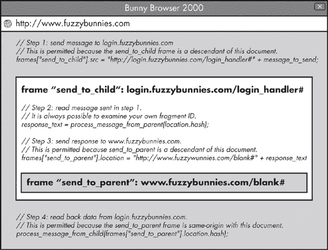
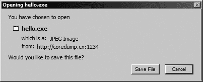
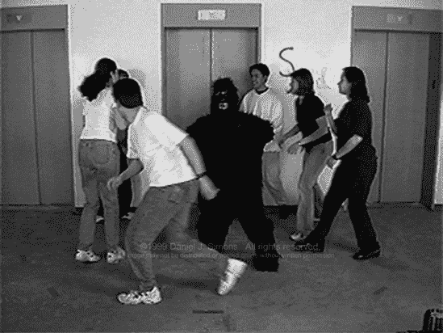

# 第二部分. 浏览器安全特性

在回顾了 Web 的基本构建块之后，我们现在可以舒适地检查所有保持恶意 Web 应用远离的安全特性。本书的第二部分探讨了从众所周知但常常被误解的同源策略到 IE 的神秘且专有的区域设置等所有内容。它解释了这些机制可以为您做什么——以及它们何时容易崩溃。

# 第九章. 内容隔离逻辑

网络浏览器提供的绝大多数安全保证都是为了根据其来源隔离文档。前提很简单：来自不同来源的两个页面不应该被允许相互干扰。然而，实际的实践可能更为复杂，因为关于单个文档的开始和结束在哪里，或者什么构成一个单一来源，并没有达成普遍的共识。结果是，有时不可预测的、相互矛盾的政策拼凑，它们并不完全协同工作，但如果不进行大幅调整，就会严重影响当前所有合法的 Web 使用。

除了这些问题之外，关于最初应该对哪些操作进行安全检查也缺乏清晰的了解。显然，一些交互，如跟随链接，应该在没有特殊限制的情况下允许，因为它们对于整个生态系统的健康至关重要，而其他一些操作，如修改在单独窗口中加载的页面内容，则应该需要进行安全检查。但在这些极端之间存在着一个很大的灰色区域，而这个中间地带往往感觉更像是由掷骰子决定的，而不是任何统一的计划。在这些浑浊的水域中，跨站请求伪造（见第四章 是 Netscape 在 1995 年与 JavaScript 和文档对象模型（DOM）一起引入的概念，就在 HTTP cookies 创建后的第二年。这一策略背后的基本规则很简单：对于任何两个独立的 JavaScript 执行上下文，一个应该能够访问另一个的 DOM，前提是与其宿主文档相关联的协议、DNS 名称和端口号完全匹配。所有其他跨文档的 JavaScript DOM 访问都应该失败。

该算法引入的协议-主机-端口号三元组通常被称为*源*。作为安全策略的基础，这相当稳健：SOP 在所有现代浏览器中得到了良好的实施，并且一致性很高，只有偶尔会出现错误.^([44]) 实际上，只有 Internet Explorer 与众不同，因为它在源检查中忽略了端口号。这种做法的安全性略低，尤其是在远程主机上运行 HTTP/0.9 网络服务器时，存在非 HTTP 服务的风险（参见第三章). 但通常这不会造成明显的差异。

表 9-1 展示了在多种情况下 SOP 检查的结果。

表 9-1. SOP 检查结果

| 原始文档 | 访问文档 | 非 IE 浏览器 | Internet Explorer |
| --- | --- | --- | --- |
| [`example.com/a/`](http://example.com/a/) | [`example.com/b/`](http://example.com/b/) | 访问正常 | 访问正常 |
| [`example.com/`](http://example.com/) | [`www.example.com/`](http://www.example.com/) | 主机不匹配 | 主机不匹配 |
| [`example.com/`](http://example.com/) | [`example.com/`](https://example.com/) | 协议不匹配 | 协议不匹配 |
| [`example.com:81/`](http://example.com:81/) | [`example.com/`](http://example.com/) | 端口不匹配 | 访问正常 |

### 注意

这个同源策略最初是为了仅控制对 DOM 的访问；也就是说，与实际显示文档内容相关的特性和方法。该策略已经逐渐扩展到保护根 JavaScript 对象的其他显然敏感区域，但并非涵盖所有。例如，非同源脚本通常仍然可以在任意窗口或框架上调用 *location.assign()* 或 *location.replace(...)*。这些特权的范围和后果是第十一章的主题。

SOP 的简单性既是祝福也是诅咒。该机制相对容易理解，并且正确实施并不太难，但它的僵化可能会给网络开发者带来负担。在某些情况下，该策略过于宽泛，使得无法（例如）隔离属于不同用户的首页（除非为每个用户分配一个单独的域名）。在其他情况下，情况正好相反：该策略使得合法合作的网站（例如，*login.example.com* 和 *payments.example.com*）难以无缝交换数据。

尝试解决第一个问题——缩小源的概念——通常会因为与浏览器中其他显式和隐式安全控制的交互而注定失败。尝试扩展源或促进跨域交互更为常见。实现这些目标广泛支持的两个方法如下：*document.domain* 和 *postMessage(...)*，如下所述。

## document.domain

这个 JavaScript 属性允许任何两个共享公共顶级域名（例如 *example.com*，甚至仅仅是 *.com*）的协作网站同意，为了未来源策略检查的目的，它们希望被视为等效。例如，*login.example.com* 和 *payments.example.com* 可能执行以下赋值：

```
document.domain = "example.com"
```

设置此属性将覆盖在源策略检查期间通常的域名匹配逻辑。尽管如此，协议和端口号仍然必须匹配；如果不匹配，调整 *document.domain* 也不会产生预期的效果。

双方必须明确选择此功能。仅仅因为 *login.example.com* 将其 *document.domain* 设置为 *example.com* 并不意味着它将被允许访问来自[`example.com/`](http://example.com/)网站的原始内容。该网站也需要执行这样的赋值，即使常识可能表明这是一个无操作。这种效果是对称的。正如设置 *document.domain* 的页面将无法访问未设置该属性的页面一样，设置属性的行为也将调用者大部分（但不是全部！）^([45]) 排除在之前被认为是同源的普通文档之外。表 9-2 显示了 *document.domain* 的各种值的效应。

尽管 *document.domain* 显示出一定程度的复杂性，暗示着某种特殊类型的巧妙，但它并不特别安全。它最显著的弱点是它邀请不受欢迎的访客。当双方相互将此属性设置为 *example.com* 后，不仅仅是 *login.example.com* 和 *payments.example.com* 将能够通信；*funny-cat-videos.example.com* 也能加入这个行列。而且由于页面之间允许的访问程度，任何参与 JavaScript 上下文的完整性都无法保证到任何实际的程度上。换句话说，触摸 *document.domain* 必然意味着将你页面的安全性绑定到整个域中最薄弱环节的安全性。将值设置为 **.com** 的极端情况本质上等同于协助自杀。

表 9-2. *document.domain* 检查的结果

| 原始文档 | 访问文档 | 结果 |
| --- | --- | --- |
| URL | document.domain | URL | document.domain |   |
| --- | --- | --- | --- | --- |
| [`www.example.com/`](http://www.example.com/) | *example.com* | [`payments.example.com/`](http://payments.example.com/) | *example.com* | 访问允许 |
| [`www.example.com/`](http://www.example.com/) | *example.com* | [`payments.example.com/`](https://payments.example.com/) | *example.com* | 协议不匹配 |
| [`payments.example.com/`](http://payments.example.com/) | *example.com* | [`example.com/`](http://example.com/) | **(未设置)** | 访问被拒绝 |
| [`www.example.com/`](http://www.example.com/) | **(未设置)** | [`www.example.com/`](http://www.example.com/) | *example.com* | 访问被拒绝 |

## postMessage(...)

*postMessage(...)* API 是一个 HTML5 扩展，允许在非同源站点之间进行稍微不那么方便但非常安全的通信，而不会自动放弃任何一方的完整性。今天，它被所有最新的浏览器支持，尽管由于它相对较新，它不在 Internet Explorer 6 或 7 中。

该机制允许发送任何长度的文本消息到任何发送者持有有效 JavaScript 句柄的窗口（参见第六章）。尽管同源策略存在一些漏洞，允许通过其他方式实现类似功能，^([46]) 但实际上这种方法是安全的。它允许发送者指定哪些源被允许首先接收消息（如果目标窗口的 URL 已更改），并且它向接收者提供了发送者的身份，以便可以轻松地确定通道的完整性。相比之下，依赖于 SOP 漏洞的旧方法通常不提供此类保证；如果某个特定操作在没有稳健的安全检查的情况下被允许，那么它通常也可以被恶意第三方触发，而不仅仅是预期参与者。

为了说明 *postMessage(...)* 的正确使用方法，考虑一个位于 *payments.example.com* 的顶级文档需要获取用户登录信息以供显示的情况。为此，它加载了一个指向 *login.example.com* 的框架。这个框架可以简单地发出以下命令：

```
parent.postMessage("user=bob", "https://payments.example.com");
```

浏览器只有在嵌入的网站确实匹配指定的、受信任的源时才会传递消息。为了安全地处理此响应，顶级文档需要使用以下代码：

```
// Register the intent to process incoming messages:
addEventListener("message", user_info, false);

// Handle actual data when it arrives:
function user_info(msg) {
  if (msg.origin == "https://login.example.com") {
    // Use msg.data as planned
  }
}
```

*PostMessage(...)* 是一个非常健壮的机制，与 *document.domain* 以及几乎所有早于它的游击战方法相比，提供了显著的好处；因此，它应该尽可能多地使用。尽管如此，它仍然可能被滥用。考虑以下检查，它在域名中查找子字符串：

```
if (msg.origin.indexOf(".example.com") != −1) { ... }
```

如应明显，这个比较不仅会匹配*example.com*内的网站，而且也会愉快地接受来自[www.example.com.bunnyoutlet.com](http://www.example.com.bunnyoutlet.com)的消息。在所有可能的情况下，你可能会不止一次地在你旅途中遇到这样的代码。这就是生活！

### 注意

最近对 HTML5 的调整扩展了*postMessage(...)* API，以包含某些过度设计的“端口”和“通道”，这些端口和通道旨在促进网站之间的流式通信。浏览器对这些特性的支持目前非常有限，它们的实际效用尚不清楚，但从安全角度来看，它们似乎并不引起任何特殊关注。

## 与浏览器凭证的交互

在我们结束基于 DOM 的同源策略概述时，重要的是要注意，它与环境凭证、SSL 状态、网络上下文或许多其他浏览器跟踪的潜在安全相关参数没有任何同步。在浏览器中打开的两个窗口或框架将保持同源关系，即使用户从一个账户注销并登录到另一个账户，如果页面从使用好的 HTTPS 证书切换到坏的证书，等等。

这种不同步可能导致其他安全漏洞的可利用性。例如，一些网站没有保护他们的登录表单免受跨站请求伪造攻击，允许任何第三方网站简单地提交用户名和密码，并将用户登录到攻击者控制的账户。起初这看起来可能无害，但考虑到在此操作前后加载到浏览器中的内容被认为是同源的，通常被忽视的“自造成的”跨站脚本漏洞（即，特定账户的所有者只能针对自己）的影响突然比之前看起来要大得多。在最基本的情况下，攻击者可能首先打开并保持一个指向目标网站上敏感页面的框架（例如，[`www.fuzzybunnies.com/address_book.php`](http://www.fuzzybunnies.com/address_book.php)）并然后登录受害者到攻击者控制的账户以在[fuzzybunnies.com](http://fuzzybunnies.com)的一个无关组件中执行自-XSS。尽管 HTTP 凭证发生了变化，但在那最后一步中注入的代码将不受限制地访问之前加载的框架，允许数据窃取。

* * *

^([43]) 这以及大多数其他浏览器安全机制都是基于 DNS 标签，而不是基于检查底层 IP 地址。这有一个奇特的结果：如果某个主机的 IP 地址发生变化，攻击者可能能够通过用户的浏览器与新的目的地进行通信，可能在进行滥用行为的同时隐藏攻击的真实来源（不幸，但并不很有趣）或者与受害者的内部网络进行交互，这在通常情况下由于防火墙的存在而无法访问（一个更成问题的情况）。出于此目的有意更改 IP 地址的行为被称为*DNS 重绑定*。浏览器试图通过例如缓存 DNS 查找结果一段时间（*DNS 固定*）等方式在一定程度上减轻 DNS 重绑定的风险，但这些防御措施并不完美。

^([44]) 同源策略漏洞的一个显著来源是浏览器代码中有多个独立的 URL 解析程序。如果在 HTTP 堆栈中使用的解析方法与用于确定 JavaScript 来源的方法不同，可能会出现问题。特别是 Safari，它对抗了由病态 URL 引起的许多 SOP 绕过漏洞，包括在第二章中讨论的许多输入。

^([45]) 例如，在 Internet Explorer 中，仍然有可能让一个页面导航到任何名义上是同源的但后来在设置*document.domain*后变为“隔离”的文档，到*javascript:* URL。这样做允许任何 JavaScript 在伪隔离域的上下文中执行。在此基础上，显然没有任何阻止原始页面简单地将其自己的*document.domain*设置为与目标相同的值以消除边界的。换句话说，不应依赖于通过*document.domain*将文档与其他页面非同源的能力来进行任何甚至稍微重要或与安全相关的操作。

^([46]) 更多关于这方面的内容请参阅第十一章，但最显著的例子是将数据编码在 URL 片段标识符中。这是可能的，因为大多数情况下，在框架中导航到新的 URL 不受安全限制，并且仅更改片段标识符的 URL 导航实际上不会触发页面刷新。框架化的 JavaScript 可以简单地轮询*location.hash*并以此方式检测传入的消息。

# XMLHttpRequest 的同源策略

本书在前面多次提到的 *XMLHttpRequest* API，赋予了 JavaScript 程序向主机文档来源的服务器发出几乎不受约束的 HTTP 请求的能力，并读取响应头部和文档主体。如果这种机制没有利用现有的浏览器 HTTP 栈及其便利性，包括环境凭据、缓存机制、保持连接会话等，那么这种能力就不会特别重要。

同步 *XMLHttpRequest* 的一个简单且相当直观的使用方法可以是以下这样：

```
var x = new XMLHttpRequest();
x.open("POST", "/some_script.cgi", false);
x.setRequestHeader("X-Random-Header", "Hi mom!");
x.send("...POST payload here...");
alert(x.responseText);
```

异步请求与同步请求非常相似，但它们不会阻塞 JavaScript 引擎或浏览器。请求在后台发出，并在完成后调用事件处理器。

如最初设想的那样，通过此 API 发出 HTTP 请求并读取数据的能力，受几乎完全相同的同源策略的约束，只有两个微小的、看似随机的调整。首先，*document.domain* 设置对此机制没有影响，并且为 *XMLHttpRequest.open(...)* 指定的目标 URL 必须始终与文档的真实来源相匹配。其次，在此上下文中，在 Internet Explorer 9 之前的版本中考虑了端口号，尽管此浏览器在其他地方忽略了它。

事实上，*XMLHttpRequest* 允许用户对请求中的 HTTP 头部进行前所未有的控制，这实际上可能对安全性有益。例如，插入一个自定义的 HTTP 头部，如 *X-Coming-From: same-origin*，是一个非常简单的方式来验证特定的请求不是来自第三方域名，因为没有任何其他网站应该能够向浏览器发出的请求中插入自定义头部。这种保证并不非常强，因为没有规范说明对跨域头部的隐式限制不能改变；^([47]) 然而，当涉及到网络安全时，这种假设通常是你必须学会接受的。

对 HTTP 请求结构的控制也可能成为一种负担，因为插入某些类型的头部可能会改变对目标服务器或代理的意义，而浏览器并没有意识到这一点。例如，指定一个错误的 *Content-Length* 值可能允许攻击者将第二个请求偷偷地放入浏览器维护的保持连接的 HTTP 会话中，如下所示。

```
var x = new XMLHttpRequest();
x.open("POST", "http://www.example.com/", false);

// This overrides the browser-computed Content-Length header:
x.setRequestHeader(`"Content-Length", "7"`);

// The server will assume that this payload ends after the first
// seven characters, and that the remaining part is a separate
// HTTP request.
x.send(
  "Gotcha!\n" +
  `"GET /evil_response.html HTTP/1.1\n" +`
  `"Host: www.bunnyoutlet.com\n\n"`
);
```

如果发生这种情况，浏览器可能会错误地解释第二个注入请求的响应，可能污染缓存或将内容注入到另一个网站。如果使用 HTTP 代理并且所有 HTTP 请求都通过共享通道发送，这个问题尤其明显。

由于这种风险，经过大量的尝试和错误，现代浏览器黑名单了一些 HTTP 头部和请求方法。这做得相对不太一致：虽然 *Referer*、*Content-Length* 和 *Host* 被普遍禁止，但诸如 *User-Agent*、*Cookie*、*Origin* 或 *If-Modified-Since* 的头部处理因浏览器而异。同样，由于对 *httponly* cookie 的未预料风险，TRACE 方法在所有地方都被阻止——但 CONNECT 方法在 Firefox 中被允许，尽管它带有可能破坏 HTTP 代理的模糊风险。

自然地，实现这些黑名单本身就是一个有趣的练习。仅为了娱乐，考虑以下在三年前一些浏览器中有效的情况：^([176])

```
XMLHttpRequest.setRequestHeader("X-Harmless", "1\n`Owned: Gotcha`");
```

或

```
XMLHttpRequest.setRequestHeader("`Content-Length: 123` ", "");
```

或简单地

```
XMLHttpRequest.open("`GET\thttp://evil.com\tHTTP/1.0\n\n`", "/", false);
```

### 注意

*跨源资源共享*^([177]) *(CORS)* 是对 *XMLHttpRequest* 的一个提议性扩展，允许跨域发起 HTTP 请求，并在返回的数据中出现特定响应头时读取。该机制通过允许某些“纯”跨域请求（旨在与常规导航无差异）通过 *XMLHttpRequest.open(...)* 发起，而不需要额外的检查；更复杂的请求需要先进行基于 OPTIONS 的预检请求。CORS 已在一些浏览器中可用，但遭到了微软工程师的反对，他们在 Internet Explorer 8 和 9 中追求了竞争性的 *XDomainRequest* 方法。由于这一冲突的结果尚不明确，对 CORS 的详细讨论留给了 第十六章，该章提供了一个更系统的对即将推出和实验性机制的概述。

* * *

^([47]) 事实上，许多插件在过去在这个领域存在问题。最值得注意的是，Adobe Flash 允许任意跨域 HTTP 头部信息，直到 2008 年，那时它的安全模型经历了重大改革。直到 2011 年，该插件还遭受了一个长期存在的实现错误，导致它在攻击者提供的 HTTP 307 重定向代码之后向一个无关的服务器重新发送任何自定义头部。这两个问题现在都已修复，但发现到修复的时间证明是麻烦的。

# Web Storage 的同源策略

Web storage 是一个简单的数据库解决方案，最初由 Mozilla 工程师在 Firefox 1.5 中实现，最终被 HTML5 规范所采纳。它在所有当前浏览器中可用，但在 Internet Explorer 6 或 7 中不可用。

经过几次可疑的迭代后，当前的设计依赖于两个简单的 JavaScript 对象：*localStorage* 和 *sessionStorage*。这两个对象提供了一个相同且简单的 API，用于在浏览器管理的数据库中创建、检索和删除键值对。例如：

```
localStorage.setItem("message", "Hi mom!");
alert(localStorage.getItem("message"));
localstorage.removeItem("message");
```

*localStorage* 对象实现了一种持久、特定源存储，它能在浏览器关闭后继续存在，而 *sessionStorage* 则预期与当前浏览器窗口绑定，提供一个在浏览会话结束时被销毁的临时缓存机制。虽然规范说明 *localStorage* 和 *sessionStorage* 都应与类似 SOP 的源（协议-主机-端口号三元组）相关联，但某些浏览器的实现并未遵循这一建议，引入了潜在的安全漏洞。最值得注意的是，在 Internet Explorer 8 中，计算源时不考虑协议，导致 HTTP 和 HTTPS 页面处于同一个上下文中。这种设计使得 HTTPS 站点通过此 API 存储或读取敏感数据非常不安全。（此问题在 Internet Explorer 9 中得到修正，但似乎没有计划回滚此修复。）

另一方面，在 Firefox 中，*localStorage* 的行为是正确的，但 *sessionStorage* 接口则不正确。HTTP 和 HTTPS 使用共享存储上下文，尽管实现了检查以防止 HTTP 内容读取由 HTTPS 脚本创建的键，但存在一个严重的漏洞：任何首先通过 HTTP 创建，然后通过 HTTPS 更新的键，将始终对非加密页面可见。这个最初在 2009 年报告的漏洞^([179])最终将被解决，但具体时间尚不清楚。

# 钩子安全策略

我们在第三章中讨论了 HTTP cookies 的语义，但那次讨论遗漏了一个重要细节：必须实施的安全规则，以保护一个站点的 cookies 不被无关页面篡改。这个话题特别有趣，因为这里采取的方法早于同源策略，并以多种意想不到的方式与之交互。

Cookies 旨在限定于域，并且不能轻易限制为仅单个主机名值。与 cookie 一起提供的 *domain* 参数可能仅匹配当前主机名（例如 *foo.example.com*），但这不会阻止 cookie 被发送到任何子域，例如 *bar.foo.example.com*。可以通过指定主机名的合格右端片段（例如 *example.com*）来请求更广泛的范围。

有趣的是，原始的 RFCs 暗示 Netscape 工程师想要允许精确的主机域 cookies，但他们没有遵循自己的建议。为此目的设计的语法没有被 Netscape Navigator 的后代（或任何其他实现）所认可。在一定程度上，通过完全省略 *domain* 参数，在某些浏览器中可以设置主机域 cookies，但在 Internet Explorer 中这种方法将没有任何效果。

表 9-3 展示了在某些特定情况下 cookie 设置行为。

表 9-3. Cookie 设置行为的示例

| 在*foo.example.com*设置的 cookie，*domain*参数是： | 结果 cookie 的作用域 |
| --- | --- |
| 非 IE 浏览器 | Internet Explorer |
| --- | --- |
| (value omitted) | *foo.example.com* (exact) | **.foo.example.com* |
| *bar.foo.example.com* | Cookie not set: domain more specific than origin |
| *foo.example.com* | **.foo.example.com* |
| *baz.example.com* | Cookie not set: domain mismatch |
| *example.com* | **.example.com* |
| *ample.com* | Cookie not set: domain mismatch |
| *.com* | Cookie not set: domain too broad, security risk |

唯一的另一个真正的 cookie 作用域参数是路径前缀：任何 cookie 都可以设置一个指定的*path*值。这指示浏览器仅在请求匹配的目录时发送 cookie；一个作用域为*example.com*的*domain*和*path*为*/some/path/*的 cookie 将包含在请求到

```
http://foo`.example.com/some/path/`subdirectory/hello_world.txt
```

这种机制可能会产生误导。在检查同源策略时，URL 路径不被考虑，因此不能形成一个有用的安全边界。无论 cookie 如何工作，JavaScript 代码都可以随意跳转到单个主机上的任何 URL，并将恶意负载注入到这些目标中，滥用任何受路径边界 cookie 保护的功能。（至今仍有几本安全书籍和白皮书推荐将路径作用域作为安全措施。在大多数情况下，这种建议是错误的。）

除了真正的作用域功能（这些功能与 cookie 名称一起构成一个元组，唯一地标识了每个 cookie）之外，Web 服务器还可以输出带有两个特殊、独立操作的标志的 cookie：*httponly*和*secure*。第一个，*httponly*，通过防止通过*document.cookie* API 访问 cookie，希望使其更难在成功注入恶意脚本后简单地复制用户的凭据。第二个，*secure*，阻止 cookie 在未加密的协议上的请求中提交，这使得构建能够抵御主动攻击的 HTTPS 服务成为可能。^([[48])

这些机制的陷阱在于它们只保护数据免受读取，而不保护免受覆盖。例如，通过 HTTP 传输的 JavaScript 代码仍然可以简单地溢出每个域的 cookie 容器，然后设置一个新的 cookie 而不使用 *secure* 标志。⁴⁹ 由于浏览器发送的 *Cookie* 标头没有提供有关特定 cookie 的来源或其作用域的元数据，这种技巧很难检测。这种行为的一个显著后果是，常见的“无状态”方式防止跨站请求伪造漏洞，即同时在一个客户端 cookie 和一个隐藏表单字段中存储一个秘密令牌，然后比较这两个令牌，对于 HTTPS 网站来说并不特别安全。看看你是否能弄清楚为什么！

### 注意

说到破坏性干扰，直到 2010 年，*httponly* cookies 也与 *XMLHttpRequest* 发生冲突。该 API 的作者根本没有考虑过 *XMLHttpRequest.getResponseHeader(...)* 函数是否应该能够检查标记为 *httponly* 的服务器提供的 *Set-Cookie* 值——结果是可预见的。

## Cookies 对同源策略的影响

同源策略对 cookies 的安全性（特别是路径范围机制）有一些不良影响，但相反的交互更为常见且更成问题。困难在于 HTTP cookies 经常充当凭证，在这种情况下，获取它们的能力大致等同于找到绕过 SOP 的方法。简单地说，有了正确的一组 cookies，攻击者可以使用自己的浏览器代表受害者与目标网站交互；同源策略就被排除在外，所有的赌注都取消了。

由于这个特性，两种安全机制之间的任何差异都可能导致对限制更严格的那一方造成麻烦。例如，HTTP cookies 使用的相对宽松的域范围规则意味着无法完全隔离托管在 *webmail.example.com* 上的敏感内容与托管在 *blog.example.com* 上的不太可信的 HTML。即使 webmail 应用的所有者将 cookies 的范围限制得很紧（通常是以复杂化登录过程为代价），任何在博客网站上发现脚本注入漏洞的攻击者都可以简单地溢出每个域的 cookie 容器，丢弃当前的凭证，并设置自己的 **.example.com** cookies。这些注入的 cookies 将在所有后续请求中发送到 *webmail.example.com*，并且与真实的 cookies 几乎无法区分。

这个技巧看起来可能无害，直到你意识到这样的行为可能会有效地将受害者登录到一个虚假账户，并且因此，某些操作（如发送电子邮件）可能会在该账户中无意中记录下来，并在任何恶行被发现之前泄露给攻击者。如果你觉得 webmail 太陌生，考虑在 Amazon 或 Netflix 上做同样的事情：你的产品搜索可能会在你注意到网站有任何异常之前被攻击者发现。（此外，许多网站根本未准备好处理注入 cookie 中的恶意负载，意外的输入可能导致 XSS 或类似的漏洞。）

HTTP cookie 的恶作剧也使得在网络级别攻击者面前保护加密流量变得非常困难。由[`webmail.example.com/`](https://webmail.example.com/)设置的*安全*cookie 仍然可能被篡改并被[`webmail.example.com/`](http://webmail.example.com/)上的伪造页面设置的虚构值所替代，即使目标主机上没有实际监听 80 端口的网络服务。

## 域限制问题

允许域级 cookie 的错误观念也给浏览器供应商带来了问题，并且是持续痛苦的来源。关键问题是如何可靠地防止*example.com*为**.com**设置 cookie，并避免这个 cookie 意外地发送到互联网上的每个其他目的地。

虽然有几个简单的解决方案，但当你必须考虑国家级 TLD 时，它们就会失效：*example.com.pl*也必须防止设置**.com.pl**的 cookie。意识到这一点，原始的 Netscape cookie 规范提供了以下建议：

> 只有指定域内的主机才能为该域设置 cookie，并且域必须至少包含两个（2）或三个（3）点，以防止形式为“ .com”，“ .edu”，“ va.us”的域。
> 
> 在以下七个特殊顶级域之一中失败的任何域只需要两个点。其他域至少需要三个点。这七个特殊顶级域是：“COM”，“EDU”，“NET”，“ORG”，“GOV”，“MIL”，“INT”。

然而，三段式规则只适用于像*example.co.uk*这样的顶级域镜像的国家级注册商，而不适用于同样人口众多的直接注册接受国家群体（如*example.fr*）。实际上，有些地方两种方法都是允许的；例如，*example.jp*和*example.co.jp*都是完全可行的。

由于这些建议与实际脱节，大多数浏览器都忽视了它们，并实施了一系列条件表达式，这反而导致了更多的问题。（在一种情况下，超过十年，你实际上可以为**.com.pl**设置 cookie。）在过去四年中，所有现代浏览器都发布了针对国家代码顶级域处理的综合修复方案，但截至本文撰写时，它们还没有被回滚到 Internet Explorer 6 和 7，而且可能永远不会。

### 注意

更令人愤慨的是，互联网数字分配机构近年来添加了相当数量的顶级域名（例如，*.int*和*.biz*），并且正在考虑一个允许任意通用顶级域名注册的提案。如果真的发展到这一步，cookie 可能不得不从头开始重新设计。

## “localhost”的异常危险

域级作用域的 cookie 存在的一个明显后果是，将敏感域内的任何主机名委托给任何不可信（或简单来说易受攻击）的第三方都是相当不安全的；这样做可能会影响任何存储在 cookie 中的凭证的机密性，并且不可避免地会影响其完整性——进而影响目标应用程序处理的其他任何信息。

很明显，但在 2008 年，Tavis Ormandy 发现了一些远不如直观且更加滑稽的事情：180] 由于 HTTP cookie 的无端口感知行为，一个额外的危险在于相当流行且方便的行政实践，即在域中添加一个“localhost”条目，并将其指向 127.0.0.1。50] 当 Ormandy 首次发布他的警告时，他断言这种做法很普遍——这不是一个有争议的声明——并包括以下解析器工具输出以说明他的观点：

```
localhost.microsoft.com has address 127.0.0.1
localhost.ebay.com has address 127.0.0.1
localhost.yahoo.com has address 127.0.0.1
localhost.fbi.gov has address 127.0.0.1
localhost.citibank.com has address 127.0.0.1
localhost.cisco.com has address 127.0.0.1
```

为什么这会是一个安全风险？简单地说，它将用户机器上的 HTTP 服务与网站的其他部分放在同一个域中，更重要的是，它将所有看似 HTTP 的服务放在同一个桶中。这些服务通常不会暴露在互联网上，因此没有感知到需要精心设计它们或保持它们更新的需求。Tavis 的案例是一个由 CUPS（通用 UNIX 打印系统）提供的打印机管理服务，如果以以下方式调用，它将在*example.com*的上下文中执行攻击者提供的 JavaScript：

```
http://localhost.example.com:631/jobs/?[...]
  &job_printer_uri=`javascript:alert("Hi mom!")`
```

CUPS 中的漏洞可以修复，但所有操作系统上可能还有许多其他可疑的本地服务——从磁盘管理工具到防病毒状态仪表板应有尽有。引入指向 127.0.0.1 或其他你无法控制的任何目的地的条目，将你域内 cookie 的安全性绑定到随机第三方软件的安全性。这是应该避免的好事。

## Cookie 和“合法”DNS 劫持

对于 cookie 的域作用域策略的危险并不局限于 *localhost*。另一个意想不到的交互与一些 ISP 和其他 DNS 服务提供商的常见、广泛批评的做法有关，即劫持对不存在（通常是拼写错误）的主机的域名查找。在这个方案中，提供商不是从上游名称服务器返回标准要求的 NXDOMAIN 响应（这会随后在浏览器或其他网络应用程序中触发错误消息），而是伪造一个记录来暗示该名称解析到其网站。其网站反过来会检查浏览器提供的 *Host* 头部，并向用户提供看似与她浏览兴趣相关的不请自来的、付费的上下文广告。这种做法通常提供的正当理由是提供更用户友好的浏览体验；当然，真正的动机是赚取更多利润。

依赖这种做法的互联网服务提供商包括 Cablevision、Charter、Earthlink、Time Warner、Verizon 以及许多更多。不幸的是，他们的方法不仅道德上有疑问，而且也创造了重大的安全风险。如果广告网站包含任何脚本注入漏洞，攻击者可以通过访问诸如 *nonexistent.example.com* 这样的地址来利用这些漏洞，在任意其他域的上下文中。当与 HTTP cookie 的设计相结合时，这种做法破坏了互联网上任何任意目标服务的安全性。

预计之下，这种匆忙设计的广告陷阱中可以轻易地发现脚本注入漏洞。例如，在 2008 年，丹·卡明斯基发现了并公开了一个由 Earthlink 运营的页面上的跨站脚本漏洞.^([181])

好吧，好吧：是时候停止对 cookie 的痴迷，继续前进。

* * *

^([48]) 即使提供的网址 *https://webmail.example.com/* 只能通过 HTTPS 访问，如果它使用了一个未锁定到加密协议的 cookie，攻击者只需等待受害者导航到 [`www.fuzzybunnies.com/`](http://www.fuzzybunnies.com/)，就可以在页面上静默地注入一个指向 [`webmail.example.com/`](http://webmail.example.com/) 的框架，然后拦截产生的 TCP 握手。此时，浏览器将发送所有 *webmail.example.com* 的 cookie 通过未加密的通道，游戏基本上就结束了。

^([49]) 即使通过将 *httponly* 和普通 cookie 的 jar 分开来防止这种可能性，也必须允许存在多个同名但作用域不同的 cookie，它们将在任何匹配的请求中一起发送。它们不会伴随任何有用的元数据，并且它们的顺序将是未定义的，并且是浏览器特定的。

^([50]) 这个 IP 地址是为回环接口保留的；任何尝试连接到它的尝试都会将您路由回您自己机器上运行的服务。

# 插件安全规则

浏览器并没有为插件开发者提供一个统一和可扩展的 API 来强制执行安全策略；相反，每个插件都决定应该应用于执行内容哪些规则以及如何实施它们。因此，尽管插件安全模型在某种程度上受到同源策略的启发，但在许多方面都与它不同。

这种脱节可能很危险。在第六章中，我们讨论了插件倾向于检查 JavaScript *location*对象以确定其宿主页面的来源的趋势。这种错误的做法迫使浏览器开发者限制 JavaScript 程序对其运行时环境的某些部分的篡改能力，以挽救局面。另一个相关的、常见的兼容性问题来源是对 URL 的解释。例如，在 2010 年中旬，一位研究人员发现 Adobe Flash 在以下 URL 上存在问题:^([182])

```
http://example.com:80@bunnyoutlet.com/
```

插件决定通过此 URL 检索的任何代码的来源应设置为*example.com*，但浏览器在遇到此类 URL 时，自然会从[bunnyoutlet.com](http://bunnyoutlet.com)检索数据，然后将它交给困惑的插件执行。

虽然这个特定的漏洞现在已经修复，但未来可能还会出现这种类型的其他漏洞。复制第二章和第三章中讨论的一些 URL 解析怪癖可能是一项徒劳的任务，理想情况下，根本不应该尝试。

在这样的悲观基调下结束这一章是不礼貌的！除了系统性问题之外，让我们看看一些最受欢迎的插件是如何处理安全策略强制执行的。

## Adobe Flash

Flash 安全模型在 2008 年经历了重大改革^([183])，自那以后，它已经相当稳健。现在每个加载的 Flash 小程序都被分配了一个类似于 SOP 的来源，该来源来自其原始 URL^([51])，并且被授予与 JavaScript 相当的名义来源相关权限。特别是，每个小程序都可以从其原始站点加载经过 cookie 认证的内容，从其他来源加载一些受限制的数据类型，并且可以通过*URLRequest* API 进行类似*XMLHttpRequest*的 HTTP 调用。这个最后 API 允许的方法和请求头集合被相当合理地管理，并且截至本文撰写时，比大多数浏览器级别的*XMLHttpRequest*黑名单更为严格.^([184])

在这个合理的基线之上，三种灵活但容易被误用的机制允许在一定程度上修改这种行为，如以下所述。

### 标记级别安全控制

嵌入页面可以通过*<embed>*或*<object>*标签提供的三个特殊参数来指定，以控制小程序如何与其宿主页面和浏览器本身交互：

+   允许脚本访问**参数**此设置控制小程序使用 JavaScript *ExternalInterface.call(...)*桥接（见第八章*。然而，截至本文写作时，所有脚本 URL 都应该在此场景中被列入黑名单。）

+   允许全屏**参数**此参数控制小程序是否应被允许进入全屏渲染模式。可能的值是*true*和*false*，其中*false*是默认值。如第八章

*Security.allowDomain(...)*方法允许 Flash 小程序将其变量和函数授予来自不同源的所有 JavaScript 代码或其他小程序。购买者请注意：一旦授予此类访问权限，就再也没有可靠的方法来维护原始 Flash 执行上下文的完整性。授予此类权限的决定不应轻率行事，并且通常应严厉惩罚调用*allowDomain("*")*的做法。

注意，还有一个名为*allowInsecureDomain(...)*的奇怪方法也是可用的。这个方法的存在并不表明*allowDomain(...)*特别安全；相反，提供“不安全”变体是为了与古老的、2003 年之前的语义兼容，这些语义完全忽略了 HTTP/HTTPS 的划分。

### 跨域策略文件

通过使用 *loadPolicyFile(...)*，任何 Flash 小程序都可以指示其运行时环境从几乎任意的 URL 检索安全策略文件。这个基于 XML 的文档，通常命名为 *crossdomain.xml*，将被解释为对跨域、服务器级访问由检查策略 URL 确定的源的表达同意。^([[186])] 策略文件的语法相当直观，可能看起来像这样：

```
<cross-domain-policy>
  <allow-access-from domain="foo.example.com"/>
  <allow-http-request-headers-from domain="*.example.com"
     headers="X-Some-Header" />
</cross-domain-policy>
```

政策可能允许通过浏览器 HTTP 堆栈执行诸如加载跨源资源或使用白名单头发出任意 *URLRequest* 调用等操作。Flash 开发者确实尝试执行一定程度上的路径分离：从特定子目录加载的策略原则上只允许访问该路径内的文件。然而，在实践中，与 SOP（安全策略）以及现代浏览器和 Web 应用程序框架的各种路径映射语义的交互使得依赖这种边界是不明智的。

### 注意

通过 *XMLSocket* 建立原始 TCP 连接也是可能的，并且由 XML 策略控制。但是，在 Flash 于 2008 年进行重大改版之后，*XMLSocket* 要求在目标服务器的 TCP 端口 843 上交付一个单独的策略文件。这是相当安全的，因为在这个端口上没有运行其他常见服务，并且在许多操作系统上，只有特权用户可以在任何低于 1024 的端口上启动服务。由于与某些防火墙级机制（如 FTP 协议助手）的交互，这种设计可能仍然会导致一些网络级干扰，^([[187])] 但这个主题远远超出了本书的范围。

如预期的那样，配置不当的 *crossdomain.xml* 策略是一个明显的安全风险。特别是，指定指向任何你对其没有完全信心的域的 *allow-access-from* 规则是一个非常糟糕的想法。此外，将“`*`”指定为该参数的值大致等同于执行 *document.domain = “com”*。也就是说，这是自寻死路。

### 策略文件欺骗风险

除了配置错误的可能性之外，Adobe 基于策略的安全模型中另一个安全风险是，随机用户控制的文档可能被解释为跨域策略，这与网站所有者的意图相反。

在 2008 年之前，Flash 使用了一个臭名昭著的宽松策略解析器，在处理 *loadPolicyFile(...)* 文件时会跳过任意前导垃圾以寻找开头的 *<cross-domain-policy>* 标签。它还会简单地忽略服务器在下载资源时返回的 MIME 类型。因此，仅仅托管一个有效的、用户提供的 JPEG 图像就可能成为一个严重的安全风险。插件还会跳过任何 HTTP 重定向，因此向一个你无法控制的地点（一个在其他方面无害的行为）发出 HTTP 重定向是危险的。

在对*loadPolicyFile*行为进行必要的改进之后，许多重大错误已经得到纠正，但默认设置仍然不完美。一方面，重定向现在工作得直观，文件必须是一个格式良好的 XML 文档。另一方面，允许的 MIME 类型包括*text/**, *application/xml*, 和 *application/xhtml+xml*，这感觉有点太宽泛。*text/plain*或*text/csv*可能会被误解释为策略文件，而这不应该发生。

幸运的是，为了减轻这个问题，Adobe 工程师决定推出*meta-policies*，这些策略托管在预定义的顶级位置（*/crossdomain.xml*），攻击者无法覆盖。元策略可以指定从攻击者提供的 URL 加载的所有剩余策略的网站范围限制。其中最重要的限制是*<site-control permitted-cross-domain-policies="...">*。当此参数设置为*master-only*时，简单地向插件指示完全忽略子策略。另一个不那么激进的值，*by-content-type*，允许加载额外的策略，但要求它们必须有一个非歧义的*Content-Type*头，设置为*text/x-cross-domain-policy*。

不言而喻，强烈建议使用指定这两个指令之一的元策略。

## 微软 Silverlight

如果从 Flash 过渡到 Silverlight 看起来很突然，那是因为两者很容易混淆。Silverlight 插件以惊人的热情借鉴了 Flash；事实上，可以说它们之间的安全模型差异大部分仅仅是因为命名。微软的平台使用相同的源确定方法，用*enableHtmlAccess*替换了*allowScriptAccess*，用稍微不同的*clientaccesspolicy.xml*语法替换了*crossdomain.xml*，提供了*System.Net.Sockets* API 而不是*XMLSocket*，用*HttpWebRequest*代替了*URLRequest*，重新排列了花，还更换了客厅的窗帘。

它们之间的相似之处非常明显，甚至包括*HttpWebRequest* API 阻止的请求头列表，甚至包括 Adobe 规范中的*X-Flash-Version*。188] 这种一致性并不是问题：事实上，与完全新的安全模型相比，这是更可取的。此外，值得称赞的是，微软确实做了一些受欢迎的改进，包括放弃不安全的*allowDomain*逻辑，转而采用*RegisterScriptableObject*方法，这种方法只允许显式指定的回调暴露给第三方域。

## Java

Sun 的 Java（现在正式属于 Oracle）是一个非常有趣的情况。Java 是一个已经不再使用的插件，其安全架构在过去十年左右的时间里并没有得到太多的审查。然而，由于其庞大的安装基础，很难简单地忽略它并继续前进。

不幸的是，越深入地观察，越明显的是，Java 所采纳的理念往往与现代网络不兼容。例如，一个名为 *java.net.HttpURLConnection*^([189]) 的类允许对小程序的源网站发起带有凭证的 HTTP 请求，但“源网站”被理解为在特定 IP 地址上托管的所有网站，这是由 *java.net.URL.equals(...)* 检查所认可的。这种模型本质上取消了 HTTP/1.1 虚拟主机之间的任何隔离——这种隔离是由同源策略、HTTP 饼干和今天几乎所有其他浏览器安全机制严格实施的。

沿着这些思路进一步，*java.net.URLConnection* 类^([190]) 允许小程序设置任意请求头，包括 *Host*，并且另一个类，*Socket*^([191]) 允许在源服务器上的任意端口建立不受限制的 TCP 连接。所有这些行为在浏览器和任何其他当代插件中都是不被推荐的。

小程序通过 *JSObject* 机制提供对嵌入页面的无原点访问，并期望通过在 *<applet>*, *<embed>*, 或 *<object>* 标签中指定的 *mayscript* 属性来由嵌入方控制.^([192]) 文档建议这是一个安全特性：

> 由于安全原因，Java 插件默认不启用 JSObject 支持。要启用 Java 插件中的 JSObject 支持，需要在 EMBED/OBJECT 标签中存在一个名为 MAYSCRIPT 的新属性。

不幸的是，文档没有提到另一个与之密切相关的机制，*DOMService*^([193]) 忽略了这个设置，并给予小程序对嵌入页面的几乎不受限制的访问。虽然 *DOMService* 在 Firefox 和 Opera 中不受支持，但它在其他浏览器中可用，这使得加载第三方 Java 内容的任何尝试都等同于授予嵌入站点的完全访问权限。

哎呀。

### 注意

有趣的事实：Java 的最新版本试图复制 Flash 中的 *crossdomain.xml* 支持。

* * *

^([51]) 在某些情况下，Flash 可能隐式允许从 HTTPS 原始地访问 HTTP，但不是反过来。这通常是无害的，因此在本节的其余部分没有给予特殊关注。

^([52]) 不应假设这种设置可以阻止任何恶意小程序可用的敏感数据被转发给第三方。任何 Flash 小程序都可以利用许多旁路通道，在不直接发出网络请求的情况下，将信息泄露给合作方。在最简单和最普遍的情况下，可以通过操纵 CPU 负载来向任何同时加载的小程序发送单个信息位，这些小程序会持续采样其运行时环境的响应性。

# 应对模糊或意外的来源

这就结束了我们对基本安全策略和同意隔离机制的概述。如果要说一个观察结果，那就是这些机制中的大多数都依赖于一个良好形成的、规范的主机名，以便从中推导出所有后续操作的环境上下文。但假如这个信息不可用或者不是以预期的形式呈现呢？

好吧，事情变得有趣了。让我们看看一些常见的边缘情况，即使只是为了短暂的娱乐。

## IP 地址

由于在设计 HTTP cookie 和同源策略时未能考虑到 IP 地址，几乎所有浏览器都历史性地允许从，比如说，*http://1.2.3.4/*加载的文档为名为**.3.4**的“域名”设置 cookie。以类似的方式调整*document.domain*也会有效。事实上，这些行为中的一些仍然存在于较老版本的 Internet Explorer 中。

这种行为不太可能对主流 Web 应用产生影响，因为这些应用并不是通过基于 IP 的 URL 访问的，并且通常会简单地无法正常工作。但有一些系统，主要用于技术人员，是通过它们的 IP 地址访问的；这些系统可能根本就没有配置 DNS 记录。在这些情况下，*http://1.2.3.4/*向*http://123.234.3.4/*注入 cookie 的能力可能成为一个问题。家庭路由器的 IP 可达管理接口也引起了一些兴趣。

## 带有额外句点的主机名

在本质上，设置 cookie 的算法仍然依赖于计算 URL 中句点的数量，以确定特定的*域名*参数是否可接受。为了做出这个判断，通常会将这个计数与供应商维护的数百个条目的公共后缀列表（[`publicsuffix.org/`](http://publicsuffix.org/)）相关联。

不幸的是，对于这个算法来说，通常可以在主机名中添加额外的点，同时仍然正确解析。带有额外点的非规范主机名表示通常被操作系统级别的解析器所尊重，如果被尊重，将会使浏览器困惑。尽管如此，浏览器不会自动将带有额外尾点的域名[www.example.com.pl](http://www.example.com.pl)视为与真实的[www.example.com.pl](http://www.example.com.pl)相同。（带有额外的尾点）URL 中的微妙且看似无害的差异可能会逃过甚至最警觉的用户。

在这种情况下，与带有尾点的 URL 交互可能是不安全的，因为共享**.com.pl**域的其他文档可能能够相对容易地注入跨域 cookies。

这种点计数问题首次在 1998 年左右被发现.^([194]) 十年后，许多浏览器供应商决定通过在相关代码中添加另一个特殊情况来实施基本缓解措施；截至本文撰写时，Opera 仍然容易受到这种技巧的影响。

## 非完全合格的主机名

许多用户在不知道的情况下，使用配置了将本地后缀附加到所有找到的主机名的 DNS 解析器浏览网络。这种设置通常由 ISP 或雇主通过自动网络配置数据（动态主机配置协议，DHCP）授权。

对于使用这种设置的任何用户，DNS 标签的解析是模糊的。例如，如果 DNS 搜索路径包括*coredump.cx*，那么[www.example.com](http://www.example.com)可能解析到真实的[www.example.com](http://www.example.com)网站，或者如果存在这样的记录，解析到[www.example.com.coredump.cx](http://www.example.com.coredump.cx)。结果部分受配置设置控制，并在一定程度上可能受到攻击者的影响。

对于浏览器来说，这两个位置看起来是相同的，这可能会产生一些有趣的副作用。考虑一个特别扭曲的情况：*http://com*，实际上解析到[`com.coredump.cx/`](http://com.coredump.cx/)，是否能够通过简单地省略*domain*参数来设置**.com** cookies？

## 本地文件

由于通过*file:*协议加载的本地资源没有与它们关联的显式主机名，浏览器无法计算正常的源。在很长一段时间里，供应商简单地决定在这种情况下最好的做法就是简单地放弃同源策略。因此，任何保存到磁盘的 HTML 文档都会自动获得通过*XMLHttpRequest*或 DOM 访问任何其他本地文件的权限，甚至更令人费解的是，能够以相同的方式访问任何来自互联网的内容。

这证明是一个糟糕的设计决策。没有人预料到仅仅下载一个 HTML 文档的行为就会将用户的本地文件和在线凭证置于危险之中。毕竟，通过网络访问相同的文档是完全安全的。

许多浏览器近年来试图以不同程度的成功关闭这一漏洞：

**Chrome（以及由此扩展的其他 WebKit 浏览器）**

Chrome 浏览器完全禁止从 *file:* 原始来源进行任何跨文档 DOM 或 *XMLHttpRequest* 访问，并且在此设置中忽略 *document.cookie* 调用或 *<meta http-equiv="Set-Cookie" ...>* 指令。允许访问所有 *file:* 文档共享的 *localStorage* 容器，但这种情况可能很快会改变。

**Firefox**

Mozilla 的浏览器只允许访问原始文档目录内的文件以及附近的子目录。这项政策相当不错，但仍然对存储或以前下载到该位置的文档存在一定风险。通过 *document.cookie* 或 *<meta http-equiv="Set-Cookie" ...>* 访问 cookie 是可能的，并且所有 *file:* cookie 都对任何其他本地 JavaScript 代码可见.^([53]) 对于访问存储机制也是如此。

**Internet Explorer 7 及以上版本**

允许从 *file:* 原始来源无限制地访问本地和互联网内容，但需要用户点击一个非特定的警告来首先执行 JavaScript。这一行动的后果没有明确说明（帮助系统神秘地表示，“Internet Explorer 限制此内容，因为这些程序偶尔可能会出错或给你不想要的内容”），许多用户可能会被误导而点击提示。

Internet Explorer 的 cookie 语义与 Firefox 类似。在此原始来源中不支持 Web 存储。

**Opera** 和 **Internet Explorer 6**

这两种浏览器都允许无限制的 DOM 或 *XMLHttpRequest* 访问，而不进行进一步检查。也允许非分区的 *file:* cookie。

### 注意

插件在 *file:* 领域按照自己的规则运行：Flash 使用 *local-with-filesystem* 沙盒模型，^([195]) 这为本地文件系统提供了大量不受限制的访问权限，无论浏览器本身执行的政策如何，而从本地文件系统执行 Java 或 Windows Presentation Framework 小程序在某些情况下可能大致等同于运行不可信的二进制文件。

## 伪 URL

类似于 *about:*、*data:* 或 *javascript:* 这样的伪 URL 的行为最初构成了同源策略实现中的一个重大漏洞。所有这样的 URL 都会被视为同源，并允许不受限制的跨域访问来自加载了相同方案的任何其他资源。当前的行为与之前大相径庭，将是本书下一章的主题；简而言之，现状反映了多次匆忙实施的改进，是浏览器特定特殊情况与源继承规则复杂混合的结果。

## 浏览器扩展和 UI

几种浏览器允许基于 JavaScript 的 UI 元素或某些用户安装的浏览器扩展以提升权限运行。这些权限可能包括绕过特定的 SOP 检查或调用通常不可用的 API 来写入文件、修改配置设置等。

特权 JavaScript 是 Firefox 的一个显著特性，在那里它与 XUL 一起用于构建浏览器用户界面的大部分。Chrome 也依赖于特权 JavaScript，程度较小但仍很显著。

同源策略并没有以任何特定方式支持特权上下文。实际授予额外权限的机制可能涉及通过特殊且通常无法到达的 URL 方案（如 *chrome:* 或 *res:*）加载文档，然后在浏览器代码的其他部分为该方案添加特殊案例。另一种选择是简单地为一个 JavaScript 上下文切换一个二进制标志，无论其实际源是什么，然后在之后检查该标志。在所有情况下，标准 API（如 *localStorage*、*document.domain* 或 *document.cookie*）的行为可能难以预测，不应依赖：一些浏览器试图在不同扩展的上下文之间保持隔离，但大多数并不这样做。

### 注意

在编写浏览器扩展时，与非特权上下文的任何交互都必须极端谨慎地进行。检查不受信任的上下文可能很困难，使用诸如 *eval(...)* 或 *innerHTML* 这样的机制可能会打开权限提升路径。

* * *

^([53]) 由于 *file:* 钩子之间没有隔离，因此依赖它们进行合法目的是不安全的。一些本地安装的 HTML 应用程序忽略了这一建议，因此它们的 cookie 可以很容易地被用户查看的任何下载的、可能恶意的内容篡改。

# 源的其他用途

好吧，关于浏览器级别的内容隔离逻辑就说到这里。也许值得指出的是，原点和基于主机或域的安全机制的概念并不仅限于那个特定任务，并在浏览器世界中出现了许多其他情况。其他基于准原点的隐私或安全特性包括与每个站点相关的首选项和缓存信息、弹出窗口阻止、地理位置共享、密码管理、摄像头和麦克风访问（在 Flash 中），以及更多。这些特性至少在一定程度上与本章中描述的安全特性相互作用；我们将在不久的将来更详细地探讨这个主题。

安全工程备忘单

所有网站的优秀安全策略

为了保护您的用户，包括一个顶层 *crossdomain.xml* 文件，并将 *permitted-cross-domain-policies* 参数设置为 *master-only* 或 *by-content-type*，即使您在网站上任何地方都不使用 Flash。这样做将防止无关的攻击者控制的内容被错误地解释为次要的 *crossdomain.xml* 文件，从而有效地破坏了 Flash 启用浏览器中同源策略的保证。

当依赖 HTTP Cookies 进行身份验证时

+   使用 *httponly* 标志；设计应用程序，使其不需要 JavaScript 直接访问身份验证 cookie。敏感 cookie 应尽可能紧密地限定作用域，最好根本不指定 *domain*。

+   如果应用程序仅打算使用 HTTPS，则必须将 cookie 标记为 *secure*，并且你必须准备好优雅地处理 cookie 注入。（HTTP 上下文可能会覆盖 *secure* cookie，尽管它们无法读取它们。）加密 cookie 签名可能有助于防止不受限制的修改，但它不能防御用另一组合法获得的凭据替换受害者的 cookie。

当在 JavaScript 中安排跨域通信时

+   不要使用 *document.domain*。尽可能依赖 *postMessage(...)*，并确保正确指定目标源；然后在另一端接收数据时验证发送者的源。警惕对域名进行天真子串匹配：*msg.origin.indexOf(".example.com")* 非常不安全。

+   注意，各种预-*postMessage* SOP 绕过技巧，如依赖 *window.name*，不是防篡改的，不应用于交换敏感数据。

当嵌入第三方处理的插件式活动内容时

首先查阅第八章中的备忘单以获取一般建议。

+   **Flash:** 除非你完全信任原始域的所有者和其网站的安全性，否则不要指定 *allowScriptAccess=always*。在将 HTTP 小程序嵌入 HTTPS 页面时不要使用此设置。此外，根据需要考虑限制 *allowFullScreen* 和 *allowNetworking*。

+   **Silverlight:** 除非你信任原始域名，如上所述，否则不要指定 *enableHtmlAccess=true*。

+   **Java:** 来自不受信任来源的 Java 小程序不能安全嵌入。省略 *mayscript* 并不能完全防止访问嵌入页面，因此不要尝试这样做。

当托管你自己的插件执行内容时

+   注意，浏览器插件提供的许多跨域通信机制可能具有意想不到的后果。特别是，避免使用 *crossdomain.xml*、*clientaccesspolicy.xml* 或指向你不完全信任的域的 *allowDomain(...)* 规则。

当编写浏览器扩展时

+   避免依赖 *innerHTML*、*document.write(...)*、*eval(...)* 和其他容易出错的编码模式，这些模式可能导致第三方页面或特权 JavaScript 上下文中的代码注入。

+   不要通过检查不受信任的 JavaScript 安全上下文来做出安全关键的决定，因为它们的行为可能是欺骗性的。

# 第十章. 源继承

一些 Web 应用程序依赖于伪 URL，如 *about:*、*javascript:* 或 *data:*，来创建不包含任何服务器提供内容的 HTML 文档，而是用完全在客户端构建的数据填充。这种方法消除了与服务器通常的 HTTP 请求相关的延迟，并导致用户界面响应更快。

不幸的是，同源策略的原始愿景没有考虑到这种使用案例。具体来说，对第九章中讨论的协议、主机和端口匹配规则的直接应用会导致客户端创建的每个 *about:blank* 文档与它的父页面有不同的源，从而阻止它被有意义地操作。此外，由完全不相关的网站创建的所有 *about:blank* 窗口将属于同一个源，在适当的条件下，它们将能够完全不受监督地相互干扰。

为了解决客户端文档与同源策略的不兼容性，浏览器逐渐发展出了一些不兼容且有时令人费解的方法来计算伪 URL 的合成源和访问权限。理解这些规则本身就很重要，并且它将为讨论第十一章中某些其他 SOP 异常打下基础。

# about:blank 的源继承

*about:* 方案在现代浏览器中用于多种目的，其中大多数对普通网页来说并不直接可见。然而，*about:blank* 文档是一个有趣的特殊情况：这个 URL 可以用来创建一个最小的 DOM 层次结构（本质上是一个有效但空的文档），之后父文档可以写入任意数据。

这里是这个方案典型使用的一个例子：

```
<iframe src="`about:blank`" name="test"></iframe>

<script>
  ...
  frames["test"].document.body.innerHTML = "`<h1>Hi mom!</h1>`";
  ...
</script>
```

### 注意

在本例中提供的 HTML 标记中，以及创建新窗口或框架时，通常可以省略 *about:blank*。如果没有指定其他 URL，则默认为此值。

在每个浏览器中，大多数导航到 *about:blank* 的操作都会创建一个新的文档，该文档从发起导航的页面继承其 SOP 源。继承的源反映在新 JavaScript 执行上下文的 *document.domain* 属性中，并且不允许从任何其他源访问 DOM。

这个简单的公式适用于导航操作，例如点击链接、提交表单、从脚本中创建新框架或窗口，或以编程方式导航现有文档。尽管如此，存在例外情况，其中最值得注意的是几个特殊、由用户控制的导航方法。这些包括在地址栏手动输入 *about:blank*、跟随书签，或执行用于在新窗口或标签页中打开链接的手势.^([54]) 这些操作将导致一个占据独特合成源且无法被任何其他页面访问的文档。

另一个特殊情况是加载一个正常的由服务器提供的文档，随后使用 *Location* 或 *Refresh* 重定向到 *about:blank*。在 Firefox 和基于 WebKit 的浏览器中，这种重定向会导致一个独特且不可访问的源，类似于前一段中概述的情况。另一方面，在 Internet Explorer 中，如果重定向发生在 *<iframe>* 内，则生成的文档可以被父页面访问，但如果它发生在单独的窗口中，则不可访问。Opera 的行为最难理解：*Refresh* 导致一个可以被父页面访问的文档，但 *Location* 重定向将给生成的页面赋予执行重定向的网站的源。

此外，父文档可以将现有文档框架导航到 *about:blank* URL，即使在该容器中显示的现有文档与调用者具有不同的源.^([55]) 在所有浏览器中，除了 Internet Explorer 之外，新创建的空白文档将从调用者那里继承源。在 Internet Explorer 的情况下，这种导航将成功，但将导致一个不可访问的文档。（这种行为可能不是故意的。）

如果这个描述让你感到困惑，*about:blank* 文档的处理方法总结在 表 10-1 中。

表 10-1. *about:blank* URLs 的源继承

|   | 导航类型 |
| --- | --- |
| 新页面 | 已存在的非同源页面 | *Location* 重定向 | *Refresh* 重定向 | URL 输入或手势 |
| --- | --- | --- | --- | --- |
| **Internet Explorer** | 从调用者继承 | 唯一来源 | (拒绝) | **框架**：从父级继承 | 唯一来源 |
| **窗口**：唯一来源 |
| **Firefox** | 从调用者继承 | 唯一来源 |
| **所有 WebKit** | 从调用者继承 | (拒绝) | 唯一来源 |
| **Opera** | 从调用者继承 | 从重定向方继承 | 从父级继承 |

* * *

^([54]) 这通常是通过在点击链接时按住 ctrl 或 shift 键，或者通过右键单击鼠标以访问上下文菜单，然后选择适当的选项来实现的。

^([55]) 使这成为可能的确切情况将是 第十一章 的重点。现在，只需说，这可以在许多浏览器特定的设置中实现。例如，在 Firefox 中，你调用 *window.open(..., 'target')*，而在 Internet Explorer 中，调用 *target.location.assign(...)* 是正确的方法。

# data: URL 的继承

*data:* 方案，^([196]) 首次在 第二章 中概述，旨在允许小文档，如图标，方便地编码并在 HTML 文档中直接内联，从而节省 HTTP 往返时间。例如：

```

```

当*data:* 方案与类型特定子资源一起使用时，唯一不寻常的安全考虑是它对插件构成了挑战，这些插件希望从其原始 URL 中获取小程序的权限。来源不能仅通过查看 URL 来计算，并且行为有些不可预测且高度依赖于插件（例如，Adobe Flash 目前拒绝使用*data:* 文档的任何尝试）。

比类型特定内容的情况更重要的是，*data:* 作为窗口和框架的目标使用。在所有浏览器中除了 Internet Explorer 外，该方案可以用作*about:blank*的改进版本，如下例所示：

```
<iframe src="data:text/html;charset=utf-8,`<h1>Hi mom!</h1>`">
</iframe>
```

在这种情况下，没有充分的理由让*data:* URL 的行为与*about:blank*不同。然而，实际上，在某些浏览器中，它的行为会有所不同，因此必须谨慎使用。

+   **WebKit 浏览器** 在 Chrome 和 Safari 中，所有*data:* 文档都被赋予一个唯一且不可访问的来源，并且完全不继承自父级。

+   **Firefox** 在 Firefox 中，*data:* 文档的来源是从导航上下文继承的，类似于*about:blank*。然而，与*about:blank*不同，手动输入*data:* URL 或打开书签会导致新文档从发生导航的页面继承来源。

+   **Opera** 到目前为止，所有 *data:* URL 都使用共享的“空”来源，该来源可以通过父文档访问。这种方法是不安全的，因为它可能允许跨域访问由无关页面创建的框架，如图 10-1 所示。图 10-1。 (我已经向 Opera 报告了这种行为，它可能很快就会得到修正。)

+   **Internet Explorer** 中的 *data:* URL 在 8.0 之前的版本中不受支持。该方案仅在 Internet Explorer 8 和 9 中支持某些类型的子资源，并且不能用于导航。

表 10-2 总结了 *data:* URL 的当前行为。

表 10-2. *data:* URL 的来源继承

|   | 导航类型 |
| --- | --- |
| 新页面 | 已存在的非同源页面 | *Location* 重定向 | *Refresh* 重定向 | URL 输入或手势 |
| --- | --- | --- | --- | --- |
| **Internet Explorer 6/7** | (不支持) |
| **Internet Explorer 8/9** | (不支持导航) |
| **Firefox** | 从调用者继承 | 唯一来源 | 从前一页继承 |
| **所有 WebKit** | 唯一来源 | (拒绝) | 唯一来源 | 唯一来源 |
| **Opera** | 共享来源（这是一个错误！） | (拒绝) | 从父级继承 |


图 10-1. Opera 中 *data:* URL 之间的访问

# JavaScript 和 VBScript 的继承：URL

与脚本相关的伪 URL，例如 *javscript:*，是一个非常奇特的机制。使用它们来加载某些类型的子资源将导致在尝试加载此类操作的文档上下文中执行代码（受一些不一致的限制，如第四章所述第四章）。这种情况的一个例子可能是

```
<iframe src="javascript:`alert('Hi mom!')`"></iframe>
```

与创建新的子资源相比，更有趣（并且远不那么明显）的是，将现有窗口或框架导航到 *javascript:* URL 将导致内联 JavaScript 代码在导航页面的上下文中执行（而不是导航文档！）——即使 URL 是手动输入或从书签加载的。

考虑到这种行为，显然允许一个文档将任何非同源上下文导航到 *javascript:* URL 是非常不安全的，因为它将能够绕过所有其他内容隔离机制：只需在框架中加载 [fuzzybunnies.com](http://fuzzybunnies.com)，然后导航该框架到 *javascript:do_evil_stuff()* 并结束。因此，除了 Firefox 之外的所有浏览器都禁止此类导航。Firefox 似乎出于某种原因允许这样做，但它以巧妙的方式改变了语义。当调用者和导航目标的来源不匹配时，它会在一个特殊的空来源中执行 *javascript:* 有效负载，该来源没有自己的 DOM 或任何浏览器提供的已注册的 I/O 函数（因此只允许执行纯算法操作）。

跨源情况是危险的，但它的同源等效物并不危险：在单个来源内，任何内容都可以自由地导航自身或其同辈到其自身的 *javascript:* URL。在这种情况下，当跟随链接、提交表单、调用 *location.assign(...)* 等时，会尊重 *javascript:* 方案。在 WebKit 和 Opera 中，*Refresh* 重定向到 *javascript:* 也会正常工作；其他浏览器由于模糊且可能位置不当的脚本注入担忧而拒绝此类导航。

脚本 URL 的处理在 表 10-3 中概述。

表 10-3. 脚本 URL 的来源继承

|   | 导航类型 |
| --- | --- |
| --- | |
| 新页面 | 存在的同源页面 | 存在的非同源页面 | *Location* 重定向 | *Refresh* 重定向 | URL 输入或手势 |
| --- | --- | --- | --- | --- | --- |
| **Internet Explorer** | 从调用者继承 | 从导航页面继承 | (拒绝) | (拒绝) | (拒绝) | 从导航页面继承 |
| **Firefox** | 无上下文 | (拒绝) |
| **所有 WebKit** | (拒绝) | 从导航页面继承 |
| **歌剧** | (拒绝) | 从导航页面继承 |

在这些迷人的语义之上，还有另一个独特的转折，这是 *javascript:* 方案的独有特点：在某些情况下，处理包含脚本的 URL 涉及一个额外的步骤。具体来说，如果提供的代码正确评估，并且最后一个语句的值非空且可以转换为字符串，则该字符串将被解释为 HTML 文档，并将替换导航的页面（从调用者继承来源）。支配这种奇特行为的逻辑与影响 *data:* URL 行为的逻辑非常相似。这样一个文档替换表达式的例子如下：

```
javascript:"<b>2 + 2 = " + (2+2) + "</b>"
```

# 关于受限伪 URL 的说明

上述三种 URL 类别的有些古怪的行为——*about:blank*、*javascript:* 和 *data:*——是大多数网站需要关注的。尽管如此，浏览器使用了一系列其他文档，这些文档没有固有的、明确定义的源（例如，Firefox 中的 *about:config*，这是一个特权 JavaScript 页面，可以用来调整浏览器的各种底层设置，或者 Chrome 中的 *chrome://downloads*，它列出了最近下载的文档，并提供链接以打开其中任何一个）。这些文档是持续的安全问题来源，即使它们不能直接从互联网访问。

由于这些 URL 与同源策略控制的边界不兼容，因此必须特别小心，确保在浏览器中由于用户操作或其他间接浏览器级过程加载这些 URL 时，它们与其他内容足够隔离。一个说明风险的有趣案例是 2010 年 Firefox 处理*about:neterror*的方式中的错误。^([197]) 当 Firefox 无法从远程服务器正确检索文档（这种情况通常可以通过精心制作的链接轻松触发）时，它会将目标 URL 放入地址栏，但用*about:neterror*代替文档主体。不幸的是，由于一个小的疏忽，这个特殊的错误页面会与任何由互联网源打开的*about:blank*文档具有相同的源，从而允许攻击者向*about:neterror*窗口注入任意内容，同时保留显示的目标 URL。

这个故事的意义是什么？避免使用同源策略进行赌博的冲动；相反，与之合作。请注意，将 *about:neterror* 设置为分层 URL，而不是试图跟踪合成源，本可以防止这个错误。

安全工程速查表

由于它们与同源策略的不兼容性，*data:*、*javascript:* 和隐式或显式的*about:blank* URL 应谨慎使用。当性能不是关键时，最好通过将新框架和窗口指向由服务器提供的具有明确源的空白文档来初始化它们。

请记住，*data:* 和 *javascript:* URL 不是*about:blank*的直接替代品，并且只有在绝对必要时才应使用它们。特别是，目前假设*data:*窗口不能跨域访问是不安全的。

# 第十一章。同源规则之外的生活

同源策略是我们用来阻止敌对 Web 应用程序的最重要机制，但它并不完美。尽管它的目的是在任意两个不同且可明确识别的内容源之间提供强大的隔离度，但它往往在这个任务上失败。

要理解这种脱节，请记住，与常识可能暗示的相反，同源策略从未旨在包罗万象。它的初始重点是 DOM 层次结构（即仅暴露给 JavaScript 代码的*document*对象），这使许多外围 JavaScript 功能完全暴露于跨域操作，需要临时解决方案。例如，在 SOP（Same-Origin Policy）实施几年后，供应商意识到允许第三方文档调整与无关窗口的*location.host*属性是一个糟糕的想法，并且这种操作可能会将其他 URL 段中可能敏感的数据发送到攻击者指定的网站。该策略随后被扩展到至少部分保护这一点和其他几个敏感对象，但在一些不太明确的情况下，仍然存在尴尬的漏洞。

另一个问题在于，许多跨域交互完全发生在 JavaScript 及其对象层次结构之外。例如加载第三方图像或样式表这样的操作深深植根于 HTML 的设计中，并且不依赖于任何有意义的脚本。原则上，可以通过基于源的安全控制来改造它们，但这样做会干扰现有的网站。此外，有些人认为这样的决定会违反使 Web 成为今天的 Web 的设计原则；他们认为自由交叉引用内容的能力不应受到侵犯。）

鉴于此，探索同源策略的边界并了解网络应用在其范围之外可以拥有的丰富生活似乎是谨慎的。我们从文档导航开始——这个机制一开始看起来非常简单，但实际上却远非如此。

# 窗口和框架交互

在互联网上，从一个网站导航到另一个网站的能力被视为理所当然。本书第一部分 Part I 中讨论了实现这种导航的一些常见方法；其中最显著的是 HTML 链接、表单和框架；HTTP 重定向；以及 JavaScript 的*window.open(...)*和*location.*调用。

指向新打开的窗口的域外 URL 或指定框架的*src*参数这样的操作直观且无需进一步审查。但当我们看到一页导航到另一页、现有文档的能力时——嗯，直觉的统治突然结束。

## 改变现有文档的位置

在 HTML 框架出现之前的简单日子里，只有一个文档可以占据一个特定的浏览器窗口，并且只有那个单一的窗口处于文档的控制之下。然而，框架改变了这种模式，允许几个不同且完全独立的文档被拼接成一个单一的逻辑视图，共存于屏幕的公共区域。引入这种机制也 necessitated 另一个步骤：为了合理地实现某些基于框架的网站，窗口中显示的任何组件文档都需要能够导航其相邻的框架或甚至顶级文档本身。（例如，想象一个有两个框架的页面，左侧是目录，右侧是实际的章节。在左侧面板中点击章节名称应该导航右侧面板中的章节，而不会导航其他任何内容。）

为此目的设计的机制相当简单：可以在*<a href=...>*链接或表单上指定*target*参数，或者将窗口的名称提供给名为*window.open(...)*的 JavaScript 方法，以导航任何其他先前命名的文档视图。在 20 世纪 90 年代中期，当这种功能首次推出时，似乎没有必要将任何特定的安全检查纳入这种逻辑；任何页面都可以随意将任何其他命名的窗口或浏览器显示的框架导航到新位置。

要理解这种设计的后果，重要的是暂停一下，并检查特定文档最初可能获得名字的情况。对于框架来说，故事很简单：为了在嵌入页面上轻松引用框架，几乎所有框架都有一个*name*属性（并且一些浏览器，如 Chrome，还会查看*id*）。另一方面，浏览器窗口通常是匿名的（即，它们的*window.name*属性是一个空字符串），除非是程序创建的；在后一种情况下，名字由创建视图的人指定。然而，匿名窗口并不一定保持匿名。如果恶意应用程序在这样一个窗口中甚至只是短暂地显示，它也可能将*window.name*属性设置为任何值，并且这种效果将持续存在。

通过名称定位窗口和框架的能力并不是导航它们的唯一方式；持有指向其他文档的窗口句柄的 JavaScript 程序可以直接调用某些 DOM 方法，而无需知道它们目标的名字。攻击者提供的代码通常不会持有与完全无关的窗口的句柄，但它可以遍历诸如*opener*、*top*、*parent*或*frames[]*等属性，以便在相同的导航流程中定位到远亲。这种远距离查找（以及随后的导航）的一个例子是

```
opener.opener.frames[2].location.assign("http://www.bunnyoutlet.com/");
```

这两种查找技术并不相互排斥：JavaScript 程序可以通过*window.open(...)*首先获取一个无关但命名的窗口的句柄，然后通过该上下文的*opener*或*frames[]*属性遍历，以便到达其附近的有趣相关元素。

一旦以任何方式查找到合适的句柄，原始上下文就可以利用几个 DOM 方法和属性来更改在该视图中显示的文档地址。在每一个现代浏览器中，调用*<handle>.location.replace(...)*方法，或者将值赋给*<handle>.location*或*<handle>.location.href*属性，应该可以达到目的。有趣的是，由于随机实现的怪癖，其他理论上等效的方法（例如调用*<handle>.location.assign(...)*或*<handle>.window.open(..., "_self")*)可能会时灵时不灵。

好吧，所以可能可以将无关的文档导航到新的位置——但让我们看看可能会出什么问题。

### 框架劫持风险

一个域能够导航由其他网站创建的窗口，或者那些不再与创建者同源的窗口，通常并不是一个严重的问题。这种轻松的设计可能令人烦恼，并可能带来一些轻微的、推测性的钓鱼风险^([56]),但在大局中，这既不是一个非常突出的问题，也不是一个特别独特的问题。这可能是相关 API 的原始作者没有过多考虑整个机制的原因。

然而，HTML 框架的概念极大地改变了这一局面：任何依赖于框架来构建可信用户界面的应用程序，如果允许无关的网站劫持这样的 UI 元素而不在地址栏留下任何攻击痕迹，那么它就处于明显的风险之中！图 11-1 展示了这样一个可能的攻击场景。


图 11-1. 历史上允许的、危险的框架导航场景：右侧窗口与银行网站同时打开，并积极篡改它。

乔治·古尼斯基（Georgi Guninski），一位先驱浏览器安全研究人员，早在 1999 年就意识到，通过允许无限制的框架导航，我们正走向一些严重的麻烦。在他的报告之后，供应商试图在 2000 年中期推出框架导航限制。198]他们的实现将所有跨框架导航限制在单个窗口的范围内，防止恶意网页干扰任何其他同时打开的浏览器会话。

令人惊讶的是，即使这项简单的政策也难以正确实施。直到 2008 年，Firefox 才消除了这类问题，199]而微软直到 2006 年才基本忽略这个问题。尽管如此，抛开这些挫折，我们应该没问题——对吧？

### 框架后代策略和跨域通信

在上一节中讨论的简单安全限制实际上并不足够。原因是出现了一类新的 Web 应用程序，有时被称为*mashups*，它们结合了来自各种来源的数据，使用户能够个性化他们的工作环境并以创新的方式处理数据。不幸的是，对于浏览器供应商来说，这类 Web 应用程序通常依赖于通过*<iframe>*标签加载的第三方小工具，而它们的开发者无法合理地期望从恶意源加载单个框架会危及页面上所有其他框架。然而，简单而优雅的窗口级导航策略恰恰允许这样做。

大约在 2006 年，微软同意当前的方法不可持续，并在 Internet Explorer 7 中开发了一种更安全的*后代策略*用于框架导航。根据这项政策，只有在请求导航的方与目标视图的祖先之一共享源时，才允许非同源框架的导航。图 11-2 展示了这项新政策允许的导航场景。


图 11-2. [在非同源框架之间进行复杂但允许的导航。这次尝试之所以成功，仅仅是因为发起框架与目标文档的一个祖先具有相同的源——在这里，就是顶级页面本身。](http://www.robotroom.com/DebouncedCounter/Figure713.gif)

[](http://www.fuzzybunnies.com/)[与其他许多安全改进一样，微软从未将此策略回滚到仍然流行的 Internet Explorer 6，也从未有说服力地敦促用户放弃其浏览器中越来越不安全（但表面上仍得到支持）的旧版本。更积极的一面是，到 2009 年，三位安全研究人员（Adam Barth、Collin Jackson 和 John C. Mitchell）说服 Mozilla、Opera 和 WebKit 在其浏览器中实施类似的政策，^[](http://www.bunnyoutlet.com/)200]最终为大多数互联网用户关闭了 mashup 漏洞。

嗯，*几乎*关闭了。即使是新的、稳健的政策也有一个细微的缺陷。注意在图 11-2 中，恶意网站[`bunnyoutlet.com/`](http://bunnyoutlet.com/)可以干扰[`fuzzybunnies.com/`](http://fuzzybunnies.com/)为其自身使用而创建的私有框架。乍一看，这里没有伤害：攻击者的域名显示在地址栏中，所以理论上受害者不应该被欺骗与[`fuzzybunnies.com/`](http://fuzzybunnies.com/)的篡改 UI 进行任何有意义的交互。遗憾的是，有一个陷阱：一些 Web 应用已经学会了使用框架不是为了创建用户界面，而是为了在源之间传递程序性消息。对于需要支持 Internet Explorer 6 和 7 的应用程序，其中*postMessage(...)*不可用，类似图 11-3 中展示的方法是常见的。



图 11-3. 一种潜在的跨域通信方案，其中顶级页面在嵌入的设备帧的片段标识符中编码发送给嵌入设备的消息，设备通过导航与顶级文档同源的子帧进行响应。如果此应用程序在恶意网站上被嵌入，攻击者控制的顶级文档将能够通过自由导航 *send_to_parent* 和 *send_to_child* 在双方之间注入消息。

如果一个依赖于类似黑客手段的应用程序被恶意网站嵌入，通信帧的完整性可能会受到损害，攻击者将能够向流中注入消息。甚至使用 *postMessage(...)* 也可能存在风险：如果发送消息的一方没有指定目标源或接收方没有检查原始位置，劫持一个帧将以相同的方式使攻击者受益。

## 未经请求的帧嵌入

之前关于跨帧导航的讨论突出了浏览器安全模型中一个更有趣的弱点，以及 HTML 设计目标与同源策略目标之间的脱节。但不仅如此：跨域帧的概念本身就有相当大的风险。为什么？好吧，任何恶意页面都可能在不让用户知情甚至未经同意的情况下嵌入第三方应用程序。此外，它还可能通过在帧上叠加其他视觉元素来掩盖这一事实，只露出原始网站的一小部分，例如执行状态更改操作的按钮。在这种设置下，任何使用环境凭证登录目标应用程序的用户都可能很容易被诱骗与伪装的 UI 控件交互，并执行不希望或不打算执行的操作，例如更改社交网络配置文件的分享设置或删除数据。

通过恶意网站利用 CSS2 中的 *opacity* 属性，可以使目标帧完全不可见，而不会影响其实际行为，从而改进这种攻击。在这种透明的帧占据的区域中的任何点击都将传递到其中包含的 UI 控件（见 图 11-4

图 11-4. 使用 CSS 透明度隐藏用户实际交互的文档的 UI 拼接攻击简化示例

研究人员自 2000 年代初以来在一定程度上认识到了这种欺骗的可能性，但直到 2008 年，罗伯特·汉森和杰里米·格罗斯曼才广泛公开了这个问题，这才证明了有足够说服力的攻击。^[[201]) 因此，“点击劫持”这个术语应运而生。

汉森和格罗斯曼的报告备受关注，以及他们有趣的证明概念示例激起了供应商的兴趣。然而，这种兴趣很快就被证明是短暂的，而且似乎没有简单的方法可以解决这个问题而不承担重大风险。唯一可能稍微减轻影响的方法是添加渲染器级别的启发式规则，禁止将事件传递给部分遮挡或未显示足够长时间的跨域框架。但这个解决方案复杂且棘手，可能不受欢迎。^[[202]) 相反，这个问题只是被贴上了临时补丁。一个新的 HTTP 头信息，*X-Frame-Options*，允许相关网站选择完全退出被框架嵌入（*X-Frame-Options: deny*）或仅同意在单个源中框架嵌入（*X-Frame-Options: same-origin*）。^[[203]) 这个头信息在所有现代浏览器中都有支持（在 Internet Explorer 中，从版本 8 开始），^[[57]) 但实际上对解决漏洞帮助甚微。

首先，防御措施的自愿性质意味着大多数网站不会采用它，或者不会很快采用它；事实上，2011 年对互联网上排名前 10,000 个目的地的调查发现，仅有不到 0.5%使用了这个功能。^[[204])

更令人遗憾的是，所提出的机制对于希望嵌入第三方网站但希望保留其 UI 完整性的应用程序来说毫无用处。各种混合应用和设备，那些由社交网站提供的“喜欢”按钮，以及管理的在线讨论界面都面临着风险。

### 不仅仅是单次点击的威胁

正如其名所示，Grossman 和 Hansen 概述的点击劫持攻击针对的是简单的单次点击用户界面操作。然而，实际上，欺骗性框架的问题比早期报道的要复杂得多。一个更复杂的交互示例是选择、拖动和放置一段文本的行为。2010 年，Paul Stone 提出了一些方法，可以将此类行为伪装成与攻击者网站的合理交互，其中最值得注意的是拖放与谦逊的文档级滚动条的使用相似性。相同的点击-拖动-释放动作可以用来与合法的用户界面控件交互，或者无意中将预选文本的一部分从敏感文档中拖出并放入攻击者控制的框架中。（在 WebKit 中不再允许跨域拖放，但截至本文撰写时，其他浏览器供应商仍在争论如何正确应对这一风险。）

一个更具挑战性的问题是按键重定向。大约在 2010 年，我注意到可以通过使用 JavaScript 中的*onkeydown*事件检查按下的键的代码，有选择地在域之间重定向按键。如果按下的键与恶意网站想要输入的目标应用中的内容匹配，HTML 元素焦点可以暂时切换到一个隐藏的*<iframe>*，从而确保实际按键被发送到目标 Web 应用，而不是用户似乎正在与之交互的无害文本字段。使用这种方法，攻击者可以代表用户在另一个域中合成任意复杂的文本——例如，邀请攻击者作为受害者博客的管理员。

浏览器供应商通过禁止在按键过程中更改元素焦点来解决选择性的按键重定向问题，但这样做并没有完全关闭漏洞。毕竟，在某些情况下，攻击者可以预测下一个将被按下的键以及大致的时间，从而允许进行先发制人的、盲目执行的重点切换。最明显的两个案例是基于网络的动作游戏或打字速度测试，因为两者通常都涉及攻击者影响的键的快速按下。

事实上，情况甚至更糟：即使一个恶意应用仅依赖于自由形式的文本输入——例如，通过向用户提供一个评论提交表单——通常也可以仅根据前几个按键来猜测下一个将被按下的字符。英语文本（以及大多数其他人类语言的文本）高度冗余，在许多情况下，可以提前预测相当数量的输入：你可以打赌*a-a-r-d-v*后面将跟随*a-r-k*，而且几乎总是正确的。

* * *

^([56]) 一种潜在的攻击方式是：在一个新窗口中打开一个合法网站（比如，[`trusted-bank.com/`](http://trusted-bank.com/))，等待用户检查地址栏，然后迅速将位置更改为一个攻击者控制的但名称相似的网站（例如，[`trustea-bank.com/`](http://trustea-bank.com/))。成功钓鱼受害者的可能性可能高于用户直接导航到恶意 URL 的情况。

^([57]) 在 Internet Explorer 的早期版本中，Web 应用程序开发人员有时会求助于 JavaScript，试图确定 *window* 对象是否与 *parent* 相同，如果不存在更高层的框架，则应满足这一条件。遗憾的是，由于 JavaScript DOM 的灵活性，此类检查以及许多可能的纠正措施都臭名昭著地不可靠。

# 跨域内容包含

框架和导航是一个独特的麻烦来源，但抛开这些机制，HTML 支持许多其他与不同源数据交互的方式。这些功能的常规设计模式简单且看似安全：检索并解析影响文档外观的约束数据格式，而无需直接展示给引用它的源。遵循此规则的机制示例包括如 *<script src=...>*、*<link rel=stylesheet href=...>*、** 以及本书 第一部分 中讨论的几个相关案例。

可惜，魔鬼藏在细节中。当这些机制最初被提出时，没有人提出几个极其紧迫的问题：

+   这些子资源是否应该使用与它们的源相关联的环境凭据进行请求？如果是这样，那么响应中可能包含请求方不希望看到的敏感数据。可能更好的做法是要求某种明确的认证形式，或者通知服务器请求页面的来源。

+   相关解析器是否应该设计成最小化误将一种文档类型误认为另一种文档类型的风险？服务器是否应该控制其响应的解析方式（例如通过 *Content-Type* 标头）？如果不是，将用户的私人 JPEG 图像解释为脚本会有什么后果？

+   请求页面是否应该没有推断检索到的有效负载内容的方式？如果是的话，那么在设计所有相关 API 时，需要极其小心地考虑这一目标。（如果这种分离不是目标，那么前述问题的意义就更加明显。）

开发者在这些主题上存在相互冲突的假设，或者可能根本没有考虑过这些问题，导致了一系列深刻的网络安全风险。例如，在大多数浏览器中，过去可以通过在跨域 *<script>* 加载上注册 *onerror* 处理器来读取任意、通过 Cookie 认证的文本：浏览器生成的冗长的“语法错误”消息将包括检索到的文件的一部分。然而，在这个类别中，没有比克里斯·埃文斯在 2009 年发现的故障更有趣的了.^([207]) 他注意到 CSS 解析器的标志性容错能力（如您所知，通过尝试在最近的括号处重新同步来从语法错误中恢复）也是一个致命的安全漏洞。

为了理解这个问题，考虑以下简单的 HTML 文档。该文档包含两个攻击者控制的字符串，并且——在两者之间——是一个敏感的、特定于用户的值（在这种情况下，是用户的名字）：

```
<head>
  <title>Page not found: ');`} gotcha { background-image: url('/`</title>
</head>
<body>
  ...
  <span class="header">You are logged in as: John Doe</span>
  ...
  <div class="error_message">
  Page not found: ');`} gotcha { background-image: url('/`
  </div>
  ...
</body>
```

假设攻击者诱骗受害者访问其自己的页面，并在该页面上使用 *<link rel=stylesheet>* 来加载上述跨域 HTML 文档，而不是样式表。受害者的浏览器会欣然同意：它会使用受害者的 Cookie 请求该文档，会忽略后续响应中的 *Content-Type*，并将检索到的内容交给 CSS 解析器。解析器会愉快地忽略所有导致看似名为 *gotcha* 的 CSS 规则之前的语法错误。然后，它将处理 *url('...* 伪函数，消耗所有后续的 HTML（包括秘密的用户名！），直到遇到匹配的引号和闭合括号。当这个假样式表后来应用于攻击者网站上的 *class=gotcha* 元素时，浏览器将尝试加载生成的 URL，并在过程中向攻击者的服务器泄露秘密值。

聪明的读者可能会注意到 CSS 标准不支持多行字符串字面量，因此这个技巧不会按指定的方式工作。这部分是正确的：在大多数浏览器中，只有当页面的关键部分不包含多余的换行符时，尝试才会成功。一些 Web 应用程序被优化以避免不必要的空白，因此它们会受到影响，但大多数 Web 开发者会自由地使用换行符，从而挫败攻击。遗憾的是，正如在第五章第五章。层叠样式表中所述，有一个浏览器表现不同：Internet Explorer 接受样式表中的多行字符串和许多其他严重的语法违规，意外地放大了这个漏洞的影响。

### 注意

自从发现这个问题以来，Chris Evans 一直在主流浏览器中推动修复，截至本文撰写时，大多数实现都拒绝接受那些不以有效 CSS 规则开始或带有不兼容的*Content-Type*头部的跨域样式表（同源样式表受到较少的限制）。唯一抵制这一做法的是微软，它在演示了对 Twitter 成功的概念验证攻击之后才改变主意。^([[208]) 随着这一揭示，微软不仅同意在 Internet Explorer 8 中解决这个问题，而且——不寻常的是——还将这个特定的修复回滚到 Internet Explorer 6 和 7 中。

多亏了 Chris 的努力，样式表问题已经得到解决，但类似的问题在其他类型的跨域子资源中很可能会再次出现。在这种情况下，不能将所有违规行为都归咎于过去的错误。例如，当浏览器厂商推出*<canvas>*,一个简单的 HTML5 机制，允许 JavaScript 创建矢量图形和位图图形时^([[209])]，许多实现并没有对将跨域图像加载到画布上并逐像素读取施加任何限制。截至本文撰写时，这个问题也得到了解决：一旦被跨域图像接触过的画布就会变成“污染的”，只能写入而不能读取。但当我们需要单独修复每个这样的案例时，问题就非常严重了。

## 关于跨域子资源的注意事项

到目前为止，我们一直关注恶意网站导航或包含属于受信任方的内容的危险。话虽如此，从其他来源加载某些类型的子资源的能力具有重大影响，即使没有第三方网站积极篡改。

在本书的第一部分中，我们暗示从另一个来源加载脚本或样式表实际上等同于将执行加载的文档的安全性等同于加载的子资源来源的安全性；特别是，在 HTTPS 页面上加载 HTTP 脚本会取消加密的大部分好处。同样，从基础设施容易受到攻击的提供商那里加载脚本可能几乎与没有正确维护自己的服务器一样有问题。

除了脚本和样式表之外，其他可能导致严重问题的内容类型包括远程字体（CSS 中的最新添加）和可以访问嵌入页面的插件（例如，*allowScriptAccess=always*用于 Flash）。从不受信任的来源加载图像、图标、光标或 HTML 框架也是相当危险的，尽管这样做的影响在一定程度上得到了限制，并且将具体使用。

当代浏览器试图检测 HTTPS 文档加载 HTTP 资源的情况——这种情况被称为 *混合内容*。然而，它们这样做并不一致：只有 Internet Explorer 默认情况下阻止大多数类型的混合内容（预计 Chrome 也将效仿），但 Internet Explorer、Firefox 和 Opera 并不始终在 *<embed>*, *<object>*, 或 *<applet>* 标签上检测混合内容。在其他浏览器中，默认操作是一个微妙的警告（例如，在锁形图标旁边的感叹号）或一个神秘的对话框，这对保护用户所起的作用非常有限，但可能会提醒一个足够警觉的 Web 开发者。

至于混合内容的另一种形式——在不同信任级别上跨域加载子资源——浏览器没有方法来检测这种情况。从可疑来源包含内容的决定通常过于草率，并且这种错误可能直到太晚才被发现。

### 注意

跨域子资源的一个有趣问题是它们可能从浏览器请求某些额外的权限或凭证。相关的浏览器安全提示通常没有考虑到这样的场景，并且它们并不总是足够清楚地说明哪个源正在请求权限以及基于与顶级站点的何种关系。我们在第三章中讨论了这样一个问题：对 HTTP 代码 401 响应显示的认证提示。其他几个相关案例将在第十五章中出现。

# 隐私相关副作用通道

同源策略中的漏洞的另一个不幸且值得注意的后果是能够收集有关用户与无关网站交互的信息。其中一些最基本示例，大多数已为人所知超过十年，^([210]) 包括以下内容：

+   使用 *onload* 处理器来测量加载某些文档所需的时间，这是浏览器是否已之前访问并缓存它们的指示.^([211])

+   使用 ** 标签上的 *onload* 和 *onerror* 来查看第三方站点上的认证要求图像是否可以加载，从而披露用户是否已登录该站点。（加分项：有时，提供给 *onerror* 处理器的错误消息还会包括目标页面的片段。）

+   在隐藏框架中加载一个无关的 Web 应用程序，并检查该页面上创建的子框架的数量和名称（通过 *<handle>.frames[]* 数组获取）或全局变量集（有时通过 *delete* 操作符的语义泄露）以检测相同情况。自然地，用户访问或登录的网站集合可能相当敏感。

除了这些技巧之外，一类特别令人恐惧的隐私问题与几年前创建的两个 API 有关，这两个 API 旨在帮助网站理解任何文档元素应用的样式（浏览器特定默认值、CSS 规则以及浏览器自动或通过 JavaScript 执行的任何运行时调整的总和）。这两个 API 分别是 CSS Level 2 规定的*getComputedStyle*^([212])和仅属于 Internet Explorer 的*currentStyle*^([213])。它们的函数性与为已访问链接分配独特样式的能力（使用`:visited`伪类）相结合，意味着任何恶意 JavaScript 都可以快速显示和检查数千个 URL，以查看哪些 URL 被不同地着色（由于存在于用户的浏览历史中），从而以前所未有的效率和可靠性构建一个可靠、广泛且可能具有指控性的用户在线习惯概览。

这个问题至少从 2002 年开始就已经为人所知，当时 Andrew Clover 在流行的 BUGTRAQ 邮件列表上发布了一篇关于它的简短笔记.^([214]) 在接下来的几年里，这个问题并没有受到太多的关注，直到 2006 年左右，一系列针对普通用户的演示和随后的公众舆论爆发。几年后，Firefox 和 WebKit 浏览器推出了安全改进，以限制`:visited`选择器中可能的样式范围，并限制检查结果组合 CSS 数据的能力。

话虽如此，这样的修复永远不会完美。尽管它们使得自动数据收集变得不可能，但在用户的帮助下，仍然可以获取到少量数据。以 Collin Jackson 和几位其他研究人员提出的一个简单方案为例：该方案涉及展示一个由七段、类似 LCD 的数字组成的假 CAPTCHA^([58])。这个假 CAPTCHA 并不是一个实际的工作挑战，用户看到的数字取决于应用于叠加链接的基于`:visited`的样式（参见图 11-5

图 11-5. 当尝试解决 CAPTCHA 时，将显示的数字输入浏览器中，可以使用一个假的七段显示器来读取回链样式。用户将看到 5、6、9 或 8，这取决于之前的浏览历史。

* * *

^([58]) CAPTCHA（有时扩展为完全自动化的公众图灵测试，用于区分计算机和人类）是一个指代安全挑战的术语，这种挑战被认为使用计算机算法难以解决，但对于人类来说应该很容易。它通常通过显示几个随机选择的、严重扭曲的字符的图像，并要求用户将其重新输入来实现。CAPTCHA 可以用来阻止某些任务的自动化，例如开设新账户或发送大量电子邮件。（不用说，由于计算机图像处理技术的进步，健壮的 CAPTCHA 也越来越难以被人类解决。）

# 其他 SOP 漏洞及其用途

虽然本章重点介绍了同一源策略限制对在线浏览安全或隐私产生明确负面影响的领域，但在该方案中存在几个意外漏洞，在大多数情况下似乎没有特殊影响。例如，在许多版本的 Internet Explorer 中，可以操纵无关窗口的 *window.opener* 或 *window.name* 的值。与此同时，在 Firefox 中，目前对设置跨域的 *location.hash* 没有任何限制，尽管所有其他部分位置属性都受到限制。

这些机制的主要意义在于，它们通常被重新用于在不支持 *postMessage(...)* API 的浏览器中建立跨域通信通道。这些机制通常建立在不稳定的基础上：SOP 执行力的缺乏通常是统一的，这意味着任何网站，而不仅仅是“授权”方，都将能够干扰数据。正如在框架劫持风险中讨论的那样，恶意方导航嵌套框架的能力进一步复杂了这一情况。

安全工程速查表

所有网站的优秀安全卫生

+   使用 *X-Frame-Options: sameorigin* 为您网站上的所有内容提供服务。仅对特定、明确理解的、需要跨域嵌入的位置进行逐案例外。尽量不依赖 JavaScript“framebusting”代码来防止框架，因为这非常难以正确实现。

+   返回用户特定的敏感数据，这些数据不应跨域加载，应使用严格约束的格式，这些格式不太可能被误解释为独立的脚本、样式表等。始终使用正确的 *内容类型*。

在包含跨域资源时

+   在许多场景中（尤其是在处理脚本、样式表、字体和某些类型的插件处理内容时），你正在将你站点的安全性链接到子资源的源域。如果有疑问，请本地复制数据。在 HTTPS 站点上，要求所有子资源都通过 HTTPS 提供服务。

当在 JavaScript 中安排跨域通信时

+   请参考第九章中的速查表。除非你准备好处理注入的内容，否则不要使用基于 *location.hash*、*window.name*、*frameElements* 和类似临时黑客技巧的跨框架通信方案。

+   不要期望你的页面上的子框架会静止不动，尤其是如果你没有使用 *X-Frame-Options* 来限制其他网站框架你的应用程序的能力。在某些情况下，攻击者可能能够在不知情或未经你同意的情况下将此类框架导航到不同的位置。

# 第十二章。其他安全边界

所有之前描述的基于源的内容隔离策略，以及伴随的上下文继承和文档导航逻辑，共同构成了浏览器安全模型的大部分。这个模型既难以渗透又脆弱，但它也是不完整的：一些有趣的边缘情况完全逃出了任何基于源的框架。

这些边缘情况相关的安全风险不能仅仅通过调整本书前面讨论的机制来解决。相反，需要从头开始创建额外的、有时几乎是无法弥补的安全边界。例如，这些新边界可能会进一步限制恶意网页导航到某些 URL 的能力。

本章简要介绍了基于源模型的一些最显著的漏洞示例以及供应商如何处理这些问题。

# 导航到敏感方案

在过去，浏览器供应商认为，允许任何互联网页面使用 *file:* 协议导航到用户硬盘上存储的文档或打开指向特权资源的新的窗口（例如 Firefox 中的 *about:config* 页面）并没有什么危害。毕竟，他们认为，源文档和目标不会是同源的，因此任何对敏感数据的直接访问都将被阻止。

多年来，基于这一理由，浏览器允许这种导航发生。遗憾的是，这一决定不仅极其令人困惑^([59])，而且危险。危险在于许多程序，包括浏览器，倾向于在文件系统中存储各种类型的互联网来源内容；临时文件和缓存文档是常见例子。在许多情况下，攻击者可能对这类文件的创建和内容有所控制，如果资源在可预测的位置创建，随后导航到正确的 *file:* URL 可能允许攻击者在备受青睐的源中执行自己的有效载荷，并访问磁盘上的任何其他文件，也许还能访问互联网上的任何其他网站。

与各种特权、内部处理的 URL 相比，已经观察到具有灾难性的后果。直接导航到诸如 *about:config*（Firefox）之类的位置的权限不仅使得利用特权脚本中的潜在漏洞（浏览器供应商对此类违规行为并不免疫）成为可能，而且如果通过直接应用同源策略，浏览器天真地认为 *about:config* 和 *about:blank* 来自同一源，这可能导致系统被破坏。

从历史上一系列痛苦的事故中吸取教训，现代浏览器通常根据三个级别的 URL 方案来监控导航：

+   **不受限制** 这一类别包括几乎所有真正的网络协议，如 HTTP、HTTPS、FTP；大多数封装的伪协议，如 *mhtml:* 或 *jar:*；以及注册到插件和外部应用程序的所有方案。对这些 URL 的导航不受任何特定方式的约束。

+   **部分受限** 这一类别包括几个安全敏感的方案，如 *file:* 和特殊的伪 URL，如 *javascript:* 或 *vbscript:*。对这些方案的导航并未完全禁止，但需要额外的、针对特定方案的 安全检查。例如，对 *file:* 的访问通常仅限于其他 *file:* 文档，要求第一个文档手动打开。（关于导航到 *javascript:* URL 的规则已在 第十章 中讨论。）

+   **完全受限** 这一类别包括 *about:*、*res:*、*chrome:* 和类似浏览器特定命名空间中的特权页面。在任何情况下，都不允许正常的、非特权的 HTML 文档导航到这些页面。

* * *

^([59]) 例如，在 Windows 系统上，一个常见的恶作剧是使用无缝嵌入的 *<iframe>* 指向 *file:///c:/* 来显示受害者的硬盘内容，导致一些用户认为执行此操作的页面以某种方式获得了访问他们文件的权限。

# 内部网络访问

访问敏感协议的问题仅仅是同源策略创造者可能没有预料到的更严重问题的序曲。问题是 DNS 衍生的源可能与实际的网络级别边界无关——或者与这些边界随时间变化的方式无关。恶意脚本可能被授予对受害者本地网络上内部网站的同源访问权限，即使防火墙阻止攻击者直接与这些目标交互。

这种攻击至少有三种不同的方式。

**源渗透**

当用户访问一个恶意网络——例如机场或咖啡馆中的开放无线网络——该网络上的攻击者可能诱骗受害者的浏览器打开一个如 [`us-payroll/`](http://us-payroll/) 的 URL。当这种情况发生时，攻击者可能为该网站提供自己的、伪造的内容。令人恐惧的是，如果用户随后带着同一个浏览器进入企业网络，之前注入的内容将具有对 [`us-payroll/`](http://us-payroll/) 的真实版本的同源访问权限，包括用户的环境凭据。

注入内容的持久性可以通过几种方式实现。最基本的方法是攻击者简单地在一个隐藏的 [`us-payroll/`](http://us-payroll/) 框架中注入到每个访问的页面，希望用户在浏览器仍然运行的情况下暂停携带的计算机，并将其带到另一个网络。另一种技术是 *缓存中毒*：创建长期存在的、缓存的对象，浏览器将使用这些对象而不是从目标网站检索新鲜副本。还存在几种其他更不为人知的方案。

**DNS 重绑定**

这个可能不那么严重但更容易利用的问题在 第九章 的脚注 1 中被提及。简而言之，由于同源策略只关注主机的 DNS 名称，而不是 IP 地址，因此拥有 [bunnyoutlet.com](http://bunnyoutlet.com) 的攻击者可以自由地最初对具有公共 IP 地址（如 *213.134.128.25*）的用户进行 DNS 查询，然后切换到为私有网络保留的地址，如 *10.0.0.1*。从这两个来源加载的文档将被视为同源，这给了攻击者与受害者内部网络交互的能力。

缓解因素是这种交互不会涉及受害者通常为针对的网站拥有的适当环境凭据：就浏览器而言，它仍在与 [bunnyoutlet.com](http://bunnyoutlet.com) 而不是上述 *us-payroll* 网站进行通信。尽管如此，攻击者检查内部网络并可能尝试暴力破解适当的凭据或识别漏洞的前景仍然令人不安。

**简单利用 XSS 或 XSRF 漏洞**

即使在相同源策略之外，导航到内网 URL 的可能性意味着攻击者可能会尝试（盲目地）针对本地运行的软件中已知或疑似存在的漏洞。由于内部应用程序被认为受到恶意用户的保护，它们通常不会被设计或维护到与面向外部的代码相同的标准。

这个问题的一个引人注目的例子是，在 Linksys（Cisco）、Netgear、D-Link、Motorola 和 Siemens 等公司制造的家用网络路由器的内部仅限 Web 管理界面中发现的数十个漏洞。这些应用程序中的跨站请求伪造漏洞在极端情况下可能允许攻击者访问设备并拦截或修改所有进入或通过该设备的网络流量。

到目前为止，浏览器安全机制和网络分段之间的脱节仍然是浏览器工程中的一个未解决的问题。几个浏览器试图通过缓存 DNS 响应一段时间来限制 DNS 重绑定的影响——这种做法被称为*DNS 固定*——但防御并不完美，剩余的攻击向量仍然存在。

### 注意

不寻常的是，Internet Explorer 在这方面领先，提供了一个可选的方式来减轻风险。如果 Microsoft 的用户在本地内网配置选项中将一个神秘的区域设置“在受限制的 Web 内容区域中的网站可以导航到该区域”切换到“禁用”，他们将在一定程度上受到保护。不幸的是，Internet Explorer 中的区域模型带来了一些意外的陷阱，我们将在第十五章中讨论。

# 禁止端口

安全研究人员警告说，浏览器提交大量不受约束的跨源请求体的能力，例如使用`<form method="POST" enctype="text/plain">`，可能会干扰某些其他容错但非 HTTP 的网络服务。例如，考虑 SMTP，占主导地位的邮件传输协议：当与一个毫无戒心的浏览器交互时，大多数使用 SMTP 的服务器会耐心地忽略与 HTTP 头关联的几行难以理解的内容，然后尊重请求体中出现的任何 SMTP 命令。实际上，浏览器可以被用作中继垃圾邮件的代理。

在第三章中讨论的一个相关但不太被深入探讨的担忧是，攻击者与运行在目标 Web 应用同一域中的非 HTTP 服务进行交流，并诱使浏览器错误地解释返回的、可能部分受攻击者控制的数据，将其视为通过 HTTP/0.9 发送的 HTML。这种行为可能会暴露与目标站点关联的 cookie 或其他凭证。

HTTP 的设计使得无法以特别稳健的方式解决这些问题。相反，浏览器厂商以一种相当令人怀疑的方式做出了回应：通过提供一份禁止发送请求的 TCP 端口号列表。对于 Internet Explorer 6 和 7 版本，该列表包括以下端口号：

| 19 | chargen |
| --- | --- |
| 21 | ftp |
| 25 | smtp |
| 110 | pop3 |
| 119 | nntp |
| 143 | imap2 |

Internet Explorer 的 8 和 9 版本进一步禁止了 220（imap3）和 993（ssl imap3）端口。

本书讨论的所有其他浏览器使用不同的、共同的列表：

| 1 | tcpmux | 115 | sftp |
| --- | --- | --- | --- |
| 7 | echo | 117 | uccp-path |
| 9 | discard | 119 | nntp |
| 11 | systat | 123 | ntp |
| 13 | daytime | 135 | loc-srv |
| 15 | netstat | 139 | netbios |
| 17 | qotd | 143 | imap2 |
| 19 | chargen | 179 | bgp |
| 20 | ftp-data | 389 | ldap |
| 21 | ftp | 465 | ssl smtp |
| 22 | ssh | 512 | exec |
| 23 | telnet | 513 | login |
| 25 | smtp | 514 | shell |
| 37 | time | 515 | printer |
| 42 | name | 526 | tempo |
| 43 | nicname | 530 | courier |
| 53 | domain | 531 | chat |
| 77 | priv-rjs | 532 | netnews |
| 79 | finger | 540 | uucp |
| 87 | ttylink | 556 | remotefs |
| 95 | supdup | 563 | ssl nntp |
| 101 | hostriame | 587 | smtp submission |
| 102 | iso-tsap | 601 | syslog |
| 103 | gppitnp | 636 | ssl ldap |
| 104 | acr-nema | 993 | ssl imap |
| 109 | pop2 | 995 | ssl pop3 |
| 110 | pop3 | 2049 | nfs |
| 111 | sunrpc | 4045 | lockd |
| 113 | auth | 6000 | X11 |

当然，这些规则存在各种特定协议的例外。例如，*ftp:* URL 显然允许访问与该协议通常关联的 21 号端口。

当前的解决方案存在几个缺陷，其中最重要的可能是两个列表都有许多明显的遗漏，并且考虑到迄今为止设计的网络协议数量，它们根本不可能完全详尽。例如，没有任何规则可以阻止浏览器与使用容错、基于文本协议的 Internet 中继聊天（IRC）服务器通信，这种协议与 SMTP 并不完全不同。

这些列表也没有定期更新以反映几乎灭绝的网络协议的消亡或新协议的引入。最后，它们可能会不公平和意外地惩罚系统管理员，因为他们选择了某些他们希望隐藏在公众视野之外的服务的不标准端口：这样做意味着选择退出这种浏览器级别的保护机制。

# 第三方 Cookie 的限制

自从它们的诞生以来，HTTP cookies 一直被误解为允许在线广告商以前所未有和以前无法达到的程度侵犯用户隐私的工具。这种观点在随后的几年里得到了主流媒体的呼应。例如，2001 年，《纽约时报》发表了一篇关于 HTTP cookies 据称独特风险的详细调查报告，并引用了著名法律专家和政治活动家劳伦斯·莱斯格的话：^([216])

> 在 cookie 出现之前，网络本质上是一个私密的领域。而在 cookie 出现之后，网络变成了一个可以进行非凡监控的空间。

对单个 HTTP 头部的公开攻击持续了十年之久，逐渐将重点转向第三方 cookie。第三方 cookie 是由顶级文档域之外的域设置的 cookie，它们通常与从第三方网站加载图像、框架或小程序的过程相关联。它们之所以引起关注，是因为广告网络的运营商将此类 cookie 视为标记在[fuzzybunnies.com](http://fuzzybunnies.com)上看到其广告的用户的一种便捷方式，然后通过在[playboy.com](http://playboy.com)上提供的类似嵌入式广告来识别该用户。

由于执行此类跨域跟踪的明显不希望发生的可能性被错误地与第三方 cookie 的存在混为一谈，浏览器供应商所承受的压力持续增加。在其中一个例子中，《华尔街日报》直言不讳地指责微软公司因为在其产品中未消除第三方 cookie 而与广告商有染。^[[217]

自然地，这本书的读者会认识到，对 HTTP cookie 的过度关注是极其错误的。毫无疑问，某些方面使用该机制是为了模糊的恶意目的，但没有任何东西使其特别适合这项任务；还有许多其他等效的方法可以在访客的计算机上存储唯一的标识符（例如，在第三章中讨论过的基于缓存的标签）。此外，简单地阻止合作网站使用每个浏览器现有的唯一指纹（通过 JavaScript 对象模型或如 Flash 之类的插件暴露）随意关联和挖掘跨域浏览模式是不可能的。那些为了盈利而嵌入广告的网站非常愿意与支付他们账单的各方合作。

事实上，对 HTTP cookie 的普遍依赖为用户提供了一种独特的优势：与许多容易接受的替代方案不同，这种机制是专门设计的，并且与合理设计且粒度细的隐私控制相结合。破坏 cookie 不会妨碍跟踪，但会从最终用户那里消除任何透明度的假象。另一位知名的隐私和安全活动家 Ed Felten 曾说过：“如果你要跟踪我，请使用 cookie。”^[[218]

无良的在线跟踪是一个重大的社会问题，可能需要新的技术机制，以便用户可以向行为良好的网站（如 Firefox 4 最近添加的*DNT*请求头部^([219]))传达他们的隐私偏好。为了处理行为不良的网站，可能还需要一个监管框架。在没有这样的框架的情况下，在 Internet Explorer 9 中，微软正在尝试使用已知跟踪 cookie 不良来源的管理黑名单进行实验——但这种情况可能不足以阻止卑鄙的商业行为。

在任何情况下，尽管这些第三方 cookie 的争议微乎其微或根本不存在，但持续的公众反对最终导致了几家浏览器厂商推出了半成品且容易被规避的解决方案，使他们能够声称已经“做了些什么”。

+   在 Internet Explorer 中，默认阻止设置和读取第三方 cookie，除非是与令人满意的 P3P 头部一起的会话 cookie。*P3P* (*平台隐私偏好*)^([220]) 是一种构建机器可读、具有法律约束力的网站隐私政策的摘要的方法，无论是作为 XML 文件还是作为 HTTP 头部中的*紧凑策略*。例如，HTTP 头部中的关键词 TEL 表示该网站使用收集到的信息进行电话营销。（没有任何技术措施可以阻止网站在 P3P 头部中撒谎，但潜在的合法后果旨在阻止这种行为。）

    ### 注意

    非凡雄心勃勃的、111 页的 P3P 规范导致解决方案在其自身重量下崩溃。大型企业通常非常犹豫是否将 P3P 作为解决技术问题的方案，因为规范的法律影响，而小型企业和个人网站所有者则很少或没有理解就复制了 P3P 头部配方。

+   在 Safari 中，默认阻止设置第三方 cookie 的任务，但可以自由读取之前发行的 cookie。然而，如果用户首先与设置 cookie 的文档交互，则可以覆盖这种行为。这种交互可能是故意的，但也可能不是：第十一章（第十一章。同源规则之外的生活）中概述的与 clickjacking 相关的技巧也适用于这种情况。

+   在其他浏览器中，第三方 cookie 默认允许，但提供了一个配置选项来更改行为。启用此选项会限制设置第三方 cookie 的能力，但读取现有的 cookie 没有任何限制。

为了进行这些检查，如果一个 Cookies 是从一个完全无关的域加载的，那么它被认为是来自第三方。例如，在[fuzzybunnies.com](http://fuzzybunnies.com)上加载的指向[bunnyoutlet.com](http://bunnyoutlet.com)的框架符合这一标准，但[www1.fuzzybunnies.com](http://www1.fuzzybunnies.com)和[www2.fuzzybunnies.com](http://www2.fuzzybunnies.com)被认为是第一方关系。用于做出这种决定的逻辑是脆弱的，并且它遭受了与 Cookies *域*作用域相同的问题。例如，在 Internet Explorer 6 和 7 中，某些国家级域的比较执行不正确。

### 注意

对第三方 Cookies 的十字军东征可能被视为无害的练习，但它也有负面影响。拒绝第三方 Cookies 的浏览器使得构建基于 Cookies 的认证对于可嵌入的小工具和其他类型的混合应用变得非常困难，并且它们使得使用“沙箱”域来隔离不受信任但私有的内容以限制脚本注入漏洞的影响变得困难。

安全工程速查表

在内部网络上构建 Web 应用程序时

+   假设决心攻击者将能够通过受害者的浏览器与那些应用程序交互，无论任何网络级别的安全控制。确保满足适当的工程标准，并要求所有敏感应用程序使用 HTTPS 和*安全*的 Cookies，以最大限度地降低来源渗透攻击的风险。

在启动非 HTTP 服务，尤其是在非标准端口上时

+   评估浏览器无意中向服务发出 HTTP 请求的影响，以及将响应解释为 HTTP/0.9 的影响。对于易受攻击的协议，如果接收到的数据以“GET”或“POST”开头，立即断开连接可能是一个可能的预防措施。

在使用第三方 Cookies 用于小工具或沙箱内容时

+   如果需要支持 Internet Explorer，请准备使用 P3P 策略（并评估其法律意义）。如果需要支持 Safari，可能不得不求助于替代的凭证存储机制（例如 HTML5 *localStorage*）。

# 第十三章. 内容识别机制

到目前为止，我们已经查看了一些有良好意图的浏览器功能，随着技术的成熟，这些功能证明是短视的，甚至是危险的。但现在，准备好迎接一些特别的东西：在 Web 的历史上，没有什么比*内容嗅探*更被误导的了。

内容嗅探背后的原始前提很简单：浏览器供应商假设在某些情况下，忽略从服务器接收的正常权威元数据，例如*Content-Type*头，可能是适当的——甚至是希望的。而不是尊重开发者的声明意图，支持内容嗅探的实现可能会尝试通过应用专有启发式方法来猜测适当的行动方案，以弥补可能的错误。（回想一下第一章，在第一次浏览器大战期间，供应商将容错兼容性变成了一个不切实际的竞争优势。）

内容嗅探功能很快成为浏览器整体安全景观中的一个重大且有害的方面。令他们惊恐和难以置信的是，Web 开发人员很快发现，他们无法安全地为用户托管某些表面上无害的文档类型，如*text/plain*或*text/csv*；任何尝试这样做都会不可避免地产生风险，即这种内容可能会被误解释为 HTML。

或许部分是为了回应这些担忧，1999 年，在 HTTP/1.1 中明确禁止了未经请求的内容嗅探实践：

> 只有当媒体类型不是由*Content-Type*字段提供时，接收者才可以通过检查其内容以及/或用于标识资源的 URI 的名称扩展来尝试猜测媒体类型。

可惜，这个不同寻常的明确要求来得有点太晚了。大多数浏览器已经在某种程度上违反了这项规则，而且由于没有方便的方法来衡量潜在后果，它们的作者犹豫不决，不愿简单地丢弃有问题的代码。尽管在过去十年中，一些最严重的错误被谨慎地回滚，但微软和苹果两家公司主要抵制了这一努力。他们决定，与损坏的 Web 应用程序的互操作性应该优先于明显的安全问题。为了安抚任何批评者，他们实施了几种不完美、次要的安全机制，旨在减轻风险。

今天，内容处理政策和随后部署的限制在在线世界中投下了长长的阴影，使得在没有求助于人为和有时昂贵的技巧的情况下几乎不可能构建某些类型的 Web 服务。为了理解这些限制，让我们首先概述几个场景，在这些场景中，一个表面上被动的文档可能会被误识别为 HTML 或类似的东西。

# 文档类型检测逻辑

最简单且最具争议性的文档检测启发式方法是处理 *Content-Type* 标头缺失的逻辑，这是所有现代浏览器所实现的。这种情况非常罕见，可能是由于开发者不小心省略或误输了标头名称，或者文档是通过非 HTTP 传输机制（如 *ftp:* 或 *file:*）加载的。

对于 HTTP 而言，原始的 RFC 明确允许浏览器在 *Content-Type* 值不可用时检查有效负载以获取线索。对于其他协议，通常遵循相同的方法，这通常是底层代码设计的一个自然结果。

用于确定文档类型的启发式方法通常涉及检查与几十种已知文件格式（如图像和常见的插件处理的文件）相关的静态签名。响应也会被扫描以检测无签名的格式，如 HTML（在这种情况下，浏览器将寻找熟悉的标签——*<body>*, *<font>*, 等）。在许多浏览器中，还会考虑非内容信号，例如 URL 路径段中尾随的 *.html* 或 *.swf* 字符串。

内容嗅探逻辑的具体细节在不同浏览器之间差异很大，且没有很好地记录或标准化。为了说明这一点，考虑一下没有 *Content-Type* 的 Adobe Flash (SWF) 文件的处理：在 Opera 中，它们基于内容签名检查无条件地被识别；在 Firefox 和 Safari 中，URL 中需要显式的 *.swf* 后缀；而 Internet Explorer 和 Chrome 完全不会自动识别 SWF。

请放心，SWF 文件格式并不是一个特例。例如，当处理 HTML 文件时，Chrome 和 Firefox 只有在文件开头出现几个预定义的 HTML 标签之一时，才会自动检测文档；而 Firefox 会根据 URL 中存在 *.html* 扩展名来“检测” HTML，即使没有看到可识别的标记。另一方面，Internet Explorer 在没有 *Content-Type* 的情况下，将始终默认为 HTML，而 Opera 将在返回的有效负载的前 1000 个字节内扫描已知的 HTML 标签。

所有这些混乱背后的假设是，*Content-Type* 的缺失是页面发布者有意表达的一种愿望——但这种假设并不总是准确的，并导致了相当数量的安全漏洞。话虽如此，大多数 Web 服务器都会积极强制执行 *Content-Type* 标头的存在，并在服务器端脚本未明确生成时插入一个默认值。所以也许没有必要担心？不幸的是，内容嗅探的故事并没有在这里结束。

## 格式错误的 MIME 类型

HTTP RFC 允许在没有 *Content-Type* 数据的情况下进行内容嗅探；如果头部以任何形式存在，浏览器被明确禁止猜测网站管理员的意图。然而，在实践中，这一建议并未被认真对待。从悬崖上迈出的下一步是决定，如果服务器返回的 MIME 类型被认为以任何方式无效，则采用启发式方法。

根据 RFC，*Content-Type* 头部应由两个由斜杠分隔的字母数字标记 (*type/subtype*) 组成，可能后跟其他由分号分隔的参数。这些标记可以包含任何非空白、七位 ASCII 字符，除了少数几个特殊的“分隔符”（一个包括诸如“@”、“?”和斜杠本身的通用集合）。大多数浏览器试图强制执行这种语法，但执行并不一致；几乎普遍认为，缺少斜杠是一种邀请进行内容嗅探的信号，同样，在标识符的第一部分（*type* 标记）中包含空白和某些（但不是所有）控制字符也是如此。另一方面，技术上非法使用高位字符或分隔符只会影响 Opera 中该字段的合法性。

这种设计的理由难以理解，但公平地说，其安全影响仍然相当有限。对于网络应用开发者来说，必须小心不要在 *Content-Type* 值中犯拼写错误，并且不允许用户指定任意、受用户控制的 MIME 类型（仅通过已知不良选项的黑名单进行验证）。这些要求可能令人意外，但通常它们并不很重要。那么，我们最终想要达到的目的是什么呢？

## 特殊的 Content-Type 值

内容嗅探变得真正危险的第一明确信号是对一个看似不起眼的 MIME 类型 *application/octet-stream* 的处理。这个特定的值在 HTTP 规范中根本未提及，但在 RFC 2046 的深处被赋予了特殊（尽管模糊）的角色：^([221])

> 对于接收 *application/octet-stream* 实体的实现，建议简单地提供将数据放入文件的服务，取消任何 *Content-Transfer-Encoding*，或者可能将其用作用户指定的过程的输入。

这个 MIME 类型的原始意图仅从引用的段落中可能并不十分清晰，但它通常被解释为一种让 Web 服务器表明返回的文件对服务器没有特殊意义，并且对客户端也不应有特殊意义的方式。因此，大多数 Web 服务器在没有找到更好的 *Content-Type* 匹配的情况下，默认将所有类型的非 Web 文件（如可下载的可执行文件或存档）设置为 *application/octet-stream*。然而，在管理员错误（例如，由于删除 Apache 配置文件中的基本 *AddType* 指令）的罕见情况下，Web 服务器也可能回退到这种 MIME 类型来处理旨在浏览器内消费的文档。当然，这种配置错误很容易检测和修复，但微软、Opera 和苹果公司仍然选择对此进行补偿。当看到 *application/octet-stream* 时，这些供应商的浏览器会积极地进行内容嗅探。^([60)]

这个特定的设计决策突然使得 Web 应用程序代表用户托管二进制文件变得更加困难。例如，任何代码托管平台在返回可执行文件或源存档为 *application/octet-stream* 时都必须谨慎，因为这些文件可能会被错误地解释为 HTML 并内联显示。这对任何软件托管或网络邮件系统以及许多其他类型的 Web 应用程序都是一个重大问题。（它们使用任何其他听起来通用的 MIME 类型（如 *application/binary*）稍微安全一些，因为在浏览器代码中没有为其设置特殊案例。）

除了对 *application/octet-stream* 的特殊处理外，还存在一个针对 *text/plain* 的第二个、破坏性更大的例外。这个决定是独一无二的，仅限于 Internet Explorer 和 Safari。它追溯到 RFC 2046。在该文件中，*text/plain* 被赋予了双重功能：首先，用于传输纯文本文档（即那些“不提供或允许格式化命令、字体属性规范、处理指令、解释指令或内容标记”的文档）；其次，为任何发送者未识别的基于文本的文档提供回退值。

*application/octet-stream* 和 *text/plain* 回退之间的区别对于电子邮件消息来说是有意义的，这是该 RFC 最初处理的主题，但对于 Web 来说则显得不那么相关。尽管如此，一些 Web 服务器还是采用了 *text/plain* 作为某些类型响应的回退值（最显著的是 CGI 脚本的输出）。

随后在 Internet Explorer 和 Safari 中实施的*text/plain*逻辑，以检测此类情况中的 HTML，实际上是个坏消息：它剥夺了 Web 开发者使用此 MIME 类型生成特定用户纯文本文档的能力，并且没有提供替代方案。这导致了大量 Web 应用程序漏洞，但时至今日，Internet Explorer 的开发者似乎没有遗憾，并且没有改变他们代码的默认行为。

另一方面，Safari 的开发者认识到了风险，并试图在保持功能的同时减轻风险——但他们没有充分理解 Web 的复杂性。他们在浏览器中实施的解决方案是依赖除文档主体中看似合理的 HTML 标记之外的次要信号。URL 路径末尾存在扩展名，如*.html*或*.xml*，被他们的实现解释为内容嗅探可以安全进行的信号。毕竟，网站的拥有者不会以这种方式命名文件，对吧？

可惜，他们所采用的信号几乎毫无价值。事实证明，几乎所有的 Web 框架都至少支持几种方法来在 URL 路径段中编码参数，而不是在更传统上使用的查询部分。例如，在 Apache 中，这种机制被称为 PATH_INFO，并且默认情况下是启用的。通过利用这种参数传递方案，攻击者通常可以向路径中添加非功能性的垃圾数据，从而混淆浏览器，但不会影响服务器对提交请求本身的响应。

为了说明，以下两个 URL 对于运行在 Apache 或 IIS 上的网站可能产生相同的效果：

```
http://www.fuzzybunnies.com/get_file.php?id=1234
```

和

```
http://www.fuzzybunnies.com/get_file.php`/evil.html`?id=1234
```

在一些不太常见的 Web 框架中，以下方法也可能有效：

```
http://www.fuzzybunnies.com/get_file.php`;evil.html`?id=1234
```

## 识别不到的内容类型

尽管对*text/plain*存在明显的麻烦，但正在开发 Internet Explorer 的工程师们决定将他们的浏览器启发式方法进一步扩展。Internet Explorer 不仅对少量通用 MIME 类型，而且对任何浏览器无法立即识别的文档类型都应用内容嗅探和扩展匹配^([61])。这个广泛的类别可能包括从 JSON (*application/json*) 到多媒体格式，如 Ogg Vorbis (*audio/ogg*)。

这样的设计自然是存在问题的，当在浏览器内部注册的少量通用 MIME 类型之外，或者当路由到少量常见安装的外部应用程序时，托管任何用户控制的文档格式都会引起严重问题。

而 Internet Explorer 的内容嗅探习惯并没有就此结束：当处理浏览器内部识别的文档格式时，如果由于任何原因无法干净地解析，浏览器也会求助于负载检查。在 8.0 之前的 Internet Explorer 版本中，提供用户提供的未经验证的文件，声称是 JPEG 图像，可能会导致响应被当作 HTML 处理。更有趣的是：即使是微小的错误，比如用*Content-Type: image/jpeg*提供有效的 GIF 文件，也会触发相同的代码路径。天哪，几年前，Internet Explorer 甚至能在任何有效、正确提供的 PNG 文件上检测到 HTML。幸运的是，这个逻辑已经被禁用——但剩下的怪癖仍然是一个雷区。

### 注意

为了充分理解在有效图像上进行内容嗅探的风险，请注意，构建验证正确但携带攻击者选择的 ASCII 字符串（如 HTML 标记）的图像并不特别困难。实际上，相对容易构建这样的图像，当使用已知、确定性的算法进行清洗、重新缩放和重新压缩时，几乎任意的字符串会突然出现在生成的二进制流中。

值得称赞的是，在 Internet Explorer 8 及更高版本中，微软决定禁止在已知的 MIME 类型中大多数类型的免费内容嗅探，特别是在*image/**类别中。它还禁止在浏览器不识别的图像格式上检测 HTML（但不检测 XML），例如*image/jp2*（JPEG2000）。

除了这个单一调整之外，微软证明并不愿意对其内容嗅探逻辑进行有意义的更改，其工程师公开捍卫了维护与损坏网站兼容性的必要性.^([222]) 微软可能想要避免大型机构客户的愤怒，许多客户依赖古老且设计不佳的内部应用程序，并依赖于客户端基于 Internet Explorer 的单文化怪癖。

无论如何，由于 Internet Explorer 在处理*text/plain*逻辑上遭遇的反弹，新版本提供了一种部分解决方案：一个可选的 HTTP 头，*X-Content-Type-Options: nosniff*，允许网站所有者选择退出大多数有争议的内容启发式方法。使用此头文件强烈推荐；不幸的是，它尚未回滚到浏览器的 6.0 和 7.0 版本，在其他浏览器中支持也有限。换句话说，不能将其作为对抗内容嗅探的唯一防御手段。

### 注意

思考食物：根据 SHODAN 和 Chris John Riley 在 2011 年进行的一项调查收集的数据，^([223]) 在互联网上最受欢迎的 10,000 个网站中，只有大约 0.6%在网站范围内使用了这个标题。

## 内容处置的防御性用途

在本书的第一部分中多次提到的 *Content-Disposition* 头部，在某些用例中可能被视为防止内容嗅探的一种防御手段。HTTP/1.1 规范中对这个头部功能的解释并不令人满意。相反，它仅在 RFC 2183 中进行了文档记录，^([224]) 其中仅将其角色解释为与邮件应用相关：

> 可以将 Bodyparts 标记为“附件”，以表明它们与邮件主体的主要部分是分开的，并且它们的显示不应是自动的，而应取决于用户的进一步操作。MUA^([62]) 可能会向位图终端用户展示附件的图标表示，或者在字符终端上，展示一个用户可以选择查看或存储的附件列表。

HTTP RFC 承认在 Web 域中使用 *Content-Disposition: attachment*，但没有详细说明其预期功能。在实践中，在正常文档加载期间看到这个头部时，大多数浏览器会显示一个文件下载对话框，通常有三个按钮：“打开”、“保存”和“取消”。除非选择“打开”选项或将文档保存到磁盘并手动打开，否则浏览器不会尝试进一步解释文档。对于“保存”选项，头部中包含的可选 *filename* 参数用于建议下载的文件名。如果此字段不存在，则文件名将来自众所周知的不可靠的 URL 路径数据。

由于该头部阻止了大多数浏览器立即解释和显示返回的有效载荷，因此它特别适合安全托管不透明的、可下载的文件，例如上述存档或可执行文件的案例。此外，因为它在特定类型子资源加载（如 ** 或 *<script>*）中被忽略，因此它还可以用于保护用户控制的 JSON 响应、图像等免受内容嗅探风险。 (为什么所有实现都忽略这些类型导航的 *Content-Disposition* 并不是特别清楚，但考虑到其好处，现在最好不质疑这种逻辑。)

一个合理稳健地使用 *Content-Disposition* 和其他 HTTP 头部来阻止 JSON 响应内容嗅探的例子可能

```
Content-Type: application/json; charset=utf-8
X-Content-Type-Options: nosniff
Content-Disposition: attachment; filename="json_response.txt"

{ "search_term": "<html><script>alert('Hi mom!')</script>", ... }
```

在可能的情况下，强烈推荐使用 *Content-Disposition* 的防御性用途，但重要的是要认识到，该机制并非对所有用户代理都有强制要求，也没有得到很好的文档记录。在不太受欢迎的浏览器中，如 Safari Mobile，该头部可能没有任何效果；在主流浏览器中，如 Internet Explorer 6、Opera 和 Safari，一系列 *Content-Disposition* 缺陷在某个时刻或另一个时刻使头部在攻击者控制的案例中失效。

依赖 *Content-Disposition* 的另一个问题是，用户仍然可能倾向于点击“打开”。不能期望普通用户因为下载提示而警惕查看 Flash 小程序或 HTML 文档。在大多数浏览器中，选择“打开”会将文档置于 *file:* 原因，这本身可能就存在问题（Chrome 最近的改进确实有所帮助），而在 Opera 中，文档将在原始域的上下文中显示。可以说，Internet Explorer 做出了最佳选择：HTML 文档使用 *mark-of-the-web* 机制（在第十五章中更详细地概述）放置在特殊沙盒中，但即使在那个浏览器中，Java 或 Flash 小程序也不会从这一特性中受益。

## 子资源的内容指令

大多数与内容相关的 HTTP 头，如 *Content-Type*、*Content-Disposition* 和 *X-Content-Type-Options*，对特定类型的子资源加载（如 **, *<script>*, 或 *<embed>*)几乎没有影响。在这些情况下，嵌入方几乎完全控制浏览器如何解释响应。

在处理从插件执行代码中发起的请求时，*Content-Type* 和 *Content-Disposition* 也可能不会引起太多关注。例如，回想一下第九章，任何 *text/plain* 或 *text/csv* 文档都可能被 Adobe Flash 解释为安全敏感的 *crossdomain.xml* 策略，除非目标服务器根目录中存在适当的全局元策略。无论你是否称之为“内容嗅探”还是仅仅“内容类型盲”，这个问题仍然非常真实。

因此，即使严格遵守之前讨论的所有 HTTP 头，始终考虑第三方页面可能欺骗浏览器将其解释为几种问题文档类型之一的可能性也很重要；小程序和小程序相关的内容、PDF、样式表和脚本通常是特别关注的对象。为了最大限度地减少意外事件的风险，您应该仔细限制任何提供的数据负载的结构和字符集，或者使用“沙盒”域来隔离那些无法很好地限制的文档类型。

## 下载的文件和其他非 HTTP 内容

HTTP 头如 *Content-Type*、*Content-Disposition* 和 *X-Content-Type-Options* 的行为可能很复杂，并且充满例外，但至少它们加起来是一个相当一致的总体。然而，很容易忘记在许多实际情况下，这些头中包含的元数据根本不可用——在这种情况下，所有的赌注都取消了。例如，通过 *ftp:* 获取的文档的处理，或者保存到磁盘并通过 *file:* 协议打开的文档，高度依赖于浏览器和协议，并且经常让经验最丰富的安全专家都感到惊讶。

当打开本地文件时，浏览器通常会优先考虑文件扩展名数据，如果扩展名是浏览器已知的一些硬编码值之一，例如 *.txt* 或 *.html*，大多数浏览器都会直接接受这些信息。Chrome 是一个例外；它会尝试自动检测某些“被动”文档类型，例如 JPEG，即使在 *.txt* 文档内部也是如此。（然而，HTML 是严格禁止的。）

当涉及到注册到外部程序的其他扩展名时，行为会稍微难以预测。Internet Explorer 通常会调用外部应用程序，但大多数其他浏览器会求助于内容嗅探，表现得好像他们通过 HTTP 加载了没有 *Content-Type* 设置的文档。所有浏览器在扩展名未知（例如，*.foo*）的情况下也会回退到内容嗅探。

对文件扩展名数据和内容嗅探的过度依赖与对来自互联网的资源正常处理形成了有趣的对比。在网络上，*Content-Type* 通常是文档类型的权威描述符。大多数时候，文件扩展名信息会被忽略，在诸如 [`fuzzybunnies.com/gotcha.txt`](http://fuzzybunnies.com/gotcha.txt) 这样的位置托管一个功能性的 JPEG 文件是完全合法的。但是，当这个文档下载到磁盘上时会发生什么呢？嗯，在这种情况下，资源的有效含义会意外地改变：当通过 *file:* 协议访问它时，浏览器可能会坚持将其渲染为文本文件，严格基于扩展名数据。

上述示例相对无害，但其他内容推广向量，如一个图像变成可执行文件，可能会更加令人担忧。为此，Opera 和 Internet Explorer 将尝试修改扩展名以匹配一些已知的 *Content-Type* 值。然而，其他浏览器并不提供这种程度的保护，甚至可能会被他们所处的情境彻底搞混。图 13-1 捕获了 Firefox 在这样一个尴尬的时刻。



图 13-1. Firefox 在保存带有 Content-Disposition: attachment 的 Content-Type: image/jpeg 文档时显示的提示。浏览器从攻击者附加在 URL 末尾的非功能 PATH_INFO 后缀中提取“hello.exe”文件名。提示错误地声称 .exe 文件是“JPEG 图像”。实际上，当保存到磁盘时，它将是一个可执行文件。

这个问题强调了在使用 *Content-Disposition* 附件时返回一个明确的、无害的 *filename* 值的重要性，以防止受害者被诱骗下载网站所有者从未打算托管文档格式的文件。

由于用于 *file:* URL 的复杂逻辑，*ftp:* 处理的简单性可能会让人感到惊讶。当通过 FTP 访问文档时，大多数浏览器不会对文件扩展名给予特殊关注，而会简单地纵容内容嗅探的泛滥。一个例外是 Opera，在那里扩展数据仍然占据优先地位。从工程角度来看，FTP 的主流方法似乎是有逻辑的：该协议可以大致等同于 HTTP/0.9。然而，这种设计也违反了最小惊讶原则。服务器所有者不会期望通过允许用户将 *.txt* 文档上传到 FTP 站点，他们就会自动同意在其域名内托管活动 HTML 内容。

* * *

^([60]) 在 Internet Explorer 中，这种实现的逻辑与没有 *Content-Type* 的情况略有不同。浏览器不会总是假设 HTML，而是会扫描前 256 字节以查找流行的 HTML 标签和其他预定义的内容签名。然而，从安全角度来看，这并不是一个很大的差异。

^([61]) 自然地，基于路径的扩展名匹配对于前述原因来说基本上是毫无价值的；但在 Internet Explorer 6 的情况下，问题变得更糟。在这个浏览器中，扩展名可以出现在 URL 的查询部分。攻击者可以简单地向请求的 URL 中附加 *?foo=bar.html*，从而有效地确保这个检查总是满足条件。

^([62]) MUA 代表“邮件用户代理”，即用于检索、显示和编写邮件消息的客户端应用程序。

# 字符集处理

文档类型检测是内容处理谜题中更为重要的部分之一，但绝对不是唯一的部分。对于所有在浏览器中渲染的基于文本的文件，还需要做出一个额外的判断：必须确定并应用到输入流中的适当字符集转换。浏览器所寻求的输出编码通常是 UTF-8 或 UTF-16；而输入，另一方面，取决于页面的作者。

在最简单的场景中，适当的编码方法将由服务器在*Content-Type*头部的*charset*参数中提供。在 HTML 文档的情况下，相同的信息也可能在一定程度上通过*<meta>*指令传达。（浏览器将尝试在实际上解析文档之前推测性地提取和解释此指令。）

不幸的是，某些字符编码的危险特性，以及当*charset*参数不存在或未被识别时浏览器采取的行动，再次使得生活比上述简单规则所暗示的有趣得多。为了了解可能出错的情况，我们首先需要识别三种可能改变 HTML 或 XML 文档语义的特殊字符集类别：

+   **允许标准 7 位 ASCII 码的非规范表示的字符集**。这样的非规范序列可以巧妙地编码 HTML 语法元素，如尖括号或引号，以在简单的服务器端检查中存活。例如，臭名昭著的 UTF-7 编码允许“<”字符被编码为“+ADw-”这个五字符序列，大多数服务器端过滤器都会乐意允许它原样通过。在类似的情况下，UTF-8 规范正式禁止，但技术上允许“<”通过不必要的冗长 2 到 5 字节序列来表示，从 0xC0 0xBC 到 0xFC 0x80 0x80 0x80 0x80 0xBC.^([63])

+   **具有特殊前缀并赋予其后一个或多个字节特殊意义的可变长度编码**。这种逻辑可能导致合法的 HTML 语法元素被“消耗”作为无意中多字节字面量的一部分。例如，Shift JIS 前缀码 0xE0 可能导致后续的尖括号或引号在 Internet Explorer、Firefox 和 Opera 中被消耗（但在 Chrome 中不会），这可能会严重改变内联标记的含义。

    反过来也可能出现问题：服务器可能确信它正在输出多字节字面量，但这个字面量可能被浏览器拒绝，并解释为几个单独的字符。在 EUC-KR 中，0x8E 前缀只有在后续字符的 ASCII 码为 0x41 或更高时才会得到尊重。如果更低，它将不会产生预期的效果，但并非所有的服务器端实现都会注意到。

+   **与 8 位 ASCII 完全不兼容的编码**。这些情况将导致客户端和服务器之间对文档结构的看法非常不同。常见例子包括 UTF-16 或 UTF-32。

重要的是，除非服务器对其生成的字符集有完美的控制，并且除非它确信客户端不会对有效载荷应用意外的转换，否则可能会出现严重的复杂性。例如，考虑一个 Web 应用程序，它会从以下 HTML 片段中删除高亮显示的用户可控字符串中的尖括号：

```
You are currently viewing:
<span class="blog_title">
 `+ADw-script+AD4-alert("Hi mom!")+ADw-/script+AD4-`
</span>
```

如果接收方将该文档解释为 UTF-7，实际解析的标记将如下所示：

```
You are currently viewing:
<span class="blog_title">
 `<script>alert("Hi mom!")</script>`
</span>
```

与此类似的问题，这次与 Shift JIS 编码的字节消耗有关，如下所示。允许多字节前缀消耗一个闭合引号，因此相关的 HTML 标签没有按预期终止，这使得攻击者能够向标记中注入额外的 *onerror* 处理程序：

```

 `...this is still a part of the markup...`
  `...but the server doesn't know...`
  `" onerror="alert('This will execute!')"`
<div>
  ...page content continues...
</div>
```

对于包含任何类型用户可控数据的所有基于文本的文档，防止字符集自动检测是至关重要的。大多数浏览器如果未在 *Content-Type* 报头或 *<meta>* 标签中找到 *charset* 参数，将会进行字符集检测。实现之间存在一些明显的差异（例如，只有 Internet Explorer 倾向于检测 UTF-7），但您永远不应假设字符集嗅探的结果是安全的。

如果字符集未被识别或输入错误，也会尝试进行字符集自动检测；由于字符集命名可能具有歧义，以及网络浏览器在处理常见名称变化时的不一致性，这个问题变得更加复杂。作为一个数据点，考虑以下事实：Internet Explorer 识别 ISO-8859-2 和 ISO8859-2（ISO 部分后没有连字符）作为 *Content-Type* 报头中的有效字符集标识符，但无法识别 UTF8 作为 UTF-8 的别名。错误的选择可能会造成一些严重的问题。

### 注意

有趣的事实：*X-Content-Type-Options* 报头对字符嗅探逻辑没有影响。

## 字节顺序标记

我们还没有完成字符集检测！需要特别指出的是，Internet Explorer 还有一个明显错误的处理内容实践：倾向于优先考虑所谓的 *字节顺序标记 (BOM)*，这是一个可以放在文件开头的字节序列，用于标识其编码，而不是显式提供的 *charset* 数据。当在输入文件中检测到这样的标记时，声明的字符集将被忽略。

表 13-1") 展示了几个常见的标记。在这些标记中，可打印的 UTF-7 BOM 特别狡猾。

表 13-1. 常见字节顺序标记 (BOMs)

| 编码名称 | 字节顺序标记序列 |
| --- | --- |
| UTF-7 | “+/v” 后跟 “8”，“9”，“+”，或 “/” |
| UTF-8 | 0xEF 0xBB 0xBF |
| UTF-16 小端序 | 0xFF 0xFE |
| UTF-16 大端序 | 0xFE 0xFF |
| UTF-32 小端序 | 0xFF 0xFE 0x00 0x00 |
| UTF-32 大端序 | 0x00 0x00 0xFE 0xFF |
| GB −18030 | 0x84 0x31 0x95 0x33 |

### 注意

微软工程师承认这种设计的问题，并且截至本文撰写时，表示逻辑可能会根据兼容性测试的结果进行修订。如果问题在本书上架时得到解决，那么他们值得赞扬。在此之前，允许攻击者控制一个未由 *Content-Disposition* 保护的 HTTP 响应的前几个字节可能是一个坏主意——除了填充响应之外，没有其他方法可以解决这个问题。

## 字符集继承和覆盖

在评估当代网络浏览器中字符集处理策略的潜在影响时，应考虑两个额外的、鲜为人知的机制。这两个特性都可能允许攻击者强制对另一个页面使用不希望的字符编码，而无需依赖字符嗅探。

有关的问题的第一个设备，除了 Internet Explorer 之外都得到支持，被称为 *字符集继承*。根据这项政策，为顶层框架定义的任何编码可以自动应用于任何没有设置自己的、有效的 *charset* 值的框架文档。最初，这种继承扩展到所有框架场景，甚至跨越完全无关的网站。然而，当 Stefan Esser、Abhishek Arya 和其他一些研究人员展示了一些利用此功能对不知情的目标强制 UTF-7 解析的合理攻击时，Firefox 和 WebKit 开发人员决定将这种行为限制在相同源框架。Opera 仍然允许跨域继承。尽管它不支持 UTF-7，但其他有问题的编码，如 Shift JIS，也是公平的游戏。

值得一提的另一个机制是手动覆盖当前使用的字符集。这个功能在大多数浏览器中的 *查看 > 编码* 菜单或类似菜单中可用。使用此菜单更改字符集会导致页面及其所有子框架（包括跨域的）使用所选编码重新解析，而不管之前遇到的内容的任何 *charset* 指令。

由于用户可能很容易被欺骗选择一个攻击者控制的页面的替代编码（只是为了正确查看），这种设计可能会让你感到有些不舒服。普通用户无法期望他们意识到他们的选择也将适用于隐藏的 *<iframe>* 标签，并且这种看似无害的行为可能会使针对无关网站的网络脚本攻击成为可能。事实上，让我们现实一点：他们中的大多数甚至不知道——也不应该知道——*<iframe>* 是什么。

## 子资源上的标记控制字符集

我们即将结束这段穿越内容处理怪癖网络的史诗之旅，但我们还没有完全结束。敏锐的读者可能会记得，在 特定类型内容包含 中，我在 框架 一章中提到，对于某些类型的子资源（即样式表和脚本），嵌入页面可以指定自己的 *charset* 值，以便对检索到的文档应用特定的转换，例如，

```
<script src="http://fuzzybunnies.com/get_js_data.php" charset="EUC-JP">
```

除了 Opera 外，所有浏览器都支持此参数。在它被支持的地方，它通常不会在 *Content-Type* 中的 *charset* 之前优先，除非第二个参数缺失或无法识别。但每条规则都有例外，而这个例外的名字往往是 Internet Explorer 6。在这个仍然流行的浏览器中，标记指定的编码会覆盖 HTTP 数据。

这种行为在实践中是否重要？为了完全理解后果，让我们也快速回到 第六章，在那里我们讨论了如何保护服务器生成的、针对特定用户的、类似 JSON 的代码免受跨域包含。需要这种防御的应用程序的一个例子是网络邮件应用程序中的可搜索地址簿：搜索词包含在 URL 中，匹配的联系人的 JavaScript 序列化返回到浏览器，但必须防止其在无关网站上被包含。

现在，让我们假设开发者想出了一个简单的技巧来防止第三方网页通过 *<script src=...>* 加载这些数据：使用单个“//”前缀将整个响应转换为注释。使用 *XMLHttpRequest* API 的同源调用者可以简单地检查响应，去除前缀，然后将数据传递给 *eval(...)*——但尝试利用 *<script src=...>* 语法的外部调用者将不会成功。

在这个设计中，对 */contact_search.php?q=smith* 的请求可能会产生以下响应：

```
// var result  = { "q": "`smith`", "r": [ "j.smith@example.com" ] };
```

只要搜索词被正确转义或过滤，这个方案看起来是安全的。但当我们意识到攻击者可能迫使响应被解释为 UTF-7 时，情况发生了戏剧性的变化。一个看似无害的搜索词，从服务器的角度来看，不包含任何非法字符，仍然可能意外地解码为

```
// var result = { "q": "`smith[CR][LF]`
`var gotcha` **= { "**", "r": [ "j.smith@example.com" ] };
```

当通过受害者的浏览器中的 *<script src=... charset=utf-7>* 加载此响应时，攻击者可以访问用户地址簿的一部分。

这不仅仅是一个思维练习：“//” 方法在互联网上相当常见，知名研究员 Masato Kinugawa 发现几个流行的 Web 应用程序受到了这个漏洞的影响。同样，针对其他阻止执行的词法前缀（如 *while (1);*）的攻击变种也是可能的。最终，跨域 *charset* 在 *<script>* 标签上的问题是我们强烈推荐在 第六章 中使用强大的解析器停止前缀以防止解释器查看任何攻击者控制的位的原因之一。哦——如果考虑到对 E4X 的支持，情况变得更加有趣，^([225]) 但让我们就到这里为止。

## 非 HTTP 文件的检测

总结本章内容，让我们看看最后一个缺失的细节：对于通过非 HTTP 协议传输的文档，进行字符集编码检测。正如预期的那样，保存到磁盘并随后通过 *file:* 协议打开的文档，或者通过其他方式加载且通常的 *内容类型* 元数据缺失的文档，通常会受到字符集检测逻辑的影响。然而，与文档确定启发式方法不同，所有可能的传输方法之间没有实质性的差异：在所有情况下，嗅探行为大致相同。

对于所有基于文本的文档，没有干净且可移植的方式来解决这个问题，但对于 HTML 来说，可以通过在文档体中嵌入 *<meta>* 指令来减轻字符集嗅探的影响：

```
<meta http-equiv="Content-Type" content="text/html;charset=...">
```

你不应该为了这个指标而放弃 *内容类型*。与 *<meta>* 不同，该标头适用于非 HTML 内容，并且在网站范围内更容易执行和审计。话虽如此，那些可能被保存到磁盘且包含攻击者控制信息的文档将受益于一个冗余的 *<meta>* 标签。（只是确保这个值实际上与 *内容类型* 匹配。）

安全工程速查表

所有网站的优秀安全实践

+   指示 Web 服务器将 *X-Content-Options: nosniff* 标头添加到所有 HTTP 响应中。

+   咨询 第九章 中的速查表来设置适当的 */crossdomain.xml* 元策略。

+   配置服务器在所有其他响应中附加默认的 *字符集* 和 *内容类型* 值，否则这些响应将没有这些值。

+   如果你没有使用基于路径的参数传递（例如 PATH_INFO），考虑禁用此功能。

在生成包含部分攻击者控制内容的文档时

+   总是返回一个明确、有效、众所周知的 *内容类型* 值。不要使用 *text/plain* 或 *application/octet-stream*。

+   对于任何基于文本的文档，在*Content-Type*头中返回一个明确、有效、众所周知的*charset*值；UTF-8 比任何其他可变宽度编码更可取。不要假设*application/xml+svg*、*text/csv*和其他非 HTML 文档不需要指定字符集。对于 HTML，如果文件可能被用户下载，考虑使用冗余的*<meta>*指令。注意拼写错误——UTF8 不是 UTF-8 的有效别名。

+   对于不需要直接查看的响应，包括 JSON 数据，使用*Content-Disposition: attachment*和适当的、明确的*filename*值。

+   不要允许用户控制文件的前几个字节。尽可能约束响应。除非绝对必要，否则不要传递 NULs、控制字符或高位值。

+   在执行服务器端编码转换时，确保你的转换器拒绝所有意外或无效的输入（例如，过长的 UTF-8）。

当托管用户生成文件时

如果可能的话，考虑使用沙盒域名。如果你打算托管不受限制或未知文件格式，沙盒域名是必需的。否则，至少要执行以下操作：

+   使用*Content-Disposition: attachment*和与*Content-Type*参数匹配的适当、明确的*filename*值。

+   仔细验证输入数据，并始终使用适当、公认的 MIME 类型。将 JPEG 作为*image/gif*提供可能会导致麻烦。避免托管不太可能被流行浏览器支持的 MIME 类型。

+   避免使用*Content-Type: application/octet-stream*，而应使用*application/binary*，特别是对于未知文档类型。避免返回*Content-Type: text/plain*。不允许用户指定的*Content-Type*头。

* * *

^([63]) 现在，这个问题被大多数浏览器缓解了：它们的解析器现在有额外的检查，以原则性地拒绝过长的 UTF-8 编码。然而，并非所有可能的 UTF-8 服务器端库都如此。

# 第十四章。处理恶意脚本

在前五章中，我们考察了相当广泛的浏览器安全机制——回顾这些内容，可以说它们几乎都有一个共同的目标：阻止恶意内容不当地干扰浏览器中显示的任何其他合法网页。这是一个重要的追求，但也是一个相当狭窄的追求；颠覆无关网站之间的边界是每个攻击者工具箱的一部分，但绝不是书中唯一的技巧。

所有浏览器都必须面对的其他重大设计级安全挑战是，攻击者可能会滥用良好的脚本功能，以干扰或冒充第三方网站，而无需与目标内容实际交互。例如，如果允许攻击者控制的 JavaScript 代码在屏幕上创建任意未装饰的窗口，攻击者可能会发现，与其寻找将恶意有效载荷注入[fuzzybunnies.com](http://fuzzybunnies.com)上提供的内容的方法，不如直接打开一个带有可信地址栏复制品的窗口，从而让用户相信显示的内容来自受信任的网站。

对于受害者来说，不幸的是，在互联网的早期，并没有真正关注到 JavaScript API 对旨在干扰或迷惑用户的攻击的易受攻击性，而且与跨域内容隔离问题不同，这类问题至今仍未受到足够的重视。这种情况不太可能在短期内改变：供应商资源在解决臭名昭著的浏览器代码库中相对更严重的实现级别缺陷和推出新的、光鲜的安全特性之间捉襟见肘，这些特性旨在安抚 Web 应用开发者、用户和主流媒体。

# 服务拒绝攻击

攻击者使浏览器崩溃或使其无法操作的可能性是影响现代 Web 最常见、最明显且最不受重视的问题之一。在设备和小拼贴的时代，它也可能产生意想不到的不愉快后果。

大多数浏览器容易受到*服务拒绝（DoS）*攻击最突出的原因是缺乏规划：底层文档格式以及通过脚本语言暴露的能力都没有设计成具有合理的、受限制的最坏情况 CPU 或内存占用。换句话说，任何足够复杂的 HTML 文件或无休止的 JavaScript 循环都可能使底层操作系统瘫痪。更糟糕的是，试图强制实施资源限制或为用户提供在访问恶意页面后恢复对失控浏览器控制的方法的努力遭到了抵制。例如，许多最近提出的 HTML5 API 的作者没有提供防止资源耗尽攻击的建议，甚至没有承认这种需求，因为他们认为今天实施的任何限制都可能阻碍 5 年或 10 年后的 Web 5 增长。浏览器开发者反过来拒绝采取任何行动，除非有标准级别的指导。

对于任何提议的拒绝服务（DoS）防御措施，常见的功利主义论点是它们毫无意义——浏览器以多种方式轻易崩溃，那么为什么还要采取特殊措施来应对今天的特定向量呢？虽然很难反驳这种观点，但也很重要的是要注意，它起到了自我实现的预言的作用：拒绝服务向量的数量持续增加，使得在不久的将来全面解决这种情况的可能性越来越小。

### 注意

公平地说，某些操作的计算复杂性并不是浏览器容易崩溃的唯一原因。供应商还受到在页面渲染和脚本执行步骤中保持显著同步需求的限制（参见第六章）。这种设计消除了网站开发者编写可重入和线程安全代码的需求，并具有大量的代码复杂性和安全优势。不幸的是，这也使得一个文档锁定整个浏览器，或者至少是其中很大一部分变得容易得多。

无论考虑上述所有因素，即使浏览器供应商拒绝承认 DoS 风险作为一个特定的缺陷，此类攻击的影响是难以忽视的。首先，每当浏览器崩溃时，都会存在数据丢失的重大风险（在浏览器本身或任何间接受到攻击影响的应用程序中）。此外，在某些社交网站上，攻击者可能只需与受害者分享一个恶意的小工具，或者甚至是一个精心挑选的图像，就可以使受害者无法再使用该服务。

一些常用的使浏览器失效的技巧包括加载复杂的 XHTML 或 SVG 文档，打开非常多的窗口，运行一个无休止的分配内存的 JavaScript 循环，排队大量*postMessage(...)*调用，等等。虽然这些例子是特定实现的，但每个浏览器都提供了相当多的方法来实现这一目标。即使在 Chrome 浏览器中，它使用单独的渲染进程来隔离无关的页面，也不是很难使整个浏览器崩溃：顶级进程协调各种脚本可访问的以及有时是内存或 CPU 密集型任务。

基于上述情况，尽管普遍持怀疑态度，但主要浏览器仍然实施了几个 DoS 防御措施。它们并不构成一个连贯的策略，并且它们只针对特定 API 的广泛滥用或减轻非恶意但常见的编程错误而推出。尽管如此，我们还是简要地看看它们。

## 执行时间和内存使用限制

由于需要强制执行许多类型 JavaScript 操作的同步性，大多数浏览器厂商都偏向于谨慎，并将脚本与大多数剩余的浏览器代码同步执行。这种设计有一个明显的缺点：当 JavaScript 引擎尝试评估一个无效的 *while (1)* 循环时，浏览器的大部分功能可能会完全无法响应。在 Opera 和 Chrome 中，顶级用户界面仍然可以保持大部分响应性，尽管可能有些缓慢，但在大多数其他浏览器中，甚至无法使用正常 UI 关闭浏览器窗口。

由于无限循环很容易意外创建，为了帮助开发者，Internet Explorer、Firefox、Chrome 和 Safari 对任何持续或几乎持续执行的脚本实施了一个适度的时间限制。如果脚本使浏览器在几秒钟内无法响应，用户将看到一个对话框，并可以选择终止执行。选择此选项的结果类似于遇到未处理的异常，即放弃当前的执行流程。

很遗憾，这样的限制并不是针对恶意脚本的特别有效的防御措施。例如，无论用户的选择如何，仍然可以通过计时器或事件处理程序恢复执行，并且通过定期将 CPU 短暂返回空闲状态以重置计数器，很容易避免触发提示。此外，正如之前所述，有方法可以占用 CPU 资源而不必使用忙循环：渲染复杂的 XHTML、SVG 或 XSLT 文档可能会同样破坏性，并且不受任何检查。

除了执行时间之外，还尝试控制执行脚本的内存占用。调用栈的大小限制在 500 到 65535 之间的浏览器特定值，尝试更深的递归将导致无条件停止。另一方面，脚本堆的大小通常没有以有意义的方式进行限制；页面可以分配和使用数 GB 的内存。实际上，之前实施的大多数限制（如 Internet Explorer 6 中的 16MB 限制）在最近的版本中已被移除。

## 连接限制

在许多网络应用中，每个网页不仅包括从地址栏中可见的 URL 检索到的正确 HTML 文档，还包括多达几十个其他单独加载的子资源，例如图片、样式表和脚本。由于通过单独建立的 HTTP 连接请求所有这些元素可能会很慢，读者可能还记得从第三章中了解到，该协议已被扩展以提供持久连接和请求管道化。但即使有了这些改进，仍然存在一个顽固的问题。协议的固有局限性在于服务器必须始终以接收请求的相同顺序发送响应，因此如果任何子资源（无论多么微不足道）生成时间稍长，所有后续资源的加载都将被延迟。

为了解决这个问题，并在无法使用持久连接请求或管道化时优化性能，所有浏览器都允许同时打开到目标服务器的几个 HTTP 连接。这样，浏览器可以并行发出多个请求。

不幸的是，并行连接设计对目标网站来说可能代价高昂，特别是如果服务器依赖于传统的基于*fork()*的连接处理架构。^([64)]. 因此，为了限制意外或故意发起分布式 DoS 攻击的风险，需要将并行连接的数量限制为每个主机的适度值，通常在 4 到 16 之间。此外，为了防止攻击者过载浏览器本身（或影响附近网络设备的性能），到所有目标的总并发连接数也受到限制，通常为每个主机上限的低倍数。

### 注意

在许多实现中，每个主机的连接限制是通过查看 DNS 标签而不是 IP 地址来强制执行的。因此，攻击者仍然可以将他自己的域中的几个虚假 DNS 条目指向任何无关的目标 IP，从而绕过第一个限制。尽管如此，全局连接限制仍然有效。

尽管并发 HTTP 会话的数量有限，但没有任何实际限制可以保持一个活跃会话的持续时间（也就是说，只要没有遇到内核级别的 TCP/IP 超时）。这种设计可能使得攻击者可以通过与几个故意缓慢的目标进行通信来简单地耗尽全局连接限制，从而阻止用户在此期间进行任何有用的操作。

## 弹出窗口过滤

*window.open(...)*和*window.showModalDialog(...)*API 允许网页创建新的浏览器窗口，并将它们指向任何其他允许的 URL。在这两种情况下，浏览器可以指示不要显示新加载文档的某些窗口装饰，或将窗口在屏幕上以特定方式定位。*window.open(...)*的简单使用可能看起来像这样：

```
window.open("/hello.html", "_blank", "menubar=no,left=50,top=50");
```

除了这两种 JavaScript 方法之外，新窗口也可能通过程序性地与某些 HTML 元素交互而间接打开。例如，可以在 HTML 链接上调用*click()*方法，或者在表单上调用*submit()*方法。如果相关的标记包括*target*参数，则结果导航将在指定名称的新窗口中进行。

如预期的那样，随机网页打开新浏览器窗口的能力很快证明是问题。在 20 世纪 90 年代末，当时年轻的在线广告行业的许多参与者决定他们需要不惜一切代价吸引人们对他们广告的注意，甚至以深深烦恼和疏远他们的受众为代价。仅为了展示一个闪亮的广告而自动打开窗口似乎是一种很好的商业方式，也是结交新朋友的好方法。

弹窗和弹出下文广告迅速成为互联网上最知名和最遭人厌恶的方面之一。原因也很充分：特别是对于弹出下文广告，在两到三小时的随意浏览后，积累一打这样的广告并不罕见。

由于普遍的投诉，浏览器厂商介入并实施了一个简单的限制：非白名单页面创建新窗口的虚假尝试将被默默地忽略。对于在鼠标点击或类似用户操作后立即进行的尝试，则做出了例外。例如，在 JavaScript 的情况下，对响应*onclick*事件的代码调用*window.open(...)*的能力将被授予，并在之后不久撤销。在 Internet Explorer 和 WebKit 中，这种权限在事件处理程序退出时立即过期。其他浏览器可能认识到大约一秒钟的短暂宽限期。）

弹窗阻止功能最初限制了弹窗广告，但最终证明效果相当有限：许多网站会简单地等待用户在页面上点击任何位置（为了跟随链接或甚至滚动文档）并相应地打开新窗口。其他网站则转向了更具破坏性的做法，例如插页式广告——你需要点击才能进入你真正想要阅读的内容的整页广告。

除了广告军备竞赛之外，对*window.open(...)*的战争从拒绝服务（DoS）的角度来看也很有趣。创建数十万个窗口，从而耗尽操作系统对 UI 句柄数量的限制，是导致浏览器崩溃和干扰其他应用程序的可靠方法。任何限制这种能力的机制，至少在理论上，都是一种有价值的防御。不幸的是，没有这样的运气：令人难以置信的是，只有 Internet Explorer 和 Chrome 合理地限制了响应单个点击时*window.open(...)*可以调用的实际次数。在其他浏览器中，一旦授予打开窗口的临时权限，攻击者就可以完全失控，打开她想要的任意数量的窗口。

## 对话框使用限制

除了与窗口相关的问题之外，所有源自网页的脚本都可以打开某些由浏览器或操作系统处理的对话框。这些对话框对现代网络应用的有用性很小，但它们仍然是浏览器安全景观中另一个有趣的部分。启动对话框的 API 包括*window.alert(...)*，用于显示简单的文本消息；*window.prompt(...)*和*window.confirm(...)*，用于请求基本的用户输入；以及*window.print(...)*，它将弹出操作系统级别的打印对话框。一些鲜为人知的供应商扩展，例如 Mozilla 的*window.sidebar.addPanel(...)*和*window.sidebar.addSearchEngine(...)*（分别用于创建书签和注册新的搜索提供商），也列在这个列表中。

除了上述 JavaScript 方法之外，还可以间接生成几种类型的对话框。例如，可以在文件上传按钮上调用*click()*方法或导航到可下载的文件，这通常会导致操作系统提供的文件选择对话框。导航到需要 HTTP 身份验证的 URL 通常也会弹出浏览器级别的提示。

那么，是什么使得对话框如此有趣呢？与这些提示相关的挑战与程序化创建的窗口的挑战相当不同。与主要异步的*window.open(...)* API 不同，对话框会暂停 JavaScript 的执行并推迟许多其他操作（如导航或事件传递），有效地防止大量创建对话框以耗尽资源并导致应用程序崩溃。但它们的模态行为也是它们的诅咒：它们阻止用户与浏览器的一部分进行任何交互，直到用户关闭对话框本身。

这创造了一个有趣的漏洞。如果在关闭旧对话框后立即打开新对话框，受害者可能会被锁在浏览器 UI 的关键部分之外，甚至可能失去关闭窗口或从受影响的页面导航的能力。恶意软件作者有时会利用这个特性，强迫普通、恐慌的用户执行危险的操作（例如下载并执行不可信的可执行文件），以便允许他们继续工作：在脚本启动的安全提示中做出任何其他选择，只会让相同的对话框反复出现。

可能正是因为这个与恶意软件相关的旁路，浏览器厂商已经开始尝试使用不那么干扰的提示方法。例如，在 Chrome 浏览器中，一些最常见的模态对话框都有一个复选框，允许用户抑制页面未来尝试使用有问题的 API（直到下一次重新加载为止）。在 Opera 浏览器中，可以停止页面上脚本的执行。在 Opera 和 Firefox 的最新版本中，许多常见的对话框仅在文档控制的窗口区域是模态的，仍然允许关闭标签页或在地址栏中输入不同的 URL。然而，这些改进的覆盖范围有限。


图 14-1. Firefox 在网页上执行 onbeforeunload 处理程序后生成了一个令人困惑且模糊的提示。处理程序给页面作者一个机会来解释离开页面（例如丢失任何未保存的数据）的后果，并从用户那里请求最终决定.^([68]) 在这个屏幕截图中，第一行和最后一行来自浏览器本身；中间两行是由一个（未命名的！）恶意网站提供的“解释”。这个特定对话框的安全影响最小，但它是一个糟糕 UI 设计的显著例子。遗憾的是，一个几乎相同的对话框也被 Internet Explorer 使用，而且大多数其他浏览器对话框也好不到哪里去。

### 注意

许多浏览器级别的对话框在解释提示的来源和其预期目的方面做得不好。在某些情况下，例如图 14-1 中显示的 Firefox 对话框，结果可能是滑稽的——而且这种愚蠢也有更险恶的一面。生成听起来权威的对话框，声称它们来自操作系统本身，是恶意软件作者用来混淆经验不足用户的一种常见技巧。不难想象为什么这会有效。

* * *

^([64]) 大多数 Unix 服务的传统设计是有一个主“监听”进程，然后为每个接受的连接创建一个新的进程。对于开发者来说，这种模型以其简单性而著称；但这也给操作系统带来了许多显著的隐藏成本，有时操作系统发现同时处理超过几百个并发连接具有挑战性。

^([65]) 少为人知的 `showModalDialog(...)` 方法有点名不副实。它本质上等同于 `window.open(...)`，但它的目的是通过阻塞调用上下文中的脚本，直到这样的“对话框”窗口被关闭，来模糊地模拟模态对话框的行为。这个 API 的确切行为在不同浏览器之间随机变化。例如，当调用 `showModalDialog(...)` 的原始 JS 代码正在执行时，有时其他页面可以导航到基础窗口或执行新的脚本。

^([66]) “弹出下推”是一种弹出窗口，在创建后立即通过`opener.window.focus()`或`window.blur()`的帮助将其移动到窗口堆栈的后面。与弹出窗口相比，弹出下推可能稍微不那么分散注意力，因为用户不需要立即采取行动来返回原始文档。然而，它们并不少人讨厌。

^([67]) 例如，调用`window.open(...)`不会生成异常。然而，在这种情况下，返回值并不标准化，这使得可靠地检测被阻止的弹出窗口变得困难。在 Internet Explorer 和 Firefox 中，该函数将返回`null`；在 Safari 中，它将返回另一个特殊值`undefined`；在 Opera 中，将提供一个虚拟窗口句柄；而在 Chrome 中，返回的窗口句柄甚至具有准功能 DOM。

^([68]) 由于可用性原因，不再允许互联网上的随机页面通过除这种特定的*onbeforeunload*对话框之外的其他方式中止挂起的导航。（令人惊讶的是，设计上能够将用户永远困在恶意页面上并取消任何导航尝试的能力并没有得到好评。）

# 窗口定位和外观问题

好吧，好吧——让我们超越可能令人提不起兴趣且不受欢迎的 DoS 漏洞话题。与 UI 相关的各种 API 还有很多内容——`window.open(...)`就是一个特别有趣的情况。回想一下本章前面讨论的内容，这个不起眼的功能不仅允许 Web 应用程序创建新窗口，还可以在屏幕上的特定位置定位它们。其他几种方法，如`window.moveTo(...)`、`window.resizeTo(...)`、`window.focus()`或`window.blur()`，进一步允许这样的窗口在屏幕上移动、缩放或以特定方式堆叠。最后，`window.close()`允许在脚本不再需要它时悄悄地将其处理掉。

与大多数其他 UI 操作功能一样，这些 API 很快就被证明是痛苦的来源。在一系列有趣的黑客攻击之后，这些攻击通过将窗口部分或完全放置在屏幕之外或使其变得非常小来创建“隐藏”窗口，现在这些功能要求新创建的窗口必须具有某些最小尺寸，并且完全保持在可见桌面区域内。（尽管如此，仍然可以创建一个不断在屏幕上跳跃并逃避所有鼠标尝试关闭它的窗口，但鉴于你到目前为止所读到的内容，这只能引起深深的叹息。）

然而，对窗口大小的限制并不意味着地址栏的整个内容都必须对用户可见。一个尺寸过小的窗口可以通过精心截断主机名来误导用户关于文档来源，如图图 14-2 所示。浏览器厂商至少从 2010 年我的报告以来就已经意识到这个问题，^([226])但截至本文写作时，只有 Internet Explorer 使用了一种多少有些令人信服但微妙的缓解措施：它在地址栏中省略的主机名末尾附加“...”。

使用脚本控制的窗口定位的另一个有趣问题是，创建几个巧妙对齐、重叠的窗口，以形成一个看似单个文档窗口，其地址栏并不对应显示的文档部分。这种攻击，我将其称为*窗口拼接*，在图 14-3 中或许得到了最好的说明。


图 14-2. 脚本精心调整的窗口大小，使得显示内容的真实来源以一种令人困惑的方式被省略。这个以猫为主题的页面的实际 URL 是[`www.example.com.coredump.cx/`](http://www.example.com.coredump.cx/)，而不是[`www.example.com/`](http://www.example.com/)。

窗口定位提供了一些有趣但有些牵强的攻击场景，但操纵通过编程创建的窗口的内容对浏览器安全也具有一定的相关性。我们已经提到，*window.open(...)* API 的一个特性是它能够在新打开的窗口中隐藏浏览器界面的某些元素（滚动条、菜单等）。这样的 UI 限制调用示例是

```
window.open("http://example.com/", "_blank", "location=no,menubar=no");
```


图 14-3. Chrome 中的窗口拼接攻击。可能看起来是一个单独的文档，实际上是由两个重叠、对齐的窗口组合而成。用户会被引导相信文件上传按钮来自顶部窗口地址栏中显示的域名，但实际上并非如此。某些视觉线索表明有欺诈行为（例如，窗口边框的一部分颜色略有不同），但这些线索太微妙，不容易被用户察觉。

其中一个设置，`location=no`，原本是为了隐藏地址栏。这当然是一个糟糕的想法：它不仅允许攻击者隐藏实际的地址栏，还可以加载一个仅提供地址栏像素完美图像的页面，显示一个完全不相关的 URL。更糟糕的是，通过一些最小限度的努力，这个假地址栏甚至可能完全交互式。

认识到这种设计的危险，大多数浏览器最终开始在任何使用 `location=no` 打开的窗口中显示一个简约的、只读的地址栏；然而，苹果公司认为允许这种设置按照 20 世纪 90 年代最初设想的方式工作并无害处。遗憾的是：图 14-4 创建的窗口中的真实地址栏的截图。") 展示了对其用户界面的简单攻击。（我在 2010 年左右联系了苹果公司关于这种攻击，但至今未收到回复。）


图 14-4. 允许网站在 Safari 中隐藏地址栏是一个糟糕的想法。显示的文档并非来自 [`www.example.com/`](http://www.example.com/)。而是页面简单地显示了一个由 *window.open("*[`coredump.cx/`](http://coredump.cx/)*...", "location=no")* 创建的窗口中的真实地址栏的截图。

微软的表现也好不到哪里去：尽管他们修补了 *window.open(...)*，但他们忘记了 *window.createPopup(...)*，这是一个古老且不为人知的 API，至今仍未受到必要的检查。

# 用户界面的时间攻击

本章中我们讨论的问题可能难以解决，但至少在原则上，解决方案并非遥不可及。然而，这里有一个荒谬的问题：当前的网页脚本模型是否可能与人类的工作方式在本质上不兼容？通过这个问题，我并不是仅仅指针对粗心大意和容易混淆的人进行的网络社会工程学的危险；而是在问，是否有可能让脚本持续地智胜警觉和知识渊博的受害者，仅仅是因为人类认知的固有局限性？

这个问题足够荒谬，以至于很少被问起，但答案可能是肯定的。考虑一下，在典型的、警觉的人类受试者中，视觉刺激和自愿运动反应之间的通常延迟在 100 到 300 毫秒之间.^([227])人类不会在每次肌肉运动后都停下来评估情况那么长时间；相反，我们潜意识地提前安排了一系列学习到的运动动作，并在稍后处理任何到达的感官反馈。在一瞬间，我们无法取消预先计划好的动作，即使出了可怕的问题。

可惜的是，在今天的个人电脑上，在这么短的时间内可能发生很多事情。特别是，脚本可以打开新的窗口，移动它们，或者关闭任何现有的窗口；它们还可以启动或终止系统级提示。在这种设置下，设计对安全敏感的用户界面远不如看起来那么简单，而且某些类型的攻击可能在没有进行软件设计范式重大转变的情况下根本无法防御。

为了说明这个问题，考虑一个尝试启动危险文件类型的不请自来的下载的页面。下载通常会在浏览器级别启动一个带有三个选项的对话框：“打开”、“保存”和“取消”。理智的用户会选择最后一个选项——但如果攻击者剥夺了他们这样做的机会，情况就不同了。

假设在对话框打开后的几毫秒内，甚至在用户甚至没有意识到它的存在之前，就创建了一个新的窗口，将其隐藏起来。在这个窗口中，攻击者放置了一个精心定位的按钮或链接，用户很可能会点击，例如，关闭一个令人讨厌的插页广告的按钮。当用户试图执行这个完全合理的动作时，恶意页面可能会使用`onmousemove`事件来监控鼠标指针的位置和速度，并相当准确地预测即将点击的时间。在点击之前几毫秒关闭覆盖窗口，然后在该位置显示“打开”按钮，将不可避免地引导用户在安全提示中选择该选项。用户实际上什么也做不了。（我在 2007 年演示了基于这些原理的 Firefox 的实际攻击。）^([228])

作为对安全对话框攻击的回应，在过去的几年中已经实施了各种安全延迟，要求在对话框聚焦和任何危险按钮启用用户输入之间有 500 毫秒到 5 秒的时间。但这样的延迟并不符合浏览器 UI 设计师的口味：他们讨厌它，觉得产品应该尽可能有响应性，而用不可点击的按钮或倒计时来烦扰用户是一个重大的可用性问题。有些人甚至推动从遗留 UI 中移除现有的超时设置.^([69]) HTML5 地理位置共享提示也受到了这种观点的影响。许多浏览器在以任何重要方式保护这种 UI 免受攻击方面做得不足.^([229])

为了进一步复杂化情况，浏览器级别的用户界面并不是 UI 时间攻击的唯一关注点。许多受信任网站的安全或隐私敏感功能也可能受到攻击，解决这个问题比在几个已知的危险系统级 UI 上添加延迟计时器要困难得多。

### 注意

除了毫秒级的点击或按键劫持之外，已经反复证明，通过最小化和看似无害的条件反射，健康的专注测试对象可以被可靠地欺骗，忽略甚至非常突出和异常的视觉刺激。臭名昭著的“不可见的大猩猩”实验，^([230]) 如图 14-5。当被要求观看这个视频并数出球员传递篮球的次数时，大多数观众未能注意到一个穿着大猩猩服装的人在中途悠闲地穿过房间。真的！去试试看，并让你的朋友也试试。"), 是这一点的特别著名例子。几乎所有观看研究人员制作的剪辑的观众都未能注意到人群中一个明显可见的大猩猩。由此得出的推论是，即使是老练的用户也可能被训练去忽略诸如地址栏变化或浏览器中 SSL 指示器的变化等提示——这是一个非常令人不安的想法。我们今天没有试图解决这个问题，唯一的原因是很少有利用者作者是行为科学家。但如果你是一个高调的目标，这似乎是一个风险很大的赌注。



图 14-5. 无形大猩猩实验的单帧，由 Daniel Simons 提供^([231]) ([`dansimons.com/`](http://dansimons.com/)). 当被要求观看这个视频并数出球员传递篮球的次数时，大多数观众未能注意到一个穿着大猩猩服装的人在中途悠闲地穿过房间。真的！去[`theinvisiblegorilla.com/videos.html`](http://theinvisiblegorilla.com/videos.html)并让朋友试试。

安全工程速查表

当允许在你的网站上使用用户创建的<iframe>小工具时

+   除非你准备好接受后果，否则不要这样做。你无法可靠地防止恶意设备对你的用户发起 DoS 攻击。任何这样的设备也将能够弹出各种晦涩的对话框，通常情况下，这些对话框不会区分你的顶级页面和设备所在的主域。

在构建安全敏感的 UI 时

+   由于存在 UI 竞态条件风险，避免出现单次按键或单次点击即可更改关键设置的情况。至少需要两个操作（例如选择复选框然后点击保存）。如果单次点击操作不可避免，考虑检查其他信号。例如，鼠标指针在当前窗口 500 毫秒前是否在？

* * *

^([69]) 例如，参见 Mozilla 错误报告 561177，其中一位 Firefox UI 工程师提出了从插件安装提示中移除安全延迟的建议。

# 第十五章。外部网站权限

为了总结所有值得注意的浏览器安全功能的讨论，我们将探讨一些机制，这些机制赋予用户或浏览器作者硬编码的特定网站特殊权限。在这些情况下采取的方法与我们之前讨论的方案截然不同，所有这些方案都依赖于对显示内容内在属性的相当合理的检查。通常，实现方式会要求我们查看文档的源代码、其显示的上下文或文档试图执行的操作的性质，但在排除这些检查的结果之外，浏览器永远不会给予一个原本无足轻重的来源优先权。

每站权限以一种相当残酷的方式违反了这一公平原则，原因从可疑到——更常见的是——实用主义。有充分的可用性理由将某些固有的危险功能引入浏览器世界，但没有好的方法可以程序化地决定哪些 Web 应用程序足够值得信赖，可以赋予它们访问这些功能的权限。将这项任务委托给人类可能是我们能做的最好的事情.^([70])

自然地，创建一个特权应用程序阶层可能会非常成问题，因为任何两个 Web 应用程序之间的边界一开始就不太明确，这使得精确控制权限变得困难。而且，由于这些已经不完美的边界仅适用于某些跨站交互，XSS 或 XSRF 等漏洞可能会进一步加剧问题。最终，网站权限的意图与实际后果之间可能会出现重大脱节。

# 浏览器和插件管理的网站权限

在平衡安全、隐私和可用性时，浏览器供应商有时会发现自己处于两难境地。一些提议的功能似乎对网络的持续增长至关重要，但过于危险，不能提供给互联网上的每个网站。这类问题机制包括访问视频摄像头或麦克风数据，^([71]) 允许网站查询用户地理位置数据，^([72]) 安装浏览器扩展或主题，或开启桌面通知。

作为这个问题的解决方案，供应商要求用户批准应用程序的请求，以便允许它访问特权 API。在第一次尝试使用受限功能时，用户通常会收到一个视觉提示（从图标到模态提示），并给出三个选择：忽略请求、允许一次或永久授权请求网站访问 API。在这些选择中，最后一个是最有趣的：如果选择，所有来自匹配主机的未来访问都将自动批准，有时甚至没有任何进一步的视觉指示。

### 注意

大多数白名单只查看主机名，而不是协议或端口。因此，这些列表上的任何条目都将匹配多个 SOP 源。特别是，授权[`fuzzybunnies.com/`](https://fuzzybunnies.com/)访问您的摄像头也可能授权非加密网站[`fuzzybunnies.com/`](http://fuzzybunnies.com/)执行相同的操作。

谨慎地授予网站访问隐私或安全敏感功能的权限，因为，如前所述，这样做的影响不仅限于信任白名单应用程序的作者。权限授予给在匹配源中执行的所有内容，无论其负载如何到达，这极大地放大了简单（并且在长远来看是不可避免的）实现错误的影响。在特权源中的脚本注入漏洞不再仅仅暴露应用程序中存储的数据，还可能泄露来自客户端的敏感数据流。

## 固定域名

除了用户授权的特权域名列表之外，一些浏览器或浏览器插件附带了一个由供应商选择的网站列表或 SOP 来源，这些网站被赋予了重新配置或更新浏览器或操作系统的部分内容的重大特权。这一趋势的最突出例子包括 [update.microsoft.com](http://update.microsoft.com)，它被随 Microsoft Windows 一起发布的 ActiveX 控件所识别，并允许安装软件更新；[addons.mozilla.org](http://addons.mozilla.org) 和 [chrome.google.com](http://chrome.google.com)，分别被它们对应的浏览器所识别，并赋予了安装扩展或主题的特殊权限；或者 [www.macromedia.com](http://www.macromedia.com)，它被允许重新配置 Adobe Flash。

这些机制的设计各不相同，通常情况下，它们并没有得到令人满意的文档记录。一些功能需要二级验证，例如加密签名或用户同意，但其他则不需要。从广义上讲，这种特权域的泛滥令人担忧，因为很明显，它们不会免受困扰现代网络的其他常见安全问题。例如：[`xssed.com/`](http://xssed.com/) 列出了 [addons.mozilla.org](http://addons.mozilla.org) 中的六个公开报告的跨站脚本（XSS）漏洞.^([232])

* * *

^([70]) 有理由抱怨浏览器并没有做很多来为用户提供有关访问网站可信度的积极信号，尽管许多强大的指标可能以自动化的方式得到。基于黑名单的尝试来阻止已知的恶意网站存在，但考虑到注册新域名（或破坏一个随机现有的域名）的微不足道的成本，这些方法的价值可能较小。

^([71]) 目前这项功能仅由插件支持，例如 Adobe Flash，但预计将成为 HTML5 的一部分。

^([72]) 此 API 从当前 IP 地址、附近无线网络或蜂窝基站列表，或由硬件 GPS 接收器提供的数据等参数中获取用户位置。除了 GPS 数据外，可能需要咨询外部服务提供商将这些输入映射到物理坐标。

# 基于表单的密码管理器

感到惊讶吗？不要。提到密码管理器可能看起来有些不合适，但将这项技术视为一种间接的站点特权形式非常有用。在我们解释之前，让我们简要回顾一下为什么密码管理最初在现代浏览器中得到实现，以及它是如何实际运作的。

第一个问题的答案相当简单：今天，几乎每个主要网站都要求，或者至少强烈建议所有访客注册一个账户。登录通常是自定义网站外观所必需的，并且是与其他注册用户互动的先决条件。不幸的是，这些特定站点的身份验证系统并没有同步（除了几个有限的“联合登录”实验，如 OpenID），^([233]) 并且实际上迫使普通大众为每个常去的网站创建和记住几十个强大的密码。这种方法难以维持，并导致密码重用泛滥且危险；这就是浏览器厂商决定介入的原因。

基于表单的密码管理器是对处理站点凭证激增问题的一种不优雅但实用的解决方案。它们通过简单的启发式方法来检测看似正常的登录表单的提交（浏览器会寻找一个 *<input type=password>* 字段，然后可能检查表单字段的名称，寻找诸如 *user* 和 *pass* 这样的字符串）。当检测到合适的表单时，浏览器会提供将相关的登录信息保存到硬盘上的持久存储中的选项，^([73]) 如果用户同意，它将随后自动检索并将这些数据粘贴到后来遇到的匹配表单中。在 Firefox、Chrome 和 Safari 中，检索存储的密码的过程是自动的；在 Internet Explorer 和 Opera 中，可能需要额外的用户操作来确认意图。

密码管理器的设计脆弱，但有一个明显的优点：即使在没有任何网站官方支持（或，更确切地说，知情同意）的情况下，它也能立即工作。不希望有此功能的 Web 应用程序可以通过将一个命名不佳的 *autocomplete=off* 参数附加到受影响的密码字段上选择退出，^([74]) 但除此之外，整个过程几乎是完全无缝的。

每个浏览器内置密码管理器保护存储数据的主要方式是将凭证与其最初输入的 SOP（Same-Origin Policy，同源策略）源绑定——密切注意主机名、协议和端口。一些浏览器还会考虑次要指标，例如表单字段的排序或命名、表单的 URL 路径或凭证发送到的地址。（正如我们在第九章中了解到的，由于同源策略的操作，这些范围措施从安全角度来看并不特别有用。）

在无需人工交互即可自动完成登录表单的浏览器中，将这种机制视为一种特权 API 的形式是合理的：在适当的源中执行的内容将能够通过构建看起来可信的表单并等待自动填充登录数据来请求浏览器存储的凭据。为了读取这些信息，脚本只需检查与密码字段关联的 DOM 元素的*value*属性。

### 注意

移除检查密码字段值的能力可能看起来是改进方案的一种简单方法，但这并不是一个好方法。数据仍然可能被窃取，例如，通过等待密码自动完成，将数据提交方法从 POST 更改为 GET，然后在登录表单上调用*submit()*。这些步骤会导致导航到一个页面，该页面在*location.search*字符串中清楚地显示了密码。（此外，许多 Web 应用程序在客户端读取这些字段具有合法用途，例如，提供密码强度建议。）

应该很明显，与密码管理器相关的最大风险是 XSS 漏洞的放大。在使用*httponly* cookie 的 Web 应用程序中，成功利用 XSS 漏洞可能只会让攻击者暂时访问用户的账户，但如果同样的漏洞可以用来窃取用户的密码，后果将更加严重且持久.^([75]) 还可能出现更不明显的影响。例如，任何允许用户构建基于表单的自定义调查的应用程序都必须仔细限制生成的表单布局，否则可能会成为密码收集工具的双重角色。

* * *

^([73]) 这些数据可能以纯文本表示、天真地混淆的字符串或使用“主”密码保护的加密值的形式存储在磁盘上，该密码需要事先输入。这三种方法都相对容易受到有权访问本地系统的有决心攻击者的攻击，但纯文本方法有时会受到批评，因为它更容易暴露给好奇但非技术性的用户。

^([74]) 尽管名称如此，但这阻止了浏览器记录密码，而不仅仅是自动完成它。

^([75]) 这样的后果可能超出了受影响的应用程序：即使有密码管理器的存在，密码重用仍然是一个普遍且不幸的趋势。

# Internet Explorer 的 Zone 模型

Internet Explorer 的 zone 模型^([234]) 是一种专有尝试，旨在解决用户（或系统管理员）对不同类型 Web 应用程序可能具有的不同安全需求，例如，银行页面和在线游戏。微软的方法是建立几个预定义的网站类别——称为*zones*——每个类别都有自己的可配置安全权限集。支持的五个区域如下：

+   **我的电脑（即本地计算机）** 这个隐藏区域用于所有本地 *file:* 资源（有一个例外——稍后将有更多介绍）。用户不能从这个集合中添加或删除任何元素，也不能通过正常用户界面更改其安全设置。管理员和开发者可以通过修改注册表或使用 *urlmon.dll* 钩子来覆盖设置。

+   **本地内部网络** 这个区域旨在包括用户本地网络上的受信任应用程序。默认情况下，*本地内部网络* 拥有许多有问题的特权，例如无限制访问系统剪贴板、能够打开没有地址栏的窗口，或者能够绕过通常的框架导航安全检查（第十一章中概述的后代策略）。该集合的成员会自动通过几个可配置的启发式方法检测到，它们可能包括具有非完全限定主机名的目的地、HTTP 代理豁免列表上的地址，或通过 SMB 访问的远程 *file:* URL。也可以手动将站点包含在这个区域中（除了或代替内置的启发式方法）。

    ### 注意

    *本地内部网络* 区域在本地网络和受信任环境之间建立了一个隐含的连接。在现代环境中，这种连接往往值得怀疑，尤其是在公共互联网访问普遍通过未加密的 Wi-Fi 的情况下：网络的其他用途并不比全球范围内的随机网站更值得信赖。

+   **受信任的站点** 这些区域在安全设置上相当于本地内部网络，但完全由用户管理。自动检测启发式方法不可用，所有条目都必须手动创建。

+   **受限站点** 在这些名义上为空区域中，用户可以添加“不受信任”的目的地。这些区域的默认设置从加载的内容中移除了许多基本且通常无害的功能（例如，*刷新*头将无法工作），同时提供有限的安全优势。

    这个区域的实际用途似乎并不明确。由于需要将每个不受信任的站点列入白名单，该区域显然不能作为对具有合理默认设置的先前未见目的地的互联网浏览的替代方案。

+   **互联网** 这是未包含在任何其他类别中的站点的默认区域。其默认设置与本书之前讨论的通用浏览器安全模型基准相匹配。

区域的概念，加上它们的一些安全控制，似乎是一个正确的方向。例如，它允许系统管理员在不影响正常浏览的安全或便利性的情况下，对*文件:*文档的权限进行微调——或者禁止互联网站点导航到本地、企业系统（使用名为“受限制的网站内容区域中的网站可以导航到该区域”的设置）。不幸的是，区域模型的实际实现由于缺乏重点而变得混乱，在实践中，它被误用的频率比真正从中受益的频率要高。

对于任何试图掌握区域机制的人来说，第一个明显的问题是其晦涩的术语以及许多设置几乎令人捧腹的复杂性。每个区域都带有超过 100 个复选框；其中一些会深刻地改变浏览器安全模型，而其他则完全没有安全后果。（上述的*刷新*设置就是一个安全无操作示例；禁用表单提交的能力是另一个。）这两类设置在没有任何明显的方式中区分，许多设置几乎一眼看去就难以理解。例如，选项“二进制和脚本行为”可以设置为“启用”或“禁用”，但帮助子系统没有提供关于这两个设置实际会做什么的信息。唯一的解释是在微软网站上发布的官方开发者文档中提供的——但即使是这份文档也可能让人困惑.^([235]) 请自己看看：

> Internet Explorer 包含动态二进制行为：封装了特定功能的组件，用于附加到 HTML 元素上。这些二进制行为不受任何 Internet Explorer 安全设置的约束，允许它们在受限制站点区域中的网页上工作。在 Windows Server 2003 Service Pack 1 中，有一个新的 Internet Explorer 安全设置用于二进制行为。这个新设置默认禁用受限制站点区域中的二进制行为。结合本地计算机锁定安全功能，它还要求默认情况下在本地计算机区域中运行二进制行为需要管理员批准。这个新的二进制行为安全设置提供了对 Internet Explorer 二进制行为漏洞的一般缓解措施。

存在许多类似的设置，需要付出大量努力才能理解。例如，即使是经验最丰富的管理员也不太可能理解名为“跨域访问数据源”或“在不同域之间导航窗口和框架”的设置的含义。所有这些混乱都有一个有趣的后果：受信任的各方无意中提供了可疑的建议。例如，著名的投资银行查尔斯·施瓦布（Charles Schwab）建议客户禁用框架导航后裔模型，^([236]) 这实际上使得 HTML 框架不仅对查尔斯·施瓦布，而且对任何其他网站都不安全。美国国税局维护的一个网站提供了同样的、极其不体贴的建议.^([237])

不论是 Internet Explorer 区域设置的复杂性还是文档的糟糕，区域模型的其他问题是不相关的权限的聚集。*本地 intranet* 和 *受信任站点* 容器的设置允许随机收集一些受信任站点可能需要的特性，但没有任何受信任站点可能需要区域所包含的所有权限。正因为这种设计，将站点添加到特权区域可能会在诸如简单的 XSS 漏洞的情况下产生意想不到的广泛影响。

## 网页标记和区域标识符

为了保持下载文件上区域模型的完整性，Internet Explorer 进一步利用两个重叠机制来跟踪任何外部检索文档的原始区域信息：

+   **网页标记（MotW）** 这是一个简单的伪 HTML 标签，被插入到通过 Internet Explorer 下载的 HTML 文档的开头，以指示它们的初始来源.^([238]) MotW 标签的一个例子可能是 *<!-- saved from url=(0024)*[`fuzzybunnies.com/`](http://fuzzybunnies.com/) *-->*. 此标签中记录的 URL 映射到相应的区域；文档随后在该区域的唯一源中打开。最重要的后果是，下载的内容与其他 *file:* URL 隔离开。

    ### 注意

    MotW 的内联性质是其缺陷之一。恶意方可以通过非 Internet Explorer 浏览器下载的 HTML 文档、从电子邮件客户端保存的文档或使用非 HTML 扩展名下载的 Internet Explorer（然后进行内容嗅探）预先插入假标签。尽管如此，没有 MotW 标签保存的 *file:* 文档的权限已经足够大，以至于攻击者相对不感兴趣从 *我的电脑* 区域跳转到，比如说，*本地 intranet* 区域。

+   **交替数据流（ADS）区域标识符** 这是一段由 Internet Explorer（以及 Chrome）附加到每个下载文件的 NTFS 元数据，指示文件检索来源的区域数值代码.^([239]) 与 MotW 相比，*Zone.Identifier*机制的可移植性较差，当文件保存到非 NTFS 文件系统时，信息会丢失。然而，它也更加灵活，因为它可以应用于非 HTML 文档。

    *Zone.Identifier*元数据被 Internet Explorer 自身、Windows GUI 外壳和某些其他 Microsoft 产品所识别，但第三方软件几乎普遍忽略它。在它被支持的地方，它可能会导致对文档应用更严格的安全策略；更常见的是，它只会弹出一个关于打开源自互联网数据的未指定风险的安全警告。

安全工程速查表

当在 Web 应用程序内请求提升权限时

请记住，请求访问地理位置数据、视频或麦克风流以及其他特权 API 伴随着责任。如果你的网站容易受到 XSS 漏洞的影响，你不仅是在冒险应用程序中存储的数据，还在冒险用户的隐私。相应地规划，并妥善隔离特权功能。永远不要要求你的用户降低他们的 Internet Explorer 安全设置以适应你的应用程序，并且当别人给出这样的建议时，不要盲目跟随——无论他们是谁。

当编写识别特权来源的插件或扩展时

你正在让你的用户面临由于不可避免的 Web 应用程序安全漏洞而提高的风险。设计健壮的 API，并尝试使用二级安全措施，如加密，以进一步保护与服务器通信。不要将未加密的来源列入白名单，因为它们容易在开放的无线网络上被欺骗。

* * *

^([76]) 在需要代理才能访问受保护内部系统但不需要访问互联网的配置中，这些配置可能会产生意想不到且令人恐惧的效果，将整个网络分类为本地网络。
