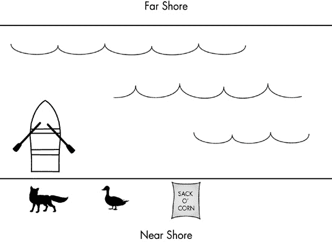
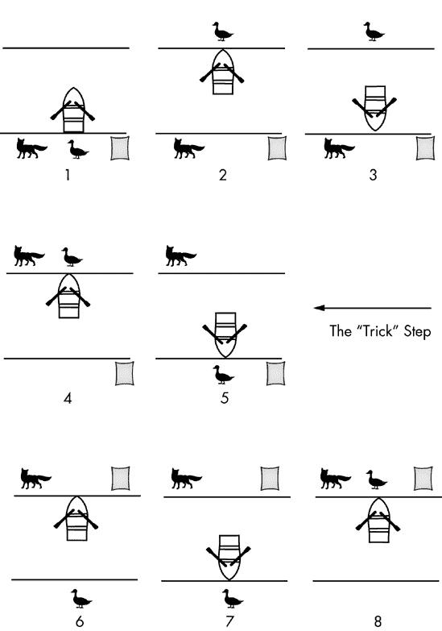
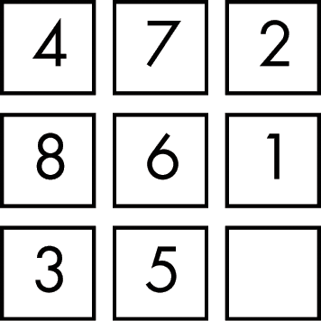
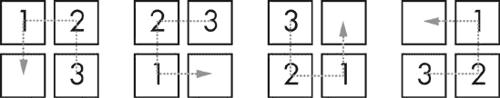
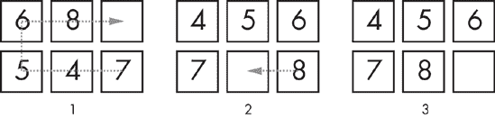
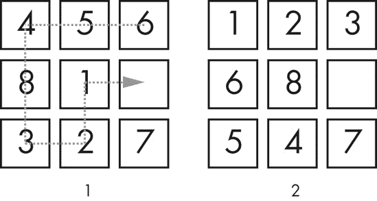
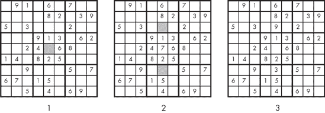

# 第一章. 解决问题的策略

这本书是关于解决问题的，但究竟什么是解决问题呢？当人们在日常对话中使用这个术语时，他们通常意味着与我们在这里所说的非常不同的事情。如果你的 1997 年款本田思域从排气管冒出蓝色烟雾，怠速不稳定，并且燃油效率降低，这是一个可以用汽车知识、诊断、更换设备和常见的商店工具解决的问题。然而，如果你向你的朋友们提起你的问题，他们中的一个可能会说，“嘿，你应该把那辆旧的本田换成一辆新的。问题解决了。”但你的朋友的建议并不是真正解决问题的*解决方案*——那是一种避免问题的方法。

问题包括约束，关于问题或解决问题方式的不可打破的规则。对于损坏的本田车，一个约束是你想修理现有的车，而不是购买一辆新车。约束还可能包括维修的整体成本、维修所需的时间，或者不允许购买仅为此维修的新工具的要求。

当用程序解决问题时，你也有约束。常见的约束包括编程语言、平台（它是否在 PC 上运行，或在 iPhone 上运行，或是什么？）、性能（游戏程序可能需要每秒至少更新 30 次图形，商业应用程序可能对用户输入的最大响应时间有限制），或内存占用。有时约束涉及你可以引用的其他代码：可能程序不能包含某些开源代码，或者相反——可能它只能使用开源代码。

因此，对于程序员来说，我们可以将*解决问题*定义为编写一个执行特定任务集并满足所有声明的约束的原创程序。

初学者程序员往往急于完成定义中的第一部分——编写一个程序来执行特定任务——以至于他们在定义的第二部分，即满足既定约束方面失败了。我把这样的程序称为“小野马”，它看起来能产生正确的结果，但违反了其中一条或多条规则。如果你对这个名字不熟悉，这意味着你对极客文化的基石之一——电影《星际迷航 II：怒火中烧》——不够熟悉。这部电影包含一个关于星舰学院有志成为军官的学员的副故事。学员们被安置在模拟的星舰舰桥上，并被要求在涉及不可能选择的任务中担任船长。无辜的人将在受伤的船上死去，即“小野马”，但要到达那里，就需要与克林贡人开始战斗，而这场战斗只能以船长舰船的毁灭结束。这个练习的目的是测试学员在炮火下的勇气。没有获胜的方法，所有选择都导致不良结果。在电影的结尾，我们发现柯克船长修改了模拟，使其实际上可以赢得胜利。柯克很聪明，但他并没有解决“小野马”的困境；他避免了它。

幸运的是，你作为程序员将面临的问题是可以解决的，但许多程序员仍然求助于柯克的方法。在某些情况下，他们这样做是偶然的。（“哦，糟糕！我的解决方案只适用于有一百个或更少数据项的情况。它应该适用于无限的数据集。我必须重新思考这个问题。”）在其他情况下，去除约束是故意的，是为了满足老板或导师强加的最后期限。在其他情况下，程序员不知道如何满足所有约束。在我见过的最糟糕的情况下，编程学生支付了别人来编写程序。无论动机如何，我们都必须始终勤奋地避免“小野马”。

# 经典谜题

随着你在这本书中的进步，你会注意到，尽管源代码的细节从一个问题领域到另一个问题领域都在变化，但我们的方法中会出现某些模式。这是一个好消息，因为这最终使我们能够自信地面对任何问题，无论我们是否在该问题领域有丰富的经验。专家问题解决者会迅速识别出一种“类比”，即已解决问题与未解决问题之间的可利用相似性。如果我们认识到问题 A 的特征与问题 B 的特征类似，并且我们已经解决了问题 B，那么我们对解决问题 A 就有了一个宝贵的洞察。

在本节中，我们将讨论来自编程世界之外的经典问题，这些问题的教训我们可以应用到编程问题中。

## 狐狸、鹅和玉米

我们将要讨论的第一个经典问题是关于一个需要过河的农夫的谜题。你可能以前以某种形式遇到过这个问题。

问题：如何过河？

一个农夫带着一只狐狸、一只鹅和一袋玉米需要过河。农夫有一只小船，但只能容纳他和他的三个物品中的一个。不幸的是，狐狸和鹅都很饿。狐狸不能单独和鹅留在同一岸，否则狐狸会吃掉鹅。同样，鹅也不能单独和玉米袋留在同一岸，否则鹅会吃掉玉米。农夫如何才能把所有东西都运过河？

这个问题的设置如图图 1-1 所示。如果你以前从未遇到过这个问题，请在这里停下来，花几分钟时间尝试解决它。如果你*曾经*遇到过这个谜题，尝试回忆一下解决方案，以及你是否能独立解决这个谜题。

图 1-1. 狐狸、鹅和玉米袋。船一次只能携带一个物品。狐狸不能和鹅留在同一岸，鹅也不能和玉米袋留在同一岸。

很少有人能够解决这个谜题，至少在没有提示的情况下。我知道我做不到。通常的推理是这样的。由于农夫一次只能携带一个物品，他需要多次往返才能把所有东西带到对岸。在第一次旅行中，如果农夫带狐狸过去，鹅就会和玉米袋留在同一岸，鹅会吃掉玉米。同样，如果农夫第一次带玉米袋过去，狐狸就会和鹅留在同一岸，狐狸会吃掉鹅。因此，农夫第一次必须带鹅过去，结果如图 1-2 所示。

图 1-2. 解决狐狸、鹅和玉米袋问题的第一步。然而，从这个步骤开始，所有后续步骤似乎都以失败告终。

到目前为止，一切顺利。但在第二次旅行中，农夫必须带狐狸或玉米。然而，无论农夫拿什么，都必须在鹅和另一件物品留在远岸的同时，农夫返回近岸取剩余的物品。这意味着狐狸和鹅将一起留在远岸，或者鹅和玉米将一起留在远岸。由于这两种情况都不被接受，问题看起来似乎无法解决。

再次，如果你之前见过这个问题，你可能记得解决方案的关键要素。正如之前解释的那样，农夫必须第一次带鹅。在第二次旅行中，让我们假设农夫带狐狸。不过，农夫并没有把狐狸留在鹅那里，而是**把鹅带回到近岸**。然后农夫带着玉米袋过河，把狐狸和玉米留在远岸，并在第四次旅行时带着鹅回来。完整的解决方案在图 1-3 中展示。

这个谜题很难，因为大多数人从未考虑过将其中一件物品从远岸带回近岸。有些人甚至会建议这个问题是不公平的，说些像“你没有说我可以拿回东西！”这样的话。这是真的，但同样，问题描述中没有任何内容表明拿回东西是被禁止的。

图 1-3. 狐狸、鹅和玉米谜题的逐步解决方案

想想如果明确指出将其中一件物品带回近岸的可能性，这个谜题会容易解决多少：**农夫有一只小船**，可以用来在两个方向上转移物品，**但船上只能容纳农夫和他的三件物品中的一件**。有了这个建议在眼前，更多的人会想出这个问题。这说明了问题解决的一个重要原则：如果你不知道所有可能采取的行动，你可能无法解决问题。我们可以将这些行动称为操作。通过列举所有可能的操作，我们可以通过测试所有操作的组合来解决问题，直到找到一种可行的方案。更普遍地说，通过用更正式的术语重新表述问题，我们通常可以揭示出我们可能错过的解决方案。

让我们忘记我们已经知道解决方案，尝试更正式地表述这个特定的谜题。首先，我们将列出我们的约束条件。这里的关键约束是：

1.  农夫一次只能从船上拿一件物品。

1.  狐狸和鹅不能单独留在同一岸上。

1.  鹅和玉米不能单独留在同一岸上。

这个问题是一个很好的例子，说明了约束的重要性。如果我们移除这些约束中的任何一个，谜题就变得简单了。如果我们移除第一个约束，我们可以简单地一次把所有三个物品带过去。即使我们只能带两个物品上船，我们也可以先带狐狸和玉米过去，然后回来接鹅。如果我们移除第二个约束（但保留其他约束），我们只需要小心，先带鹅过去，然后是狐狸，最后是玉米。因此，如果我们忘记或忽略任何约束，我们最终会陷入一个“无解”的局面。

接下来，让我们列出操作。对于这个谜题，有各种表述操作的方式。我们可以列出我们认为可以采取的具体行动列表：

1.  操作：将狐狸带到河的对岸。

1.  操作：将鹅带到河的对岸。

1.  操作：将玉米带到河的对岸。

记住，然而，正式重述问题的目的是为了获得解决方案的洞察力。除非我们已经解决了问题并发现了“隐藏”的可能操作，即把鹅带回到河的近岸，否则我们不会在我们的行动列表中找到它。相反，我们应该尝试使操作通用化或参数化。

1.  操作：划船从一岸到另一岸。

1.  操作：如果船是空的，从岸上取一个物品放到船上。

1.  操作：如果船不是空的，将物品卸到岸上。

通过以最一般的方式思考问题，这个操作列表将使我们能够在不需要关于鹅返回近岸的“啊哈！”时刻的情况下解决问题。如果我们生成所有可能的移动序列，一旦序列违反了我们的任何一个约束或达到我们之前见过的配置，我们最终会找到图 1-3 的序列并解决这个谜题。通过正式重述约束和操作，我们将绕过谜题固有的难度。

### 经验教训

我们能从狐狸、鹅和玉米中学到什么？

以更正式的方式重述问题是一种深入了解问题的优秀技术。许多程序员寻求与其他程序员讨论问题，不仅因为其他程序员可能有答案，而且还因为大声阐述问题通常会引发新的和有用的想法。重述问题就像与另一个程序员进行讨论一样，只是你扮演了两个角色。

更广泛的教训是，思考问题可能和思考解决方案一样有效，或者在某些情况下更有效。在许多情况下，解决问题的正确方法本身就是解决方案。

## 滑动拼图

滑动拼图有多种尺寸，正如我们稍后将要看到的，它提供了一种特定的解决机制。以下描述适用于 3×3 版本的拼图。

问题：滑动八块

一个 3×3 的网格填充了八块拼图，编号为 1 到 8，还有一个空白空间。最初，网格处于混乱的配置。一块拼图可以滑入相邻的空白空间，使其原来的位置变为空白。目标是滑动拼图，将网格放置在有序的配置中，从左上角的拼图 1 开始。

这个问题的目标在图 1-4 中显示。如果你以前从未尝试过这样的谜题，现在就花点时间试试。网上可以找到许多滑动拼图模拟器，但为了我们的目的，如果你使用扑克牌或索引卡在桌面上自己制作游戏会更好。一个建议的起始配置在图 1-5 中显示。

图 1-4. 滑动拼图八块版本的目标配置。空白方块代表相邻的拼图可以滑入的空位。

图 1-5. 滑动拼图的特定起始配置

这个谜题与农夫、狐狸、鹅和玉米的问题大不相同。那个问题的难度来自于忽略了一种可能的操作。在这个问题中，这种情况不会发生。从任何给定的配置中，最多有四个拼图可以与空白空间相邻，并且任何这些拼图都可以滑入空白空间。这完全列举了所有可能的操作。

这个问题的难度实际上来自于解决所需的长期操作链。一系列滑动操作可能会将一些拼图移动到正确的最终位置，同时将其他拼图移出位置，或者它可能会将一些拼图移动到更接近正确位置，同时将其他拼图移动得更远。正因为如此，很难判断任何特定的操作是否会使我们朝着最终目标迈进。如果不能衡量进度，就很难制定策略。许多尝试滑动拼图的人只是随意移动拼图，希望找到一种可以从其中看到通往目标配置路径的配置。

尽管如此，滑动拼图还是有策略的。为了说明一种方法，让我们考虑一个较小的矩形网格的拼图，而不是正方形网格。

问题：滑动五格

一个 2×3 的网格中填充了五个编号为 4 到 8 的格子，以及一个空格。最初，网格处于混乱的配置。一个格子可以滑入相邻的空格，留下格子原来的位置为空。目标是滑动格子，将网格放置在有序的配置中，从左上角的 4 号格子开始。

你可能已经注意到，我们的五个格子编号为 4 到 8，而不是 1 到 5。这个原因很快就会变得清楚。

尽管这个问题与滑动八格问题基本相同，但只有五个格子，所以要容易得多。尝试一下图 1-6 中所示的配置。

如果你只是玩几分钟这些瓷砖，你可能会找到解决方案。通过玩小数量瓷砖拼图，我开发了一种特定的技能。正是这种技能，加上我们很快就会讨论的观察，我用来解决所有的滑动拼图。

图 1-6. 一个简化的 2×3 滑动拼图的特殊起始配置

我把我的技术称为“火车”。这是基于观察，包括空格的瓷砖位置电路形成了一个可以旋转的瓷砖火车，在任何电路上的相对顺序保持不变。图 1-7 展示了四个位置的最小火车。从第一个配置开始，1 号格子可以滑入空格，2 号格子可以滑入 1 号格子留下的空格，最后 3 号格子可以滑入 2 号格子留下的空格。这留下了空格紧邻 1 号格子，这使得火车可以继续，因此，瓷砖可以有效地在火车路径上的任何地方旋转。

图 1-7. 一个“火车”，一个从空格旁边开始的瓷砖路径，可以像火车一样在拼图中滑动

使用列车，我们可以在保持磁砖相对关系的同时移动一系列磁砖。现在让我们回到之前的 2×3 网格配置。尽管这个网格中的磁砖没有一个处于其正确的最终位置，但一些磁砖与它们在最终配置中需要相邻的磁砖相邻。例如，在最终配置中，4 将位于 7 的上方，而目前这些磁砖是相邻的。如图 图 1-8 所示，我们可以使用一个六位置列车将 4 和 7 移动到它们的正确最终位置。当我们这样做时，剩余的磁砖几乎正确；我们只需要将 8 滑动过去。

图 1-8. 从配置 1 开始，沿着轮廓的“列车”旋转两次将我们带到配置 2。从那里，单个磁砖滑动就实现了目标，配置 3。

那么这种技术是如何让我们解决任何滑动拼图的呢？考虑我们的原始 3×3 配置。我们可以使用一个六位置列车来移动相邻的 1 和 2 磁砖，使 2 和 3 相邻，如图 图 1-9 所示。

图 1-9. 从配置 1 开始，磁砖沿着轮廓的“列车”旋转以到达配置 2。

这样就将 1、2 和 3 放在了相邻的方格中。使用一个八位置列车，我们可以将 1、2 和 3 磁砖移动到它们的正确最终位置，如图 图 1-10 所示。

图 1-10. 从配置 1 开始，磁砖旋转以到达配置 2，其中磁砖 1、2 和 3 处于正确的最终位置。

注意 4-8 号拼图的位置。拼图处于我给出的 2×3 网格的配置中。这是关键观察。在将 1-3 号拼图放置到正确的位置后，我们可以将剩余的网格作为一个单独的、更小、更简单的拼图来解决。请注意，我们必须解决整个行或列，这种方法才能奏效；如果我们把 1 号和 2 号拼图放到正确的位置，但 3 号拼图仍然不在位，就没有办法在不移动其他上方行的一个或两个拼图的情况下将某物移动到右上角。

这种相同的技术也可以用来解决更大的滑动拼图。最大的常见尺寸是 15 块拼图，一个 4×4 的网格。可以通过首先将 1-4 号拼图移动到正确的位置，留下一个 3×4 的网格，然后移动最左边列的拼图，留下一个 3×3 的网格来逐步解决这个问题。到那时，问题已经简化为一个 8 块拼图。

### 经验教训

我们可以从滑动拼图中学到什么教训？

拼图移动的数量很大，以至于很难或不可能从初始配置中规划出完整的解决方案。然而，我们无法规划出完整的解决方案并不能阻止我们制定策略或采用技术来系统地解决拼图。在解决编程问题时，我们有时会遇到无法看到清晰路径来编写解决方案的情况，但我们绝不能以此为借口放弃规划和系统方法。制定策略比通过试错攻击问题更好。

我是从摆弄一个小拼图发展出我的“训练”技术的。我经常在编程中使用类似的技术。面对一个艰巨的问题时，我会尝试问题的简化版本。这些实验通常会产生有价值的见解。

另一个教训是，有时问题可以通过不明显的方式分割。因为移动拼图不仅影响那个拼图，还影响下一步可以进行的移动，有人可能会认为滑动拼图必须一步解决，而不是分阶段解决。寻找分割问题的方法通常是值得花费时间的。即使你无法找到清晰的分割，你也可能学到一些关于问题的知识，这有助于你解决问题。在解决问题时，有具体目标地工作总是比随机努力更好，无论你是否实现了那个具体目标。

## 数独

数独游戏通过在报纸和杂志上的出现，以及作为基于网页和手机的游戏而变得极为流行。存在不同的变体，但我们将简要讨论传统版本。

问题：完成数独方阵

一个 9×9 的网格部分填充了单个数字（从 1 到 9），玩家必须在满足某些约束的条件下填写空格：在每一行和每一列中，每个数字必须恰好出现一次，而且进一步地，在由粗边框标记的每个 3×3 区域中，每个数字也必须恰好出现一次。

如果你之前玩过这个游戏，你可能已经有一套完成方格的最短时间的策略。让我们通过查看图 1-11 中显示的样本方格来关注关键起始策略。

图 1-11. 一个简单的数独方格谜题

数独谜题的难度各不相同，其难度由需要填充的方格数量决定。按照这个标准，这是一个非常简单的谜题。由于已经有 36 个方格被编号，因此只需要填充 45 个方格来完成谜题。问题是，我们应该尝试先填充哪些方格？

记住谜题的约束。每个九个数字必须在每个行、每个列以及由粗边框标记的每个 3×3 区域中各出现一次。这些规则决定了我们应该从哪里开始努力。谜题中间的 3×3 区域已经有八个方格的数字。因此，位于非常中心的方格只能有一个可能的值，这个值不已经在该 3×3 区域的另一个方格中出现过。那就是我们应该开始解决这个谜题的地方。该区域缺失的数字是 7，所以我们会将其放在中间的方格中。

在这个值确定之后，请注意，中间的列现在在其九个方格中有七个方格的值，这留下了两个剩余的方格，每个方格都必须有一个不在该列中的值：两个缺失的数字是 3 和 9。对这个列的限制允许我们将任何一个数字放在任何一个位置，但请注意，3 已经存在于第三行，9 已经存在于第七行。因此，行限制规定 9 必须放在中间列的第三行，3 必须放在中间列的第七行。这些步骤在图 1-12 中进行了总结。

图 1-12. 解决样本数独谜题的第一步

我们在这里不会解决整个谜题，但这些第一步说明了我们寻找具有可能值数量最少的方格——理想情况下只有一个。

### 经验教训

数独的主要教训是我们应该寻找问题中最受限制的部分。虽然限制通常是使问题一开始就难以解决的原因（记得那个狐狸、鹅和玉米的故事），但它们也可能简化我们对解决方案的思考，因为它们消除了选择。

尽管我们在这本书中不会具体讨论人工智能，但有一种用于解决某些类型问题的规则，称为“最受限变量”。这意味着在试图为不同的变量分配不同的值以满足限制条件的问题中，你应该从具有最多限制条件的变量开始，或者换句话说，从具有可能值数量最少的变量开始。

这里有一个这种思考方式的例子。假设一群同事想要一起吃午餐，他们已经让你找到一个大家都喜欢的餐厅。问题是，每个同事都对集体决策施加了一些限制：Pam 是素食主义者，Todd 不喜欢中餐，等等。如果你的目标是最大限度地减少找到餐厅所需的时间，你应该先与受限制最严重的同事交谈。例如，如果 Bob 有许多广泛的食品过敏，那么从找到他知道可以吃的餐厅列表开始，而不是从 Todd 开始，Todd 对中餐的厌恶很容易得到缓解。

同样的技术通常可以应用于编程问题。如果问题的某个部分受到严重限制，那是一个很好的起点，因为你可以不必担心你正在花费时间在将来会被取消的工作上。一个相关的推论是，你应该从最明显的那部分开始。如果你能解决部分问题，就去做你能做的。从看到你自己的代码中，你可能学到一些东西，这会激发你的想象力来解决剩余的问题。

## Quarrasi 锁

你可能以前见过每个之前的谜题，但除非你以前读过这本书，否则你不应该看到本章的最后一个谜题，因为我自己编造了这个谜题。仔细阅读，因为这个问题的措辞有点复杂。

问题：打开外星锁

一个敌对外星种族，Quarrasi，已经登陆地球，你被他们俘虏了。尽管他们巨大且长有触手，但你设法制服了你的守卫。为了逃离（仍然在地面上）的飞船，你必须打开那扇巨大的门。奇怪的是，打开门的说明是用英语打印的，但这仍然不是一件容易的事情。要打开门，你必须将三个条形的 Kratzz 滑动到从右侧接收器到左侧接收器的轨道上，而左侧接收器位于门的末端，距离 10 英尺。

这很简单，但你必须避免触发警报，警报的工作原理如下。每个 Kratzz 上都有一个或多个被称为 Quinicrys 的星形晶体宝石。每个受体都有四个传感器，如果上方列中的 Quinicrys 数量为偶数，则传感器会亮起。如果亮起的传感器数量恰好为一个是，则会响起警报。请注意，每个受体的警报是独立的：你不可能让左侧受体或右侧受体的传感器恰好亮起一个。好消息是每个警报都配备了抑制器，只要按下按钮，就可以阻止警报响起。如果你能同时按下两个抑制器，问题就简单了，但你不能，因为你只有短人类手臂，而不是长 Quarassi 触手。

考虑到所有这些，你该如何滑动 Kratzz 而不触发任何警报来打开门？

起始配置如图图 1-13 所示，三个 Kratzz 棒都在右侧受体。为了清晰起见，图 1-14 显示了错误的做法：将最上面的 Kratzz 滑到左侧受体会导致右侧受体进入警报状态。你可能认为我们可以用抑制器避免警报，但记住我们刚刚将最上面的 Kratzz 滑到左侧受体，所以我们离右侧受体的抑制器有 10 英尺远。

图 1-13. Quarrasi 锁问题的起始配置。你必须将当前位于右侧接收器中的三个 Kratzz 条滑动到左侧接收器，而不触发任何警报。当上方列中出现偶数个星形 Quinicrys 时，传感器会亮起，如果恰好有一个连接的传感器亮起，则会响起警报。抑制器可以阻止警报响起，但仅限于你站立的接收器。

图 1-14. Quarrasi 锁处于警报状态。你刚刚将上方的 Kratzz 滑向左侧接收器，因此右侧接收器无法触及。右侧警报的第二传感器亮起，因为上方列中出现了偶数个 Quinicrys，当其传感器中恰好有一个亮起时，警报响起。

在继续之前，花些时间研究这个问题，并尝试找到一个解决方案。根据你的观点，这个问题并不像看起来那么难。认真想想，然后再继续！

你想过这个问题吗？你能否提出一个解决方案？这里有两条可能的答案路径。第一条路径是试错法：有系统地尝试各种 Kratzz 移动，并在达到警报状态时退回到之前的步骤，直到找到一系列成功的移动。

第二条路径是意识到这个谜题是一个陷阱。如果你还没有看到这个陷阱，这里就是：这其实就是狐狸、鹅和玉米问题的一个复杂伪装。尽管警报的规则写得比较宽泛，但这个特定锁的组合只有这么多。只有三个 Kratzz，我们只需要知道哪些 Kratzz 组合在接收器中是可接受的。如果我们把三个 Kratzz 标记为 *top*（顶部）、*middle*（中间）和 *bottom*（底部），那么会触发警报的组合是“top and middle”（顶部和中间）以及“middle and bottom”（中间和底部）。如果我们把 *top* 重命名为 *fox*（狐狸）、*middle* 重命名为 *goose*（鹅）和 *bottom* 重命名为 *corn*（玉米），那么麻烦的组合与另一个问题相同，“fox and goose”（狐狸和鹅）以及“goose and corn”（鹅和玉米）。

因此，这个问题是以与狐狸、鹅和玉米问题相同的方式解决的。我们滑动中间的 Kratzz（鹅）到左侧的接收器。然后，我们滑动顶部的（狐狸）到左侧，同时握住左侧警报的抑制器，将顶部的（狐狸）放置到位。接下来，我们开始将中间的（鹅）滑回右侧的接收器。然后，我们滑动底部的（玉米）到左侧，最后，我们再次将中间的（鹅）滑动到左侧，打开锁。

### 经验教训

这里的主要教训是认识到类比的重要性。在这里，我们可以看到 Quarrasi 锁问题与狐狸、鹅和玉米问题相似。如果我们能够尽早发现这个类比，我们就可以通过将我们的解决方案从第一个问题中转换过来，而不是创建一个新的解决方案，来避免大部分问题的努力。在问题解决中，大多数类比不会如此直接，但它们的发生频率会越来越高。

如果你发现这个问题与狐狸、鹅和玉米问题之间的联系有困难，那是因为我故意加入了尽可能多的无关细节。建立 Quarrasi 问题的故事是不相关的，所有外星技术的名称也是如此，它们的作用是增强陌生感。此外，警报器的奇偶机制使得问题看起来比实际上更复杂。如果你看看 Quinicrys 的实际位置，你可以看到顶部和底部的 Kratzz 是相反的，所以它们在警报系统中不相互作用。然而，中间的 Kratzz 与其他两个相互作用。

再次，如果你没有看到类比，不要担心。在你开始警惕它们之后，你会开始更多地认识到它们。

# 通用问题解决技术

我们所讨论的例子展示了在问题解决中使用的许多关键技术。在本书的剩余部分，我们将探讨具体的编程问题并找出解决它们的方法，但首先我们需要一套通用的技术和原则。一些问题领域有特定的技术，正如我们将看到的，但以下规则几乎适用于任何情况。如果你将这些规则作为你问题解决方法的常规部分，你将始终有一个解决问题的方法。

## 总是有一个计划

这可能是最重要的规则。你必须始终有一个计划，而不是进行无目的的活动。

到目前为止，你应该明白制定计划总是可能的。确实，如果你还没有在脑海中解决这个问题，那么你无法为在代码中实现解决方案制定计划。那将在以后发生。然而，即使在开始时，你也应该有一个计划，说明你将如何找到解决方案。

公平地说，计划可能需要在旅途中进行修改，或者你可能不得不放弃你的原始计划，制定另一个。那么，为什么这条规则如此重要呢？德怀特·D·艾森豪威尔将军因说过，“我总是发现计划是没有用的，但规划是必不可少的。”他的意思是战斗如此混乱，不可能预测可能发生的一切并为每一个结果都有预定的反应。从这个意义上说，那么，计划在战场上是没有用的（另一位军事领导人，普鲁士的赫尔穆特·冯·莫尔特克，著名地说过，“没有计划能在与敌人的第一次接触中存活”）。但没有任何军队可以在没有计划和组织的条件下取得成功。通过规划，将军了解他的军队的能力，了解军队的不同部分是如何协同工作的，等等。

同样，你必须始终有一个解决问题的计划。这个计划可能无法在第一次接触敌人时就存活下来——你可能在你开始将代码输入到源代码编辑器时就会放弃它——但你必须有一个计划。

没有计划，你只是在寄希望于幸运的突破，这相当于随机打字的猴子能创作出莎士比亚的戏剧。幸运的突破并不常见，即使发生了，也可能仍然需要一个计划。许多人听说过青霉素的发现故事：一位名叫亚历山大·弗莱明的研究员那天晚上忘记关闭一个培养皿，第二天早上发现培养皿中的霉菌抑制了细菌的生长。但弗莱明并没有坐等幸运的突破；他一直在以彻底和有序的方式进行实验，因此认识到了他在培养皿中看到的东西的重要性。（如果我发现我前一天晚上留下的东西上长出了霉菌，这并不会导致对科学的重大贡献。）

计划还允许你设定中间目标并实现它们。没有计划，你只有一个目标：解决整个问题。直到你解决了问题，你才觉得自己完成了什么。正如你可能已经体验到的，许多程序直到接近完成时才做些有用的事情。因此，只朝着主要目标工作不可避免地会导致挫折，因为直到最后，你的努力都没有得到积极的反馈。相反，如果你制定了一个包含一系列小目标的计划，即使其中一些似乎与主要问题无关，你也会朝着解决方案取得可衡量的进步，并觉得你的时间被有效地利用了。在每个工作会话结束时，你将能够从你的计划中勾选项目，增强信心，相信你会找到解决方案，而不是越来越沮丧。

## 重新陈述问题

尤其是通过狐狸、鹅和玉米问题所展示的，重新表述一个问题可以产生有价值的结果。在某些情况下，一个看似非常困难的问题，如果用不同的方式或不同的术语来表述，可能会显得容易得多。重新表述一个问题就像环绕着你必须攀登的山丘的基础；在你开始攀登之前，为什么不从每个角度检查一下，看看是否有更简单的方法上去呢？

重新表述有时会显示我们的目标并非我们想象的那样。我曾读过一篇关于一位祖母在编织的同时照看她的婴儿外孙女的报道。为了完成编织，祖母将婴儿放在她旁边的便携式游戏围栏里，但婴儿不喜欢被关在围栏里，一直在哭。祖母尝试了各种玩具来让围栏对婴儿更有趣，直到她意识到把婴儿关在围栏里只是达到目的的手段。目标是祖母能够平静地编织。解决方案：让婴儿在地板上快乐地玩耍，而祖母则在围栏里编织。重新表述可以是一种强大的技术，但许多程序员会跳过它，因为它并不直接涉及编写代码，甚至设计解决方案。这也是为什么有一个计划是至关重要的另一个原因。没有计划，你的唯一目标就是有可工作的代码，而重新表述是在浪费时间。有了计划，你可以将“正式重新表述问题”作为第一步；因此，完成重新表述正式算作是进步。

即使重新表述没有立即带来任何洞察力，它也可以以其他方式帮助。例如，如果一个问题已经分配给你（由主管或讲师），你可以将你的重新表述带给分配问题的那个人，并确认你的理解。此外，重新表述问题可能是使用其他常见技术（如简化或分解问题）的必要前提步骤。

更广泛地说，重新表述可以改变整个问题领域。我在后面的章节中分享的递归解决方案技术，是一种重新表述递归问题的方法，这样我就可以像处理迭代问题一样处理它们。

## 分解问题

找到一种方法将问题分解成步骤或阶段可以使问题变得容易得多。如果你能将一个问题分成两部分，你可能认为每部分解决起来会比原来的整体难一半，但通常，这甚至比那还要容易。

这里有一个如果你已经看过常见的排序算法就会熟悉的类比。假设你有 100 个文件需要按字母顺序放入一个盒子中，你的基本排序方法是所谓的插入排序：你随机选择一个文件，放入盒子中，然后按正确的顺序将下一个文件放入盒子中，与第一个文件的关系，然后继续，总是将新文件放入相对于其他文件的正确位置，这样在任何给定时间，盒子中的文件都是按字母顺序排列的。假设有人最初将文件分成 4 组，大小大致相等，A–F，G–M，N–S，和 T–Z，并告诉你分别对这 4 组进行排序，然后依次将它们放入盒子中。

如果每个组包含大约 25 个文件，那么人们可能会认为对 4 组 25 个文件进行排序的工作量与对单个 100 个文件的组进行排序的工作量大致相同。但实际上，工作量要少得多，因为插入单个文件所需的工作量会随着已归档文件数量的增加而增长——你必须查看盒子中的每个文件，才能知道新文件应该放在哪里。（如果你对此表示怀疑，想想一个更极端的版本——比较一下对 50 组每组 2 个文件进行排序的想法，你可能在一分钟内就能完成，与对单个 100 个文件的组进行排序相比。）

同样，将问题分解通常可以降低一个数量级的难度。组合编程技术比单独使用技术要复杂得多。例如，一个在`for`循环内部嵌套`while`循环的代码段中使用了多个`if`语句的部分，将比一个使用所有相同控制语句按顺序执行的代码段更难编写——也更难阅读。

我们将在接下来的章节中讨论具体的问题分解方法，但你应该始终保持警惕，注意这种可能性。记住，有些问题，比如我们的滑动拼图问题，通常隐藏着它们的潜在分解。有时，找到问题分解的方法是减少问题，正如我们很快将要讨论的。

## 从你所知开始

第一次写作小说的人经常得到这样的建议：“写你所知。”这并不意味着小说家应该只尝试围绕他们在自己生活中直接观察到的事件和人来创作作品；如果是这样的话，我们就永远不会有幻想小说、历史小说或许多其他流行体裁。但它的意思是，作家离自己的经历越远，写作可能就越困难。

同样，在编程时，你应该尝试从你已知如何做的事情开始，并从这里向外扩展。一旦你将问题分解成几个部分，例如，你可以先完成你已知如何编码的部分。拥有一个可工作的部分解决方案可能会激发对剩余问题的想法。此外，正如你可能已经注意到的，问题解决中的一个共同主题是通过有用的进展来建立信心，相信你最终会完成任务。通过从你所知开始，你建立信心并积累动力，朝着目标前进。

“从你所知开始”的原则也适用于你没有分解问题的情形。想象一下，有人列出了编程中所有技能的完整清单：编写 C++类、排序数字列表、在链表中找到最大值等等。在你作为程序员的每个发展阶段，你都会有很多你做得好的技能，一些你努力就能使用的技能，以及你还不了解的技能。特定的问题可能完全可以用你已有的技能来解决，也可能不行，但在你四处寻找答案之前，你应该充分利用你头脑中的技能来彻底调查这个问题。如果我们把编程技能看作是工具，把编程问题看作是家庭维修项目，你应该在前往五金店之前，先尝试使用车库里的工具来完成维修。

这种技术遵循我们之前讨论的原则。它遵循一个计划，并为我们的努力提供秩序。当我们开始通过应用我们已有的技能来调查问题时，我们可能会对问题及其最终解决方案有更多的了解。

## 简化问题

使用这种技术，当你面对一个无法解决的问题时，你可以通过添加或移除约束来缩小问题范围，从而产生一个你知道如何解决的问题。我们将在后面的章节中看到这个技术的实际应用，但这里有一个基本的例子。假设你被给出了一系列三维空间中的坐标，你必须找到彼此最接近的坐标。如果你立刻不知道如何解决这个问题，你可以用不同的方法来简化问题以寻求解决方案。例如，如果这些坐标是在二维空间而不是三维空间中呢？如果这还不行，如果这些点沿一条直线排列，那么坐标就只是单个数字（比如说 C++的 double 类型）呢？现在问题本质上变成了，在数字列表中找到两个绝对差值最小的数字。

或者，你可以通过保持坐标在三维空间中，但只有三个值，而不是任意大小的系列来简化问题。所以，不是找到一个坐标对之间最小距离的算法，而只是比较坐标 A 与坐标 B，然后是 B 与 C，最后是 A 与 C。

这些简化方法以不同的方式简化问题。第一种简化方法消除了计算三维点之间距离的需要。也许我们还没有学会如何做这件事，但直到我们弄清楚这一点，我们仍然可以朝着解决方案取得进展。相比之下，第二种简化方法几乎完全集中在计算三维点之间的距离上，但消除了在任意大小的值序列中找到最小值的问题。

当然，为了解决原始问题，我们最终需要两种简化方法中涉及的技能。即便如此，简化方法仍然允许我们在无法找到将问题分解为步骤的方法时，对更简单的问题进行工作。实际上，这就像是一个故意但暂时的 Kobayashi Maru。我们知道我们并没有在处理完整的问题，但简化问题与完整问题有足够的共同点，这样我们就能朝着最终解决方案取得进展。很多时候，程序员会发现他们拥有解决该问题所需的所有个别技能，通过编写代码来解决问题的每个个别方面，他们可以看到如何将各种代码片段组合成一个统一的整体。

简化问题还允许我们精确地确定剩余困难所在的位置。初学者程序员经常需要寻求经验丰富的程序员的帮助，但如果遇到困难的程序员无法准确描述所需帮助，这可能会对所有人都是一个令人沮丧的经历。没有人愿意降低到说，“这是我的程序，它不起作用。为什么？”使用问题简化技术，一个人可以精确地确定所需帮助，比如说，“这里有一些我写的代码。正如你所看到的，我知道如何找到两个三维坐标之间的距离，也知道如何检查一个距离是否小于另一个。但我似乎找不到一个通用的解决方案来找到具有最小距离的坐标对。”

## 寻找类比

在我们的目的中，**类比**是指当前问题与已经解决的问题之间的相似性，这种相似性可以被利用来帮助解决当前问题。这种相似性可以采取多种形式。有时这意味着两个问题实际上是同一个问题。这就是我们处理狐狸、鹅和玉米问题以及 Quarrasi 锁问题的情形。

大多数类比并不那么直接。有时相似性只涉及问题的部分。例如，两个数字处理问题可能在所有方面都不同，除了它们都处理需要比内置浮点数据类型提供的精度更高的数字；你将无法使用这个类比来解决整个问题，但如果你已经找到了处理额外精度问题的方法，你可以以相同的方式再次处理相同的问题。

虽然识别类比是提高你解决问题速度和技能的最重要方式，但它也是最难培养的技能。之所以一开始这么困难，是因为你必须在参考之前有一个先前解决方案的仓库来寻找类比。

这就是开发中的程序员常常试图走捷径的地方，他们寻找与所需代码相似的代码，并从那里进行修改。然而，由于几个原因，这实际上是一个错误。首先，如果你没有自己完成解决方案，你就不会完全理解和内化它。简单来说，很难正确修改一个你不完全理解的程序。你不需要亲自编写代码就能完全理解，但如果你不能编写代码，你的理解必然是有限的。其次，你编写的每一个成功的程序都不仅仅是对当前问题的解决方案；它也是解决未来问题的类比潜在来源。你现在越依赖其他程序员的代码，将来你就越需要依赖它。我们将在第七章（[第七章](ch07.html "第七章. 使用代码复用来解决问题"））深入讨论“好的复用”和“坏的复用”。

## 实验

有时候，取得进展的最佳方式是尝试并观察结果。请注意，实验与猜测不同。当你猜测时，你输入一些代码并希望它能够工作，但你并没有强烈的信念认为它会成功。实验是一个受控的过程。你假设当执行某些代码时会发生什么，然后尝试它，看看你的假设是否正确。从这些观察中，你获得的信息将帮助你解决原始问题。

在处理应用程序编程接口或类库时，实验可能特别有帮助。假设你正在编写一个使用表示向量的库类的程序（在这个上下文中，是一个随着添加更多项目而自动增长的二维数组），但你以前从未使用过这个向量类，你不确定从向量中删除项目会发生什么。与其在心中充满不确定性时继续解决原始问题，不如创建一个简短的、独立的程序来与向量类玩耍，并特别尝试你关心的情况。如果你在“向量演示”程序上花一点时间，它可能会成为未来使用该类的工作的参考。

其他形式的实验与调试类似。假设某个程序产生的输出与预期相反——例如，如果输出是数值的，数字是预期的，但顺序相反。如果你在审查你的代码后仍然不明白为什么会这样，作为一个实验，你可能尝试修改代码以故意使输出相反（例如，以相反方向运行循环）。输出结果的变化或变化不足可能会揭示你原始源代码中的问题，或者揭示你理解上的差距。无论如何，你离解决方案更近了。

## 不要感到沮丧

最后一种技巧与其说是一种技巧，不如说是一条格言：不要感到沮丧。当你感到沮丧时，你不会思考得那么清晰，你不会工作得那么高效，一切都会花费更长的时间，看起来更困难。更糟糕的是，挫败感往往会自我滋养，所以一开始可能是轻微的不满，最终会变成直接的愤怒。

当我向新程序员提出这些建议时，他们经常反驳说，虽然他们在原则上同意我的观点，但他们无法控制自己的挫败感。要求程序员在失败时不要感到沮丧，这不就像要求一个小男孩踩到刺上时不要喊叫一样吗？答案是否定的。当有人踩到刺上时，强烈的信号会立即通过中枢神经系统传递，大脑的底层会做出反应。除非你知道你即将踩到刺上，否则你不可能及时反应来阻止大脑的自动反应。所以，我们让这个小男孩因为喊叫而免受责备。

程序员并不处于同样的境地。冒着听起来像自我帮助大师的风险，一个沮丧的程序员并不是对外部刺激做出反应。沮丧的程序员并不是对显示器上的源代码感到愤怒，尽管程序员可能会用这种方式表达挫败感。相反，沮丧的程序员是在生自己的气。挫败感的来源也是目的地，程序员的思维。

当你让自己感到沮丧——我故意使用“允许”这个词——实际上你是在给自己一个继续失败的理由。假设你正在解决一个难题，你感到自己的挫败感在上升。几个小时后，你回想起一个下午咬紧牙关、愤怒地折断铅笔的画面，告诉自己，如果你能冷静下来，你本可以取得真正的进展。事实上，你可能已经决定，屈服于愤怒比面对难题更容易。

最终，避免挫败感是一个你必须做出的决定。然而，有一些想法你可以采用，这将有助于你。首先，永远不要忘记第一条规则，那就是你应该始终有一个计划，并且虽然编写解决原始问题的代码是这个计划的目标，但这并不是计划的唯一步骤。因此，如果你有一个计划并且正在遵循它，那么你正在取得进步，你必须相信这一点。如果你已经完成了原始计划上的所有步骤，但你仍然没有准备好开始编码，那么是时候制定另一个计划了。

此外，当涉及到挫败感或休息时，你应该选择休息。一个技巧是同时处理多个问题，这样如果这个问题让你感到困惑，你就可以把精力转向其他地方。注意，如果你成功地分解了问题，你可以在单个问题上使用这个技巧；只需屏蔽让你卡住的部分，然后做其他事情。如果你没有其他问题可以解决，就离开椅子去做其他事情，做一些能让你的血液流动但不会让你的大脑受伤的事情：散步，洗衣服，进行拉伸练习（如果你打算成为一名程序员，整天坐在电脑前，我强烈建议你发展一个拉伸练习的习惯！）。直到休息结束之前，不要思考问题。

# 练习

记住，要真正学会某样东西，你必须将其付诸实践，所以尽可能多地做练习。当然，在这一章中，我们还没有讨论编程，但即便如此，我也鼓励你尝试一些练习。想想这些问题是我们开始演奏真正的音乐之前为你的手指做热身。

1.  尝试一个中等难度的数独谜题（你可以在网上找到这些，也许在当地报纸上也能找到），尝试不同的策略并记录结果。你能为解决数独制定一个通用计划吗？

1.  考虑一个滑动拼图变体，其中瓷砖上覆盖的是图片而不是数字。这增加了多少难度，为什么？

1.  找到一个与我不同的滑动拼图策略。

1.  寻找传统的狐狸、鹅和玉米品种的谜题，并尝试解决它们。许多伟大的谜题都是由萨姆·洛伊德（Sam Loyd）原创或普及的，所以你可能需要搜索他的名字。此外，一旦你发现了（或放弃并阅读）解决方案，想想你如何可以制作一个更容易的谜题版本。你需要改变什么？是限制条件还是只是措辞？

1.  尝试为其他传统的纸笔游戏编写一些明确的策略，比如填字游戏。你应该从哪里开始？当你卡住时应该做什么？即使是像“Jumble”这样的简单报纸游戏，对于思考策略也是很有用的。
