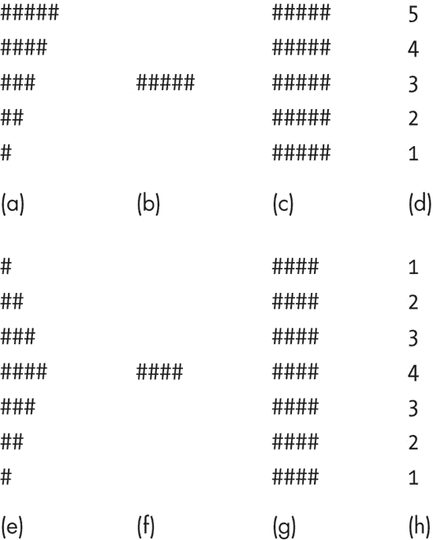
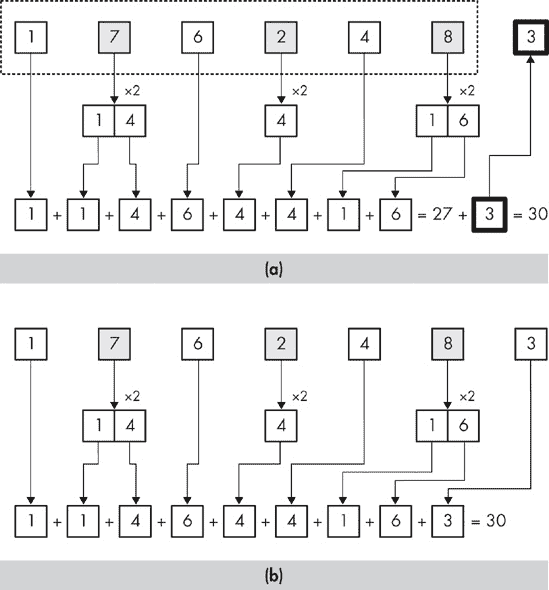

# 第二章. 纯粹的谜题


在本章中，我们将开始处理实际的代码。虽然中级编程知识将在后面的章节中需要，但本章所需的编程技能尽可能简单。这并不意味着所有这些谜题都会很容易，只是说你应该能够专注于问题解决，而不是编程语法。这是最纯粹的问题解决。一旦你弄清楚自己想要做什么，将你的想法转化为 C++ 代码将会很直接。记住，仅仅阅读这本书本身提供的益处是有限的。你应该在我们讨论时，尝试解决任何对你来说非平凡的问题，尝试在阅读我的方法之前自己解决。在本章结束时，尝试一些练习，其中许多将是我们在讨论中讨论的问题的扩展。

# 本章节中使用的 C++ 代码回顾

本章使用的是你应已熟悉的 C++ 基础，包括控制语句 `if`、`for`、`while` 和 `do-while`，以及 `switch`。你可能还不习惯用这些语句编写代码来解决原创问题——毕竟，这正是本书的主题。然而，你应该理解这些语句的语法，或者手头有一本好的 C++ 参考书。

你还应该知道如何编写和调用函数。为了保持简单，我们将使用标准流 `cin` 和 `cout` 进行输入和输出。要使用这些流，在你的代码中包含必要的头文件 `iostream`，并为两个标准流对象添加 `using` 语句：

```
#include <iostream>
using std::cin;
using std::cout;
```

为了简洁，这些语句将不会在代码列表中展示。它们的存在被假定为任何使用它们的程序中。

# 输出模式

在本章中，我们将解决三个主要问题。由于我们将广泛使用问题分解和缩减技术，每个主要问题都将产生几个子问题。在这个第一部分，让我们尝试一系列产生规则形状图案输出的程序。这样的程序可以培养编写循环的技能。

问题：正方形的一半

编写一个程序，只使用两个输出语句 `cout << "#"` 和 `cout << "\n"`，以产生一个类似完美 5 × 5 正方形（或直角三角形）的哈希符号图案：

```
#####
####
###
##
#
```

这又是约束重要性的一个很好的例子。如果我们忽略只能使用两个输出语句的要求，一个产生单个哈希符号，另一个产生行尾，我们可以写一个 Kobayashi Maru 并轻易解决这个问题。然而，有了这个约束，我们就必须使用循环来解决这个问题。

你可能已经在脑海中看到了解决方案，但让我们假设你没有。一种好的武器是简化。我们如何将这个问题简化到容易解决的程度？如果模式是一个完整的正方形而不是正方形的一半呢？

问题：一个正方形（正方形的一半简化）

编写一个程序，使用仅两个输出语句 `cout << "#"` 和 `cout << "\n"` 来生成一个形状为完美 5x5 正方形的井号符号图案：

```
#####
#####
#####
#####
#####
```

这可能足以让我们开始，但假设我们也不知道如何解决这个问题。我们可以进一步简化问题，只制作一条井号符号的行而不是正方形。

问题：一条线（正方形的一半进一步简化）

编写一个程序，使用仅两个输出语句 `cout << "#"` 和 `cout << "\n"` 来生成一行五个井号符号：

```
#####
```

现在我们有一个可以用 `for` 循环解决的问题：

```
for (int hashNum = 1; hashNum <= 5; hashNum++) {
   cout << "#";
}
cout << "\n";
```

从这里，返回到之前的全平方形状。全平方只是五次重复的五条井号符号的行。我们知道如何编写重复的代码；我们只需写一个循环。因此，我们可以将我们的单循环转换为双循环：

```
for (int row = 1; row <= 5; row++) {
   for (int hashNum = 1; hashNum <= 5; hashNum++) {
      cout << "#";
   }
   cout << "\n";
}
```

我们将之前列表中的所有代码放入一个新的循环中，以便它重复五次，产生五行，每行是五条井号符号。我们越来越接近最终解决方案。我们如何修改代码，使其产生半平方图案？如果我们查看最后的列表并将其与我们的所需半平方输出进行比较，我们可以看到问题在于条件表达式 `hashNum <= 5`。这个条件在每个行上产生相同的五条井号符号的行。我们需要的是一个机制来调整每行产生的符号数量，以便第一行得到五个符号，第二行得到四个，以此类推。

为了了解如何做到这一点，让我们进行另一个简化程序实验。同样，总是最容易单独处理问题的麻烦部分。让我们暂时忘记井号符号，只谈论数字。

问题：通过计数向上计数向下

在下面的列表中，编写一行代码放入循环指定的位置。程序按顺序显示数字 5 到 1，每个数字占一行。

```
for (int row = 1; row <= 5; row++) {
   cout <<  *`expression`* << "\n";
}
```

我们必须找到一个**`表达式`** ![http://atomoreilly.com/source/no_starch_images/1273182.png]，当 `row` 为 1 时为 5，当 `row` 为 2 时为 4，以此类推。如果我们想要一个随着 `row` 增加而减少的表达式，我们首先可能会想到在 `row` 的值前加上一个负号，通过将 `row` 乘以 -1 来实现。这会产生递减的数字，但不是我们想要的数字。尽管如此，我们可能比我们想象的更接近。所需值与将 `row` 乘以 -1 得到的值之间的差异是什么？表 2-1 总结了这一分析。

表 2-1. 从行变量计算所需值

| 行 | 所需值 | 行 * −1 | 与所需值的差异 |
| --- | --- | --- | --- |
| 1 | 5 | −1 | 6 |
| 2 | 4 | −2 | 6 |
| 3 | 3 | −3 | 6 |
| 4 | 2 | −4 | 6 |
| 5 | 1 | −5 | 6 |

差值是一个固定值，6。这意味着我们需要的表达式是 `row * −1 + 6`。通过一点代数，我们可以简化这个表达式到 `6 - row`。让我们试试：

```
for (int row = 1; row <= 5; row++) {
   cout << 6 - row << "\n";
}
```

太好了——它工作了！如果这没有工作，我们的错误可能很小，因为我们已经采取了谨慎的步骤。再次强调，实验一个小而简单的代码块非常容易。现在让我们用这个表达式，并使用它来限制内循环：

```
for (int row = 1; row <= 5; row++) {
   for (int hashNum = 1; hashNum <= 6 - row; hashNum++) {
      cout << "#";
   }
   cout << "\n";
}
```

使用缩减技术需要更多步骤从描述到完成程序，但每一步都更容易。想象一下使用一系列滑轮来提升重物：你必须拉绳子更远才能获得相同的提升量，但每次拉动对肌肉的压力都小得多。

在继续之前，让我们解决另一个形状问题。

问题：侧向三角形

编写一个程序，仅使用两个输出语句 `cout << "#"` 和 `cout << "\n"`，来生成一个像侧向三角形形状的井号符号图案：

```
#
##
###
####
###
##
#
```

我们不会走完之前问题中使用的所有步骤，因为我们不需要。这个“侧向三角形”问题与“一半的方形”问题类似，因此我们可以将后者学到的知识应用到前者中。还记得“从已知开始”的原则吗？让我们先列出可以从“一半的方形”问题应用到这个问题中的技能和技术。我们知道如何：

+   使用循环显示特定长度的符号行

+   使用嵌套循环显示一系列行

+   使用代数表达式而不是固定值来创建每行不同的符号数量

+   通过实验和分析发现正确代数表达式

图 2-1 总结了我们的当前位置。第一行显示了之前的“一半的方形”问题。我们看到所需的井号符号图案（a）、线条图案（b）、方形图案（c）以及将方形图案转换为半方形图案的数字序列（d）。第二行显示了当前的“侧向三角形”问题。我们再次看到所需的图案（e）、线条（f）、矩形图案（g）和数字序列（h）。

到这一点，我们不会有困难产生（f），因为它几乎和（b）一样。我们也应该能够产生（g），因为它只是（c）增加了行数，每行符号减少一个。最后，如果有人给我们一个会产生数字序列（h）的代数表达式，我们将没有困难创建所需的图案（e）。

因此，为“侧向三角形”问题创建解决方案所需的大部分心智工作已经完成。此外，我们确切地知道还剩下哪些心智工作：找出一个表达式来生成数字序列（h）。所以我们应该把注意力集中在这里。我们可以要么使用“一半的平方”问题的完成代码进行实验，直到我们能够生成所需的数字序列，要么猜测并制作一个像表 2-1 那样的表格，看看是否能够激发我们的创造力。



图 2-1. 解决形状问题所需的各个组件

让我们这次尝试实验。在“一半的平方”问题中，从较大的数字中减去行数效果很好，所以让我们看看通过将`row`在 1 到 7 之间循环运行并从 8 中减去`row`，我们会得到什么数字。结果如图图 2-2（b）所示。这不是我们想要的。接下来怎么办？在前一个问题中，我们需要一个递减的数字而不是递增的，所以我们从较大的数字中减去了循环变量。在这个问题中，我们需要先上升再下降。从中间的数字中减去是否合理？如果我们把之前的代码中的`8 - row`替换为`4 - row`，我们就会得到图 2-2（c）中的结果。这也不正确，但它看起来可能是一个有用的模式，如果我们不关注最后三个数字上的减号的话。如果我们使用绝对值函数来去除这些减号会怎样？表达式`abs(4 - row)`产生了图 2-2（d）中的结果。现在我们非常接近了——我几乎能尝到它了！只是我们现在是在先下降再上升，而我们需要先上升再下降。但我们如何从我们已有的数字序列转换到我们需要的数字序列呢？

让我们尝试以不同的方式查看图 2-2（d）中的数字。如果我们像图 2-2（e）所示的那样，计算空格而不是井号，会怎样呢？如果我们计算空格，列（d）*就是*正确的值模式。为了得到正确的井号数量，想象每一行有四个方框，然后减去空格的数量。如果每一行有四个方框，其中`abs(4 - row)`是空格，那么带有井号的方框数量将由`4 - abs(4 - row)`给出。这行得通。把它代入，试试看。


图 2-2. 解决“侧向三角形”问题所需的各个组件

我们通过类比避开了这个问题的大部分工作，并通过实验解决了其余部分。当一个新的问题与另一个你可以解决的问题非常相似时，这种一石二鸟的方法是非常好的。

# 输入处理

之前的程序只产生输出。让我们改变一下，尝试一些主要处理输入的程序。这些程序都有一个共同的限制：输入将逐字符读取，程序必须在读取下一个字符之前处理每个字符。换句话说，程序不会将字符存储在数据结构中以供后续处理，而是边走边处理。

在这个问题中，我们将执行身份证号码验证。在现代社会，几乎所有东西都有一个身份证号码，比如 ISBN 或客户号码。有时这些号码需要手动输入，这引入了出错的可能性。如果输入错误且不匹配任何有效的身份证号码，系统可以轻松拒绝它。但如果号码错误，却是有效的呢？例如，如果收银员在尝试为产品退货给您的账户时输入了另一个客户的账户号码，其他客户会收到您的信用。为了避免这种情况，已经开发出检测身份证号码错误的系统。它们通过将身份证号码通过一个公式运行来工作，该公式生成一个或多个额外的数字，这些数字成为扩展身份证号码的一部分。如果任何数字被更改，原始号码部分和额外数字将不再匹配，该号码可以被拒绝。

问题：Luhn 校验和验证

Luhn 公式是一个广泛用于验证识别号的系统。使用原始号码，将每隔一个数字的值翻倍。然后将各个数字的值相加（如果一个翻倍的值现在是一个两位数，则单独相加这些数字）。如果总和能被 10 整除，则识别号有效。

编写一个程序，该程序接受任意长度的识别号并确定该号码是否根据 Luhn 公式有效。程序必须处理每个字符，然后再读取下一个字符。

这个过程听起来有点复杂，但一个例子会让一切变得清晰。我们的程序将只验证识别号，而不是创建校验位。让我们来梳理一下这个过程的两端：计算校验位和验证结果。这个过程在图 2-3 中展示。在部分(a)中，我们计算校验位。原始识别号 176248 显示在虚线框中。从原始号码的最右边数字开始（在添加校验位后，它将成为第二右边的数字），每隔一个数字的值翻倍。然后，将每个数字的值相加。注意，当翻倍一个数字得到一个两位数时，这些数字要单独考虑。例如，当 7 翻倍得到 14 时，加到校验和中的不是*14*，而是*1*和*4*分别。在这种情况下，校验和是 27，所以校验位是 3，因为这是使总和为 30 的数字值。记住，最终号码的校验和应该能被 10 整除；换句话说，它应该以 0 结尾。



图 2-3. Luhn 校验和公式

在部分(b)中，我们验证了包含校验位的号码 1762483。这是我们将在这个问题中使用的过程。和之前一样，我们从校验位右边的数字开始，每隔一个数字翻倍，并将所有数字的值（包括校验位）相加来确定校验和。因为校验和能被 10 整除，所以这个号码是有效的。

## 问题分解

将要解决这个问题的程序有几个独立的问题我们需要处理。一个问题就是数字的加倍，这很棘手，因为加倍后的数字是从识别号码的右端确定的。记住，我们不会读取和存储所有的数字，然后才处理。我们将边走边处理。问题是我们将从左到右获取数字，但我们实际上需要从右到左，以便知道哪些数字需要加倍。如果我们知道识别号码中有多少位数字，我们就会知道哪些数字需要加倍，但我们不知道，因为问题说明识别号码的长度是任意的。另一个问题是，10 及以上的加倍数字必须根据它们的各个数字来处理。此外，我们必须确定何时已经读取了整个识别号码。最后，我们必须找出如何逐位读取数字。换句话说，用户将输入一个长数字，但我们希望像输入单独的数字一样读取它。

因为我们总是想要有一个计划，所以我们应该列出这些问题，并逐一解决：

+   知道哪些数字需要加倍

+   根据各个数字处理 10 及以上的加倍数字

+   知道我们已经到达数字的末尾

+   分别读取每个数字

为了解决问题，我们将在编写最终解决方案之前先处理各个部分。因此，没有必要按任何特定顺序处理这些问题。从看起来最容易的问题开始，或者如果你想要挑战，从看起来最困难的问题开始。或者，你也可以从最有趣的问题开始。

让我们先解决 10 及以上的加倍数字。这是一个问题约束使事情变得更容易而不是更困难的情况。计算任意整数的数字之和本身可能是一项相当多的工作。但这里的可能值范围是多少？如果我们从单个数字 0-9 开始加倍，最大值是 18。因此，只有两种可能性。如果加倍后的值是一个单独的数字，那么就没有更多的事情要做。如果加倍后的值是 10 或更大，那么它必须在 10-18 的范围内，因此第一位数字总是 1。让我们做一个快速的代码实验来确认这种方法：

```
int digit;
  cout << "Enter a single digit number, 0-9: ";
  cin >> digit;
 int doubledDigit = digit * 2;
  int sum;
 if (doubledDigit >= 10) sum =  1 + doubledDigit % 10;
  else sum = doubledDigit;
 cout << "Sum of digits in doubled number: " << sum << "\n";
```

### 备注

`%`运算符被称为*模运算符*。对于正整数，它返回整数除法的余数。例如，12 % 10 将是 2，因为将 10 除入 12 后，剩下的 2。

这是一段简单的代码：程序读取数字，将其加倍 ，然后计算加倍数字的各位数 ，最后输出总和 。实验的核心是计算大于 10 的加倍数字的总和 。就像我们在形状问题中计算特定行所需的井号数量一样，将这个计算单独放在一个简短的程序中使得实验变得容易。即使我们一开始没有得到正确的公式，我们也会很快找到它。

在我们从我们的问题列表中划掉这个问题之前，让我们把这个代码转换成一个简短的功能，我们可以用它来简化未来的代码列表：

```
int doubleDigitValue(int digit) {
   int doubledDigit = digit * 2;
   int sum;
   if (doubledDigit > 10) sum = 1 + doubledDigit % 10;
   else sum = doubledDigit;
   return sum;
}
```

现在，让我们来处理读取识别号的各个数字。同样，如果我们想的话，我们可以解决下一个不同的问题，但我认为这个问题是一个不错的选择，因为它将允许我们在测试问题的其他部分时自然地输入识别号。

如果我们将识别号作为数值类型（例如`int`）读取，我们只会得到一个很长的数字，而且我们还有很多工作要做。此外，我们能够读取的整数大小是有限的，而问题说明识别号是任意长度的。因此，我们必须逐个字符地读取。这意味着我们需要确保我们知道如何读取表示数字的字符并将其转换为我们可以进行数学运算的整数类型。为了看看如果我们直接使用字符值并在整数表达式中使用它会发生什么，请看以下列表，其中包含示例输出。

```
char digit;
  cout << "Enter a one-digit number: ";
 digit = cin.get();
  int sum = digit;
  cout << "Is the sum of digits " << sum << "? \n";

 Enter a one-digit number: 7
  Is the sum of digits 55?
```

注意，我们使用`get`方法 是因为基本的提取操作符（如`cin >> digit`）会跳过空白字符。这里没有问题，但正如你将看到的，这会在以后造成麻烦。在示例输入和输出 中，你可以看到这个问题。所有计算机数据本质上都是数字的，所以单个字符由整数字符代码表示。不同的操作系统可能使用不同的字符代码系统，但在这篇文章中，我们将关注常见的 ASCII 系统。在这个系统中，字符 7 存储为字符代码值 55，因此当我们将其视为整数时，我们得到 55。我们需要一种机制将*字符* 7 转换为*整数* 7。

问题：将字符数字转换为整数

编写一个程序，从用户那里读取一个表示数字（0 到 9）的字符。将字符转换为 0 到 9 范围内的等效整数，然后将该整数输出以展示结果。

在上一节中的形状问题中，我们有一个具有一个值域的变量，我们希望将其转换为另一个值域。我们制作了一个表格，包含原始值和目标值的列，然后检查两者之间的差异。这是一个类似的问题，我们可以再次使用表格的想法，如表 2-2。

表 2-2. 字符代码和目标整数值

| 字符 | 字符代码 | 目标整数 | 差值 |
| --- | --- | --- | --- |
| 0 | 48 | 0 | 48 |
| 1 | 49 | 1 | 48 |
| 2 | 50 | 2 | 48 |
| 3 | 51 | 3 | 48 |
| 4 | 52 | 4 | 48 |
| 5 | 53 | 5 | 48 |
| 6 | 54 | 6 | 48 |
| 7 | 55 | 7 | 48 |
| 8 | 56 | 8 | 48 |
| 9 | 57 | 9 | 48 |

字符代码与目标整数之间的差值始终为 48，所以我们只需要减去这个值。你可能已经注意到，这是零字符的字符代码值，0。这始终是正确的，因为字符代码系统总是按照顺序存储数字字符，从 0 开始。因此，我们可以通过减去字符`0`而不是使用预定的值（如 48）来创建一个更通用、更易读的解决方案：

```
char digit;
cout << "Enter a one-digit number: ";
cin >> digit;
int sum = digit - '0';
cout << "Is the sum of digits " << sum << "? \n";
```

现在我们可以继续确定哪些数字需要加倍。这部分问题可能需要几个步骤才能解决，所以让我们尝试一个问题简化。如果我们最初限制自己为一个固定长度的数字，这将确认我们对通用公式的理解，同时朝着最终目标迈进。让我们尝试将长度限制为六位；这足以很好地代表整体挑战。

问题：Luhn 校验和验证，固定长度

编写一个程序，该程序接受一个长度为六位的识别号（包括其校验位），并确定该号码是否在 Luhn 公式下有效。程序必须在读取下一个字符之前处理每个字符。

如前所述，我们可以进一步简化，使开始尽可能容易。如果我们改变公式，使得没有任何一个数字被重复，那么程序只需要读取数字并将它们相加。

问题：简单的校验和验证，固定长度

编写一个程序，该程序接受一个长度为六位的识别号（包括其校验位），并确定该号码是否在简单公式下有效，其中每个数字的值相加，然后检查结果是否能被 10 整除。程序必须在读取下一个字符之前处理每个字符。

因为我们知道如何将单个数字作为字符读取，所以我们可以轻松解决这个固定长度的简单校验和问题。我们只需要读取六个数字，将它们相加，然后判断和是否能被 10 整除。

```
char digit;
int checksum = 0;
cout << "Enter a six-digit number: ";
for (int position = 1; position <= 6; position ++) {
   cin >> digit;
   checksum += digit - '0';
}
cout << "Checksum is " << checksum << ". \n";
if (checksum % 10 == 0) {
   cout << "Checksum is divisible by 10\. Valid. \n";
} else {
   cout << "Checksum is not divisible by 10\. Invalid. \n";
}
```

从这里开始，我们需要添加实际 Luhn 验证公式的逻辑，这意味着从最右边第二个数字开始，每隔一个数字进行加倍。由于我们目前限制自己使用六位数，因此我们需要从左边开始对位置一、三和五的数字进行加倍。换句话说，如果位置是奇数，我们就加倍这个数字。我们可以使用取模运算符（`%`）来识别奇数和偶数位置，因为偶数的定义是它能被 2 整除。所以如果表达式 `position % 2` 的结果是 1，那么 `position` 是奇数，我们应该加倍。重要的是要记住，这里的“加倍”不仅意味着加倍单个数字，如果加倍的结果是 10 或更大，还要将加倍数字的各位数相加。这正是我们之前函数真正发挥作用的地方。当我们需要根据 Luhn 公式加倍一个数字时，我们只需将其发送到我们的函数并使用结果。将这一切结合起来，只需将之前列表中的 `for` 循环内的代码进行更改：

```
for (int position  = 1; position  <= 6; position++) {
   cin >> digit;
   if (position % 2 == 0) checksum += digit - '0';
      else checksum += doubleDigitValue(digit - '0');
}
```

到目前为止，我们在这个问题上已经取得了很大的进展，但在我们可以编写任意长度识别号码的代码之前，还有几个步骤要走。为了最终解决这个问题，我们需要分而治之。假设我要求你修改之前的代码以处理 10 或 16 位数的数字。那将是微不足道的——你只需将用作循环上界的 6 改成另一个值。但假设我要求你验证七位数的数字。那将需要一些小的额外修改，因为如果数字的位数是奇数，并且我们从最右边第二个数字开始加倍每个数字，那么最左边的第一个数字就不再加倍了。在这种情况下，你需要加倍偶数位置：2、4、6 等等。暂时把这个问题放在一边，让我们来看看如何处理任何偶数长度的数字。

我们面临的第一问题是确定何时到达数字的末尾。如果用户输入一个多数字并按下回车键，而我们正在逐个字符读取输入，那么在最后一个数字之后读取的是什么字符？这实际上会根据操作系统而变化，但我们将只写一个实验：

```
cout << "Enter a number: ";
char digit;
while (true) {
   digit = cin.get();
   cout << int(digit) << " ";
}
```

这个循环会无限运行，但它完成了工作。我输入了数字 `1234` 并按下了回车键。结果是 `49 50 51 52 10`（基于 ASCII；这会根据操作系统而变化）。因此，10 是我要找的数字。有了这个信息，我们可以用 `while` 循环替换之前代码中的 `for` 循环：

```
char digit;
  int checksum = 0;
 int position = 1;
  cout << "Enter a number with an even number of digits: ";
 digit = cin.get();
  while (digit != 10) {
   if (position % 2 == 0) checksum += digit - '0';
     else checksum += 2 * (digit - '0');
   digit = cin.get();
   position++;
  }
  cout << "Checksum is " << checksum << ". \n";
  if (checksum % 10 == 0) {
     cout << "Checksum is divisible by 10\. Valid. \n";
  } else {
     cout << "Checksum is not divisible by 10\. Invalid. \n";
  }
```

在这段代码中，`position`不再是`for`循环中的控制变量，因此我们必须单独初始化！和递增它！。循环现在由条件表达式！控制，该表达式检查表示行结束的字符代码值。因为我们需要一个值来检查我们第一次进入循环时的情况，所以我们读取循环开始前的第一个值！，然后在处理代码之后读取循环中的每个后续值！。

再次，这段代码将处理任何偶数长度的数字。要处理任何奇数长度的数字，我们只需修改处理代码，反转`if`语句条件的逻辑！，以便将偶数位置的数字加倍，而不是奇数位置的数字。

至少，这已经穷尽了所有可能性。身份证号码的长度必须是奇数或偶数。如果我们事先知道长度，我们就会知道在-号码中是加倍奇数位置还是偶数位置。然而，我们并没有这样的信息，直到我们读完整个数。在这些约束条件下，解决方案是不可能的吗？如果我们知道如何解决奇数位数字和偶数位数字的问题，但我们不知道数字中有多少位，直到我们完全读取它，我们如何解决这个问题？

你可能已经看到了这个问题的答案。如果你没有，那不是因为答案很难，而是因为它隐藏在细节中。我们在这里可以使用类比，但我们还没有看到类似的情境。相反，我们将自己创造一个与这种情境明确相关的问题，看看直面问题是否有助于我们找到解决方案。清除你基于迄今为止的工作的先入之见，阅读以下问题。

问题：正数或负数

编写一个程序，从用户那里读取 10 个整数。在所有数字都输入完毕后，用户可以要求显示正数的数量或负数的数量。

这是一个简单的问题，一个看起来没有任何复杂性的问题。我们只需要一个变量来计算正数，另一个变量来计算负数。当用户在程序结束时指定请求时，我们只需查询适当的变量以获得响应：

```
int number;
int positiveCount = 0;
int negativeCount = 0;
for (int i = 1; i <= 10; i++) {
   cin >> number;
   if (number > 0) positiveCount++;
   if (number < 0) negativeCount++;
}
char response;
cout << "Do you want the (p)ositive or (n)egative count? ";
cin >> response;
if (response == 'p')
   cout << "Positive count is " << positiveCount << "\n";
if (response == 'n')
    out << "Negative count is " << negativeCount << "\n";
```

这显示了我们需要用于 Luhn 校验和问题的方法：同时跟踪两种方式的运行校验和，就像识别号是奇数长度一样，然后再像它是偶数长度一样。当我们到达数字的末尾并发现真正的长度时，我们将在一个变量或另一个变量中拥有正确的校验和。

## 拼接碎片

我们现在已经完成了原始“待办”列表上的所有事项。现在是时候将所有东西放在一起并解决这个问题了。因为我们已经单独解决了所有子问题，所以我们确切地知道我们需要做什么，并且可以使用我们之前的程序作为参考，快速产生最终结果：

```
char digit;
  int oddLengthChecksum = 0;
  int evenLengthChecksum = 0;
  int position = 1;
  cout << "Enter a number: ";
  digit = cin.get();
  while (digit != 10) {
     if (position % 2 == 0) {
        oddLengthChecksum += doubleDigitValue(digit - '0');
        evenLengthChecksum += digit - '0';
     } else {
        oddLengthChecksum += digit - '0';
        evenLengthChecksum += doubleDigitValue(digit - '0');
     }
     digit = cin.get();
     position++;
  }
  int checksum;
 if ((position - 1) % 2 == 0) checksum = evenLengthChecksum;
  else checksum = oddLengthChecksum;
  cout << "Checksum is " << checksum << ". \n";
  if (checksum % 10 == 0) {
     cout << "Checksum is divisible by 10\. Valid. \n";
  } else {
     cout << "Checksum is not divisible by 10\. Invalid. \n";
  }
```

注意，当我们检查输入数字的长度是奇数还是偶数时 ![http://atomoreilly.com/source/no_starch_images/1273182.png]，我们从`position`中减去 1。我们这样做是因为在循环中读取的最后一个字符将是终止的换行符，而不是数字的最后一位。我们也可以将测试表达式写成`(position % 2 == 1)`，但这更难以阅读。换句话说，最好说“如果`position - 1`是偶数，则使用偶数校验和”，而不是“如果`position`是奇数，则使用偶数校验和”，并且需要记住为什么这样做是有意义的。

这是我们迄今为止看到的代码列表中最长的，但我不需要注释代码中的每一部分并描述每个部分是如何工作的，因为你们已经单独看过每一部分。这正是有计划的好处。不过，需要注意的是，*我的*计划并不一定是*你的*计划。我在原始问题描述中看到的问题以及我解决这些问题的步骤可能与你看到和做的事情不同。你的编程背景以及你成功解决的问题将决定问题的哪些部分是微不足道的或困难的，以及你需要采取哪些步骤来解决问题。在前一节中，我可能已经走过了一个看似不必要的弯路，去弄清楚对你来说已经很明显的某件事。相反，也可能有某个地方我轻巧地跳过了对你来说棘手的部分。此外，如果你自己处理过这个问题，你可能会想出一个同样成功的程序，但看起来与我的完全不同。对于一个问题来说，没有“正确”的解决方案，因为任何满足所有约束条件的程序都可以算作解决方案，而且对于任何解决方案，都没有“正确”的方法来达到它。

看到我们为了达到解决方案所采取的所有步骤，以及最终代码的相对简短，你可能会试图在你自己的问题解决过程中减少步骤。我警告你这种冲动。总是做更多的步骤比试图一次做太多更好，即使有些步骤看起来很 trivial。记住问题解决的目标。当然，主要目标是找到一个程序来解决所陈述的问题并满足所有约束。次要目标是找到这个程序所需的时间最少。最小化步骤数量不是目标，而且没有人需要知道你采取了多少步骤。考虑尝试到达一个陡峭的山峰，它有一条浅而长且蜿蜒的小径。忽略小径，直接从山脚到山顶攀登，当然会比沿着小径走要少走很多步——但这更快吗？直接攀登最可能的结果是你会放弃并倒下。

还要记住我关于解决问题的最后一条通用规则：*避免挫败感*。你试图在每一步做的越多，你邀请的潜在挫败感就越多。即使你退回到一个困难的步骤并将其分解成子步骤，伤害也已经造成，因为从心理上讲，你会觉得自己是在后退而不是在进步。当我以逐步的方法指导初学者程序员时，我有时会有学生抱怨，“嘿，那个步骤太简单了。”对此，我会回答，“你在抱怨什么？”如果你已经将一个最初看起来很难的问题分解成非常小的部分，以至于每个部分都很容易完成，我说：恭喜你！这正是你应该希望的。

# 跟踪状态

我们在本章中要解决的最后一个问题也是最困难的。这个问题有很多不同的部分和复杂的描述，这将说明分解复杂问题的重要性。

问题：解码信息

一条信息已被编码为一个要逐个字符读取的文本流。该流包含一系列以逗号分隔的整数，每个整数都是可以由 C++ *`int`*表示的正数。然而，特定整数所代表的字符取决于当前的*解码模式*。有三种模式：*大写*、*小写*和*标点*。

在*大写*模式下，每个整数代表一个大写字母：整数除以 27 的余数表示字母表中的字母（其中 1 = A，以此类推）。因此，在*大写*模式下，输入值 143 将产生字母*H*，因为 143 除以 27 的余数是 8，而*H*是字母表中的第八个字母。

*小写*模式的工作方式相同，但使用小写字母；将整数除以 27 的余数代表小写字母（1 = a，以此类推）。因此，在*小写*模式下，输入值 56 将产生字母*b*，因为 57 除以 27 的余数是 2，而*b*是字母表中的第二个字母。

在*标点符号*模式下，整数被视为模 9，其解释如下表 2-3。因此，19 会产生一个感叹号，因为 19 模 9 等于 1。

每条消息的开头，解码模式为大写字母。每次模运算（取决于模式，27 或 9）的结果为 0 时，解码模式会切换。如果当前模式是大写，则模式切换为小写字母。如果当前模式是小写，则模式切换为标点符号，如果当前模式是标点符号，则切换回大写。

表 2-3. 标点符号解码模式

| 数字 | 符号 |
| --- | --- |
| 1 | ! |
| 2 | ? |
| 3 | , |
| 4 | . |
| 5 | (空格) |
| 6 | ; |
| 7 | " |
| 8 | ' |

与 Luhn 验证公式一样，我们将通过一个具体的例子来确保我们所有的步骤都是正确的。图 2-4 演示了一个示例解码。原始输入流显示在顶部。处理步骤从上到下进行。列(a)显示输入中的当前数字。列(b)是当前模式，从大写(U)到小写(L)再到标点(P)循环。列(c)显示当前模式的除数。列(d)是列(c)中当前除数除以列(a)中当前输入的余数。结果显示在列(e)中，要么是一个字符，要么如果列(d)中的结果是 0，则切换到循环中的下一个模式。

与前一个问题一样，我们可以先明确考虑我们需要构建解决方案所需的技能。我们需要读取一串字符，直到达到行尾。这些字符代表一系列整数，因此我们需要读取数字字符并将它们转换为整数以进行进一步处理。一旦我们有了整数，我们需要将整数转换为单个字符以输出。最后，我们需要某种方式来跟踪解码模式，以便我们知道当前整数应该解码为小写字母、大写字母还是标点符号。让我们将其转化为正式列表：

+   逐字符读取，直到达到行尾。

+   将表示数字的字符序列转换为整数。

+   将整数 1-26 转换为大写字母。

+   将整数 1-26 转换为小写字母。

+   根据表 2-3 将整数 1-8 转换为标点符号。

+   跟踪解码模式。

第一项是我们已经从上一个问题中知道如何做的。此外，尽管我们在 Luhn 验证公式中只处理了单个数字，但我怀疑我们在那里所做的某些事情也将对我们列表的第二项有所帮助。Luhn 算法的完成代码可能仍然在你的脑海中，但如果你在那个问题和这个问题之间放下这本书，你将想要回去复习那段代码。一般来说，当当前问题的描述“引起共鸣”时，你将想要从你的存档中挖掘出任何类似的代码进行研究。


图 2-4. “解码信息”问题的示例处理

让我们着手处理剩余的项目。你可能已经注意到，我把每个转换都作为一个单独的项目。我怀疑将数字转换为小写字母将与将数字转换为大写字母非常相似，但将转换为标点符号可能需要不同的方法。无论如何，将列表切得太细并没有真正的缺点；这仅仅意味着你将更频繁地勾掉列表上的项目。

让我们从整数到字符的转换开始。从 Luhn 公式程序中，我们知道读取字符数字 0–9 并将其转换为 0–9 范围内的整数的代码。我们如何扩展这种方法来处理多位数呢？让我们考虑最简单的情况：两位数。这看起来很简单。在一个两位数中，第一位是十位，所以我们应该将这个单独的数字乘以 10，然后加上第二位数字的值。例如，如果数字是 35，在将单独的数字 3 和 5 作为字符读取，并将它们转换为整数 3 和 5 之后，我们就可以通过表达式 3 * 10 + 5 得到所需的整体整数。让我们用代码来确认这一点：

存储代码以供以后重用

当前问题的元素与上一个问题的相似性表明了以方便以后审查的方式存储源代码的重要性。软件开发者经常谈论代码*重用*，这发生在你使用旧软件的片段来构建新软件的时候。这通常涉及到使用封装的组件或直接重用源代码。然而，轻松访问你以前编写过的解决方案同样重要。即使你并没有直接复制旧代码，这也允许你重用以前学到的技能和技术，而无需重新学习。为了最大限度地发挥这一优势，努力保持你编写的所有源代码（当然，要考虑到你可能与客户或雇主签订的任何知识产权协议）。

然而，你是否能从之前编写的程序中获得全部好处，很大程度上取决于你存储它们的细心程度；找不到的代码就是无法使用的代码。如果你采用逐步方法，并单独编写程序来测试想法，然后再将它们整合到整体中，确保你也保存这些中间程序。你可能会发现，当你的当前程序与旧程序相似之处在于你编写测试程序的一个区域时，这些中间程序将非常方便可用。

```
cout << "Enter a two-digit number: ";
char digitChar1 = cin.get();
char digitChar2 = cin.get();
int digit1 = digitChar1 - '0';
int digit2 = digitChar2 - '0';
int overallNumber = digit1 * 10 + digit2;
cout << "That number as an integer: " << overallNumber << "\n";
```

这方法是有效的——程序输出了我们输入的两个相同数字。然而，当我们尝试扩展这种方法时，我们会遇到问题。这个程序使用两个不同的变量来存储两个字符输入，虽然在这里没有问题，但我们当然不希望将其扩展为一个通用解决方案。如果我们这样做，我们需要与数字数量一样多的变量。这将变得混乱，如果输入流中可能数字的范围发生变化，修改起来也会很困难。我们需要一个更通用的解决方案来解决这个问题，即字符到整数的转换子问题。找到这个通用解决方案的第一步是将之前的代码简化为仅使用两个变量——一个`char`和一个`int`：

```
cout << "Enter a two-digit number: ";
 char digitChar = cin.get();
 int overallNumber = (digitChar - '0') * 10;
 digitChar = cin.get();
 overallNumber += (digitChar - '0');
  cout << "That number as an integer: " << overallNumber << "\n";
```

我们通过在读取第二个数字之前先对第一个数字进行所有计算来完成这项任务。在一步中读取第一个字符数字 ，将其转换为整数，乘以 10，并存储结果 。在读取第二个数字  后，我们将它的整数值加到当前总和中 。这相当于之前的代码，但只使用了两个变量，一个用于存储最后读取的字符，另一个用于存储整数的整体值。下一步是考虑将这种方法扩展到三位数。一旦我们做到了这一点，我们很可能会看到一种模式，这将使我们能够为任何位数的数字创建一个通用解决方案。

尽管如此，当我们尝试这样做时，我们会遇到一个问题。对于两位数，我们乘以左边的数字 10，因为左边的数字在十位上。三位数中最左边的数字会在百位上，所以我们需要将这个数字乘以 100。然后我们可以读取中间的数字，乘以 10，将其加到运行总和中，然后读取最后一个数字并加到总和中。这应该可以工作，但它并没有引导我们走向一个通用的解决方案。你看到问题了吗？考虑前面的陈述：“三位数中最左边的数字会在百位上”。对于通用的解决方案，我们直到遇到下一个逗号之前都不会知道每个数字有多少位。一个未知数量的数字的最左边的数字不能标记在百位或其他任何位置上。那么我们如何在将数字加到运行总和中之前知道每个数字应该使用什么乘数？或者我们需要完全不同的方法？

总是，当我们陷入困境时，创建一个简化的、可以工作的简单问题是好主意。这里的问题是我们不知道数字将有多少位。处理这个问题的最简单问题就是只有一个可能的数字计数。

问题：读取三位或四位数的数字

编写一个程序，逐个读取数字字符并将其转换为整数，只使用一个`char`变量和一个`int`变量。这个数字将有三或四位。

这种问题，即直到最后才知道字符的数量，但需要从一开始就需要知道数量，与 Luhn 公式的类似问题。在 Luhn 公式中，我们不知道识别号是奇数长度还是偶数长度。在这种情况下，我们的解决方案是两种不同的方式计算结果，并在最后选择合适的一种。我们能否在这里做类似的事情？如果数字是三位或四位，只有两种可能性。如果数字是三位，最左边的数字是百位。如果数字是四位，最左边的数字是千位。我们可以假设我们有一个三位数和一个四位数来计算，然后在最后选择正确的数字，但问题描述允许我们只有一个数字变量。让我们放宽这个限制，以便取得一些进展。

问题：读取三位或四位数的数字，进一步简化

编写一个程序，逐个读取数字字符并将其转换为整数，只使用一个`char`变量和两个`int`变量。这个数字将有三或四位。

现在，我们可以将“两种方式计算”的方法付诸实践。我们将以两种不同的方式处理前三位数字，然后看看是否有一个第四位数字：

```
cout << "Enter a three-digit or four-digit number: ";
  char digitChar = cin.get();
 int threeDigitNumber = (digitChar - '0') * 100;
 int fourDigitNumber = (digitChar - '0') * 1000;
  digitChar = cin.get();
  threeDigitNumber += (digitChar - '0') * 10;
  fourDigitNumber += (digitChar - '0') * 100;
  digitChar = cin.get();
  threeDigitNumber += (digitChar - '0');
  fourDigitNumber += (digitChar - '0') * 10;
  digitChar = cin.get();
  if (digitChar == 10) {
      cout << "Numbered entered: " << threeDigitNumber << "\n";
  } else {
     fourDigitNumber += (digitChar - '0');
      cout << "Numbered entered: " << fourDigitNumber << "\n";
  }
```

在读取最左边的数字后，我们将它的整数值乘以 100，并将其存储在我们的三位变量中！[](httpatomoreillycomsourcenostarchimages1273182.png)。我们还将整数值乘以 1,000，并将其存储在我们的四位变量中！[](httpatomoreillycomsourcenostarchimages1273191.png)。这种模式会延续到下两个数字。第二个数字既被视为三位数中的十位数字，也视为四位数中的百位数字。第三个数字被视为个位和十位数字。在读取第四个字符后，我们通过将其与数字 10！[](httpatomoreillycomsourcenostarchimages1273193.png)（如前一个问题中所述，此值可能因操作系统而异）进行比较来检查它是否是行尾。如果是行尾，则输入是一个三位数。如果不是，我们仍然需要将个位数加到总和中！[](httpatomoreillycomsourcenostarchimages1273195.png)。

现在我们需要找出如何去掉一个整数变量。假设我们完全删除了变量`fourDigitNumber`。`threeDigitNumber`的值仍然会被正确分配，但当我们需要`fourDigitNumber`时，我们就没有它了。使用`threeDigitNumber`中的值，我们能否确定`fourDigitNumber`将有的值？假设原始输入是**`1234`**。在读取前三个数字后，`threeDigitNumber`中的值将是 123；`fourDigitNumber`将有的值是 1230。一般来说，由于`fourDigitNumber`的乘数是`threeDigitNumber`的 10 倍，前者总是后者的 10 倍。因此，只需要一个整数变量，因为如果需要，另一个变量可以乘以 10：

```
cout << "Enter a three-digit or four-digit number: ";
char digitChar = cin.get();
int number = (digitChar - '0') * 100;
digitChar = cin.get();
number += (digitChar - '0') * 10;
digitChar = cin.get();
number += (digitChar - '0');
digitChar = cin.get();
if (digitChar == 10) {
   cout << "Numbered entered: " << number << "\n";
} else {
   number = number * 10 + (digitChar - '0');
   cout << "Numbered entered: " << number << "\n";
}
```

现在我们有一个可利用的模式。考虑将此代码扩展以处理五位数。在计算前四位数字的正确值后，我们将重复我们用于读取第四个字符而不是立即显示结果的过程：读取第五个字符，检查它是否是行尾，如果是，则显示之前计算出的数字——否则，乘以 10，并加上当前字符的数字值：

```
cout << "Enter a number with three, four, or five digits: ";
char digitChar = cin.get();
int number = (digitChar - '0') * 100;
digitChar = cin.get();
number += (digitChar - '0') * 10;
digitChar = cin.get();
number += (digitChar - '0');
digitChar = cin.get();
if (digitChar == 10) {
   cout << "Numbered entered: " << number << "\n";
} else {
   number = number * 10 + (digitChar - '0');
   digitChar = cin.get();
   if (digitChar == 10) {
      cout << "Numbered entered: " << number << "\n";
   } else {
      number = number * 10 + (digitChar - '0');
      cout << "Numbered entered: " << number << "\n";
   }
}
```

在这个阶段，我们可以轻松地扩展代码以处理六位数或位数更少的数字。模式很清晰：如果下一个字符是另一个数字，则在将字符的整数值添加到运行总和中之前，将运行总乘以 10。有了这个理解，我们可以编写一个循环来处理任何长度的数字：

```
cout << "Enter a number with as many digits as you like: ";
 char digitChar = cin.get();
 int number = (digitChar - '0');
 digitChar = cin.get();
  while (digitChar != 10) {
     number = number * 10 + (digitChar - '0');
     digitChar = cin.get();
  }
  cout << "Numbered entered: " << number << "\n";
```

在这里，我们读取第一个字符 ，并确定其数字值 。然后我们读取第二个字符  并进入循环，检查最近读取的字符是否是行尾 。如果不是，我们在循环中将运行总乘以 10，并在读取下一个字符之前将当前字符的数字值  加上。一旦我们到达行尾，运行总变量 `number` 就包含了我们要输出的整数值 。

这处理了将一系列字符转换为它的整数等价的过程。在最终的程序中，我们将读取一系列由逗号分隔的数字。每个数字都必须单独读取和处理。像往常一样，最好先考虑一个简单的情况，以展示这个问题。让我们考虑输入 **`101,22[EOL]`**，其中 **`[EOL]`** 明确标记行尾以增强清晰度。修改循环的测试条件以检查行尾字符或逗号就足够了。然后我们需要将处理一个数字的所有代码放置在一个更大的循环中，该循环会一直持续到读取所有数字。因此，内循环应该在遇到 **`[EOL]`** 或逗号时停止，但外循环只应该在遇到 **`[EOL]`** 时停止：

```
 char digitChar;
  do {
      digitChar = cin.get();
      int number = (digitChar - '0');
      digitChar = cin.get();
      while ((digitChar != 10) && (digitChar != ',')) {
          number = number * 10 + (digitChar - '0');
          digitChar = cin.get();
      }
      cout << "Numbered entered: " << number << "\n";
  } while (digitChar != 10);
```

这又是小步骤重要性的一个绝佳例子。尽管这是一个简短的程序，但如果我们从零开始编写，双循环的嵌套特性会让代码变得复杂。然而，当我们从上一个程序逐步过渡到这个代码时，它就变得简单直接了。`digitChar` 的声明  被移动到单独一行，这样声明的范围就覆盖了整个代码。其余的代码与之前的列表相同，只是它被放置在一个 `do-while` 循环中，该循环会一直持续到我们到达行尾 。

在解决方案的这一部分就绪后，我们可以专注于处理单个数字。我们列表中的下一个项目是将数字 1–26 转换为字母 A–Z。如果你这么想，这实际上是我们用来将单个数字字符转换为它们整数等价的过程的逆过程。如果我们从 0 的字符代码中减去，以将 0–9 的字符代码范围转换为 0–9 的整数范围，我们应该能够添加一个字符代码，以将 1–26 转换为 A–Z。如果我们添加 `'A'` 会怎样？这里有一个尝试，包括一个示例输入和输出：

```
cout << "Enter a number 1-26: ";
int number;
cin >> number;
char outputCharacter;
outputCharacter = number + 'A';
cout << "Equivalent symbol: " << outputCharacter << "\n";

Enter a number 1-26: `5`
Equivalent letter: `F`
```

这并不完全正确。字母表的第五个字母是 E，而不是 F。问题发生是因为我们在从 1 开始的范围内添加一个数字。当我们从字符数字转换为其整数等效值时，我们处理的是一个从 0 开始的范围。我们可以通过将计算方式从 `number + 'A'` 改为 `number + 'A' - 1` 来解决这个问题。注意，我们可以查找字母 A 的字符代码值（在 ASCII 中是 65）并简单地使用该值减一（例如，ASCII 中的 `number + 64`）。尽管如此，我更喜欢第一种版本，因为它更易读。换句话说，如果你稍后回来看这段代码，你更容易记住 `number + 'A' - 1` 做了什么，而不是 `number + 64` 做了什么，因为前者中的 `'A'` 会让你想起转换为大写字母。

解决了这个问题后，我们可以轻松地将这个想法适应为转换为小写字母，只需将计算方式从 `number + 'A'` 改为 `number + 'a' - 1`。标点符号表转换并不那么简洁，因为表中的标点符号在 ASCII 或任何其他字符代码系统中并不按那个顺序出现。因此，我们不得不通过暴力方法来处理这个问题：

```
cout << "Enter a number 1-8: ";
  int number;
  cin >> number;
  char outputCharacter;
 switch (number) {
     case 1: outputCharacter = '!'; break;
     case 2: outputCharacter = '?'; break;
     case 3: outputCharacter = ','; break;
     case 4: outputCharacter = '.'; break;
     case 5: outputCharacter = ' '; break;
     case 6: outputCharacter = ';'; break;
     case 7: outputCharacter = '"'; break;
     case 8: outputCharacter = '\''; break;
  }
  cout << "Equivalent symbol: " << outputCharacter << "\n";
```

在这里，我们使用了一个 switch 语句 `` 来输出正确的标点符号字符。注意，已经使用反斜杠作为“转义”来显示单引号 ``。

在将所有内容整合在一起之前，我们还有一个子问题需要解决：当最新的值解码为 0 时，我们需要在模式之间切换。记住，问题描述要求我们将每个整数值除以 27（如果我们目前处于大写模式或小写模式）或 9（如果我们处于标点模式）。当结果是 0 时，我们切换到下一个模式。我们需要一个变量来存储当前模式，并在“读取和处理下一个值”的循环中添加逻辑以在必要时切换模式。跟踪当前模式的变量可以是一个简单的整数，但使用枚举会更易读。一个好的经验法则是：如果一个变量只跟踪一个状态，并且没有任何特定值具有固有的意义，那么使用枚举是一个好主意。在这种情况下，我们可以有一个变量`int mode`任意指定值为 1 表示大写，2 表示小写，3 表示标点。然而，选择这些值并没有固有的理由。当我们稍后回过头来看代码时，我们需要重新熟悉系统才能理解像`if (mode == 2)`这样的语句。如果我们使用枚举——就像在语句`(mode == -LOWERCASE)`中一样——我们不需要记住任何东西，因为所有内容都明确地写出来了。以下是这个想法产生的代码，以及一个示例交互：

```
enum modeType {UPPERCASE, LOWERCASE, PUNCTUATION};
int number;
modeType mode = UPPERCASE;
cout << "Enter some numbers ending with −1: ";
do {
   cin >> number;
   cout << "Number read: " << number;
   switch (mode) {
      case UPPERCASE:
         number = number % 27;
         cout << ". Modulo 27: " << number << ". ";
         if (number == 0) {
            cout << "Switch to LOWERCASE";
            mode = LOWERCASE;
         }
         break;
      case LOWERCASE:
         number = number % 27;
         cout << ". Modulo 27: " << number << ". ";
         if (number == 0) {
            cout << "Switch to PUNCTUATION";
            mode = PUNCTUATION;
         }
         break;
      case PUNCTUATION:
         number = number % 9;
         cout << ". Modulo 9: " << number << ". ";
         if (number == 0) {
            cout << "Switch to UPPERCASE";
            mode = UPPERCASE;
         }
         break;
   }
   cout << "\n";
} while (number != −1);

Enter some numbers ending with −1: `2 1 0 52 53 54 55 6 7 8 9 10 −1`
Number read: 2\. Modulo 27: 2.
Number read: 1\. Modulo 27: 1.
Number read: 0\. Modulo 27: 0\. Switch to LOWERCASE
Number read: 52\. Modulo 27: 25.
Number read: 53\. Modulo 27: 26.
Number read: 54\. Modulo 27: 0\. Switch to PUNCTUATION
Number read: 55\. Modulo 9: 1.
Number read: 6\. Modulo 9: 6.
Number read: 7\. Modulo 9: 7.
Number read: 8\. Modulo 9: 8.
Number read: 9\. Modulo 9: 0\. Switch to UPPERCASE
Number read: 10\. Modulo 27: 10.
Number read: −1\. Modulo 27: −1.
```

我们已经从清单上划掉了所有的事项，现在到了将这些单独的代码列表整合成一个整体程序解决方案的时候了。我们可以用不同的方法来处理这个整合。我们可能只是将两块代码放在一起，然后从那里开始构建。例如，我们可以将读取和转换逗号分隔数字的代码与从最新列表中切换模式的代码结合起来。然后我们可以测试这个整合，并添加将每个数字转换为相应的字母或标点符号的代码。或者我们可以从另一个方向开始构建，将数字到字符的列表转换成一系列从主程序中调用的函数。在这个阶段，我们基本上已经从问题解决过渡到了软件工程，这是一个不同的主题。我们制作了一系列的模块——这是难点所在——现在我们只需要将它们组装起来，如图图 2-5 所示。

这段程序中的几乎每一行都是从本节之前的代码中提取出来的。大部分代码 。核心处理循环 。最后，你会认出将整数转换为大写字母、小写字母和标点符号的代码 。少量新代码用 。当最后一个输入是模式切换命令时，`continue` 语句会跳过循环的下一个迭代，跳过循环末尾的 `cout << outputCharacter`。


图 2-5. “解码信息”问题的解决方案

虽然这是一项剪切和粘贴的工作，但这是一种 *好的* 剪切和粘贴工作，因为你重用了你刚刚编写的代码，因此完全理解它。就像之前一样，想想在这个过程中每一步有多容易，与从头开始编写最终列表相比。毫无疑问，一个优秀的程序员可以在不经过中间步骤的情况下生成最终的列表，但会有错误的步骤，代码看起来很丑陋，以及被注释掉然后又放回的代码行。通过采取较小的步骤，所有脏活都早早完成，代码永远不会太丑陋，因为我们目前正在处理的代码永远不会太长或太复杂。

# 结论

在本章中，我们探讨了三个不同的问题。从某种意义上说，我们必须采取三条不同的路径来解决它们。从另一种意义上说，我们每次都采取了相同的路线，因为我们使用了相同的基本技术，即将问题分解成组件；编写代码来解决这些组件；然后利用编写程序获得的知识，甚至直接使用程序中的代码行来解决原始问题。在接下来的章节中，我们不会针对每个问题明确使用这种方法，但基本思想始终存在：将问题分解成可管理的部分。

根据你的背景，这些问题最初可能看起来在难度谱上从极其困难到极其简单都有可能。无论一个问题最初看起来有多困难，我都建议你在面对每个新问题时都使用这种技术。你不想等到遇到一个令人沮丧的困难问题之前才尝试新方法。记住，这本书的一个目标就是让你对自己的问题解决能力充满信心。在“简单”问题上练习使用这些技术，当你遇到困难问题时，你会有很多动力。

# 练习

如前所述，我强烈建议你尽可能多地尝试练习。现在我们已经完全进入实际的编程阶段，通过练习来发展你的问题解决能力是至关重要的。

1.  使用本章前面形状程序相同的规则（只有两个输出语句——一个输出井号，另一个输出行尾），编写一个生成以下形状的程序：

    ```
    ########
     ######
      ####
       ##
    ```

1.  或者如何：

    ```
    ##
      ####
     ######
    ########
    ########
     ######
      ####
       ##
    ```

1.  这里有一个特别棘手的问题：

    ```
    #            #
     ##        ##
      ###    ###
       ########
       ########
      ###    ###
     ##        ##
    #            #
    ```

1.  设计你自己的：想出一个由井号标记组成的对称图案，然后看看你是否能编写一个遵循形状规则的程序来生成它。

1.  如果你喜欢 Luhn 公式问题，尝试编写一个程序来处理不同的校验位系统，比如 13 位的 ISBN 系统。程序可以接受一个识别号并验证它，或者接受一个不带校验位的数字并生成校验位。

1.  如果你已经学过二进制数以及如何将十进制数转换为二进制数和反向转换，尝试编写程序以无限长度数字（但你可以假设数字足够小，可以存储在标准的 C++ `int`中）来进行这些转换。

1.  你已经学过十六进制了吗？尝试编写一个程序，让用户指定输入为二进制、十进制或十六进制，并以任意一种输出。

1.  想要一个额外的挑战？将前面练习的代码泛化，制作一个可以将任何 16 进制或更小的数制转换为任何其他数制的程序。例如，程序可以将 9 进制转换为 4 进制。

1.  编写一个程序，读取一行文本，计算单词数量，识别最长单词的长度，一个单词中最大的元音数量，以及/或你可以想到的任何其他统计数据。
