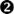

# 第三章. 使用数组解决问题


在上一章中，我们限制了自己只使用*标量变量*，即一次只能存储一个值的变量。在本章中，我们将探讨使用最常用的聚合数据结构——数组的问题。尽管数组是具有基本限制的简单结构，但它们的使用极大地增强了我们程序的功能。

在本章中，我们将主要处理实际的数组，即使用内置的 C++语法声明的数组，例如：

```
int tenIntegerArray[10];
```

然而，我们讨论的技术同样适用于具有类似属性的数据结构。其中最常见的是向量。术语*向量*通常用作任何一维数组的同义词，但在这里我们将使用更具体的意义，即具有数组属性但没有指定最大元素数量的结构。因此，在我们的讨论中，数组是固定大小的，而向量可以自动根据需要增长或缩小。本章讨论的每个问题都包括一些限制，允许我们使用具有固定元素数量的结构。然而，没有这种限制的问题可以适应使用向量。

此外，与数组一起使用的技巧通常也可以用于不具有上述所有属性的某些数据结构。例如，有些技巧不需要随机访问，因此它们可以与链表等结构一起使用。由于数组在编程中非常常见，并且数组技巧经常在非数组环境中使用，因此数组是研究使用数据结构解决问题的良好训练场。

# 数组基础回顾

你应该已经知道数组是什么，但为了清晰起见，让我们回顾一下数组的属性。一个*数组*是由同一类型的变量组成的集合，这些变量在同一个名称下组织，其中各个变量由一个数字表示。我们称这些单个变量为数组的*元素*。在 C++和大多数其他语言中，第一个元素的编号为 0，但在某些语言中，这会有所不同。

数组的主要属性直接来源于其定义。数组中存储的每个值都是同一类型的，而其他聚合数据结构可以存储混合类型的值。单个元素通过一个称为*下标*的数字来引用；在其他数据结构中，单个元素可能通过名称或键值来引用。

从这些基本属性中，我们可以推导出几个次要属性。因为每个元素都由从 0 开始的序列中的数字指定，所以我们很容易检查数组中的每个值。在其他数据结构中，这可能很困难、效率低下，甚至不可能。此外，与一些数据结构（如链表）只能按顺序访问不同，数组提供*随机访问*，这意味着我们可以在任何时间访问数组的任何元素。

这些基本和次要属性决定了我们可以如何使用数组。在处理任何聚合数据结构时，考虑问题时最好有一个基本操作集。将这些基本操作视为常用工具——数据结构中的锤子、螺丝刀和扳手。并不是每个机械问题都可以用常用工具解决，但在去五金店之前，你应该考虑问题是否可以用常用工具解决。以下是我为数组列出的基本操作列表。

## 存储

这是最基本的操作。数组是一组变量的集合，我们可以为这些变量中的每一个分配一个值。要将整数 5 分配给之前声明的数组中的第一个元素（元素 0），我们只需说：

```
tenIntegerArray[0] = 5;
```

就像任何变量一样，我们数组内部元素的值在特定值被分配之前将是随机的“垃圾”数据，因此在使用数组之前应该对其进行初始化。在某些情况下，尤其是在测试时，我们可能希望将特定值分配给数组中的每个元素。我们可以在声明数组时使用初始化器来完成这个操作。

```
int tenIntegerArray[10] = {4, 5, 9, 12, −4, 0, −57, 30987, −287, 1};
```

我们很快就会看到数组初始化器的良好应用。有时，我们不想为每个元素分配不同的值，而只想将数组中的每个元素初始化为相同的值。根据情况或使用的编译器（例如，Microsoft Visual Studio 中的 C++编译器），为数组中的每个元素分配零有一些快捷方式。然而，在这个阶段，我总是会在需要初始化的地方显式初始化数组，以提高可读性，就像以下代码所示，它将一个 10 元素数组中的每个元素设置为-1：

```
int tenIntegerArray[10];
for (int i = 0; i < 10; i++) tenIntegerArray[i] = −1;
```

## 复制

我们可以复制数组。有两种常见情况可能很有用。首先，我们可能想要对数组进行大量操作，但仍然需要保留数组原始形式以供后续处理。如果我们更改了任何值，将数组放回原始形式可能很困难，甚至不可能。通过复制整个数组，我们可以操作副本而不会干扰原始数组。我们只需要一个循环和一个赋值语句就可以复制整个数组，就像初始化的代码一样：

```
int tenIntegerArray[10] = {4, 5, 9, 12, −4, 0, −57, 30987, −287, 1};
int secondArray[10];
for (int i = 0; i < 10; i++) secondArray[i] = tenIntegerArray[i];
```

该操作适用于大多数聚合数据结构。第二种情况更具体于数组。有时我们想要将部分数据从第一个数组复制到第二个数组，或者我们想要将元素从第一个数组复制到第二个数组，作为重新排列元素顺序的方法。如果你研究过归并排序算法，你已经在实际操作中看到了这个想法。我们将在本章后面看到复制的示例。

## 检索与搜索

由于我们能够将值放入数组，因此我们还需要能够从数组中取出它们。从特定位置检索值是直接的：

```
int num = tenIntegerArray[0];
```

### 搜索特定值

通常情况并不那么简单。通常我们不知道需要的位置，而必须 *搜索* 数组以找到特定值的定位。如果数组中的元素没有特定的顺序，我们能做的最好的就是顺序搜索，即从数组的这一端看到另一端，直到找到所需值。这里有一个基本版本。

```
 const int ARRAY_SIZE = 10;
 int intArray[ARRAY_SIZE] = {4, 5, 9, 12, −4, 0, −57, 30987, −287, 1};
 int targetValue = 12;
 int targetPos = 0;
  while ((intArray[targetPos] != targetValue) && (targetPos < ARRAY_SIZE))
      targetPos++;
```

在此代码中，我们有一个常量用于存储数组的大小 ，数组本身 ，一个变量用于存储我们在数组中要查找的值 ，以及一个变量用于存储找到值的位置 。在此示例中，我们使用我们的 `ARRAY_SIZE` 常量来限制对数组的迭代次数 ，这样当 `targetValue` 在数组元素中未找到时，我们不会超出数组的末尾。你可以将数字 10 “硬编码”到常量中，但使用常量可以使代码更通用，因此更容易修改和重用。在本章的大部分代码中，我们将使用 `ARRAY_SIZE` 常量。请注意，如果 `targetValue` 在 `intArray` 中未找到，则循环结束后 `targetPos` 将等于 `ARRAY_SIZE`。这足以表示该事件，因为 `ARRAY_SIZE` 不是一个有效的元素编号。然而，检查这一点将由后续的代码来完成。另外，请注意，代码没有努力处理目标值出现多次的可能性。目标值第一次出现时，循环就会结束。

### 基于标准的搜索

有时候我们寻找的值不是一个固定的值，而是基于数组中其他值的相对关系的值。例如，我们可能想要找到数组中的最大值。完成这个任务的机制就是我所说的“山丘之王”，这个名称来源于操场上的游戏。有一个变量代表数组中迄今为止看到的最高值。通过循环遍历数组中的所有元素，每次遇到一个比之前最高值更高的值时，新的值就会将之前的“国王”从山上赶下来，取而代之：

```
const int ARRAY_SIZE = 10;
  int intArray[ARRAY_SIZE] = {4, 5, 9, 12, −4, 0, −57, 30987, −287, 1};
 int highestValue = intArray[0];
 for (int i = 1; i < ARRAY_SIZE; i++) {
      if (intArray[i] > highestValue) highestValue = intArray[i];
  }
```

变量 `highestValue` 存储了迄今为止在数组中找到的最大值。在其声明时，它被分配为数组的第一个元素的值 ![http://atomoreilly.com/source/no_starch_images/1273182.png]，这允许我们从数组的第二个元素开始循环（它允许我们从 `i` 为 1 而不是 0 开始）。在循环内部，我们比较当前位置的值与 `highestValue`，如果适当的话替换 `highestValue` ![http://atomoreilly.com/source/no_starch_images/1273191.png]。请注意，找到最小值而不是最大值，只需将“大于”比较 ![http://atomoreilly.com/source/no_starch_images/1273195.png] 转换为“小于”比较（并更改变量的名称，以免混淆自己）。这种基本结构可以应用于所有各种情况，在这些情况下我们想要查看数组中的每个元素以找到最能体现特定质量的值。

## 排序

*排序*意味着将数据按照指定的顺序排列。你可能已经遇到了用于数组的排序算法。这是一个经典的分析性能的领域，因为存在如此多的竞争排序算法，每个算法的性能特征都取决于底层数据的特征。对不同排序算法的研究本身就可以成为一本书的主题，所以我们不会深入探讨这个领域。相反，我们将专注于实际应用。在大多数情况下，你可以使用工具箱中的两种排序方法：一种快速、易于使用的排序方法，以及一种相当好理解、易于修改的排序方法，当需要时你可以有信心进行修改。对于快速和简单，我们将使用标准库函数 `qsort`，当我们需要调整时，我们将使用插入排序。

### 使用 qsort 进行快速简单的排序

C/C++程序员的默认快速排序是标准库中的`qsort`函数（名称暗示底层排序使用快速排序，但库的实现者并不需要使用该算法）。要使用`qsort`，我们必须编写一个比较函数。这个函数将由`qsort`在需要比较数组中的两个元素以确定哪个应该出现在排序顺序中时被调用。该函数接收两个`void`指针。我们在这本书中还没有讨论指针，但你需要知道的是，你应该将这些`void`指针转换为你的数组中元素类型的指针。然后该函数应该返回一个`int`，根据第一个元素是大于、小于还是等于第二个元素，返回正数、负数或零。返回的确切值并不重要，只有它是正数、负数还是零。让我们用一个快速示例来澄清这个讨论，即使用`qsort`对 10 个整数的数组进行排序。我们的比较函数：

```
int compareFunc(const void * voidA, const void * voidB) {
  int * intA = (int *)(voidA);
    int * intB = (int *)(voidB);
  return *intA - *intB;
}
```

参数列表由两个`const void`指针组成 。同样，对于比较器来说，这始终是这种情况。函数内部的代码首先声明两个`int`指针  并将两个`void`指针转换为`int`指针类型。我们可以不使用这两个临时变量来编写函数；我在这里包括它们是为了清晰。关键是，一旦我们完成了这些声明，`intA`和`intB`将指向我们的数组中的两个元素，而`*intA`和`*intB`将是必须比较的两个整数。最后，我们返回从第一个整数减去第二个整数的结果 。这将产生我们想要的结果。例如，如果`intA` > `intB`，我们希望返回一个正数，并且如果`intA` > `intB`，`intA` – `intB`将是正数。同样，如果`intB` > `intA`，`intA` – `intB`将是负数，当两个整数相等时，它将是零。

在比较函数就绪后，`qsort`的一个示例用法如下：

```
const int ARRAY_SIZE = 10;
int intArray[ARRAY_SIZE] = {87, 28, 100, 78, 84, 98, 75, 70, 81, 68};
qsort(intArray, ARRAY_SIZE, sizeof(int), compareFunc);
```

如你所见，`qsort`的调用需要四个参数：要排序的数组 ；该数组中的元素数量 ；数组中一个元素的大小，通常由`sizeof`运算符确定，就像这里一样 ；最后，比较函数 。如果你没有多少经验将函数作为参数传递给其他函数，请注意最后一个参数使用的语法。我们传递的是函数本身，而不是调用函数并传递调用结果。因此，我们只需声明函数名，不带参数列表或括号。

### 使用插入排序进行易于修改的排序

在某些情况下，你可能需要编写自己的排序代码。有时内置的排序方法可能无法满足你的需求。例如，假设你有一个数据数组，你希望根据另一个数组中的数据对其进行排序。当你不得不自己编写排序代码时，你将希望有一个简单直接的排序程序，你相信它并且可以随时使用。一个合理的建议是使用*插入排序*。插入排序的工作方式类似于许多人打桥牌时排序卡片的方式：他们一次拿起一张卡片，将其插入到手中的适当位置以保持整体顺序，同时将其他卡片向下移动以腾出空间。以下是针对我们的整数数组的基本实现：

```
 int start = 0;
 int end = ARRAY_SIZE - 1;
 for (int i = start + 1; i <= end; i++) {
      for (int j = i; j > start && 
intArray[j-1] > intArray[j]; j--) {
        int temp = intArray[j-1];
          intArray[j-1] = intArray[j];
          intArray[j] = temp;
      }
  }
```

我们首先声明两个变量，`start` 和 `end`，表示数组中第一个和最后一个元素的下标。这提高了代码的可读性，同时也允许代码容易地修改以仅对数组的部分进行排序，如果需要的话。外层循环选择下一个要插入到我们不断增长的有序手中的“卡片”。注意，循环将 `i` 初始化为 `start + 1`。记得在“找到最大值”的代码中，我们将最高值变量初始化为数组的第一个元素，并从数组的第二个元素开始循环。这是同样的想法。如果我们只有一个值（或“卡片”），那么根据定义，它已经是“有序”的，我们可以从考虑第二个值是否应该在第一个值之前或之后开始。内层循环通过反复交换当前值与其前驱值，直到它到达正确的位置，将当前值放入其正确的位置。循环计数器 `j` 从 `i` 开始，循环递减 `j`，直到我们没有达到数组的下限，并且还没有找到这个新值的正确停止点。在此之前，我们使用三个赋值语句将当前值在数组中向下移动一个位置。换句话说，如果你有一副 13 张的牌，并且已经排序了最左边的 4 张牌，你可以通过反复将第 5 张牌向下移动一张牌，直到它不再比其左侧的牌小，来将其放入正确的位置。这就是内层循环所做的。外层循环从最左边开始对每张牌做同样的事情。所以当我们完成时，整个数组就被排序了。

插入排序并不是在大多数情况下最有效的排序方法，说实话，之前的代码甚至都不是执行插入排序最有效的方法。然而，对于小到中等大小的数组来说，它是相当高效的，而且足够简单，以至于可以被记住——把它想象成一个心理宏。无论你选择这种排序还是其他排序，你应该有一个自己可以自信编码的 decent 或更好的排序程序。仅仅能够访问你不完全理解的别人的排序代码是不够的。如果你不确定一切是如何工作的，你不想去摆弄这些机器。

## 计算统计数据

最终操作与检索操作类似，因为我们需要在返回值之前查看数组中的每个元素。它与检索操作的不同之处在于，值不仅仅是数组中的一个元素，而是从数组中所有值计算出的某个统计量。例如，我们可能会计算平均值、中位数或众数，我们将在本章后面进行所有这些计算。我们可能计算的一个基本统计量可以是学生成绩的平均值：

```
const int ARRAY_SIZE = 10;
int gradeArray[ARRAY_SIZE] = {87, 76, 100, 97, 64, 83, 88, 92, 74, 95};
double sum = 0;
for (int i = 0; i < ARRAY_SIZE; i++) {
    sum += gradeArray[i];
}
double average = sum / ARRAY_SIZE;
```

作为另一个简单的例子，考虑数据验证。假设一个名为 `vendorPayments` 的双精度值数组代表了向供应商的付款。只有正值是有效的，因此负值表示数据完整性问题。作为验证报告的一部分，我们可能会写一个循环来计算数组中负值的数量：

```
const int ARRAY_SIZE = 10;
int countNegative = 0;
for (int i = 0; i < ARRAY_SIZE; i++) {
    if (vendorPayments[i] < 0) countNegative++;
}
```

# 使用数组解决问题

一旦你理解了常见的操作，解决数组问题与解决上一章中我们使用简单数据解决的问题并没有太大的不同。让我们拿一个例子，并使用上一章的技术以及我们可能需要的任何数组常见操作来运行它。

问题：寻找众数

在统计学中，一组值的众数是出现次数最多的值。编写代码处理一个调查数据数组，其中调查者用一个 1 到 10 范围内的数字回答了一个问题，以确定数据集的众数。对于我们的目的，如果存在多个众数，可以选择任何一个。

在这个问题中，我们被要求从一个数组中检索一个值。使用寻找类比和从已知信息开始的技术，我们可能希望应用我们已经看到的检索技术的某种变体：找到数组中的最大值。该代码通过将迄今为止看到的最大值存储在一个变量中来工作。然后代码将每个后续值与此变量进行比较，并在必要时替换它。这里类似的方法将是说我们将存储迄今为止出现频率最高的值在一个变量中，然后每当我们在数组中发现一个更常见的值时，就替换变量中的值。当我们这样用英语说出来时，这似乎可以工作，但当我们实际思考代码时，我们发现问题。让我们看看这个问题的示例数组和大小常量：

```
const int ARRAY_SIZE = 12;
int surveyData[ARRAY_SIZE] = {4, 7, 3, 8, 9, 7, 3, 9, 9, 3, 3, 10};
```

这组数据的模式是 3，因为 3 出现了四次，比任何其他值出现的频率都要高。但是，如果我们像处理“最高值”问题那样按顺序处理这个数组，我们会在什么时候决定 3 是众数呢？当我们遇到数组中 3 的第四次也是最后一次出现时，我们如何知道这确实是第四次和最后一次出现呢？似乎没有一种方法可以通过单次顺序处理数组数据来发现这种信息。

因此，让我们转向我们的另一种技术：简化问题。如果我们把相同数字的所有出现放在一起，事情会变得简单一些吗？例如，如果我们的样本数组调查数据看起来像这样：

```
int surveyData[ARRAY_SIZE] = {4, 7, 7, 9, 9, 9, 8, 3, 3, 3, 3, 10};
```

现在，所有的 7 都在一起，所有的 9 都在一起，所有的 3 也都在一起。以这种方式将数据分组后，似乎我们可以按顺序处理数组来找到众数。手动处理数组时，很容易计算每个值的出现次数，因为你只需继续数下去，直到找到第一个不同的数字。然而，将我们可以在脑海中完成的事情转换为编程语句可能会很棘手。因此，在我们尝试编写这个简化问题的代码之前，让我们先写一些*伪代码*，这是一种类似编程的语句，它既不是完全的英语或 C++，而是在两者之间。这将提醒我们，我们需要用每个语句尝试做什么。

```
int mostFrequent = ?;
  int highestFrequency = ?;
  int currentFrequency = 0;
 for (int i = 0; i < ARRAY_SIZE; i++) {
    currentFrequency++;
    if (surveyData[i] IS LAST OCCURRENCE OF A VALUE) {
         if (currentFrequency > highestFrequency) {
               highestFrequency = currentFrequency;
               mostFrequent = surveyData[i];
           }
         currentFrequency = 0;
      }
  }
```

编写伪代码没有对错之分，如果你使用这种技术，你应该采用自己的风格。当我写伪代码时，我倾向于写合法的 C++语句，对于我已经有信心的地方，然后在英语中详细说明我还需要思考的地方。在这里，我们知道我们需要一个变量（`mostFrequent`）来保存迄今为止最频繁出现的值，在循环结束时，这将是我们正确写入后的众数。我们还需要一个变量来存储该值出现的频率（`highestFrequency`），以便进行比较。最后，我们需要一个变量，我们可以用它来计数我们正在跟踪的值的出现次数（`currentFrequency`），在我们顺序处理数组时。我们知道我们需要初始化我们的变量。对于`currentFrequency`，它逻辑上必须从 0 开始，但还没有其他代码的情况下，我们不清楚如何初始化其他变量。所以让我们简单地插入问号  来提醒我们稍后再次查看这一点。

循环本身是我们已经见过的相同数组处理循环，所以它已经处于最终形式 。在循环内部，我们增加计数当前值出现的变量 ，然后我们到达关键语句。我们知道我们需要检查是否达到了特定值的最后一个出现 。伪代码允许我们暂时跳过逻辑的推理，并勾勒出其余的代码。不过，如果这是值的最后一个出现，我们知道该怎么做，因为这就像“最高值”代码：我们需要查看这个值的计数是否高于迄今为止看到的最高值。如果是，这个值就变成了新的最频繁值 。然后，因为接下来读取的值将是新值的第一个出现，我们重置我们的计数器 。

让我们回到我们跳过的`if`语句逻辑。我们如何知道这是数组中值的最后一个出现？因为数组中的值是分组的，所以当数组中的下一个值是不同的时候，我们知道一个值是最后一个出现：用 C++的话说，当`surveyData[i]`和`surveyData[i + 1]`不相等时。此外，数组的最后一个值也是某个值的最后一个出现，即使没有下一个值。我们可以通过检查`i == ARRAY_SIZE - 1`来检查这一点，在这种情况下，这是数组的最后一个值。

在弄清楚所有这些之后，让我们考虑一下我们变量的初始值。记得在使用“最高值”数组处理代码时，我们将“迄今为止最高”变量初始化为数组的第一个值。在这里，“最频繁出现的”值由两个变量表示，`mostFrequent`用于值本身，`highestFrequency`用于出现次数。如果能将`mostFrequent`初始化为数组中首次出现的值，将`highestFrequency`初始化为其频率计数，那就太好了，但在进入循环并开始计数之前，我们无法确定第一个值的频率。在这个时候，我们可能会想到，无论第一个值的频率是多少，它都将是大于零的。因此，如果我们把`highestFrequency`设为零，一旦我们到达第一个值最后一次出现的位置，我们的代码无论如何都会用第一个值的数字替换`mostFrequent`和`highestFrequency`。完整的代码看起来是这样的：

```
int mostFrequent;
int highestFrequency = 0;
int currentFrequency = 0;
for (int i = 0; i < ARRAY_SIZE; i++) {
    currentFrequency++;
  // if (surveyData[i] IS LAST OCCURENCE OF A VALUE)
  if (i == ARRAY_SIZE - 1 || surveyData[i] != surveyData[i + 1]) {
        if (currentFrequency > highestFrequency) {
            highestFrequency = currentFrequency;
            mostFrequent = surveyData[i];
        }
        currentFrequency = 0;
    }
}
```

在这本书中，我们不会过多地讨论纯风格问题，例如文档（注释）风格，但既然我们在这个问题上使用伪代码，我想提一个建议。我注意到，我在伪代码中留下的“普通英语”行，在最终代码中受益最多的地方就是注释，而普通英语本身就是一个很好的注释。我在这里的代码中展示了这一点。你可能会忘记`if`语句中的条件表达式背后的确切含义，但前一行上的注释很好地澄清了这些问题。

关于代码本身，它完成了任务，但请记住，它需要我们的调查数据被分组。分组数据可能本身就是一项工作，除非——如果我们对数组进行*排序*会怎样？实际上我们并不需要数据被排序，但排序将完成我们需要的分组。因为我们不打算进行任何特殊的排序，所以让我们将这个`qsort`调用添加到我们代码的开头：

```
qsort(surveyData, ARRAY_SIZE, sizeof(int), compareFunc);
```

注意，我们正在使用之前为`qsort`编写的相同的`compareFunc`。有了排序步骤，我们就有了解决原始问题的完整解决方案。所以我们的工作完成了。是吗？

## 重构

一些程序员谈论着“有坏味道”的代码。他们指的是那些没有错误但以某种方式仍然存在问题的可工作代码。有时这意味着代码过于复杂或包含过多的特殊情况，使得程序员难以修改和维护程序。在其他情况下，代码的效率不如预期，尽管它在测试用例中运行良好，但程序员担心性能会在更大的用例中崩溃。这就是我这里关心的问题。对于我们的小型测试用例，排序步骤几乎是瞬间的，但如果我们处理的数组非常大呢？此外，我知道快速排序算法（`qsort`可能正在使用）在数组中有大量重复值时性能最低，而这个问题的全部要点是所有我们的值都在 1 到 10 的范围内。因此，我建议对代码进行**重构**。**重构**意味着改进可工作代码，而不是改变它所做的事情，而是改变它执行的方式。我希望找到一个解决方案，即使对于非常大的数组也非常高效，假设值在 1 到 10 的范围内。

让我们再次思考我们已知如何使用数组的操作。我们已经探索了“找到最高值”代码的几个版本。我们知道直接将“找到最高值”代码应用于我们的`surveyData`数组不会产生有用的结果。我们能否找到一个数组，可以应用“股票”版本的“找到最高值”并得到调查数据的众数？答案是肯定的。我们需要的是`surveyData`数组的直方图。直方图是一个显示不同值在基础数据集中出现频率的图表；我们的数组将是此类直方图的数据。换句话说，我们将在一个 10 个元素的数组中存储 1 到 10 每个值在`surveyData`中出现的频率。下面是创建我们直方图的代码：

```
const int MAX_RESPONSE = 10;
 int histogram[MAX_RESPONSE];
 for (int i = 0; i < MAX_RESPONSE; i++) {
      histogram[i] = 0;
  }
 for (int i = 0; i < ARRAY_SIZE; i++) {
     histogram[surveyData[i] - 1]++;
  }
```

在第一行，我们声明数组来存储我们的直方图数据 。你会注意到我们声明了一个包含 10 个元素的数组，但我们的调查响应范围是 1–10，而这个数组的下标范围是 0–9。因此，我们需要进行调整，将 1 的计数放在`histogram[0]`中，依此类推。（一些程序员会选择声明一个包含 11 个元素的数组，留出位置`[0]`未使用，以便每个计数都能进入其自然位置。）我们使用循环显式地将数组值初始化为零 ，然后我们就可以使用另一个循环来计数`surveyData`中每个值的出现次数 。循环内的语句  需要仔细阅读；我们正在使用`surveyData`当前位置中的值来告诉我们应该增加`histogram`中的哪个位置。为了使这一点更清晰，让我们举一个例子。假设`i`是 42。我们检查`surveyData[42]`并找到（比如说）值 7。因此，我们需要增加我们的 7 计数器。我们从 7 中减去 1 得到 6，因为 7 的计数器在`histogram`中的位置是`[6]`，并且`histogram[6]`被增加。

在直方图数据就绪后，我们可以编写其余的代码。请注意，直方图代码是单独编写的，以便可以单独测试。在问题可以轻松分解为可以单独编写和测试的部分的情况下，一次性编写所有代码并不会节省时间。在测试了上述代码后，我们现在在`histogram`数组中搜索最大值：

```
 int mostFrequent = 0;
  for (int i = 1; i < MAX_RESPONSE; i++) {
      if (histogram[i] > histogram[mostFrequent]) mostFrequent = i;
  }
 mostFrequent++;
```

虽然这是一个“查找最大值”代码的改编版本，但存在差异。虽然我们在直方图数组中寻找最大值，但最终我们并不想要这个值本身，而是它的位置。换句话说，使用我们的样本数组，我们想知道 3 在调查数据中出现的频率比任何其他值都要高，但实际上 3 出现的次数并不重要。因此，`mostFrequent`将是`histogram`中最高值的**位置**，而不是最高值本身。因此，我们将其初始化为`0`  而不是`location[0]`中的值。这也意味着在`if`语句中，我们比较的是`histogram[mostFrequent]`  而不是`mostFrequent`本身，当我们找到一个更大的值时，我们将`i`而不是`histogram[i]`赋值给`mostFrequent` 。最后，我们增加`mostFrequent` 。这与我们在早期循环中所做的是相反的，通过减去 1 来获取正确的数组位置。如果`mostFrequent`告诉我们最高数组位置是 5，例如，这意味着调查数据中出现频率最高的值是 6。

直方图解决方案与我们的`surveyData`数组中的元素数量成线性比例，这是我们所能期望的最好的结果。因此，它比我们的原始方法更好。这并不意味着第一种方法是一个错误或浪费时间。当然，我们可以编写这个代码而不经过之前的版本，我们可以原谅我们希望我们能够直接到达目的地而不是走更长的路。然而，我警告你，当第一个解决方案最终不是最终解决方案时，不要拍打自己的额头。编写一个原始程序（记住，这意味着对于编写程序的程序员来说是**原始的**）是一个学习过程，不能期望它总是直线前进。此外，通常情况下，在一个问题上走更长的路可以帮助我们在后来的问题上走更短的路。在这个特定的情况下，请注意，我们的原始解决方案（虽然对于我们的特定问题扩展性不好）如果调查响应没有严格限制在 1-10 的小范围内，可能是正确的解决方案。或者假设你后来被要求编写一个查找一组整数值的**中位数**（中位数是中间的值，使得集合中一半的其他值更高，另一半的其他值更低）的代码。直方图方法对于中位数没有任何帮助，但我们的第一个方法对于众数是有帮助的。

这里的教训是，如果你从漫长的旅程中学到了一些你通过短途旅行无法学到的东西，那么漫长的旅程并不是浪费时间。这也是为什么系统地存储你编写的所有代码很有帮助的原因，这样你可以轻松地找到并稍后重用它。即使是最终成为“死胡同”的代码也可以成为宝贵的资源。

# 固定数据数组

在大多数数组问题中，数组是程序外部数据的存储库，例如用户输入的数据、本地磁盘上的数据或来自服务器的数据。然而，为了充分利用数组工具，你需要认识到其他可以使用数组的情况。通常，创建一个初始化后值永远不会改变的数组是有用的。这样的数组可以允许使用简单的循环，甚至直接使用数组查找来替换整个控制语句块。

在跟踪状态章节中，问题：解码信息的最终代码中，我们使用了一个`switch`语句将解码后的输入数字（范围在 1-8 之间）在“标点符号模式”下转换为相应的字符，因为数字和字符之间的联系是任意的。尽管这样做效果不错，但它使得该段代码比大写和小写模式的等效代码更长，而且如果标点符号的数量增加，代码的可扩展性不会很好。我们可以使用一个数组来解决这个问题，而不是使用`switch`语句。首先，我们需要将标点符号永久地分配到一个数组中，其顺序与编码方案中出现的顺序相同：

```
const char punctuation[8] = {'!', '?', ',', '.', ' ', ';', '"', '\''};
```

注意，这个数组已经被声明为`const`，因为其内部值永远不会改变。有了这个声明，我们可以用一个引用数组的单一赋值语句来替换整个`switch`语句：

```
outputCharacter = punctuation[number - 1];
```

因为输入数字的范围是 1-8，但数组元素是从 0 开始编号的，所以在引用数组之前，我们必须从输入数字中减去 1；这与我们在“寻找众数”程序的直方图版本中所做的调整相同。你可以使用相同的数组来反向操作。假设我们不是在解码信息，而是需要编码信息——也就是说，我们被给了一系列字符，需要将它们转换为可以使用原始问题规则解码的数字。要将一个标点符号转换为它的数字，我们必须在数组中定位该符号。这是一个检索操作，使用的是顺序搜索技术。假设要转换并存储在`char`变量`targetValue`中的字符，我们可以将顺序搜索代码调整为以下形式：

```
const int ARRAY_SIZE = 8;
int targetPos = 0;
while (punctuation[targetPos] != targetValue && targetPos < ARRAY_SIZE)
    targetPos++;
int punctuationCode = targetPos + 1;
```

注意，就像我们在上一个例子中必须从`number`中减去 1 以获得正确的数组位置一样，在这个例子中我们必须将数组位置加 1 以获得我们的标点符号代码，从数组的 0-7 范围转换为我们的标点符号代码范围 1-8。尽管这段代码不如单行简单，但它仍然比一系列`switch`语句简单得多，并且具有良好的可扩展性。如果我们想要将我们的编码方案中的标点符号数量加倍，那么数组中的元素数量也会加倍，但代码的长度将保持不变。

因此，一般来说，`const`数组可以用作查找表，取代一系列繁重的控制语句。假设你正在编写一个程序来计算一个州中商业许可证的费用，其中许可证费用随商业的毛销售额变化而变化。

表 3-1. 商业许可证费用

| 商业类别 | 销售门槛 | 许可费用 |
| --- | --- | --- |
| I | $0 | $25 |
| II | $50,000 | $200 |
| III | $150,000 | $1,000 |
| IV | $500,000 | $5,000 |

对于这个问题，我们可以使用数组来确定基于公司的毛销售额的商业类别，并根据商业类别分配许可证费用。假设一个`double`变量`grossSales`存储了商业的毛销售额，根据销售额，我们想要为`int category`和`double cost`分配适当的值：

```
const int NUM_CATEGORIES = 4;
 const double categoryThresholds[NUM_CATEGORIES ] =
      {0.0, 50000.0, 150000.0, 500000.0};
 const double licenseCost[NUM_CATEGORIES ] =
      {50.0, 200.0, 1000.0, 5000.0};
 category = 0;
 while (category < NUM_CATEGORIES &&
      categoryThresholds[category] <= grossSales) {
          category++;
      }
 cost = licenseCost[category - 1];
```

此代码使用两个固定值的数组。第一个数组存储每个商业类别的毛销售额门槛！[](httpatomoreillycomsourcenostarchimages1273182.png)。例如，年毛销售额为 65,000 美元的商业属于类别 II，因为这个金额超过了类别 II 的 50,000 美元门槛，但低于类别 III 的 150,000 美元门槛。第二个数组存储每个类别的商业许可证费用！[](httpatomoreillycomsourcenostarchimages1273191.png)。有了这些数组，我们将`category`初始化为 0！[](httpatomoreillycomsourcenostarchimages1273193.png)，并搜索`categoryThresholds`数组，直到门槛超过毛销售额或我们用完类别！[](httpatomoreillycomsourcenostarchimages1273195.png)。在两种情况下，当循环结束时，`category`将根据毛销售额正确分配为 1-4。最后一步是使用`category`从`licenseCost`数组中引用许可证费用！[](httpatomoreillycomsourcenostarchimages1273197.png)。和之前一样，我们必须对商业类别的 1-4 范围和我们的数组 0-3 范围进行小的调整。

# 非标量数组

到目前为止，我们只是处理了简单数据类型的数组，如`int`和`double`。然而，程序员经常必须处理复合数据类型的数组，无论是结构体还是对象（struct 或`class`）。尽管使用复合数据类型必然会使代码变得复杂一些，但这并不需要使我们对数组处理的思考变得复杂。通常，数组处理只涉及`struct`或`class`的一个数据成员，我们可以忽略数据结构的其他部分。有时，使用复合数据类型需要我们对方法进行一些调整。

例如，考虑寻找一组学生成绩中最高的成绩的问题。假设我们不是有一个`int`类型的数组，而是一个包含数据结构的数组，每个数据结构代表一个学生的记录：

```
struct student {
    int grade;
    int studentID;
    string name;
};
```

与数组一起工作的一个好处是，可以轻松地使用字面值初始化整个数组，以便于测试，即使是`struct`数组：

```
const int ARRAY_SIZE = 10;
student studentArray[ARRAY_SIZE] = {
    {87, 10001, "Fred"},
    {28, 10002, "Tom"},
    {100, 10003, "Alistair"},
    {78, 10004, "Sasha"},
    {84, 10005, "Erin"},
    {98, 10006, "Belinda"},
    {75, 10007, "Leslie"},
    {70, 10008, "Candy"},
    {81, 10009, "Aretha"},
    {68, 10010, "Veronica"}
};
```

这个声明意味着`studentArray[0]`的`grade`是 87，`studentID`是 10001，`name`是“Fred”，数组中的其他九个元素以此类推。至于代码的其他部分，可能就像复制本章开头的代码，然后将所有形式为`intArray[subscript]`的引用替换为`studentArray[subscript].grade`。这将导致以下结果：

```
int highest = studentArray[0].grade;
for (int i = 1; i < ARRAY_SIZE; i++) {
    if (studentArray[i].grade > highest) highest = studentArray[i].grade;
}
```

假设现在我们为每个学生有了额外的信息，我们想要找到成绩最好的学生的名字，而不是成绩本身。这将需要额外的修改。当循环结束时，我们唯一拥有的统计数据是最佳成绩，这并不允许我们直接确定它属于哪个学生。我们不得不再次遍历数组，寻找具有匹配`grade`的`struct`，这似乎是额外的、我们不应该做的额外工作。为了避免这个问题，我们应该额外跟踪与当前`highest`值匹配的学生名字，或者，而不是跟踪最高成绩，跟踪最高成绩在数组中的位置，就像我们在`histogram`中做的那样。后一种方法是最通用的，因为跟踪数组位置允许我们稍后检索该学生的任何数据：

```
 int highPosition = 0;
  for (int i = 1; i < ARRAY_SIZE; i++) {
      if (studentArray[i].grade > studentArray[highPosition].grade) {
          highPosition = i;
      }
  }
```

在这里，变量`highPosition` 取代了`highest`。因为我们没有直接跟踪最接近平均分的成绩，所以在需要将最接近平均分的成绩与当前成绩进行比较时，我们使用`highPosition`作为`studentArray` 的引用。如果当前数组位置的成绩更高，则将当前处理循环的位置分配给`highPosition` 。一旦循环结束，我们可以使用`studentArray[highPosition].name`访问成绩最接近平均分的学生姓名，我们还可以访问与该学生记录相关的任何其他数据。

# 多维数组

到目前为止，我们只讨论了一维数组，因为它们是最常见的。二维数组不常见，三维或更多维度的数组更罕见。这是因为大多数数据在本质上是一维的。此外，本质上多维的数据可以表示为多个单维数组，因此使用多维数组始终是程序员的选项。考虑表 3-1 的商业许可数据，这显然是多维数据。我的意思是，看看它——它是一个网格！然而，我将这个多维数据表示为两个单维数组，`categoryThresholds`和`licenseCost`。我本可以将数据表表示为二维数组，如下所示：

```
const double licenseData[2][numberCategories] = {
    {0.0, 50000.0, 150000.0, 500000.0},
    {50.0, 200.0, 1000.0, 5000.0}
};
```

将两个数组合并为一个很难看出任何优势。我们的代码并没有简化，因为没有理由一次性处理表格中的所有数据。然而，很明显，我们降低了表格数据的可读性和易用性。在原始版本中，两个单独数组的名称清楚地表明了存储在每个数组中的数据。而在合并后的数组中，我们程序员将不得不记住，形式为`licenseData[0][]`的引用指的是不同商业类别的总销售额阈值，而形式为`licenseData[1][]`的引用则指的是商业许可费用。

虽然有时使用多维数组是有意义的。假设我们正在处理三位销售代理的月销售数据，其中一项任务是找出任何代理的最高月销售额。将所有数据放在一个 3×12 的数组中意味着我们可以一次性处理整个数组，使用嵌套循环：

```
const int NUM_AGENTS = 3;
  const int NUM_MONTHS = 12;
 int sales[NUM_AGENTS][NUM_MONTHS] = {
      {1856, 498, 30924, 87478, 328, 2653, 387, 3754, 387587, 2873, 276, 32},
      {5865, 5456, 3983, 6464, 9957, 4785, 3875, 3838, 4959, 1122, 7766, 2534},
      {23, 55, 67, 99, 265, 376, 232, 223, 4546, 564, 4544, 3434}
  };
 int highestSales = sales[0][0];
  for (int agent = 0; agent < NUM_AGENTS; agent++) {
      for (int month = 0; month < NUM_MONTHS; month++) {
          if (sales[agent][month] > highestSales)
              highestSales = sales[agent][month];
      }
  }
```

虽然这是一个基本的“找到最大数”代码的直接改编，但还有一些小问题。当我们声明二维数组时，请注意初始化器是按 `agent` 组织的，也就是说，是 3 组 12 个，而不是 3 组 12 个 。正如你将在下一个问题中看到的那样，这个决定可能会产生后果。我们像往常一样将 `highestSales` 初始化为数组的第一个元素 。你可能觉得在嵌套循环的第一次迭代中，我们的两个循环计数器都将为 0，因此我们将比较 `highestSales` 的初始值与自身。这不会影响结果，但有时新手程序员会试图通过在内部循环体中放入第二个 `if` 语句来避免这种微小的低效：

```
if (agent != 0 || month != 0)
    if (sales[agent][month] > highestSales)
        highestSales = sales[agent][month];
```

然而，这比之前的版本效率低得多，因为我们将进行 50 次额外的比较，而只避免了一次。

注意，我已经为循环变量使用了有意义的名称：`agent` 用于外部循环  和 `month` 用于内部循环 。在处理一维数组的单循环中，描述性标识符带来的好处很小。然而，在处理二维数组的双循环中，有意义的标识符有助于我保持维度和下标的清晰，因为我可以查看并确认我在使用 `agent` 的维度与在数组声明中使用 `numAgents` 的维度相同。

即使我们有多维数组，有时一次处理一个维度可能是最好的方法。假设，使用与之前代码相同的 `sales` 数组，我们想要显示每个 `agent` 的月销售平均最高值。我们可以像之前一样使用双循环，但如果我们将整个数组视为三个单独的数组并分别处理它们，代码将更容易阅读和编写。

记得我们反复使用的计算整数数组平均值的代码吗？让我们将其制作成一个函数：

```
double arrayAverage(int intArray[], int ARRAY_SIZE) {
    double sum = 0;
    for (int i = 0; i < ARRAY_SIZE; i++) {
        sum += intArray[i];
    }
    double average = (sum + 0.5) / ARRAY_SIZE;
    return average;
}
```

函数就位后，我们可以再次修改基本的“找到最大数”代码，以找到月销售平均最高的 `agent`：

```
int highestAverage = arrayAverage(sales[0], 12);
for (int agent = 1; agent < NUM_AGENTS; agent++) {
    int agentAverage = arrayAverage(sales[agent], 12);
    if (agentAverage > highestAverage)
        highestAverage = agentAverage;
}
cout << "Highest monthly average: " << highestAverage << "\n";
```

这里的大新观点体现在对`arrayAverage`函数的两次调用中。这个函数接受一个一维的`int`数组作为第一个参数。在第一次调用中，我们传递了`sales[0]`作为第一个参数 ![http://atomoreilly.com/source/no_starch_images/1273182.png]，而在第二次调用中，我们传递了`sales[agent]` ![http://atomoreilly.com/source/no_starch_images/1273191.png]。因此，在这两种情况下，我们都为我们的二维数组`sales`的第一个维度指定了一个下标，但没有为第二个维度指定。由于 C++中数组和地址之间的直接关系，这个引用表示了指定行的第一个元素的地址，然后我们可以将这个地址作为函数使用的一个只包含该行的单维数组的基址。

如果这听起来很困惑，请再次查看`sales`数组的声明，特别是初始化器。值按照程序执行时在内存中布局的相同顺序排列在初始化器中。因此，`sales[0][0]`，即 1856，将首先出现，然后是`sales[0][1]`，498，以此类推，直到第一个代理的最后一个月，`sales[0][11]`，32。然后，第二个代理的值将从`sales[1][0]`，5865 开始。因此，尽管数组在概念上是 3 行 12 个值，但在内存中它被布局为一个包含 36 个值的连续序列。

重要的是要注意，这种技术之所以有效，是因为我们放置数据到数组中的顺序。如果数组是沿着另一个轴组织，即按月份而不是按代理组织，我们就无法做我们现在所做的事情。好消息是，有一个简单的方法可以确保你适当地设置了数组——只需检查初始化器。如果你想要单独处理的数据在数组初始化器中不是连续的，你就错误地组织了数据。

关于这段代码的最后一点是临时变量`agentAverage`的使用。由于当前代理的平均月销售额可能被在`if`语句的条件表达式中和然后在语句体中的赋值语句中两次引用，临时变量消除了对同一代理数据调用`arrayAverage`两次的可能性。

将多维数组视为数组数组的这种技术直接源于我们分解问题为更简单组件的核心原则，并且通常使得多维数组问题更容易概念化。即便如此，你可能认为这种技术看起来有点难以应用，如果你像大多数新的 C++程序员一样，你可能对地址和背后的地址运算有些谨慎。我认为，通过在一个`struct`或`class`中放置数组的一个级别，甚至可以更加强化维度的分离，这是克服这些感觉的最好方法。假设我们创建了一个`agentStruct`：

```
struct agentStruct {
    int monthlySales[12];
};
```

既然我们已经费心创建了一个`struct`，我们可能会考虑添加其他数据，比如代理识别号，但这将有助于简化我们的思维过程。有了`struct`，我们不再创建一个二维销售数组，而是创建一个一维代理数组：

```
agentStruct agents[3];
```

现在我们调用数组平均函数时，我们并没有使用 C++特有的技巧；我们只是传递了一个一维数组。例如：

```
int highestAverage = arrayAverage(agents[1].monthlySales, 12);
```

# 决定何时使用数组

数组只是一个工具。就像任何工具一样，学习如何使用数组的一个重要部分是学习何时使用它——以及何时不使用它。到目前为止讨论的示例问题假设了在描述中使用数组。然而，在大多数情况下，我们不会有人详细说明这一点，我们必须自己决定是否使用数组。我们必须做出这种决定的常见情况是我们被提供了聚合数据，但没有被告知如何内部存储。例如，在找到众数的问题中，假设开始于“编写代码处理调查数据数组……”的行被改为“编写代码处理调查数据集合……”。现在，是否使用数组的选择就取决于我们了。我们如何做出这个决定？

记住，一旦数组被创建，我们无法改变其大小。如果我们空间不足，程序将会失败。因此，首要考虑的是，在我们程序中需要聚合数据结构的地方，我们是否知道将要存储多少值，或者至少对最大大小的可靠估计。这并不意味着我们在编写程序时必须知道数组的大小。C++，以及大多数其他语言，都允许我们在运行时创建大小可变的数组。假设模式问题被修改，以至于我们事先不知道会有多少调查响应，但这个数字作为用户输入传递给程序。然后我们可以动态声明一个数组来存储调查数据。

```
int ARRAY_SIZE;
  cout << "Number of survey responses: ";
  cin >> ARRAY_SIZE;
 int *surveyData = new int[ARRAY_SIZE];
  for(int i = 0; i < ARRAY_SIZE; i++) {
      cout << "Survey response " << i + 1 << ": ";
    cin >> surveyData[i];
  }
```

我们使用指针表示法声明数组，并通过调用`new`运算符对其进行初始化 ![http://atomoreilly.com/source/no_starch_images/1273182.png]。由于 C++中指针和数组类型之间的灵活性，元素可以通过数组表示法访问 ![http://atomoreilly.com/source/no_starch_images/1273191.png]，即使`surveyData`被声明为指针。请注意，因为这个数组是动态分配的，所以在程序结束时，当我们不再需要数组时，我们必须确保释放它：

```
delete[] surveyData;
```

对于数组，我们使用的是`delete[]`运算符，而不是通常的`delete`运算符。虽然对于整数数组来说这不会造成任何区别，但如果您创建了一个对象数组，`delete[]`运算符确保在删除数组本身之前删除数组中的各个对象。因此，您应该养成始终使用`delete[]`与动态分配的数组一起使用的习惯。

承担清理动态内存的责任是 C++程序员的噩梦，但如果你使用这种语言编程，这是一件你必须做的事情。初学者往往逃避这个责任，因为他们的程序很小，执行时间很短，所以他们从未看到内存泄漏（程序不再使用的内存但从未被释放，因此无法供系统其他部分使用）的有害影响。不要养成这种坏习惯。

注意，我们之所以能够使用动态数组，仅仅是因为用户事先告诉我们调查响应的数量。考虑另一种情况，用户开始输入调查响应，但没有告诉我们响应的数量，通过输入-1（一种称为*哨兵*的数据输入方法）来表示没有更多的响应。我们还能使用数组来解决这个问题吗？

这是一个灰色地带。如果我们有一个保证的最大响应数量，我们仍然可以使用数组。在这种情况下，我们可以声明一个该大小的数组，并假设我们是安全的。尽管如此，我们可能仍然会长期担忧。如果未来调查池的大小增加怎么办？如果我们想用不同的调查者使用相同的程序怎么办？更普遍地说，如果我们能避免，为什么还要构建一个具有已知限制的程序呢？

那么，最好使用一个没有固定大小的数据收集。如前所述，C++标准模板库中的向量类就像一个数组，但会根据需要增长。一旦声明和初始化，向量就可以像数组一样被处理。我们可以使用标准数组符号给向量元素赋值或检索值。如果向量已填满其初始大小，我们需要添加另一个元素，我们可以使用`push_back`方法来实现。使用向量解决修改后的问题看起来是这样的：

```
 vector<int> surveyData;
 surveyData.reserve(30);
  int surveyResponse;
  cout << "Enter next survey response or −1 to end: ";
 cin >> surveyResponse;
  while (surveyResponse != −1) {
     surveyData.push_back(surveyResponse);
      cout << "Enter next survey response or −1 to end: ";
      cin >> surveyResponse;
  }
 int vectorSize = surveyData.size();
  const int MAX_RESPONSE = 10;
  int histogram[MAX_RESPONSE];
  for (int i = 0; i < MAX_RESPONSE; i++) {
      histogram[i] = 0;
  }
  for (int i = 0; i < vectorSize; i++) {
      histogram[surveyData[i] - 1]++;
  }
  int mostFrequent = 0;
  for (int i = 1; i < MAX_RESPONSE; i++) {
      if (histogram[i] > histogram[mostFrequent]) mostFrequent = i;
  }
  mostFrequent++;
```

在这个代码中，我们首先声明了向量 ![http://atomoreilly.com/source/no_starch_images/1273182.png] 并为 30 个调查响应预留了空间 ![http://atomoreilly.com/source/no_starch_images/1273191.png]。第二步不是严格必要的，但预留一小部分超出预期元素数量的空间可以防止向量在我们添加值时频繁调整大小。我们在数据输入循环之前读取了第一个成绩 ![http://atomoreilly.com/source/no_starch_images/1273193.png]，这是一种我们在上一章中首次使用的技术，允许我们在处理之前检查每个输入的值。在这种情况下，我们想要避免将哨兵值-1 添加到我们的向量中。调查结果使用`push_back`方法 ![http://atomoreilly.com/source/no_starch_images/1273195.png] 添加到向量中。数据输入循环完成后，我们使用`size`方法 ![http://atomoreilly.com/source/no_starch_images/1273197.png] 获取向量的大小。我们也可以在数据输入循环中自己计数元素数量，但由于向量已经跟踪其大小，这避免了重复的工作。其余的代码与使用数组和固定数量响应的上一版本相同，只是我们更改了变量的名称。

然而，所有关于向量的讨论都忽略了一个重要的观点。如果我们直接从用户那里读取数据，而不是被告知我们从一个数组或其他数据集合开始，我们可能不需要为调查数据使用数组，只需要为直方图使用一个。相反，我们可以在读取调查值时处理它们。我们只需要数据结构在我们需要读取所有值在处理之前或需要多次处理值时。在这种情况下，我们不需要做这两件事：

```
const int MAX_RESPONSE = 10;
int histogram[MAX_RESPONSE];
for (int i = 0; i < MAX_RESPONSE; i++) {
    histogram[i] = 0;
}
int surveyResponse;
cout << "Enter next survey response or −1 to end: ";
cin >> surveyResponse;
while (surveyResponse != −1) {
    histogram[surveyResponse - 1]++;
    cout << "Enter next survey response or −1 to end: ";
    cin >> surveyResponse;
}
int mostFrequent = 0;
for (int i = 1; i < MAX_RESPONSE; i++) {
    if (histogram[i] > histogram[mostFrequent]) mostFrequent = i;
}
mostFrequent++;
```

尽管这个代码编写起来很简单，鉴于有之前的版本作为指导，只需将用户数据读入数组并直接使用之前的处理循环即可，这样做会更加简单。这种边做边走的过程的好处在于效率。我们避免了在只需要存储一个响应时，不必要地存储每个调查响应。我们的基于向量的解决方案在空间上效率低下：它占用的空间比所需的更多，而没有提供相应的利益。此外，将所有成绩读入向量需要单独的循环，这个循环与处理所有调查响应和找到直方图中的最大值的循环是分开的。这意味着向量版本做了比上面版本更多的工作。因此，向量版本在时间上也是低效的：它做了比所需更多的工作，而没有提供相应的利益。在某些情况下，不同的解决方案会提供权衡，程序员必须在空间效率和时间效率之间做出决定。然而，在这种情况下，使用向量使得程序在各方面都变得低效。

在这本书中，我们不会花费大量时间去追踪每一个低效之处。程序员有时必须进行**性能调优**，这是对程序在时间和空间上的效率进行系统分析和改进的过程。对程序进行性能调优就像对赛车进行性能调优：这是一项精确的工作，其中微小的调整可以产生巨大的影响，并且需要了解“引擎盖下”机制如何工作的专业知识。即使我们没有时间、欲望或知识来完全调优程序的性能，我们仍然应该避免导致严重低效的决定。不必要地使用向量或数组，就像发动机燃料与空气混合比例过稀一样；这就像当你可以把所有东西都塞进一辆本田思域时，却开着公交车去海滩度假。

如果我们确定需要多次处理数据，并且我们对数据集的最大大小有很好的把握，那么决定是否使用数组的最后一个标准就是随机访问。稍后，我们将讨论其他数据结构，如列表，它们像向量一样可以按需增长，但与向量和数组不同，元素只能按顺序访问。也就是说，如果我们想访问列表中的第 10 个元素，我们必须运行前 9 个元素才能到达它。相比之下，**随机访问**意味着我们可以在任何时间访问数组或向量中的任何元素。所以最后一个规则是，当我们需要随机访问时应该使用数组。如果我们只需要顺序访问，我们可能需要考虑不同的结构。

你可能会注意到，本章中的许多程序都未能满足最后一个标准；我们按顺序访问数据，而不是随机访问，但我们却在使用数组。这导致了所有这些规则的一个伟大的、常识性的例外。如果数组很小，那么之前的所有反对意见都不会有很大的分量。“小”的定义可能因平台或应用程序而异。关键是，如果你的程序需要 1 个或 10 个物品的集合，每个物品需要 10 个字节，你必须考虑从分配最大所需大小的数组中可能产生的 90 个字节的潜在浪费是否值得寻找更好的解决方案。明智地使用数组，但不要让完美成为优秀的敌人。

# 练习

总是如此，我敦促你们尽可能多地尝试练习。

1.  你们对我们没有做更多关于排序的事情感到失望吗？我在这里就是为了帮助你们。为了确保你们对`qsort`函数感到舒适，编写使用该函数对学生的`struct`数组进行排序的代码。首先让它按成绩排序，然后再次尝试使用学生 ID 进行排序。

1.  重新编写查找具有最佳月销售平均值的代理的代码，使其查找具有最高**中位数**销售的代理。如前所述，一组值的中位数是“中间的值”，即其他一半的值更高，另一半的值更低。如果有偶数个值，中位数是中间两个值的简单平均值。例如，在集合 10, 6, 2, 14, 7, 9 中，中间的值是 7 和 9。7 和 9 的平均值是 8，所以 8 是中位数。

1.  编写一个`bool`函数，该函数接受一个数组和该数组中的元素数量，并确定数组中的数据是否已排序。这应该只需要一次遍历！

1.  这里是`const`值数组的另一种变体。编写一个程序来创建一个替换密码问题。在替换密码问题中，所有消息都由大写字母和标点符号组成。原始消息称为明文，你通过将每个字母替换为另一个字母（例如，每个 C 可以变成 X）来创建密文。对于这个问题，硬编码一个包含 26 个`char`元素的`const`数组作为密码，并让程序读取明文消息并输出相应的密文。

1.  让前面的程序将密文转换回明文以验证编码和解码。

1.  为了使密文问题更具挑战性，让程序随机生成密码数组而不是硬编码的`const`数组。实际上，这意味着在每个数组元素中放置一个随机字符，但请记住，你不能用字母替换自己。所以第一个元素不能是 A，并且你不能为两次替换使用相同的字母——也就是说，如果第一个元素是 S，则其他元素不能是 S。

1.  编写一个程序，该程序接受一个整数数组，并确定其**众数**，即数组中出现频率最高的数字。

1.  编写一个程序，该程序处理`student`对象数组，并确定成绩四分位数——也就是说，一个人需要达到或超过 25%的学生、50%的学生和 75%的学生的成绩。

1.  考虑对`sales`数组的这种修改：由于销售人员一年中会有变动，我们现在用-1 标记销售代理招聘前的月份，或销售代理最后一个月之后的月份。重新编写你的最高销售平均数或最高销售中位数代码以进行补偿。
