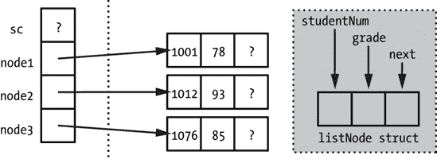

# 第四章. 使用指针和动态内存解决问题


在本章中，我们将学习如何使用指针和动态内存解决问题，这将使我们能够编写灵活的程序，以适应程序运行时才知道的数据大小。指针和动态内存分配是“核心”编程。当你能够动态地获取内存块，将它们链接成有用的结构，并在结束时清理一切，以确保没有残留物时，你不仅仅是一个会写点代码的人——你是一个程序员。

由于指针很复杂，并且许多流行的语言，如 Java，似乎放弃了指针的使用，一些初学者程序员会说服自己可以完全跳过这个主题。这是一个错误。指针和间接内存访问将在高级编程中始终被使用，即使它们可能被高级语言机制所隐藏。因此，为了真正像程序员一样思考，你必须能够通过指针和基于指针的问题进行思考。

在我们着手解决指针问题之前，我们将仔细检查指针工作的所有方面，包括表面和幕后。这项研究提供了两个好处。首先，这些知识将使我们能够最有效地使用指针。其次，通过消除指针的神秘感，我们可以有信心地使用它们。

# 指针基础回顾

与前面章节中介绍的主题一样，你应该已经接触过基本指针的使用，但为了确保我们处于同一页面上，这里有一个快速回顾。

C++中的指针用星号（`*`）表示。根据上下文，星号表示正在声明一个指针，或者我们指的是被指向的内存，而不是指针本身。要声明一个指针，我们在类型名和标识符之间放置星号：

```
int * intPointer;
```

这将变量`intPointer`声明为一个指向`int`的指针。请注意，星号与标识符绑定，而不是与类型绑定。在下面的例子中，`variable1`是一个指向`int`的指针，但`variable2`只是一个`int`：

```
int * variable1, variable2;
```

变量前的符号“&”充当“地址-of”操作符。因此，我们可以将`variable2`的地址赋给`variable1`，如下所示：

```
variable1 = &variable2;
```

我们还可以直接将一个指针变量的值赋给另一个指针变量：

```
intPointer = variable1;
```

也许是更重要的是，我们可以在运行时分配内存，并且只能通过指针访问。这是通过`new`操作符实现的：

```
double * doublePointer = new double;
```

访问指针另一端的内存称为“解引用”，并且通过在指针标识符左侧使用星号来实现。同样，这也是我们用于指针声明的相同位置。上下文使意义不同。以下是一个例子：

```
 *doublePointer = 35.4;
 double localDouble = *doublePointer;
```

在将值从该内存位置复制到变量`localDouble`之前，我们给之前代码分配的`double`变量赋值  。

为了释放使用`new`分配的内存，一旦我们不再需要它，我们使用关键字`delete`：

```
delete doublePointer;
```

这个过程的机制在内存问题中详细描述，在内存问题中。

# 指针的好处

指针赋予我们静态内存分配所不具备的能力，同时也提供了高效使用内存的新机会。使用指针的三个主要好处是：

+   运行时大小的数据结构

+   可变大小的数据结构

+   内存共享

让我们更详细地看看这些内容。

## 运行时大小的数据结构

通过使用指针，我们可以创建一个在运行时确定大小的数组，而不是在构建我们的应用程序之前就必须选择大小。这使我们免于在数组可能空间不足和使数组尽可能大之间做出选择，从而在平均情况下浪费大量数组空间。我们第一次在何时使用数组中看到了运行时数据大小，在何时使用数组中。我们将在本章后面使用这个概念，在可变长度字符串和解决指针问题中。

## 可变大小的数据结构

我们也可以创建在运行时根据需要增长或缩小的基于指针的数据结构。最基本的可变大小数据结构是链表，你可能已经见过。尽管结构中的数据只能按顺序访问，但链表总是有与数据本身一样多的数据位置，没有浪费的空间。你将在后面看到的其他更复杂基于指针的数据结构，它们具有排序和“形状”，可以比数组更好地反映底层数据的关系。正因为如此，尽管数组提供了指针结构无法提供的完全随机访问，但*检索*操作（我们在结构中找到最符合一定标准的元素）在基于指针的结构中可以更快。我们将在本章后面利用这个优势创建一个按需增长的学生记录数据结构。

## 内存共享

指针可以通过允许内存块共享来提高程序效率。例如，当我们调用一个函数时，我们可以传递一个内存块的指针而不是使用*引用参数*传递该块的副本。你很可能之前见过这些；它们是形式参数列表中类型和名称之间出现&符号的参数：

```
void refParamFunction (int & x) {
    x = 10;
}

int number = 5;
refParamFunction(number);
cout << number << "\n";
```

### 注意

在&符号前后显示的空格不是必需的——我只是为了美观而包括它们。在其他开发者的代码中，你可能看到`int& x`、`int &x`，甚至可能是`int&x`。

在此代码中，形式参数`x`  并不是`number`  参数的副本；相反，它是对存储`number`的内存的引用。因此，当`x`被修改  时，`number`的内存空间也会改变，并且代码片段末尾的输出是`10` 。引用参数可以用作将值从函数中传出的机制，如本例所示。更广泛地说，引用参数允许被调用的函数和调用函数共享相同的内存，从而降低开销。如果一个作为参数传递的变量占用 1 千字节内存，那么以引用传递变量意味着复制一个 32 位或 64 位指针而不是 1 千字节。我们可以通过使用`const`关键字来表示我们正在使用引用参数以性能为目的，而不是输出：

```
int anotherFunction(const int & x);
```

通过在引用参数`x`的声明前加上`const`，`anotherFunction`将接收调用中传递的参数的引用，但将无法修改该参数中的值，就像任何其他`const`参数一样。

通常，我们可以这样使用指针，允许程序的不同部分或程序内部的不同数据结构访问相同的数据，而无需复制带来的开销。

# 何时使用指针

正如我们讨论数组时提到的，指针有潜在的缺点，并且只有在适当的情况下才应使用。我们如何知道何时使用指针是合适的呢？在刚刚列出了指针的好处之后，我们可以说，指针应该只在需要其一个或多个好处时使用。如果你的程序需要一个结构来存储数据聚合，但你无法在运行时之前准确估计数据量；或者你需要一个在执行过程中可以增长和缩小的结构；或者如果你有大型对象或其他数据块在程序中传递，指针可能是可行的。然而，在没有这些情况的情况下，你应该对指针和动态内存分配持谨慎态度。

考虑到指针臭名昭著的声誉，作为 C++中最难用的特性之一，你可能会认为没有程序员会在不必要的时候尝试使用指针。然而，我多次惊讶地发现并非如此。有时程序员只是欺骗自己认为需要指针。假设你正在调用一个由其他人编写的函数，可能是从库或应用程序编程接口中，其原型如下：

```
void compute(int input, int* output);
```

我们可能会想象这个函数是用 C 语言编写的，而不是 C++，这就是为什么它使用指针而不是引用（`&`）来传递“输出”参数。在调用这个函数时，程序员可能会粗心大意地做如下操作：

```
int num1 = 10;
int* num2 = new int;
compute(num1, num2);
```

这段代码在空间上效率低下，因为它在不需要指针的地方创建了一个指针。它不是使用两个整数的空间，而是使用了两个整数和一个指针的空间。代码在时间上的效率也低下，因为不必要的内存分配需要时间（如下一节所述）。最后，程序员现在必须记住要`delete`分配的内存。所有这些都可以通过使用`&`操作符的另一个方面来避免，它允许你获取静态分配变量的地址，如下所示：

```
int num1 = 10;
int num2;
compute(num1, &num2);
```

严格来说，我们在第二个版本中仍在使用指针，但我们是在隐式地使用它，没有使用指针变量或动态内存分配。

# 内存的重要性

要理解动态内存分配如何为我们提供运行时大小调整和内存共享，我们必须稍微了解一下内存分配在一般情况下是如何工作的。这是我认为新程序员学习 C++会受益的一个领域。所有程序员最终都必须理解现代计算机中内存系统的工作方式，而 C++迫使你直面这个问题。其他语言隐藏了内存系统的大部分脏细节，新程序员会说服自己这些细节无关紧要，这显然是不对的。相反，只要一切正常，这些细节确实无关紧要。然而，一旦出现问题，对底层内存模型的缺乏了解就会在程序员和解决方案之间形成难以逾越的障碍。

## 栈和堆

C++ 在两个地方分配内存：*栈* 和 *堆*。正如其名所示，栈是有序且整洁的，而堆是零散且混乱的。*栈* 这个名字尤其具有描述性，因为它有助于你可视化内存分配的连续性。想象一下一堆箱子，就像图 4-1（a）中所示。当你有箱子要存放时，你将其放在栈顶。要从栈中移除特定的箱子，你必须首先移除其上方的所有箱子。在实际编程术语中，这意味着一旦你在栈上分配了一块内存（一个箱子），就无法调整其大小，因为任何时间你可能有其他内存块紧随其后（在其上方的其他箱子）。

在 C++ 中，你可能会为特定的算法显式创建自己的栈，但无论如何，你的程序总是会使用一个栈，称为程序的 *运行时栈*。每次调用函数（包括 `main` 函数），都会在运行时栈的顶部分配一块内存。这块内存称为 *激活记录*。对其内容的全面讨论超出了本文的范围，但为了你作为问题解决者的理解，激活记录的主要内容是变量的存储空间。所有局部变量的内存，包括函数的参数，都在激活记录内分配。让我们来看一个例子：

```
int functionB(int inputValue) {
  return inputValue - 10;
}
int functionA(int num) {
    int localVariable = functionB(num * 10);
    return localVariable;
}
int main()
{
    int x = 12;
    int y = functionA(x);
    return 0;
}
```

在此代码中，`main` 函数调用 `functionA`，而 `functionA` 又调用 `functionB`。图 4-1（b）展示了在执行 `functionB` 的返回语句之前，运行时栈的简化排列方式！。所有三个函数的激活记录将按连续内存的顺序排列，其中 `main` 函数位于栈底。（为了使事情更加复杂，栈可能从内存中的最高点开始，向下构建到较低的内存地址，而不是向上构建到较高的内存地址。不过，忽略这种可能性并不会对你造成伤害。）从逻辑上讲，`main` 函数的激活记录位于栈底，`functionA` 的激活记录位于其上方，而 `functionB` 的激活记录位于 `functionA` 的上方。在 `functionB` 的激活记录被移除之前，下面两个较低的激活记录都不能被移除。


图 4-1. 一堆箱子以及一堆函数调用

虽然栈非常有序，但与之相比，堆的组织性很小。假设你再次用板条箱存储东西，但这些板条箱很脆弱，你不能把它们堆叠在一起。你有一个大房间，最初是空的，用来存放板条箱，你可以把它们放在地板上的任何地方。然而，板条箱很重，所以一旦放下，你宁愿把它放在那里，直到你准备好把它从房间里拿出来。这个系统与栈相比有优点也有缺点。一方面，这种存储系统很灵活，允许你在任何时间获取任何板条箱的内容。另一方面，房间很快就会变得杂乱无章。如果板条箱大小不一，那么充分利用地板上的所有空间将特别困难。你会在板条箱之间留下很多无法用另一个板条箱填充的空隙。由于板条箱不能轻易移动，移除几个板条箱只会产生几个难以填充的空隙，而不是提供我们最初空旷地板的宽敞存储空间。在实际编程术语中，我们的堆就像那个房间的地板。一块内存是一系列连续的地址；因此，在具有许多内存分配和释放的程序的生命周期中，我们最终会在剩余的分配内存块之间留下很多空隙。这个问题被称为*内存碎片化*。

每个程序都有自己的堆，内存在这里是动态分配的。在 C++中，这通常意味着调用`new`关键字，但你也会看到对旧 C 函数的调用，例如`malloc`。每次调用`new`（或`malloc`）都会在堆中预留一块内存并返回该块的指针，而每次调用`delete`（或如果内存是用`malloc`分配的，则返回`free`）都会将块返回到可用的堆内存池中。由于碎片化，池中的内存并不都同样有用。如果我们程序一开始在堆内存中分配变量 A、B 和 C，我们可能会期望这些块是连续的。如果我们释放 B，它留下的空隙只能被另一个大小为 B 或更小的请求填充，直到 A 或 C 也被释放。

图 4-2 阐明了这种情况。在部分(a)中，我们看到我们房间的地板上散落着箱子。在某个时刻，房间可能组织得很好，但随着时间的推移，布局变得杂乱无章。现在有一个小箱子(b)无法放入地板上的任何开放空间，尽管整体未使用的地板面积远远超过了箱子的占地面积。在部分(c)中，我们表示一个小堆。虚线方框是内存的最小（不可分割）块，可能是单个字节、内存字或更大的块，具体取决于堆管理器。阴影区域表示连续内存的分配；为了清晰起见，一个分配的部分块被编号。与碎片化的地板一样，碎片化的堆将未分配的内存块分开，这降低了其可用性。总共有 85 个未使用的内存块，但最大的连续未使用内存块，如箭头所示，只有 17 个块长。换句话说，如果每个块都是一个字节，这个堆无法满足`new`调用超过 17 字节的任何请求，尽管堆有 85 字节空闲。


图 4-2. 一个碎片化的地板，一个无法放置的箱子，以及碎片化的内存

## 内存大小

记忆的第一个实际问题是要限制其使用范围在必要范围内。现代计算机系统拥有如此多的内存，很容易将其视为一种无限资源，但实际上每个程序都有有限的内存。此外，程序需要高效地使用内存，以避免整体系统变慢。在多任务操作系统（这意味着几乎所有的现代操作系统）中，一个程序浪费的每一个字节都会使整个系统趋向于这样一个点：当前运行程序集没有足够的内存来运行。在这个点上，操作系统会不断地将一个程序的块交换到另一个程序中，从而使得系统变得极其缓慢。这种情况被称为*颠簸*。

注意，除了希望将整个程序的内存占用尽可能小之外，栈和堆还有最大大小限制。为了证明这一点，让我们每次从堆中分配 1 千字节大小的内存，直到出现故障：

```
const int intsPerKilobyte = 1024 / sizeof(int);
while (true) {
    int *oneKilobyteArray = new int[intsPerKilobyte];
}
```

让我强调，这段代码纯粹是为了演示某个观点而编写的糟糕代码。如果你想在你的系统上尝试这段代码，请先保存所有的工作，以确保安全。应该发生的情况是程序停止运行，你的操作系统会抱怨代码生成了一个但未处理的 `bad_alloc` 异常。这个异常是在堆中没有足够大的未分配内存块来满足请求时由 `new` 抛出的。堆内存耗尽被称为 *堆溢出*。在某些系统中，堆溢出可能很常见，而在其他系统中，程序在产生 `bad_alloc` 之前就会导致系统崩溃（在我的系统中，`new` 调用失败直到我在之前的调用中分配了两个吉字节）。

运行时栈也存在类似的情况。每个函数调用都会在栈上分配空间，即使是没有任何参数或局部变量的函数，每个激活记录也有一些固定的开销。最容易演示这一点的方法是使用一个失控的递归函数：

```
 int count = 0;
  void stackOverflow() {
     count++;
     stackOverflow();
  }
  int main()
  {
    stackOverflow();
     return 0;
  }
```

这段代码有一个全局变量 ，在大多数情况下这是不良的编程风格，但在这里我需要一个在整个递归调用中持续存在的值。因为这个变量是在函数外部声明的，所以在函数的激活记录中不会为其分配内存，也没有其他局部变量或参数。这个函数所做的只是增加 `count` 并进行递归调用 。递归在 第六章 中有详细的讨论，但在这里只是简单地用来尽可能延长函数调用的链。函数的激活记录会一直留在栈上，直到该函数结束。所以当第一次从 `main` 调用 `stackOverflow` 时，会在运行时栈上放置一个激活记录，直到第一个函数调用结束之前无法移除。这永远不会发生，因为函数会再次调用 `stackOverflow`，在栈上放置另一个激活记录，然后它又会进行第三次调用，以此类推。这些激活记录会一直堆叠，直到栈空间耗尽。在我的系统中，当程序崩溃时 `count` 大约是 4,900。我的开发环境 Visual Studio 默认的栈分配是 1MB，这意味着即使没有局部变量或参数，每个函数调用也会创建一个超过 200 字节的激活记录。

## 生命周期

变量的*生命周期*是从分配到释放的时间跨度。对于基于栈的变量，意味着局部变量或参数，其生命周期是隐式处理的。变量在函数调用时分配，在函数结束时释放。对于基于堆的变量，意味着使用`new`动态分配的变量，其生命周期在我们手中。管理动态分配变量的生命周期是每个 C++程序员的噩梦。最明显的问题是可怕的*内存泄漏*，这是一种从堆中分配内存但从未释放且未由任何指针引用的情况。这里有一个简单的例子：

```
 int *intPtr = new int;
 intPtr = NULL;
```

在这段代码中，我们声明了一个指向整数的指针 ，通过从堆中分配一个整数来初始化它。然后在第二行，我们将我们的整数指针设置为`NULL` （它只是零的别名）。然而，我们使用`new`分配的整数仍然存在。它孤独地坐在堆中的位置，等待着永远无法到来的释放。我们无法释放这个整数，因为释放内存块，我们使用`delete`后跟指向该块的指针，而我们不再有指向该块的指针。如果我们尝试使用`delete intPtr`来跟随上面的代码，我们会得到一个错误，因为`intPtr`是零。

有时，我们遇到的问题不是从未释放的内存，而是试图两次释放相同的内存，这会产生运行时错误。这看起来像是一个容易避免的问题：只是不要对同一个变量两次调用`delete`。使这种情况变得棘手的是，我们可能有多个变量指向相同的内存。如果有多个变量指向相同的内存，并且我们在其中任何一个变量上调用`delete`，我们就有效地释放了所有这些变量的内存。如果我们没有明确地将变量清除为`NULL`，它们将被称为*悬垂引用*，在它们上调用`delete`将产生运行时错误。

# 解决指针问题

到目前为止，你可能已经准备好解决一些问题，所以让我们看看几个问题，看看我们如何使用指针和动态内存分配来解决它们。首先，我们将处理一些动态分配的数组，这将展示如何在所有操作中跟踪堆内存。然后，我们将真正地尝试一个动态结构。

## 可变长度字符串

在这个第一个问题中，我们将创建函数来操作字符串。在这里，我们使用这个术语的最一般意义：字符序列，无论这些字符是如何存储的。假设我们需要支持我们字符串类型上的三个函数。

问题：可变长度字符串操作

为三个必需的字符串函数编写基于堆的实现：

**`append`**

这个函数接受一个字符串和一个字符，并将该字符追加到字符串的末尾。

**`concatenate`**

这个函数接受两个字符串，并将第二个字符串的字符追加到第一个字符串上。

**`characterAt`**

这个函数接受一个字符串和一个数字，并返回字符串中该位置的字符（字符串中的第一个字符编号为零）。

编写代码时，假设`characterAt`函数将被频繁调用，而其他两个函数相对较少调用。操作的相对效率应该反映调用的频率。

在这种情况下，我们想要选择一种字符串表示方式，允许快速`characterAt`函数，这意味着我们需要一种快速定位特定字符的方法。你可能还记得上一章，这正是数组做得最好的事情：随机访问。因此，让我们使用`char`数组来解决这个问题。`append`和`concatenate`函数会改变字符串的大小，这意味着我们会遇到我们之前讨论过的所有数组问题。由于这个问题中字符串的大小没有内置限制，我们不能选择一个大的初始大小来希望一切顺利。相反，我们将在运行时调整数组的大小。

首先，让我们为我们的字符串类型创建一个`typedef`。我们知道我们将动态创建我们的数组，因此我们需要将字符串类型定义为指向`char`的指针。

```
typedef char * arrayString;
```

在此基础上，让我们开始编写函数。使用从我们已知如何开始的原则，我们可以快速编写`characterAt`函数。

```
char characterAt(arrayString s, int position) {
    return s[position];
}
```

回想一下第三章，如果指针被分配了数组的地址，我们可以使用正常的数组表示法访问数组中的元素 ![httpatomoreillycomsourcenostarchimages1273182.png]。然而，请注意，如果`position`实际上不是数组`s`的有效元素编号，那么会发生不好的事情，并且此代码将验证第二个参数的责任放在调用者身上。我们将在练习中考虑这种情况的替代方案。现在，让我们继续到`append`函数。我们可以想象这个函数大致会做什么，但要得到具体的细节，我们应该考虑一个例子。这是一个我称之为*通过示例案例解决*的技术。

从函数或程序的非平凡样本输入开始。写下该输入的所有细节以及输出的所有细节。然后当你编写代码时，你将针对一般情况进行编写，同时也要双重检查每个步骤如何将样本转换为所需的输出状态。这种技术在处理指针和动态分配的内存时特别有帮助，因为程序中发生的大部分事情都在直接视野之外。在纸上追踪一个案例迫使你必须跟踪内存中所有变化的值——不仅包括变量直接表示的值，还包括堆中的值。

假设我们从字符串`test`开始，也就是说我们有一个在堆中的字符数组，包含`t`、`e`、`s`和`t`，顺序排列，并且我们想要使用我们的函数`append`添加一个感叹号。图 4-3 和“之后”(b)状态")显示了此操作之前(a)和之后(b)内存的状态。在这些图中，虚线垂直线左侧的是栈内存（局部变量或参数），右侧的是堆内存，使用`new`动态分配。


图 4-3。`append`函数的“之前”(a)和“之后”(b)状态

看着这个图，我立刻就看到了我们函数可能存在的问题。根据我们对字符串的实现方法，函数将创建一个比原始数组大一个元素的新数组，并将第一个数组中的所有字符复制到第二个数组中。但我们如何知道第一个数组有多大呢？从上一章我们知道，我们必须自己跟踪数组的大小。所以有些东西缺失了。

如果我们有过在标准 C/C++库中处理字符串的经验，我们就会知道缺失的成分，但如果没有，我们可以快速推理出来。记住，我们的问题解决技巧之一是*寻找类比*。也许我们应该考虑其他一些问题，其中某物的长度是未知的。在第二章中，我们处理了用于“Luhn 校验和验证”问题的具有任意数字位的识别码。在那个问题中，我们不知道用户会输入多少位数字。最后，我们编写了一个`while`循环，直到读取到最后一个字符为止。

不幸的是，在我们数组的末尾并没有等待我们的换行符。但如果我们把换行符放在所有字符串数组的最后一个元素中会怎样呢？那么我们就可以像发现识别码中有多少数字一样，发现我们数组的长度。这种方法的唯一缺点是我们不能再在我们的字符串中使用换行符，除非作为字符串的终止符。这并不一定是一个巨大的限制，这取决于字符串的用途，但为了最大的灵活性，最好选择一个不会与任何人可能实际想要使用的任何字符混淆的值。因此，我们将使用零来终止我们的数组，因为零在 ASCII 和其他字符代码系统中代表空字符。这正是标准 C/C++库所使用的方法。

在解决这个问题之后，让我们更具体地了解一下`append`函数将如何处理我们的样本数据。我们知道我们的函数将有两个参数，第一个是一个`arrayString`，它是堆中字符数组的指针，第二个是要附加的`char`。为了保持清晰，让我们先写出`append`函数的轮廓和测试它的代码。

```
void append(arrayString& s, char c) {
}
void appendTester() {
    arrayString a = new char[5];
    a[0] = 't'; a[1] = 'e'; a[2] = 's'; a[3] = 't'; a[4] =  0;
    append(a, '!');
    cout << a << "\n";
}
```

`appendTester`函数在堆中分配我们的字符串 ![http://atomoreilly.com/source/nostarch/images/1273191.png]。请注意，数组的大小是五个，这是必要的，以便我们可以分配单词`test`的所有四个字母以及我们的终止空字符 ![http://atomoreilly.com/source/nostarch/images/1273193.png]。然后我们调用`append` ![http://atomoreilly.com/source/nostarch/images/1273195.png]，此时它只是一个空壳。当我编写这个壳时，我意识到`arrayString`参数必须是一个引用（`&`） ![http://atomoreilly.com/source/nostarch/images/1273182.png]，因为函数将在堆中创建一个新的数组。毕竟，使用动态内存的整个目的就是在字符串大小调整时创建一个新的数组。因此，当变量`a`传递给`append`时，它所具有的值与函数完成时它应该具有的值并不相同，因为它需要指向一个新的数组。请注意，因为我们的数组使用标准库期望的空字符终止，我们可以直接将指针`a`所引用的数组发送到输出流以检查其值 ![http://atomoreilly.com/source/nostarch/images/1273197.png]。

图 4-4 展示了我们对我们测试用例的新理解。数组终止符已经就位，为了清晰起见，显示为`NULL`。在(b)状态之后，很明显`s`指向了一个新的内存分配。之前的数组现在在一个阴影框中；在这些图中，我使用阴影框来表示已释放的内存。在我们的图中包括分配的内存有助于提醒我们实际执行释放操作。


图 4-4. 在 append 函数前后更新和详细展示的内存状态

在一切都被正确可视化后，我们可以编写这个函数：

```
void append(arrayString& s, char c) {
    int oldLength = 0;
  while (s[oldLength] != 0) {
        oldLength++;
    }
  arrayString newS = new char[oldLength + 2];
  for (int i = 0; i < oldLength; i++) {
        newS[i] = s[i];
    }
  newS[oldLength] = c;
  newS[oldLength + 1] = 0;
  delete[] s;
  s = newS;
}
```

这段代码中有很多事情在进行，所以让我们逐个检查。在函数开始时，我们有一个循环来定位终止我们的数组的空字符 ![http://atomoreilly.com/source/nostarch/images/1273182.png]。当循环完成后，`oldLength`将是数组中合法字符的数量（即不包括终止的空字符）。我们使用`oldLength + 2`的大小从堆中分配新数组 ![http://atomoreilly.com/source/nostarch/images/1273191.png]。这是那些如果你在脑海中全部想清楚会变得很棘手但如果你有图示就会很容易做对的一些细节。按照图 4-5 中的示例代码进行跟踪，我们可以看到在这种情况下`oldLength`将是四。我们知道`oldLength`将是四，因为 test 有四个字符，而(b)部分的新数组需要六个字符，因为我们需要为附加的字符和空终止符留出空间。

在为新数组分配空间后，我们将旧数组中的所有合法字符复制到新数组 ![http://atomoreilly.com/source/nostarch/images/1273193.png]，然后我们将附加的字符 ![http://atomoreilly.com/source/nostarch/images/1273195.png] 和空字符终止符 ![http://atomoreilly.com/source/nostarch/images/1273197.png] 分配到新数组中相应的位置。再次强调，我们的图示帮助我们理清思路。为了使事情更加清晰，图 4-5 展示了`oldLength`的值是如何计算的，以及该值在新数组中的位置。有了这个视觉提示，我们很容易在这两个赋值语句中正确地得到下标。


图 4-5. 展示在`append`函数前后局部变量、参数和分配的内存之间的关系

`append`函数的最后三行都与图中(b)部分所示的那个阴影框有关。为了避免内存泄漏，我们必须在堆中释放我们的参数`s`最初指向的数组！[](httpatomoreillycomsourcenostarchimages1273199.png)。最后，我们让函数中的`s`指向新的、更长的数组！[](httpatomoreillycomsourcenostarchimages1273203.png)。不幸的是，C++编程中内存泄漏如此普遍的一个原因是，直到内存泄漏的总量变得很大，程序和整个系统都不会显示出任何不良影响。因此，在测试期间，程序员可能完全注意不到这些泄漏。因此，作为程序员，我们必须勤奋，并且始终考虑我们堆内存分配的寿命。每次使用关键字`new`时，都要考虑相应的`delete`将在哪里和何时发生。

注意这个函数中的所有内容是如何直接来自我们的图表的。有了好的图表，复杂的编程就会变得简单得多，我希望更多的初学者在编码之前花时间绘制图表。这回到了我们最基本的问题解决原则：始终有一个计划。对于问题示例的绘制良好的图表就像在长途驾车度假之前就已经规划好了路线。这虽然是一点点额外的努力，但可能会在最后避免更多的努力和挫败感。

创建图表

画图只需要铅笔和纸。如果你有时间的话，我建议使用绘图程序。有一些绘图工具专门针对编程问题提供模板，但任何通用的基于矢量的绘图程序都可以帮助你开始（这里的矢量意味着程序使用线条和曲线，而不是像 Photoshop 这样的画图程序）。我为这本书制作原始插图时使用了名为 Inkscape 的程序，它是免费可用的。在电脑上创建图表可以让你将它们组织在存储图表所展示代码的同一位置。如果你在一段时间后再次查看这些图表，它们也更有可能更整洁，因此更容易理解。最后，复制和修改电脑创建的图表很容易，就像我创建图 4-5 时从图 4-4 中提取的那样，如果你想要做一些快速的临时笔记，你总是可以打印出来涂鸦。

回到我们的`append`函数，代码看起来很稳固，但请记住，我们基于特定的样本案例编写了这段代码。因此，我们不应该过于自信地假设代码对所有有效情况都适用。特别是，我们需要检查特殊情况。在编程中，*特殊情况*是指有效数据会导致正常代码流程产生错误结果的情况。

注意，这个问题与不良数据（如超出范围的数据）的问题是不同的。在本书的代码中，我们假设程序和单个函数的输入数据是良好的。例如，如果程序期望得到一系列由逗号分隔的整数，我们假设程序得到的就是这些，而不是多余的字符、非数字等。这样的假设是必要的，以保持代码长度合理，并避免反复重复相同的数据检查代码。然而，在现实世界中，我们应该采取合理的预防措施来应对不良输入。这被称为鲁棒性。一个*鲁棒*的程序即使在不良输入的情况下也能良好地运行。例如，这样的程序可以向用户显示错误消息而不是崩溃。

### 检查特殊情况

让我们再次查看 `append` 函数，检查特殊情况——换句话说，确保在可能的良好输入值中没有任何奇怪的情况。最常见的问题通常出现在极端情况，比如最小或最大的可能输入。对于 `append` 函数来说，我们的字符串数组没有最大大小限制，但有一个最小大小。如果字符串没有合法字符，它实际上对应于一个只有一个字符的数组（这个字符是空终止字符）。像之前一样，让我们画一个图来保持事情清晰。假设我们将感叹号添加到一个空字符串中，如图 图 4-6 所示。


图 4-6. 测试 `append` 函数的最小情况

当我们查看图表时，这似乎不是一个特殊情况，但我们应该运行这个案例通过我们的函数来检查。让我们在我们的 `appendTester` 代码中添加以下内容：

```
arrayString b = new char[1];
b[0] = 0;
append(b, '!');
cout << b << "\n";
```

这也行得通。现在我们相当确信 `append` 函数是正确的，我们喜欢它吗？代码看起来很简单，我没有闻到任何“坏味道”，但它对于一个简单操作来说似乎有点长。当我展望 `concatenate` 函数时，我突然想到，就像 `append` 一样，`concatenate` 函数也需要确定字符串数组的大小——或者可能是两个字符串数组的大小。因为这两个操作都需要一个找到终止字符串的空字符的循环，我们可以将这段代码放入自己的函数中，然后根据需要从 `append` 和 `concatenate` 中调用它。让我们继续这样做并相应地修改 `append`。

```
int length(arrayString s) {
  int count = 0;
    while (s[count] != 0) {
        count++;
    }
    return count;
}
void append(arrayString& s, char c) {
  int oldLength = length(s);
    arrayString newS = new char[oldLength + 2];
    for (int i = 0; i < oldLength; i++) {
        newS[i] = s[i];
    }
    newS[oldLength] = c;
    newS[oldLength + 1] = 0;
    delete[] s;
    s = newS;
}
```

`length` 函数中的代码 ![http://atomoreilly.com/source/no_starch_images/1273182.png] 与之前开始 `append` 函数时使用的代码基本相同。在 `append` 函数本身中，我们已经用对 `length` 的调用替换了那段代码 ![http://atomoreilly.com/source/no_starch_images/1273191.png]。`length` 函数被称为 *辅助函数*，是一种封装了多个其他函数共同操作的函数。除了减少代码长度外，消除冗余代码意味着我们的代码更加可靠且易于修改。它还有助于我们的问题解决，因为辅助函数将我们的代码分割成更小的块，使我们更容易识别代码复用的机会。

### 复制动态分配的字符串

现在是时候解决那个 `concatenate` 函数了。我们将采取与 `append` 相同的方法。首先，我们将编写一个空壳版本的函数，以在我们的脑海中清晰地了解参数及其类型。然后，我们将绘制一个测试用例的图表，最后我们将编写与图表匹配的代码。以下是函数的空壳，以及额外的测试代码：

```
void concatenate(arrayString& s1, arrayString s2) {
}
void concatenateTester() {
    arrayString a = new char[5];
    a[0] = 't'; a[1] = 'e'; a[2] = 's'; a[3] = 't'; a[4] =  0;
    arrayString b = new char[4];
    b[0] = 'b'; b[1] = 'e'; b[2] = 'd'; b[3] = 0;
    concatenate(a, b);
}
```

记住，这个函数的描述说明第二个字符串（第二个参数）中的字符会被追加到第一个字符串的末尾。因此，`concatenate` 函数的第一个参数将是一个引用参数 ，原因与 `append` 函数的第一个参数相同。然而，第二个参数  不应该被函数修改，所以它将是一个值参数。现在，对于我们的示例情况：我们正在连接字符串 `test` 和 `bed`。前后状态图显示在 图 4-7。

图表的细节应该与 `append` 函数的细节相似。在这里，对于 `concatenate`，我们开始时在堆中有两个动态分配的数组，分别由我们的两个参数 `s1` 和 `s2` 指向。当函数完成后，`s1` 将指向堆中的一个新数组，该数组长度为九个字符。`s1` 之前指向的数组已经被释放；`s2` 及其数组保持不变。虽然在我们试图避免编码错误时，在图表中包含 `s2` 和 `bed` 数组可能看起来没有意义，但跟踪不变的部分与跟踪变化的部分一样重要。我还对旧数组和新数组的元素进行了编号，因为在 `append` 函数中这很有用。现在一切就绪，让我们编写这个函数。


图 4-7. 显示连接方法的前后状态（a）和（b）

```
void concatenate(arrayString& s1, arrayString s2) {
  int s1_OldLength = length(s1);
    int s2_Length = length(s2);
    int s1_NewLength = s1_OldLength + s2_Length;
  arrayString newS = new char[s1_NewLength + 1];
  for(int i = 0; i < s1_OldLength; i++) {
        newS[i] = s1[i];
    }
    for(int i = 0; i < s2_Length; i++) {
        newS[s1_OldLength + i] = s2[i];
    }
  newS[s1_NewLength] = 0;
  delete[] s1;
  s1 = newS;
}
```

首先，我们确定我们要连接的两个字符串的长度 ![http://atomoreilly.com/source/nostarch/images/1273182.png]，然后我们将这些值相加，以得到我们完成时连接字符串的长度。记住，所有这些长度都是指有效字符的数量，不包括空终止符。因此，当我们创建堆中的数组来存储新的字符串 ![http://atomoreilly.com/source/nostarch/images/1273191.png] 时，我们分配一个比总长度多一个的空间来放置终止符。然后我们将两个原始字符串中的字符复制到新的字符串 ![http://atomoreilly.com/source/nostarch/images/1273193.png]。第一个循环很简单，但请注意第二个循环中的下标计算 ![http://atomoreilly.com/source/nostarch/images/1273195.png]。我们是从`s2`的开始复制到`newS`的中间；这又是将一个值范围转换为另一个值范围的另一个例子，我们自从第二章以来一直在做这件事。通过查看我的图上的元素编号，我能够看到我需要组合哪些变量来计算正确的目标下标。函数的其余部分将空终止符放置在新字符串的末尾 ![http://atomoreilly.com/source/nostarch/images/1273197.png]。与`append`一样，我们释放由我们的第一个参数指向的原始堆内存 ![http://atomoreilly.com/source/nostarch/images/1273199.png]，并将第一个参数重新指向新分配的字符串 ![http://atomoreilly.com/source/nostarch/images/1273203.png]。

这段代码看起来是可行的，但就像之前一样，我们想要确保我们没有无意中创建了一个只在测试用例中成功但不是所有情况下都成功的函数。最可能的问题情况是当其中一个或两个参数是零长度字符串（仅包含空终止符）时。在继续之前，我们应该明确检查这些情况。请注意，当你检查使用指针的代码的正确性时，你应该注意查看指针本身，而不仅仅是它们引用的堆中的值。以下是一个测试用例：

```
arrayString a = new char[5];
  a[0] = 't'; a[1] = 'e'; a[2] = 's'; a[3] = 't'; a[4] =  0;
  arrayString c = new char[1];
  c[0] = 0;
  concatenate(c, a);
  cout << a << "\n" << c << "\n";
 cout << (void *) a << "\n" << (void *) c << "\n";
```

我想确保`concatenate`的调用结果使得`a`和`c`都指向字符串`test`——也就是说，它们指向具有相同值的数组。同样重要的是，它们指向的是*不同的*字符串，如图图 4-8，而不是两个交叉链接的指针(b)")(a)所示。我在第二个输出语句中通过将变量的类型更改为`void *`来检查这一点，这迫使输出流显示指针的原始值。如果指针本身具有相同的值，那么我们就会说指针已经*交叉链接*，如图图 4-8，而不是两个交叉链接的指针(b)")(b)所示。当指针无意中交叉链接时，会引发微妙的问题，因为改变堆中一个变量的内容神秘地改变了另一个变量——实际上它是同一个变量，但在大型程序中，这可能很难发现。此外，记住如果两个指针交叉链接，当其中一个通过`delete`释放时，剩余的指针就变成了悬空引用。因此，我们在审查代码时必须非常小心，并始终检查潜在的交叉链接。


图 4-8. `concatenate`应产生两个不同的字符串（a），而不是两个交叉链接的指针（b）。

实现了所有三个函数——`charAt`、`append`和`concatenate`——我们就完成了这个问题。

## 链表

现在我们将尝试一些更复杂的事情。指针操作将会更复杂，但现在我们已经知道如何绘制图表，所以我们会保持一切井然有序。

问题：跟踪未知数量的学生记录

在这个问题中，你需要编写函数来存储和操作学生记录的集合。学生记录包含一个学生编号和一个成绩，都是整数。以下函数需要实现：

**`addRecord`**

此函数接受一个指向学生记录集合（学生编号和成绩）的指针，并将包含此数据的新的记录添加到集合中。

**`averageRecord`**

此函数接受一个指向学生记录集合的指针，并返回集合中学生成绩的简单平均值，作为`double`类型。

集合可以是任何大小。预期`addRecord`操作会被频繁调用，因此它必须高效实现。

有多种方法可以满足这些规范，但我们将选择一种帮助我们练习基于指针的问题解决技巧的方法：链表。你可能已经见过链表，如果没有，请知道链表的引入代表了从我们在本文中迄今为止讨论的内容的一个重大转变。一个优秀的解决问题者，如果给予足够的时间和仔细的思考，可能会开发出任何前述解决方案。然而，大多数程序员在没有帮助的情况下，可能不会想到链表的概念。一旦你看到了它并掌握了基础知识，其他链式结构就会浮现在脑海中，然后你就可以开始行动了。链表确实是一种动态结构。我们的字符串数组存储在动态分配的内存中，但一旦创建，它们就是静态结构，永远不会变大或变小，只是被替换。相比之下，链表随着时间的推移逐渐增长，就像一串花环。

### 构建节点列表

让我们构建一个学生记录的示例链表。为了创建链表，你需要一个`struct`，它包含指向相同`struct`的指针，以及你想要存储在链表表示的集合中的任何数据。对于我们的问题，`struct`将包含学生编号和成绩。

```
struct listNode {
    int studentNum;
      int grade;
    listNode * next;
  };
 typedef listNode * studentCollection;
```

我们的`struct`名称是`listNode` 。用于创建链表的`struct`始终被称为*节点*。这个名字可能是对植物学术语的类比，意味着茎上的一个点，从这里长出新枝。节点包含学生编号  和成绩，这些构成了节点的真实“有效负载”。节点还包含一个指向我们正在定义的`struct`类型的指针 。大多数程序员第一次看到这个时，可能会觉得困惑，甚至可能是语法上的不可能：我们如何用自身来定义一个结构？但这在语法上是合法的，其含义很快就会变得清晰。请注意，节点中的自引用指针通常被命名为*next*、*nextPtr*或类似名称。最后，此代码为我们的节点类型声明了一个`typedef` 。这将有助于提高我们函数的可读性。现在让我们使用这些类型构建我们的示例链表：

```
 studentCollection sc;
 listNode * node1 = new listNode;
 node1->studentNum = 1001; node1->grade = 78;
  listNode * node2 = new listNode;
  node2->studentNum = 1012; node2->grade = 93;
  listNode * node3 = new listNode;
 node3->studentNum = 1076; node3->grade = 85;
 sc = node1;
 node1->next = node2;
 node2->next = node3;
 node3->next = NULL;
 node1 = node2 = node3 = NULL;
```

我们首先声明一个`studentCollection`，即`sc` ，这最终将成为我们链表的名字。然后我们声明`node1` ，一个指向`listNode`的指针。同样，`studentCollection`与`node *`同义，但为了可读性，我只使用`studentCollection`类型来表示将引用整个结构体的变量。在声明`node1`并将其指向堆中新分配的`listNode` 之后，我们给该节点的`studentNum`和`grade`字段赋值 。此时，`next`字段尚未分配。这不是一本关于语法的书，但如果您之前没有见过`->`符号，它用于表示指向的`struct`（或`class`）的字段。所以`node1->studentNum`表示“由`node1`指向的`struct`中的`studentNum`字段”，等同于`(*node1).studentNum`。然后我们对`node2`和`node3`重复相同的步骤。在将字段值赋给最后一个节点后，内存的状态如图图 4-9 所示。在这些图中，我们将使用之前用于数组的分割框符号来表示节点`struct`。



图 4-9. 构建示例链表的一半

现在我们已经拥有了所有的节点，我们可以将它们串联起来形成一个链表。这正是之前代码列表中剩余部分所做的事情。首先，我们将我们的`studentCollection`变量指向第一个节点 ，然后我们将第一个节点的`next`字段指向第二个节点 ，接着我们将第二个节点的`next`字段指向第三个节点 。在下一步中，我们将第三个节点的`next`字段赋值为`NULL`（再次强调，这只是一个零的同义词）。我们这样做的原因和我们在上一个问题中在数组末尾放置空字符的原因相同：为了终止结构。正如我们需要一个特殊字符来显示数组的结束一样，我们也在链表最后一个节点的`next`字段中需要一个零，这样我们就能知道它*确实是*最后一个节点。最后，为了清理并避免潜在的交叉链接问题，我们将每个单独的节点指针赋值为`NULL` 。内存的最终状态如图图 4-10 所示。


图 4-10. 完成的示例链表

在我们面前有这个视觉图，很明显为什么这个结构被称为链表：列表中的每个节点都链接到下一个。你经常会看到链表被线性绘制，但我实际上更喜欢这个图在内存中分散的外观，因为它强调这些节点之间除了链接外没有其他关系；它们中的每一个都可以在堆的任何地方。确保你跟踪代码，直到你确信你同意这个图。

注意，在最终状态中，只有一个基于栈的指针仍在使用，即我们的`studentCollection`变量`sc`，它指向第一个节点。指向链表中第一个节点的外部指针（即不是链表中节点的`next`字段）被称为*头指针*。在符号层面上，这个变量代表整个列表，但当然它直接引用的只是第一个节点。要到达第二个节点，我们必须通过第一个节点，要到达第三个节点，我们必须通过前两个节点，依此类推。这意味着链表只能提供顺序访问，而不是数组提供的随机访问。顺序访问是链表结构的弱点。正如之前提到的，链表结构的优势在于，我们可以通过添加或删除节点来增长或缩小结构的大小，而无需创建一个全新的结构并复制数据，就像我们处理数组那样。

### 向链表中添加节点

现在我们来实现`addRecord`函数。这个函数将创建一个新的节点并将其连接到现有的链表中。我们将使用之前问题中使用的相同技术。首先：一个函数外壳和一个示例调用。为了测试，我们将代码添加到上一个列表中，因此`sc`已经存在，作为指向三个节点列表的头指针。

```
void addRecord(studentCollection& sc, int stuNum, int gr) {
  }
 addRecord(sc, 1274, 91);
```

再次，的调用将在上一个列表的末尾进行。使用函数 shell 定义参数，我们可以绘制这个调用的“之前”状态，如图图 4-11 所示。


图 4-11. addRecord 函数的“之前”状态

然而，关于“之后”的状态，我们有一个选择。我们可以猜测我们将在堆中创建一个新节点，并将参数`stuNum`和`gr`的值复制到新节点的`studentNum`和`grade`字段中。问题是这个节点在逻辑上将在我们的链表中去哪里。最明显的选择是在末尾；`next`字段中的`NULL`值正等着指向一个新节点。这对应于图 4-12。


图 4-12. 为`addRecord`函数提出的“之后”状态

但如果我们假设记录的顺序不重要（即我们不需要按照记录添加到集合中的顺序来保留记录），那么这就不对了。为了理解原因，考虑一个包含 3,000 条学生记录的集合，而不是 3 条。为了按顺序到达链表的最后一个记录以修改其`next`字段，需要遍历所有 3,000 个节点。这是不可接受的低效，因为我们可以在不遍历任何现有节点的情况下将新节点放入列表中。

图 4-13 展示了如何实现。新节点创建后，它被链接到列表的*开头*，而不是末尾。在“之后”状态中，我们的头指针`sc`指向新节点，而新节点的`next`字段指向列表中之前的第一节点，即学生编号为 1001 的那个节点。请注意，虽然我们为新节点的`next`字段赋值，但唯一改变的现有指针是`sc`，且现有节点中的任何值都没有改变或被检查。根据我们的图，以下是代码：

```
void addRecord(studentCollection& sc, int stuNum, int gr) {
  listNode * newNode = new listNode;
  newNode->studentNum = stuNum;
    newNode->grade = gr;
  newNode->next = sc;
  sc = newNode;
}
```


图 4-13. 为`addRecord`函数提出的可接受的“之后”状态。虚线箭头表示存储在`sc`中的指针的先前值。

再次强调，翻译图表和代码要比试图在脑海中保持事物清晰容易得多。代码直接来自插图。我们创建一个新节点并从参数中分配学生编号和成绩。然后我们将新节点链接到列表中，首先通过将新节点的`next`字段指向前一个第一个节点（通过分配给它`sc`的值），然后通过将`sc`本身指向新节点。注意，最后两个步骤必须按那个顺序发生；在我们改变它之前，我们需要使用`sc`的原始值。还要注意，因为我们改变了`sc`，它必须是一个引用参数。

总是如此，当我们从一个示例案例构建代码时，我们必须检查潜在的特殊情况。这里，这意味着检查函数是否能够与空列表一起工作。在我们的字符串数组中，空字符串仍然是一个有效的指针，因为我们仍然有一个数组可以指向，一个只包含空终止字符的数组。然而，这里的节点数量与记录数量相同，一个空列表将是一个`NULL`头指针。如果我们尝试在传入的头指针为`NULL`时插入示例数据，我们的代码还能保持有效吗？图 4-14 显示了“之前”状态和期望的“之后”状态。

将这个示例通过我们的代码走一遍，我们看到它很好地处理了这个情况。新节点就像之前一样被创建。因为“之前”状态下`sc`是`NULL`，当被复制到我们新节点的`next`字段时，这正是我们想要的，并且我们的单节点列表被正确终止。注意，如果我们继续使用其他实现想法——在链表末尾而不是在开头添加新节点——一个最初为空的列表*将会*是一个特殊情况，因为那时它将是唯一一个`sc`被修改的情况。


图 4-14. 最小`addRecord`案例的“之前”和“之后”状态

### 列表遍历

现在是时候弄清楚`averageRecord`函数了。和之前一样，我们将从一个 shell 和一个图表开始。这是函数 shell 和示例调用。假设示例调用发生在我们原始示例列表创建之后，如图图 4-10 所示。

```
double averageRecord(studentCollection sc) {
  }
 int avg = averageRecord(sc);
```

如您所见，我选择将平均值计算为一个`int`，就像我们在上一章处理数组时做的那样。然而，根据问题的不同，可能最好将其计算为一个浮点数。现在我们需要一个图表，但我们几乎已经有了“之前”的状态，即图 4-9。我们不需要“之后”状态的图表，因为这个函数不会改变我们的动态结构，只是报告它。我们只需要知道预期的结果，在这种情况下大约是 85.3333。

我们实际上是如何计算平均值的呢？从我们计算数组中所有值平均值的经验中，我们知道一般概念。我们需要将集合中的每个值加起来，然后将这个总和除以值的数量。使用我们的数组平均值代码，我们使用`for`循环从 0 到数组大小减一来检查每个值，使用循环计数器作为数组索引。我们在这里不能使用`for`循环，因为我们事先不知道链表中有多少数字；我们必须继续进行，直到我们到达节点`next`字段中的`NULL`值，这表示列表结束。这表明我们需要一个`while`循环，类似于我们在本章早期用于处理未知长度数组的循环。以这种方式遍历链表，从开始到结束，被称为*链表遍历*。这是链表上的基本操作之一。让我们将遍历的想法付诸实践来解决这个难题：

```
double averageRecord(studentCollection sc) {
  int count = 0;
  double sum = 0;
  listNode * loopPtr = sc;
  while (loopPtr != NULL) {
        sum += loopPtr->grade;
        count++;
        loopPtr = loopPtr->next;
    }
  double average = sum / count;
    return average;
}
```

我们首先声明一个变量`count`来存储我们在列表中遇到的节点数量 ；这也会是集合中的值数，我们将用它来计算平均值。接下来，我们声明一个变量`sum`来存储列表中成绩值的累计总和 ![http://atomoreilly.com/source/no_starch_images/1273191.png]。然后我们声明一个名为`listNode *`的变量`loopPtr`，我们将用它来遍历列表 ![http://atomoreilly.com/source/no_starch_images/1273193.png]。这相当于数组处理`for`循环中的整数循环变量；它跟踪我们在链表中的位置，不是通过位置数字，而是通过存储我们正在处理的节点的指针。

在这一点上，遍历本身开始。遍历循环会一直持续到我们的遍历跟踪指针达到终止的`NULL` 。在循环内部，我们将当前引用的节点中`grade`字段的值添加到`sum` 。我们增加`count` ，然后我们将当前节点的`next`字段赋值给我们的遍历跟踪指针 。这相当于将我们的遍历移动到下一个节点。这是代码中的难点部分，所以让我们确保这一点是正确的。在图 4-15 中，我展示了节点变量随时间的变化。字母(a)到(d)标记了代码在样本数据上执行的不同点，显示了`loopPtr`的生命周期中的不同点和`loopPtr`值被获取的位置。点(a)是循环开始时；`loopPtr`刚刚被初始化为`sc`的值。因此，`loopPtr`指向列表中的第一个节点，就像`sc`一样。在循环的第一次迭代中，第一个节点的成绩值`78`被添加到`sum`。第一个节点的`next`值被复制到`loopPtr`，因此现在`loopPtr`指向列表的第二个节点；这是点(b)。在第二次迭代中，我们将`93`添加到`sum`，并将第二个节点的`next`字段复制到`loopPtr`；这是点(c)。最后，在第三次也是最后一次迭代中，我们将`85`添加到`sum`，并将第三个节点的`next`字段的`NULL`赋值给`loopPtr`；这是点(d)。当我们再次到达`while`循环的顶部时，循环结束，因为`loopPtr`是`NULL`。因为我们每次迭代都会增加`count`，所以`count`是三。


图 4-15. 在`averageRecord`函数中循环迭代期间局部变量`loopPtr`如何变化

一旦循环全部完成，我们只需将总和除以计数并返回结果 。

代码在我们的样本案例中是有效的，但就像往常一样，我们需要检查潜在的特殊情况。再次强调，对于列表来说，最明显的特殊情况是空列表。如果函数开始时`sc`是`NULL`，我们的代码会发生什么？

猜猜看？代码崩溃了。（我不得不让其中一个特殊情况结果不好；否则，你们就不会认真对待我了。）对于处理链表本身的循环没有问题。如果`sc`是`NULL`，则`loopPtr`初始化为`NULL`，循环一开始就结束，`sum`保持在零，这似乎是合理的。问题是当我们执行计算平均值的除法操作时，`count`也是零，这意味着我们在除以零，这将导致程序崩溃或产生垃圾结果。为了处理这个特殊情况，我们可以在函数末尾检查`count`是否为零，但为什么不一开始就处理这种情况并检查`sc`呢？让我们在`averageRecord`函数的新第一行添加以下内容：

```
if (sc == NULL) return 0;
```

正如这个例子所示，处理特殊情况通常很简单。我们只需要确保我们花时间来识别它们。

# 结论和下一步

本章只是刚刚触及使用指针和动态内存进行问题解决的一角。你将在本书的其余部分看到指针和堆分配。例如，面向对象编程技术，我们将在第五章中讨论，在处理指针时特别有用。它们允许我们将指针封装起来，这样我们就不必担心内存泄漏、悬垂指针或任何其他常见的指针陷阱。

尽管在这个领域还有更多关于问题解决要学习的内容，但如果你遵循本章的基本思想，你将能够通过指针结构的递增复杂性来发展你的技能：首先，应用问题解决的一般规则。然后，应用指针的特定规则，并在开始编码之前使用图表或类似工具来可视化每个解决方案。

# 练习

我不是在开玩笑，关于做练习。你不是只是阅读章节然后继续前进，对吧？

1.  设计你自己的：取一个你已经知道如何使用数组解决的问题，但受限于数组大小。将代码重写为使用动态分配的数组来移除这种限制。

1.  对于我们动态分配的字符串，创建一个名为`substring`的函数，该函数接受三个参数：一个`arrayString`，一个起始位置整数，以及一个字符长度的整数。该函数返回一个指向新动态分配的字符串数组的指针。这个字符串数组包含原始字符串中的字符，从指定的位置开始，长度为指定的长度。原始字符串不受此操作的影响。所以如果原始字符串是`abcdefg`，位置是 3，长度是 4，那么新字符串将包含`cdef`。

1.  对于我们的动态分配的字符串，创建一个名为`replaceString`的函数，该函数接受三个参数，每个参数的类型为`arrayString`：`source`、`target`和`replaceText`。该函数将`source`中`target`的每个出现替换为`replaceText`。例如，如果`source`指向一个包含`abcdabee`的数组，`target`指向`ab`，而`replaceText`指向`xyz`，那么当函数结束时，`source`应该指向一个包含`xyzcdxyzee`的数组。

1.  修改我们字符串的实现，使得数组中的`location[0]`存储数组的大小（因此`location[1]`存储字符串中的第一个实际字符），而不是使用空字符终止符。实现每个三个函数，`append`、`concatenate`和`charactertAt`，尽可能利用存储的大小信息。因为我们不再使用标准输出流期望的空终止符约定，你需要编写自己的`output`函数，该函数遍历其字符串参数，显示字符。

1.  编写一个名为`removeRecord`的函数，该函数接受一个指向`studentCollection`的指针和一个学生编号，并从集合中删除具有该学生编号的记录。

1.  让我们为字符串创建一个实现，它使用字符链表而不是动态分配的数组。因此，我们将有一个链表，其数据负载是单个字符；这将允许字符串在不重新创建整个字符串的情况下增长。我们将从实现`append`和`characterAt`函数开始。

1.  在上一个练习的基础上，实现`concatenate`函数。注意，如果我们调用`concatenate(s1, s2)`，其中两个参数都是它们各自链表第一个节点的指针，该函数应该创建`s2`中每个节点的副本并将它们追加到`s1`的末尾。也就是说，该函数不应该简单地将`s1`链表中最后一个节点的`next`字段指向`s2`链表中的第一个节点。

1.  向链表字符串实现添加一个名为`removeChars`的函数，用于根据位置和长度从字符串中删除一段字符。例如，`removeChars(s1, 5, 3)`将删除从第五个字符开始的三个字符。确保已正确释放被删除节点的内存。

1.  想象一个链表，其中节点存储的不是字符，而是数字：一个范围在 0 到 9 之间的`int`。我们可以使用这样的链表来表示任何大小的正数；例如，数字 149 将是一个链表，其中第一个节点存储一个 1，第二个节点存储一个 4，最后一个节点存储一个 9。编写一个名为`intToList`的函数，该函数接受一个整数值并生成这种类型的链表。提示：你可能发现从后向前构建链表更容易，所以如果值是 149，你首先创建 9 节点。

1.  对于前一个练习的数字列表，编写一个函数，该函数接受两个这样的列表并生成一个表示它们和的新列表。
