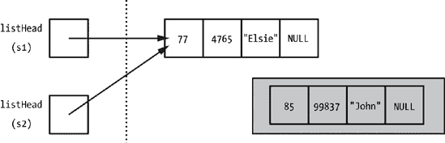

# 第五章：用类解决问题


在本章中，我们将讨论类和面向对象编程。和之前一样，假设你已经看到了 C++ 中的 `class` 声明并理解了创建类、调用类的方法等基本语法。我们将在下一节进行快速回顾，但我们将主要讨论类的问题解决方面。

这又是一个我认为 C++ 比其他语言有优势的情况。因为 C++ 是一种混合语言，C++ 程序员可以在适当的时候创建类，但不必这样做。相比之下，在 Java 或 C# 这样的语言中，所有代码都必须出现在类声明的范围内。在专家程序员的手中，这不会造成不必要的伤害，但在新手程序员的手中，可能会导致不良习惯。对于 Java 或 C# 程序员来说，一切都是对象。虽然这些语言编写的所有代码都必须封装到对象中，但结果并不总是反映合理的面向对象设计。一个对象应该是一个有意义的、紧密相关的数据集合和代码集合，该代码操作这些数据。它不应该是任意的一堆剩余物。

因为我们在使用 C++ 编程，因此可以选择过程式编程和面向对象编程，所以我们将讨论良好的类设计，以及何时应该以及不应该使用类。识别一个类将是有用的场景对于达到更高层次的编程风格至关重要，但同样重要的是识别那些将使事情变得更糟的场景。

# 类基础回顾

如同往常，这本书假设你已经接触过基础知识以及 C++ 语法的相关参考，但让我们回顾一下类语法的 fundamentals，以便我们在术语上保持一致。一个 *类* 是构建特定代码和数据包的蓝图；根据类的蓝图创建的每个变量都被称为该类的 *对象*。在类外部创建并使用该类对象的代码被称为该类的 *客户端*。一个 *类声明* 命名了类并列举了该类中的所有 *成员*，或内部的项目。每个项目要么是一个 *数据成员*——在类内部声明的变量——要么是一个 *方法*（也称为 *成员函数*），它是在类内部声明的函数。成员函数可以包括一个特殊类型，称为 *构造函数*，它与类的名称相同，并在声明类对象时隐式调用。除了变量或函数声明的正常属性（如类型，对于函数，参数列表）之外，每个成员还有一个 *访问修饰符*，它表示哪些函数可以访问该成员。一个 *公开成员* 可以被任何使用该对象的代码访问：类内部的代码、类的客户端或 *子类* 中的代码，子类是“继承”现有类所有代码和数据的类。一个 *私有成员* 只能被类内部的代码访问。*受保护成员*，我们将在本章中简要介绍，与私有成员类似，但子类中的方法也可以引用它们。然而，私有和受保护成员都无法从客户端代码中访问。

与返回类型等属性不同，类声明内部的访问修饰符一直保持，直到被不同的修饰符替换。因此，每个修饰符通常只出现一次，成员根据访问分组。这导致程序员将类的“公开部分”或“私有部分”称为，“我们应该把这个方法放在私有部分。”

让我们看看一个微小的示例类声明：

```
class sample {
 public:
      sample();
      sample(int num);
      int doesSomething(double param);
  private:
      int intData;
  };
```

这个声明首先命名了类 ![http://atomoreilly.com/source/no_starch/images/1273182.png]，因此之后 `sample` 就变成了一个类型名。声明以一个 `public` 访问修饰符 ![http://atomoreilly.com/source/no_starch/images/1273191.png] 开始，所以直到我们遇到 `private` 修饰符 ![http://atomoreilly.com/source/no_starch/images/1273199.png]，之后的所有内容都是公开的。许多程序员首先包含公开声明，期望公开接口对其他读者最有兴趣。这里的公开声明有两个构造函数 ![http://atomoreilly.com/source/no_starch/images/1273193.png] 和 ![http://atomoreilly.com/source/no_starch/images/1273195.png]，分别命名为 `sample` 和另一个方法，`doesSomething` ![http://atomoreilly.com/source/no_starch/images/1273197.png]。当声明这个类的对象时，构造函数会被隐式调用。

```
sample object1;
sample object2(15);
```

在这里，`object1`将调用第一个构造函数 ![http://atomoreilly.com/source/no_starch_images/1273193.png]，称为*默认构造函数*，它没有参数，而`object2`将调用第二个构造函数 ![http://atomoreilly.com/source/no_starch_images/1273195.png]，因为它指定了一个单个整数值，因此与第二个构造函数的参数签名相匹配。

声明以一个私有数据成员`intData`结束 ![http://atomoreilly.com/source/no_starch_images/1273199.png]。请记住，一个类声明以一个闭合花括号和一个分号结束 ![http://atomoreilly.com/source/no_starch_images/1273203.png]。这个分号可能看起来有点神秘，因为我们不使用分号来结束函数、`if`语句块或任何其他闭合花括号。实际上，分号的存在实际上表明类声明也可以选择性地作为对象声明；我们可以在闭合花括号和分号之间放置标识符，并像创建类一样创建对象。然而，在 C++中，这并不常见，尤其是考虑到许多程序员将它们的类定义放在使用它们的程序之外单独的文件中。这个神秘的分号也出现在`struct`的闭合花括号之后。

说到`struct`，你应该知道在 C++中，`struct`和`class`表示几乎相同的东西。这两个之间的唯一区别在于在第一个访问修饰符之前声明的成员（数据或方法）。在`struct`中，这些成员将是公共的，而在`class`中，它们将是私有的。然而，优秀的程序员使用这两种结构的方式不同。这类似于任何`for`循环都可以写成`while`循环，但优秀的程序员可以通过在更直接的计数循环中使用`for`循环来使代码更易于阅读。大多数程序员将`struct`保留用于更简单的结构，要么是除了构造函数之外没有数据成员的结构，要么是打算用作较大类的方法参数的结构。

# 类使用的目标

为了识别类使用的正确和错误情况以及构建类的正确和错误方式，我们首先必须决定我们使用类时的目标是什么。在考虑这一点时，我们应该记住，类始终是可选的。也就是说，类不会像数组或基于指针的结构那样给我们带来新的能力。如果你有一个使用数组对 10,000 条记录进行排序的程序，没有数组就无法编写相同的程序。如果你有一个程序依赖于链表随时间增长和缩小的能力，没有使用链表或类似的基于指针的结构，你就无法以相同的效率创建相同的效果。然而，如果你从一个面向对象的程序中移除类并重新编写它，程序的外观将不同，但程序的能力和效率不会降低。实际上，早期的 C++编译器作为预处理器工作。C++编译器会读取 C++源代码，并即时输出合法的 C 语法的新源代码。然后，修改后的源代码将被发送到 C 编译器。这告诉我们，C++对 C 语言的主要补充并不是关于语言的函数能力，而是关于源代码对程序员的可读性。

因此，在选择我们的通用类设计目标时，我们是在选择帮助程序员完成任务的目标。特别是，因为这本书是关于解决问题的，我们应该考虑类如何帮助我们解决问题。

## 封装

“封装”这个词是一种说法，意思是类将多个数据和代码组合成一个单一的包。如果你曾经见过装满小药丸的明胶药丸，那是一个很好的类比：病人服用一颗胶囊，吞下里面所有的单个成分药丸。

封装是允许我们列出的许多其他目标成功的机制，但它本身也是一个好处，因为它组织了我们的代码。在一个纯过程式代码的长程序列表中（在 C++中，这意味着有函数但没有类的代码），找到一种良好的函数和编译器指令顺序以使我们能够轻松记住它们的位置可能很困难。相反，我们被迫依赖我们的开发环境来为我们找到函数。封装将相关的东西放在一起。如果你正在编写一个类方法，并且意识到你需要查看或修改其他代码，那么其他代码很可能出现在同一类的另一个方法中，因此它们就在附近。

## 代码复用

从解决问题的角度来看，封装使我们能够更容易地重用之前问题的代码来解决当前问题。通常，即使我们处理过与当前项目类似的问题，重用之前学到的知识仍然需要大量工作。一个完全封装的类可以像外部 USB 驱动器一样工作；你只需插入它就能使用。然而，为了实现这一点，我们必须正确设计类，确保代码和数据真正封装，并且尽可能独立于类外部的任何事物。例如，引用全局变量的类不能在不复制全局变量的情况下复制到新项目中。

除了将一个程序中的类重用到下一个程序之外，类还提供了代码重用的更直接形式：继承。回想一下，在第四章中，我们讨论了使用辅助函数来“提取”两个或多个函数中共同代码的方法。继承将这个想法扩展到更大的规模。使用继承，我们创建具有两个或多个子类共同方法的父类，从而“提取”不仅是一行代码，而且是整个方法。继承是一个很大的主题，我们将在本章后面探讨这种代码重用形式。

## 分解问题

我们一次又一次回归的一种技术是将复杂问题分解成更小、更易于管理的部分。类在将程序分解成功能单元方面做得很好。封装不仅将数据和代码捆绑在一起形成一个可重用的包；它还隔离了这些数据和代码，使其与程序的其他部分隔离开来，从而允许我们单独对这个类以及所有其他部分进行工作。在一个程序中创建的类越多，问题分解的效果就越大。

因此，在可能的情况下，我们应该让类成为我们分解复杂问题的方法。如果类设计得很好，这将强制执行功能分离，问题将更容易解决。作为次要影响，我们可能会发现，为一个问题创建的类可以在其他问题中重用，即使在我们创建它们时没有完全考虑到这种可能性。

## 信息隐藏

有些人将术语*信息隐藏*和*封装*互换使用，但在这里我们将区分这两个概念。正如本章之前所述，封装是将数据和代码打包在一起。信息隐藏意味着将数据结构的接口——操作的定义及其参数——与数据结构的实现或函数内部的代码分离。如果一个类是以信息隐藏为目标编写的，那么可以更改方法的实现，而无需对客户端代码（使用该类的代码）进行任何更改。再次强调，我们必须清楚理解术语*接口*；这不仅仅是指方法的名称及其参数列表，还包括对不同方法功能的说明（可能以代码文档的形式表达）。当我们谈论在不改变接口的情况下更改实现时，我们的意思是改变类方法的工作方式，而不是它们的功能。一些编程作者将这种做法称为类与客户端之间的一种隐式合同：类同意永远不改变现有操作的效果，而客户端同意严格根据其接口使用类，并忽略任何实现细节。想象一下，有一个通用的遥控器可以控制任何电视，无论是老式的显像管模型还是使用液晶或等离子屏幕的电视。你按 2，然后按 5，然后按 Enter，任何屏幕都会显示频道 25，尽管实现这一功能的技术机制大相径庭。

没有封装就无法实现信息隐藏，但根据我们对这些术语的定义，可以在没有信息隐藏的情况下实现封装。这种情况最明显的方式是，如果一个类的数据成员被声明为`public`。在这种情况下，该类仍然是一个封装，因为它是一组属于一起的代码和数据。然而，客户端代码现在可以访问一个重要的类实现细节：类用来存储其数据的变量和类型。即使客户端代码没有直接修改类数据，只是检查它，客户端代码也需要特定的类实现。任何更改类名或类型，从而更改客户端代码访问的任何变量的实现，都需要对客户端代码进行更改。

你的第一个想法可能是，只要所有数据都被设置为私有，并且我们花费足够的时间设计成员函数及其参数列表，确保它们永远不会改变，信息隐藏就能得到保证。虽然所有这些对于信息隐藏都是必要的，但它们并不充分，因为信息隐藏的问题可能更加微妙。记住，类是同意在任何情况下都不改变任何方法的行为。在之前的章节中，我们不得不决定函数将处理的最小情况或者如何处理异常情况，比如当存储数组大小的参数为零时，如何计算数组的平均值。即使是对于异常情况，改变方法的结果也代表了对接口的改变，应该避免。这就是为什么在编程中明确考虑特殊情况如此重要的另一个原因。许多程序在底层技术或应用程序编程接口（API）更新时崩溃，一些曾经可靠地返回-1 作为错误代码的系统调用现在返回一个看似随机的、但仍然是负数的数字。避免这种问题的最好方法之一是在类或方法文档中声明特殊情况的结果。如果你的文档说明在某种情况下返回-1 错误代码，你将三思而后行，不会让方法返回其他任何内容。

那么信息隐藏是如何影响问题解决的？信息隐藏的原则告诉程序员在编写客户端代码时忽略类的实现细节，或者更广泛地说，只有在类内部工作时才关注特定类的实现。当你能够将实现细节置之脑后，你就可以消除干扰思绪，专注于解决手头的难题。

然而，我们应该意识到信息隐藏在问题解决方面的局限性。有时实现细节对客户端来说很重要。在之前的章节中，我们看到了基于数组和基于指针的数据结构的优缺点。基于数组的结构允许随机访问，但不能轻易地增长或缩小，而基于指针的结构只提供顺序访问，但可以在不重新创建整个结构的情况下添加或删除部分。因此，以基于数组的结构为基础构建的类将具有与基于指针的结构不同的特性。

在计算机科学中，我们经常讨论抽象数据类型的概念，这是信息隐藏的纯粹形式：仅通过其操作定义的数据类型。在第四章中，我们讨论了栈的概念，并描述了程序栈是一个连续的内存块。但作为一个抽象数据类型，栈是任何可以添加和删除单个项目的数据类型，并且项目以相反的顺序被移除。这被称为后进先出（LIFO）顺序。没有任何东西要求栈必须是连续的内存块，我们可以使用链表来制作栈。因为连续的内存块和链表具有不同的属性，所以使用一种实现或另一种实现的栈也将具有不同的属性，这可能会对使用栈的客户产生重大影响。

所有这些的要点是，信息隐藏对于作为问题解决者来说将是一个有用的目标，只要它允许我们将问题分解并分别处理程序的不同部分。然而，我们却不能完全忽略实现细节。

## 可读性

一个好的类可以增强其出现程序的可读性。对象可以对应于我们看待现实世界的方式，因此方法调用通常具有类似英语的可读性。此外，对象之间的关系通常比简单变量之间的关系更清晰。提高可读性可以增强我们解决问题的能力，因为我们可以在开发过程中更容易地理解自己的代码，而且当旧代码易于遵循时，重用也得到了增强。

为了最大限度地提高类的可读性效益，我们需要考虑我们的类方法在实际应用中的使用方式。方法名称应谨慎选择，以反映方法效果的最具体含义。例如，考虑一个表示金融投资的类，其中包含一个计算未来价值的方法。名称`compute`并不像`computeFutureValue`那样传达很多信息。甚至选择正确的词性对于名称也是有帮助的。名称`computeFutureValue`是一个动词，而`futureValue`是一个名词。看看以下代码示例中名称的使用方式：

```
double FV;
 investment.computeFutureValue(FV, 2050);

 if (investment.futureValue(2050) > 10000) { ...
```

如果你仔细想想，前者对于独立调用的调用更有意义，也就是说，一个将未来值通过引用参数发送回调用者的`void`函数！[](httpatomoreillycomsourcenostarchimages1273182.png)。后者对于在表达式中使用的调用更有意义，也就是说，未来值作为函数的值返回！[](httpatomoreillycomsourcenostarchimages1273191.png)。

我们将在本章后面看到具体的例子，但最大化可读性的指导原则是，在编写类的任何部分接口时，始终考虑客户端代码。

## 表达性

一个设计良好的课程的最终目标是表达性，或者说更广泛地称为可写性——代码编写 ease 的便利性。一个编写良好的类，一旦编写完成，就会使其余的代码编写变得更加简单，就像一个编写良好的函数可以使代码编写更加简单一样。类有效地扩展了语言，成为基本低级特性（如循环、`if` 语句等）的高级对应物。在 C++ 中，即使是输入输出这样的核心功能也不是语言语法的固有部分，而是作为一组必须显式包含在使用的程序中的类提供的。有了类，原本需要许多步骤才能完成的编程操作现在只需几步或一步即可完成。作为问题解决者，我们应该将这个目标作为一个特殊的优先事项。我们应该始终思考，“这个类将如何使这个程序以及可能使用这个类的未来程序更容易编写？”

# 构建简单类

现在我们知道了我们的类应该追求的目标，是时候将理论付诸实践并构建一些类了。首先，我们将分阶段开发我们的类，用于以下问题。

问题：班级名单

设计一个或一组类，用于在维护班级名单的程序中。对于每个学生，存储学生的姓名、ID 和最终成绩分数（范围 0–100）。程序将允许添加或删除学生记录；显示特定学生的记录，通过 ID 识别，成绩以数字和字母形式显示；并显示班级的平均分。特定分数的适当字母等级显示在 表 5-1 中。

表 5-1. 字母等级

| 分数范围 | 字母等级 |
| --- | --- |
| 93–100 | A |
| 90–92 | A– |
| 87–89 | B+ |
| 83–86 | B |
| 80–82 | B– |
| 77–79 | C+ |
| 73–76 | C |
| 70–72 | C– |
| 67–69 | D+ |
| 60–66 | D |
| 0–59 | F |

我们将首先查看一个基本的类框架，它是大多数类的基础。然后我们将查看扩展基本框架的方法。

## 基本类框架

探索基本类框架的最佳方式是通过一个示例类。为此示例，我们将从 第三章 中的学生 `struct` 开始，将其构建成一个完整的类。为了便于参考，以下是原始的 `struct`：

```
struct student {
    int grade;
    int studentID;
    string name;
};
```

即使是这种形式的简单`struct`，我们至少得到了封装。记住，在第三章中，我们使用这个`struct`构建了一个学生数据数组，如果没有使用`struct`，我们就必须构建三个并行数组，每个数组分别用于成绩、ID 和姓名——这太丑了！然而，我们通过这个`struct`肯定得不到的是信息隐藏。基本类框架通过将所有数据声明为私有，然后添加公共方法来允许客户端代码间接访问或更改这些数据，从而实现了信息隐藏。

```
class studentRecord {
 public:
    studentRecord();
      studentRecord(int newGrade, int newID, string newName);
    int grade();
    void setGrade(int newGrade);
      int studentID();
      void setStudentID(int newID);
      string name();
      void setName(string newName);
 private:
    int _grade;
      int _studentID;
      string _name;
  };
```

正如承诺的那样，这个类声明被分为一个公共部分，包含成员函数  和一个私有部分 ，其中包含与原始`struct`  相同的数据。这里有八个成员函数：两个构造函数  和每个数据成员的一对成员函数。例如，`_grade`数据成员有两个相关的成员函数，`grade`  和 `setGrade` 。这些方法中的第一个将由客户端代码用于检索特定`studentRecord`的成绩，而第二个方法用于为这个特定的`studentRecord`存储一个新的成绩。

与数据成员相关联的检索和存储方法如此常见，以至于通常用简写术语*获取*和*设置*来指代。正如你所见，我将单词*设置*纳入了将新值存储到数据成员的方法中。许多程序员也会将*获取*纳入其他名称中，例如，`getGrade`而不是`grade`。为什么我没有这样做呢？因为那样的话，我就将动词名称用于一个作为名词使用的函数。然而，有些人可能会争辩说，*获取*这个术语如此普遍为人所理解，其含义因此非常明确，其使用可以超越其他关注点。最终，这还是一个个人风格的问题。

尽管在这本书中我迅速指出了 C++相较于其他语言的优点，但我必须承认，在*获取*和*设置*方法方面，较新的语言，如 C#，已经超越了 C++。C#有一个内置机制，称为属性，它既充当*获取*也充当*设置*方法。一旦定义，客户端代码可以像访问数据成员一样访问属性，而不是函数调用。这对可读性和表达性是一个很大的提升。在 C++中，如果没有内置机制，我们决定一些方法命名约定并一致使用就很重要。

注意，我的命名约定也扩展到了数据成员，它们与原始的 `struct` 不同，所有都以下划线开头。这使我能够用与它们检索的数据成员（几乎）相同的名称来命名 *get* 函数。这也使得在代码中识别数据成员引用变得容易，从而增强了可读性。一些程序员使用关键字 `this` 来引用所有数据成员，而不是使用下划线前缀。因此，而不是这样的语句：

```
return _grade;
```

他们会有：

```
return this.grade;
```

如果你之前没有见过关键字 `this`，它是对它出现的对象的一个引用。所以如果上面的语句出现在一个类方法中，并且该方法还声明了一个名为 `grade` 的局部变量，那么表达式 `this.grade` 就会引用数据成员 `grade`，而不是具有相同名称的局部变量。在具有自动语法补全的开发环境中使用关键字这种方式有优势：程序员只需键入 **`this`**，然后按点键，从列表中选择数据成员，避免额外的输入和可能的拼写错误。但无论哪种技术，都会突出数据成员引用，这是重要的。

既然我们已经看到了类的声明，让我们看看方法的实现。我们将从第一个 *get/set* 对开始。

```
int studentRecord::grade() {
   return _grade;
}
void studentRecord::setGrade(int newGrade) {
   _grade = newGrade;
}
```

这是 *get/set* 对的最基本形式。第一个方法 `grade` 返回关联数据成员 `_grade` 的当前值 ![http://atomoreilly.com/source/nostarch/images/1273182.png]。第二个方法 `setGrade` 将参数 `newGrade` 的值赋给数据成员 `_grade` ![http://atomoreilly.com/source/nostarch/images/1273191.png]。然而，如果我们只做这些，我们的类就不会有任何成果。尽管这段代码提供了信息隐藏，因为它在两个方向上传递数据而不做任何考虑或修改，但它比将 `_grade` 声明为公共的更好，因为它为我们保留了更改数据成员名称或类型的权利。`setGrade` 方法至少应该执行一些基本的验证；它应该防止将没有意义的成绩值赋给 `_grade` 数据成员。但是，我们必须小心遵循问题规范，不要基于自己的经验对数据进行假设，而不考虑用户。例如，限制成绩在 0-100 范围内可能是合理的，但如果学校允许加分使分数超过 100 或使用 -1 作为退课的代码，则可能不合理。在这种情况下，因为我们从问题描述中获得了一些指导，我们可以将这方面的知识纳入验证中。

```
void studentRecord::setGrade(int newGrade) {
    if ((newGrade >= 0) && (newGrade <= 100))
        _grade = newGrade;
}
```

这里，验证只是一个守门人。然而，根据问题的定义，方法产生错误消息、写入错误日志或以其他方式处理错误可能是合理的。

其他*获取/设置*对将以完全相同的方式工作。无疑，关于特定学校学生 ID 号码构建的规则可以用于验证。然而，对于学生姓名，我们最好的做法是拒绝包含奇特的字符，如`%`或`@`，而如今甚至可能无法做到这一点。

完成我们类的最后一步是编写构造函数。在基本框架中，我们包括两个构造函数：一个没有参数的默认构造函数，它将数据成员设置为合理的默认值，以及一个为每个数据成员提供参数的构造函数。第二个构造函数形式对于我们的*表达性*目标很重要，因为它允许我们在一步中创建我们的类对象并初始化其内部值。一旦你编写了其他方法的代码，第二个构造函数几乎就会自己写出来。

```
studentRecord::studentRecord(int newGrade, int newID, string newName) {
    setGrade(newGrade);
    setStudentID(newID);
    setName(newName);
}
```

如您所见，构造函数只是为每个参数调用适当的*设置*方法。在大多数情况下，这是一种正确的方法，因为它避免了代码的重复，并确保构造函数将利用*设置*方法中的任何验证代码。

默认构造函数有时有点棘手，不是因为代码复杂，而是因为没有总是明显的默认值。在选择数据成员的默认值时，请记住使用默认构造函数创建的对象将用于哪些情况，特别是该类是否有合法的默认对象。这将告诉你是否应该用有用的默认值填充数据成员，或者用表示对象未正确初始化的值。例如，考虑一个表示值集合的类，它封装了一个链表。*确实*有一个有意义的默认链表，那就是空链表，所以我们会设置数据成员来创建一个合法但概念上为空的列表。但是，在我们的示例基本类中，没有有意义的默认学生的定义；我们不会想给默认的`studentRecord`对象分配一个有效的 ID 号码，因为这可能会与合法的`studentRecord`造成混淆。因此，我们应该为`_studentID`字段选择一个显然是非法的默认值，例如-1：

```
studentRecord::studentRecord() {
    setGrade(0);
    setStudentID(-1);
    setName("");
}
```

我们使用`setGrade`来分配成绩，它验证其参数。这意味着我们必须分配一个有效的成绩，在这种情况下，是 0。因为 ID 被设置为无效值，整个记录可以很容易地被识别为非法。因此，有效的成绩不应该有问题。如果这成为问题，我们可以直接将无效值分配给`_grade`数据成员。

这就完成了基本类框架。我们有一组私有数据成员，它们引用同一个逻辑对象的属性，在这种情况下，是一个学生的班级记录；我们有成员函数来检索或修改对象的数据，根据需要执行验证；我们还有一组有用的构造函数。我们有一个良好的类基础。问题是，我们是否需要做更多？

## 支持方法

*支持方法* 是一个类中的方法，它不仅仅是检索或存储数据。一些程序员可能将这些方法称为辅助方法、辅助方法或其他名称，但无论它们被称为什么，它们都是使类超越基本类框架的关键。一套精心设计的支持方法通常是一个类真正有用的关键。

为了确定可能的支持方法，考虑一下类将如何被使用。我们是否期望客户端代码在我们的类数据上执行一些常见操作？在这种情况下，我们被告知，我们最初为我们的类设计的程序将不仅显示学生的数值分数，还将显示字母等级。因此，让我们创建一个支持方法，该方法返回学生的等级作为字母。首先，我们将把方法声明添加到我们的类声明公共部分。

```
string letterGrade();
```

现在我们需要实现这个方法。这个函数将把存储在 `_grade` 中的数值转换为基于问题中显示的等级表的适当 `string`。我们可以通过一系列的 `if` 语句来完成这个任务，但是有没有更干净、更优雅的方法呢？如果你刚刚想到，“嘿，这听起来很像我们在第三章中如何将收入转换为营业执照类别的方法，”恭喜你——你已经发现了一个合适的编程类比。我们可以通过使用并行 `const` 数组来存储字母等级和与这些等级相关的最低数值分数，通过循环来转换数值分数。

```
string studentRecord::letterGrade() {
    const int NUMBER_CATEGORIES = 11;
    const string GRADE_LETTER[] = {"F", "D", "D+", "C-",
 "C", "C+", "B-", "B", "B+", "A-", "A"};
    const int LOWEST_GRADE_SCORE[] = {0, 60, 67, 70, 73, 77, 80, 83, 87, 90, 93};
    int category = 0;
    while (category < NUMBER_CATEGORIES && LOWEST_GRADE_SCORE[category] <= _grade)
        category++;
    return GRADE_LETTER[category - 1];
}
```

这个方法是对第三章中函数的直接改编，所以关于代码如何工作没有新的解释。然而，将其改编为类方法确实引入了一些设计决策。首先要注意的是，我们没有创建一个新的数据成员来存储字母等级，而是为每个请求即时计算适当的字母等级。另一种方法是将 `_letterGrade` 数据成员，并重写 `setGrade` 方法以在 `_grade` 旁边更新 `_letterGrade`。然后这个 `letterGrade` 方法将变成一个简单的 *get* 方法，返回已计算数据成员的值。

这种方法的缺点是 *数据冗余*，这是一个描述数据存储为其他数据的直接重复或可以直接从其他数据中确定的情况的术语。这个问题在数据库中最常见，数据库设计者遵循详细的过程来避免在他们的表中创建冗余数据。然而，如果我们不小心，任何程序都可能出现数据冗余。为了看到危险，考虑一个存储一组患者年龄和出生日期的医疗记录程序。出生日期为我们提供了年龄没有的信息。因此，这两个数据项不相等，但年龄并没有告诉我们任何我们可以从出生日期中得知的信息。如果这两个值不一致（除非年龄自动更新，否则最终会发生这种情况），我们信任哪个值？我想起了哈里发欧玛尔下令焚烧亚历山大图书馆时的著名（尽管可能是伪托的）宣言。他宣称，如果图书馆的书与《古兰经》一致，它们就是冗余的，不需要保存，但如果它们与《古兰经》不一致，它们就是有害的，应该被销毁。冗余数据是麻烦在等待发生。唯一的理由可能是性能，如果我们认为对 `_grade` 的更新很少，而对 `letterGrade` 的调用很频繁，但很难想象程序会有显著的性能提升。

然而，这种方法可以改进。在测试这个方法时，我注意到一个问题。尽管这个方法对 `_grade` 的有效值产生正确的结果，但当 `_grade` 是负值时，该方法会崩溃。当达到 `while` 循环时，`_grade` 的负值会导致循环测试立即失败；因此，`category` 保持为零，而 `return` 语句试图引用 `GRADE_LETTER[-1]`。我们可以通过将 `category` 初始化为 1 而不是 0 来避免这个问题，但这意味着负等级会被分配“F”等级，而实际上它根本不应该分配任何字符串，因为作为一个无效的等级值，它不适合任何类别。

相反，我们可以在将其转换为字母等级之前验证 `_grade`。我们已经在 `setGrade` 方法中验证了等级值，因此，我们不应该在 `letterGrade` 方法中添加新的验证代码，而应该“提取”这些方法中可能共有的代码，以创建第三个方法。（你可能会想知道，如果我们正在验证分配时的等级，我们怎么可能有一个无效的等级，但请记住，我们的默认构造函数将 -1 分配给信号尚未分配任何合法等级。）这是一种另一种支持方法，它是前几章中引入的一般辅助函数概念的类等效。让我们实现这个方法并修改我们的其他方法以使用它：

```
 bool studentRecord::isValidGrade(int grade) {
      if ((grade >= 0) && (grade <= 100))
          return true;
      else
          return false;
  }
  void studentRecord::setGrade(int newGrade) {
      if (isValidGrade(newGrade))
          _grade = newGrade;
  }
  string studentRecord::letterGrade() {
      if (!isValidGrade(_grade)) return "ERROR";
      const int NUMBER_CATEGORIES = 11;
      const string GRADE_LETTER[] = {"F", "D", "D+",
 "C-", "C", "C+", "B-", "B", "B+", "A-", "A"};
      const int LOWEST_GRADE_SCORE[] = {0, 60, 67, 70, 73, 77, 80, 83, 87, 90, 93};
      int category = 0;
      while (category < NUMBER_CATEGORIES && LOWEST_GRADE_SCORE[category] <= _grade)
          category++;
      return GRADE_LETTER[category - 1];
  }
```

新的评分验证方法的数据类型为`bool` ![http://atomoreilly.com/source/nostarch/images/1273182.png]，由于这是一个是或否的问题，我选择了名称`isValidGrade` ![http://atomoreilly.com/source/nostarch/images/1273191.png]。这给调用此方法的英语阅读带来了最自然的体验，例如在`setGrade` ![http://atomoreilly.com/source/nostarch/images/1273195.png]和`letterGrade` ![http://atomoreilly.com/source/nostarch/images/1273197.png]方法中。此外，请注意，该方法将验证的评分作为参数 ![http://atomoreilly.com/source/nostarch/images/1273193.png]。虽然`letterGrade`正在验证已经存在于`_grade`数据成员中的值，但`setGrade`正在验证我们可能或可能不会分配给数据成员的值。因此，`isValidGrade`需要将评分作为参数，以便对其他两个方法都有效用。

尽管已经实现了`isValidGrade`方法，但关于它的一个决定仍然悬而未决：我们应该给它分配什么访问级别？也就是说，我们应该将它放在类的公共部分还是私有部分？与基本类框架的`get`和`set`方法总是放在公共部分不同，支持方法可能是公共的或私有的，这取决于它们的使用情况。将`isValidGrade`设置为公共访问级别会有什么影响？最明显的是，客户端代码可以访问该方法。由于拥有更多公共方法似乎使类更有用，许多新手程序员将所有可能被客户端使用的每个方法都设置为公共。然而，这忽略了公共访问指定带来的另一个影响。记住，公共部分定义了我们类的接口，一旦我们的类集成到一个或多个程序中，我们就应该不愿意更改方法，因为这种更改很可能会导致级联并需要更改所有客户端代码。因此，将方法放在公共部分，因此锁定方法的接口及其影响。在这种情况下，假设某些客户端代码基于`isValidGrade`的原始公式，依赖于它作为一个 0-100 范围的检查器，但后来，可接受的评分规则变得更加复杂。客户端代码可能会失败。为了避免这种情况，我们可能不得不在类内部创建第二个评分验证方法，并保留第一个方法不变。

假设我们预计`isValidGrade`对客户端的用途有限，并决定不将其公开。我们可以将方法设为私有，但这并非唯一的选择。因为该函数没有直接引用任何类的数据成员或任何其他方法，我们可以在类外声明该函数。然而，这样做不仅会带来与公开访问相同的可修改性问题，而且还会降低封装性，因为现在这个类所需的函数不再是其一部分。我们也可以将方法留在类中，但将其改为*受保护的*而不是私有的。这种差异将在任何子类中体现出来。如果`isValidGrade`是受保护的，则子类的方法可以调用该方法；如果`isValidGrade`是私有的，则只能由`studentRecord`类中的其他方法使用。这在较小规模上与公开和私有相同。我们是否期望子类的方法会大量使用我们的方法，以及我们是否期望该方法的效果或其接口在未来可能会改变？在许多情况下，最安全的方法是将所有辅助方法设为私有，只公开那些旨在为客户端提供帮助的支持方法。

# 具有动态数据的类

创建类的一个最好的理由是封装动态数据结构。正如我们在第四章中讨论的那样，程序员面临着跟踪动态分配、指针赋值和释放的真正困难，以避免内存泄漏、悬垂引用和非法内存引用。将所有指针引用放入类中并不能消除这项困难的工作，但它确实意味着一旦我们做对了，我们就可以安全地将代码放入其他项目中。这也意味着我们动态数据结构的问题将被隔离在类内部的代码中，简化了调试。

让我们构建一个具有动态数据的类，看看它是如何工作的。对于我们的示例问题，我们将使用第四章中的主要问题的修改版。

问题：跟踪未知数量的学生记录

在这个问题中，你需要编写一个类，其中包含存储和操作学生记录集合的方法。学生记录包含学生编号和成绩，都是整数，以及一个表示学生姓名的字符串。以下函数需要实现：

**`addRecord`**

此方法接受学生编号、姓名和成绩，并将包含这些数据的新的记录添加到集合中。

**`recordWithNumber`**

此函数接受学生编号，并从集合中检索具有该学生编号的记录。

**`removeRecord`**

此函数接受学生编号，并从集合中删除具有该学生编号的记录。

集合可以有任何大小。预期`addRecord`操作会被频繁调用，因此它必须高效实现。

与原始版本相比，这个描述的主要区别是我们增加了一个新的操作`recordWithNumber`，并且没有任何操作引用指针参数。这是使用类封装链表的关键好处。客户端可能知道该类将学生记录集合实现为链表，甚至可能依赖这一点（记住我们之前关于信息隐藏局限性的讨论）。然而，客户端代码将不会与链表或类中的任何指针进行直接交互。

因为这个问题与上一个问题存储相同的学生信息，所以我们在这里有机会进行班级重用。在我们的链表节点类型中，我们不会为每三个学生数据分别设置单独的字段，而是将有一个`studentRecord`对象。在一个类的对象作为另一个类的数据类型时，这被称为*组合*。

现在我们已经有了足够的信息来做出初步的类声明：

```
class studentCollection {
  private:
    struct studentNode {
        studentRecord studentData;
          studentNode * next;
      };
 public:
      studentCollection();
      void addRecord(studentRecord newStudent);
      studentRecord recordWithNumber(int idNum);
      void removeRecord(int idNum);
  private:
    typedef studentNode * studentList;
    studentList _listHead;
  };
```

之前我说程序员倾向于从公共声明开始创建类，但在这里我们必须做出例外。我们以一个私有的节点`struct`声明`studentNode`开始，如图所示 ![httpatomoreillycomsourcenostarchimages1273182.png]，我们将用它来创建我们的链表。这个声明必须放在公共部分之前，因为我们的几个公共成员函数引用了这个类型。与第四章中的节点类型不同，这个节点没有为有效载荷数据设置单独的字段，而是包含了一个`studentRecord struct`类型的成员 ![httpatomoreillycomsourcenostarchimages1273191.png]。公共成员函数 ![httpatomoreillycomsourcenostarchimages1273193.png] 直接来自问题描述；此外，我们始终有一个构造函数。在第二个私有部分，我们声明了一个`typedef` ![httpatomoreillycomsourcenostarchimages1273195.png]，用于我们的节点类型的指针，就像我们在第四章中所做的那样。然后我们声明了我们的列表头指针，巧妙地称为`_listHead` ![httpatomoreillycomsourcenostarchimages1273197.png]。

此类声明了两种私有类型。类不仅可以声明成员函数和数据成员，还可以声明类型。与其他成员一样，类中出现的类型可以使用任何访问修饰符进行声明。然而，与数据成员一样，你应该将类型定义视为默认私有，除非你有明确的理由使其更宽松。类型声明通常是类在幕后操作的核心，因此它们对于信息隐藏至关重要。此外，在大多数情况下，客户端代码对你在类中声明的类型没有用处。一个例外是，当类中定义的类型用作公共方法的返回类型或公共方法参数的类型时。在这种情况下，该类型必须是公共的，否则公共方法无法被客户端代码使用。`studentCollection`类假设`struct`类型`studentRecord`将单独声明，但我们可以将其作为类的一部分。如果我们这样做，我们必须在`public`部分声明它。

现在我们准备实现我们的类方法，从构造函数开始。与之前的例子不同，这里我们只有默认构造函数，没有接受参数以初始化数据成员的构造函数。我们类的整个目的就是隐藏我们的链表细节，因此我们不希望客户端甚至去考虑我们的`_listHead`，更不用说操作它了。在我们的默认构造函数中，我们只需要将头指针设置为`NULL`：

```
studentCollection::studentCollection() {
    _listHead = NULL;
}
```

## 添加节点

我们继续到`addRecord`。由于问题描述中没有要求我们以任何特定的顺序保存学生记录，因此我们可以直接将第四章中的`addRecord`函数修改后用于此处。

```
void studentCollection::addRecord(studentRecord newStudent) {
    studentNode * newNode = new studentNode;
    newNode->studentData = newStudent;
    newNode->next = _listHead;
    _listHead = newNode;
}
```

与我们的蓝图函数相比，这段代码只有两个不同之处。在这里，我们只需要在我们的参数列表中有一个参数 ![http://atomoreilly.com/source/nostarch/images/1273182.png]，这是我们打算添加到我们的集合中的`studentRecord`对象。这封装了一个学生的所有数据，从而减少了所需的参数数量。我们也不需要传递一个列表头指针，因为那已经存储在我们的类中作为`_listHead`，并在需要时直接引用。就像第四章中的`addRecord`函数一样，我们创建一个新的节点 ![http://atomoreilly.com/source/nostarch/images/1273191.png]，将新的学生数据复制到新的节点 ![http://atomoreilly.com/source/nostarch/images/1273193.png]，将新节点的下一个字段指向列表中的前一个第一个节点 ![http://atomoreilly.com/source/nostarch/images/1273195.png]，最后将`_listHead`指向新节点 ![http://atomoreilly.com/source/nostarch/images/1273197.png]。通常我建议为所有的指针操作绘制一个图表，但由于这是我们已经做过的相同操作，我们可以参考之前绘制的图表。

现在，我们可以将注意力转向这三个成员函数中的最后一个，`recordWithNumber`。这个名字有点长，一些程序员可能会选择`retrieveRecord`或类似的名称。然而，根据我之前提出的命名规则，我决定使用名词，因为这个方法会返回一个值。这个方法将与`averageRecord`类似，因为它需要遍历列表；在这个情况下，不同之处在于一旦找到匹配的学生记录，我们就可以停止遍历。

```
studentRecord studentCollection::recordWithNumber(int idNum) {
  studentNode * loopPtr = _listHead;
  while (loopPtr->studentData.studentID() != idNum) {
        loopPtr = loopPtr->next;
    }
  return loopPtr->studentData;
}
```

在这个函数中，我们将循环指针初始化为列表的头部 ![http://atomoreilly.com/source/nostarch/images/1273182.png] 并遍历列表，直到我们没有看到期望的 ID 号码 ![http://atomoreilly.com/source/nostarch/images/1273191.png]。最后，到达期望的节点，我们将整个匹配的记录作为函数的值返回 ![http://atomoreilly.com/source/nostarch/images/1273193.png]。这段代码看起来不错，但像往常一样，我们必须考虑潜在的特殊情况。当我们处理链表时，我们总是考虑的一个情况是初始的`NULL`头指针。在这里，这确实会引发问题，因为我们没有检查这一点，当我们在循环第一次进入时尝试解引用`loopPtr`时，代码将会崩溃。更普遍地说，我们还要考虑客户端代码提供的 ID 号码实际上并不匹配我们集合中的任何记录的可能性。在这种情况下，即使`_listHead`不是`NULL`，当到达列表的末尾时，`loopPtr`最终也会变成`NULL`。

所以一般问题是，我们需要在 `loopPtr` 变为 `NULL` 时停止循环。这不难，但接下来，在这种情况下我们应该返回什么？我们当然不能返回 `loopPtr->studentData`，因为 `loopPtr` 将会是 `NULL`。相反，我们可以构建并返回一个带有明显无效值的虚拟 `studentRecord`。

```
studentRecord studentCollection::recordWithNumber(int idNum) {
    studentNode * loopPtr = _listHead;
    while (loopPtr != NULL && loopPtr->studentData.studentID() != idNum) {
        loopPtr = loopPtr->next;
    }
    if (loopPtr == NULL) {
      studentRecord dummyRecord(−1, −1, "");
        return dummyRecord;
    } else {
        return loopPtr->studentData;
    }
}
```

在这个方法版本中，如果循环结束时循环指针是 `NULL` ![http://atomoreilly.com/source/nostarch/images/1273191.png]，我们将创建一个带有空字符串名称和成绩以及学生 ID 为 −1 的虚拟记录，并返回它。回到循环中，我们正在检查那个 `NULL loopPtr` 条件，这又可能是因为没有列表可以遍历，或者因为我们遍历了但没有成功。这里的一个关键点是循环的条件表达式 ![http://atomoreilly.com/source/nostarch/images/1273182.png] 是一个复合表达式，其中 `loopPtr != NULL` 是第一个。这是绝对必要的。C++ 使用一种称为 *短路求值* 的机制来评估复合布尔表达式；简单地说，当表达式的整体值已知时，它不会评估复合布尔表达式的右侧。因为 `&&` 代表逻辑布尔 *和*，如果 `&&` 表达式的左侧评估为假，则整体表达式也必须是假的，无论右侧的评估结果如何。为了提高效率，C++ 利用这个事实，当左侧为假时，跳过 `&&` 表达式右侧的评估（对于 `||`，逻辑 *或*，当左侧为真时，右侧不评估，原因相同）。因此，当 `loopPtr` 为 `NULL` 时，表达式 `loopPtr != NULL` 评估为假，`&&` 的右侧永远不会被评估。如果没有短路求值，右侧 *将会* 被评估，我们将会取消对 `NULL` 指针的引用，导致程序崩溃。

这种实现避免了第一个版本可能发生的崩溃，但我们需要意识到它对客户端代码有很大的信任。也就是说，调用这个方法的函数负责检查返回的 `studentRecord`，并确保在进一步处理之前它不是虚拟记录。如果你像我一样，这会让你感到有些不安。

异常

另外还有一个选择。C++ 以及许多其他编程语言都提供了一种称为 *异常* 的机制，它允许一个函数，无论是方法还是一般函数，能够明确地向调用者信号错误状态。它是为处理我们在这个方法中遇到的情况而设计的，当输入数据不正确时，没有好的返回值。异常语法超出了这里可以讨论的范围，而且不幸的是，C++ 中实现异常的方式并没有解决前一段中提到的信任问题。

## 重新排列列表

`removeRecord` 方法与 `recordWithNumber` 方法类似，我们必须遍历列表以找到要从列表中删除的节点，但这其中还有很多细节。从列表中删除节点需要小心地保持列表中剩余节点的链接。最简单的方法是将被删除节点之前的节点链接到被删除节点之后的节点。我们不需要函数轮廓，因为我们已经在类声明中有一个函数原型，所以我们只需要一个测试用例：

```
studentCollection s;
  studentRecord stu3(84, 1152, "Sue");
  studentRecord stu2(75, 4875, "Ed");
  studentRecord stu1(98, 2938, "Todd");
  s.addRecord(stu3);
  s.addRecord(stu2);
  s.addRecord(stu1);
 s.removeRecord(4875);
```

在这里，我们创建了一个 `studentCollection` 对象 `s`，以及三个 `studentRecord` 对象，每个对象都添加到我们的集合中。请注意，我们可以在 `addRecord` 调用之间重用相同的记录，改变值，但这样做简化了我们的测试代码。测试的最后一行是调用 `removeRecord` ，在这种情况下，它将删除第二个记录，即名为“Ed”的学生记录。使用与 第四章 中相同的指针图风格，图 5-1 显示了调用之前的内存状态和调用之后的内存状态。

在 图 5-1 (a) 中，我们看到由我们的测试代码创建的链表。请注意，因为我们使用了一个类，所以我们的图例约定有点倾斜。在我们的栈/堆划分的左侧，我们有 `_listHead`，这是 `studentCollection` 对象 `s` 内部的私有数据成员，以及 `idNum`，这是 `removeRecord` 的参数。在右侧是列表本身，位于堆中。记住，`addRecord` 将新记录放在列表的开头，所以记录的顺序与测试代码中添加的顺序相反。中间的节点 `"Ed"` 拥有与参数匹配的 ID 号码 `4875`，因此它将从列表中删除。图 5-1 (b) 显示了调用结果。列表中的第一个节点 `"Todd"` 现在指向原来列表中的第三个节点 `"Sue"`。`"Ed"` 节点不再链接到更大的列表中，并且已被删除。


图 5-1. `removeRecord` 测试用例的“之前”和“之后”状态

现在我们知道了代码应该产生什么效果，我们可以开始编写它。由于我们知道我们需要找到具有匹配 ID 号的节点，我们可以从`recordWithNumber`中的`while`循环开始。当这个循环完成后，我们就会得到指向所需删除的节点的指针。不幸的是，我们需要的不仅仅是这个来完成删除。看看图 5-1；为了关闭空隙并保持链表的完整性，我们需要更改`"Todd"`节点的`next`字段。如果我们只有`"Ed"`节点的指针，就没有办法引用`"Todd"`节点，因为链表中的每个节点都引用其后续节点，而不是其前驱节点。（由于这种情况，一些链表在两个方向上都有链接；这些被称为*双向链表*，但它们很少需要。）因此，除了指向要删除的节点（如果我们从上一个函数中调整代码，它将被称为`loopPtr`）的指针之外，我们还需要一个指向立即前一个节点的指针：让我们称这个指针为`trailing`。图 5-2 展示了这一概念在我们示例中的应用。


图 5-2. 删除指定`idNum`的节点所需的指针

使用`loopPtr`引用我们要删除的节点，而`trailing`引用前一个节点，我们可以删除所需的节点并保持列表的完整性。

```
void studentCollection::removeRecord(int idNum) {
    studentNode * loopPtr = _listHead;
  studentNode * trailing = NULL;
    while (loopPtr != NULL && loopPtr->studentData.studentID() != idNum) {
       trailing = loopPtr;
        loopPtr = loopPtr->next;
    }
  if (loopPtr == NULL) return;
  trailing->next = loopPtr->next;
  delete loopPtr;
}
```

这个函数的前一部分类似于`recordWithNumber`，除了我们声明了我们的`trailing`指针  ，并且在循环内部，我们在将`loopPtr`推进到下一个节点之前，将`loopPtr`的旧值赋给`trailing`  。这样，`trailing`总是比`loopPtr`落后一个节点。由于我们处理了上一个函数，我们已经对一种特殊情况有所防范。因此，当循环结束时，我们检查`loopPtr`是否为`NULL`。如果是这样，这意味着我们从未找到具有所需 ID 号的节点，我们立即`return`  。我把函数中间出现的`return`语句称为“逃离困境”。一些程序员反对这样做，因为具有多个退出点的函数可能更难阅读。但在这个情况下，另一种选择是`if`语句的另一个嵌套级别，我宁愿只是逃离困境。

确定要删除的节点后，就是删除它的时候了。从我们的图中可以看出，我们需要将 `trailing` 节点的 `next` 字段设置为指向 `loopPtr` 节点的 `next` 字段当前指向的节点 。然后我们可以安全地 `delete` 由 `loopPtr` 指向的节点 。

这在我们的测试用例中是有效的，但就像往常一样，我们需要检查潜在的特殊情况。我们已经处理了 `idNum` 不出现在我们集合中的任何记录中的可能性，但还有其他可能的问题吗？查看我们的测试用例，如果我们尝试删除第一个或第三个节点而不是中间节点，会发生什么变化？测试和手动检查显示第三个（最后一个）节点没有问题。然而，第一个节点却会导致问题，因为在这种情况下，没有前一个节点供 `trailing` 指向。相反，我们必须操作 `_listHead` 本身。 图 5-3 显示了 `while` 循环结束后的情况。


图 5-3. 删除列表中第一个节点之前的情况

在这种情况下，我们需要将 `_listHead` 重置为列表中的前第二个节点，即 `"Ed"` 的节点。让我们重写我们的方法来处理特殊情况。

```
void studentCollection::removeRecord(int idNum) {
    studentNode * loopPtr = _listHead;
    studentNode * trailing = NULL;
    while (loopPtr != NULL && loopPtr->studentData.studentID() != idNum) {
        trailing = loopPtr;
        loopPtr = loopPtr->next;
    }
    if (loopPtr == NULL) return;
  if (trailing == NULL) {
      _listHead = _listHead->next;
    } else {
        trailing->next = loopPtr->next;
    }
    delete loopPtr;
}
```

如您所见，条件测试  和处理特殊情况的代码  都很简单，因为我们编写代码之前已经仔细分析了情况。

## 析构函数

问题中指定的三种方法实现后，我们可能会认为我们的 `studentCollection` 类已经完整。然而，现状是它存在严重的问题。第一个问题是类缺少一个 *析构函数*。这是一个在对象超出作用域时（当声明对象的函数完成时）被调用的特殊方法。当一个类没有动态数据时，通常不需要析构函数，但如果你有前者，你肯定需要后者。记住，我们必须用 `delete` 删除所有用 `new` 分配的内存，以避免内存泄漏。如果我们的 `studentCollection` 类有三个节点，那么每个节点都需要被释放。幸运的是，这并不太难。我们只需要遍历我们的链表，边走边删除。不过，我们不是直接这样做，而是写一个辅助方法来删除 `studentList` 中的所有节点。在我们的类的私有部分，我们添加了以下声明：

```
void deleteList(studentList &listPtr);
```

该方法本身的代码如下：

```
void studentCollection::deleteList(studentList &listPtr) {
    while (listPtr != NULL) {
        studentNode * temp = listPtr;
        listPtr = listPtr->next;
        delete temp;
    }
}
```

遍历操作将当前节点的指针复制到一个临时变量 ，然后前进当前节点指针 ，最后删除临时变量指向的节点 。有了这段代码，我们可以非常简单地编写析构函数。首先，我们将析构函数添加到我们的类声明的公共部分：

```
˜studentCollection();
```

注意，就像构造函数一样，析构函数也是通过类名来指定的，并且没有返回类型。名称前的波浪线将析构函数与构造函数区分开来。实现方式如下：

```
studentCollection::˜studentCollection() {
    deleteList(_listHead);
}
```

这些方法中的代码很简单，但测试析构函数很重要。虽然编写不良的析构函数可能会导致程序崩溃，但许多析构函数问题不会导致崩溃，只会造成内存泄漏，或者更糟糕的是，不可解释的程序行为。因此，使用你的开发环境的调试器测试析构函数很重要，这样你可以看到析构函数实际上正在对每个节点调用 `delete`。

## 深拷贝

另一个严重的问题仍然存在。回到第四章，我们简要讨论了交叉链接的概念，其中两个指针变量具有相同的值。尽管变量本身是不同的，但它们指向相同的数据结构；因此，修改一个变量的结构会同时修改它们。这个问题很容易出现在包含动态分配内存的类中。为了了解为什么这会成为一个问题，考虑以下基本的 C++代码序列：

```
int x = 10;
  int y = 15;
  x = y;
 x = 5;
```

假设我问你最后一条语句  对变量 `y` 的值有什么影响。你可能想知道我是否说错了。最后一条语句根本不会对 `y` 产生任何影响，只会影响 `x`。但现在考虑这一点：

```
studentCollection s1;
  studentCollection s2;
  studentRecord r1(85, 99837, "John");
  s2.addRecord(r1);
  studentRecord r2(77, 4765, "Elsie");
  s2.addRecord(r2);
 s1 = s2;
 s2.removeRecord(99837);
```

假设我问你最后一条语句  对 `s1` 产生了什么影响。不幸的是，它确实产生了影响。尽管 `s1` 和 `s2` 是两个不同的对象，但它们不再是完全独立的对象。默认情况下，当一个对象被赋值给另一个对象时，就像我们这里将 `s2` 赋值给 `s1`  一样，C++ 执行的是所谓的 *浅拷贝*。在浅拷贝中，一个对象的所有数据成员直接赋值给另一个对象。所以如果 `_listHead`，我们的唯一数据成员是公开的，`s1 = s2` 就等同于 `s1._listHead = s2._listHead`。这使得两个对象的数据成员 `_listHead` 都指向内存中的同一位置：指向 `"Elsie"` 的节点，该节点指向另一个节点，即 `"John"` 的节点。因此，当删除 `"John"` 的节点时，它似乎从两个列表中都被删除了，因为实际上只有一个列表。 显示了代码结束时的状态。



图 5-4. 浅拷贝导致交叉链接；从列表中删除 `"John"` 节点会同时从两个列表中删除。

尽管这听起来很奇怪，但实际上可能会更糟。如果代码的最后一条语句删除了第一条记录，即 `"Elsie"` 节点呢？在这种情况下，`s2` 内部的 `_listHead` 会更新为指向 `"John"`，而 `"Elsie"` 节点会被删除。然而，`s1` 内部的 `_listHead` 仍然会指向被删除的 `"Elsie"` 节点，这是一个危险的悬挂引用，如图  所示。


图 5-5. 从 `s2` 中删除导致 `s1` 中出现悬挂引用

解决这个问题的方法是 *深拷贝*，这意味着我们不仅复制结构体的指针，而是复制结构体中的所有内容。在这种情况下，这意味着复制列表中的所有节点以创建一个真正的列表副本。和之前一样，让我们先创建一个私有辅助方法，在这种情况下，是一个复制 `studentList` 的方法。类私有部分的声明如下：

```
studentList copiedList(const studentList original);
```

和之前一样，我选择了一个名词作为返回值的函数名。该方法的实现如下：

```
 studentCollection::studentList
 studentCollection::copiedList(const studentList original) {
    if (original == NULL) {
          return NULL;
      }
      studentList newList = new studentNode;
    newList->studentData = original->studentData;
    studentNode * oldLoopPtr = original->next;
    studentNode * newLoopPtr = newList;
      while (oldLoopPtr != NULL) {
        newLoopPtr->next = new studentNode;
          newLoopPtr = newLoopPtr->next;
          newLoopPtr->studentData = oldLoopPtr->studentData;
          oldLoopPtr = oldLoopPtr->next;
      }
    newLoopPtr->next = NULL;
    return newList;
  }
```

这个方法中有很多操作，所以让我们一步一步来分析。在语法方面，当在实现中指定返回类型时，我们必须在类名前加上前缀 。否则，编译器将不知道我们在谈论什么类型。（在方法内部，这并不是必需的，因为编译器已经知道这个方法属于哪个类——有点令人困惑！）我们检查输入列表是否为空。如果是，我们就退出循环 。一旦我们知道有一个要复制的列表，我们就在循环之前  复制第一个节点的数据，因为对于那个节点，我们必须修改我们新列表的头指针。

然后，我们设置了两个指针来跟踪两个列表。`old-LoopPtr`  遍历输入列表；它始终指向我们即将复制的节点。`newLoopPtr`  遍历新的、复制的列表，并且始终指向我们刚刚创建的最后一个节点，即我们添加下一个节点之前的位置。就像在`removeRecord`方法中一样，我们在这里也需要一个尾指针。在循环  内部，我们创建一个新的节点，将`newLoopPtr`向前移动以指向它，从旧节点复制数据到新节点，并移动`oldLoopPtr`。循环结束后，我们通过将`NULL`赋值给最后一个节点的`next`字段  来终止新列表，并返回新列表的指针 。

那么，这个辅助方法是如何解决我们之前看到的问题的呢？它本身并不能解决。但是，有了这段代码，我们现在可以重载赋值运算符。*运算符重载*是 C++的一个特性，允许我们改变内置运算符对某些类型的作用。在这种情况下，我们想要重载赋值运算符（`=`），这样它就不再是默认的浅拷贝，而是调用我们的`copiedList`方法来执行深拷贝。在我们的类公共部分，我们添加了以下内容：

```
 studentCollection& operator=(const studentCollection &
 rhs);
```

我们要重载的运算符是通过使用关键字 `operator` 后跟我们要重载的运算符来命名的 。我为参数选择的名称（`rhs` ）是重载运算符的一个常见选择，因为它代表 *右侧*。这有助于程序员保持清晰。因此，在引发这次讨论的赋值语句 `s2 = s1` 中，对象 `s1` 将是赋值操作的右侧，而 `s2` 将是左侧。我们通过参数引用右侧，通过直接访问类成员来引用左侧，就像我们使用类中的任何其他方法一样。因此，我们在这个案例中的任务是创建一个由 `_listHead` 指向的列表，它是 `rhs` 的 `_listHead` 指向的列表的副本。这将使 `s2 = s1` 调用中的 `s2` 成为 `s1` 的真正副本。

参数的类型始终是对所涉及类的常量引用 ；返回类型始终是对类的引用 。你很快就会明白为什么参数是一个引用。你可能想知道为什么这个方法返回任何东西，因为我们正在方法中直接操作数据成员。这是因为 C++ 允许链式赋值，如 `s3 = s2 = s1`，其中一次赋值的返回值成为下一次赋值的参数。

一旦理解了所有语法，赋值运算符的代码就相当直接：

```
studentCollection& studentCollection::operator=(const studentCollection &rhs) {
  if (this != &rhs) {
       deleteList(_listHead);
       _listHead = copiedList(rhs._listHead);
    }
  return *this;
}
```

为了避免内存泄漏，我们首先必须从左侧列表中移除所有节点 。(正是出于这个目的，我们将 `deleteList` 写作辅助方法，而不是直接将其代码包含在析构函数中。)删除了之前的左侧列表后，我们使用另一个辅助方法  复制右侧列表。然而，在执行这些步骤之前，我们需要检查右侧的对象是否与左侧的对象不同（即，它不是像 `s1 = s1` 这样的东西）通过检查指针是否不同 。如果指针相同，则不需要做任何事情，但这不仅仅是效率问题。如果我们对相同的指针执行深拷贝，当我们删除左侧列表中的节点时，我们也会删除右侧列表中的节点。最后，我们返回左侧对象的指针 ；这无论我们实际上是否复制了任何内容都会发生，因为尽管像 `s2 = s1 = s1` 这样的语句很混乱，但我们仍然希望如果有人尝试这样做，它仍然可以工作。

只要我们有了我们的列表复制辅助方法，我们也应该创建一个*复制构造函数*。这是一个接受另一个相同类的对象作为对象的构造函数。复制构造函数可以在我们需要创建现有`studentCollection`的副本时显式调用，但每当将此类对象作为值参数传递给函数时，也会隐式调用复制构造函数。正因为如此，除非接收对象的函数需要修改副本，否则你应该考虑将对象参数作为`const`引用而不是值参数传递。否则，你的代码可能会做很多不必要的操作。例如，考虑一个包含 10,000 条记录的学生集合。该集合可以作为一个引用、一个指针传递。或者，它可以调用复制构造函数进行长时间遍历和 10,000 次内存分配，然后这个局部副本在函数结束时调用析构函数，进行另一次长时间遍历和 10,000 次释放。这就是为什么赋值运算符重载的右侧参数使用`const`引用参数的原因。

要将复制构造函数添加到我们的类中，首先我们需要在公共部分将它的声明添加到类声明中。

```
studentCollection(const studentCollection &original);
```

与所有构造函数一样，没有返回类型，并且与重载的赋值运算符一样，参数是我们类的`const`引用。实现起来很简单，因为我们已经有了辅助方法。

```
studentCollection::studentCollection(const studentCollection &original) {
    _listHead = copiedList(original._listHead);
}
```

现在我们可以做出这样的声明：

```
studentCollection s2(s1);
```

这个声明的作用是声明`s2`并将`s1`中的节点复制到它里面。

## 动态内存类的大图景

自从完成问题描述中指定的方法以来，我们对这个类做了很多工作，所以让我们花点时间来回顾一下。现在我们的类声明看起来是这样的。

```
class studentCollection {
private:
    struct studentNode {
        studentRecord studentData;
        studentNode * next;
    };
public:
    studentCollection();
    ˜studentCollection();
    studentCollection(const studentCollection &original);
    studentCollection& operator=(const studentCollection &rhs);
    void addRecord(studentRecord newStudent);
    studentRecord recordWithNumber(int idNum);
    void removeRecord(int idNum);
private:
    typedef studentNode * studentList;
    studentList _listHead;
    void deleteList(studentList &listPtr);
    studentList copiedList(const studentList original);
};
```

这里的教训是，在创建具有动态内存的类时，需要添加新的部分。除了我们基本类框架的功能——私有数据、默认构造函数以及将数据发送到对象内部和从对象中取出的方法之外，我们还需要添加处理动态内存分配和清理的额外方法。至少，我们应该添加一个复制构造函数和一个析构函数，如果有可能有人使用它，还要重载赋值运算符。创建这些额外方法通常可以通过创建复制或删除底层动态数据结构的辅助方法来简化。

这可能看起来像很多工作，确实如此，但重要的是要注意，你添加到类中的每一件事都是你需要处理的。换句话说，如果我们没有为我们的学生记录链表集合创建一个类，我们仍然需要在处理完它们时负责删除列表中的节点。我们仍然需要警惕交叉链接，如果我们想要原始列表的真正副本，我们仍然需要遍历列表并逐个复制节点，等等。将一切放入类结构只是前期多了一点工作，一旦一切正常工作，客户端代码就可以忽略所有的内存分配细节。最终，封装和信息隐藏使得动态数据结构更容易处理。

# 需要避免的错误

我们已经讨论了如何创建一个优秀的 C++类，那么让我们通过讨论一些你应该避免的常见陷阱来结束这次讨论。

## 假设类

正如我在本章开头提到的，我认为 C++作为一种包含过程式和面向对象范式的混合语言，是一个学习面向对象编程的绝佳语言，因为创建一个类总是程序员的一个积极选择。在像 Java 这样的语言中，问题从来不是“我应该创建一个类吗？”而是“我将如何将这个放入类中？”将一切放入类结构的要求导致了我所说的“假类”，这是一个在语法上正确但没有任何实际意义的没有连贯设计的类。在编程中使用的“类”一词来源于英语单词的意义，即具有共同属性的一组事物，一个好的 C++类符合这个定义。

假设类可能由几个原因产生。一种类型是因为程序员真的想使用全局变量，并不是出于任何可以辩护的理由（尽管这样的理由很少，但确实存在），而是出于懒惰——只是为了避免在函数之间传递参数。虽然程序员知道广泛使用全局变量被认为是一种糟糕的风格，但他或她认为找到了一个漏洞。程序的所有或大多数功能都被塞进了一个类中，原本应该是全局的变量现在变成了类的数据成员。程序的主函数简单地创建了一个假类的对象，并在类中调用了一些“主”方法。技术上，程序没有使用任何全局变量，但假类意味着程序具有与使用全局变量的程序相同的缺陷。

另一种类型的虚假类是由于程序员仅仅假设面向对象编程总是“更好”，并将其强加在不适用的情况下。在这些情况下，程序员通常会创建一个封装了非常特定功能的类，这种功能仅在编写该类的原始程序上下文中才有意义。有两种方法可以测试你是否在编写这种类型的虚假类。第一种是问自己，“我能给这个类起一个具体且相对简短的名字吗？”如果你发现自己有一个像*工资报表管理器和打印队列*这样的名字，你可能有问题。另一种测试是问，“如果我要写另一个具有类似功能的项目，我能想象这个类如何经过少量修改后重用吗？或者它是否需要彻底重写？”

即使在 C++中，也难免会有一些虚假的类，例如，因为我们必须封装数据以用于集合类。然而，这些类通常都很小且基础。如果我们能避免复杂的虚假类，我们的代码质量将会提高。

## 单任务者

如果你曾经看过电视节目《好胃口》，你就会知道主持人艾尔顿·布朗花了很多时间讨论如何为厨房配备以实现最大效率。他经常批评那些被称为*单任务者*的厨房小工具，他的意思是这些工具擅长一项任务，但其他什么也不做。在编写我们的类时，我们应该努力使它们尽可能通用，同时符合包括我们程序所需的所有特定功能。

实现这一目标的一种方法是通过模板类。这是一个具有某种晦涩语法的先进主题，但它允许我们创建在创建类对象时指定一个或多个数据成员类型的类。模板类允许我们“提取”通用功能。例如，我们的`studentCollection`类包含大量任何封装链表的类都通用的代码。我们本可以制作一个通用链表的模板类，这样在创建模板类对象时，列表节点中的数据类型就会被指定，而不是像`studentRecord`那样硬编码。然后我们的`studentCollection`类将有一个模板链表类对象作为数据成员，而不是列表头指针，并且不再直接操作链表。

模板类超出了本书的范围，但当你作为一个类设计者的能力不断发展时，你应该始终努力使类能够多任务处理。当你发现一个当前问题可以使用你之前编写的类来解决，而这个问题的存在你之前并不知道，这种感觉是非常棒的。

# 练习

你知道我接下来要说什么，对吧？那就试试看吧！

1.  让我们尝试使用基本框架实现一个类。考虑一个用于存储汽车数据的类。我们将有三条数据：制造商名称和型号名称，都是字符串，以及一个型号年份，一个整数。为每个数据成员创建一个带有 *get*/*set* 方法的类。确保你在成员名称等细节方面做出良好的决策。你不必遵循我特定的命名约定。重要的是你要思考你所做的选择，并在你的决策中保持一致。

1.  对于之前练习的汽车类，添加一个支持方法，该方法返回汽车对象的完整描述，作为一个格式化的字符串，例如，“1957 年雪佛兰 Impala”。添加第二个支持方法，该方法返回汽车以年为单位的老龄。

1.  将 第四章 中的可变长度字符串函数（`append`、`concatenate` 和 `characterAt`）取出来，用来创建一个可变长度字符串的类，确保实现所有必要的构造函数、析构函数和重载赋值运算符。

1.  对于之前练习的可变长度字符串类，用重载的 `[]` 运算符替换 `characterAt` 方法。例如，如果 `myString` 是我们类的对象，那么 `myString[1]` 应该返回与 `myString.characterAt(1)` 相同的结果。

1.  对于之前练习的可变长度字符串类，添加一个 `remove` 方法，该方法接受一个起始位置和字符数，并从字符串中间删除这么多字符。所以 `myString.remove(5,3)` 将从第五个位置开始删除三个字符。确保你的方法在任一参数值无效时也能正确行为。

1.  审查你的可变长度字符串类，看看是否有可以重构的可能。例如，是否有任何共同的功能可以被分离成一个私有的支持方法？

1.  将 第四章 中的学生记录函数（`addRecord` 和 `averageRecord`）取出来，用来创建一个表示学生记录集合的类，就像之前一样，确保实现所有必要的构造函数、析构函数和重载赋值运算符。

1.  对于之前练习的学生记录集合类，添加一个名为 `RecordsWithinRange` 的方法，该方法接受一个低分和一个高分作为参数，并返回一个新集合，其中包含该范围内的记录（原始集合不受影响）。例如，`myCollection.RecordsWithinRange(75, 80)` 将返回一个包含 75 至 80 分（包括两端）的所有记录的集合。
