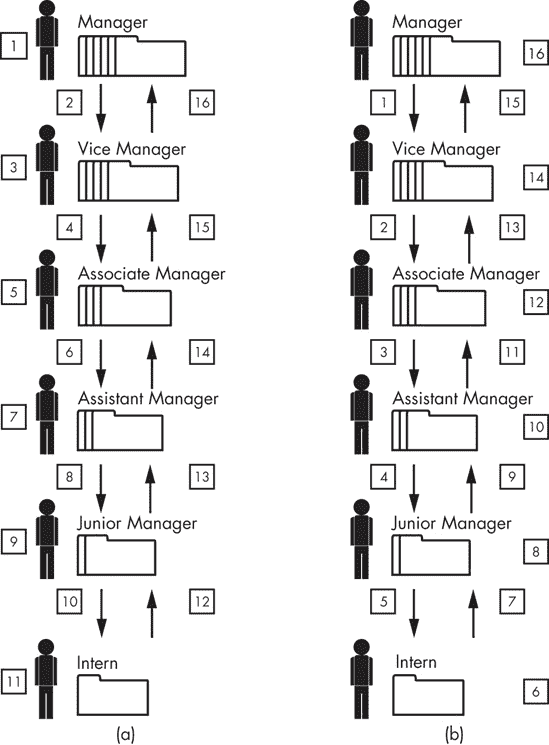
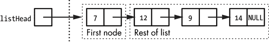
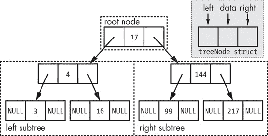

# 第六章 使用递归解决问题


本章是关于*递归*的，即函数直接或间接调用自身。递归编程看起来应该很简单。确实，一个好的递归解决方案通常看起来简单、几乎优雅。然而，通往那个解决方案的道路往往并不简单。这是因为递归要求我们以不同于其他类型编程的方式思考。当我们使用循环处理数据时，我们是在考虑按顺序处理，但当我们使用递归处理数据时，我们的正常顺序思维过程不会有所帮助。许多初出茅庐的程序员在递归上挣扎，因为他们看不到将他们学到的解决问题的技能应用到递归问题上的方法。在本章中，我们将讨论如何系统地攻击递归问题。答案是使用我们将称之为*大递归思想*的概念，简称 BRI。这是一个如此直截了当的想法，以至于它看起来像是一个技巧，但它确实有效。

# 递归基础回顾

关于递归的*语法*没有太多要了解的；困难在于你试图使用递归解决问题。递归发生在函数调用自身的时候，所以递归的语法只是函数调用的语法。最常见的形式是*直接递归*，即函数调用发生在同一函数体中。例如：

```
int factorial(int n) {
  if (n == 1) return 1;
   else return n * factorial(n - 1);
}
```

这个函数，它是一个常见但效率非常低的递归示例，计算*n*的阶乘。例如，如果*n*是 5，那么阶乘就是从 5 到 1 的所有数字的乘积，即 120。注意，在某些情况下不会发生递归。在这个函数中，如果参数是 1，我们直接返回一个值，而不进行任何递归，这被称为*基准情况*。否则，我们进行递归调用。

递归的另一种形式是*间接递归*——例如，如果函数 A 调用函数 B，而函数 B 后来又调用函数 A。间接递归很少用作解决问题的技术，所以我们在这里不会涉及它。

# 头递归和尾递归

在我们讨论 BRI 之前，我们需要理解头递归和尾递归之间的区别。在*头递归*中，递归调用，当它发生时，在函数中的其他处理之前（想想它在函数的顶部或头部发生）。在*尾递归*中，情况相反——处理发生在递归调用之前。在两种递归风格之间进行选择可能看起来是随意的，但选择可以产生很大的差异。为了说明这种差异，让我们看看两个问题。

问题：有多少只鹦鹉？

热带天堂铁路（TPR）的乘客期待着从火车窗户看到成打的五彩鹦鹉。因此，铁路对当地鹦鹉群体的健康表现出浓厚的兴趣，并决定对主线路沿线每个站台可见的鹦鹉数量进行统计。每个站台都配备了一名 TPR 员工（见图图 6-1), 他们当然能够数鹦鹉。不幸的是，这项工作被原始的电话系统复杂化了。每个站台只能与其直接邻居通话。我们如何得到主线路终端的鹦鹉总数？


图 6-1. 五个站点的员工只能与他们的直接邻居通信。

假设艺术在主终端有 7 只鹦鹉，贝琳达有 5 只，科尔里有 3 只，黛比有 10 只，而在最后一个站点，伊万有 2 只鹦鹉。因此，鹦鹉的总数是 27 只。问题是，员工们将如何一起向艺术传达这个总数？解决这个问题的任何方案都将需要从主终端到线路末端的通信链，然后再返回。每个站台的员工将被要求数鹦鹉，然后报告他们的观察结果。即便如此，这里有两种不同的通信链方法，这些方法对应于编程中的头递归和尾递归技术。

## 方法 1

在这种方法中，我们在进行外发通信的过程中保持鹦鹉的累计总数。每个员工在向线路下方的下一个员工提出请求时，都会传递到目前为止看到的鹦鹉数量。当我们到达线路的末端时，伊万将是第一个发现鹦鹉总数的人，他将把这个总数传递给黛比，黛比再传递给科尔里，依此类推（如图图 6-2 所示）。


图 6-2. 在方法 1 中解决鹦鹉计数问题所采取的步骤编号

1.  艺术首先开始数他平台周围的鹦鹉。他数了 7 只鹦鹉。

1.  艺术对贝琳达说：“主终端这里有 7 只鹦鹉。”

1.  贝琳达在她平台周围数了 5 只鹦鹉，累计总数为 12。

1.  贝琳达对科尔里：“前两个站点周围有 12 只鹦鹉。”

1.  科尔里数了 3 只鹦鹉。

1.  科尔里对黛比说：“前三个站点周围有 15 只鹦鹉。”

1.  黛比数了 10 只鹦鹉。

1.  DEBBIE 对 EVAN 说：“前四个站点周围有 25 只鹦鹉。”

1.  EVAN 数了 2 只鹦鹉，发现鹦鹉的总数是 27。

1.  EVAN 对 DEBBIE 说：“鹦鹉的总数是 27。”

1.  DEBBIE 对 CORY 说：“鹦鹉的总数是 27。”

1.  CORY 对 BELINDA 说：“鹦鹉的总数是 27。”

1.  BELINDA 对 ART 说：“鹦鹉的总数是 27。”

这种方法类似于尾递归。在尾递归中，递归调用发生在处理之后——递归调用是函数中的最后一步。在上面的通信链中，请注意，员工的“工作”——鹦鹉计数和求和——发生在他们向下一站发出信号之前。所有的工作都发生在出站通信链上，而不是入站链上。以下是每位员工遵循的步骤：

1.  从站台平台上数可见的鹦鹉。

1.  将这个数量加到上一站给出的总数上。

1.  打电话给下一站，传递鹦鹉数量的累计总和。

1.  等待下一站打电话报告总鹦鹉数量，然后将这个总数传递给上一站。

## 方法 2

在这种方法中，我们从另一端累加鹦鹉的数量。每位员工在联系下一站时，都会请求从该站开始的总鹦鹉数量。员工然后将自己站点的鹦鹉数量加上，并将这个新的总数向上传递（如图 Figure 6-3 所示）。


图 Figure 6-3

1.  ART 对 BELINDA 说：“从你的站点到线尾的总鹦鹉数量是多少？”

1.  BELINDA 对 CORY 说：“从你的站点到线尾的总鹦鹉数量是多少？”

1.  CORY 对 DEBBIE 说：“从你的站点到线尾的总鹦鹉数量是多少？”

1.  DEBBIE 对 EVAN 说：“从你的站点到线尾的总鹦鹉数量是多少？”

1.  EVAN 是线尾。他数了 2 只鹦鹉。

1.  EVAN 对 DEBBIE 说：“这里末尾的总鹦鹉数量是 2。”

1.  DEBBIE 在她的站点数了 10 只鹦鹉，因此从她的站点到末尾的总数是 12。

1.  DEBBIE 对 CORY 说：“从这里到末尾的总鹦鹉数量是 12。”

1.  CORY 数了 3 只鹦鹉。

1.  CORY 对 BELINDA 说：“从这里到末尾的总鹦鹉数量是 15。”

1.  BELINDA 数了 5 只鹦鹉。

1.  BELINDA 对 ART 说：“从这里到末尾的总鹦鹉数量是 20。”

1.  ART 在主终端数了 7 只鹦鹉，总数达到 27。

这种方法类似于头递归。在头递归中，递归调用发生在其他处理之前。在这里，调用下一个车站发生在计数鹦鹉或求和之前。工作被推迟到下游车站报告它们的总数之后。以下是每个员工遵循的步骤：

1.  呼叫下一个车站。

1.  计算从车站平台可见的鹦鹉数量。

1.  将这个计数添加到下一个车站给出的总数中。

1.  将得到的总和传递给上一个车站。

你可能已经注意到了不同方法产生的两个实际效果。在第一种方法中，最终所有车站员工都将学会整体鹦鹉总数。在第二种方法中，只有主终端的 Art 学会了完整总数——但请注意，Art 是唯一需要完整总数的员工。

当我们将讨论过渡到实际的编程代码时，另一个实际效果将对我们分析变得更加重要。在第一种方法中，每个员工在提出请求时将“累计总数”传递给下一个车站。在第二种方法中，员工只是从下一个车站请求信息，而不在沿线传递任何数据。这种效果是头递归方法的典型特征。因为递归调用首先发生，在所有其他处理之前，没有新的信息可以提供给递归调用。一般来说，头递归方法允许将最小数据集传递给递归调用。现在让我们看看另一个问题。

问题：谁是我们的最佳客户？

DelegateCorp 的经理需要确定八位客户中哪位为公司创造了最多的收入。两个因素使这个本应简单的工作变得复杂。首先，确定客户的总收入需要查看该客户的整个档案，并统计数十个订单和收据上的数字。其次，正如其名称所暗示的，DelegateCorp 的员工喜欢委派工作，并且每当可能时，每个员工都会将工作传递给更低级别的员工。为了防止情况失控，经理实施了一项规则：当你委派工作时，你必须自己完成部分工作，并且你必须给委派给员工的任务少于你原本得到的。

表 6-1 和 表 6-2 识别了 DelegateCorp 的员工和客户。

表 6-1. DelegateCorp 员工职位和职级

| 职位 | 职级 |
| --- | --- |
| 经理 | 1 |
| 副经理 | 2 |
| 副经理 | 3 |
| 助理经理 | 4 |
| 初级经理 | 5 |
| 实习生 | 6 |

表 6-2. DelegateCorp 客户

| 客户编号 | 收入 |
| --- | --- |
| #0001 | $172,000 |
| #0002 | $68,000 |
| #0003 | $193,000 |
| #0004 | $13,000 |
| #0005 | $256,000 |
| #0006 | $99,000 |

根据公司关于委派工作的规定，以下是六个客户文件将发生的情况。经理将取一个文件，并确定该客户为公司创造了多少收入。经理将把其他五个文件委派给副经理。副经理将处理一个文件，并将其他四个文件转交给助理经理。这个过程一直持续到第六个员工，实习生，他将获得一个文件，并必须简单地处理它，没有进一步的委派可能。

图 6-4 描述了沟通线路和劳动分工。然而，与前面的例子一样，存在两种不同的沟通链方法。



图 6-4. 寻找最高收入客户的方法 1（a）和方法 2（b）中的步骤编号

## 方法 1

在这种方法中，在委派剩余文件时，员工也会传递迄今为止看到的最高的收入金额。这意味着员工必须统计一个文件的收入，并将其与之前看到的最高的金额进行比较，然后再将剩余的文件委派给另一个员工。以下是如何在实际中进行的例子。

1.  **经理**统计了客户#0001 的收入，为 172,000 美元。

1.  **经理**对**副经理**说：“迄今为止我们看到的最高的收入是 172,000 美元，客户#0001。请取这五个文件并确定整体最高的收入。”

1.  **副经理**统计了客户#0002 的收入，为 68,000 美元。迄今为止看到的最高的收入仍然是 172,000 美元，客户#0001。

1.  **副经理**对**助理经理**说：“迄今为止我们看到的最高的收入是 172,000 美元，客户#0001。请取这四个文件并确定整体最高的收入。”

1.  **助理经理**统计了客户#0003 的收入，为 193,000 美元。迄今为止看到的最高的收入现在是 193,000 美元，客户#0003。

1.  **助理经理**对**助理经理**说：“迄今为止我们看到的最高的收入是 193,000 美元，客户#0003。请取这三个文件并确定整体最高的收入。”

1.  **助理经理**统计了客户#0004 的收入，为 13,000 美元。迄今为止看到的最高的收入仍然是 193,000 美元，客户#0003。

1.  **助理经理**对**初级经理**说：“迄今为止我们看到的最高的收入是 193,000 美元，客户#0003。请取这两个文件并确定整体最高的收入。”

1.  **初级经理**统计了客户#0005 的收入，为 256,000 美元。迄今为止看到的最高的收入现在是 256,000 美元，客户#0005。

1.  **初级经理**对**实习生**说：“迄今为止我们看到的最高的收入是 256,000 美元，客户#0005。请取这个剩余的文件并确定整体最高的收入。”

1.  实习生计算客户编号#0006 的收入，为$99,000。迄今为止看到的最高收入仍然是$256,000，客户编号#0005。

1.  实习生对初级经理说：“所有客户的最高收入是$256,000，客户编号#0005。”

1.  初级经理对助理经理说：“所有客户的最高收入是$256,000，客户编号#0005。”

1.  助理经理对助理经理说：“所有客户的最高收入是$256,000，客户编号#0005。”

1.  助理经理对副经理说：“所有客户的最高收入是$256,000，客户编号#0005。”

1.  副经理对经理说：“所有客户的最高收入是$256,000，客户编号#0005。”

这种方法，如图图 6-4（a）所示，使用了尾递归技术。每位员工处理一份客户文件，并将该客户的计算收入与迄今为止看到的最高收入进行比较。然后员工将比较结果转交给下属员工。递归——工作的转交——在其他处理之后发生。每位员工的过程如下：

1.  计算一份客户文件中的收入。

1.  将这个总额与上级在其他客户文件中看到的最高收入进行比较。

1.  将剩余的客户文件及其迄今为止看到的最高收入金额转交给下属员工。

1.  当下属员工返回所有客户文件中的最高收入时，将其转交给上级。

## 方法 2

在这种方法中，每位员工首先留下一份文件，然后将其他文件转交给下属。在这种情况下，下属不需要确定所有文件的最高收入，只需确定他们所拥有的文件的最高收入。与第一个示例问题一样，这简化了请求。使用与第一种方法相同的数据，对话将如下所示：

1.  经理对副经理说：“拿这五份客户文件，告诉我最高收入。”

1.  副经理对助理经理说：“拿这四份客户文件，告诉我最高收入。”

1.  助理经理对助理经理说：“拿这三份客户文件，告诉我最高收入。”

1.  助理经理对初级经理说：“拿这两份客户文件，告诉我最高收入。”

1.  初级经理对实习生说：“拿这份客户文件，告诉我最高收入。”

1.  实习生计算客户编号#0006 的收入，为$99,000。这是实习生看到的唯一文件，因此这是最高收入。

1.  实习生对初级经理说：“我文件中的最高收入是$99,000，客户编号#0006。”

1.  初级经理计算客户编号#0005 的收入，为$256,000。这位员工知道的最高收入是$256,000，客户编号#0005。

1.  从初级经理晋升为助理经理：“我文件中的最高收入是$256,000，客户编号#0005。”

1.  **助理经理**统计客户#0004 的收入，为$13,000。这位员工知道的最高收入是$256,000，客户编号#0005。

1.  **助理经理**到**副经理**：“我文件中的最高收入是$256,000，客户编号#0005。”

1.  **助理经理**统计客户#0003 的收入，为$193,000。这位员工知道的最高收入是$256,000，客户编号#0005。

1.  **助理经理**到**副经理**：“我文件中的最高收入是$256,000，客户编号#0005。”

1.  **副经理**统计客户#0002 的收入，为$68,000。这位员工知道的最高收入是$256,000，客户编号#0005。

1.  **副经理**到**经理**：“我文件中的最高收入是$256,000，客户编号#0005。”

1.  **经理**统计客户#0001 的收入，为$172,000。这位员工知道的最高收入是$256,000，客户编号#0005。

这种方法，如图图 6-4（b）所示，使用了头递归技术。每个员工仍然需要统计一个客户文件的收入，但这个动作是在下属员工确定剩余文件中的最高收入之后才进行的。每个员工采取的过程如下：

1.  将所有客户文件（除了一个）传递给下属员工。

1.  从下属员工那里获取那些文件中的最高收入。

1.  在一个客户文件中统计收入。

1.  将两个收入中较大的一个传递给上级。

与“数鹦鹉”问题一样，头递归技术允许每个员工向下属传递最小量的信息。

# **大递归思想**

现在，我们来到了**大递归思想**。实际上，如果你已经阅读了示例问题的步骤，你已经在行动中看到了 BRI（大递归思想）。

怎么做到的？这两个示例问题都遵循递归解决方案的形式。通讯链中的每个人都在越来越小的原始数据子集上执行相同的步骤。然而，需要注意的是，*这些问题根本不涉及递归*。

在第一个问题中，每个铁路员工都会向线路下方的下一个车站提出请求，并在满足该请求时，下一个员工会遵循与上一个员工相同的步骤。但是，请求的文字中没有任何内容要求员工遵循这些特定的步骤。例如，当 Art 使用方法 2 给 Belinda 打电话时，他要求她从她的车站数到线路末端的鹦鹉总数。他没有规定发现这个总数的方法。如果他考虑过这个问题，他可能会意识到 Belinda 必须遵循与他本人相同的步骤，但他不必考虑这一点。为了完成他的任务，Art 需要的只是 Belinda 提供他问问题的正确答案。

同样，在第二个问题中，管理链中的每个员工都将尽可能多的工作转交给下属。例如，助理经理可能很了解初级经理，并期望初级经理将所有文件（除了一个）交给实习生。然而，助理经理没有理由关心初级经理是否处理了所有剩余的文件或将其中一些转交给下属。助理经理只关心初级经理是否给出了正确的答案。因为助理经理不会重复初级经理的工作，助理经理只是假设初级经理返回的结果是正确的，并使用这些数据来解决助理经理从副经理那里接收到的整体任务。

在这两个问题中，当员工向其他员工提出请求时，他们关心的是*什么*，而不是*如何*。一个问题被传递；一个答案被接收。这就是大递归思想：如果你在编码中遵循某些约定，*你可以假装没有发生递归*。你甚至可以使用一个简单的技巧（如下所示）从迭代实现转换为递归实现，而不必明确考虑递归实际上是如何解决问题的。随着时间的推移，你将发展出对递归解决方案如何工作的直观理解，但在这种直觉形成之前，你可以编写递归实现并对你的代码有信心。

让我们通过一个代码示例来将这个概念付诸实践。

问题：计算整数数组的和

编写一个递归函数，该函数接受一个整数数组和数组的大小作为参数。该函数返回数组中整数的和。

你可能首先想到这个问题通过迭代方式解决是微不足道的。确实，让我们从这个问题的迭代解决方案开始：

```
int iterativeArraySum(int integers[], int size) {
    int sum = 0;
    for (int i = 0; i < size; i++) {
        sum += integers[i];
    }
    return sum;
}
```

你在第三章中看到了非常类似的代码，所以这个函数应该很容易理解。下一步是编写介于迭代解决方案和最终所需的递归解决方案之间的代码。我们将保留迭代函数，并添加一个我们将称之为“调度器”的第二个函数。调度器将大部分工作交给之前编写的迭代函数，并使用这些信息来解决整体问题。要编写调度器，我们必须遵循两个规则：

1.  调度器必须完全处理最简单的情况，而不调用迭代函数。

1.  调度器在调用迭代函数时，必须传递一个更小的问题版本。

在将第一条规则应用于这个问题时，我们必须决定最简单的情况是什么。如果`size`为 0，那么函数在概念上已经接收了一个“空”数组，其总和为 0。也有人可能会争辩说，最简单的情况应该是`size`为 1。在这种情况下，逻辑数组中只有一个数字，我们可以将其作为总和返回。这两种解释都可以工作，但选择第一种允许函数处理一个特殊情况。请注意，原始的迭代函数在`size`为零时不会失败，因此最好保持这种灵活性。

要将第二条规则应用于这个问题，我们必须找出一种方法，将问题的较小版本从调度器传递给迭代函数。没有简单的方法可以传递较小的数组，但我们可以轻松地传递较小的`size`值。如果调度器将`size`的值设为 10，那么函数被要求计算数组中 10 个值的总和。如果调度器将`size`的值传递为 9 给迭代函数，它请求的是数组中前 9 个值的总和。调度器然后将数组中剩余的一个值（第 10 个）的值加起来，以计算所有 10 个值的总和。请注意，在调用迭代函数时减少 1 可以最大化迭代函数的工作量，从而最小化调度器的工作量。这始终是期望的方法——就像 DelegateCorp 的管理者一样，调度器函数避免尽可能多的工作。

将这些想法结合起来，这里是一个针对这个问题的调度器函数：

```
int arraySumDelegate(int integers[], int size) {
  if (size == 0) return 0;
  int lastNumber = integers[size - 1];
    int allButLastSum = iterativeArraySum(integers, size - 1);
  return lastNumber + allButLastSum;
}
```

第一条语句强制执行调度器的第一条规则：它检查一个简单的情况并完全处理它，在这种情况下，通过返回 0 ![http://atomoreilly.com/source/no_starch_images/1273182.png]。否则，控制权传递到剩余的代码，该代码强制执行第二条规则。数组中的最后一个数字存储在一个名为`lastNumber`的局部变量中 ![http://atomoreilly.com/source/no_starch_images/1273191.png]，然后通过调用迭代函数计算数组中所有其他值的总和 ![http://atomoreilly.com/source/no_starch_images/1273193.png]。这个结果存储在另一个局部变量`allButLastSum`中，最后函数返回这两个局部变量的总和 ![http://atomoreilly.com/source/no_starch_images/1273195.png]。

如果我们正确地创建了一个调度器函数，那么我们已经有效地创建了一个递归解决方案。这就是大递归思想在起作用。要将这个迭代解决方案转换为递归解决方案，只需要再进行一个简单步骤：让委托函数在之前调用迭代函数的地方调用自己。然后我们可以完全删除迭代函数。

```
int arraySumRecursive(int integers[], int size) {
    if (size == 0) return 0;
    int lastNumber = integers[size - 1];
    int allButLastSum = arraySumRecursive(integers, size - 1);
    return lastNumber + allButLastSum;
}
```

之前的代码只做了两项更改。函数的名称已被更改，以更好地描述其新的形式 ，并且函数现在在之前调用迭代函数  的地方调用自身。两个函数 `arraySumDelegate` 和 `arraySumRecursive` 的逻辑是相同的。每个函数都会检查一个已知和的简单情况——在这种情况下，大小为 0 的数组其和为 0。否则，每个函数通过调用一个函数来计算数组中所有值的和（除了最后一个值）。最后，每个函数将最后一个值加到返回的总和中。唯一的区别是，函数的第一个版本调用另一个函数，而递归版本调用自身。BRI 告诉我们，如果我们遵循上述编写派发器的规则，我们可以忽略这种区别。

您不需要字面地遵循上述所有步骤来遵循 BRI。特别是，您通常不会在实现递归解决方案之前实现迭代解决方案。将迭代函数作为垫脚石是额外的工作，最终会被丢弃。此外，递归最适合应用于迭代解决方案困难的情况，如后文所述。然而，您可以在不实际编写迭代解决方案的情况下遵循 BRI 的提纲。关键是把递归调用看作是对另一个函数的调用，而不考虑该函数的内部细节。这样，您就从递归解决方案中移除了递归逻辑的复杂性。

# 常见错误

如上所示，使用正确的方法，递归解决方案通常很容易编写。但同样容易得出一个错误的递归实现或一个“工作”但笨拙的递归解决方案。递归实现中的大多数问题都源于两个基本错误：对问题思考过度或在没有明确计划的情况下开始实现。

对递归问题思考过度是新手程序员常见的错误，因为有限的经验和对递归的不自信使他们认为问题比实际情况更难。过度思考产生的代码可以通过其过于细致的外观来识别。例如，一个递归函数可能有几个只需要一个的特殊情况。

过早开始实现可能导致过于复杂的“鲁布·戈尔巴乔夫”代码，其中未预见的交互导致了对原始代码的修复。

让我们看看一些具体的错误以及如何避免它们。

## 参数过多

如前所述，头递归技术可以减少传递给递归调用的数据量，而尾递归技术可能会导致向递归调用传递额外的数据。程序员常常陷入尾递归模式，因为他们过度思考并且过早开始实现。

考虑我们递归计算整数数组总和的问题。编写这个问题的迭代解决方案时，程序员知道需要一个“运行总和”变量（在提供的迭代解决方案中，我称这个变量为`sum`），并且数组将从第一个元素开始求和。考虑到递归解决方案，程序员自然会想象一个最直接反映迭代解决方案的实现，有一个运行总和变量，第一个递归调用处理数组的第一个元素。然而，这种方法要求递归函数传递运行总和和下一个递归调用应该开始处理的位置。这样的解决方案看起来像这样：

```
int arraySumRecursiveExtraParams(int integers[], int size, int sum,
 int currentIndex) {
    if (currentIndex == size) return sum;
    sum += integers[currentIndex];
    return arraySumRecursiveExtraParameters(integers, size, sum, currentIndex + 1);
}
```

这段代码与其他递归版本一样短，但由于额外的参数`sum` 和`currentIndex` ，语义上要复杂得多。从客户端代码的角度来看，这些额外的参数是没有意义的，并且调用时总是为零，如这个示例所示：

```
int a[10] = {20, 3, 5, 22, 7, 9, 14, 17, 4, 9};
int total = arraySumRecursiveExtraParameters(a, 10, 0, 0);
```

使用**包装函数**可以避免这个问题，正如下一节所描述的，但由于我们无法完全消除这些参数，这并不是最佳解决方案。这个问题的迭代函数和原始递归函数回答了这样一个问题：具有这么多元素的数组的总和是多少？相比之下，这个第二个递归函数被问到的是，如果数组有这么多元素，我们从这个特定元素开始，这是所有先前元素的总和？

通过在选择递归函数参数之前考虑“参数过多”的问题，可以避免这个问题。换句话说，强迫自己使用如果解决方案是迭代的，你将使用的相同参数列表。如果你使用完整的 BRI 过程并且首先实际编写迭代函数，你将自动避免这个问题。如果你跳过正式使用整个过程，尽管如此，如果你根据你期望的迭代函数编写参数列表，你仍然可以在概念上使用这个想法。

## 全局变量

避免过多的参数有时会让程序员犯另一个错误：使用全局变量从一个递归调用传递数据到另一个递归调用。虽然出于性能原因有时是允许的，但使用全局变量通常是一种糟糕的编程实践。在可能的情况下，递归函数中应始终避免使用全局变量。让我们看看一个具体的问题，看看程序员是如何说服自己犯这个错误的。假设我们被要求编写一个递归函数，用来计算整数数组中出现的零的数量。这是一个简单的问题，可以使用迭代来解决：

```
int zeroCountIterative(int numbers[], int size) {
   int sum = 0;
 int count = 0;
   for (int i = 0; i < size; i++) {
      if (numbers[i] == 0) count ++;
   }
   return count;
}
```

这段代码的逻辑很简单。我们只是从数组的第一个位置遍历到最后一个位置，在遍历的过程中计数零的数量，并使用一个局部变量`count` 作为跟踪器。如果我们写递归函数时心里有这样一个函数，我们可能会认为在那个版本中也需要一个跟踪变量。但我们不能简单地在递归版本中声明`count`为局部变量，因为那样的话，它就会在每次递归调用中成为一个新的变量。因此，我们可能会倾向于将其声明为全局变量：

```
int count;
int zeroCountRecursive(int numbers[], int size) {
   if (size == 0) return count;
   if (numbers[size - 1] == 0) count++;
   zeroCountRecursive(numbers, size - 1);
}
```

这段代码能正常工作，但全局变量完全是多余的，并且导致了全局变量通常引起的问题，比如可读性差和代码维护更困难。一些程序员可能会尝试通过将变量设置为局部但静态的方式来减轻这个问题，但这样做：

```
int zeroCountStatic(int numbers[], int size) {
 static int count = 0;
   if (size == 0) return count;
   if (numbers[size - 1] == 0) count++;
   zeroCountStatic(numbers, size - 1);
}
```

在 C++中，声明为*静态*的局部变量会保留其值，从一次函数调用到下一次；因此，局部静态变量`count` 会与上一个版本中的全局变量表现相同。那么问题是什么？变量的初始化为零 只发生在函数第一次被调用时。这对于`static`声明有任何用途是必要的，但这意味着函数只有在第一次被调用时才会返回正确答案。如果这个函数被调用两次——第一次是一个有三个零的数组，然后是一个有五个零的数组——由于`count`会从上次停止的地方开始，函数会对第二个数组返回八个作为答案。

在这种情况下，避免使用全局变量的解决方案是使用 BRI（尾递归改进）。我们可以假设一个`size`值较小的递归调用将返回正确的结果，并从那里计算出整个数组的正确值。这将导致一个头递归解决方案：

```
int zeroCountRecursive(int numbers[], int size) {
   if (size == 0) return 0;
 int count = zeroCountRecursive(numbers, size - 1);
 if (numbers[size - 1] == 0) count++;
 return count;
}
```

在这个函数中，我们仍然有一个局部变量`count` ，但在这里没有尝试从一次调用保持其值到下一次调用。相反，它存储了我们的递归调用的返回值；在返回之前，我们可以选择性地增加变量  。

# 将递归应用于动态数据结构

递归通常应用于动态结构，如链表、树和图。结构越复杂，代码从递归解决方案中受益越多。处理复杂结构通常就像在迷宫中找到出路一样，递归允许我们在处理过程中回溯到之前的步骤。

## 递归与链表

然而，让我们从最基本的动态结构开始，即链表。在本节讨论中，让我们假设我们有一个最简单的节点结构用于我们的链表，仅有一个`int`用于数据。以下是我们的类型声明：

```
struct listNnode {
    int data;
    listNode * next;
};
typedef listNode * listPtr;
```

将 BRI 应用于单链表遵循相同的一般概述，无论具体任务如何。递归要求我们分解问题，以便能够将原始问题的简化版本传递给递归调用。将单链表分解只有一个实际的方法：列表中的第一个节点和其余的列表。

在图 6-5 中，我们看到一个示例列表被分为不等的部分：首节点和所有其他节点。从概念上讲，我们可以将“其余的”原始列表视为其自身的列表，从原始列表中的第二个节点开始。正是这种观点使得递归能够顺利工作。



图 6-5. 将列表分为首节点和“其余列表”

再次强调，我们不需要想象递归的所有步骤来使递归工作。从编写递归函数处理链表的人的角度来看，它可以被概念化为第一个节点，我们必须处理它，以及其余的列表，我们不需要关心，因此不关心。这种态度在图 6-6 中有所体现。


图 6-6. 程序员使用递归时应该想象链表的样子：一个第一个节点和链表的其余部分作为一个需要传递给递归调用的模糊形状

在工作分配固定的情况下，我们可以这样说，单链表的递归处理将按照以下一般计划进行。给定一个链表 L 和一个问题 Q：

1.  如果 L 是最小的，我们直接分配一个默认值。否则……

1.  使用递归调用为“剩余”的链表 L（从 L 的第二个节点开始的链表）对 Q 给出答案。

1.  检查 L 的第一个节点的值。

1.  使用前两个步骤的结果为整个 L 对 Q 给出答案。

如你所见，这只是在将链表拆分时的实际限制下对 BRI 的直接应用。现在让我们将这个蓝图应用到具体的问题上。

问题：在单链表中计数负数

编写一个递归函数，该函数接受一个整数类型的数据的单链表。该函数返回链表中负数的计数。

我们想要回答的问题是，链表中有多少个负数？因此，我们的计划可以表述为：

1.  如果链表没有节点，则默认计数为 0。否则……

1.  使用递归调用来计数“剩余”的列表中有多少个负数。

1.  检查链表第一个节点的值是否为负。

1.  使用前两个步骤的结果来确定整个链表中有多少个负数。

这里有一个直接从这个计划中得出的函数实现：

```
int countNegative(listPtr head) {
    if (head == NULL) return 0;
    int listCount = countNegative(head->next);
    if (head->data < 0) listCount++;
    return listCount;
}
```

注意，这段代码遵循与之前示例相同的原理。它将“向后”计数负数，从列表的末尾到前面。此外，注意代码使用了头递归技术；我们在处理“剩余”的列表之前先处理第一个节点。和之前一样，这允许我们避免在递归调用中传递额外的数据或使用全局变量。

还要注意，如何将链表规则 1，“如果列表 L 是最小的”，在特定问题的具体实现中解释为“如果列表没有节点”。这是因为说一个没有节点的列表有零个负值是有意义的。然而，在某些情况下，对于没有节点的列表，我们的问题 Q 可能没有有意义的答案，最小的情况是只有一个节点的列表。假设我们的问题是，这个列表中最大的数是什么？对于没有值的列表，这个问题是无法回答的。如果你不明白为什么，假设你是一名小学教师，你的班级碰巧都是女生。如果你的校长问你教室里有多少男生是男童合唱团的成员，你可以简单地回答零，因为你没有男生。如果你的校长要求你指出你班上最高的男生是谁，你无法对这个问题给出有意义的答案——你必须至少有一个男生才能有最高的男生。同样，如果一个关于数据集的问题需要至少一个值才能有意义的回答，最小数据集就是一个项目。然而，你可能仍然希望为“大小为零”的情况返回*某些东西*，只是为了函数使用的灵活性，以及防止崩溃。

## 递归与二叉树

我们迄今为止所探讨的所有示例都不超过一次递归调用。然而，更复杂的数据结构可能需要多次递归调用。为了了解这是如何工作的，让我们考虑一种称为*二叉树*的结构，其中每个节点包含指向其他节点的“左”和“右”链接。以下是我们将使用的类型：

```
struct treeNode {
    int data;
    treeNode * left;
    treeNode * right;
};
typedef treeNode * treePtr;
```

因为树中的每个节点都指向两个其他节点，所以递归树处理函数需要两次递归调用。我们将链表概念化为有两个部分：一个第一个节点和列表的其余部分。为了应用递归，我们将树概念化为有三个部分：顶部的节点，称为*根节点*；从根的左链接到达的所有节点，称为*左子树*；以及从根的右链接到达的所有节点，称为*右子树*。这种概念化在图 6-7 中显示。与链表一样，作为递归解决方案的开发者，我们只关注左右子树的存在，而不考虑它们的内部结构。这如图图 6-8 所示。



图 6-7. 一棵被分为根节点和左右子树的二叉树

像往常一样，在递归解决涉及二叉树的问题时，我们希望采用 BRI。我们将进行递归函数调用，并假设它们返回正确的结果，而不必担心递归过程如何解决整体问题。与链表一样，我们将与二叉树的自然划分一起工作。这产生了以下一般计划。为了回答关于树 T 的问题 Q：


图 6-8. 程序员使用递归时应该想象二叉树的样子：一个根节点，其左右子树的结构未知且未考虑

1.  如果树 T 的大小是最小的，则直接分配一个默认值。否则……

1.  递归调用以回答 T 的左子树的问题 Q。

1.  递归调用以回答 T 的右子树的问题 Q。

1.  检查 T 的根节点中的值。

1.  使用前三个步骤的结果来回答 T 的所有问题 Q。

现在，让我们将一般计划应用于一个具体问题。

问题：在二叉树中找到最大值

编写一个函数，当给定一个每个节点都包含整数的二叉树时，返回树中的最大整数。

将一般计划应用于这个具体问题，结果如下步骤：

1.  如果树的根没有子节点，则返回根节点中的值。 -否则……

1.  递归调用以找到左子树中的最大值。

1.  递归调用以找到右子树中的最大值。

1.  检查根节点中的值。

1.  返回前三个步骤中值最大的一个。

在这些步骤的指导下，我们可以直接编写解决方案的代码：

```
int maxValue(treePtr root) {
  if (root == NULL) return 0;
  if (root->right == NULL && root->left == NULL)
        return root->data;
  int leftMax = maxValue(root->left);
  int rightMax = maxValue(root->right);
  int maxNum = root->data;
    if (leftMax > maxNum) maxNum = leftMax;
    if (rightMax > maxNum) maxNum = rightMax;
    return maxNum;
}
```

注意，这个问题的最小树是一个单独的节点 （尽管为了安全起见也涵盖了空树的情况 ）。这是因为我们提出的问题只能用至少一个数据值有意义的回答。考虑如果我们尝试将空树作为基本情况的实际问题。我们可以返回什么值？如果我们返回零，则隐含地要求树中有一些正值；如果树中的所有值都是负值，则零将被错误地返回为树中的最大值。我们可能通过返回可能的最小（最负）整数来解决此问题，但那时我们必须小心地调整代码以适应其他数值类型。通过将单个节点作为基本案例，我们完全避免了这一决定。

代码的其余部分很简单。我们使用递归在左  和右子树  中找到最大值。然后我们使用本书中一直使用的“山丘之王”算法的变体来找到这三个值中的最大值（根节点值、左子树中的最大值、右子树中的最大值）。

# 包装函数

在本章前面的示例中，我们只讨论了递归函数本身。然而，在某些情况下，递归函数需要通过第二个函数来“设置”。最常见的情况是我们将递归函数写在类结构内部。这可能导致递归函数所需的参数与类公共方法所需的参数不匹配。由于类通常强制信息隐藏，类客户端代码可能无法访问递归函数所需的数据或类型。这个问题及其解决方案将在下一个示例中展示。

问题：找到二叉树中的叶子数

对于实现二叉树的类，添加一个公开可访问的方法，该方法返回树中的叶子数（没有子节点的节点）。叶子计数应使用递归进行。

在尝试实现这个问题的解决方案之前，让我们先概述一下这个类可能的样子。为了简单起见，我们将只包括类中的相关部分，忽略构造函数、析构函数，甚至允许我们按顺序构建树的那些方法，以便专注于我们的递归方法。

```
class binaryTree {
    public:
      int countLeaves();
    private:
        struct binaryTreeNode {
            int data;
            binaryTreeNode * left;
            binaryTreeNode * right;
        };
        typedef treeNode * treePtr;
        treePtr _root;
};
```

注意，我们的叶子计数函数不接收任何参数 。从接口角度来看，这是完全正确的。考虑一个对先前构建的 `binaryTree` 对象 `bt` 的示例调用：

```
int numLeaves = bt.countLeaves();
```

事实上，如果我们询问树有多少叶子，我们能为对象提供什么信息，它可能不知道关于自己的信息？尽管这对于接口来说是正确的，但对于递归实现来说却是完全错误的。如果没有参数，从一次递归调用到下一次递归调用会有什么变化？在这种情况下，除了全局变量之外，没有任何东西可以改变，而全局变量，如前所述，应避免使用。如果没有变化，递归就无法进行或终止。

解决这个问题的方法是首先编写递归函数，将其概念化为类外的函数。换句话说，我们将以与编写在二叉树中查找最大值函数相同的方式编写这个函数，来计算二叉树中的叶子数。我们需要传递的一个参数是我们节点结构的指针。

这为我们提供了另一个机会来应用 BRI。在这种情况下，问题 Q 是什么？它是，树中有多少个叶子节点？将递归处理二叉树的一般计划应用于这个具体问题，结果如下：

1.  如果树的根节点没有子节点，那么树总共只有一个节点。根据定义，这个节点是一个叶子节点，因此返回 1。否则 ...

1.  对左子树进行递归调用以计数叶子。

1.  对右子树进行递归调用以计数叶子。

1.  在这种情况下，没有必要检查根节点，因为我们到达这一步时，根节点不可能是叶子节点。所以 ...

1.  返回步骤 2 和 3 的总和。

将此计划转换为代码如下：

```
struct binaryTreeNode {
    int data;
    treeNode * left;
    treeNode * right;
};
typedef binaryTreeNode * treePtr;
int countLeaves(treePtr rootPtr) {
    if (rootPtr == NULL) return 0;
    if (rootPtr->right == NULL && rootPtr->left == NULL)
        return 1;
    int leftCount = countLeaves(rootPtr->left);
    int rightCount = countLeaves(rootPtr->right);
    return leftCount + rightCount;
}
```

如您所见，代码是计划的直接翻译。问题是，我们如何从这个独立函数转换到可以在类中使用的东西？这就是粗心的程序员可能会轻易陷入麻烦的地方，认为我们需要使用全局变量或使根指针公开。但我们需要做的不是这样；我们可以将一切保持在内。诀窍是使用*包装函数*。首先，我们将具有`treePtr`参数的独立函数放在我们类的私有部分。然后，我们编写一个公共函数，即包装函数，它将“包装”私有函数。因为公共函数可以访问私有数据成员`root`，它可以将其传递给递归函数，然后像这样将结果返回给客户端：

```
class binaryTree {
      public:
          int publicCountLeaves();
      private:
          struct binaryTreeNode {
              int data;
              binaryTreeNode * left;
              binaryTreeNode * right;
          };
          typedef binaryTreeNode * treePtr;
          treePtr _root;
          int privateCountLeaves(treePtr rootPtr);
  };
 int binaryTree::privateCountLeaves(treePtr rootPtr) {
      if (rootPtr == NULL) return 0;
      if (rootPtr->right == NULL && rootPtr->left == NULL)
          return 1;
      int leftCount = privateCountLeaves(rootPtr->left);
      int rightCount = privateCountLeaves(rootPtr->right);
      return leftCount + rightCount;
  }
 int binaryTree::publicCountLeaves() {
     return privateCountLeaves(_root);
  }
```

虽然 C++允许两个函数具有相同的名称，但为了清晰起见，我使用了不同的名称来区分公共和私有的“计数叶子”函数。`privateCountLeaves`中的代码与我们的上一个独立函数`countLeaves`完全相同。包装函数`publicCountLeaves`![http://atomoreilly.com/source/nostarch/images/1273191.png]很简单。它调用`privateCountLeaves`，传递私有的数据成员`root`，并返回结果![http://atomoreilly.com/source/nostarch/images/1273193.png]。本质上，它“启动”了递归过程。包装函数在编写类内部的递归函数时非常有帮助，但它们可以在任何函数所需的参数列表与调用者期望的参数列表不匹配时使用。

# 何时选择递归

新程序员常常想知道为什么有人要处理递归。他们可能已经了解到任何程序都可以使用基本控制结构构建，例如选择（if 语句）和迭代（for 和 while 循环）。如果递归比基本控制结构更难应用且不必要，那么递归可能应该被忽略。

有几个反驳。首先，递归编程有助于程序员以递归的方式思考，递归思维在计算机科学的各个领域，如编译器设计中都得到了应用。其次，一些语言由于缺乏一些基本控制结构，因此需要递归。例如，Lisp 语言的纯版本几乎在所有非平凡函数中都需要递归。

然而，问题仍然存在：如果一个程序员已经足够了解递归以至于“理解”了它，并且正在使用像 C++、Java 或 Python 这样的功能齐全的语言，那么递归是否应该被使用？在这些语言中，递归是否有实际用途，或者它仅仅是一种心智练习？

## 反对递归的论点

为了探讨这个问题，让我们列举递归的缺点。

**概念复杂性**

对于大多数问题，普通程序员使用递归解决问题更困难。即使你理解了“大递归思想”，在大多数情况下，使用循环编写代码仍然更容易。

**性能**

函数调用会产生显著的开销。递归涉及大量的函数调用，因此可能会很慢。

**空间需求**

递归不仅使用了许多函数调用，而且还嵌套了它们。也就是说，你可能会得到一个等待其他调用完成的函数调用长链。每个已经开始但尚未结束的函数调用都会在系统栈上占用额外的空间。

乍一看，这个功能列表构成了对递归作为困难、缓慢和空间浪费的强烈指控。然而，这些论点并不普遍适用。因此，决定递归和迭代之间的最基本规则是，*在这些论点不适用时选择递归*。

考虑我们用来计算二叉树中叶子节点数量的函数。你将如何在不使用递归的情况下解决这个问题？这是可能的，但你需要一个显式的机制来维护“面包屑路径”，即那些左子节点已被访问但右子节点尚未访问的节点。这些节点需要在某个时候被重新访问，以便我们可以沿着右侧移动。你可能会将这些节点存储在动态结构中，例如栈。为了比较，这里是一个使用 C++标准模板库中的栈类的函数实现：

```
int binaryTree::stackBasedCountLeaves() {
    if (_root == NULL) return 0;
    int leafCount = 0;
  stack<binaryTreeNode *> nodes;
  nodes.push(_root);
    while (!nodes.empty()) {
        treePtr currentNode = nodes.top();
      nodes.pop();
        if (currentNode->left == NULL && currentNode->right == NULL)
            leafCount++;
        else {
            if (currentNode->right != NULL) nodes.push(currentNode->right);
            if (currentNode->left != NULL) nodes.push(currentNode->left);
        }
    }
    return leafCount;
}
```

这段代码遵循与原始代码相同的模式，但如果您之前从未使用过栈类，那么一些注释是有序的。栈类的工作方式与我们讨论过的系统栈类似，第三章；您只能在顶部添加和删除项目。请注意，我们可以使用任何没有固定大小的数据结构来执行我们的叶子计数操作。例如，我们可以使用向量，但使用栈最直接地反映了原始代码。当我们声明栈  时，我们指定了我们将存储那里的项目类型。在这种情况下，我们将存储指向我们的 `binaryTreeNode` 结构的指针 。在这段代码中，我们使用了四个栈类方法。`push` 方法  将一个项目（在这种情况下是一个节点指针）放置在栈的顶部。`empty` 方法  告诉我们栈上是否还有任何项目。`top` 方法  给我们栈顶项目的副本，而 `pop` 方法  从栈中移除顶部项目。

该代码通过将第一个节点的指针放置在栈上，然后反复从栈中移除节点的指针，检查它是否是叶子节点，如果是，则增加我们的计数器，如果存在子节点，则将指针放置在栈上。因此，栈跟踪我们已发现但尚未处理的节点，就像递归版本中的递归调用链跟踪我们必须重新访问的节点一样。在将这个迭代版本与递归版本进行比较时，我们看到在这种情况下，对递归的标准反对意见并没有多大的作用。首先，这段代码比递归版本更长、更复杂，因此没有理由基于概念复杂性反对递归版本。其次，看看 `stackBasedCountLeaves` 函数调用了多少次函数——对于每次访问内部节点（即不是叶子节点），这个函数会调用四个函数：每个 `empty` 和 `top` 各调用一次，以及两次 `push`。递归版本为每个内部节点只进行两次递归调用。（注意，我们可以通过在函数中包含栈的逻辑来避免对栈对象的函数调用。然而，这会进一步增加函数的复杂性。）第三，虽然这个迭代版本没有使用额外的系统栈空间，但它明确使用了私有栈。公平地说，这比递归调用的系统栈开销要少，但它仍然是我们正在遍历的二叉树最大深度的系统内存消耗。

由于在这种情况下对递归的反对意见得到了缓解或最小化，因此递归是解决该问题的好选择。更普遍地说，如果一个问题简单到可以通过迭代解决，那么迭代应该是你的首选。当迭代会变得复杂时，应该使用递归。通常这涉及到这里显示的“面包屑路径”机制的必要性。遍历分支结构，如树和图，本质上是递归的。处理线性结构，如数组和链表，通常不需要递归，但也有一些例外。使用迭代首次尝试解决问题永远不会出错。作为一个最后的例子，考虑以下链表问题。

问题：以顺序显示链表

编写一个函数，该函数接收单链表的头指针，其中每个节点的数据类型为整数，并按列表中出现的顺序，每行显示一个整数。

问题：以逆序显示链表

编写一个函数，该函数接收单链表的头指针，其中每个节点的数据类型为整数，并按列表中出现的顺序，每行显示一个整数。

由于这些问题是彼此的镜像，因此自然地假设它们的实现也会是镜像。对于递归实现来说，情况确实如此。使用之前给出的`listNode`和`listPtr`类型，以下是解决这两个问题的递归函数：

```
void displayListForwardsRecursion(listPtr head) {
    if (head != NULL) {
        cout << head->data << "\n";
        displayListForwardsRecursion(head->next);
    }
}
void displayListBackwardsRecursion(listPtr head) {
    if (head != NULL) {
        displayListBackwardsRecursion(head->next);
        cout << head->data << "\n";
    }
}
```

如您所见，这些函数中的代码除了`if`语句中两个语句的顺序不同之外，都是相同的。这造成了所有区别。在第一种情况下，我们在递归调用以显示列表的其余部分之前，显示了第一个节点中的值 。在第二种情况下，我们在显示第一个节点中的值之前，先调用以显示列表的其余部分 ![http://atomoreilly.com/source/no_starch_images/1273193.png]。这导致整体显示顺序是倒序的。

由于这两个函数同样简洁，人们可能会认为递归正确地用于解决这两个问题，但实际上并非如此。为了证明这一点，让我们看看这两个函数的迭代实现。

```
void displayListForwardsIterative(listPtr head) {
   for (listPtr current = head; current != NULL; current = current->next)
        cout << current->data << "\n";
}
void displayListBackwardsIterative(listPtr head) {
   stack<listPtr> nodes;
   for (listPtr current = head; current != NULL; current = current->next)
        nodes.push(current);
   while (!nodes.empty()) {
      nodePtr current = nodes.top();
      nodes.pop();
      cout << current->data << "\n";
    }
}
```

按顺序显示列表的函数只是一个简单的遍历循环 ，就像我们在第四章中看到的那样。然而，按反向顺序显示列表的函数更复杂。它面临着与我们的二叉树问题相同的“面包屑路径”要求。按定义，在链表中按反向顺序显示节点需要回到先前的节点。在单链表中，没有使用列表本身的方法来实现这一点，因此需要另一个结构。在这种情况下，我们需要另一个栈。在声明栈  之后，我们使用 `for` 循环  将链表中的所有节点推入栈中。因为这是一个栈，每个项目都是添加在先前项目之上，所以链表中的第一个项目将在栈的底部，最后一个项目将在栈的顶部。我们进入一个循环，直到栈为空 ，重复获取栈顶节点的指针 ，从栈中移除该节点指针 ，然后显示引用节点中的数据 。因为栈顶的数据是链表中的最后一个数据，这会产生按反向顺序显示链表数据的效果。

与前面展示的迭代二叉树函数一样，可以不使用栈（在函数内部构建一个与原始列表相反的第二个列表）来编写这个函数。然而，无论如何也无法使第二个函数像第一个那样简单，或者避免实际上遍历两个结构而不是一个。比较递归和迭代实现，很容易看出迭代“正向”函数非常简单，使用递归实际上没有实际优势，而且存在几个实际缺点。相比之下，递归“反向”函数比迭代版本简单，应该期望其性能与迭代版本相当。因此，“反向”函数是递归的合理使用，而“正向”函数，虽然是一个好的递归编程练习，但不是递归的实用应用。

# 练习

和往常一样，尝试本章中提出的思想是强制性的！

1.  编写一个函数来计算整数数组中正数的总和。首先，使用迭代方法解决这个问题。然后，使用本章中展示的技术，将你的迭代函数转换为递归函数。

1.  考虑一个表示二进制字符串的数组，其中每个元素的数据值是 0 或 1。编写一个`bool`函数来确定二进制字符串是否具有奇校验（奇数个 1 位）。提示：记住递归函数将返回 true（奇数）或 false（偶数），而不是 1 位的计数。首先使用迭代解决问题，然后使用递归。

1.  编写一个函数，该函数接收一个整数数组和“目标”数字，并返回目标在数组中的出现次数。首先使用迭代解决问题，然后使用递归。

1.  设计自己的：找到一个你已经解决过或在你当前技能水平下很容易解决的问题，使用递归来解决该问题（或再次解决）。

1.  再次使用链表而不是数组解决练习 6-1。

1.  再次解决练习 6-2，使用链表而不是数组。

1.  再次使用链表而不是数组解决练习 6-3。

1.  设计自己的：尝试发现一个使用迭代难以解决但可以直接使用递归解决的问题，关于链表处理。

1.  编程中的某些单词有不止一个常见的含义。在第四章中，我们学习了堆，我们从其中使用`new`分配内存。术语*堆*也描述了一种二叉树，其中每个节点的值都高于其左子树或右子树中的任何值。编写一个递归函数来确定一个二叉树是否是堆。

1.  *二叉搜索树* 是一种二叉树，其中每个节点的值都大于该节点左子树中的任何值，但小于该节点右子树中的任何值。编写一个递归函数来确定一个二叉树是否是二叉搜索树。

1.  编写一个递归函数，该函数接收一个二叉搜索树的根指针和一个要插入的新值，并创建一个具有新值的新节点，将其放置在正确的位置以保持二叉搜索树的结构。提示：考虑将根指针参数作为引用参数。

1.  设计自己的：考虑你可以对一组数值提出的基本统计问题，例如平均值、中位数、众数等。尝试编写递归函数来计算整数的二叉树中的这些统计数据。有些比其他更容易编写。为什么？
