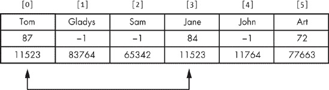

# 第七章. 使用代码复用来解决问题


本章与之前的内容有很大不同。在之前的章节中，我强调了找到自己解决问题的方法的重要性。毕竟，这本书的主题就是：编写原创的编程问题解决方案。即使在之前的章节中，我们也讨论了如何从你之前写过的内容中学习，这就是为什么你应该保留你写的所有代码以供将来参考。在本章中，我们将更进一步，讨论如何使用其他程序员的代码和想法来解决我们的问题。

如果你记得这本书是如何开始的，这个话题可能看起来有些奇怪。一开始，我谈到了试图通过修改别人的代码来解决复杂问题是一个错误。这不仅成功的可能性很低，即使成功了，也不会给你提供任何学习经验。而且，如果你一直这样做，你实际上永远不会成为一个程序员，在软件开发中作用有限。话虽如此，一旦任何编程问题达到一个可尊敬的大小，期望程序员完全从头开始开发解决方案是不合理的。这是对程序员时间的低效利用，并且过于依赖程序员对所有事物的精通。此外，它更有可能导致一个有缺陷的或难以维护的程序。

# 优秀复用与糟糕复用

因此，我们必须区分优秀复用和糟糕复用，优秀复用使我们能够编写更好的程序，更快地编写它们，而糟糕复用可能使我们能够模仿程序员一段时间，但最终会导致代码和程序开发质量低下。表 7-1 总结了这些差异。左列显示了优秀复用的特性，右列显示了糟糕复用的特性。在考虑是否尝试代码复用时，问问自己你更有可能产生左列还是右列的特性。

表 7-1. 优秀与糟糕的代码复用

| 优秀复用 | 糟糕复用 |
| --- | --- |
| 按照蓝图进行 | 复制别人的工作 |
| 放大并扩展你的能力 | 伪造你的能力 |
| 帮助你学习 | 帮助你避免学习 |
| 在短期和长期内节省时间 | 可能短期节省时间但可能延长长期时间 |
| 导致一个可工作的程序 | 可能导致一个无论如何都不工作的程序 |

重要的是要注意，良好重用和不良重用的区别不在于你重用什么样的代码或你如何重用代码，而在于你对所借代码和概念的关系。有一次，在文学课上写学期论文时，我发现我在之前的一门课程中学到的东西与我的论文主题相关，所以我将其包括在内。当我将论文草稿提交给教授时，她告诉我需要为那条信息提供引用。感到沮丧的我问我的教授在什么时候我可以在论文中简单地陈述我的知识而不需要提供参考文献。她的回答是，当我成为别人引用的对象时，我就可以停止为头脑中的东西引用他人。

在编程术语中，当你自己根据阅读某人描述的一般概念编写代码或使用你自己可以编写的代码时，发生良好的重用。在本章中，我们将讨论如何拥有编码概念，以确保你的重用能帮助你成为一个更好的程序员，而不是一个更懒惰的程序员。

让我也提醒大家注意表 7-1 中的最后一行。尝试进行不良重用往往完全失败。这并不令人惊讶，因为它涉及到一个程序员使用他或她实际上并不理解的代码。在某些情况下，借来的代码最初可能能工作，但当程序员试图修改或扩展借来的代码库时，缺乏深入理解排除了有组织方法的可能性。然后程序员只能求助于乱试和试错，从而违反了我们最基本和最重要的通用问题解决规则：始终要有计划。

# 组件基础回顾

既然我们已经知道了我们追求的重用类型，让我们来分类代码可以重用的不同方式。在这本书中，我将使用术语*组件*来指代任何可以被另一个程序员重用来帮助解决编程问题的由一个程序员创建的东西。组件可以存在于从抽象到具体、从想法到完全实现的代码的连续体上的任何地方。如果我们把解决编程问题比作处理一个手艺人项目，我们解决问题的技术就像工具，组件就像专用零件。以下每个组件都是重用程序员先前工作的不同方式。

## 代码块

*代码块*就是那样：从程序列表中复制到另一个程序列表的代码块。更通俗地说，我们会称这为*复制粘贴工作*。这是组件使用的最低形式，通常是不良的重用，并带来所有这些问题。当然，如果你复制的代码是你自己的，实际上并没有造成真正的伤害，除了你可能考虑将现有代码打包成类库或其他结构，以便以更干净、更易于维护的方式重用。

## 算法

*算法*是一种编程配方；它是一种实现目标的具体方法，可以用普通语言或如图形流程图那样直观地表达。例如，在第三章中，我们讨论了数组的*排序*操作和实现这种排序的不同方法。排序数组的一种方法是插入排序算法，我展示了算法的一个示例实现。需要注意的是，给出的代码是插入排序的一个实现，但插入排序本身是算法——即排序数组的方式——而不是特定的代码。插入排序通过重复取数组中下一个未排序的值，并将排序好的值“向上”移动一个位置，直到我们在正确位置为当前插入的值腾出空间。任何使用这种方法对数组进行排序的代码都是插入排序。

算法是高级形式的重用，通常导致良好的重用特性。算法本质上只是想法，而你，作为程序员，必须实现这些想法，调用你的编程技能和对算法本身的深入理解。你将常用到的算法已经被充分研究，在各种情况下都有可预测的性能。有了算法作为蓝图，你可以对代码的正确性和性能有信心。

尽管基于算法编写代码有一些潜在缺点。当你使用算法时，你从概念层面开始。因此，你需要一段很长的路程才能完成该程序部分的代码。算法确实可以节省时间，因为问题解决方面基本上已经完成，但根据算法及其在编程中的特定应用，算法的实现可能并不简单。

## 模式

在编程中，*模式*（或*设计模式*）是特定编程技术的模板。这个概念与算法相关，但可以区分。算法像是解决特定问题的食谱，而模式是在特定编程场景中使用的通用技术。模式解决的问题通常在代码的结构内部。例如，在第六章第六章中，我们讨论了在链表类中递归函数提出的问题：递归函数需要一个指向列表第一个节点的“头”指针作为参数，但该数据需要保持私有。解决方案是创建一个*包装器*，一个将一个参数列表适配到另一个的函数。包装器技术是一种设计模式。我们可以使用这个模式来解决类中递归函数的问题，但它也可以以其他方式使用。例如，假设我们有一个`linkedList`类，它允许在任何位置插入或删除项目，但我们需要的只是一个栈类——即只允许在一边插入和删除的列表。我们可以创建一个新的`stack`类，它有公共方法用于典型的栈操作，如`push`和`pop`。这些方法将只调用我们的`stack`类的私有数据成员`linkedList`对象的成员函数。这样，我们就可以重用链表类的功能，同时提供栈类的接口。

与算法一样，模式是组件使用的高级形式，学习模式是构建你的编程工具箱的绝佳方式。然而，模式也共享一些算法的潜在问题。知道存在一个模式并不意味着你知道如何在为编程解决方案选择的特定语言中实现该模式，并且模式通常很难正确实现或以最佳性能实现。例如，有一个称为*单例*的模式，这是一个只允许创建一个类对象的类。创建一个单例类很简单，但创建一个直到实际需要时才创建一个允许的实例对象的单例类可能会出人意料地困难，而且最佳技术可能因语言而异。

## 抽象数据类型

正如我们在 第五章 中讨论的，*抽象数据类型* 是通过其操作定义的类型，而不是通过这些操作是如何实现的。我们在本书中多次使用的栈类型就是一个很好的例子。抽象数据类型就像模式一样，它们定义了操作的效果，但并不具体定义这些操作是如何实现的。然而，与算法一样，这些操作有众所周知的实现技术。例如，栈可以使用任何数量的底层数据结构来实现，如链表或数组。一旦我们决定使用特定的数据结构，实现决策有时已经确定。假设我们使用链表实现了栈，但无法绕过现有的链表，我们必须编写自己的列表代码。由于栈是后进先出结构，我们只在链表的一端插入和删除项是有意义的。此外，只在列表的前端插入和删除是有意义的。理论上，你可以在末端插入和删除，但这会导致每次插入或删除时对整个列表的低效遍历。为了避免这些遍历，需要一个双链表，并有一个指向列表最后一个节点的单独指针。在列表的开始处插入和删除允许最简单、最有效的实现，因此链表实现的栈几乎都是按照相同的方式进行。

因此，尽管 *抽象数据类型* 中的 *abstract* 意味着类型是概念性的且没有实现细节，但在实践中，当你选择在代码中实现一个抽象数据类型时，你不会从头开始考虑实现。相反，你将会有该类型的现有实现作为指导。

## 库

在编程中，*库* 是一系列相关代码的集合。库通常包括编译后的代码以及所需的源代码声明。库可以包括独立的函数、类、类型声明或代码中可以出现的任何其他内容。在 C++ 中，最明显的例子是标准库。我们在前几章中使用的 `strcmp` 函数来自旧的 C 库 *cstring*，容器类如 `vector` 来自 C++ 标准模板库，甚至我们所有基于指针的代码中使用的 `NULL` 也不是 C++ 语言本身的一部分，而是在库头文件 *stdlib.h* 中定义的。由于库中包含了许多核心功能，因此在现代编程中，库的使用是不可避免的。

通常，库的使用是良好的代码重用。代码被包含在库中，因为它提供了在多种程序中普遍需要的功能——库代码帮助程序员避免“重新发明轮子”。然而，作为正在发展的程序员，当我们使用库代码时，我们必须努力从经验中学习，而不仅仅是走捷径。我们将在本章后面看到这个例子。

注意，虽然许多库是通用目的的，但其他库被设计为*应用程序编程接口（API）*，为高级语言程序员提供了一个简化或更连贯的底层平台视图。例如，Java 语言包括一个名为 JDBC 的 API，它提供了允许程序以标准方式与关系数据库交互的类。另一个例子是 DirectX，它为 Microsoft Windows 游戏程序员提供了丰富的声音和图形功能。在这两种情况下，库在高级程序和基础级硬件和软件之间提供了一个连接——在 JDBC 的情况下是数据库引擎，在 DirectX 的情况下是图形和声音硬件。此外，在这两种情况下，代码重用不仅很好——在所有实际意义上，它是必需的。Java 数据库程序员或为 Windows 编写 C++代码的图形程序员将使用 API——如果不是这些 API，那么就是其他东西，但程序员不会从头开始构建一个新的平台连接。

# 构建组件知识

组件非常有用，程序员尽可能地在可能的情况下使用它们。然而，为了使用组件来帮助解决问题，程序员必须知道它的存在。根据你如何精细地定义它们，可用的组件可能多达数百甚至数千，而初学者程序员将只接触到其中的一小部分。因此，优秀的程序员必须始终不断地将组件知识添加到他们的工具箱中。这种知识积累以两种不同的方式发生：程序员可以明确为学习新组件分配时间，将其作为一个一般任务，或者程序员可以寻找组件来解决特定问题。我们将第一种方法称为*探索性学习*，第二种方法称为*按需学习*。要成为一名程序员，你需要采用这两种方法。一旦你掌握了所选编程语言的语法，发现新的组件就是你作为程序员自我提升的主要方式之一。

## 探索性学习

让我们从探索性学习的例子开始。假设我们想要了解更多关于设计模式的知识。幸运的是，关于哪些设计模式最有用或最常使用，人们普遍达成共识，因此我们可以从任何数量的关于这个主题的资源开始，并且可以相当确信我们没有错过任何重要的内容。通过简单地找到设计模式列表并研究它，我们会受益匪浅，但如果我们实现了其中的一些模式，我们会获得更多的洞察力。

在典型的列表中，我们会发现一种称为 *策略* 或 *策略模式* 的模式。这是允许算法或算法的一部分在运行时被选择的想法。在最纯粹的形式，即策略形式，这种模式允许改变函数或方法的工作方式，但不会改变结果。例如，一个类的方法，它对其数据进行排序，或者涉及排序数据，可能允许选择排序方法（例如快速排序或插入排序）。在任何情况下结果都是相同的——排序后的数据——但允许客户端选择排序方法可能会提供性能优势。例如，客户端可以避免在具有高重复率的数据上使用快速排序。在策略形式中，客户端的选择会影响结果。例如，假设一个类代表一副扑克牌。排序策略可以确定是否将 A 视为高牌（高于国王）或低牌（低于 2）。

### 将学习付诸实践

阅读那一段，你现在知道策略/策略模式是什么，但你还没有将其内化为自己的知识。这就像是浏览五金店的工具和真正购买并使用一个工具之间的区别。所以，让我们把这个设计模式从架子上拿下来，并付诸实践。尝试新技术的最快方式是将它融入到你已经写过的代码中。让我们创建一个问题，这个问题可以用这个模式来解决，并且是基于我们已经写过的代码构建的。

问题：第一位学生

在某所学校，每个班级都有一个指定的“第一位学生”，如果老师必须离开教室，这位学生负责维持课堂秩序。最初，这个头衔是授予成绩最高的学生，但现在一些老师认为第一位学生应该是资历最老的学生，这意味着学生 ID 号码最低，因为它们是按顺序分配的。另一部分老师认为第一位学生的传统很愚蠢，并打算通过简单地选择在字母顺序班级名单中名字排在第一位的学生来抗议。我们的任务是修改学生集合类，添加一个方法来从集合中检索第一位学生，同时满足各个教师群体的选择标准。

如您所见，这个问题将采用策略模式的格式。我们希望返回第一个学生的方法能够根据选定的标准返回不同的学生。为了在 C++中实现这一点，我们将使用函数指针。我们曾在第三章中简要地看到这个概念在`qsort`函数中的应用，该函数接受一个指向比较要排序的数组中两个元素的函数的指针。我们在这里将做类似的事情；我们将有一组比较函数，这些函数接受我们的`studentRecord`对象中的两个，并通过对学生的成绩、ID 号码或姓名进行比较来确定第一个学生是否比第二个学生“更好”。

要开始，我们需要为我们的比较函数定义一个类型：

```
typedef bool (* firstStudentPolicy)(studentRecord r1, studentRecord r2);
```

这个声明创建了一个名为`firstStudentPolicy`的类型，它是一个返回`bool`并接受两个`studentRecord`类型参数的函数指针。`* firstStudentPolicy` 周围的括号是必要的，以防止声明被解释为返回`bool`指针的函数。有了这个声明，我们可以创建我们的三个策略函数：

```
bool higherGrade(studentRecord r1, studentRecord r2) {
   return r1.grade() > r2.grade();
}
bool lowerStudentNumber(studentRecord r1, studentRecord r2) {
   return r1.studentID() < r2.studentID();
}
bool nameComesFirst(studentRecord r1, studentRecord r2) {
   return strcmp(r1.name().c_str(), r2.name().c_str())
 < 0;
}
```

前两个函数非常简单：`higherGrade`在第一个记录的成绩更高时返回`true`，而`lowerStudent` number 在第一个记录的学生号码更小时返回`true`。第三个函数`nameComesFirst`基本上是相同的，但它需要`strcmp` 库函数，该函数期望两个“C 风格”字符串——即空终止的字符数组而不是`string`对象。因此，我们必须在两个学生记录的`name`字符串上调用`c_str()`方法。`strcmp`函数在第一个字符串在字母顺序上位于第二个字符串之前时返回一个负数，因此我们检查返回值是否小于零 。现在我们准备好修改`studentCollection`类本身：

```
class studentCollection {
private:
   struct studentNode {
      studentRecord studentData;
      studentNode * next;
   };
public:
   studentCollection();
   ˜studentCollection();
   studentCollection(const studentCollection &copy);
   studentCollection& operator=(const studentCollection &rhs);
   void addRecord(studentRecord newStudent);
   studentRecord recordWithNumber(int IDnum);
   void removeRecord(int IDnum);
 void setFirstStudentPolicy(firstStudentPolicy f);
 studentRecord firstStudent();
private:
 firstStudentPolicy _currentPolicy;
   typedef studentNode * studentList;
   studentList _listHead;
   void deleteList(studentList &listPtr);
   studentList copiedList(const studentList copy);
};
```

这是我们在第五章中看到的类声明，新增了三个成员：一个私有数据成员`_currentPolicy` ，用于存储指向我们的策略函数之一；一个`setFirstStudentPolicy` 方法来更改此策略；以及`firstStudent`方法本身 ，该方法将根据当前策略返回第一个学生。`setFirstStudentPolicy`的代码很简单：

```
void studentCollection::setFirstStudentPolicy(firstStudentPolicy f) {
   _currentPolicy = f;
}
```

我们还需要修改默认构造函数以初始化当前策略：

```
studentCollection::studentCollection() {
   _listHead = NULL;
   _currentPolicy = NULL;
}
```

现在我们准备好编写`firstStudent`：

```
studentRecord studentCollection::firstStudent() {
 if (_listHead == NULL || _currentPolicy == NULL) {
      studentRecord dummyRecord(−1, −1, "");
      return dummyRecord;
   }
   studentNode * loopPtr = _listHead;
 studentRecord first = loopPtr->studentData;
 loopPtr = loopPtr->next;
   while (loopPtr != NULL) {
      if (_currentPolicy(loopPtr->studentData, first)) {
         first = loopPtr->studentData;
      }
    loopPtr = loopPtr->next;
   }
   return first;
}
```

该方法首先检查特殊情况。如果没有要审查的列表或没有实施的政策 ![http://atomoreilly.com/source/no_starch_images/1273182.png]，我们返回一个虚拟记录。否则，我们遍历列表以找到最符合当前政策的学生的记录，使用我们在本书中一直使用的基本搜索技术。我们将列表开头的记录分配给 `first` ![http://atomoreilly.com/source/no_starch_images/1273191.png]，将循环变量从列表中的第二个记录开始 ![http://atomoreilly.com/source/no_starch_images/1273193.png]，并开始遍历。在遍历循环内部，对当前政策函数的调用 ![http://atomoreilly.com/source/no_starch_images/1273195.png] 告诉我们，我们目前正在查看的学生是否根据当前标准“优于”我们迄今为止找到的最佳学生。当循环结束时，我们返回“第一个学生” ![http://atomoreilly.com/source/no_starch_images/1273197.png]。

### 首个学生解决方案分析

使用策略/政策模式解决问题后，我们更有可能识别出可以使用该技术的情况，而不是如果我们只是阅读过一次该技术却从未使用过。我们还可以分析我们的样本问题，开始形成自己对技术价值的看法，包括何时可以正确使用，何时可能是一个错误，或者至少比它值得的麻烦更多。你可能对这个特定模式的一个想法是，它削弱了封装和信息隐藏。例如，如果客户端代码提供政策函数，它需要访问通常保留在类内部的数据类型，在这种情况下，是 `studentRecord` 类型。（我们将在练习中考虑解决这个问题。）这意味着如果修改该类型，客户端代码可能会出错，我们必须在应用该模式到其他项目之前权衡这种担忧与模式的好处。在前面的章节中，我们讨论了知道何时使用一种技术——或者何时不使用它——与知道如何使用它一样重要。通过检查自己的代码，你可以深入了解这个关键问题。

为了进一步练习，你可以回顾你完成的项目的库，寻找可以使用此技术重构的代码。记住，许多“现实世界”的编程涉及补充或修改现有的代码库，因此这除了提高你对特定组件的技能外，也是这种修改的极好实践。此外，良好的代码重用的一个好处是我们从中学习，这种实践最大化了学习。

## 需求驱动学习

前一节描述了我们可能称之为“漫步式学习”的内容。虽然这样的旅程对程序员来说很有价值，但还有其他时候我们必须朝着特定的目标前进。如果你正在解决某个特定的问题，尤其是如果你面临任何形式的截止日期，并且你认为某个组件可能对你非常有帮助，你不想在编程的世界中随机漫步并希望偶然发现你需要的东西。相反，你希望尽快找到直接适用于你情况的组件或组件。这听起来非常棘手——当你不知道你具体在找什么时，你怎么能找到你需要的东西呢？考虑以下示例问题：

问题：高效遍历

一个编程项目将使用你的 `studentCollection` 类。客户端代码需要能够遍历集合中的所有学生。显然，为了保持信息隐藏，客户端代码不能直接访问列表，但有一个要求，遍历必须是高效的。

因为描述中的关键词是 *高效*，让我们来精确地说明这个案例中这意味着什么。假设我们的 `studentCollection` 类的一个特定对象有 100 名学生。如果我们能直接访问链表，我们可以编写一个循环来遍历列表，循环 100 次。这是任何列表遍历可能达到的最高效率。任何需要我们循环超过 100 次来确定结果的解决方案都是低效的。

如果没有对效率的要求，我们可能会通过在我们的类中添加一个简单的 `recordAt` 方法来尝试解决这个问题，该方法将返回集合中特定位置的学生记录，第一个记录编号为 1：

```
studentRecord studentCollection::recordAt(int position) {
   studentNode * loopPtr = _listHead;
   int i = 1;
 while (loopPtr != NULL && i < position) {
      i++;
      loopPtr = loopPtr->next;
   }
   if (loopPtr == NULL) {
    studentRecord dummyRecord(−1, −1, "");
      return dummyRecord;
   } else {
    return loopPtr->studentData;
   }
}
```

在这种方法中，我们使用循环  遍历列表，直到我们达到期望的位置或达到列表的末尾。在循环结束时，如果达到列表的末尾，我们创建并返回一个虚拟记录 ，或者返回指定位置的记录 。问题是，我们仅仅为了找到一条学生记录而进行遍历。这并不一定是一个完整的遍历，因为我们会在达到期望位置时停止，但无论如何它仍然是一个遍历。假设客户端代码正在尝试计算学生成绩的平均值：

```
int gradeTotal = 0;
for (int recNum = 1; recNum <= numRecords; recNum++) {
   studentRecord temp = sc.recordAt(recNum);
   gradeTotal += temp.grade();
}
double average = (double) gradeTotal / numRecords;
```

对于这段代码，假设`sc`是一个先前声明并填充的`studentCollection`，`recNum`是一个存储记录数的`int`。假设`recNum`是 100。如果你只是浏览这段代码，可能会觉得计算平均值只需要通过循环 100 次，但由于每次调用`recordAt`本身就是一个部分列表遍历，这段代码涉及 100 次遍历，每次遍历在平均情况下都会循环大约 50 次。所以，而不是 100 步，这将很高效，这可能会需要大约 5,000 步，这非常低效。

### 何时寻找组件

我们现在已经到达了真正的问题。提供客户端对集合成员的访问以进行遍历是容易的；提供这种高效访问则不是。当然，我们可以尝试仅使用我们自己的问题解决能力来解决这个问题，但如果我们能使用组件，我们会更快地找到解决方案。找到可以协助我们解决方案的先前未知的组件的第一步是假设这样的组件确实存在。换句话说，除非你开始寻找，否则你不会找到组件。因此，为了最大限度地发挥组件的益处，你需要留意它们可能有所帮助的情况。当你发现自己卡在问题的某个方面时，尝试以下方法：

1.  以通用方式重新表述问题。

1.  问问自己：这可能是常见问题吗？

第一步很重要，因为如果我们把问题表述为“允许客户端代码高效地计算封装在类中的记录链表的平均学生成绩”，它听起来像是特定于我们的情况。然而，如果我们把问题表述为“允许客户端代码高效地遍历链表而不提供对列表指针的直接访问”，那么我们开始理解这可能是常见问题。当然，我们可能会问自己，既然程序经常在类中存储链表和其他顺序访问的结构，其他程序员肯定已经找到了允许高效访问结构中每个元素的方法？

### 寻找组件

既然我们已经同意寻找组件，现在是时候找到我们的组件了。为了使事情更清晰，让我们将原始的编程问题重新表述为一个研究问题：“找到一个我们可以使用的组件，以修改我们的`studentCollection`类，允许客户端代码高效地遍历内部列表。”我们如何解决这个问题？我们可以从查看任何我们的组件类型开始：模式、算法、抽象数据类型或库。

假设我们从查看标准 C++ 库开始。我们不一定是在寻找一个可以“插入”到我们的解决方案中的类，而是我们可以挖掘一个类似于我们的 `studentCollection` 类的库类，从中获取灵感。这采用了我们用来解决编程问题的类比策略。如果我们找到一个具有类似问题的类，我们可以借鉴其类似解决方案。我们之前对 C++ 库的了解使我们接触到了其容器类，例如 `vector`，我们应该寻找最像我们的学生集合类的容器类。如果我们去查阅一个喜欢的 C++ 参考书，无论是书籍还是网络上的网站，并回顾 C++ 容器类，我们会看到有一个名为“序列容器”的 `list` 类符合要求。`list` 类是否允许客户端代码高效遍历？是的，它使用一个称为 *迭代器* 的对象来实现。我们看到列表类提供了 `begin` 和 `end` 方法，这些方法生成迭代器，这些迭代器可以引用列表中的特定项，并通过递增来使迭代器引用列表中的下一个对象。如果 `integerList` 是一个 `list<int>`，其中填充了整数，并且 `iter` 是一个 `list<int>::iterator`，那么我们可以使用以下方式显示列表中的所有整数：

```
iter = intList.begin();
while (iter != intList.end()) {
   cout << *iter << "\n";
   iter++;
}
```

通过使用迭代器，`list` 类解决了为客户端提供一个机制以高效遍历列表的问题。在这个时候，我们可能会想到将 `list` 类本身放入我们的 `studentCollection` 类中，以替换我们自建的链表。然后我们可以为我们的类创建 `begin` 和 `end` 方法，这些方法将包装嵌入列表对象中的相同方法，问题就会得到解决。然而，这直接遇到了好与坏的重用问题。一旦我们完全理解了迭代器概念，并且能够在自己的代码中自行实现它，将标准模板库中的现有类插入到我们的代码中将成为一个好的选择——也许是最好的选择。如果我们做不到这一点，使用 `list` 类就变成了一种捷径，这并不能帮助我们作为程序员成长。当然，有时我们必须利用我们无法复制的组件，但如果我们养成依赖其他程序员解决问题的习惯，我们就有可能永远无法成为问题解决者。

那么，让我们自己实现迭代器。不过，在我们这样做之前，让我们简要地看看我们可能到达同一位置的其他方法。我们开始是在标准模板库中搜索，但我们也可以从其他地方开始。例如，我们可以搜索常见设计模式列表。在“行为模式”标题下，我们会找到*迭代器*模式，其中客户端可以按顺序访问一组项目，而不暴露集合的底层结构。这正是我们所需要的，但我们只能通过搜索模式列表或从之前对模式的调查中记住它才能找到。我们本可以从抽象数据类型开始搜索，因为通常的*列表*，尤其是*链表*，是常见的抽象数据类型。然而，许多关于列表抽象数据类型的讨论和实现都没有将客户端列表遍历视为基本操作，因此迭代器概念从未出现。最后，如果我们从算法领域开始搜索，我们不太可能找到任何有用的东西。算法通常描述的是棘手的代码，而创建迭代器的代码相当简单，正如我们很快就会看到的。在这种情况下，那么，类库是我们到达目的地的最快途径，其次是模式。然而，作为一个一般规则，在搜索有用的组件时，你必须考虑所有组件类型。

### 应用组件

我们现在知道我们将为我们的`studentCollection`类制作一个迭代器，但所有`list`标准库类向我们展示的只是迭代器方法的外部工作方式。如果我们卡在实现上，我们可能会考虑回顾`list`及其祖先类的源代码，但鉴于阅读大量不熟悉的代码的难度，这是一个最后的手段。相反，让我们只通过思考来解决这个问题。使用之前的代码示例作为指南，我们可以这样说，迭代器由四个核心操作定义：

1.  集合类中的一个方法，它提供了一个引用集合中第一个项目的迭代器。在`list`类中，这个方法是`begin`。

1.  一种测试迭代器是否已前进到集合中最后一个项目的机制。在上一个示例中，这是`list`类中一个名为`end`的方法，它产生一个特殊的迭代器对象进行测试。

1.  迭代器类中的一个方法，它将迭代器移动到引用集合中的下一个项目。在上一个示例中，这是重载的`++`运算符。

1.  迭代器类中的一个方法，它返回集合中当前引用的项目。在上一个示例中，这是`list`类中重载的`*`（前缀）运算符。

在编写代码方面，这里看起来没有什么困难。这只是把所有东西放在正确的位置的问题。所以，让我们开始吧。根据上面的描述，我们的迭代器，我们将称之为`scIterator`，需要存储对`studentCollection`中一个项目的引用，并且需要能够前进到下一个项目。因此，我们的迭代器应该存储一个指向`studentNode`的指针。这将允许它返回包含在内的`studentRecord`，以及前进到下一个`studentNode`。因此，迭代器类的私有部分将包含以下数据成员：

```
studentCollection::studentNode * current;
```

立刻，我们遇到了一个问题。`studentNode`类型是在`studentCollection`的私有部分声明的，因此上面的行不会工作。我们的第一个想法可能是`studentNode`不应该被声明为私有，但这不是正确的答案。节点类型本质上是私有的，因为我们不希望随机的客户端代码依赖于节点类型的特定实现，从而创建在修改我们的类时可能会损坏的代码。尽管如此，我们仍然需要允许`scIterator`访问我们的私有类型。我们通过`friend`声明来实现这一点。在`studentCollection`的公共部分，我们添加：

```
friend class scIterator;
```

现在`scIterator`可以访问`studentCollection`中的私有声明，包括`studentNode`的声明。我们还可以声明一些构造函数：

```
scIterator::scIterator() {
   current = NULL;
}
scIterator::scIterator(studentCollection::studentNode * initial) {
   current = initial;
}
```

让我们暂时跳转到`studentCollection`，并编写我们的`*begin*`方法——一个返回引用我们集合中第一个项目的迭代器的`begin`方法。按照我在本书中使用的命名方案，这个方法应该有一个名词作为名称，例如`firstItemIterator`：

```
scIterator studentCollection::firstItemIterator() {
   return scIterator(_listHead);
}
```

如您所见，我们在这里需要做的只是将链表的头指针放入一个`scIterator`对象中，并返回它。如果您像我一样，看到指针在这里飞来飞去可能会让您有些紧张，但请注意，`scIterator`只是会保留对`studentCollection`列表中一个项目的引用。它不会分配任何自己的内存，因此我们不需要担心深度复制和重载赋值运算符。

让我们回到`scIterator`并编写我们的其他方法。我们需要一个方法来将迭代器前进到下一个项目，以及一个方法来确定我们是否已经超过了集合的末尾。我们应该同时考虑这两个问题。在前进迭代器时，我们需要知道迭代器在通过列表中的最后一个节点时应该具有什么值。如果我们不进行特殊处理，迭代器会自然地得到`NULL`的值，所以这将是 easiest value to use。请注意，我们在默认构造函数中已经初始化了我们的迭代器为`NULL`，所以当我们使用`NULL`来表示超出末尾时，我们失去了这两种状态之间的任何区别，但就当前问题而言，这不是问题。方法的代码如下：

```
 void scIterator::advance() {
   if (current != NULL)
       current = current->next;
  }
   bool scIterator::pastEnd() {
     return current == NULL;
  }
```

记住，我们只是使用迭代器概念来解决原始问题。我们并不是试图复制 C++标准模板库迭代器的确切规范，因此我们不需要使用相同的接口。在这种情况下，我并没有重载`++`运算符，而是有一个名为`advance`的方法 ，它在将指针向前移动到下一个节点之前会检查`current`指针是否为`NULL` 。同样，我发现需要创建一个特殊的“结束”迭代器来进行比较很麻烦，所以我只提供了一个名为`pastEnd`的`bool`方法 ，它用来确定我们是否已经用完了节点。

最后，我们需要一种方法来获取当前引用的`studentRecord`对象：

```
studentRecord scIterator::student() {
 if (current == NULL) {
      studentRecord dummyRecord(−1, −1, "");
      return dummyRecord;
 } else {
      return current->studentData;
   }
}
```

如我们之前所做的那样，为了安全起见，如果我们的指针是`NULL`，我们将创建并返回一个虚拟记录 。否则，我们返回当前引用的记录 。这样，我们就完成了`studentCollection`类中迭代器概念的实现。为了清晰起见，以下是`scIterator`类的完整声明：

```
class scIterator {
public:
   scIterator();
   scIterator(studentCollection::studentNode * initial);
   void advance();
   bool pastEnd();
   studentRecord student();
private:
   studentCollection::studentNode * current;
};
```

代码全部就绪后，我们可以通过一个样本遍历来测试我们的代码。让我们实现平均成绩计算以供比较：

```
scIterator iter;
  int gradeTotal = 0;
  int numRecords = 0;
 iter = sc.firstItemIterator();
 while (!iter.pastEnd()) {
     numRecords++;
   gradeTotal += iter.student().grade();
   iter.advance();
  }
  double average = (double) gradeTotal / numRecords;
```

这个列表使用了我们所有的迭代器相关方法，因此它是我们代码的一个很好的测试。我们调用`firstItemIterator`来初始化我们的`scIterator`对象 。我们调用`pastEnd`作为我们的循环终止测试 。我们调用迭代器对象的`student`方法来获取当前的`studentRecord`，以便我们可以提取成绩 。最后，为了将迭代器移动到下一个记录，我们调用`advance`方法 。当这段代码正常工作时，我们可以合理地确信我们已经正确实现了各种方法，而且不仅如此，我们对迭代器概念有了深入的理解。

### 高效遍历解决方案分析

和之前一样，仅仅因为代码能工作并不意味着从这次事件中学习的潜力已经结束。我们应该仔细考虑我们所做的事情，它的积极和消极影响，并思考我们对刚刚实施的基本想法的扩展。在这种情况下，我们可以这样说，迭代器概念确实解决了我们集合客户端遍历效率低下的原始问题，一旦实现，迭代器的使用既优雅又易于阅读。然而，不可否认的是，基于`recordAt`方法的低效方法写起来要容易得多。在决定迭代器的实现是否对特定情况有价值时，我们必须问自己遍历会发生的频率，列表中通常有多少项，等等。如果遍历不频繁且列表较小，低效可能并不重要，但如果我们预计列表会变得很大或者不能保证它不会变大，那么迭代器可能就是必需的。

当然，如果我们决定使用标准模板库中的`list`对象，我们就不再需要担心实现迭代器的难度，因为我们自己不再需要去实现它。下次遇到类似的情况，我们可以使用`list`类，而不用担心自己占了便宜或者给自己以后带来困难，因为我们已经对列表和迭代器进行了深入的研究，以至于我们理解了幕后必须发生的事情，即使我们从未审查过实际的源代码。

进一步思考，我们可以考虑迭代器的更广泛应用及其可能的局限性。例如，假设我们需要一个迭代器，它不仅能够高效地移动到`studentCollection`中的下一个项目，还能移动到上一个项目。现在我们知道了迭代器的工作原理，我们可以看到，使用我们当前的`studentCollection`实现，实际上根本无法做到这一点。如果迭代器维护到列表中特定节点的链接，那么移动到下一个节点只需跟随节点中的链接。然而，退回到前一个节点则需要再次遍历列表到那个点。相反，我们需要一个双向链表，其中节点在两个方向上都有指针，指向下一个节点和前一个节点。我们可以将这种想法推广，并开始考虑不同的数据结构以及可以高效提供给客户端的遍历或数据访问类型。例如，在前一章关于递归的章节中，我们简要遇到了二叉树结构。是否有某种方法允许以标准形式高效地遍历这种结构？如果没有，我们该如何修改它以允许高效的反转？二叉树中节点的遍历顺序是什么？思考这些问题有助于我们成为更好的程序员。我们不仅会教授自己新技能，还会更多地了解不同组件的优缺点。了解组件的优缺点将使我们能够明智地使用它们。未能考虑特定方法的局限性可能导致死胡同，而我们了解的组件越多，这种情况发生的可能性就越小。

# 选择组件类型

正如我们在这些例子中所看到的，同一个问题可以使用不同类型的组件来解决。一个模式可能表达了解决方案的想法，一个算法可能概述了这个想法或另一个将解决相同问题的实现，一个抽象数据类型可能封装了这个概念，而库中的一个类可能包含了这个抽象数据类型的完全测试过的实现。如果这些每个都是我们需要解决我们问题的相同概念的表述，我们如何知道从我们的工具箱中拉出哪种组件类型？

一个主要的考虑因素是整合组件到我们的解决方案可能需要多少工作量。将类库链接到我们的代码通常是一个快速解决问题的方法，而将伪代码描述的算法实现可能需要花费大量时间。另一个重要的考虑因素是提议的组件提供的灵活性有多大。通常，组件会以一个很好的、预先包装的形式出现，但当它集成到项目中时，程序员会发现，尽管组件已经完成了他或她需要的多数功能，但它并没有做到一切。例如，可能某个方法的返回值格式不正确，需要额外的处理。如果仍然使用该组件，可能会在组件最终被完全丢弃并从头开始开发该部分问题的代码之前，发现更多的问题。如果程序员选择了一个更高概念层次的组件，比如一个模式，那么生成的代码实现将完美地适应问题，因为它是为了那个特定问题而创建的。

图 7-1 总结了这两个因素之间的相互作用。一般来说，库中的代码可以直接使用，但不能直接修改。它只能通过使用 C++模板或如果相关代码实现了我们本章前面看到的类似*策略*模式的方式进行间接修改。在另一端，一个模式可能仅仅是一个想法（“只能有一个实例的类”），提供最大的实现灵活性，但需要程序员做大量的工作。

当然，这只是一个一般性指南，具体情况会有所不同。也许我们从库中使用的类在我们的程序中处于一个非常低级的层次，这样灵活性就不会受到影响。例如，我们可能在我们自己设计的集合类周围包装一个基本的容器类，如`list`，它具有足够的能力，即使我们必须扩展容器类功能，我们也可以期待`list`类能够处理它。在使用模式之前，也许我们之前已经实现了一个特定的模式，所以我们不是在创建新的代码，而是在适应之前编写的代码。


图 7-1. 组件类型的工作需求与灵活性对比

你使用组件的经验越多，你就越有信心认为你从正确的起点开始。在你积累经验之前，你可以将灵活性与工作需求之间的权衡作为一个粗略的指南。对于每种具体情况，你可以问自己以下问题：

+   我可以直接使用这个组件，还是需要额外的代码将其集成到我的项目中？

+   我是否确信我理解了问题的全部范围，或者与这个组件相关的那部分，并且它将来不会改变？

+   选择这个组件是否会增加我的编程知识？

你对这些问题的回答将帮助你估计涉及的工作量以及从每个可能的方法中获得的收益。

## 组件选择在行动

既然我们已经理解了总体思路，让我们快速通过一个例子来展示具体细节。

问题：部分排序，部分保持原样

一个项目要求你根据成绩对`studentRecord`对象数组进行排序，但有一个特殊情况。程序的其他部分正在使用特殊的成绩值-1 来表示无法移动的学生记录。因此，尽管所有其他记录都必须移动，但带有-1 成绩的记录应该保持原位，结果是一个除了-1 成绩穿插其中的数组。

这是一个棘手的问题，我们有很多方法可以尝试解决它。为了简化问题，让我们将选择减少到两种：要么我们选择一个算法——即像插入排序这样的排序例程——并修改它以忽略带有-1 成绩的`studentRecord`对象，要么我们找出一种方法来使用`qsort`库例程解决这个问题。这两种选择都是可能的。因为我们熟悉插入排序的代码，所以加入一些`if`语句来显式检查并跳过带有-1 成绩的记录应该不会太难。让`qsort`为我们做这项工作需要一些变通。我们可以将带有真实成绩的学生记录复制到一个单独的数组中，使用`qsort`对其进行排序，然后再复制回来，确保不复制任何带有-1 成绩的记录。

让我们通过这两种选项来了解组件类型的选择如何影响生成的代码。我们将从算法组件开始，编写我们自己的修改过的插入排序来解决该问题。像往常一样，我们将分阶段解决这个问题。首先，让我们通过移除整个-1 成绩问题来简化问题，只对没有任何特殊规则的`studentRecord`对象数组进行排序。如果`sra`是一个包含`arraysize`个`studentRecord`类型对象的数组，生成的代码如下：

```
int start = 0;
int end = arraySize - 1;
for (int i = start + 1; i <= end; i++) {
   for (int j = i; j > start && sra[j-1].grade() > sra[j].grade(); j--) {
    studentRecord temp = sra[j-1];
      sra[j-1] = sra[j];
      sra[j] = temp;
   }
}
```

这段代码与整数插入排序非常相似。唯一的区别是，比较需要调用 `grade` 方法 ，而我们用于交换空间的临时对象类型已经改变 。这段代码运行良好，但有一个需要注意的地方：在测试本节中接下来的代码块时：我们的 `studentRecord` 类验证数据，并且如前所述，它不会接受 `-1` 分数，所以请确保进行必要的更改。现在我们准备完成这个解决方案的版本。我们需要插入排序忽略带有 `-1` 分数的记录。这不像听起来那么简单。在基本的插入排序算法中，我们总是在数组中交换相邻的位置，如上面的代码中的 `j` 和 `j - 1`。如果我们保留带有 `-1` 分数的记录不变，那么下一个要交换的记录的位置可能相隔任意距离。

图 7-2 通过一个示例说明了这个问题。如果这显示了数组的原始配置，那么箭头指示了第一个要交换的记录的位置，它们不是相邻的。此外，最终最后一个记录（对于 Art）将不得不从位置 `[5]` 交换到 `[3]`，然后从 `[3]` 交换到 `[0]`，所以对排序这个数组（就像我们正在排序它一样）所需的所有交换都涉及非相邻的记录。



图 7-2. 修改后的插入排序中要交换的记录之间的任意距离

在考虑如何解决这个问题时，我寻找了一个类比，并在链表的处理中找到了一个。在许多链表算法中，我们不仅要维护我们列表遍历中的当前节点指针，还要维护前一个节点的指针。因此，在循环体结束时，我们通常在前进当前指针之前将当前指针赋值给前一个指针。这里也需要做类似的事情。我们需要在通过数组线性前进以找到下一个“真实”记录的过程中跟踪最后一个“真实”学生记录。将这个想法付诸实践，结果如下代码：

```
for (int i = start + 1; i <= end; i++) {
 if (sra[i].grade() != −1) {
    int rightswap = i;
      for (int leftswap = i - 1;
         leftswap >= start
         && (sra[leftswap].grade() > sra[rightswap].grade()
          || sra[leftswap].grade() == −1);
         leftswap--)
      {
       if(sra[leftswap].grade() != −1) {
            studentRecord temp = sra[leftswap];
            sra[leftswap] = sra[rightswap];
            sra[rightswap] = temp;
          rightswap = leftswap;
         }
      }
   }
}
```

在基本的插入排序算法中，我们反复将未排序的项目插入到数组中不断增长的已排序区域。外循环选择下一个要按顺序放置的未排序项目。在这个版本的代码中，我们首先检查外循环体内位置`i`的等级是否不是-1 。如果是，我们将直接跳到下一个记录，保留这个记录的位置。一旦我们确定位置`i`的学生记录可以移动，我们就将`rightswap`初始化为这个位置 ![http://atomoreilly.com/source/no_starch_images/1273191.png]。然后我们开始内循环。在基本的插入排序算法中，内循环的每次迭代都会将一个项目与其邻居交换。在我们的版本中，由于我们保留带有-1 等级的记录，我们只有在位置`j`不包含-1 等级时才进行交换 ![http://atomoreilly.com/source/no_starch_images/1273195.png]。然后我们在`leftswap`和`rightswap`之间进行交换，并将`leftswap`赋值给`rightswap` ![http://atomoreilly.com/source/no_starch_images/1273197.png]，为内循环中的下一次交换设置条件。最后，我们必须修改我们的内循环条件。通常，插入排序的内循环会在我们到达数组的开头或找到小于我们要插入的值的值时停止。在这里，我们必须使用逻辑*或*来创建一个复合条件，以便循环可以越过-1 等级 ![http://atomoreilly.com/source/no_starch_images/1273193.png]（因为-1 将小于任何合法等级，从而提前停止循环）。

这段代码解决了我们的问题，但它可能散发出一些“坏味道”。标准的插入排序代码易于阅读，特别是如果你理解它所做的大致内容，但这个修改版本对眼睛来说很累，如果我们想以后理解它，可能需要一些注释行。也许需要进行重构，但让我们尝试解决这个问题的另一种方法，看看它读起来如何。

我们首先需要为`qsort`使用一个比较函数。在这种情况下，我们将比较两个`studentRecord`对象，我们的函数将从一个等级中减去另一个等级：

```
int compareStudentRecord(const void * voidA, const void * voidB) {
   studentRecord * recordA = (studentRecord *) voidA;
   studentRecord * recordB = (studentRecord *) voidB;
   return recordA->grade() - recordB->grade();
}
```

现在我们已经准备好对记录进行排序。我们将分三个阶段来完成这项工作。首先，我们将所有没有-1 等级的记录复制到一个二级数组中，不留任何空隙。然后，我们将调用`qsort`来对二级数组进行排序。最后，我们将从二级数组中复制记录回原始数组，跳过带有-1 等级的记录。生成的代码如下：

```
 studentRecord sortArray[arraySize];
 int sortArrayCount = 0;
  for (int i = 0; i < arraySize; i++) {
   if (sra[i].grade() != −1) {
        sortArray[sortArrayCount] = sra[i];
        sortArrayCount++;
     }
  }
 qsort(sortArray,
 sortArrayCount, sizeof(studentRecord), compareStudentRecord);
 sortArrayCount = 0;
 for (int i = 0; i < arraySize; i++) {
   if (sra[i].grade() != −1) {
        sra[i] = sortArray[sortArrayCount];
        sortArrayCount++;
     }
  }
```

虽然这段代码的长度与其他解决方案大致相同，但它更直接，更容易阅读。我们首先声明一个与原始数组大小相同的辅助数组`sortArray` ![http://atomoreilly.com/source/no_starch_images/1273182.png]，变量`sortArrayCount`初始化为 0 ![http://atomoreilly.com/source/no_starch_images/1273191.png]；在第一个循环中，我们将使用它来跟踪我们复制到辅助数组中的记录数量。在循环内部，每次我们遇到没有-1 成绩的记录 ![http://atomoreilly.com/source/no_starch_images/1273193.png]，我们就将它分配给`sortArray`中的下一个可用槽位，并增加`sortArrayCount`。当循环结束时，我们排序辅助数组 ![http://atomoreilly.com/source/no_starch_images/1273195.png]。变量`sortArrayCount`重置为 0 ![http://atomoreilly.com/source/no_starch_images/1273197.png]；我们将在第二个循环中使用它来跟踪我们从辅助数组复制回原始数组的记录数量。请注意，第二个循环遍历的是*原始*数组 ![http://atomoreilly.com/source/no_starch_images/1273199.png]，寻找需要填充的槽位 ![http://atomoreilly.com/source/no_starch_images/1273203.png]。如果我们以另一种方式来做，尝试遍历辅助数组并将记录推送到原始数组，我们就需要一个双重循环，内循环在原始数组中搜索下一个真实成绩的槽位。这是另一个例子，说明了问题可以根据我们对它的概念化变得简单或困难。

## 比较结果

两种解决方案都可行，并且是合理的途径。对于大多数程序员来说，第一种解决方案，即我们在排序时修改插入排序以保留一些记录在原位，更难编写和阅读。然而，第二种解决方案似乎引入了一些低效性，因为它需要将数据复制到辅助数组并再次复制回来。这就是一点算法分析知识派上用场的地方。假设我们正在排序 10,000 条记录——如果我们排序的记录很少，我们实际上不会关心效率。我们无法确定`qsort`调用背后的算法是什么，但通用排序的最坏情况可能需要 10 亿条记录交换，而最佳情况大约是 130,000 条。无论我们最终落在哪个范围内，与排序相比，复制 10,000 条记录来来回回不会是一个主要的性能瓶颈。此外，我们必须考虑`qsort`使用的算法可能比我们简单的插入排序更高效，从而抵消了我们可能从避免将数据复制到辅助数组中获得的任何好处。

因此，在这种情况下，第二种方法，使用`qsort`，似乎更胜一筹。它更容易实现，更容易阅读，因此更容易维护，我们预计其性能将与第一种解决方案相当，甚至可能更好。我们可以说第一种方法最好的地方可能就是我们可能已经学到了可以应用于其他问题的技能，而第二种方法，由于其简单性，没有提供这样的见解。一般来说，当你处于试图最大化学习效果的编程阶段时，你应该优先考虑高级组件，如算法和模式。当你处于试图最大化编程效率的阶段（或面临硬性截止日期）时，你应该优先考虑低级组件，并在可能的情况下选择预构建的代码。当然，如果时间允许，尝试几种不同的方法，就像我们在这里所做的那样，可以提供最好的结果。

# 练习

尽可能多地尝试不同的组件。一旦你掌握了如何学习新的组件，你的编程能力将开始迅速增长。

1.  对*策略/策略*模式的一个常见批评是它要求暴露类的某些内部信息，例如类型。修改本章前面提到的“第一个学生”程序，使得策略函数都存储在类中，并且通过传递一个代码值（例如，一个新枚举类型的值）来选择，而不是传递策略函数本身。

1.  将第四章（第四章`，然后稍后`sr1.retrieveField("Title")`将返回“Problems of Unconditional Branching。”

1.  设计自己的：选择一个你已经解决的问题，并使用不同的组件再次解决它。记住，将结果与你的原始解决方案进行比较分析。
