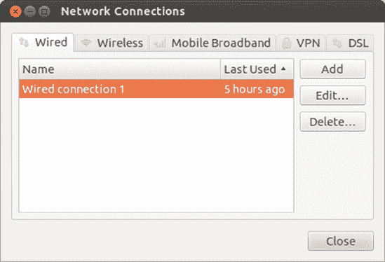
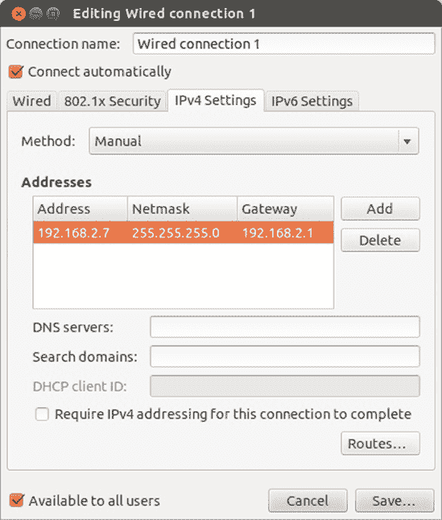
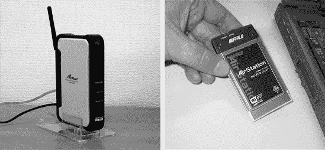
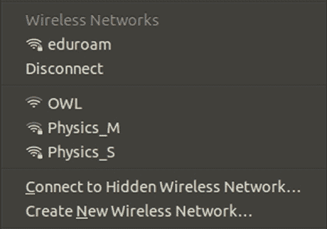
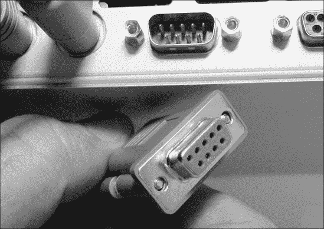

# 第四章. 超越网络脚

### 连接到互联网

这些日子里，普通家庭电脑用户花在上网和写电子邮件上的时间比做其他任何事情都要多。即使你不是个很好的冲浪者，许多实际上并不是真正的互联网应用的应用程序仍然以某种方式使用互联网，比如当你将音频 CD 抓取成 MP3 文件时收集歌曲和专辑信息。拥有一台未连接到互联网的电脑就像买了一辆新的玛莎拉蒂然后拒绝将它开出车库一样。

当然，你如何连接到互联网取决于你的硬件和提供商。有多种可能性，包括高速局域网（LAN）、电缆调制解调器、移动（3G/4G）宽带以及来自电话公司的 ADSL 连接。一些电脑仍然内置了 56 Kbps 的调制解调器，或者可以通过外部拨号调制解调器连接到普通电话线上的较慢连接。根据你所拥有的设备，在 LAN 连接和其他使用以太网端口（如电缆调制解调器）的连接类型中，设置系统应该很容易，而在无线和移动连接的情况下可能需要更多的工作，而在拨号连接时有时会有些挑战。在本章中，你将学习如何设置这些连接，在下一章中，你将了解 Linux 在提供最常用的互联网应用方面能提供什么。

# 你如何连接？

你设置连接的方式实际上取决于你试图如何连接到互联网。

+   如果你使用以太网线将电脑连接到墙壁插座、路由器或电缆调制解调器，请转到设置有线连接，在设置有线连接部分。

+   如果你通过无线网络或你自己的无线路由器连接，请转到设置无线连接，在设置无线连接部分。

+   如果你的电脑内置了 ADSL 或 DSL 调制解调器，或者它连接到了 USB 端口，请尝试阅读使用 DSL 或 ADSL 调制解调器连接，在关闭或刷新无线连接部分。

+   如果您使用连接到电话线的拨号调制解调器进行连接，请参阅设置拨号连接。

+   如果您使用连接到计算机的移动（3G/4G）宽带连接，请转到移动宽带连接。

无论哪种方法适用于您，几乎可以肯定的是，您将使用一个名为网络管理器（Network Manager）的应用程序来帮助设置和管理网络连接。访问网络管理器最简单的方法是通过顶栏上的网络图标（如第三章中所述）。它根据您连接的网络类型改变外观，但找到它并不困难。查看顶栏右侧的图标行，您应该会在左侧的消息菜单（带有信封图标）和右侧的声音菜单（带有扬声器图标）之间找到网络图标。如果您点击它，弹出的菜单底部显示的是**编辑连接**（如图 4-1 所示），那么您就找到了正确的图标。

图 4-1。网络菜单

拿到这些知识后，跳转到适用于您类型互联网连接的部分，开始连接吧！

# 设置有线连接

如果您从有线电视公司或 ISP 那里有高速互联网连接，或者您通过办公室的局域网连接到互联网，那么您真的很幸运，因为这些设置可能是最容易处理的。我将假设您已经根据互联网提供商的说明设置了您的路由器或调制解调器，所以剩下的只是将网线从调制解调器/路由器（或局域网墙上的插座）连接到您的计算机网络插座。完成这些后，您应该可以无需进一步设置即可开始使用。

## 检查您的连接

如果有线网络已被检测到并建立了连接，网络图标将变为两个箭头的样子。如果您愿意，可以通过打开 Firefox（在启动器中点击 Firefox 图标）并尝试导航到常见的网站，例如[`www.yahoo.com/`](http://www.yahoo.com/)来检查您是否已成功连接。如果该网站出现，那么您就设置好了。

如果您在尝试通过局域网或电缆调制解调器在线时遇到问题，您可以尝试通过点击顶部的网络图标，在弹出菜单中取消选中**启用网络**项，等待几秒钟，然后再次在弹出菜单中选中**启用网络**项来刷新您的连接。如果这不起作用，请尝试在通过以太网电缆物理连接到您的互联网源时重新启动您的计算机。

如果问题仍然存在，可能是您的网络或服务提供商不通过动态主机配置协议（DHCP）自动分配地址。*DHCP*是一种方式，您的互联网提供商可以自动向您提供系统连接到互联网所需的配置信息。如果您的提供商不使用 DHCP，您将不得不从网络管理员或服务提供商那里获取有关设置的必要信息，并自行输入设置。

## 为不使用 DHCP 的提供商设置电缆或以太网连接

要自行输入您的电缆或以太网设置，首先从您的网络管理员或互联网提供商那里获取所需的设置，然后执行以下步骤：

1.  点击网络图标，并从出现的弹出菜单中选择**编辑连接**。

1.  选择**有线**选项卡（如图图 4-2 所示），通过单击一次从列表中选择网络连接（它应该有一个像*有线连接 1*这样的名称）。如果列表中没有条目，那么您的网络卡可能没有被正确识别。查看安装您的网络/无线卡的驱动程序以了解如何修复此问题。

    

    图 4-2. 网络连接窗口

1.  点击**编辑**，您将看到一个设置窗口。选择**IPv4 设置**选项卡，将方法设置从自动（DHCP）更改为**手动**。

1.  点击**添加**按钮以输入您计算机的 IP 地址信息。这应由您的 ISP 或网络管理员提供，并包括 IP 地址、默认网关和子网掩码（见图 4-3 以获取示例）。输入您获得的 DNS 服务器地址。

    

    图 4-3. 手动输入网络 IP 设置

1.  如果您的计算机的其他用户将使用此连接，请确保选中**对所有用户可用**选项。

1.  点击**保存**以保存设置。您将被要求输入用户账户的密码，因此请这样做，然后点击**验证**。

1.  网络管理器将尝试使用你刚刚提供的详细信息建立连接。如果成功，会弹出一个消息，说明网络已连接。

1.  如果没有发生这种情况，点击顶部的网络图标，并在出现的弹出菜单的顶部选择“断开”有线网络部分。然后再次点击网络图标，并选择“有线网络”下方的你的网络。

### 注意

如果你想知道互联网协议（IP）和域名系统（DNS）是什么，你可以简单地这样想：DNS 将你熟悉的易于记忆的 URL（如[`www.google.com/`](http://www.google.com/)）转换为互联网可以理解的数字或 IP 地址。因此，地址[`www.google.com/`](http://www.google.com/)变成了[`209.85.229.104`](http://209.85.229.104)。你可以在浏览器中输入这个数字版本，亲自查看。

# 设置无线连接

使用正确的无线硬件，你现在几乎可以在任何可以接收到（无线电）波的地方上网。无论你是在餐桌旁、公共图书馆还是当地的咖啡馆，你现在都可以上网，而无需将电脑物理连接到任何设备。

幸运的是，在 Ubuntu 中设置无线网络的过程很简单；它与上一节中描述的有线网络过程没有太大区别。

## 硬件

如果你一直使用有线网络或在这个领域经验不足，有一些事情是值得了解的。要开始，你需要拥有正确的硬件。如果你只想无线连接，那么你只需要一块无线网卡（有时被称为*802.11a/b/g/n 网卡*或*Wi-Fi 网卡*）。这些几乎都集成在所有现代笔记本电脑中，而对于较老型号，它们通常是作为卡插入到电脑侧面的 PCMCIA 插槽中的附加设备（如图 4-4 的右侧所示图 4-4）。

一些无线网卡可以插入到你的机器的 USB 端口之一，或者对于台式机型号，可以插入其内部的 PCI 插槽之一。尽管过去几年这类卡的支持有所改善，但仍存在一些差距，有些卡可能很难处理。你可以在第二十二章中找到一些处理这些尴尬卡片的技巧，但如果你在寻找万无一失的解决方案，那些标有 Ralink 2500/RT2400、Realtek RTL8180 或 Atheros AR9170“芯片组”的卡肯定被 Ubuntu 支持。

图 4-4. 设置 Wi-Fi 所需的所有设备——接入点和网络接口卡

对于内置或 PC 卡类型的网卡，您会发现支持要好得多，但即便如此，您也必须确保，或者至少希望，您正在使用的网卡与 Linux 兼容。无论您在考虑哪种无线网卡，最简单的方法就是尝试它。Linux 内核现在内置了许多无线驱动程序，Ubuntu 的更新经常提供新的驱动程序，所以如果您使用的是与这些驱动程序兼容的网卡，事情将会顺利。如果事情似乎不起作用，请检查 Ubuntu 支持的网卡列表（[`help.ubuntu.com/community/WifiDocs/WirelessCardsSupported/`](https://help.ubuntu.com/community/WifiDocs/WirelessCardsSupported/)）或检查 Ubuntu 论坛，以找到兼容的驱动程序或查看是否有人有您特定网卡的体验。如果您想在您的家庭或办公室设置无线系统，那么您还需要获取一个*无线接入点*（WAP），如图 4-4 左边的所示（图 4-4）。幸运的是，在这个部门中，Linux 兼容性并不是一个大问题，因为接入点在物理上不与您的计算机接口，设置是通过您的网络浏览器处理的。

### 注意

接入点有多种类型。最常见的是无线路由器，许多 ISP 免费提供。

然而，您应该知道，一小部分接入点要求您使用 Internet Explorer 来处理它们的设置任务。虽然您可以通过 Wine（您将在第十九章中了解更多关于 Wine 的信息）在 Linux 中运行 Internet Explorer，但您不能 100%确定它是否有效。除非您家里或办公室里有 Windows 机器来处理这类任务，否则避开这类接入点可能是个好主意。

## 激活您的无线网卡

设置 Linux 兼容的无线网卡相对简单。首先将您的接入点连接到您的互联网源，然后打开接入点。一旦它启动并运行，将您的无线网卡插入笔记本电脑的 PCMCIA 插槽或 USB 端口（除非您的无线连接是内置的，在这种情况下您可以跳过此步骤）。外部网卡上的任何 LED 灯此时很可能会亮起。

如果您的接入点在您启动计算机时处于开启状态，并且您的无线网卡在启动过程中已安装，那么您可能不需要做太多其他事情来访问互联网。只需按照以下步骤操作：

1.  点击顶部栏的“网络”图标以显示下拉菜单，该菜单显示了您附近存在的无线信号以及每个信号的强度（图 4-5）。

    

    图 4-5。网络菜单显示了可用的无线网络及其信号强度。

1.  从那个菜单中，通过点击选择你的接入点信号（或任何你有权连接的波）。

1.  网络图标将开始闪烁，表明你的系统正在尝试连接到互联网。一旦建立连接，图标将变成一个小信号强度指示器。非常方便。

1.  如果你的网络有 WEP 或 WPA 密码，系统会提示你输入它。在输入密码之前检查“显示密码”可能很有用，这样你可以检查是否有任何错误。完成输入后点击“连接”。

### 注意

大多数接入点都采用了一种名为*有线等效隐私（WEP）*或*Wi-Fi 保护接入（WPA）*的密钥作为额外的安全层。如果你在设置接入点时没有选择自己的密码，请尝试在接入点的底部或侧面寻找贴纸，看看是否使用了默认密码。如果你试图连接到一个你不知道密钥的网络，那么很可能是你本来就不应该建立这种连接。真是不良行为。

如果你没有成功建立无线连接（系统会告诉你是否如此），除了令人烦恼的不兼容卡的情况之外，你还有几种可能性。首先，请再次确认你的卡是否已物理开启。我知道这听起来很愚蠢，但我自己就犯过这种疏忽好几次。许多笔记本电脑有一个按键可以用来启用或禁用无线卡；在我的电脑上，你必须同时按下功能键（fn）和 F2（F2 键上有一个小无线天线图标表示这一点）。

另一种可能是你没有输入正确的 WEP 或 WPA 密码。首先需要检查的是大小写敏感性：有时输入的字母是大写还是小写很重要，所以请确保你按照原文输入。此外，一些无线接入点要求你输入“无线密钥”而不是密码或短语。无线密钥通常是由看似随机的数字和字母组成的字符串，长度为 10、26 甚至 58 个字符，看起来像这样：`af564ecb31ce4a678b23fe5981`。尝试用你自己的无线密钥（不是刚才用作例子的那个！）代替密码，看看是否有效。如果你没有将无线密钥写下来，请查阅接入点的手册，看看如何找到它。

如果你试图在公共场所（例如，在会议中心、大学、机场或火车上）连接到无线网络，你可能需要执行一些额外的步骤来完成连接设置。这可能包括在网页浏览器中访问特定网站以注册服务或向网络管理员提供你的*MAC 地址*。对于第一种情况，打开 Firefox 并输入无线连接提供商应该给你的地址。希望页面会加载，并要求你输入一些详细信息。如果你被要求提供 MAC 地址，你应该点击网络图标并从出现的菜单中选择*连接信息*。然后找到硬件地址（它将类似于图 4-6)，并将其复制下来并交给需要的人。这就是你的 MAC 地址。

图 4-6. 连接信息，包括 MAC 地址

另一种不太可能的情况是，你的网络不使用 DHCP，在这种情况下，你必须手动输入网络管理员或服务提供商提供的连接设置。有了这些信息，只需按照为不使用 DHCP 的服务提供商设置有线或以太网连接中列出的步骤操作即可。设置有线连接。只需确保使用无线选项卡而不是有线选项卡。

如果你仍然无法无线连接，可能是你的网卡驱动程序尚未安装，或者 Ubuntu 可能不支持该网卡。你可以尝试多种技巧来解决问题，因此请转到第二十二章，并查找为您的网络/无线网卡安装驱动程序部分。

## 关闭或刷新您的无线连接

有时你可能想要从无线网络断开连接，例如，当你使用笔记本电脑在飞机上或当你只是想连接到不同的网络时，就像你将笔记本电脑从一个无线热点移动到另一个无线热点时一样。

要这样做，点击网络图标以显示可用的无线网络列表（即信号）。在该列表中，点击你已连接的无线网络名称下的**断开连接**选项。在一两秒钟内，你将断开连接。

如果你想要关闭你的无线网卡（如果你在乘坐飞机，你应该这样做），而你又没有物理方式去关闭它，比如开关或按钮，只需点击网络图标，然后取消选择**启用无线**。如果你想再次打开那张卡，只需回到那个菜单并再次选择**启用无线**。

有时，你的无线网卡可能会在没有明显原因的情况下丢失连接，所以你可能想要刷新连接（即关闭并重新打开）以尝试重新连接。这样做最快的方法是点击网络图标，然后点击你当前连接的无线网络名称。你将被断开连接并自动重新连接。

如果这还不行，请尝试使用前面描述的启用无线选项来禁用和启用无线连接。如果你仍然没有运气，请尝试使用开关或按钮关闭和打开无线网卡，如果你有的话，或者拔掉它并重新插上。最后，如果似乎什么都没用，请尝试重新启动计算机。

# 使用 DSL 或 ADSL 调制解调器连接

设置你的 DSL 或 ADSL 调制解调器有多容易取决于它所拥有的连接器。如果它可以使用以太网线连接，请使用它并遵循设置有线连接中的说明，该说明位于设置有线连接部分；这将比尝试使用 USB 线缆要容易得多！如果你有一个 USB 或内置调制解调器，请尝试本节中的说明，并希望一切顺利。

第一步是检查 Ubuntu 是否识别了你的调制解调器。假设调制解调器已经插入，请点击顶部栏上的网络图标，从出现的菜单中选择**编辑连接**，然后选择 DSL 选项卡。如果在那个窗口中列出了一个连接，则你的调制解调器已被识别，你可以开始设置了。如果列表为空，请参考[`help.ubuntu.com/community/UsbAdslModem/`](https://help.ubuntu.com/community/UsbAdslModem/)以查看是否有任何步骤你可以遵循以让你的调制解调器工作。或者，翻到第二十一章以了解你如何从 Ubuntu 社区成员那里寻求设置调制解调器的帮助。

通过单击一次选择连接，然后点击**编辑**。点击出现的编辑窗口中的**DSL**选项卡，并将用户名和密码输入到相应的字段中。然后，将你的连接信息（通常是电话号码）输入到服务框中，并点击**保存**。现在，点击顶部面板上的网络图标，并从列表中选择你的**DSL**连接。网络管理器将尝试使用你的调制解调器进行连接——如果连接不成功，请返回并尝试更改一些设置，看看是否能让它合作。

# 设置拨号连接

虽然世界上许多地方都在向高速互联网连接过渡，但你可能仍在使用拨号互联网连接，这意味着你需要一个传统的拨号调制解调器才能连接到外部世界。如果你宽带冲浪之神已经忘记了，调制解调器是在你拨打互联网提供商时发出哨声、铃声、尖叫声和喷气声的奇妙机器。我想你可以把它们想象成需要好好打嗝的嘈杂电话。

现在是坏消息的时候了——在 Linux 的世界里，内部调制解调器的支持非常少，对于那些支持的情况，设置过程可能会令人沮丧。这种兼容性问题背后的主要原因是大多数内置调制解调器是软件依赖的，它们依赖的软件是 Windows 的一部分或为 Windows 设计的。因此，这样的调制解调器被称为*Winmodems*。

当然，Linux 社区一直在努力寻找处理这些 Winmodem 怪物的方法，以便它们能在 Linux 系统中工作。尽管对各种 Winmodem 型号的支持仍然零散，但情况比以前好多了，所以你可能会有好运。我的建议是不要去想太多，也不要担心，只需尝试一下你的调制解调器看看它是否工作。如果它能工作，那么你就万事俱备了。如果它不能工作，嗯，你还是有选择余地的，而且至少你没有对你的系统造成任何损害。

在完成所有这些介绍性的废话之后，让我们开始设置拨号连接的步骤。首先，从你的互联网服务提供商那里获取你需要的信息。大多数服务提供商的目标是 Windows 和 Mac 用户，而且很少提供 Linux 支持。尽管如此，你的 Linux 系统没有技术理由不能通过他们的设置工作，所以只是不断催促他们，直到他们给你你想要的信息。之后，确保你的调制解调器连接到一条活电话线路——例如，你墙上的电话插孔。

现在是时候设置连接了。我将使用 GNOME PPP 程序来完成这里的所有设置，但有一个注意事项：它默认没有安装，你需要一个互联网连接来安装它！如果你可以访问一些可以临时使用的其他互联网连接，请连接到那个连接，并使用 Ubuntu 软件中心下载和安装 GNOME PPP（参见第六章了解如何安装软件）。另一种选择是使用默认安装的 pppconfig 命令，但它很难使用。如果你没有其他选择，只能使用`pppconfig`，请访问[`help.ubuntu.com/community/DialupModemHowto/SetUpDialer/`](https://help.ubuntu.com/community/DialupModemHowto/SetUpDialer/)获取说明。

假设你使用借用来的互联网连接安装了 GNOME PPP，你可以按照以下步骤设置你的调制解调器：

1.  打开 Dash，搜索 GNOME PPP，然后点击打开它。

1.  点击**设置**，确保你正在查看**调制解调器**选项卡。

1.  点击**检测**按钮以识别你的调制解调器。如果你收到一条消息说你的系统上没有找到调制解调器，那么你就没有运气了——你能做的最好的事情就是向 Ubuntu 论坛([`www.ubuntuforums.org/`](http://www.ubuntuforums.org/))寻求建议，或者通过尝试和错误从设备下拉列表中选择项目。

1.  你如何更改其余的设置取决于你的调制解调器和 ISP 的设置，所以现在先选择默认设置。如果这些设置不起作用，尝试和错误可能是一个潜在的前进方式。

1.  点击**关闭**按钮返回到 GNOME PPP 窗口。输入你的用户名和密码，并输入你的 ISP 提供的电话号码。

1.  点击**连接**。你应该会听到你的调制解调器开始拨号、吐线和搅拌的序列，因为它正在与你的服务提供商建立连接。

1.  如果你成功连接，你可以开始浏览、发邮件或进行你在网上做的其他任何事情。如果你收到一个错误消息，你几乎无能为力，只能深吸一口气并点击**设置**按钮尝试调整你的设置。

## 如果你的调制解调器不兼容，该怎么办

虽然听起来可能不是这样，但我刚刚描述的几乎是一个最佳情况。然而，如果你的调制解调器和 Ubuntu 不能达成一致，会发生什么呢？好吧，有几个选择。我的第一个、更激进的建议是放弃你的拨号 ISP，找到一个覆盖你所在地区的宽带提供商。如果这不是一个选择，那么你有两种方法可以走。一种是通过尝试调整你的调制解调器来查看它是否可以工作。这是一个稍微复杂的过程，但有一些说明可以在[`help.ubuntu.com/community/DialupModemHowto/`](https://help.ubuntu.com/community/DialupModemHowto/)找到。如果你是一个胆小的人或新手用户，你可能觉得这个过程比你愿意处理的要复杂得多。

让你的调制解调器工作的更简单、但更昂贵的方法是购买一个真正的硬件调制解调器。*硬件调制解调器*不依赖于软件，因此可以与任何操作系统一起工作。你可以把它们想象成没有听筒的电话。

这样的调制解调器有两种形式：内置和外置。至于内置的，美国机器人公司的 56K V.92 性能专业调制解调器（内置插槽）和 56 PC 卡调制解调器（PC 卡插槽，适用于笔记本电脑）是真正的硬件调制解调器，易于获得，并且据说可以正常工作。你可以访问美国机器人公司的网站([`www.usr.com/`](http://www.usr.com/))获取这些型号的更多信息，尽管查看 Ubuntu 论坛以获取建议也是一个好主意。也许最安全的解决方案是购买一个外置拨号调制解调器。它们带有串行或 USB 连接器，并放置在电脑外的一个盒子里。它们带来的优势是不需要你打开电脑来安装它们。

Linux 对 USB 调制解调器的支持可能参差不齐，所以在购买之前一定要做好研究。串行调制解调器是一个更安全的赌注，因为大多数应该都能与你的系统兼容……如果你有串行端口的话。现代电脑很少再配备串行端口了，所以检查一下你的电脑后面是否有带小刺的连接器（参见图 4-7）。如果你担心并且想要一个万无一失的解决方案，USRobotics 生产一款与 Linux 兼容的外部串行调制解调器，公司在其网站上明确说明了这一点。

如果你发现另一种型号可能适合你的需求，在投入现金之前，先在 Yahoo!或 Google 上搜索该调制解调器的品牌和型号，加上单词*linux*，看看你得到什么结果。当然，你还可以尝试 Linux 论坛，并在那里询问调制解调器的品牌和型号。很多人都在同一条船上，所以你肯定能得到很多意见和建议。

图 4-7. 串行端口和连接器

# 移动宽带连接

尽管无线网络提供了便利和自由，但它们的范围相当有限。如果你的电脑从未离开过你家的周围或办公室，这不会成为问题，但如果你在路上，远离最近的无线咖啡店，这可能会非常不方便。在这个 21 世纪，当然有绕过这种限制的方法。

如果你是一位配备电脑的旅行者，你可能已经遇到过移动宽带技术，也称为*3G*（在一些地方已经升级到 4G）。你只需一张 3G 或 4G 卡（也莫名其妙地被称为*调制解调器*），将其插入电脑，通过手机网络连接到互联网即可（图 4-8）。

图 4-8. 3G 移动宽带卡

Ubuntu 从一开始就对大多数 3G 卡提供了相当好的支持，设置过程非常简单（4G 卡的过程也是一样的）：

1.  将你的 3G 卡或调制解调器插入电脑；新的移动宽带连接向导应该会自动打开。如果没有，点击顶部面板上的网络图标，从出现的菜单中选择**编辑连接**，打开**移动宽带**选项卡，然后点击**添加**。

1.  向导的第一页有一个下拉列表，其中应显示您的 3G 卡的制造商和型号。如果显示为“任何设备”，则您的卡可能没有被识别，因此请查看[`wiki.ubuntu.com/NetworkManager/Hardware/3G/`](https://wiki.ubuntu.com/NetworkManager/Hardware/3G/)以查看是否有可以采取的步骤让 Ubuntu 识别该卡。

1.  点击**继续**，从列表中选择您的国家，然后再次点击**继续**。

1.  从列表中选择您的移动宽带提供商，然后点击**继续**。

1.  现在您需要从下拉列表中选择您的宽带计费计划（图 4-9）。选择正确的计划很重要，以避免被错误收费。如果您没有看到看起来合适的计划，请选择**我的计划不在列表中**，并联系您的宽带提供商询问应在接入点名称（APN）框中输入什么。

1.  点击**继续**，检查所有详细信息是否正确，然后点击**应用**。您将被带到编辑窗口，您可以在此输入如账户 PIN 码和密码等详细信息（如果需要的话）。

1.  点击**保存**，然后关闭网络连接窗口以完成操作。

图 4-9. 选择宽带计费计划

要连接到移动宽带，点击顶部面板上的网络图标，然后从列表中选择您的宽带服务。网络管理器将花费几秒钟建立连接，之后您将收到通知，告知您已连接（或者没有连接，视情况而定）。断开连接的方式大致相同：再次点击网络图标，但在列表弹出时，点击您的宽带服务名称下方稍低的**断开**按钮。

# 我已经连接上了……接下来该做什么？

理想情况下，您现在应该已经通过有线连接、无线连接或其他方式愉快地连接到了互联网。（如果没有，请查看第二十二章以获取一些连接故障排除技巧。）这是个好消息，因为现在您可以尝试一些预装在 Ubuntu 中的有趣网络相关软件，来测试 Ubuntu 的性能。准备好您的点击手指，翻页看看新 Linux 用户在线生活的样子。
