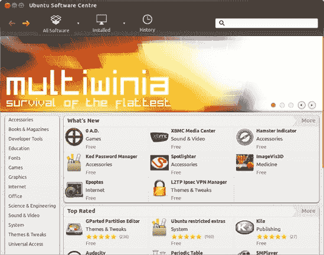
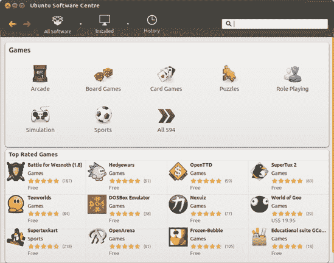
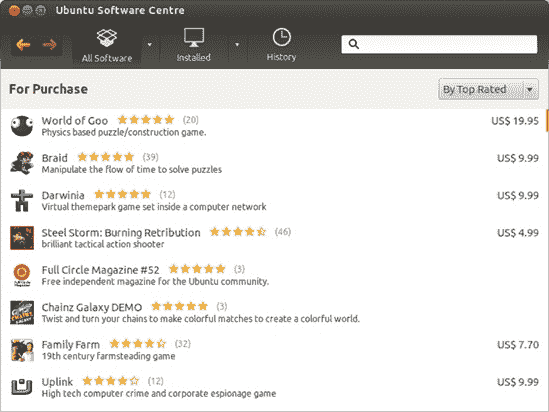
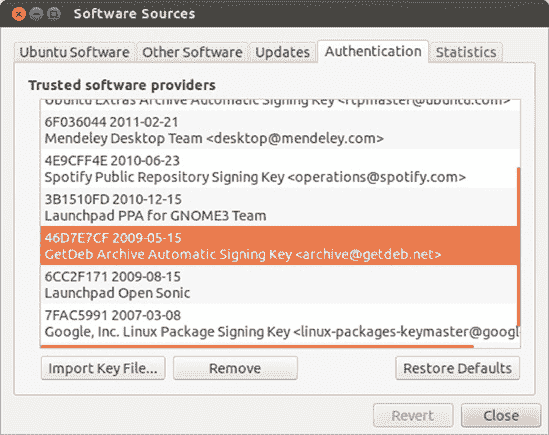

# 第六章. 完善鸟类

### 简单方式下载、安装和更新程序

Ubuntu 默认安装了很多有用的应用程序——“开箱即用”，比如你有一个网页浏览器、电子邮件客户端、完整的办公套件、音乐播放器、单人纸牌游戏……你还能想要什么？好吧，无论默认安装中包含了多少内容，总是有选择更好。Ubuntu 就是以选择著称。

在 Ubuntu 上安装软件的方式与您可能习惯的不同。在 Windows 上，您可能需要在网站上寻找 *.exe* 文件进行下载，或者去商店购买带有该软件的光盘。然后您会运行安装程序，点击一系列看似无穷无尽的选项和问题，直到它决定开始安装您的新应用程序。在 Mac OS 上，您可能需要做类似的事情，尽管可能麻烦少一些。

相反，Ubuntu 有一个 *软件中心*，这是一个真正的“一站式”商店，满足您所有的软件需求。无需在网上寻找下载，也无需等待安装光盘通过邮件送达。无需告诉一些傲慢的安装程序您的鞋码和最喜欢的颜色。不，软件中心会为您完成所有这些，而且几乎不需要麻烦。在许多方面，它就像智能手机上的“应用商店”，您只需点击几下就能获得最新和最好的应用程序。

这背后的引擎被称为 *高级包工具 (APT)*，它允许你轻松地下载、安装、更新和删除打包在 DEB 归档中的软件，或称为 *包*。

APT 是一种相当可靠的安装程序方法；由于 APT 会自动下载和安装您安装的主应用程序所需的任何文件，因此不会丢失任何文件。追踪这些称为 *依赖项* 的文件，对于大多数 Linux 用户来说曾经是一个重大的头疼问题。寻找并安装这些文件，以及这些文件可能拥有的任何依赖项，导致了“依赖地狱”这一问题的出现。APT 使得这个问题几乎成为过去式。

那么，APT 是如何找到所有这些文件和应用程序的呢？嗯，APT 搜索、下载和安装的软件包位于一组特定的存储库中。这些 *存储库* 是在线服务器，上面存储了大量的应用程序、支持文件等，以供您的系统使用。所有最初与您的系统捆绑在一起的文件，包括系统（内核）本身和可用的更新，也都存储在那里。

关于 APT，有些人，尤其是初学者，可能会认为它是一个问题，那就是它是一个命令驱动的应用程序。这意味着你通过在命令终端中输入命令来控制它。这就是软件中心的作用所在——它是 APT 的*前端*。广义上，这意味着软件中心控制 APT，在后台运行所有安装软件所需的命令，而无需你担心这些命令。不错吧？在本章中，你将学习有关软件中心的所有内容，以及你可能会不时遇到的几个其他前端。

# 项目 6A：通过 Ubuntu 软件中心安装应用程序

作为最令人视觉上满意的软件前端之一，软件中心在浏览酷炫或实用的应用程序时特别有用。为了感受一下，点击启动器图标，它看起来像一个顶部有东西爆炸的橙色袋子（如果你将鼠标悬停在其上，会出现*Ubuntu 软件中心*的字样）。打开的窗口将类似于图 6-1。

它可能不是首先吸引你注意的东西，但窗口底部最底部的数字告诉你可以从软件中心下载多少内容。当这本书付印时，有 41,091 个项目——足够让任何人忙上好一阵子。多亏了 Ubuntu 的开源起源，这些项目中的大多数都是完全免费的。可供选择的大量软件，价格你无法反驳。还有越来越多的商业软件可供选择（稍后将有更多介绍）。

图 6-1. Ubuntu 软件中心

但现在，你究竟该如何在这堆刚刚堆放在你家门口的庞大软件堆中挣扎前行呢？幸运的是，软件中心为你提供了几条途径。在窗口的左侧有一个分类列表。如果你点击任何一个分类，你将跳转到该分类下所有可用项目的列表，可能还会有更多子分类供你探索，就像图 6-2 所示。已安装的应用程序在其图标上有一个绿色的勾选标记，而未安装的应用程序则只显示一个普通图标。每个应用程序还有一个星级评分，告诉你其他用户认为它有多好。总的来说，它看起来和操作都非常像在线商店——把它想象成满足你所有 Ubuntu 软件需求的亚马逊.com。

要查看所有已安装程序的列表，请点击窗口顶部的工具栏上的**已安装**按钮。将出现一个类别列表；点击任何一个类别，即可查看已安装的项目列表。你之前已经在 Dash 或启动器中见过许多列出的应用程序。现在，看看类别列表的底部。在那里，你会找到一个询问你是否想要显示大量“技术项目”的小按钮。如果你喜欢，就点击该按钮；屏幕将更新，当你打开一些类别时，你会在列表中找到更多项目，其中大多数都是不熟悉的。你所看到的是 Ubuntu 默认安装的数百个其他应用程序和工具中的一些，你很可能自己永远不会使用它们。你看，软件中心不仅仅是一个获取新、有趣应用程序的方法。它还跟踪 Ubuntu 工作所需的重要系统软件——按钮所指的“技术项目”。

图 6-2. 在软件中心浏览可用的游戏选择

对于大多数人来说，甚至不需要考虑这些技术项目，所以你可以通过点击窗口底部的**隐藏**按钮再次将它们隐藏起来。但如果你倾向于摆弄这类东西，在深入之前你需要意识到一些事情。这些项目中的许多实际上对于系统的日常运行非常重要，移除它们可能会产生一些负面影响。例如，有一个程序负责管理你的互联网连接；最好还是让它保持原样。此外，许多技术项目对于使一些更熟悉的应用程序工作是必需的，比如网页浏览器和电子邮件客户端。由于 APT 处理这些依赖项的方式，移除技术项目会导致所有依赖它的项目也被移除。再次强调，这可能不是你想要的。一般来说，如果它在“技术项目”列表中隐藏起来，你可能不想卸载它。

目前关于 Ubuntu 内部工作原理的内容已经足够多了。现在是时候做一些实际的事情了。是时候带软件中心出去转转了。

## 6A-1: 选择要安装的应用程序

Ubuntu 软件中心可以同时安装多个应用程序，因此为了试试看，您可以尝试安装一些有趣的应用程序。让我们先从选择非常酷且非常有用的日记/日志应用 RedNotebook（如图 6-3 所示）开始。图 6-3。如果您还没有在那里，请点击工具栏上的“所有软件”按钮返回软件中心的起始屏幕。要选择 RedNotebook，请点击左侧列表中的“办公”类别。将出现一个相当长的可用应用程序列表，按流行度排序。嗯……RedNotebook 似乎不在列表的顶部。在整个列表中寻找它可能会变得乏味，所以让我们尝试以不同的方式排序：从窗口右上角的下拉框中选择“按名称”选项。这将使列表按字母顺序排列。在可用应用程序的列表中向下滚动，直到您开始看到*R*字母，然后双击**RedNotebook**项。将显示一个包含 RedNotebook 信息的页面。您会看到它得到了其他用户的极高评价——五颗星中的四颗半，并且它是完全免费的下载。右侧还有一张它在运行中的图片，您可以点击它来放大查看。如果您继续向下滚动页面，您会发现一些更多信息，然后是一系列评论。“目前最好的日记笔记本，”斯科特说。听起来不错。假设您也被这些好评所说服，您需要做的就是点击**安装**，如果提示，请输入您的密码。这将开始安装过程。

图 6-3. RedNotebook，目前最好的日记应用

当 RedNotebook 正在下载和安装时，页面上将出现一个进度指示器。一旦安装完成，页面将重新加载，并在“已安装”一词旁边显示一个绿色勾选图标，以表明它已成功添加到您的计算机中。如果您愿意，可以通过点击窗口底部出现的栏上的“添加到启动器”来将 RedNotebook 添加到启动器中。否则，转到 Dash 并搜索 RedNotebook 以启动程序。就这么简单！

## 6A-2: 搜索应用程序

接下来是声音转换器（我将在第十四章中更多关于使用此应用程序的讨论）。滚动程序列表可能会很繁琐，所以这次，尝试使用搜索功能。点击工具栏中的**所有软件**按钮回到主软件中心屏幕，然后在右上角的搜索框中开始键入**`Sound Converter`**。搜索结果将立即开始滚动。在完成键入之前，声音转换器应该就会出现在结果列表的顶部，所以点击一次以选择它，然后点击**安装**。安装将像以前一样开始——但这次，尝试在程序安装过程中点击**所有软件**。

所有的安装魔法将在后台继续，你仍然可以浏览其他程序。无需等待！

最后，让我们添加一个名为 Sysinfo 的有用工具（图 6-4），这是一个系统分析器，可以告诉你关于你电脑的各种信息。只需在搜索框中键入**`sysinfo`**，点击出现的**Sysinfo**搜索结果，然后点击**安装**将其添加到安装队列。它将在软件中心处理完声音转换器后立即安装。

图 6-4. 使用 Sysinfo 监控系统信息

你可以通过前往 Dash 并搜索它们来运行你安装的应用程序，就像往常一样。或者，打开 Dash 并点击屏幕底部的应用程序镜头图标（看起来像一把尺子和几支铅笔，如图图 6-5 所示）。然后，点击**过滤结果**并从右侧的列表中选择你的应用程序所在的类别。这将是 RedNotebook 的办公软件，Sound Converter 的媒体，以及 Sysinfo 的附件。你将在窗口的主要部分找到你想要的应用程序。

图 6-5. 应用程序镜头的图标

## 6A-3: 卸载应用程序

正如你所见，通过 Ubuntu 软件中心安装应用程序非常简单。幸运的是，卸载它们也同样简单。导航到（或搜索）你想要删除的程序，在列表中单击一次，然后单击出现的**移除**按钮。如果需要，再次输入你的密码，并观察程序被卸载的过程。如果你想要一次性卸载几个程序，你可能发现单击工具栏上的**已安装**按钮并浏览已安装应用程序列表会更快。对于你想要卸载的每个程序，通过单击选择它，你将再次看到移除按钮出现。

## 6A-4：商业软件与免费软件

Ubuntu 的一个相对较新的功能是商业软件的可用性。在早期，像 Ubuntu 这样的 Linux 发行版只会包含免费软件——这里的“免费”指的是“不收费”，也指的是“自由”。这是开源的方式——很多人分享他们编写的程序，通常只是为了乐趣，没有任何收费的暗示。在很大程度上，这仍然是这种方式：为 Linux 编写程序的绝大多数软件开发者继续公开分享他们的应用程序。但最近，一些发行版开始允许商业软件开发者进入，这些人会为他们的产品收费。Ubuntu 就是其中之一。想法是，大多数人习惯于为软件付费，并且并不那么在意他们不喜欢开源方面，他们不介意有更多的应用程序可供选择。免费应用程序始终存在，并且始终是多数。但无论如何，你现在可以购买 Ubuntu 的软件了。

要查看可用的商业软件，单击工具栏上所有软件按钮右侧的箭头，并从弹出的菜单中选择**购买**（图 6-6). 将会显示一个相当长的列表——有很多游戏，一些电子书和杂志，还有一些零散的系统工具。随着越来越多的软件开发者注册通过软件中心分发他们的应用程序，这个列表一直在增长。要查看最近添加的内容，单击**所有软件**返回到主软件中心视图，并检查窗口中间的“最新内容”面板。面板右上角有一个“更多”按钮，你可以单击它以查看更完整的列表。你会发现列出的软件并不全是商业软件，但其中很多似乎是。

### 注意

看起来，书籍和杂志可以通过软件中心获取可能有些奇怪，但这只是它被设置的方式。许多可用的书籍都是关于 Linux 和计算机的，所以软件中心并不是一个展示它们的奇怪地方。

安装商业软件与安装免费软件并没有太大的区别。唯一的区别是支付步骤，如果您在网上购物，这应该与您习惯的支付方式相似。如果您在列表中找到一个喜欢的商业应用程序，双击它进入其信息页面。价格将显示在页面左上角，以美元计。现在，点击右侧的**购买**按钮。您将被带到要求您输入**Ubuntu 单点登录账户**详细信息的页面。如果您还没有账户，请点击页面下方的**新建账户**按钮，并按照其提供的说明操作。一旦您有了账户，登录并按照说明提供您的支付详细信息。一旦所有步骤都完成，下载将开始，您将成为一个全新的应用程序的骄傲所有者。

图 6-6. 在软件中心查找商业软件

当您通过软件中心购买商业应用程序时，购买记录将与您的 Ubuntu 单点登录账户的详细信息一起保存。如果您需要重新安装 Ubuntu，或者不小心卸载了您购买的应用程序，这并不意味着一切都已丢失——您可以轻松地重新安装您购买的所有应用程序。打开软件中心后，将鼠标移至屏幕顶部，显示菜单栏，然后点击**文件** ▸ **重新安装以前购买的项目**。如果需要输入您的单点登录账户详细信息，请在提供的窗口中输入，并遵循屏幕上的说明。您将很快就能恢复您付费的应用程序。

# 通过更新管理器执行系统更新

在本章中，我将介绍 APT 的另一个图形前端，即更新管理器，它用于更新您的系统。更新会定期提供，包括您已安装的软件包的新版本。大多数时候，新版本会发布，因为它们修复了一些安全问题，但更新也可能修复软件问题并引入新功能。

当有更新可用时，更新管理器会自动弹出，所以最好先忘记它，直到它决定出现。但这次，让我们稍微主动一些。首先，确保软件中心当前没有在安装或删除任何内容；尽管这种情况很少发生，但请注意，你无法同时使用两个 APT 前端。现在，打开 Dash 并搜索更新管理器。一旦更新管理器窗口出现（图 6-7

图 6-7. 通过更新管理器批量升级软件包

如果你最近才安装了 Ubuntu，列表中可能会有很多更新。你将看到具体有多少个更新，以及它们全部下载需要多长时间，这些信息都显示在列表下方。如果你不希望升级某些应用程序，你可以逐个查看列表，并取消它们名称旁边的复选框。但就目前而言，最安全的方法是保留所有复选框。无论哪种方式，一旦你准备好了，点击**安装更新**按钮。选定的更新将被下载并安装。安装完成后，更新管理器窗口将自动刷新，留下一个（希望是）空白的列表。这样，你就拥有了一个完全更新的系统。根据你安装的内容，可能会出现另一个通知，告诉你为了使更改生效，你需要重新启动系统。如果是这样，最好是遵守指示并重新启动（当然，在重启之前，请确保保存所有工作）。

## 你应该多久安装一次更新？

正如我之前提到的，Ubuntu 会每天检查更新，如果发现更新，更新管理器窗口会出现在您的桌面上。如果这种情况发生得太频繁，您感到烦恼，请打开 Ubuntu 软件中心并点击 **编辑** ▸ **软件源**。当软件源窗口出现时，选择 **更新** 选项卡 (图 6-8)，并将自动检查更新的选项更改为其他设置。如果您觉得每日更新有点压力过大，每周更新应该就足够了。在那里您还可以找到其他一些有趣的选择。在 **当有安全更新时** 选项下，如果您选择自动下载并安装，更新将静默进行，无需您的任何干预。或者，您可以选择在后台下载更新，这样当更新管理器弹出时，它们就可以立即安装。

图 6-8. 软件源窗口中的更新选项卡

## 如果更新破坏了您的一天……或系统

现在，我不想让您过于担心，但关于每隔一段时间就会出现的重大系统更新，有一点需要注意：更新之后，有时事情会变得一团糟，让您后悔不已，满口脏话。这种情况现在很少发生，但无论您使用什么操作系统，这都是一种可能性。它可能发生在 Windows 上，可能发生在 Mac OS 上，也可能发生在 Linux 上。因此，在安装看似重大的更新之前等待一段时间，并首先检查用户论坛上关于特定更新的任何灾难性故事，总是一个好主意。在发现更新和安装之间留出一周的时间应该可以保护您免受大多数意外（这些意外再次很少发生），但没有任何保证。

### 注意

要决定一个更新是否是“主要”的，请寻找名称中包含 *linux-* 的更新（例如，图 6-9)。这些是重要的系统软件包，也是最有可能引起问题的那些。

图 6-9. 命名中包含 *linux-* 的更新通常是很重要的系统软件包。

如果你安装了一个更新，却发现你的系统无法再次启动，别担心。一切并未丢失。事实上，很可能什么都没丢。只需再次启动你的机器。如果你有一个双启动系统，你将到达 GRUB 启动菜单，就像往常一样。如果你不是双启动用户，你需要在启动计算机时立即按住 Shift 键来进入这个菜单。直到 GRUB 菜单出现（或者 Ubuntu 启动，在这种情况下你错过了提示，你将不得不重新启动计算机并再次尝试）。不要在 GRUB 菜单出现之前松开 Shift 键（或者在 Ubuntu 启动的情况下，你错过了提示，你将不得不重新启动计算机并再次尝试）。在 GRUB 菜单中，你会看到似乎在你的硬盘上安装了多个 Ubuntu 系统，这在某种程度上是正确的。作为短期解决方案，你可以利用这一点回到你之前不幸升级之前的核心系统（Linux 内核）。只需使用箭头键选择一个以数字结尾低于最高版本号的内核（例如，3.2.0-22 而不是 3.2.0-24），按回车键，voilà！你回到了你熟悉和喜爱的系统。你每次启动机器时都必须这样做，但至少你有机会在研究问题并稍后再次尝试之前备份你的宝贵文件。

在所有这些灾难和恢复的讨论中，我希望我没有让你对更新系统的想法感到害怕。毕竟，这种情况发生的可能性很大，不会发生在你身上。然而，了解如果事情出了问题，没有必要恐慌是很好的。你有了备份。

# 添加额外的软件仓库

Ubuntu 软件仓库包含超过 40,000 个软件包——足够你用一辈子，你可能这样认为。但事实是，还有整个软件世界在官方 Ubuntu 仓库之外等待着你，而且到达那里并不困难。各种个人和公司会将 Ubuntu 中不可用的少量软件包编译到他们自己的第三方仓库中。这些仓库通常是免费的，只要你能够找到它们。你所需要做的就是告诉 APT 在 Ubuntu 的仓库中搜索软件包的同时，也搜索这些仓库，这样你就可以获取额外的软件了。

每个仓库都有自己的 *APT 行*。这类似于一个网址，但包含有关仓库的额外信息，APT 使用这些信息来确定它包含哪些类型的软件包。您需要从您要添加的仓库的网站上获取正确的 APT 行，因此让我们举一个例子来看看它是如何工作的。打开 Firefox 并转到 [`www.getdeb.net/updates/Ubuntu/all#how_to_install`](http://www.getdeb.net/updates/Ubuntu/all#how_to_install)。GetDeb 专注于为尚未正式进入 Ubuntu 的软件制作软件包。页面上顶部应该有一些从 GetDeb 安装软件包的说明，因此跳到列表中的第二项，找到 APT 行，它应该看起来像这样：`deb` [`archive.getdeb.net/ubuntu`](http://archive.getdeb.net/ubuntu) `precise-getdeb apps`。这遵循所有 APT 行的相同格式：单词 `deb`，后面跟着一个网址，然后是几个其他单词，指定 APT 在查找程序时应检查仓库的哪个部分。突出显示 APT 行，右键单击它，并从弹出菜单中选择 **复制**。

当你在 Firefox 中时，你还需要获取仓库的 *GPG 密钥*（我将在本节末尾进行更多解释）。它应该链接到与您获取 APT 行相同的网站；在 GetDeb 的情况下，请访问 [`archive.getdeb.net/getdeb-archive.key`](http://archive.getdeb.net/getdeb-archive.key)；当打开 getdeb-archive.key 窗口时，选择 **保存文件** 并点击 **确定** 以保存密钥文件。

现在您已经拥有了这些关键信息，将仓库添加到您的系统就非常直接了：

1.  在软件中心，点击 **编辑** ▸ **软件源**，然后在出现的软件源窗口中点击 **其他软件** 选项卡。

1.  点击 **添加**。您将被提示输入 APT 行，因此将其粘贴到框中，然后点击 **添加源** (图 6-10). 当被要求进行身份验证时，输入您的密码并点击 **验证**。其他软件列表中应出现一个新条目。

    

    图 6-10. 输入 GetDeb 仓库的 APT 行

1.  选择 **身份验证** 选项卡并点击 **导入密钥文件**。使用出现的窗口找到您之前下载的 *.key* 文件。（它可能位于您的下载文件夹中。）

1.  通过单击一次选择 *.key* 文件，然后点击 **确定**。检查受信任的软件提供者列表，以确保 GetDeb 仓库自动签名密钥现在已存在，就像在 图 6-11 中所示。

    

    图 6-11. 检查受信任的软件提供者列表，查看 GetDeb 密钥是否在那里

1.  关闭软件源窗口。APT 将在后台开始工作，更新其软件包列表等。这可能需要一点时间，APT 不会告诉您何时完成，所以最好在这段时间里做些其他事情。您可以在进行此操作的同时正常使用计算机。打开软件中心，点击所有软件按钮右边的向下箭头。如果 APT 已经完成更新，您应该会在出现的菜单中找到 GetDeb。如果它还没有出现，稍等片刻，再次检查。

1.  现在，您可以从新的软件仓库中搜索您想要的程序。例如，尝试搜索 BookWrite，这是一个有趣的程序，可以帮助您编写自己的小说。它应该像任何其他应用程序一样出现在搜索结果中，因此您可以用通常的方式安装它。

这需要经过很多步骤，但比起开车去当地的电脑店买新程序，这要好多了，对吧？

最后一点：还记得关于身份验证和 GPG 密钥的所有事情吗？这与一个安全措施有关，该措施检查软件包是否来自您认为它们来自的地方。（理论上，有人可能会劫持一个仓库并将有害的假软件包放入其中。）如果您不添加 GPG 密钥，软件中心将拒绝显示来自该仓库的任何软件包，因为它不会信任它。尽管拥有 GPG 密钥并不能让您完全免受意外惊吓，但您在使用第三方（即非 Ubuntu）仓库时应该始终谨慎行事；在添加它之前，请确保它是可信赖的。

## APT-URL：从网站安装

现在您已经将 GetDeb 添加到可用的软件仓库列表中，您可以利用另一个 APT 前端。转到 [`www.getdeb.net/`](http://www.getdeb.net/) 并点击**应用程序**标签。浏览程序列表，直到找到您满意的应用程序——我选择了一个名为 *hamster-applet* 的时间管理应用程序——然后点击其图片下方的**立即安装**。现在您可以通过点击网站上的链接来安装软件，而无需访问软件中心！

将会弹出一个带有 Ubuntu 软件中心选项选中的启动应用程序屏幕——点击**确定**，如果提示，请输入您的密码。软件中心将打开（如果之前没有打开的话），然后您将被带到所选应用程序的信息页面。从那时起，一切照旧：点击**安装**，等待熟悉的下载和安装活动继续进行。一切完成后，关闭软件中心，然后在 Dash 中找到您的新应用程序。快速又简单。

许多网站支持 APT 链接，但除非你已将它们的仓库添加到你的计算机中，就像 GetDeb 那样，否则你无法从它们下载软件。然而，如果链接指向的是 Ubuntu 仓库中已经可用的程序，则软件可以像平常一样安装，无需在软件源中进行任何进一步的麻烦操作。

# 项目 6B：从 PPA 安装软件——Turtle Arena

许多 Ubuntu 爱好者被编程病毒感染，并决定开发自己的软件。有许多小程序是由某人编写的，以满足他们的需求，如果你知道在哪里获取，它们都是免费的。幸运的是，现在大多数这些软件都可以在 Ubuntu 项目网站 Launchpad 上的*个人软件仓库（PPAs）*中找到。PPAs 是小型软件仓库，是人们与他人共享自制软件的简单方式（重点在于自制——有时 PPAs 中的软件可能工作得不是很好）。越来越频繁的是，PPAs 也被 Firefox 等重要软件的开发者用来将最新和最好的版本提供给用户。无论是官方更新还是你正在寻找的自制应用程序，你都可以通过访问[`launchpad.net/ubuntu/+ppas/`](https://launchpad.net/ubuntu/+ppas/)并搜索你想要的内容来在 PPAs 中找到软件。

在这个例子中，你将看到如何安装 Turtle Arena，这是一款涉及奇怪熟悉角色（见图 6-12 的搜索框中输入**`games`**，然后点击**搜索**开始操作。

1.  查看结果以找到 Turtle Arena，然后点击该链接。你可能需要点击一次或两次**下一页**按钮才能看到它。

1.  复制显示为`ppa:zturtleman/turtlearena-stable`的部分——这是一个你可以用来添加此仓库的快捷方式，而不是必须使用更繁琐的 APT 行。（如果你好奇，可以通过点击此 PPA 链接的技术细节查看 APT 行。）

1.  打开软件中心，点击**编辑** ▸ **软件源**，然后在弹出的软件源窗口中点击**其他软件**选项卡。

1.  点击**添加**，并将 PPA 快捷方式粘贴到提供的框中。当提示时输入你的密码，然后 PPA 将被添加到其他软件列表中。

1.  这次，GPG 密钥将自动添加，因此你现在可以关闭软件源窗口。

1.  返回主软件中心窗口后，等待 APT 更新其软件包列表，就像你添加 GetDeb 仓库时那样。这可能需要一点时间，并且它将在后台进行，不会告诉你何时完成。要查看 APT 是否已完成更新，请点击“所有软件”按钮右侧的向下箭头，查看 Turtle Arena 是否已列出。

1.  一旦 PPA 出现在列表中，你就可以像安装任何其他软件包一样安装 Turtle Arena。

### 注意

如果 PPA 没有出现在列表中，尝试关闭软件中心然后再次打开它。这应该会给它机会更新软件包列表并确保 GPG 密钥已自动安装。或者，查看我添加的软件仓库/PPA 没有在软件中心显示在我的更新损坏中获取更多建议。

图 6-12. 玩 Turtle Arena

这只是一个例子——PPA 不仅仅被爱好者用来分发怀旧游戏。一些 Ubuntu 开发者使用 PPA 来提供软件的最新版本，如果它们在下一个 Ubuntu 版本发布之前发布。其中一些 PPA 以非官方和未经测试的方式提供，因此在使用它们时你必须小心——事情可能不会像预期的那样工作。然而，越来越多的主要软件开发者开始提供他们自己的*官方*PPA，你可以从中获取他们程序的最新版本。例如，如果 LibreOffice 或 Firefox 有新版本发布，你可以关注 Ubuntu 论坛([`www.ubuntuforums.org/`](http://www.ubuntuforums.org/))，看看开发者是否通过 PPA 提供了最新和最好的版本。

# 项目 6C：通过 Ubuntu 仓库安装不可用的 DEB 软件包——Google Earth

如你所记得，你通过软件中心从各种仓库安装的应用程序是以 DEB 包的形式。尽管这些仓库可能包含几乎所有可以想象到的软件，但某些软件包由于各种原因，永远不会进入仓库。Google Earth 就是这些软件包之一。

如图 6-13 所示，Google Earth 是一个高级地图/地图集程序，它允许你通过详细的卫星图像、地图，甚至是城市的 3D 渲染来探索世界上每一个地方。有一整个小众行业的人，他们通过数字方式扫描地球，编制你可以访问的有趣地点列表。他们通常将这些列表打包成*.kmz*文件，这样你就可以下载它们并自行探索。例如，如果你访问[`www.gecoolplaces.com/ancient-constructions.php`](http://www.gecoolplaces.com/ancient-constructions.php)，你会找到一个你可以游览的各种古代地标列表，所有这些都可以在你的扶手椅上完成。

图 6-13. Google Earth

谷歌地球还能做更多的事情，比如绘制本地商业和服务设施、追踪航班以及提供公共交通信息。还有其他类似的应用程序和网站，例如必应地图([`www.bing.com/maps/`](http://www.bing.com/maps/))，但谷歌地球无疑是功能最全面的。

由于谷歌地球不在 Ubuntu 仓库中提供，您需要从其网站([`www.google.com/earth/`](http://www.google.com/earth/))自行获取。一旦到达那里，点击**下载谷歌地球**按钮，它将自动带您到谷歌地球 Linux 版本的下载页面。在该页面上，选择**32 位 .deb (适用于 Debian/Ubuntu**)，点击**同意并下载**，然后在出现的窗口中点击**保存文件**按钮。

下载完成后，您将在您的硬盘上找到谷歌地球的 DEB 包，可能位于您的*下载*文件夹中。双击该包，软件中心将打开谷歌地球的信息页面。点击**安装**，如果需要，输入您的密码，并观察安装过程按常规进行。一旦谷歌地球安装完成，您可以通过打开 Dash 并搜索它来运行它。在应用程序下载一些地图的短暂等待后，您就可以通过点击鼠标在世界各地自由滑行了。

一些电脑似乎在处理谷歌地球时遇到困难，因为它的 3D 图形显示方式。如果您遇到问题，请访问[`support.google.com/earth/`](http://support.google.com/earth/)并搜索**`ubuntu`**——您会在那里找到一些关于如何使一切顺利运行的技巧。
