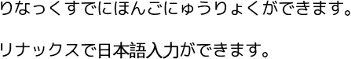
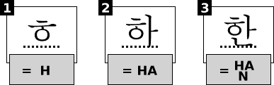
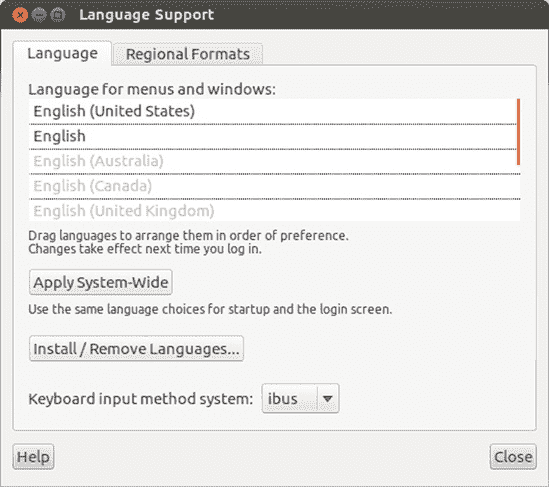
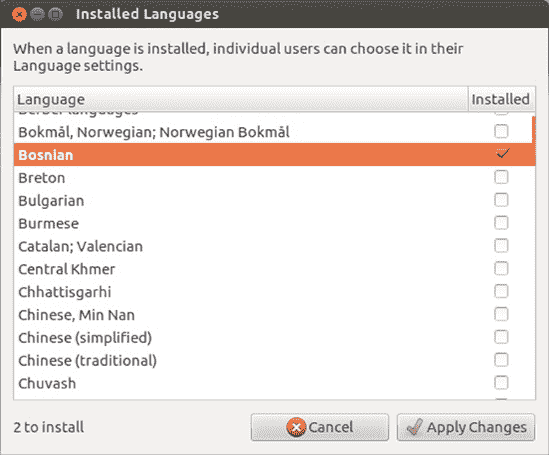
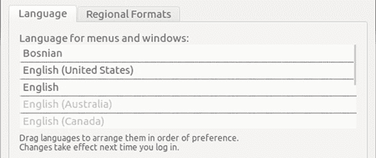
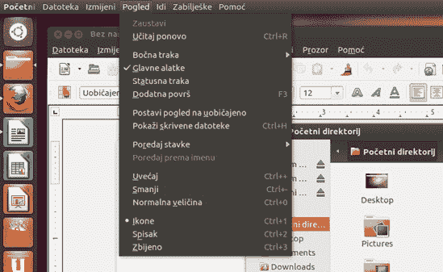

# 第十一章. 多语言企鹅

### Linux 说出您的语言

这些天，几乎所有的操作系统都是多语言的，或者至少能够实现多语言。Linux 也是如此。只需打开您的网页浏览器，无需进行任何特殊安装，您就可以阅读任何欧洲语言的内容，包括保加利亚语、希腊语、俄语和塞尔维亚语等非罗马字母语言。您甚至可以查看中文、日语、泰语、阿拉伯语和希伯来语等网页，仅举几个例子。

但 Linux 的多语言能力远不止于此，它处理多语言的方式使得充分利用这些功能变得容易。您很快就会看到，您甚至可以设置系统，使其提供完全的外语环境，让您能够完全使用您选择的语言。再加上可用于语言学习的免费程序数量不断增长，您就拥有了一个真正有意义的语言学习工具。

# 只读语言支持

如果您只想能够阅读用外语编写的网页或文档，您不需要安装任何额外的语言支持，除非在极少数情况下。从一开始，您就可以查看几乎任何您向系统投掷的语言的文档——无论是瑞典语、意大利语、中文、日语、阿拉伯语、希伯来语、俄语、越南语、亚美尼亚语还是泰语。您将能够阅读您语言能力范围内的任何内容（参见图 11-1 以获取示例）。

图 11-1. 在 Firefox 中显示的日本网页

现在，几乎所有网页浏览器都可以自动识别网页所使用的语言，并正确显示页面。然而，有时网页的作者可能会忘记在 HTML 中包含该页面的字符编码，在这种情况下，您的网页浏览器不知道该页面是用另一种语言准备的，通常会以系统默认语言打开它。结果是，您看到的页面只是一些没有意义的符号和字母的奇怪组合。在这种情况下，尝试更改浏览器中的字符编码为您认为该页面使用的语言编码。一些语言使用多种编码方案，所以如果您不确定该页面使用的是哪种编码，可以尝试每个可能性。在 Firefox 中，您可以通过选择 **查看** ▸ **字符编码** 来做出选择。从该子菜单中，您可以选择该页面的适当编码。

# 输入非标准字符

在 Linux 中输入非标准英语字符，如*é*、*ç*、*β*、*ø*、*œ*和*å*，可以非常容易地完成，无需任何修改。在大多数情况下，您可以通过访问系统中的字符映射表实用程序来完成此操作，该实用程序可以通过前往 Dash，输入**`字符映射表`**并按回车键找到。或者，从 Dash 中，您可以点击应用程序透镜，然后点击**附件**过滤器按钮。当运行字符映射表时，将出现类似于图 11-2 所示的窗口。

图 11-2. 使用字符映射表实用程序输入字符

要输入您想要的字符，只需在窗口的左侧面板中选择语言或字符集，然后在右侧面板中双击您想要输入的字符。字符将出现在窗口底部“要复制的文本”旁边的输入框中。只需点击**复制**按钮，然后将字符粘贴到您想要放置的应用程序中。

LibreOffice 提供了一种自己的方法，您也可以使用。在菜单栏中，选择**插入** ▸ **特殊字符**。将打开一个选择窗口，您可以在那里选择所需的字符。完成选择后，点击**确定**按钮，字符将出现在您的文档中，之后选择窗口会自动关闭。双击您想要的字符将完成相同的功能。

## 使用组合键选项

如果您偶尔需要输入重音或变音符号，并且不想打开应用程序或进入特殊菜单，那么使用键盘的**组合键选项**是一个不错的选择。基本上这意味着您可以使用键盘上不太常用的键与六个符号（` , ' ~ " ^）结合使用，以帮助创建带重音的字符。

在您可以使用此功能之前，您必须选择您想要用作组合键的键。在这个例子中，我将使用右 alt 键，因为大多数人很少使用它。以下是您需要做的：

1.  前往 Dash，输入**`keyboard layout`**并按回车键。

1.  在出现的键盘首选项窗口中，点击**选项**按钮。

1.  现在将出现键盘布局选项窗口。在该窗口中，点击**组合键位置**。

1.  在您想要用作组合键的键旁边的框中勾选（图 11-3

    图 11-3. 选择您的组合键

完成这些操作后，您可以使用您的组合键来输入这些字符。比如说，如果您想输入带重音的 *u*（即 *ü*）。在按住右 Alt 键（或您选择的任何组合键），您会按 **`"`**。然后您会释放右 Alt 键，输入 **`u`**，哇！您就得到了一个 *ü*！以下是一些更多示例：

| *á* | 右 Alt-**`'`** 然后按 **`a`** |
| --- | --- |
| *ç* | 右 Alt-**`,`** 然后按 **`c`** |
| *è* | 右 Alt-**`` ` ``** 然后按 **`e`** |
| *ñ* | 右 Alt-**`˜`** 然后按 **`n`** |
| *ô* | 右 Alt-**`^`** 然后按 **`o`** |

### 注意

这些序列基于美国键盘布局。其他布局的组合可能不同。

## 添加键盘布局

如果您经常使用某种外语进行输入，那么为使用的语言或语言添加整个新的键盘布局可能更方便。例如，如果您经常使用瑞典语，并且经常使用字符 *å*、*ä* 和 *ö*，使用适当的键盘布局会比反复使用字符映射表更容易。如果您使用的是希腊语、俄语、塞尔维亚语、格鲁吉亚语或任何使用完全不同字母表的其它语言，这一点尤其正确。当然，您需要熟悉您选择的每种语言的键盘布局，或称 *keymap*，但这相对容易。

要将外语键盘布局添加到系统的配置中，以下是您需要做的所有事情：

1.  前往 Dash，输入 **`keyboard layout`**，然后按回车键。

1.  在“键盘布局”窗口中，点击窗口左下角的 **+** 按钮。

1.  在随后出现的“选择布局”窗口中，选择您想要添加的键盘布局，完成后，点击 **添加** (图 11-4).

    

    图 11-4. 选择外语键盘布局

1.  重复步骤 2-3 以添加其他布局（最多四个布局）。

1.  完成后，您的窗口应该看起来像图 11-5，尽管键盘布局选择与我的不同。

1.  关闭窗口以完成此过程。

    

    图 11-5. 选择系统上的活动键盘布局

关闭键盘首选项窗口后，键盘布局指示器将出现在顶部面板的右上角。你会看到字母*en*，表示你目前正在使用你的英语语言键图。如果你点击该指示器，你将在你激活的任何其他布局之间切换。如果你不确定当前键图中键的位置，你可以通过右键单击指示器并在下拉菜单中选择**显示当前布局**来获得一些帮助，之后一个新布局的地图将出现在一个单独的窗口中，例如图 11-6 中所示。该窗口中显示的键图可能很难辨认，所以你可能需要通过拖动其底部的一个角落来扩展窗口。

图 11-6. 查看当前键盘布局的地图

如果你只想选择一个键盘布局来替换当前的布局（例如，使用英国英语而不是美国英语，或者使用德语而不是西班牙语），你可以在键盘首选项窗口中这样做。只需添加你想要使用的键盘布局，然后通过点击每个额外的布局并点击减号（-）按钮来移除它们。

# 中文、日文和韩文输入

对于大多数欧洲语言（以及许多基于字母的非欧洲语言），在键盘上按下一个字母会直接将该字母打印到屏幕上。然而，中文、日文和韩文需要一种转换过程，这个过程由一个特殊的应用程序（实际上是一系列应用程序）处理，称为*输入法编辑器（IME）*。每种语言都有自己的 IME，而且由于三种书写系统的基本差异，每个 IME 都相当不同。

## 中文

尽管大多数人（至少是那些了解语言学的人）会认为中文是最复杂的系统，因为书写系统由数千个字符组成，但实际上它是最简单的。中文

IME 简单地接受罗马化键盘输入，称为 *拼音*，并将其转换为汉字，或 *汉字*。对于 IME 来说，这本质上是一个简单的字典查找任务——大字典，简单的 IME。如果拼音输入对应多个汉字，将会显示一个可能的候选列表，用户只需从该列表中选择适当的字符，如图 11-7 顶部所示。图 11-7。在句子层面，中文 IME 现在也具有预测能力，可以根据你迄今为止输入的内容的上下文猜测你打算输入的字符，如图 11-7 底部所示。图 11-7。

图 11-7

## 日文

日文 IME 需要执行一个相当复杂的任务，因为它需要处理三种书写系统：*汉字*（很久以前从中国借用的表意文字）、*平假名*（主要用于时态和格尾的音字母系统）和片假名（主要用于从其他语言借用的单词）。尽管如此，日文的标准输入方法主要是通过标准的罗马键盘布局，加上一些额外的特殊功能键。因此，在日文中输入是一个两步过程，IME 首先将罗马化文本转换为平假名，然后在按下空格键后将它转换为适当的汉字、片假名或平假名元素。

你可以在 图 11-8 中看到这些步骤的示例。在第一行，IME 已经在输入过程中即时转换了罗马化输入。它将 rinakkusudenihongonyuuryokugamodekimasu（意味着 *在 Linux 中可以输入日文*）转换为平假名。当一行平假名被高亮显示时，这意味着该行尚未转换到那个程度。然而，在第二行，用户随后按下了空格键，这导致 IME 将平假名字符串转换为适当的汉字、平假名和片假名元素。第一个词 *Linux* 被转换为片假名文本，因为它是一个借词，而 *日文输入* 被转换为汉字；其余部分保持为平假名。

图 11-8

## 韩文

韩文输入法的工作方式与中文和日文输入法又有所不同，因为这种语言是以非常不同的方式书写的。韩文要么完全使用字母，称为*韩文*，要么是韩文和从中文借用的表意文字*汉字*的组合。虽然汉字字符本质上与它们的中文和日文对应物相同，即汉字和假名，但韩文音节字母，韩文，具有其独特的外观，正如你在图 11-9 中看到的韩国单词“韩国（Hangug）”，就可以看到。

图 11-9. 水平书写韩文“韩国（Hangug）”

这看起来很简单；然而，这种表示并不完全正确，因为韩文在字母字符的页面布局上非常独特。与平假名、片假名和大多数字母的通常并排排列不同，韩文字母以成对、三联或甚至四联的形式组合，通常按顺时针方向书写。因此，输入法（通常基于韩文字母键盘布局）必须在输入时处理输入，并且它必须调整每个字母的大小、间距和位置，以便将它们放入适当的集群中（参见图 11-10）。

图 11-10. 韩文输入法中的聚类过程示例

# 项目 11：设置亚洲语言支持

那么，如果你想在通常的英语环境中输入中文、日语、韩语、泰语或越南语，你会怎么做呢？如果你想在同一份文档中输入所有这些语言，你能做到吗？

当然可以。

实际上，有几种方法可以做到这一点，但在 Ubuntu 中默认的方法是易于使用的*智能输入总线（IBus）*。IBus 支持大多数东亚语言，包括中文、日语和韩语，并为这些语言中的许多提供了多种输入法。

## 11-1: 安装 IBus 输入法

IBus 非常易于使用，但可以说，它默认只提供了两种输入法，都是用于中文：拼音输入法，用于简体字输入（中国大陆及全球的中文课程标准），以及注音输入法，用于繁体字输入，如台湾、香港和海外华人社区所使用。要输入其他语言，您需要自行安装适当的输入法。只需前往 Ubuntu 软件中心，搜索 ibus japanese（会有很多方法，所以我建议先尝试 *Anthy*），*ibus korean*，*ibus thai*，和/或 *ibus vietnamese*。

## 11-2：选择输入法模块

安装您需要的输入法后，您需要启动 IBus 并选择您想要使用的输入法。以下是步骤：

1.  前往 Dash，输入 **`键盘输入`** 并按回车键。

1.  将出现一个窗口询问您是否想要启动 IBus 守护进程。点击 **是**。

    ### 注意

    *守护进程* 是一个在后台运行的程序，普通用户不知道，为系统提供附加功能。在 IBus 的情况下，这种附加功能是输入复杂字符集的能力。

1.  另一个窗口将出现，告诉您如果无法使 IBus 工作时应该做什么。在该窗口中点击 **确定**。

1.  然后将出现 IBus 首选项窗口。点击输入法标签页。

1.  在该标签页上，勾选 **自定义活动输入法** 旁边的复选框。

1.  接下来，点击 **选择输入法** 下拉菜单按钮，选择您需要的输入法，然后点击 **添加**。您刚刚添加的输入法将出现在窗口的主面板中。

1.  重复上述步骤以添加您想要的任何其他输入法。完成后，您的窗口应类似于 图 11-11，具体取决于您选择了哪些语言。

1.  当您完成选择后，点击 **关闭** 按钮。

    

    图 11-11. 在 IBus 中添加亚洲字符输入法

## 11-3：使用 IBus 输入亚洲语言

一旦您选择了输入法并关闭了 IBus 首选项窗口，一个看起来像迷你键盘的小图标将出现在面板上邮件通知图标左侧。如果您在上一节中启用了多个键盘布局，键盘将出现在相同的键盘选择器图标左侧。当您点击那个新的 IBus 图标时，将出现一个显示所有可用输入法的菜单（如图 11-12 所示图 11-12. 从 IBus 面板小程序中选择语言输入法）。然而，要实际选择一个方法，您需要使用接受文本输入的应用程序，例如文本编辑器、LibreOffice，甚至是网页浏览器搜索框。为了尝试一下，请打开 LibreOffice Writer。

图 11-12. 从 IBus 面板小程序中选择语言输入法

一旦 Writer 出现，点击文档区域，然后从 IBus 面板菜单中选择您想要使用的输入法。现在您可以使用所选的输入法在 Writer 中开始输入。如果您没有看到您打算输入的字符，而是看到了无意义的字符（方框或看似随机的符号），请尝试使用另一种字体。

要从一个输入法切换到另一个输入法，有两种选择。首先，您可以去 IBus 面板小程序并从菜单选项更改方法。其次，您可以使用快捷键组合在方法之间切换：ctrl-spacebar 切换 IBus 的开启和关闭，而 alt-shift-L 将您从一种输入法切换到下一个。

# 设置 IBus 在您登录时自动启动

如您可能从第一次打开 IBus 首选项窗口时回忆起来，每次您登录系统时都必须启动 IBus。如果您大量使用 IBus 并且因此希望省略此额外步骤，您可以轻松设置系统在您登录时自动启动它。

要这样做，请转到 Dash，输入**`language support`**，然后按回车键。在该窗口的语言选项卡中，从“键盘输入法系统”旁边的下拉菜单按钮中选择**ibus**，如图 11-13 所示图 11-13. 设置系统以便 IBus 在登录时自动启动。完成后，关闭窗口。下次您登录时，IBus 将自动启动并准备好使用。

如果在下次登录时 IBus 仍然没有自动启动，请尝试将其添加到系统启动应用程序列表中。为此，前往 Dash，输入**`启动应用程序`**，然后按回车键。这将打开启动应用程序首选项窗口。在该窗口中，点击添加按钮。在出现的窗口的名称框中，输入**`IBus`**，在命令框中输入**`/usr/bin/ibus-daemon -d`**。完成后，点击**添加**，然后关闭启动应用程序首选项窗口。

图 11-13. 设置系统以便 IBus 在登录时自动启动

# 在另一种语言中查看您的系统

最初吸引我进入 Linux 世界的事情之一是能够为除英语以外的语言安装语言支持，并在不同的语言中构建一个全新的系统。我过去有一台机器，支持中文、日语、瑞典语和我的默认语言英语。只需几点击和简单注销，我就可以用完全不同的语言界面重新登录。我可以在需要的时候（或者当有学生访问我的办公室时）拥有中文、日语或瑞典语系统。

如果您在一个不是每个人都使用相同母语的环境中，这将非常有用。例如，在我以前工作的大学，我的日本和中国学生有时会使用我的电脑，额外的语言支持允许他们使用自己的语言登录。如果您正在学习一门外语并希望尽可能多地接触它，这甚至相当方便。总的来说，这是一个非常有用的功能。

利用 Ubuntu 的这个功能非常简单。基本上，您需要做的只是为要添加到系统中的每种语言安装一组支持文件。您可以通过从 Dash 运行语言支持，然后在该窗口中点击**安装/移除语言**按钮来完成此操作。当出现已安装语言窗口时，通过勾选适当的复选框从各种语言中选择。(图 11-14).

图 11-14. 选择要安装的附加语言

在您做出选择后，点击**应用更改**按钮。此时将提示您输入密码，因此请提供所需信息，语言支持工具将开始下载并安装您指定的支持包。完成后，您将收到通知，并保留已安装语言窗口。

一旦您安装了额外的语言支持，您可以通过语言支持窗口选择在下次登录时以不同的语言环境打开系统，选择您想要使用的语言，并将其拖动到列表的顶部（图 11-15). 对于具有复杂输入系统的语言，您还可以在“键盘输入法系统”旁边的菜单按钮中选择您偏好的输入法，例如 IBus。然后您可以关闭窗口，注销，然后再次登录，之后您的系统将以您选择的语言显示。

图 11-15. 选择您下次登录时系统显示的语言

然后，您的启动过程将继续，一切都将像往常一样进行。根据您选择的语言，一旦您的桌面出现，您将进入另一个语言世界。您的菜单、应用程序，甚至当您将鼠标移至面板图标上时弹出的小贴士窗口都将使用新选定的语言（图 11-16）。

图 11-16. 在波斯尼亚语中显示的 Ubuntu 部分
