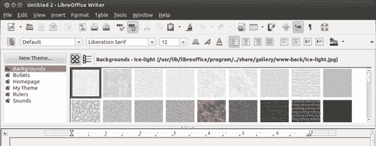
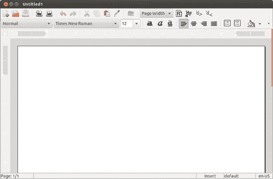
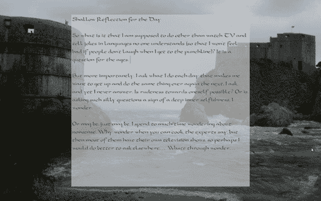
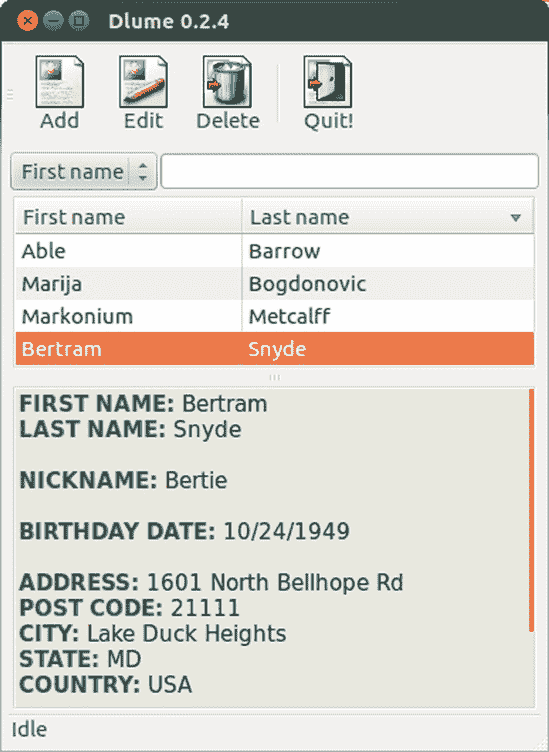
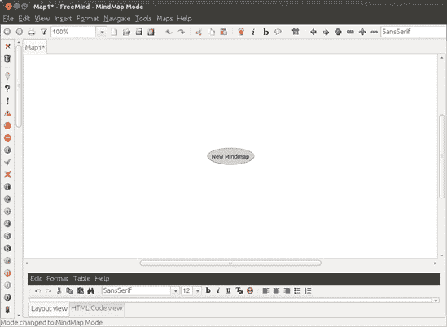

# 第十二章。工作中企鹅

### 在 Linux 中开始工作

虽然计算机被用于各种（而且很有趣！）活动，如编程、制作音乐、创作艺术和玩游戏，但几乎每个人在某个时候或另一个时候都必须坐在电脑前完成一些工作。在这种情况下，许多用户想知道他们系统中有哪些办公相关应用程序可用。

幸运的是，Linux 也能像其他操作系统一样高效地处理事务。更重要的是，由于有大量免费的应用程序供你尝试，你可能会发现，如果你必须预先支付所有费用，你实际上使用的办公相关生产力应用程序会多得多。在本章中，我将向您介绍 Ubuntu 预装的应用程序，然后指向您可能想要添加到您收藏中的其他应用程序。

# 应用程序所在位置

本章中的大多数应用程序都可以通过点击 Dash 中的应用程序透镜，然后点击 **Office** 过滤按钮来运行。异常情况将在相关部分中说明。与所有应用程序一样，您也可以通过在 Dash 的搜索框中键入应用程序的名称，然后按回车键来运行应用程序。

# LibreOffice

当涉及到工作时，大多数人会转向办公套件，其中包含他们最常用的应用程序——文字处理器、电子表格和演示编辑器。办公套件中的事实标准是 Microsoft Office，它在 Windows 和 Macintosh 界都可用。当然，因为它是一个微软产品，你可以相对确信没有（或永远不会）有 Linux 版本。

幸运的是，Linux 拥有一个极其强大的办公套件，并且它随 Ubuntu 一起提供。套件被称为 LibreOffice，它是 OpenOffice.org 的开源社区支持的继承者，OpenOffice.org 是最初捆绑在大多数 Linux 发行版中的办公套件，直到它被甲骨文接管，后来被抛弃（如果你想知道，这里有一些最近的历史）。LibreOffice 不是微软 Office 世界的轻量级替代品；它是一个功能齐全的竞争者。顺便说一句，LibreOffice 在 Windows 和 Mac OS X 版本中也是免费提供的（这里的“免费”是指真正的免费）。

## LibreOffice 应用程序

整个 LibreOffice 办公套件由多个应用程序模块组成，其中除了一个之外，都随 Ubuntu 一起提供。这些包括文字处理器（Writer）、电子表格（Calc）、演示创建器和播放器（Impress）以及一个非常方便的矢量绘图程序（Draw）。您可以通过前往 Dash，点击应用程序透镜，然后点击 **Office** 过滤按钮来找到所有这些应用程序。数据库模块（Base）也作为 Ubuntu 软件中心的单独下载提供（只需搜索 *base*）。

由于详细说明如何使用这些应用程序需要占用整整一本书的篇幅（而且关于这个主题的书也有很多），我只需简单地为您介绍每个模块。如果您需要帮助，可以在 LibreOffice 帮助系统中找到（**帮助** ▸ **LibreOffice 帮助**）以及在线[`libreoffice.org/get-help/documentation/`](http://libreoffice.org/get-help/documentation/)。YouTube 上也有许多视频教程可供参考。

### Writer

如我之前提到的，文字处理器是大多数用户最常使用的办公应用程序。幸运的是，LibreOffice Writer 是一款不错的软件（见图 12-1）。它功能丰富，可以读取和保存 Microsoft Word 文件。就像 Word 一样，它甚至允许您将文档保存为 HTML 文件，这样您就可以轻松地将文档转换为网页。在用法方面，Writer 是一个非常直观的文字处理器，因此在这里我不会详细介绍。再次提醒，如果您需要更多信息，请查看 LibreOffice 帮助或上一节中提到的在线文档。

图 12-1. LibreOffice Writer

### Calc

Calc 是 LibreOffice 的电子表格应用程序，在功能和总体布局方面与 Excel 相似（见图 12-2）。它还可以，相当重要的一点，读取和保存 Microsoft Excel 文件。

图 12-2. 在 LibreOffice Calc 中创建的图表

由于大多数使用电子表格的人通常都明白它们是用来做什么的，并且在稍微摸索一番之后，就能弄清楚如何使用它们，因此在这里我不会用任何关于如何使用 Calc 的入门指南来占用您的时间。然而，由于许多人甚至看不到尝试使用电子表格的任何必要性，我将提到一些可以用 Calc 完成的简单任务，希望能吸引一些您尝试使用它。

许多不使用电子表格的人认为它们是用于计算不舒服的大量数字的巨型计算器，比如工资单。当然，这种看法并不完全错误，因为这就是这类应用程序的原始目的，但电子表格也可以用于日常任务。预测家庭预算、计算平均成绩点（由教师或学生进行）、计算您为前往圣马力诺的旅行攒钱需要多长时间，或者甚至跟踪您在四到五把吉他中选择的价格……这些都是电子表格适合完成的任务。更令人高兴的是，在执行任何这些小数学任务时，您可以轻松地创建图表，使抽象的数字以视觉形式呈现给您。

如果你不是特别擅长数字，你仍然可以使用 Calc 创建信息列表，例如生日列表、班级名单、购物清单和地址列表。你甚至可以让 Calc 将列表按字母顺序排序，按出生日期排序等。似乎每个人最终都会找到使用 Calc 的用途，所以不要完全忽视它。

### Impress

Impress 是 LibreOffice 对 Microsoft PowerPoint 的回应，与它兼容。它允许你创建用于演示的吸引人的幻灯片，并允许你创建与幻灯片一起使用的笔记或讲义。尽管这些功能使 Impress 在商业和教育环境中非常方便，但你可能不会像家庭用户那样从中获得太多价值。

图 12-3. LibreOffice Impress

### Draw

对于家庭用户来说更有用的是 LibreOffice Draw，这恰好也是我最喜欢的，仅次于 Writer，是最频繁使用的 LibreOffice 模块。虽然 Draw 在艺术意义上创建真正的图形并不出色，但它非常适合创建流程图；组织图表（例如婚礼招待会或会议的座位安排）；或任何需要更多控制文本和图形位置（尤其是当两者结合时）的文档，例如传单、奖项、图表和通讯稿。从这个意义上说，Draw 可以非常有效地作为简单的页面布局程序使用，正如你在图 12-4 中看到的那样。

图 12-4. 在 LibreOffice Draw 中创建（并显示）的通讯稿

## Microsoft Office 和 LibreOffice 文件兼容性

虽然我在本节中提到了这一点，但值得再次强调的是，LibreOffice 可以读取和写入 Microsoft Office 文件。这种兼容性相当好，尽管表格有时会有些问题。

要读取 Microsoft Office 文件，你只需双击相关文件，它就会在适当的 LibreOffice 模块中打开。然而，当在 LibreOffice 中保存文件以用于 Microsoft Office 的早期版本时，你必须保存到适当的格式。否则，LibreOffice 将默认将其保存为其原生格式（Writer 文档为 *.odt*，Calc 文档为 *.ods*，Impress 文档为 *.odp*），并且只有 Microsoft Office 的最新版本才能处理这些文件。

要保存你需要的格式的文件，请在保存窗口的左下角点击**文件类型**，然后从出现的可用文件格式列表中选择适当的 Microsoft Office 格式——例如，对于 Writer 文档，选择**Microsoft Word 97/2000/XP/2003**。

## LibreOffice 功能

LibreOffice 的主要应用程序（Writer、Calc 和 Impress）与 Microsoft Office（Word、Excel 和 PowerPoint）在 Office 2007 之前的版本相当相似，所以如果你从小使用过这些版本的 Microsoft Office，切换到 LibreOffice 应用程序应该相对容易。

如果你没有使用过 Microsoft Office 的经验，你仍然会发现使用 LibreOffice 应用程序是直观的，因为基本布局相当直观。如果你在这方面缺乏直觉，内置的帮助文件也相当不错。为了进一步帮助你，提示系统的工作方式与 Windows 和 Mac 世界中的工具提示相似。（如果你不确定我在说什么，*工具提示*是当你将鼠标放在按钮或菜单项上时，会弹出的小框，告诉你该按钮或菜单项的功能。）另一个酷而有用的帮助功能是“这是什么”，它的工作方式与提示系统相似，但提供了关于特定按钮功能的更详细说明。如果你选择**帮助** ▸ **这是什么**，你的光标将变成一个小问号。将这个问号光标移到 LibreOffice 界面中的几乎所有项目上，你就可以了解它的功能，而不仅仅是项目的名称。

尽管我所说的都是直截了当的，但可能有一些界面元素对你来说还是陌生的，所以我将简要地讨论它们。在描述这些功能时，我会使用文字处理器 Writer，这样你可以在跟随的同时运行 Writer，以便更容易地操作。

## 了解按钮

尽管你应该能够弄清楚 LibreOffice 工具栏上大多数按钮的功能，但一些按钮，在所有 LibreOffice 模块中都很常见，可能需要更多的解释。

### 导出为 PDF

导出为 PDF 按钮位于两个打印机按钮（打印和页面预览）的左侧。你可以使用此按钮将你的文档导出或保存为 PDF 文件。

### 超链接

点击超链接按钮，即表格按钮左侧的按钮，将打开超链接窗口，你可以从该窗口分配链接到指定的文档——不仅限于网页，还可以是单个计算机上的文档，甚至是该文档内的目标。尽管网页上的超链接是我们都已经习以为常的东西，但文本文档之间超链接的想法听起来有点激进。实际上，这个想法在我们甚至听说过互联网之前就已经存在了。

### 导航器

顶部行倒数第四个按钮（看起来像星爆的那个）是导航按钮。点击此按钮（或者直接按 F5 键）将打开导航窗口（见图 12-5)，这是一个相当酷的导航功能，当你处理长文档或复杂文档时非常有用。

图 12-5. 导航窗口

导航器允许你轻松地在文档中的页面之间或元素之间（如部分、链接等）来回跳转。假设你有一个包含大量插图（如本章）的文档，并且你想直接从一张图形跳转到另一张图形。在这种情况下，你会在导航器窗口的主面板中双击单词*图形*，然后点击跳转按钮（位于页面选择器左侧的奇怪小按钮）以开始跳转。

如果你正在处理包含各种标题级别的文档，例如本书的所有章节，你也可以使用导航器在这些级别之间切换。比如说，你决定在最后一刻向正在撰写的文档中添加一个新的主标题。因此，你需要将之前所有的标题都降级，原来的主标题变成副标题，依此类推。当你双击单词*标题*时，文档中列出的所有标题文本都会出现。然后你可以从列表中选择一个标题，并点击降级级别按钮（位于第二行按钮最右侧的那个）来将其降级。

### 图库

导航按钮的右侧是图库按钮。点击此按钮，将图库（用于文档或网页中的图形元素库）显示在文档窗口顶部的单独面板中（见图 12-6)。图库中的元素从各种类型的线条到按钮，再到彩色三维甜甜圈不等，你可以添加自己的项目。

图 12-6. 图库

即使不使用图库，将图形插入文档也是一个足够简单的任务。只需选择**插入** ▸ **图片** ▸ **从文件**，然后找到要插入的图像文件。然而，当你打算经常使用某些图形时，使用图库会更方便。一旦进入图库，你的图形始终只需点击一两次，并且可以在图库浏览器窗口中方便地查看。

LibreOffice 附带的艺术品集合主要针对构建网页，但其他剪贴画在其他地方也有提供。例如，您可以在[`www.openclipart.org/`](http://www.openclipart.org/)找到一个非常棒的集合。那里的一切都是公共领域的，因此都是免费的。务必查看“游戏反派”集合——这是我的最爱之一。

将这些（或任何其他）图形文件添加到图库相对简单。首先为要添加的每组图像创建一个新的类别（称为*主题*）。要创建自己的图库主题，请点击图库窗口中的**新建主题**按钮。这将打开新主题属性窗口，您应该为您的主题命名。完成此操作后，点击**文件**选项卡，然后点击**查找文件**按钮，这将打开选择路径窗口。从那里，您可以导航到您存储剪贴画、照片或其他图形的文件夹。找到文件夹后，点击**确定**按钮，之后该文件夹中所有文件的列表将出现在新主题属性窗口中。

在此窗口中，您可以通过点击要添加的每个图像的名称，然后点击添加按钮，轻松地将图像添加到您的新图库主题中。（您可能想要确保“预览”一词旁边的框被勾选，以便事情变得更容易一些。）完成此操作后，图像的副本将立即出现在您主题的图库浏览器中，它将保留以供将来使用（图 12-7

图 12-7. 在图库中查看剪贴画和您的个人收藏

### 样式和格式

我们在 LibreOffice 不熟悉的按钮之旅的最后一站是样式和格式按钮，它位于第二行按钮的最左侧。此按钮充当样式和格式窗口的切换器（图 12-8

图 12-8. 样式和格式窗口

为了给你一个使用样式的便利性的例子，想象一下你正在为准备好的报告输入参考文献页面。你像输入任何段落一样输入了每个条目，如下所示：

> Smythe, W. (2004). 在七岁以上的非人类对话者之间重新考虑言语的需求。*精灵、妖精和花园小矮人协会杂志*，20(2)，125-147。

与你输入的大多数段落一样，条目以首行缩进格式化，这很好——除了你想要悬挂缩进，这是参考文献条目的规范。与其在制表符或页边距上捣鼓以得到你想要的方式，你只需在段落内的任何地方点击鼠标，然后在“样式和格式”窗口中双击**悬挂缩进**条目。之后，就像魔法一样（尽管你知道不是），转换就完成了：

> Smythe, W. (2004). 在七岁以上的非人类对话者之间重新考虑言语的需求。*精灵、妖精和花园小矮人协会杂志*，20(2)，125-147。

你可以为你的其他条目遵循相同的程序，或者，如果选择了悬挂缩进，可以在“样式和格式”窗口中点击**油漆桶**按钮。现在，当你的鼠标光标放在文档上时，会显示为油漆桶形状。点击参考文献中的任何其他段落，该条目也将以新的样式格式化。将不同样式应用于任何其他文档元素的过程基本上是相同的。

# 轻松使用 AbiWord 完成文字处理

如果 LibreOffice 的 Writer 对于你的日常文字处理任务来说有点强大，而你更喜欢点击启动器图标时立即出现的应用程序，那么你可能想考虑另一个文字处理器，AbiWord (图 12-9)。如果你好奇，可以从 Ubuntu 软件中心安装它。

图 12-9. 其他 Linux 文字处理器——AbiWord

AbiWord 拥有直观且易于使用的界面，你应该能够在没有太多，甚至没有帮助的情况下弄清楚它。它还有一些有趣的功能，例如其自动调整大小功能，可以根据你调整程序窗口大小的程度放大或缩小屏幕上的文档大小（字体、图像等一切）。而且，如果你在好奇的话，AbiWord 可以保存和读取 Microsoft Word *.doc* 文件，并将文档保存为 PDF 文件。

# FocusWriter

在讨论替代文字处理应用程序时，值得提一下来自 Ubuntu 软件中心的一个不寻常的新应用，名为 FocusWriter。FocusWriter 的开发者称其为无干扰的写作环境，当你第一次运行它时，你会确切地了解他们的意思。为了不剧透，你将看到的是一个灰色的屏幕。没有菜单栏，没有按钮，没有菜单……什么都没有。它旨在让你有在空白纸张上打字的感觉。

虽然这个想法看起来有点花哨，但这个环境确实提供了一种不同的氛围，这可能是你在进行创造性工作时想要或需要的。通过选择一个漂亮的字体或添加一个令人愉悦的背景图片 (图 12-10)，你内心富有想象力的那一面可能会被激发出来。FocusWriter 可能是你的数字灵感之源。

图 12-10. 使用 FocusWriter 进行无干扰的文字处理

# 一些其他酷炫的生产力应用

除了已经讨论过的更传统的办公应用程序之外，Ubuntu 软件中心还提供了一些其他的应用程序，这些应用程序可以归类在“生产力”标签下。我将在这里介绍其中的一些。

## Dlume

让我们从这个领域中最简单的一个应用开始，Dlume (图 12-11)。Dlume 是一个简单独立的地址簿应用程序，感觉轻便且易于使用。它允许你轻松地在地址簿中搜索姓名，并将所有信息以 CSV 或 HTML 格式导出。你可以通过点击应用程序透镜并点击**附件**过滤器按钮，或者直接在搜索框中输入名称并按回车键来从 Dash 运行 Dlume。

图 12-11. Dlume 地址簿应用程序

## gLabels

我个人最喜欢的办公风格应用之一是 gLabels (图 12-12)，我从成为 Linux 用户的第一天起就开始使用它。正如其名所示，gLabels 是一个用于布局和打印各种标签的应用程序；尽管名字没有暗示，但 gLabels 在制作名片方面也非常出色。它包括了几乎所有来自 Avery 和其他几家制造商的标签和卡片纸的模板。虽然你可以在 LibreOffice 或 Scribus（我将在本章后面提到）中完成 gLabels 的大部分功能，但我相信你会发现 gLabels 是完成这项工作最简单、最直观的方式，尤其是在设置带有图形或特殊布局的名片或标签时。

## Tomboy

新的 Unity 桌面环境的一个缺点是您不能再轻易地运行大多数 GNOME 面板小程序了……好吧，至少不是那么容易。Sticky Notes，这个允许您在桌面上贴上类似黄色 Post-it 的便签的应用程序就是其中之一。幸运的是，Tomboy（图 12-13

图 12-12. gLabels

图 12-13. 带有活力的桌面笔记——Tomboy

Tomboy 最受赞誉的功能之一是其搜索和超链接功能。这些功能允许您在整个 Tomboy 笔记库中搜索条目，并创建将一个笔记中的文本连接到另一个链接笔记的超链接。实际上，每当您输入一个与您现有的笔记标题匹配的单词时，Tomboy 都会自动创建一个超链接。为了使事情更加激动人心（或者至少更有用），Tomboy 通过其插件功能允许您将笔记导出为 HTML 或打印它们，无论是作为纸质副本还是作为 PDF 文件。

下载并安装了 Tomboy 之后，您可以从 Dash 中运行它，无论是通过输入其名称并按回车键，还是通过点击应用程序透镜然后选择 **附件** 过滤按钮。

## FreeMind

如果您喜欢通过图表来图形化地思考您的想法，那么思维导图应用程序 FreeMind (图 12-14) 可能非常适合您。FreeMind 允许您图形化地布局您的想法，并将结果保存为多种格式，包括 PDF、PNG、JPEG 和 SVG。您可以从 Ubuntu 软件中心下载 FreeMind，然后从 Dash 中运行它。只需点击应用程序透镜然后选择 **办公** 过滤按钮。

图 12-14. Freemind

## Scribus

为了使内容更加完整，我们来到了一个开源的桌面排版应用，Scribus (图 12-15)，这是在 LibreOffice Writer 和 Draw 无法满足需求时使用的。Scribus 旨在生成商业级输出，并支持专业出版功能，例如 CMYK 颜色、PostScript 处理以及创建颜色分离等，仅举几例。Scribus 有一个相当不错的支持网络，还有一个在线教程([`wiki.scribus.net/canvas/Get_Started_with_Scribus`](http://wiki.scribus.net/canvas/Get_Started_with_Scribus))，所以如果你发现自己开始使用这个应用，你不会孤单。

图 12-15. Scribus
