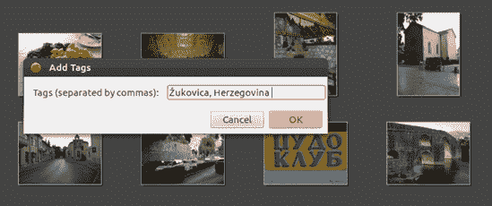
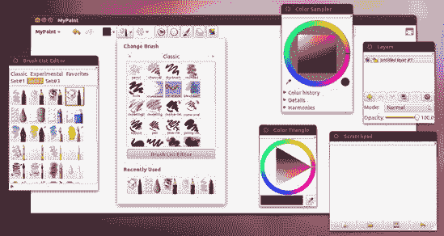

# 第十三章. 右脑企鹅

### Linux 的艺术

现在您已经知道您可以在 Linux 中开始处理事务了，是时候戴上您的那顶贝雷帽，处理事物的艺术方面了。是的，Linux 也有艺术，而且您很快就会发现，您系统上的许多程序都允许您创建和操作图形文件。然而，对于大多数用户来说，他们的图形工具箱中可能没有什么比他们的数码相机更重要了，所以我们就从这里开始。

# 应用程序所在位置

本章中的大多数应用程序都可以通过在 Dash 中点击应用程序透镜然后点击图形过滤器按钮来运行。异常情况将在相关部分中说明。与所有应用程序一样，您也可以通过在 Dash 的搜索框中输入应用程序名称并按回车键来运行应用程序。

# 项目 13A：从数码相机导入图像

虽然 Linux 对扫描仪的支持可能有些不稳定，但对数码相机的支持几乎是无忧无虑的。事实上，Ubuntu 几乎将您的相机视为连接到计算机 USB 端口的便携式硬盘或 U 盘（实际上就是这样）。即使您的相机在直接连接时似乎无法与计算机通信，您也可以通过从相机中取出存储卡，将其插入 USB 闪存卡读卡器，然后将该读卡器插入计算机的一个 USB 端口，将您的图像传输到硬盘。

## 13A-1：通过 Shotwell 将图像从相机自动导入计算机

当您通过 USB 线将相机连接到计算机时，将您的相机设置为播放模式，并打开电源，Ubuntu 通常会自动识别它并打开一个窗口，询问您如何导入相机上的照片。要通过照片管理应用程序 Shotwell 导入照片，请在下拉菜单按钮中选择**Shotwell**选项，如图图 13-1 所示，然后点击**确定**。

图 13-1. Ubuntu 识别您的相机并询问您如何操作。

之后，您需要做以下事情：

1.  在出现的窗口中，您将看到您相机上所有照片的缩略图。您可以通过点击窗口右下角的**导入全部**按钮来导入所有出现的照片。然而，如果您只想复制一些图片，可以通过按住 ctrl 键然后点击您想要导入的图片来实现，如图图 13-2 所示。一旦您做出了选择，请点击**导入所选**按钮。

    

    图 13-2. 通过 Shotwell 照片管理器选择从您的数码相机导入的照片

1.  Shotwell 会将您的照片保存到您的*图片*文件夹中的一个按日期命名的子文件夹中。一旦它从您的相机中导入图像完成，它将在导入完成窗口中通知您，该窗口还会询问您想要如何处理相机中仍然存在的照片。如果您想暂时保留它们，请点击“保留”按钮。如果您希望通过删除图像来清理存储卡上的空间，请点击**删除**按钮。

从您的相机或存储卡导入和删除照片所需的时间将根据卡上图像的数量而有所不同。然而，一旦过程完成，您将能够在主 Shotwell 窗口中查看所有照片，并且可以进一步处理它们，关于这一点，我将在本章后面讨论。

## 13A-2：通过文件管理器从相机传输图像到计算机

如果您更喜欢使用文件管理器从相机导入照片，您也可以这样做。如果您在相机的存储卡上除了数字图像外还有数字电影，那么您将不得不走这条路（至少对于电影来说），因为 Shotwell 只导入图像。执行此操作的过程基本上与项目 13A-1 中的相同，但略有不同。以下是您如何操作：

1.  将您的相机连接到计算机的一个 USB 端口，并将相机置于播放模式。几秒钟内，将出现一个类似于图 13-1 的窗口。在该窗口中，在下拉菜单按钮中选择**打开文件夹**（而不是 Shotwell），然后点击**确定**。

1.  将出现一个文件管理器窗口，显示您相机存储卡的目录。该窗口侧边栏中的设备部分也会出现一个代表您的相机（看起来像 USB 驱动器）的图标，以及任何其他打开的文件管理器窗口（图 13-3

    图 13-3. 您也可以像 USB 驱动器一样拖放数码相机中的照片。

1.  双击相机中的文件夹，直到找到您想要导入的照片。

1.  将相机中的图像拖放到您 Home 文件夹中的任何合理位置，或者复制并粘贴。

1.  当您完成照片传输后，您可以在文件管理器窗口左侧的相机条目旁边的弹出图标上点击，或者您可以直接关闭相机。自动打开的文件管理器窗口将关闭，您的相机条目将从任何其他打开的文件管理器窗口的侧边栏中消失。

# 项目 13B：在 Shotwell 中处理数字图像

Shotwell 不仅可以从您的相机导入图像到您的计算机，还充当了一个方便的图片组织、浏览、查看和发布工具，允许您轻松通过电子邮件发送图像而无需处理附件。它还让您能够同样轻松地将照片发布到流行的在线网站，如 Facebook、Flickr 和 PicassaWeb。此外，Shotwell 还是一个简单的照片编辑工具，允许您增强、旋转、裁剪、去除红眼以及调整照片的曝光、温度和饱和度 (图 13-4). 只需双击您想要编辑的照片，然后点击窗口底部出现的相应按钮。您可以通过摸索来学习；所有工具都非常直观。

图 13-4. Shotwell 提供了基本但有用的照片编辑工具。

## 13B-1：将图像发布到在线相册和画廊

正如我提到的，Shotwell 允许您轻松地将图像发布到多个在线网站，这与 Windows Live Photo Gallery 的方式类似。我在这里展示的 Facebook 方法基本上与您用于其他网站的方法相同，而且它们都非常简单。以下是您需要做的：

1.  在 Shotwell 窗口中，通过按住 ctrl 键并点击您想要发布的每张照片来选择您想要在线发布的照片。

1.  选择完成后，点击窗口底部的 **发布** 按钮。会出现一个类似于 图 13-5 的窗口。

1.  在此窗口中默认选定的在线网站是 Facebook。如果您想将照片上传到 Flickr 或 PicasaWeb，请在窗口右上角的下拉菜单按钮中选择该网站。完成选择后，点击 **登录** 按钮。

1.  您选择的网站的登录页面将随后出现在窗口中 (图 13-6). 填写您的登录信息，然后点击 **登录** 按钮（或适用于其他在线网站的等效按钮）。

1.  在 Facebook 的情况下，你将被要求命名你登录的机器。一旦你完成了这个步骤，你需要允许 Shotwell 访问你的 Facebook 信息，这是每次你从新机器登录时都需要做的。

    

    图 13-5. 通过 Shotwell 发布到在线网站如 Facebook 的图片

    

    图 13-6. 通过 Shotwell 登录 Facebook

1.  一旦完成所有这些步骤，你将被要求选择一个相册来发布你选定的照片，或者创建一个新的相册（图 13-7). 做出你的选择，然后点击**发布**。

1.  一旦 Shotwell 完成了发布你的照片，它会告诉你，然后你可以点击**关闭**按钮。然后你可以通过你的网络浏览器访问你的在线相册来查看结果。

    

    图 13-7. 通过 Shotwell 决定哪个 Facebook 相册将保存你的照片

## 13B-2: 通过 Shotwell 通过电子邮件发送图片

通过 Shotwell 发送图片就像在 Facebook 上发布图片一样简单——也许甚至更简单。这当然比手动准备作为附件的图片要容易得多。假设你已经按照第五章中学习的方法设置了 Thunderbird 来发送电子邮件，以下是你需要做的所有事情：

1.  在 Shotwell 窗口中，通过按住 ctrl 键并点击每张照片来选择你想要发送的图片。

1.  右键点击你选定的任何照片，然后在弹出菜单中选择**发送到**。将出现一个类似于图 13-8 的窗口。

    

    图 13-8. 通过 Shotwell 轻松发送照片

1.  在这里，你可以通过调整缩放约束和最大像素尺寸来更改你即将发送的图片的大小。完成之后，点击**确定**。

1.  在随后出现的屏幕上，输入你想要发送图片的人的电子邮件地址，然后点击**确定**。随后将出现一封电子邮件消息，你选定的照片将被附加。你可以在那个窗口中写任何你喜欢的消息，然后像发送任何其他电子邮件一样发送电子邮件。简单又甜蜜！

## 13B-3: 使用标签组织你的照片收藏

随着你的照片收藏不断增长，整理事物和找到你确切需要的东西可能会变得很困难。幸运的是，Shotwell 可以通过使用*标签*来使这个过程变得容易一些。标签是你自己创建的分类，然后将其应用于你想要的任何图像，以便按主题组织你的收藏。例如，你可以为每个家庭成员创建标签，或者你可以只为*家庭*创建一个更广泛的标签。你可以为访问过的城市和国家创建标签，为你的旅行照片提供分类和子分类。选择和组合是无限的，你可以决定它们是什么。一旦你将这些标签应用于你的照片，缩小照片搜索的范围将变得容易得多。

第一步是创建一些标签。这可以通过右键单击一个图像并在弹出菜单中选择**添加标签**轻松完成。将出现一个小窗口，你可以在其中输入单个标签，或者为了事半功倍，输入你想要分配给照片的任何其他标签（图 13-9）。只需确保用逗号分隔每个标签。完成后，点击**确定**，然后标签将同时出现在缩略图和窗口左侧面板下。

图 13-9. 在 Shotwell 中创建标签

一旦你在 Shotwell 窗口的左侧面板中创建了标签，将这些标签添加到其他照片上就变得非常简单。只需将缩略图拖动到其中一个标签上，然后释放鼠标按钮，图像就会被标记。如果你想添加第二个标签，只需将缩略图也拖动到那个标签上即可。一旦你完成了标记图像，它们将更容易排序，正如你在图 13-10 中看到的那样。

图 13-10. 使用 Shotwell 中的标签使处理大量照片集合变得更容易

通过标签搜索图像可能甚至比最初给图像添加标签还要简单。假设你想要找到所有标记为*欧洲*的图像。你只需转到左侧面板并点击**欧洲**。然后，所有在该类别中标记的图像将出现在右侧面板中。太棒了。

# 考虑的其他几个图形应用程序

除了 Ubuntu 捆绑的图形应用程序之外，还有更多可供选择。你可以通过 Ubuntu 软件中心获取所有这些应用程序。虽然你可以尝试所有可用的应用程序，但我将指出一些值得注意的。至少，这些应用程序会给你一个关于外面等待你的各种资源的概览。

## RawTherapee

RawTherapee 并不是解决您困扰灵魂的方案，而是一个方便的应用程序，允许您操作 RAW 图像文件。RAW 图像文件是未经相机内置转换软件处理的图像，该软件将传感器接收到的数据转换为计算机能够处理的形式（通常是 JPEG 文件）。对于大多数人来说，JPEG 图像已经足够好了，但许多希望在计算机上调整图像后获得最佳质量结果的摄影师会将文件保存为 RAW 图像格式或 RAW 模式。虽然并非所有相机都有保存为 RAW 模式的选项，但许多高级业余和专业相机型号都支持。

一旦您将 RAW 图像文件加载到计算机上，这些文件的缩略图将显示为黑色矩形。这是因为它们本质上是一团原始数据，您和您的计算机单独都无法理解。从某种意义上说，它们是数字负片的等效物。这就是 RawTherapee 发挥作用的地方（见图 13-11）。一旦您使用 RawTherapee 打开 RAW 文件，您将能够看到它们的实际外观，然后可以根据您的意愿进行调整，通常比在 JPEG 文件上工作得到的结果要好得多。一旦您对 RAW 文件进行了调整，您可以将它们保存为其他更通用的文件格式，如 JPEG，同时保留原始的 RAW 文件以供将来使用。

图 13-11. 在 RawTherapee 中处理 RAW 图像

## 使用 GIMP 进行艺术创作

Windows 和 Mac 世界可能有 Photoshop，但 Linux 世界有 GIMP（见图 13-12）。尽管 GIMP 在功能上可能不如 Photoshop 完善，但它是一个强大的竞争者，这也可能解释了为什么它被移植到 Mac 和 Windows 上。GIMP 允许您创建位图图形，并且更重要的是，可以修复或完全处理图像文件。使用 GIMP，您可以去除数字照片中的红眼，用喷枪去除不想要的阴影（甚至面部瑕疵），给您的图像添加画布纹理，将照片变成油画，甚至可以添加一些带阴影的甜椒——毫不夸张。

由于并非每个人都需要或使用 GIMP 的功能，因此决策者决定不再将其捆绑在 Ubuntu 桌面 CD 上，从而为更频繁运行的应用程序腾出空间。尽管这可能会让人感到遗憾，但您仍然可以通过 Ubuntu 软件中心安装 GIMP。

图 13-12. 在 GIMP 中操作数字图像

### 使用 GIMP 调整图像大小和转换文件格式

GIMP 的主要优势在于照片的修图。它也是一个方便的图像调整大小工具。你可以通过在 GIMP 中打开的图像上右键单击，然后在弹出菜单中选择**图像** ▸ **缩放图像**来完成此操作。这将打开缩放图像窗口，在那里你可以设置图像的新大小。

GIMP 也是一个将图像从一种文件格式转换为另一种格式的优秀工具。例如，你可以打开一个位图（*.bmp*）文件并将其保存为 PNG（*.png*）文件，将 JPEG（*.jpg*）文件保存为 GIF（*.gif*）文件，等等。尽管这也可以用其他图形应用程序完成，包括 Shotwell，但 GIMP 支持极其广泛的文件格式，甚至允许你将图像文件保存为压缩的 tarball，使其成为真正的文件转换之王。

要执行文件转换，只需在 GIMP 中打开的图像上右键单击，然后在弹出菜单中选择**文件** ▸ **另存为**。如果你更喜欢从文件菜单进行选择，也可以这样做。无论哪种方式，都会出现保存图像窗口。在那个窗口中，你可以通过在窗口顶部的名称框中替换原始文件扩展名来指定新的文件格式，以便将图像转换为所需的格式。如果你不确定有哪些格式可供选择，请点击窗口左下角“选择文件类型（按扩展名）”左侧的小箭头，然后从出现的面板中选择选项。要保存正在进行的作品，请使用 GIMP 原生的 XCF 格式，这样你以后可以继续编辑图像。

### 学习更多

通过简单地玩一会儿 GIMP 来学习使用它是非常有趣的。为了帮助你开始，大多数有趣的功能都位于任何图像窗口的滤镜菜单中。当然，在修改任何计划进行实验的文件之前，你应该备份该文件。

如果你更喜欢通过手册和教程学习而不是随意玩耍，你可以通过在 Ubuntu 软件中心搜索“gimp-help-en”并安装**GIMP 文档（英文**）来下载和安装 GIMP 用户手册。安装完成后，你可以从 GIMP 的帮助菜单中访问手册。你还可以在[`docs.gimp.org/en/`](http://docs.gimp.org/en/)在线查看手册，并在[`www.gimp.org/tutorials/`](http://www.gimp.org/tutorials/)找到一系列教程。

## Phatch 照片批量处理器

虽然 GIMP 和 Shotwell 能够处理你大部分的照片组织和编辑任务，但它们缺乏一个易于使用的批量文件转换方法，允许你同时将各种转换应用于一组文件。例如，假设你想要将 100 张照片转换为黑白快照，带有白色边框，比原始照片小 50%，具有类似的主题文件名，并以 *.tiff* 格式保存而不是 *.jpg* 格式。逐个应用所有这些更改将是痛苦的。幸运的是，Phatch 来拯救了！（见图 13-13）。

图 13-13. 使用 Phatch 批量转换照片文件

使用 Phatch 很简单——而且非常有趣。然而，对于初学者来说，其界面可能并不直观。考虑到这一点，以下是如何使用 Phatch 的简要说明：

1.  在 Phatch 的主窗口中点击 **+** 按钮，Phatch 动作窗口将会出现。

1.  在那个窗口中，选择你想要应用于照片的动作（转换），然后点击 **添加**。对于你想要应用的其他任何动作，重复此过程。

1.  一旦添加了你想要的所有动作，点击主动作列表中的每个动作，并为每个动作输入适当的参数（大小、文件格式、边框大小、输出位置等）。

1.  如果动作的顺序不是你想要的，点击你想要移动的动作，并使用上下箭头按钮更改其位置。

1.  一切准备就绪后，通过点击屏幕顶部的动作列表菜单并选择 **保存** 来保存你的动作列表，并赋予它一个有意义的名称。这样，如果需要的话，你可以再次使用它。

1.  接下来，点击执行按钮（看起来像三个齿轮的那个）。

1.  在出现的窗口中，选择你的转换参数，确保选择是否转换整个文件夹的文件、选定的文件，或者剪贴板中的任何内容。我建议取消选中“覆盖现有图像”旁边的框，这样你可以保持原始图像完好无损（图 13-14）。

    

    图 13-14. 在 Phatch 中设置你的最终转换参数

1.  一旦做出选择，点击 **浏览文件夹/浏览文件（s）** 按钮，然后选择你想要转换的文件夹或单个文件。一旦做出选择，点击 **打开**。

1.  你现在将回到选择参数的窗口。在那个窗口中，点击 **批量** 按钮。

1.  然后，将打开另一个窗口，显示将要操作的文件。在那个窗口中点击**继续**。

然后，Phatch 将按照动作列表中列出的顺序执行转换。它将显示其工作的进度，并出现一个小窗口告诉你何时完成。你可以通过点击**显示图像**来查看转换后的产品。如果你没有选择目标文件夹，新创建的转换应该出现在你的桌面上的*Phatch*文件夹中。

## MyPaint

如果你更喜欢使用绘图板而不是鼠标来制作你的电子艺术作品，那么 MyPaint 就适合你。MyPaint (图 13-15)是为与 Wacom 和其他制造商的压力感应绘图板一起工作而设计的。尽管其界面简单，但它具有无限画布（因此你可以继续在所有方向上绘画，直到你筋疲力尽），丰富的画笔收藏，甚至还有画笔创建和编辑工具。如果你需要一些帮助来开始，请查看在线教程([`mypaint.intilinux.com/?page_id=3`](http://mypaint.intilinux.com/?page_id=3))).

图 13-15. MyPaint for Wacom 绘图板艺术家

## Inkscape

GIMP，就像其他所谓的绘画程序一样，以各种文件格式创建位图图像。在这些图像中，记录了每个单独的*像素*的位置和颜色。因此，图像本质上是一系列点的集合。你创建的文件是这些像素的相当庞大的地图，这张地图告诉你的系统在图像显示或打印时，图像中的每一部分应该放在哪里。

另一方面，*矢量绘图程序*创建矢量图像，这些图像实际上是表示图像中各种形状的数学公式的集合。这听起来可能很神秘，你可能想知道为什么你应该关心。但在某些情况下，这种绘图有优势。一个优势是矢量图像文件在硬盘上占用的空间比位图少。另一个，也许是最重要的优势是，矢量图像中的形状在图像放大时保持平滑边缘。例如，作为一个位图创建的平滑圆圈，当放大到任何程度时，边缘会开始出现锯齿状（“锯齿”），而矢量图像中的相同圆圈无论你将其放大多少，都会保持平滑和圆形。

如果你想要尝试一个绘图程序，那么可以试试 Linux 的主要选择，Inkscape (图 13-16). 你可以在 Inkscape 的主页 [`www.inkscape.org/`](http://www.inkscape.org/) 上学习如何使用 Inkscape。确保点击页面上的 **Galleries** 链接，以查看你可以使用该程序创建的示例，例如 图 13-16 中展示的图片，来源于 [`focaclipart.net23.net/transporte/`](http://focaclipart.net23.net/transporte/)。

图 13-16. Inkscape

## gThumb 图像查看器

在早期的 Ubuntu 版本中，有一个名为 gThumb (图 13-17) 的应用程序，它非常适合处理照片相关的工作，并且是预安装的。有些人希望它仍然如此。它几乎拥有与 Shotwell 相同的所有功能，还有一些自己的特色（例如创建原始网页相册和一些有限的批量转换功能）。话虽如此，这最终还是取决于你的喜好，而且由于 gThumb 和 Shotwell 都是免费且易于使用的，所以尝试两者看看你更喜欢哪一个并无害处。

图 13-17. gThumb

## Blender

总结一下，我们转向 Blender，这可能是今天最令人印象深刻的开源应用程序之一。Blender (图 13-18) 是一个专业级的 3D 建模、动画和渲染程序。它相当复杂，但这也是它强大和受欢迎的原因。（它几乎适用于所有操作系统。）如果你在安装它之前想要了解更多关于 Blender 的信息，请访问 [`www.blender.org/`](http://www.blender.org/)。

图 13-18. Blender
