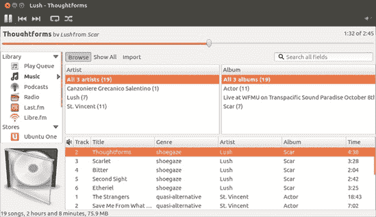
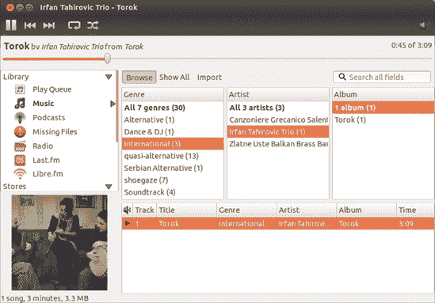
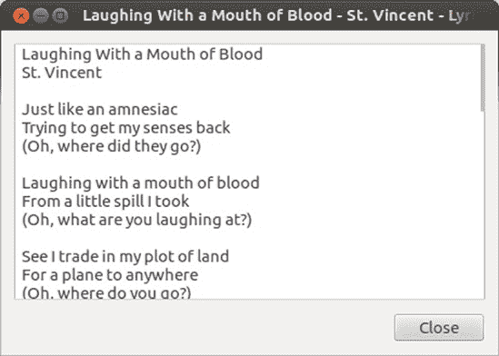
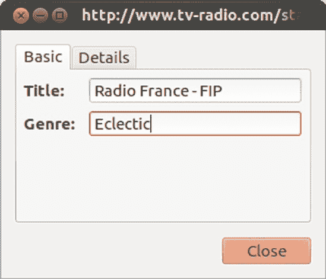
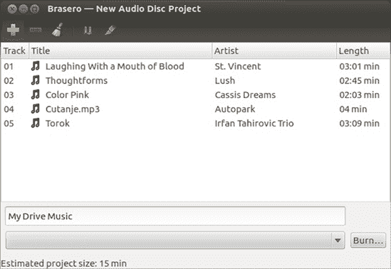
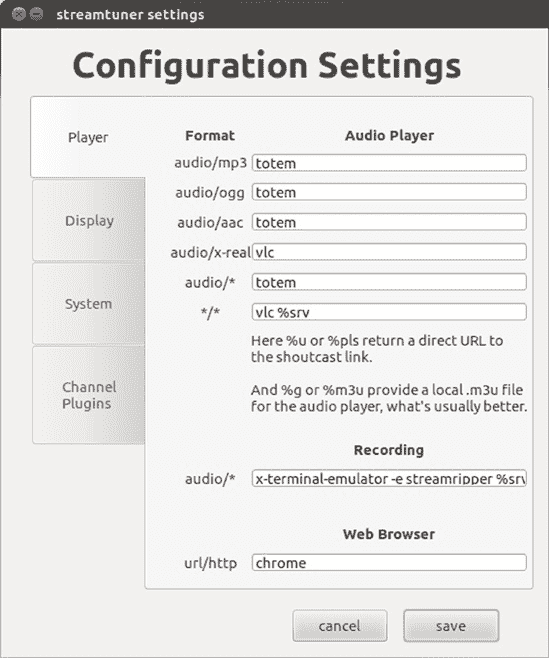
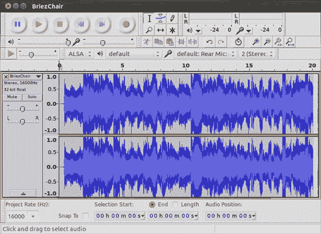
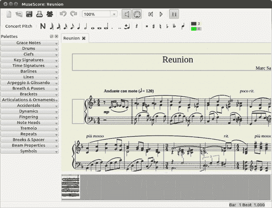
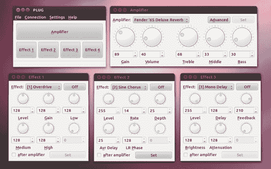

# 第十四章。图克斯摇滚

### Linux 音乐

现在我们来到了音频方面。是的，Linux 确实很酷，在本章中，你将了解到你的系统拥有的音乐才能以及它如何与你拥有的音乐才能协同工作。你将学习如何抓取 CD、创建 MP3 和 Ogg Vorbis 文件（你可以通过它们的 *.mp3* 和 *.ogg* 文件名扩展名来识别这些文件）、添加专辑封面艺术、更改文件标签、播放音乐文件，以及将文件烧录到可以在任何 CD 播放器中播放的音频 CD 上。你还将了解一些可以帮助你成为音乐家的应用程序。然而，如果你对学习如何使用 iPod、iPhone、iPad 或其他数字媒体设备，或者如何将音频文件从一种格式转换为另一种格式感兴趣，那么你将不得不等到第十五章（Chapter 15）。

# 应用程序所在位置

本章中的所有应用程序都可以通过 Dash 运行，方法是点击应用程序透镜，然后点击媒体过滤器按钮。与所有应用程序一样，你还可以通过在 Dash 的搜索框中输入应用程序的名称并按回车键来运行应用程序。

# 音频文件格式

在我们继续前进之前，最好先讨论一下音频数据可以在电脑上存储的各种格式。长期以来，事实上的标准一直是 WAV（由微软/IBM 创建，使用 .wav 扩展名）、AU（来自 Sun/Unix，使用 *.au* 扩展名）和 AIFF（来自苹果，使用 *.aiff* 扩展名），所有这些都是未压缩格式。因此，以这些格式保存的文件都非常大，一张 CD 质量的平均 WAV 文件每分钟大约有 10MB。为了更直观地理解这一点，回到 1988 年，我的第一台 Macintosh 拥有 40MB 的硬盘——比我预想的需要的空间要多，但不足以存储 Nirvana 的“Come as You Are”的 WAV 文件。

随着计算机向今天的多媒体机器进化，很明显，必须对那些消耗磁盘空间的音频文件采取一些措施。因此，开发了音频压缩格式。这些压缩格式通过简化来说，是通过删除人耳听不到的声音信号部分来工作的——有点像狗哨的方法。最广为人知并被广泛接受的这些音频压缩格式是 *MP3*。以 MP3 格式编码的音频文件可以缩小到原始 WAV 文件大小的十二分之一，而不会在质量上产生任何明显的损失。

另一种音频压缩格式是 *Ogg Vorbis*。Ogg Vorbis 是开源社区的产品，因此，与始终在尚未行使的专利权阴影下使用的 MP3 不同，它从一开始就没有专利和许可问题。正因为如此，并且由于它在质量和性能方面与 MP3 相当（许多人声称甚至更好），Ogg Vorbis 成为了 Linux 社区的宠儿。

在本章中提取音频文件时，你一定会注意到另一个编码选项——FLAC。*无损音频编解码器（FLAC）*是一种编码格式，与 MP3 和 Ogg Vorbis 格式不同，它在编码过程中不会从音频文件中删除任何音频信息。缺点是 FLAC 只能提供 30% 到 50% 的空间节省，远低于 MP3 或 Ogg Vorbis 达到的 80% 左右。当然，优点是 FLAC 文件在质量上应该与 CD 相当。

考虑到音频质量的保留，如果你对 Ogg Vorbis 或 MP3 文件提供的音频质量不满意，FLAC 是一个理想的选择。如果你想要创建 Ogg Vorbis 和 MP3 文件，或者你还没有决定要使用哪一种，FLAC 同样是一个不错的选择。在这种情况下，你可以直接将其编码为 FLAC 格式。正如我之前提到的，一旦你到达 第十五章，你将学习如何在你确定需要什么或需要什么时转换 FLAC 文件。

# 为音频应用安装 MP3 支持

不论是关于 Ogg Vorbis 和 FLAC 的讨论，还是许多人仍然喜欢或需要处理 MP3 文件。例如，你可能已经从你的音乐收藏中提取了大量的 MP3 文件，或者你可能喜欢收听那些以 MP3 格式广播的众多网络电台流。不幸的是，由于版权问题，MP3 播放和编码支持并未包含在 Ubuntu 中。即使你计划在未来的提取和编码工作中使用 Ogg Vorbis 格式，安装 MP3 支持也是一个好主意，以便覆盖你所有的音频需求。这同样是一个非常简单的过程。实际上，如果你在最初安装 Ubuntu 时选择了安装第三方软件支持，你很可能已经拥有了所有需要的支持文件。

如果您在首次安装 Ubuntu 时没有选择安装第三方软件，那么安装 MP3 播放支持的最简单方法是通过双击您硬盘上的 MP3 文件。会出现一个窗口，询问您是否要搜索播放该文件所需的插件。点击 **搜索**，之后会出现另一个窗口，显示您需要安装的内容（图 14-1

图 14-1. Ubuntu 帮助您找到所需的插件。

# Rhythmbox——Ubuntu 的默认音频播放器

Ubuntu 中的主要音频播放器，称为 Rhythmbox（见图 14-2)，其功能基本上类似于苹果的 iTunes 应用程序的简化版。这个相对容易使用的播放器，尽管有一些小问题，但在 Linux 界已经积累了一定的用户群。

图 14-2. Rhythmbox 音频播放器

## 将歌曲和专辑添加到 Rhythmbox 库中

如果您熟悉苹果的 iTunes，那么您应该理解 Rhythmbox 中的库，因为它本质上是一个相同的概念。Rhythmbox 应该会自动导入您在 *音乐* 文件夹中的所有内容，而无需您做任何额外的工作。如果由于某种原因没有这样做，或者如果您还想添加来自另一个目录的音乐，您可以通过转到 **音乐** 菜单，选择 **导入文件夹**，然后导航到您想要添加的新专辑的文件夹来实现。

如果您希望事情不要如此自动化，只想添加您想要的内容，您可以打开首选项窗口（**编辑** ▸ **首选项**），点击音乐选项卡，然后取消选中“监视我的库中的新文件”复选框。之后，您可以通过转到 **音乐** ▸ **导入文件夹** 来将新专辑或组添加到您的 Rhythmbox 库中。如果您只想添加单个音频文件，您也可以这样做——选择 **音乐** ▸ **导入文件**，然后导航到您想要添加的歌曲。

如果您不喜欢导航，您也可以通过其他方式添加文件和文件夹。最简单的方法是将您想要添加到库中的文件夹或歌曲拖放到 Rhythmbox 窗口的右侧面板中。您也可以通过右键单击文件并在弹出的菜单中选择 **打开方式** ▸ **使用 Rhythmbox 音乐播放器打开** 来直接将歌曲添加到库中。

## 使用 Rhythmbox 拷贝音频 CD

与 iTunes 一样，Rhythmbox 允许您直接从 CD 抓取歌曲；将它们转换为 Ogg Vorbis、MP3 或其他音频格式；并将抓取的曲目添加到其音乐库中。步骤如下：

1.  打开首选项窗口（**编辑** ▸ **首选项**），点击**音乐**选项卡，并选择您想要使用的编码格式（默认为 Ogg Vorbis）。完成操作后，点击**关闭**。除非您经常更改编码格式，否则您不需要重复此操作。

1.  如果您选择了一个尚未安装支持的编码格式，例如 MPEG Layer 3 音频（MP3），则在首选格式下拉菜单下方将出现一个**安装使用此格式所需的其他软件**按钮（图 14-3

    图 14-3. 在 Rhythmbox 中选择编码格式

1.  安装完成后，关闭首选项窗口，并在 Rhythmbox 主窗口的左侧面板中选择您的音频 CD。

1.  所有曲目和专辑信息将显示在窗口的右侧面板中（图 14-4

    图 14-4. 从 Rhythmbox 内部抓取 CD

## 浏览 Rhythmbox 库

Rhythmbox 库，您可以通过点击 Rhythmbox 窗口左侧面板中的**音乐**来使其可见，是您添加到其中的所有音乐的集合。随着收藏的增长，这可能会显得有些难以管理。幸运的是，Rhythmbox 有一个很好的浏览器功能，类似于 iTunes 中的功能，可以通过点击位于主面板左上角的**浏览**按钮来切换开启和关闭。此功能允许您在主库列表上方的两个单独的面板中看到艺术家和专辑的列表。如果您在艺术家面板中点击一个特定的艺术家，该艺术家专辑的列表将出现在右侧面板中。然后，您可以通过双击右侧面板中的专辑来播放它。如果您想播放该艺术家所有的专辑，只需在左侧面板中双击艺术家的名字。总的来说，这是一个非常实用的功能。

如果您想在浏览器中添加一层分类，可以通过添加流派面板来实现。为此，只需转到**编辑**菜单，选择**首选项**，选择出现的窗口的**常规**选项卡，然后选择**流派、艺术家和专辑**。在首选项窗口中点击**关闭**按钮后，您将在 Rhythmbox 中拥有一个三面板浏览器（图 14-5）。

## 在 Rhythmbox 中创建播放列表

当然，您还可以进一步定制，以适应您每一种情况和每一种心情。毕竟，有些时候您可能会觉得有点太飘渺，不适合亚当·兰伯特（感谢这一点）。为了准备这样的时刻，您可以创建**播放列表**，这些播放列表是按预定顺序播放的歌曲列表。只需将每个播放列表想象成一个点歌电台 . . . 其中所有的点歌都是您自己的。

图 14-5. Rhythmbox 浏览器展开的分类

要在 Rhythmbox 中创建播放列表，请选择**音乐** ▸ **播放列表** ▸ **新建播放列表**。当播放列表图标出现在 Rhythmbox 窗口的左侧面板时，为列表输入一个名称并按回车键。点击左侧面板中的音乐图标以显示您的音乐库内容。然后，只需将歌曲从库面板拖动到播放列表图标即可添加您想要的歌曲。歌曲本身将保留在库中，所以您实际上并没有移动任何东西——只是创建了别名。

您还可以创建**自动播放列表**，这些列表会自动扫描库以查找符合您创建标准的歌曲。例如，您可能选择创建一个包含您库中所有特定艺术家或特定流派歌曲的列表。为此，请选择**音乐** ▸ **播放列表** ▸ **新建自动播放列表**。将出现一个窗口，您可以在其中指定列表应包含的内容。您甚至可以指定列表中要包含的歌曲数量。

创建完您的列表后，您可以通过单击一次列表然后单击窗口顶部附近的**播放**按钮来播放列表（或者直接双击列表）。

## 通过 Rhythmbox 访问 Ubuntu One 音乐商店

与 iTunes 商店类似，Rhythmbox 为您提供访问 Ubuntu *One 音乐商店*的权限，该商店提供来自 7digital 目录的主要艺术家的音乐。那里出售的歌曲不受许多其他在线商店购买的许多歌曲中存在的数字版权管理（DRM）限制。Ubuntu One 音乐商店还支持云服务，因此您购买的所有内容都将发送到您的 Ubuntu One 云，然后您可以从那里将购买的内容下载到您的其他设备。（需要 Ubuntu One 账户，但您可以免费获得一个，包含 5GB 的免费存储空间。）

## Rhythmbox 中的其他酷炫功能

Rhythmbox 还有一些值得注意的酷炫功能。其中之一是自动下载并显示您当前播放的歌曲的歌词的功能。要使用此功能，您必须首先通过转到**编辑**菜单并选择**插件**来激活它。在出现的配置插件窗口中（图 14-6

图 14-6. 激活 Rhythmbox 的歌词检索和显示插件

图 14-7. Rhythmbox 显示当前播放的曲目歌词。

另一个酷炫的功能是 Rhythmbox 能够显示您收藏中的歌曲的专辑封面。专辑封面显示在窗口的左下角以及出现在屏幕右上角短暂弹出的通知中。不幸的是，目前这个功能只适用于那些已经嵌入专辑封面信息的歌曲，例如您在线购买的歌曲。下载并显示您自己抓取的曲目专辑封面的功能仍然存在问题，并且自切换到 Unity 桌面环境以来一直如此。仍在寻找解决方案，因此这个功能可能在未来的更新后恢复正常。

# 项目 14：使用 Rhythmbox 收听流媒体

除了允许您播放音频 CD 或您存储在硬盘上的音乐外，Rhythmbox 还允许您播放 MP3 或 Ogg Vorbis 格式的网络广播流。要收听，只需在左侧面板中点击“广播”，然后在主面板中找到要播放的流。一旦您做出了选择，您可以通过双击或选择它然后点击窗口左上角的绿色播放按钮来开始播放。

## 14-1: 将广播流添加到 Rhythmbox

您也可以将流添加到 Rhythmbox 中。要开始，让我们尝试添加 FIP，这是一个专门播放另类音乐的法国音乐电台。添加 FIP 的过程基本上与添加任何其他流相同。以下是步骤：

1.  在 Rhythmbox 窗口的左侧面板中点击**广播**。

1.  在主面板的左上角，点击**添加**按钮。

1.  在出现的窗口中，输入[`www.tv-radio.com/station/fip_mp3/fip_mp3-128k.m3u`](http://www.tv-radio.com/station/fip_mp3/fip_mp3-128k.m3u)并点击**添加**。

1.  双击你的流的新条目来播放它。

## 14-2: 在 Rhythmbox 中更改流的标题和信息

你刚才所做的一切的唯一问题是，在 Rhythmbox 窗口中出现的流的标题是你输入的 URL，流派显示为*未知*。不用说，这并不是一个特别方便的方法，尤其是当你有多个流列表并需要从中找出是什么时。

图 14-8. 在 Rhythmbox 中更改流的标题和流派属性

解决这种状况是一个简单的过程。只需右键单击流，并选择**属性**。在出现的窗口中，更改标题和流派框的内容，使其对你更有意义。如图图 14-8 所示，我使用了 Radio France - FIP 作为标题，Eclectic 作为流派。

# 创建音频 CD

所有关于编码和在你的电脑上收听 MP3 和 Ogg Vorbis 文件的讨论听起来都很不错，但毫无疑问，你有时会希望你的歌曲在一张普通的音频 CD 上，这样你就可以在前往新泽西州际公路或文图拉高速公路的路上播放。幸运的是，这很容易做到，而且有几种方法可以做到这一点。

## 使用 Rhythmbox 刻录音频 CD

对于 Rhythmbox 用户来说，最简单的方法是在 Rhythmbox 内部完成所有操作。为此，首先创建一个包含你想要刻录到 CD 的歌曲的播放列表，然后点击左侧面板中该列表的图标，然后点击主面板顶部的**刻录**按钮。我们首次在第七章中讨论的磁盘刻录应用程序 Brasero 将接管，打开一个显示要刻录的文件（图 14-9）的窗口。将空白光盘放入驱动器，并点击**刻录**按钮。在出现的属性窗口中，只需点击**刻录**按钮，刻录过程就会开始。你可以在出现的小窗口中跟踪刻录进度。当过程完成后，进度窗口将消失，你的新音频 CD 应该从驱动器中弹出。很简单。

图 14-9. 使用 Rhythmbox 和 Brasero 刻录音频 CD

## 直接使用 Brasero 刻录音频 CD

你也可以直接从 Brasero 中创建一个“随时随地播放”的音频 CD，从你已抓取的 MP3 和 Ogg Vorbis 文件开始，从而绕过 Rhythmbox。要采取这条路线，从 Dash 中运行 Brasero，并将一张空白 CD 放入驱动器（并关闭任何弹出窗口，询问如何处理它）。当 Brasero 出现时，点击**音频项目**。现在将任何歌曲混合（任何音频格式混合）添加到窗口的空白区域。你可以通过点击添加按钮（看起来像绿色的加号）然后导航到要添加的歌曲来实现。你也可以直接从任何打开的文件管理器窗口拖拽文件到 Brasero 窗口。

当你将歌曲添加到 Brasero 窗口时，窗口底部的条形（在图 14-9) 将显示光盘上还有多少空间可用。注意这一点，以免队列中包含光盘无法容纳的内容。一旦你准备好了，过程就像前一个部分所描述的那样：点击**烧录**按钮，然后点击随后出现的设置窗口中的**烧录**。将出现一个进度窗口，一旦烧录完成，Brasero 将会通知你并弹出光盘。然后你可以将光盘放入你的车载音响或其他你想播放的地方，享受结果。

# 其他酷炫的音频应用程序

我迄今为止所介绍的应用程序只是 Ubuntu 为你准备的众多选择中的一小部分。你可以通过浏览 Ubuntu 软件中心列出的提供物来查看其他可用的选项。尝试它们，如果你喜欢就保留，不喜欢就删除。毕竟，在 Linux 中这不会让你花费任何费用。

为了给你一个起点，我将提到一些我认为值得调查的应用程序。

## 替代播放器

如果我在本章中介绍的音乐播放器已经激起了你对更多选择的渴望，那么你很幸运——还有很多其他的选择，正如浏览 Ubuntu 软件中心的“声音与视频”类别所揭示的那样。查看 Exaile、Banshee、Audacious 和 Listen 以开始使用。哦，而且正如你将在第十六章中了解到的那样，如果你还没有发现，系统自带的 Movie Player 也可以作为音频播放器使用。哇。

## 使用 Streamtuner2 流媒体音乐

如果你是一个互联网广播爱好者，可能没有比 Streamtuner2 (图 14-10) 更方便的应用程序了。Streamtuner2，正如其名所示，是一个在线广播流调谐器。它通过从各种来源下载可用的流列表来工作，然后你可以轻松地浏览。当你找到你喜欢的内容时，只需双击流（或者只是选择流，然后点击窗口左上角的绿色播放按钮），流就会在你的选择播放器中打开。

对于大多数流媒体，默认的播放器是 Audacious，但该应用程序并不包含在 Ubuntu 中（尽管可以从 Ubuntu 软件中心下载），因此您需要选择一个替代方案。您可以在第一次运行 Streamtuner2 时做出这个选择，因为您将看到的第一个窗口是设置窗口。在那个窗口中，将默认条目从 Audacious 更改为您喜欢的任何音频播放器。播放器的名称通常由应用程序的全小写名称表示。

图 14-10。使用 Streamtuner2 浏览互联网广播流

例如，我喜欢使用 Movie Player 应用程序，正如您将在第十六章中了解到的那样，它不仅播放电影，而且音频效果也很不错。在这种情况下，我将所有`audacious`条目更改为**`totem`**，这是 Movie Player 的项目名称。（我保留了 VLC 的条目不变。您将在第十六章中了解到这个有用的应用程序。）

您还需要更改 Web 浏览器设置，因为指定的浏览器也没有包含在 Ubuntu 中。将该条目更改为**`firefox`**，或者如果您已经安装了它，**`chrome`**。您的窗口应该看起来像图 14-11。完成设置后，点击保存。如果您将来想再次更改设置，可以通过转到**编辑**菜单并选择**属性**来访问此窗口。

图 14-11。在 Streamtuner2 中更改设置

您会高兴地知道，您可以复制您正在收听的流（甚至那些您没有收听的）并将它们保存为 MP3 文件。Streamtuner2 通过一个名为 Streamripper 的后台应用程序来设置此操作，您需要单独安装它。（在 Ubuntu 软件中心中搜索并正常安装。）安装完成后，您可以通过在 Streamtuner2 中右键单击目标流然后点击窗口顶部的红色记录按钮来从 Streamtuner2 中录制流。

## Ex Falso 和 EasyTAG

对于真正的音频爱好者，有一些应用程序允许您更改 MP3 和 Ogg Vorbis 音乐文件的标签。EasyTAG 是两个中功能更全面的，但 Ex Falso(图 14-12)的用户界面更友好。尝试一下这两个，看看您的想法。

图 14-12。在 Ex Falso 中编辑 MP3 和 Ogg Vorbis 文件标签

# 音乐制作者的应用程序

我之前提到的音频应用实际上都是面向音乐聆听方面的。也有许多面向喜欢制作音乐的人的应用。在本节中，我将介绍其中一些最有用或至少最有趣的。

## Audacity

虽然 Audacity(图 14-13)不是一个纯粹的音乐制作应用，但在用户数量方面，它是录音和编辑应用中的王者，不仅在 Linux 世界，而且在很大程度上在 Mac 和 Windows 世界中也是如此。Audacity 允许你录制声音文件，然后编辑它们，调整音高，增加和减少速度，添加回声和其他效果，等等。好吧，还有各种其他酷炫的功能。你可能会发现自己使用 Audacity 的方式比你想象的要多。

图 14-13. 使用 Audacity 进行音频录制和编辑

## Ardour 和 LMMS

Ardour (图 14-14) 和 LMMS 是两个最常用的 Linux 数字音频工作站，它们都属于流行的专业数字音频工作站 Avid Pro Tools 的类别。数字音频工作站基本上是虚拟的混音室，允许你录制、编辑和播放音乐。它们还允许你在程序内部创建音乐。我对这类应用不是专家，但许多人说 LMMS 在创作方面更强，而 Ardour 在录制/编辑领域更强。当然，找出最适合你需求的最简单方法是尝试两者。

## MuseScore

如果你需要打印乐谱，你可以转向简单而功能强大的音乐记谱程序 MuseScore。MuseScore(图 14-15)允许你通过鼠标、键盘或 MIDI 设备创建乐谱，每行最多有四个声部。它还允许你播放你放在页面上的作品。这对于像我这样的人来说是一个很好的功能，我们不会读乐谱，但发现自己想根据乐谱找出旋律。只需将音符复制到 MuseScore 的页面中，点击播放按钮，那难以捉摸的旋律就会在你的耳边（以及你的眼前）出现。

图 14-14. Ardour，Linux 数字音频工作站

图 14-15. 使用 MuseScore 在纸上记谱

## 使用 PLUG 提升音量

在你们中间的吉他手，尤其是那些拥有 Fender Mustang 放大器（I-IV）的吉他手，可能会失望地得知，通常与你们的放大器一起提供的 Fender 的 Fuse 软件与 Linux 不兼容。好消息是有一个名为 PLUG 的应用程序作为解决方案（图 14-16）。像 Fuse 一样，PLUG 可以用来创建和编辑放大器预设，并将它们上传到你们的放大器。使用 PLUG 就像创建和修改你们自己的踏板，只是虚拟的，而不是在你们面前地上。你们还可以通过 PLUG 为你们的放大器应用固件更新。

图 14-16. 使用 PLUG 编辑和创建 Mustang 放大器预设

PLUG 不能通过 Ubuntu 软件中心获取，但它可以作为一个预编译的二进制文件轻松下载，运行良好。从项目网站[`piorekf.org/plug/download/`](http://piorekf.org/plug/download/)获取 PLUG，并下载 32 位系统的通用包。这是一个二进制 tar 包，所以你们不会安装它，而是从你们的主文件夹中提取并运行它，就像在第八章中处理的一些应用程序一样。一旦下载了 tar 包，将其提取到你们在第八章中创建的*LocalApps*文件夹（或你们喜欢的任何其他地方）。要运行它，双击文件夹中的 PLUG 文件，然后在出现的对话框中点击**运行**。

在 PLUG 能够识别你们的放大器之前，你们需要做一些工作来解决这个问题：Ubuntu 只允许 root 用户访问未知 USB 设备，而你们的放大器将会是。如何做到这一点的说明可以在*PLUG*文件夹中的*README*文件中找到。

## Hydrogen & Mixx

在结束之前，我会非常简短地提一下另外两个值得注意的应用程序，如果不是因为它们在所做的事情上相当酷的话。一个是 Hydrogen（图 14-17），这是一个 Linux 的数字鼓机。它旨在提供，正如项目页面所说，“专业且简单直观的基于模式的鼓编程。”另一个是 Mixx（图 14-18），这是一个跨平台、功能齐全的数字双盘 DJ 混音器。

图 14-17. Hydrogen，一个数字鼓机

图 14-18. Mixx，一个跨平台 DJ 混音器
