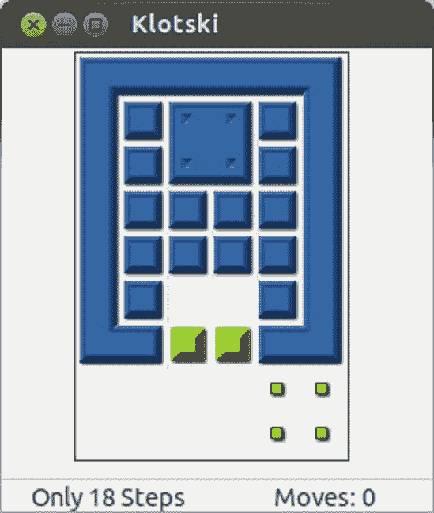
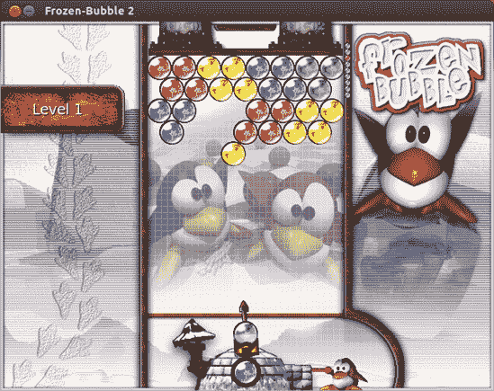
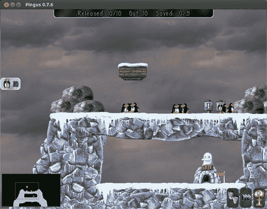
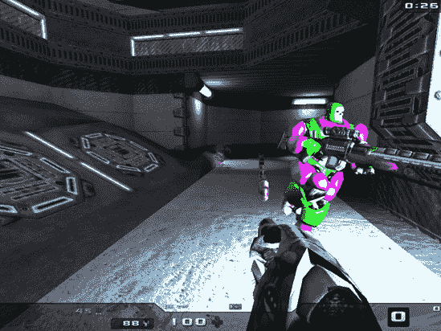
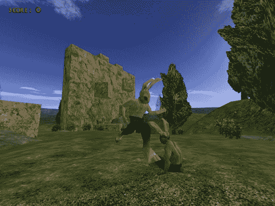
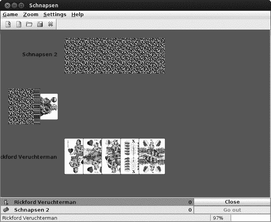
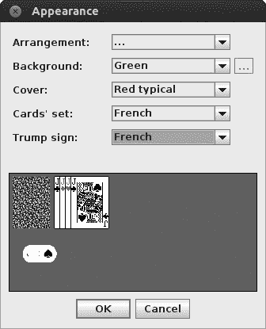
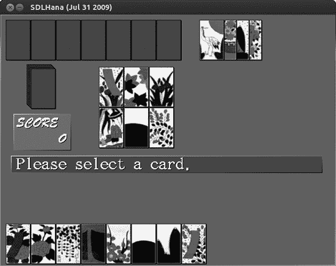
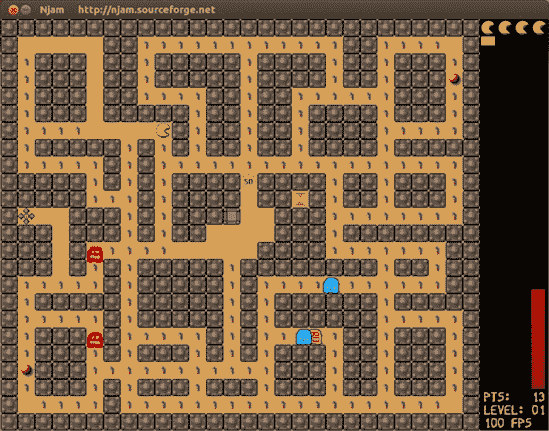
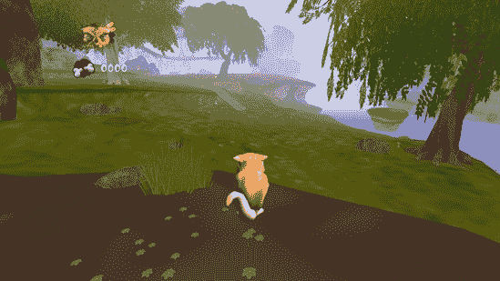

# 第十七章. 羽毛翻飞

### Linux 游戏

许多人不愿承认，但游戏几乎对每个使用个人电脑的人来说都是一个巨大的吸引力。即使那些否认自己是游戏玩家的人，也常常发现自己在工作项目之间玩快速的一轮单人纸牌游戏。作为一名 Linux 用户，你很可能会发现，其他操作系统的用户向你询问 Linux 最常见的问题之一是“它有什么游戏？”虽然 Linux 世界中的游戏可能没有 Windows 星球上的那么多，但 Linux 仍然有很多可供选择。事实上，大多数 Linux 发行版都附带了一些游戏。

以 Ubuntu 为例，它自带了 AisleRiot Solitaire（超过 80 种单人纸牌游戏，如图图 17-1

图 17-1. AisleRiot

# 应用程序所在之处

本章中的大多数应用程序都可以通过 Dash 运行，方法是点击应用程序透镜，然后点击游戏过滤器按钮。任何例外情况将在相关部分中说明。与所有应用程序一样，你还可以通过在 Dash 的搜索框中输入应用程序的名称并按回车键来运行应用程序。

# 项目 17A：通过 Ubuntu 软件中心扩展你的游戏收藏

通过 Ubuntu 软件中心扩展你的游戏库非常容易。在这个项目中，你将通过安装一些经典的 Linux 游戏来填补几个游戏空白。这个项目中的步骤基本上是对你在第六章（ch06.html "第六章. 完善鸟类"）中学到的内容的复习，所以将不会有任何挑战性的工作——只需启动 Ubuntu 软件中心并点击即可。

## 17A-1: 安装经典 GNOME 游戏

旧版本的 Ubuntu 曾经附带一套游戏，这些游戏是 GNOME 桌面环境的一部分。这些游戏包括几个传统经典，如益智游戏 Klotski (图 17-2)，这是一个挑战性的方块移动练习，还有 Tetravex (图 17-3)，你可以将其视为三角形的多米诺骨牌。其他游戏还包括 Same GNOME（Same Game 的 GNOME 版本，一种日本弹珠匹配游戏）、Tali（一种古老的罗马骰子扑克）、Iagno（Reversi 的 GNOME 克隆）、Nibbles（一种老式的蛇形游戏）、Five or More（基于旧 Windows 游戏 Color Lines 的匹配游戏）、Robots（一个小巧的“经典”游戏，你在其中四处跑动以避开机器人）、Blackjack 和 Chess。

图 17-2. Klotski

图 17-3. Tetravex

现在所有这些都可以从 Ubuntu 软件中心单独下载和安装，所以你现在可以只安装你真正喜欢的，或者一个都不安装。

## 17A-2：安装一些 Linux 经典：Frozen Bubble、Tux Racer 和 Pingus

几款其他游戏可能被称为 Linux 经典，要么是因为它们是 Linux 原创，要么是因为它们以企鹅为主题，以纪念 Linux 可爱的企鹅吉祥物 Tux。其中最知名和最受欢迎的一款是 Frozen Bubble (图 17-4). Frozen Bubble 可以被认为是终极的 Linux 经典：它是为 Linux 编写的，以 Linux（企鹅）为主题，Linux 版本总是首先发布。它后来被移植到 Mac OS、Windows，甚至 iPhone 和 Android 系统，但 Frozen Bubble 的灵魂是纯粹的企鹅。

Frozen Bubble 的目标很简单：通过匹配相同颜色的气泡来清除屏幕，以便你可以进入下一关。这听起来可能很无聊，但别担心——你很快就会上瘾。

你可能还会对另一款 Linux 主题游戏 Pingus (图 17-5)感兴趣，这是一款基于经典游戏 Lemmings 的传统迷宫游戏。你的目标是带领你的一群可爱的小企鹅安全通过每个关卡，不要让他们在等待他们的危险障碍物上被撞成碎片。游戏包括 22 个可玩关卡，如果你感到好奇，可以尝试玩一些未测试的关卡——总共有 200 多个！有关玩这些额外关卡的操作说明，请访问[`pingus.seul.org/faq.html`](http://pingus.seul.org/faq.html)。

图 17-4. Frozen Bubble

图 17-5. Pingus

# 3D 游戏

我之前提到的游戏大多数都是有点，嗯，好吧，是二维的。当然，2D 游戏可以很有趣——我确实因为数独游戏浪费了很多时间——但它们没有从射击外星人群或将高性能跑车撞向墙壁中获得的兴奋感。不幸的是，游戏设计师传统上忽视了 Linux，专注于更大的 Windows 市场，所以直到几年前，可供选择的 Linux 友好型 3D 游戏很少。然而，随着企鹅（Linux 的象征）的流行，人们开始注意到这一点，现在越来越多的 Windows 游戏都附带 Linux 版本。

开源游戏社区也取得了飞跃性的增长，现在有一些真正高质量的游戏。在本节中，我将会介绍一些我最喜欢的游戏，但首先请确保您的电脑能够承受 3D 图形的负担。

## 检查硬件加速

要玩 3D 游戏，您需要一个能够处理**硬件加速**的显卡。如果没有硬件加速，您的电脑处理器必须尝试自己完成所有复杂的图形渲染（这项任务它并不适合），因此您的游戏最终会以蜗牛般的速度运行，甚至可能无法运行。大多数现代显卡都内置了硬件加速支持，但是否启用将取决于您显卡的 Linux 驱动程序状态。您可以在[`wiki.ubuntu.com/HardwareSupportComponentsVideoCards/`](https://wiki.ubuntu.com/HardwareSupportComponentsVideoCards/)上了解您显卡的 3D 支持情况。

如果您只想知道您是否拥有玩游戏所需的最小加速级别，那么请打开 Dash，打开终端，输入**`glxinfo | grep rendering`**，然后按回车键。（那个竖线是“管道”符号，通常可以通过按键盘上的 shift 键和`\`键插入。）如果您收到一条消息说 glxinfo 未安装，请使用 Ubuntu 软件中心安装*mesa-utils*，然后再次尝试。

如果启用了硬件加速，您将在终端中看到“直接渲染：是”出现。这是个好消息，因为它意味着您可以跳到下一部分，享受一些 3D 游戏的乐趣。

如果您收到的是“直接渲染：否”的消息，那么您需要安装不同的显卡驱动程序才能实现硬件加速。请参阅显示和显卡问题中的游戏/Unity 无法工作：安装加速显卡部分以获取说明。

### 注意

许多 Linux 默认的图形驱动程序无法处理*抗锯齿*功能，这是一种去除图形锯齿边缘的特性，使图形看起来更平滑、更逼真。如果你不能没有抗锯齿功能，请参阅第二十二章以获取有关安装更好的图形驱动程序的信息。

## 射击游戏

和许多人一样，我的第一次真正的 3D 游戏体验是第一人称射击（FPS）游戏。事实上，我仍然对 Doom 情有独钟，它可以说是所有 FPS 的鼻祖。还有什么比在火星的军事前哨站与无尽的恶魔怪物战斗更有趣的呢？没有！

Doom 现在看起来有点过时了，但如果你对这个经典游戏有类似的怀旧之情，你会很高兴地知道有一个适用于 Ubuntu 的版本。它被称为 Freedoom (图 17-6)，你可以从 Ubuntu 软件中心安装它（就像本节中的所有游戏一样）。

图 17-6. Freedoom

Doom 的游戏玩法可能已经优雅地老化，但图形确实没有。如果你觉得像素化的球体无法让你感到恐惧，为什么不尝试一些更平滑的东西，比如 Nexuiz (图 17-7)？在游戏玩法方面，Nexuiz 感觉与 Unreal Tournament 相似——你在昏暗的关卡中奔跑，收集各种武器和升级，射击不同级别（人工）智能的对手。和大多数死亡竞赛风格的比赛一样，目标通常是成为最后一个存活的人，但还有其他游戏模式，如“夺旗”。如果你觉得电脑控制的对手挑战不足，还有在线多人游戏选项。

Tremulous (图 17-8) 是另一个流行的开源 FPS，尽管其游戏玩法也包含实时策略的元素。你在线上游戏，选择人类或外星人的阵营。在你努力摧毁对方队伍的同时，你建立结构并收集升级来获得尽可能多的优势。这可能会变得相当复杂，所以我建议你在开始游戏之前先阅读[`www.tremulous.net/`](http://www.tremulous.net/)上的说明。

图 17-7. Nexuiz

图 17-8. Tremulous

还有许多其他 FPS 可供选择：AssaultCube、Open Arena、Red Eclipse 和 Alien Arena 立刻浮现在脑海中。查看 Ubuntu 软件中心的**游戏** ▸ **街机**部分，看看你还能找到什么。

## 策略游戏

我喜欢第一人称射击游戏，但有时我的反应时间并不够快。如果你觉得在虚拟世界中奔跑并射击东西让你感到寒冷（或笨拙），那么策略游戏可能更适合你的风格。Ubuntu 软件中心中有许多这样的游戏等待被发现，但我还是想在这里提一提几个不错的游戏。

Warzone 2100 (图 17-9) 与 Command and Conquer 系列游戏大致相似。你从一个战场开始，有一小批车辆，你必须指挥它们建立基地并防御敌人。一旦你的基地状况良好，你就可以建造新的单位并将它们派去攻击敌人。然而，你的对手也在做同样的事情，所以战斗可能会变成微妙的战术事务，你必须平衡成功发动攻击的能力与有限的资源可用性和敌人摧毁你基地的持续威胁。

图 17-9. Warzone 2100

如果你发现很难找到时间策划一场完整的军事战役，那么 Hedgewars (图 17-10) 可能更适合你。这是一款流行的 Worms 游戏的克隆版，你将指挥一支装备精良的蚯蚓小队（在 Hedgewars 中是可爱的小刺猬）散布在一个形状奇特的景观中。你们轮流使用你过剩的军火库，以巧妙的方式将对手从地图上清除，在他们有机会对你做同样的事情之前。它绝对值得一玩，仅为了那些有趣的声音……

图 17-10. Hedgewars

值得关注的其他策略游戏包括 0 A.D. 和 Widelands，在那里你将指挥一个古代文明，它在（战斗）已知世界的其他部分定居；Bos Wars，与 Warzone 2100 类似；以及 The Battle for Wesnoth，它有更多的幻想氛围。

## 模拟器

战争并不是每个人的逃避方式，这就是为什么 Linux 上有大量的模拟游戏。我已经尽可能覆盖了所有方面，但就像往常一样，如果你在这里没有找到吸引你的东西，你应该浏览 Ubuntu 软件中心。

当我想起模拟游戏时，我的脑海中立刻浮现出 Sim City，这款备受尊敬的城市建设游戏。作为市长，你负责管理你的城市：你规划建设工作，建设和维护交通线路，并设定预算和税收。再加上一些自然灾害，你手头上的挑战就来了！Linux 版的 Sim City 有 LinCity-NG 和 OpenCity。我更喜欢 LinCity（图 17-11

图 17-11. LinCity-NG

在你们这些热衷于飞行模拟器的玩家中，FlightGear（图 17-12 找到它。对于想要参与度稍低、更具战争色彩的游戏，可以试试 gl-117，这是一款战斗飞行模拟器。或者，那些人道主义者可能会更喜欢搜索与救援游戏，在其中你将驾驶飞机执行各种救援任务。

比 FlightGear 稍微轻松一点的赛车游戏是 Torcs（图 17-13。如果你更喜欢越野赛车，可以看看 Trigger rally 游戏。它不如 Torcs 那么完善，但也能带来一些新鲜感。

如果您允许我对模拟器的定义稍作扩展，有一个很酷的摇滚明星模拟器叫做 Frets on Fire (图 17-14). 游戏玩法非常类似于 Guitar Hero，但有一个主要区别：您使用键盘来弹奏音符，而不是吉他形状的控制器。然而，如果您不介意做一些调整，您可以让您的 Guitar Hero 控制器与 Frets on Fire 一起工作。（见 [`fretsonfire.wikidot.com/using-guitar-hero-controller/`](http://fretsonfire.wikidot.com/using-guitar-hero-controller/)。）塑料吉他或没有，它是一款上瘾的游戏。或者，如果您更喜欢卡拉 OK，总有 Performous。

图 17-12. FlightGear

图 17-13. Torcs

图 17-14. 火上弹奏

## 超出 Ubuntu 软件中心

我希望您到目前为止在我的推荐中找到了一些您喜欢的东西，但这绝对不是一份详尽的列表。数百款在 Ubuntu 上运行但尚未进入 Ubuntu 软件中心的游戏都打包成了 Ubuntu 准备好的 DEB 文件。

PlayDeb ([`www.playdeb.net/`](http://www.playdeb.net/)) 是寻找额外游戏的好地方。PlayDeb 上的所有内容都可以通过其自己的 Ubuntu 友好型软件仓库获取，因此一旦您将 PlayDeb 仓库添加到列表中，您就可以通过 Ubuntu 软件中心安装其游戏。有关详细信息，请参阅 添加额外软件仓库——您需要的 APT 行是 **`deb`** [`archive.getdeb.net/ubuntu`](http://archive.getdeb.net/ubuntu) **`precise-getdeb games`**。

另一个值得探索的选项是 Launchpad 的 PPA 部分。要查看可用的内容，请访问 [`launchpad.net/ubuntu/+ppas?name_filter=game`](https://launchpad.net/ubuntu/+ppas?name_filter=game) 并浏览相当长的列表。其中许多是家庭自制的游戏，所以您在找到的大多数游戏中不要期望太多打磨，但这里也有一些珍宝。您可以在 项目 6B：从 PPA 安装软件——龟竞技场 中找到有关如何安装 PPAs 的说明，位于 APT-URL：从网站安装。

## 商业游戏

我在本章中提到的所有游戏都是免费和开源的，这与 Ubuntu 的常规操作模式相一致。但也有很多商业游戏适用于 Linux；只是要知道在哪里寻找它们。

一些游戏，比如《Doom III》、《Unreal Tournament》和《Enemy Territory》，直接附带了 Linux 安装程序。安装说明通常可以在安装 CD/DVD 上的某个地方找到，通常只是从终端运行安装脚本而已。尽管在 Windows 版本相同的磁盘上提供 Linux 安装程序在大型游戏标题中仍然是一种罕见现象，所以通常需要在网上寻找。一份商业游戏列表，其中一些免费，一些需要付费，以及它们 Linux 安装程序的链接，可以在[`icculus.org/lgfaq/gamelist.php`](http://icculus.org/lgfaq/gamelist.php)找到。维基百科也有一些建议的 Linux 游戏列表，这些列表会定期更新：从[`en.wikipedia.org/wiki/Linux_gaming`](http://en.wikipedia.org/wiki/Linux_gaming)开始，看看链接会带你去哪里……

如果整个下午在网上搜寻好游戏听起来并不那么吸引人，那么让其他人帮你收集真正的精华如何？这正是相当出色的*Humble Bundles*的宗旨：它们是跨平台游戏集合（所有这些游戏都可以在 Linux、Windows 和 Mac OS 上运行），偶尔会以“你想要支付多少就支付多少”的方式提供。根据你选择支付多少，你还可以获得额外的游戏和功能。作为额外的激励，如果捆绑包的销售足够好，那么捆绑包中的某些游戏有时会开源。这就是 Gish（在这个游戏中，你扮演一个快乐的小油滴，在各个级别和迷你游戏中滑动和滚动）和 Lugaru（图 17-15)的情况，它讲述了一只擅长武术的兔子为了报复狼和兔子阴谋者的家人和朋友的死亡而踏上复仇之旅。这两个现在都可以在 Ubuntu 软件中心免费获得。

图 17-15. Lugaru，你在其中扮演一个愤怒的空手道兔子

要获得 Humble Bundle，你必须迅速行动——通常，这些优惠只提供很短的时间——在那之后，你只能以固定价格单独购买游戏。有关即将推出的捆绑包的详细信息，请查看[`www.humblebundle.com/`](http://www.humblebundle.com/)。Wikipedia 上还有一个所有先前集合的列表([`en.wikipedia.org/wiki/Humble_Indie_Bundle`](http://en.wikipedia.org/wiki/Humble_Indie_Bundle))；虽然你不能再直接购买那些捆绑包了，但它仍然是一个有用的列表，列出了你可能会想要探索的优秀的、对 Linux 友好的游戏。

另一个商业游戏的潜在来源是 Ubuntu 软件中心。它最近才开始接受付费软件进入其列表，但你可以通过其熟悉的界面获取的商业游戏数量一直在增加。要查看提供的软件，请启动软件中心并点击“所有软件”按钮右侧立即向下的小箭头。从弹出的菜单中选择**购买**；然后浏览软件中心窗口主面板中出现的列表。在我撰写本文时，列表中的大部分软件都是游戏（尽管这里也有其他类型的商业软件），大多数价格在 5 到 20 美元之间。例如，获奖的益智游戏《世界之胶》，它要求你用一团黑色粘稠物搭建摇摆的结构，售价相当合理，为 19.95 美元（如果你想在购买前尝试，可以下载 DEB 包的演示版本；请访问[`worldofgoo.com/dl2.php?lk=demo`](http://worldofgoo.com/dl2.php?lk=demo)）。另一个顶级的益智游戏是《Braid》（价格稍低，为 10 美元），在这个游戏中，你必须通过修改时间的流动来解决谜题。正如你在第六章中看到的，安装商业软件与从软件中心安装其他任何东西非常相似，只是多了一个支付步骤。要了解完整情况，请参阅 6A-4：商业软件与免费软件。

在第十九章中，我将解释您如何使用 Wine 在 Ubuntu 中运行 Windows 游戏。实际上，这就是许多人享受那些没有 Linux 版本的商业大作的乐趣：Guild Wars、Spore 和 Call of Duty 只是几个可以在这种情况下完美运行的游戏的例子。如果您觉得这符合您的口味，项目 19C：运行 Windows 程序将特别吸引您；在那里您将学习如何使用一个叫做 PlayOnLinux 的小巧应用，它可以用来处理在 Wine 下运行不太受支持的游戏时通常需要的许多繁琐的配置。

# 项目 17B：安装基于 Java 的游戏：Schnapsen

如您从本章迄今为止讨论的大多数游戏中可以看到，Ubuntu 软件中心是大多数 Linux 游戏的一站式购物场所。然而，您也了解到，还有许多游戏超出了 Ubuntu 软件中心的内容。这些包括您在第八章中使用的，用脚本语言编写的游戏，如基于 Python 的 pyWings 和基于 Tcl/Tk 的 Briscola，但似乎不应该遗漏用可能被认为是所有脚本语言之母的 Java 编写的游戏。在这个项目中，您将学习如何安装 Java 运行环境，以及如何安装和运行经典奥地利纸牌游戏 Schnapsen 的 Java 版本。

## 17B-1：安装 Java 运行环境

要运行基于 Java 的应用程序或*脚本*，您首先需要安装 Java 运行环境。如果您在系统安装过程中选择了安装第三方软件，那么您已经安装了 Java 运行环境，因此您可以跳过项目中的这部分内容，继续进行 17B-2 部分。如果没有，您现在可以通过 Ubuntu 软件中心下载它。只需搜索并安装*openjdk java 6 runtime*。整个 Java 软件包在下载重量方面相当庞大，所以如果下载时间比平时长，请不要感到惊讶。当过程完成后，关闭 Ubuntu 软件中心，继续下一步。

## 17B-2：获取和提取 Schnapsen

一旦安装了 Java 运行环境，您就需要运行一个 Java 应用程序来看到它的工作情况。您将要安装的应用程序是我自从进入 Linux 世界以来一直在寻找的，这是一个名为 Schnapsen 的 20 张牌的奥地利纸牌游戏，如图图 17-16 所示。

图 17-16. 奥地利纸牌游戏 Schnapsen 的 Java 版本

要开始，您需要下载并提取 Schnapsen。以下是您需要做的：

1.  打开您的网络浏览器并访问[`projects.hagru.at/tjger/en/`](http://projects.hagru.at/tjger/en/)。

1.  在该页面上，点击左侧框架中的**Schnapsen**链接。

1.  在右侧框架中点击**Schnapsen.zip**。继续点击 Schnapsen 链接，直到到达下载页面。

1.  一旦您点击到下载页面，会出现一个 Opening Schnapsen_1.00.zip 窗口。通过点击**OK**接受默认设置，*Open with Archive Manager*。

1.  当出现归档管理器窗口时，点击**Extract**按钮，这将打开提取窗口。

1.  在该窗口中，点击**Create Folder**按钮，在您的 Home 文件夹内创建一个名为*Schnapsen*的文件夹。

1.  在该窗口中点击**Extract**按钮，当提取过程完成后，在进度窗口中点击**Quit**。

## 17B-3: 运行和英文化 Schnapsen

现在 Schnapsen 已存放在您的 Home 文件夹中，是时候运行它了，假设您不读德语，将其设置为英语。打开一个新的终端窗口并执行以下操作：

1.  通过输入**`cd Schnapsen`**并按回车键进入新的 Schnapsen 文件夹。

1.  输入**`java -jar Schnapsen.jar`**（确保在`java`和`-jar`之间有一个空格，并在`Schnapsen`的开头使用大写字母*S*）并按回车键。Schnapsen 很快就会出现，之后您就可以开始玩了……如果您能读德语。

如果您想知道，这里就是您在上一个命令行中做了什么：命令字符串的第一部分`java`调用 Java 运行时环境；随后的`-jar`标志告诉 Java 您将运行一个 JAR 文件，这就是 Java 脚本被称为什么；最后一部分是您要运行的文件，*Schnapsen.jar*。（将来，如果您选择运行其他基于 Java 的应用程序，只需遵循相同的模式：`java -jar` *`application_name`*`.jar`。）

1.  要将界面切换为英语，请转到**Einstellungen**菜单并选择**Sprache** ▸ **Englisch**。

1.  如果您不熟悉德语纸牌的花色和牌面（在本游戏中称为传统），您可以通过访问**Settings**菜单，点击**Appearance**，然后在外观窗口中在**Cards’ set**和**Trump sign**菜单中选择**French**来将它们切换为您可能更熟悉的法国花色（方块、红心、黑桃和梅花）(图 17-17)。

    

    图 17-17. 在 Schnapsen 中将德语花色和牌面切换为法国花色和牌面

你现在可以开始玩了。帮助菜单中有一些基本规则，但你也可以在 [`www.pagat.com/`](http://www.pagat.com/) 上更深入地了解 Schnapsen（以及世界上任何其他纸牌游戏）的规则。祝玩得开心！

# 在线游戏

在所有这些安装游戏的讨论中，很容易忘记还有许多游戏你根本不需要安装。许多网站允许你安装适当的浏览器插件后免费在线玩游戏。例如，可以查看 [`www.popcap.com/`](http://www.popcap.com/)、[`www.freeonlinegames.com/`](http://www.freeonlinegames.com/) 和 [`gametrick.net/`](http://gametrick.net/) 等网站，这些网站上有一些很好的在线时间杀手。你还可以在 Facebook 或其他社交网站上玩任何找到的游戏，如 Farmville 和 Mafia Wars，而无需离开 Ubuntu 桌面。

# 搜索更多游戏

还有许多其他优秀的 Ubuntu 游戏我没有介绍，但请放心，它们确实存在。一些游戏可以作为 DEB 文件提供，并且可以像在 第六章 中安装 Google Earth 那样安装。一个很好的例子是 SDL Hana（图 17-18 获取。

### 注意事项

SDL Hana 必须从终端运行。只需在终端窗口中键入 **`sdlhana`** 然后按回车键。

图 17-18. SDL Hana

在 Ubuntu 软件中心还有更多游戏可供选择：我的一些老牌最爱包括捷克迷宫游戏鱼排（图 17-19

图 17-19. 鱼排，水下迷宫游戏

图 17-20. Njam，塞尔维亚 Pac Man 克隆

在 3D 方面还有更多可供选择。在精心设计的 Yo Frankie! (图 17-21) 中，你将扮演一个邪恶的、会扔羊的松鼠弗兰克，它在田园风光中奔跑，被不友好的动物追赶——孩子们（和审美家）会喜欢这个游戏。你还可以沉浸在 Balazar 角色扮演游戏中，那里有足够的魔法和怪物陪伴你，并在 Adanaxis（是的，他们设法在那里挤进了一个额外的维度，有点像）中驾驶太空战斗机。

图 17-21. Yo Frankie!

当然，你只需浏览 Ubuntu 软件中心的“游戏”类别，就能看到为你准备的更多选择。那里有一个充满游戏的世界，所以尽情享受搜索吧。
