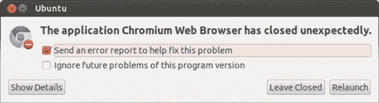
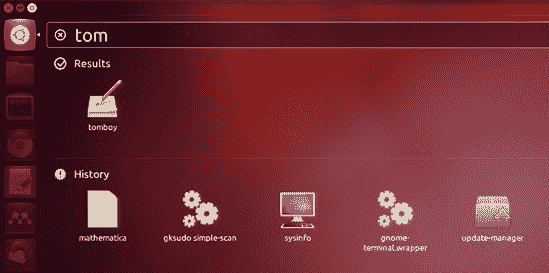
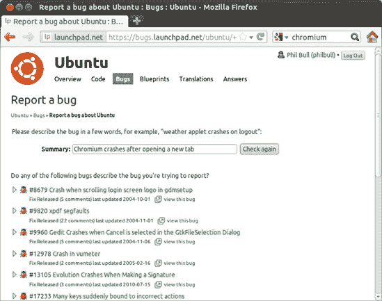
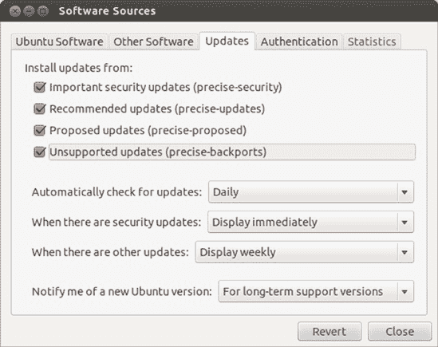
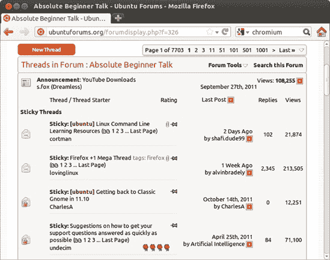
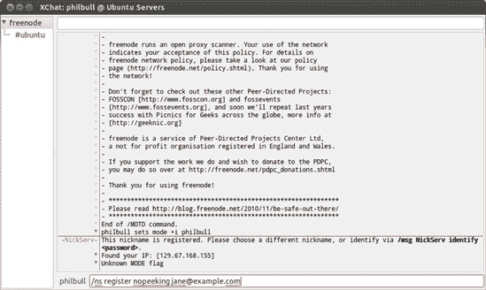

# 第二十一章. 企鹅殖民地

### Ubuntu 社区

真正将开源软件与商业软件世界区分开来的是对*社区*的重视。这几乎可以包括与软件有任何关联的任何人：使用它的人、设计它的人、帮助他人解决问题的人……他们每一个人都是宝贵的社区成员。

考虑一下商业软件世界，那里的事情往往趋向于自上而下。当你遇到问题时，你会去找一些提供支持的公司。这家公司可能还设计了并卖给你软件，而你在这个过程中可能没有扮演任何角色——你是客户；它是供应商。开源软件则不同：不是一家企业管理一切，而是大家齐心协力，互相帮助。人们编写软件和修复错误，因为这样做有助于他人，也因为它们想帮助他人。每个人都可以在提供反馈、建议和帮助他人解决问题中发挥作用，没有人绝对控制整个过程。总的来说，它更加民主，在我看来，也更加有趣！

Ubuntu 社区尤其庞大、充满活力，并且以友好著称。在本章中，你将了解如何充分利用它，以及你可以通过加入其中并回馈一些东西（如果你愿意）来发挥你的作用。

# 带我去看你的 SABDFL

开源社区往往有一个明确的结构，Ubuntu 也不例外。在最顶层是 Ubuntu 的创始人马克·舍特劳特（Mark Shuttleworth），你曾在第一章中见过他。他是自封的终身仁慈独裁者（Self-Appointed Benevolent Dictator For Life，SABDFL），根据[`www.ubuntu.com/project/about-ubuntu/governance/`](http://www.ubuntu.com/project/about-ubuntu/governance/)，他的角色是“在困难问题上提供明确的领导，并为项目设定节奏。”这并不意味着他制定所有的计划和决策——这更多的是技术委员会的职责，这是一个由高级 Ubuntu 贡献者组成的团队，他们决定下一个 Ubuntu 发布将采取什么形式。马克只是在那里，如果没有人能达成一致，他就介入。

此外，还有社区委员会，它监督构成项目主体的贡献者团队。有许多团队，承担着各种各样的责任：文档团队为 Ubuntu 的每个版本编写文档，安装团队负责 Ubuntu 的安装软件，等等。您可以在[`wiki.ubuntu.com/Teams/`](https://wiki.ubuntu.com/Teams/)找到它们的列表。这些团队由来自世界各地的成员组成(图 21-1)，团队成员可能承担各种责任。例如，开发者是编写和更新软件的人。最后，但同样重要的是，全球数百万的 Ubuntu 用户构成了社区的最大部分。这个群体包括您！

图 21-1. 显示 Ubuntu 文档团队成员位置的全球地图

参与的每个人都应遵守行为准则([`www.ubuntu.com/project/about-ubuntu/conduct/`](http://www.ubuntu.com/project/about-ubuntu/conduct/))，对项目进行更改（如开发者）的人被要求签署这份文件的副本，以表明他们对 Ubuntu 原则的承诺。最后一点：Ubuntu 是一个**精英主义**的社会，其中对项目贡献最大的人拥有最大的话语权。最活跃的贡献者（如果他们申请）会被授予**Ubuntu 会员资格**，并享受诸如[ubuntu.com](http://ubuntu.com)电子邮件地址等福利。

# Launchpad：通往 Ubuntu 社区的通行证

每个开源软件项目都需要一个可以称之为家的地方。在 Ubuntu 的情况下，这就是 Launchpad，这是一个增强型的项目信息网站。无论您是想报告问题、寻求帮助、设计一个酷炫的新功能，还是编写自己的程序，Launchpad 都是您应该去的地方。

打开 Firefox 浏览器，浏览到[`www.launchpad.net/`](http://www.launchpad.net/)。除非您之前已经注册，否则您需要注册一个账户，因此请点击页面顶部的**登录/注册**，点击**创建新账户**，并回答表单上的问题。点击**继续**，然后去检查您的电子邮件，以获取完成注册的详细信息。当消息到达时，点击第一个链接，填写您的详细信息，并在您收到的页面上点击**继续**，以便您可以使用您的账户。

一切都完成并尘埃落定后，回到[`www.launchpad.net/`](http://www.launchpad.net/)，点击页面右上角的你的名字，查看你的个人资料。目前可能看起来相当空，除了许多三个字母的缩写和一个神秘的邀请改变你的“品牌”。点击一个圆形的黄色铅笔图标开始更改你的详细信息。你可以根据需要在你的账户上添加或删除信息——例如，如果你想让人们能在 IRC 上找到你（参见在 IRC 上聊天），确保你在页面上输入你的昵称（图 21-2）。否则，你可以留出大部分空白。

图 21-2. 我的 Launchpad 账户页面

如果你刚刚创建了账户，你可能会注意到“Karma”部分挂着一个悲伤的小零。幸运的是，这并不是形而上的 karma，你的永恒灵魂也没有任何危险。相反，这是一个奖励系统，用于认可那些帮助 Ubuntu 变得更好的人们。你贡献得越多，你得到的 karma 点就越多，因此你就有更多的理由在 Ubuntu 狂热的朋友面前炫耀（他们都是，对吧？）。查看[`help.launchpad.net/YourAccount/Karma/`](https://help.launchpad.net/YourAccount/Karma/)了解所有工作的细节。

# Bugs, Bugs, Glorious Bugs

过去计算机是巨大的、复杂的生物，占据了整个房间，充满了精致的电子设备和嗡嗡作响的磁带驱动器。著名的计算机科学家 Grace Hopper 在从这样一个巨大的继电器中取出一只蛾后，将这只讨厌的昆虫贴在她的日志簿上，并评论说她在计算机中找到了一个“bug”。嗯，自从 1940 年代以来，计算机可能已经发生了很大的变化，但一些术语并没有改变。无论是像程序崩溃或冻结这样的大问题，还是像缺少图标这样的小问题，你发现软件中的任何问题仍然被称为*bug*。

你几乎肯定之前遇到过 bug——无论是商业软件还是开源软件，都不可能完美无缺。与开源软件的区别在于，你被强烈鼓励在发现问题的任何地方报告它们。开发者需要通过 bug 报告的形式获得反馈，以便知道需要修复什么，如果问题早点报告，修复速度会更快。提交 bug 报告是回馈社区的一种相对简单的方式；这不需要花费太多时间，它有助于提高每个人的软件质量，而且你可以免费解决一个讨厌的软件问题！

## 什么是 bug？

有很多不同类型的 bug，但通常你可以将它们归入以下几类：

+   当一个程序崩溃、冻结或显示没有合理原因的错误消息时（例如，在图 21-3)，你可能遇到了一个 bug！

    

    图 21-3。如果一个程序崩溃（如这里的 Chromium），它很可能有一个 bug。

+   当某件事物不工作（例如，当你点击按钮时没有任何反应）

+   当硬件（如打印机或你的声卡）表现不佳或完全无法工作

+   错别字、缺失的图标和其他外观错误

如果你的问题符合这些描述中的任何一种，那么你很可能遇到了一个 bug！不过，你应该注意一些显著的例外。首先，如果一个程序缺少某个功能，那并不真的是一个 bug。你仍然可以将其报告为 bug，但可能不会引起太多关注；首先尝试在 Ubuntu 论坛上讨论它。其次，你不应该通过报告 bug 来寻求软件帮助，因为你可能不会得到回应。相反，使用论坛、Ask Ubuntu 网站或 IRC；更多关于这些信息可以在 The Ubuntu Forums 和 Ask Ubuntu 中找到，它们位于 What’s All This Bean Business?中。最后，重要的是 bug 必须是*可复现的*。这意味着你可以提供一套指令供其他人遵循，他们将会遇到与你相同的问题。有时计算机只是做一些奇怪的一次性事情，如果问题不可重复，那么它被识别和修复的机会很小。

## 报告一个 bug

如果你确信你找到了一个 bug，那么是时候告诉别人了！如果它发生在特定的程序中，如果该程序有“帮助” ▸ “报告问题”选项，请选择它，然后跳到下一个段落。如果没有这个选项，你可能需要动手做一些事情。首先，你需要找到有问题的程序的命令名。这并不总是与窗口标题中显示的名称相同，所以你可能需要做一些猜测工作：

1.  按下 alt-F2 以在 Dash 中打开运行命令视图。使用全部小写字母，开始输入应用程序的名称。在你输入了几个字母后，应用程序的图标可能会出现；命令名就是图标下的文本（例如，`tomboy`是 Tomboy 的命令名，如图 21-4 所示）。

    

    图 21-4. 使用 Dash 查找 Tomboy 的命令名称

1.  如果你找不到你正在寻找的程序图标，请尝试从软件中心安装主菜单应用程序。安装完成后，启动主菜单，通过菜单导航找到你需要的应用程序。然后右键点击程序名称，从弹出的菜单中选择**属性**。当启动器属性窗口出现时，查看命令框的内容——对于 Tomboy 来说，它应该显示`tomboy --search` (图 21-5). 你可以忽略第一个空格之后的所有内容（只有第一部分是重要的），所以在这种情况下，程序的命令名称是`tomboy`。

    

    图 21-5. 使用主菜单查找 Tomboy 的命令名称

1.  手持命令名称，按 alt-F2 再次打开 Dash 的**运行命令**视图。

1.  输入**`ubuntu-bug`** **``*`tomboy`*``**（将**``*`tomboy`*``**替换为你的程序的命令名称）并按回车键。

错误报告工具将启动并收集有关程序的一些信息（例如你正在使用的版本）。接下来，它会询问你是否想将此报告发送给开发者——你确实想，所以点击**发送报告**，并将打开一个网页（如果你还没有登录，请登录 Launchpad）。尽可能详细地输入你问题的简要描述，然后点击**下一步**。

## 是否已经报告过？

许多人正在使用与你相同的程序，所以很可能有人已经麻烦地报告了你的错误。Launchpad 将去寻找与您提供的描述相匹配的现有错误，所以请查看出现的列表，看看是否有任何结果听起来熟悉(图 21-6). 如果你找到一个听起来相似的，点击它旁边的箭头，阅读描述以确保，然后点击**是的，这就是我要报告的错误**。这可能是一个好兆头，因为可能有人正在修复这个问题！

图 21-6. Launchpad 认为与您报告的错误相似的错误列表

选择**仅标记 bug 对我有影响**并点击绿色的勾选按钮，直接进入 bug 页面（另一种选择，订阅我，意味着每次有人就 bug 发表评论时，你都会收到一封电子邮件）。查看其他人关于 bug 的评论，看看是否有任何可以帮助你绕过问题的内容。评论有时可能是技术性的，因此可能有必要在论坛上寻求帮助以解决一些更晦涩的指令。如果你看不到任何有用的信息，你可以尝试提供更多关于问题的详细信息，以帮助开发者追踪它。开发者通常会要求你提供某些命令输出的副本，这有助于确定出了什么问题。如果你认为你可以帮忙，请滚动到 bug 页面的底部，并在评论框中提供你所知道的信息。

## 新的 bug

如果似乎没有人遇到相同的问题，那么你遇到了一个真实的问题！在出现建议 bug 列表的页面底部点击**不，我需要报告一个新的 bug**，并在“更多信息”框中描述 bug。以下是一些关于如何撰写令人叹为观止的 bug 报告的提示：

**每个 bug 只报告一个问题**。

如果你一次报告多个问题，开发者将难以追踪他们已经修复了什么，还没有修复什么。

**描述 bug 发生时你在做什么**。

上下文很重要，因此你应该描述你在遇到问题时正在做什么。例如，如果你的音乐播放器在你插入 iPod 时崩溃，那么你应该提到这一点。

**提及你正在使用的程序版本**。

bug 报告工具应该会自动提供有关软件版本的信息，但自己记下这些信息也是一个好主意。在程序菜单中选择**帮助** ▸ **关于**，通常会显示程序的版本号，你可以通过点击顶部面板上的电源按钮并从弹出菜单中选择**系统设置**来找出你正在运行的 Ubuntu 版本。双击出现的窗口中的**详细信息**，Ubuntu 版本将列在概述部分。

**描述如何重现 bug**。

开发者需要看到 bug 是如何发生的，以便修复它。提供一份描述如何让同一个人在他们的电脑上重现相同问题的步骤列表。如果你不知道如何再次触发 bug，只需尽可能详细地描述 bug 发生时你点击或更改了什么。 

一旦你将报告信息整理好，点击**提交 bug 报告**以完成流程。

## 现在会发生什么？

你会收到来自 Launchpad 的电子邮件，确认你的错误已成功报告，但这并不是故事的结束。让我们看看一个典型的错误，看看事情是如何发展的：打开 Firefox，转到[`bugs.launchpad.net/ubuntu/+bug/121853/`](https://bugs.launchpad.net/ubuntu/+bug/121853/)，查看我在 2007 年为 Rhythmbox 音乐播放器报告的错误。首先要注意的是页面顶部的信息（图 21-7)：*影响*列列出哪些软件包受到错误的困扰，*状态*告诉你错误在修复道路上的进展情况，*重要性*告诉你错误的严重性，而*分配给*是负责修复错误的开发者或团队的名字。随着识别和修复问题的进展，这些细节会被开发者更改。

图 21-7. 我为 Rhythmbox 错误报告的 Launchpad 页面

### 注意

改变自己错误的状况或重要性是不好的做法，因为人们常常高估他们问题的严重性。请让 Ubuntu 开发者或其他社区成员来处理。

在下面，你会看到我的原始错误报告，随后是超级 Ubuntu 开发者 Sebastien Bacher 提出的问题。在错误被发送到上游——即发送到处理 Rhythmbox 错误的另一个开源项目之前，还有一些来回的交流。从那时起，我只需等待 Rhythmbox 开发者修复问题。

如果你已报告了一个错误，请留意你的电子邮件。每当错误被更改或有人发表评论时，你都会收到通知。如果有人要求了解更多关于问题的信息（就像 Sebastien 对我所做的那样），你所需要做的就是回复电子邮件。你的回复将自动添加到错误报告中，供每个人查看。开发者拥有的信息越多，他们修复问题的速度就越快。

## 我的错误何时会被修复？

每天都有数百个新的错误报告针对 Ubuntu，当你考虑到有大约 40,000 个可安装的软件包时，这并不令人惊讶。错误数量如此之多并不容易应对，处理它们被比作“从火龙头喝水”。为了平息混乱，一群被称为“错误小组”的志愿者仔细检查所有新的错误，对它们进行分类，识别已经报告的错误，询问错误发生的情况细节，并通常尝试收集足够的信息，以便开发者能够迅速介入并修复问题。在实践中，这意味着解决问题可能需要相当长的时间，尽管实际的时间表将取决于错误被认为有多重要。我通常预计等待两到三个月来解决一个“平均”错误。话虽如此，我的 Rhythmbox 错误尚未修复——五年后！（公平地说，这是一个特别微不足道的问题，很少有人可能会遇到。）

一旦错误被修复，其状态将更改为“已发布修复”，Ubuntu 开发者通常会提供一个更新的软件包，您可以通过安装该软件包来解决您计算机上的问题。修复不会立即提供，因为它们必须经过一系列严格的测试，以确保它们不会破坏其他任何东西。这意味着某些错误修复可能直到下一个版本的 Ubuntu 发布时才可用。

## 更快的修复

如果您知道一个问题已被修复，但尚未发布更新软件包，可能有一种方法可以绕过延迟——如果您不介意承担一点风险。当更新正在测试以准备官方发布时，它们会在网上提供给任何人试用。更新版本可能会引起问题（毕竟，它们正在测试中！），但通常它们是好的。还有 *回滚* 软件包，这是程序的未经官方更新的版本。这些将已经过测试，但不是非常严格，因此也请自行承担风险。

要获取这些不太稳定的软件包，请打开 Ubuntu 软件中心，点击 **编辑** ▸ **软件源**，并打开 **更新** 选项卡。确保 **建议的更新** 和 **不受支持的更新** 已被选中（如图 21-8)，然后点击 **关闭**。现在，转到 Dash，打开更新管理器，并点击 **检查** 以查看哪些软件包可以更新。

图 21-8. 使用软件源工具启用建议和不受支持的更新

### 警告

使用未经测试的更新时，你确实需要小心。一个常见的会引起问题的软件包就是 Linux 内核本身——在更新管理器中的软件包列表中向下滚动，看看是否有“建议更新”部分。如果你发现一个名为 linux 或 linux-generic 的软件包，考虑取消选中它旁边的复选框，以防止它暂时更新。

黑客文化——简短插叙

如果林纳斯·托瓦兹没有与世界分享他的爱好项目，我们就不会在这里讨论 Ubuntu，或者任何形式的 Linux（如果你想要回顾历史，可以查看第一章）。开源运动建立在像林纳斯这样的人的辛勤工作和独创性之上，这些人被社区亲切地称为黑客。通过这一点，我坚决不是指那些闯入电脑、编写可怕的计算机病毒或以其他方式破坏所有人聚会的人。黑客这个术语的另一个含义在计算机历史中可以追溯到更早：简单来说，它意味着把编写计算机程序作为一种消遣的人。微软和苹果的创始人都是黑客——在各自的车库中热衷于玩弄早期台式电脑的爱好者。

黑客文化不仅限于计算机，还扩展到各种活动。它关乎实验、想出酷点子，然后与志同道合的人分享，正是这种哲学使得开源运动成为可能。

# Ubuntu 论坛

在线*论坛*是一个你可以发布关于某个主题的消息的地方，其他论坛用户可以公开阅读并回复。互联网上有成千上万的论坛，将来自世界各地的人聚集在一起，讨论各种各样的事情。Ubuntu 论坛是一个提问、寻求帮助和与其他使用 Ubuntu 的人交流的好地方。目前大约有 50,000 名活跃用户，迄今为止已经发表了超过一百万篇帖子。如果你确实有问题，有很大可能性它已经被某处回答过，或者有人能够为你解答。

摘下你的探险家帽子，让我们去论坛周围看看。访问[`www.ubuntuforums.org/`](http://www.ubuntuforums.org/)，你首先会注意到首页上有许多不同的分类。选择正确的分类相当直接——例如，寻求电脑问题帮助的人会在主支持分类中发布他们的问题。现在，让我们看看为新手 Ubuntu 用户预留的论坛部分。点击**绝对新手讨论**链接，然后滚动到写着*粘性帖子*的部分（图 21-9）。

**线程**是一系列关于同一主题的消息集合。你可以回复现有的线程或自己创建新的线程。**粘性线程**是论坛管理员（确保一切顺利的头目）认为足够重要，应该永久保留供所有人阅读的线程。普通线程不会永久保留，并且随着新线程的开始和添加到顶部，它们会慢慢从列表中下降。要阅读一个线程，只需点击其名称。

图 21-9. 在绝对初学者论坛中查看粘性线程

论坛上有如此多的线程，手动筛选它们可能需要一生的时间。幸运的是，有一个相当不错的搜索功能。只需点击页面顶部的**搜索**链接，在出现的框中输入一些搜索词，然后点击**搜索**以查看结果。

## 回复帖子

你可以阅读论坛上的任何线程，无需用户账户，但你需要登录才能回复其中的任何一个。点击页面顶部的**注册**链接创建账户。你需要点击几页，边走边输入你的详细信息，但注册应该相当简单。完成注册后，点击**完成注册**并检查你的电子邮件。一旦确认邮件到达，点击其中包含的第一个链接以完成账户设置。然后使用页面右上角的表单登录。

现在你已经登录，找到你想要回复的线程，点击页面顶部（或底部）的**新建回复**按钮。输入你的消息并点击**提交回复**，你的帖子将被添加到线程的末尾。如果你意识到你在回复中犯了错误，你可以回到线程并点击你帖子右下角的小型**编辑**按钮。

## 创建你自己的线程

如果你搜索了论坛但找不到与你问题相关的内容，为什么不创建一个新的线程呢？第一步是找到最适合你想要讨论的主题的类别。返回论坛首页，浏览列表直到找到看起来合适的内容。例如，如果你对你的无线连接有一个迫切的问题，你会在“主要支持类别”标题下的**网络与无线**类别下点击。

一旦你找到了一个类别，点击其名称以查看它包含的所有线程。点击页面顶部的**新建线程**按钮开始写作。确保你为你的新线程选择一个描述性的标题，如果你是在询问关于你遇到的问题，请提供足够的细节。完成之后，点击**提交新线程**。然后只需等待回复陆续到来！

## 所有这些豆子生意是些什么？

你可能在论坛的旅途中听到了很多关于咖啡和豆子的讨论。不用担心——你并没有误入一个咖啡上瘾的支持小组。豆子只是跟踪一个人发了多少帖子的方式。（据说这是一个内部玩笑，指的是极客对咖啡的喜爱，但就我个人而言，我实在受不了那东西！）你每发表一个回复或线程都会得到一个豆子，随着你收集更多的豆子，你会发现出现在你名字下的描述会改变。据我写这篇文章时了解，我的豆子是绿色的，我成为“终极咖啡研磨机”的机会每天都在减少。

# Ask Ubuntu

Ask Ubuntu 是 Ubuntu 日益增长的帮助和支持渠道中的一个相对较新的成员，是一个简单的网站，用于回答与 Ubuntu 相关的问题。尽管它不如 Ubuntu 论坛那样历史悠久，也没有同样的友好社区闲聊，但如果你试图回答一个具体的问题或解决问题，它是一个有用的地方。你可以通过访问 [`www.askubuntu.com/`](http://www.askubuntu.com/) 来查看它。

当你到达 Ask Ubuntu 的首页时，你会注意到页面底部有一列“热门问题”，这些问题是根据它们的“投票数”进行排名的。网站的用户会提出问题，然后其他用户可以对这些问题的重要性进行投票或反对。根据社区的决定，最重要、最有趣的问题会浮到列表的顶部，得到最多的关注，因此更有可能得到解答。你可能已经在新闻网站和类似 YouTube 的网站上看到过类似的系统；有洞察力的评论会收到很多投票并出现在列表的顶部，而不那么有用的评论则会被埋在页面底部。

点击“热门问题”列表顶部的任何问题，你除了会看到问题的原始文本外，还会看到许多讨论可能解决方案的评论。其中一些被标记为“答案”，它们直接提出了解决问题的方案。其他用户可以对答案进行投票或反对，所以最好的答案（原则上）也会浮到顶部。总的来说，如果你有一个具体的问题或疑问，Ask Ubuntu 是一种高效获取所需信息的方式。然而，如果你不确定你到底在找什么，Ubuntu 论坛可能是一个更好的选择。

如果你想要尝试 Ask Ubuntu，首先要做的是**登录**。点击页面顶部的登录链接，然后点击使用 Launchpad 登录（或者如果你更喜欢，可以使用你的 Google 或 Facebook 账户登录）。然后按照屏幕上的说明创建一个新账户。完成这些后，你将返回到 Ask Ubuntu 网站。从这里，你可以点击**提问**来提出新的问题，并经历我上面解释的整个投票/评论/回答周期。

# 在 IRC 上聊天

*互联网中继聊天 (IRC)* 是 Ubuntu 用户可以在线交流的地方。聊天是实时发生的，使用 IRC 与使用即时通讯服务非常相似。如果你想要尽快与人讨论某个问题而不想等待论坛上的回复，聊天是一个特别好的选择。

最初，IRC 可能会让人感到有些令人畏惧，所以让我们通过一个典型的会话来了解一下。首先，你需要确保你有正确的聊天软件。打开 Ubuntu 软件中心，搜索 *XChat IRC*（不要与 XChat-GNOME 混淆），然后安装它。一旦完成，准备好你的点击手指，按照以下步骤操作：

1.  打开 Dash 并打开 XChat。会出现一个类似于 图 21-10 的网络列表窗口。

    

    图 21-10. XChat 的网络列表窗口

1.  为你的昵称做出一些选择。你的昵称是其他用户识别你的方式，所以选择一个能体现你独特性的名字（我的昵称是 *philbull*）。你应该尝试几个替代方案，以防有人已经使用了你的首选——在首选名称的末尾添加随机数字似乎效果不错。只是确保不要在昵称中使用空格。

1.  确保在“网络”列表中选中了 *Ubuntu 服务器*，然后点击 **连接**。

1.  当你连接到 IRC 服务器时，屏幕上会闪过一大堆文本。几秒钟后，你会被切换到 *#ubuntu* 通道。

如果事情看起来很混乱，不要慌张；你现在就会弄清楚所有的事情。把这当作是 IRC 的速成课程！

*通道* 只是一个你可以去与其他人交谈的地方。在 IRC 上有很多这样的通道，每个都专注于不同的主题。在 XChat 中，你连接到的通道列在窗口左侧的面板中，所以你应该能看到你现在在 *#ubuntu*，这是一个用于一般 Ubuntu 帮助和支持的通道。你可以选择 **服务器** ▸ **加入通道** 来连接到不同的通道，但现在没有必要，因为我们已经在正确的通道中了。在右侧面板中是当前连接到同一通道的其他用户的列表；*#ubuntu* 非常受欢迎，所以可能有很多你的同行用户。

当你进入频道时，屏幕中央的面板中会经过一堆消息。前几条是自动消息，描述了频道的用途，设定了一些基本规则等等，但现在你应该会看到其他人的消息在屏幕上滚动（图 21-11

图 21-11. 其他用户在 *#ubuntu* IRC 频道中聊天

如果你想要发送一条消息，请在屏幕底部你的昵称旁边的消息框中输入，然后按回车键。你会看到你的消息出现在中心面板中，同样，在 *#ubuntu* 频道中的每个人也会看到。你接下来只需要等待回复……

## 注册你的昵称

注册你的昵称是个好主意，这样别人就不能偷走它，下次你使用 IRC 时人们也能认出你。在窗口左侧的面板中，点击 **freenode** 项以切换到 Freenode 的欢迎频道，这是 Ubuntu 使用的 IRC 服务器（图 21-12，如果这些是你的详细信息，那么就可以完成注册。按回车键完成注册。

图 21-12. 注册你的 IRC 昵称

如果一切按计划进行，你将看到一个类似的消息，例如 `An email containing` *`nickname`* `activation instructions has been sent` to jane@example.com. Check your email, and there should be an activation email containing instructions to type something like **`/msg NickServ VERIFY REGISTER`** **``*`nickname`*``** **`jbaxzqxmgzqv`** into the Freenode channel you were in earlier. Do this, and you should see a message along the lines of `-NickServ-` *`nickname`* `has now been verified`. That’s it, you’ve registered! Click the *#ubuntu* channel in the left pane to return to where you were before.

如果你收到一条说*`nickname`* `已注册`的消息，而不是关于激活电子邮件的消息，那么有人已经注册了你正在使用的昵称。在这种情况下，输入**`/nick`** **``*`newname`*``**，用新的昵称选择替换**``*`newname`*``**，并按回车。你会看到一条消息说`你现在被称为` *`newname`*。理想情况下，这次没有人有相同的名字，所以尝试再次注册。

下次你进入 IRC 时，你可以通过访问*freenode*频道，输入**`/nick`** **``*`nickname`*``**并按回车来检索你的注册昵称。然后输入**`/msg NickServ identify`** **``*`password`*``**并再次按回车。当然，你应该在执行此操作时用你自己的昵称和密码替换**``*`nickname`*``**和**``*`password`*``**。

## IRC 礼仪

在 IRC 上，就像在其他任何地方一样，都有规则和社会规范需要遵守。不言而喻，你不应该故意去冒犯或骚扰任何人，就像在“现实世界”中一样。以下是一些你应该注意的更微妙的传统：

**不要大喊大叫**。

用全部大写字母写作是 IRC 上一直大喊大叫的等同物。对于大喊大叫的人有一个特殊的地狱圈；这几乎是每个人的痛处，你肯定会因为这样做而受到批评。

**只说一次**。

有时候你可能会过一段时间才收到回复，所以你可能会有重复发送相同信息的冲动。重复太多次也被认为是很烦人的。在 IRC 上，耐心是一种必要的技能，因为人们往往会偶尔参与聊天，而不是一直监视它们。不过，如果你在 10 分钟左右还没有收到回复，重复你的信息是可以的。

**不要发送大量文本**。

一次性发送超过几行文本被称为*洪水攻击*。这会让其他人难以进行对话，所以你应该避免这样做。如果你有很多文本想要别人阅读，可以使用像[`pastebin.com/`](http://pastebin.com/)这样的服务来保存文本，然后在 IRC 上简单地发布一个链接。

**保持话题相关**。

有不同的频道用于不同的目的，所以你应该尽量坚持特定频道的目的。在大多数频道中，广告被认为是离题的，尤其是不受欢迎的。

**对着摄像头微笑**。

大多数在公共 Ubuntu 聊天室中的对话都被记录下来，可以在[`irclogs.ubuntu.com/`](http://irclogs.ubuntu.com/)查看。如果你忘记了上周某人提到的一个链接，这很有用，但如果你说了不应该说的话，可能会感到尴尬。一般来说，永远不要在 IRC 上发布任何敏感或个人信息（尤其是你的密码或信用卡详情），因为这可能会让你后患无穷。

## 更多关于 IRC 的帮助

我希望这次对 IRC 的初次探险没有让你对它产生终身的厌恶！很多人一开始会觉得它很复杂，但一旦你习惯了，它真的是与其他 Ubuntu 用户交流的一个非常好的方式。如果你觉得自己需要磨练 IRC 技能，那么[`www.irchelp.org/`](http://www.irchelp.org/)上的 IRC 帮助网站是一个非常有用的资源。如果那样仍然不能让你融入 IRC 的氛围，你还可以尝试使用一个更熟悉的 Ubuntu IRC 频道的网络界面，它可以在[`webchat.freenode.net/?channels=ubuntu`](http://webchat.freenode.net/?channels=ubuntu)找到。

## 约翰·艾略特：另一种 IRC 替代方案：邮件列表

如果你觉得整个 IRC 聊天让你头疼，那么还有另一种更温和的选择，那就是支持邮件列表。你只需要向适当的列表发送电子邮件，并希望得到回复。访问[`lists.ubuntu.com/`](https://lists.ubuntu.com/)查看你的选项——*ubuntu-users*列表可能是你想要的。

# 跟踪新闻

如果你想了解 Ubuntu 社区正在发生的事情，新闻来源并不匮乏。这里只列举了其中几个（你还可以在附录 D 中找到更多资源）：

**Full Circle 杂志** ([`fullcirclemagazine.org/`](http://fullcirclemagazine.org/))

全景杂志是一个独立制作的 Ubuntu 杂志，可以免费下载 PDF 版（你还可以从 Ubuntu 软件中心获取）。它包含了你在传统纸质杂志中可能期望找到的一切，如评论、访谈、读者故事和实用的指南。

**Ubuntu 每周通讯** ([`wiki.ubuntu.com/UbuntuWeeklyNewsletter/`](https://wiki.ubuntu.com/UbuntuWeeklyNewsletter/))

这份通讯旨在每周概述社区的活动，通常包括引人注目的 Ubuntu 新闻故事、开发者的访谈以及软件近期变更的更新。它针对的是更技术性的用户群体。

**The Fridge** ([`fridge.ubuntu.com/`](http://fridge.ubuntu.com/))

The Fridge 是一个社区成员可以粘贴笔记和即将发生的事件更新的地方。有时也会在这里发布访谈。

**Ubuntu 星球** ([`planet.ubuntu.com/`](http://planet.ubuntu.com/))

这里你可以阅读 Ubuntu 开发者的个人博客。其中一些帖子是技术性的，但如果你对前沿发展感兴趣，这个地方是你要去的地方。

新闻和观点也在微博服务中流传。订阅 Twitter 上的*#ubuntu*标签或加入 Identi.ca 上的 Ubuntu 小组([`identi.ca/group/ubuntu/`](http://identi.ca/group/ubuntu/))，参与推文、打孔或 whatever 你想叫它。

# LoCos 和 LUGs

到目前为止，整个 Ubuntu 社区可能对您来说有点，嗯，*虚拟的*。为什么不能是呢？Ubuntu 是一个非常国际化的项目，在线沟通是最实际的方式来完成事情。不管怎样，通过本地社区（LoCo）团队和 Linux 用户组（LUGs），您有很多机会联系和遇到您所在地区的其他 Ubuntu 用户。这些团体通常拥有多样化的计算技能会员，因此它们是寻求 Linux 帮助的好地方，以及其他事情。

*LoCos* 通常覆盖相当大的地理区域，通常是整个国家或州的规模。因此，他们不太经常面对面交流，尽管许多 LoCos 会全年举办与 Ubuntu 相关的活动，包括在每次 Ubuntu 发布时间附近的“发布派对”。您可以在 [`loco.ubuntu.com/teams/`](http://loco.ubuntu.com/teams/) 找到 LoCo 团队的列表。

*LUGs* 比 LoCos 更广泛，更注重聚会。通常，一个 LUG 会定期在当地的社区中心（如果您幸运的话，是一个酒吧）举行会议，并可能组织讲座或其他与 Linux 相关的活动。找到您最近的 LUG 的最佳方式是使用 Google。

# 标签和其他好东西

如果您喜欢炫耀您的 Ubuntu 病，那么您很幸运！Ubuntu 友好的计算机制造商 system76 提供免费标签，非常适合替换您可能在电脑机箱某个地方隐藏的丑陋的 Windows 标志（参见 图 21-13）。要订购您的标签，请浏览到 [`www.system76.com/community/stickers/`](https://www.system76.com/community/stickers/) 并将该页面上相关地址的邮票、地址信封寄出。没有会员徽章的俱乐部是不完整的，对吧？

图 21-13. 我的笔记本电脑，上面贴有 Ubuntu 标签（我无法移除 Windows 的那个）

如果标签让您感到冷清，其他 Ubuntu 品牌的好东西（杯子、T 恤、背包……您想得到的都有）可以通过 Canonical 商店购买 ([`shop.canonical.com/`](http://shop.canonical.com/))。

# 参与其中

许多人喜欢成为 Ubuntu 社区的一员，并希望通过志愿服务来回报社区。报告错误是一个很好的贡献方式，但这只是开始！

如果你与现有的贡献者交谈，你很快就会看到每个人的故事都不同。我在 2006 年初偶然开始为 Ubuntu 做贡献，当时我开始整理一些缺少信息的错误报告。这只是为了消磨时间，每天大约占用半小时。那时 Launchpad 还比较新，所有的错误报告都是从旧系统中转移过来的，所以这项工作很有趣。Bug Squad 的成员非常鼓励我，我很快就发现自己花越来越多的时间在做 Ubuntu 相关的事情。随着时间的推移，我开始编辑维基上的帮助页面 ([`help.ubuntu.com/community/`](https://help.ubuntu.com/community/))，并最终找到了我的道路，加入了文档团队，在那里我共同编写了一篇关于从 Windows 切换到 Ubuntu 的指南。如今，我除了其他事情外，还是 GNOME 项目“上游”帮助文件的维护者之一。作为一个贡献者，这是一段非常棒的体验——我遇到了许多有趣的新人，满足了我对写作和计算机的兴趣，在世界各地的会议上旅行，最重要的是，在这个过程中我玩得非常开心。

访问 [`www.ubuntu.com/community/`](http://www.ubuntu.com/community/) 以获取一些关于你如何提供帮助的想法。你不需要成为极客就能参与其中：艺术家、作家、多语言者、市场营销人员……参与的方式不胜枚举。你甚至可能喜欢参加一个会议，像 图 21-14") 中的贡献者一样享受乐趣！要开始，你只需要加入相关的团队并在其邮件列表上自我介绍。如果你感兴趣，特别要注意的是 Ubuntu Open Week，届时所有 Ubuntu 团队都会在 IRC 上举行讨论和教程。查看 [`wiki.ubuntu.com/UbuntuOpenWeek/`](https://wiki.ubuntu.com/UbuntuOpenWeek/) 了解下一届会议的时间。

## Ubuntu 成就

如果你不确定如何参与，或者是否参与是首先适合你的事情，你可能想尝试一个名为 Ubuntu Accomplishments 的新颖有趣的应用程序（图 21-15 找到)](http://atomoreilly.com/source/no_starch_images/1264064.png.jpg)

图 21-14. Ubuntu 在会议上的众多贡献者中的一小部分（由 Kenneth Wimer 创建的图像；在 Creative Commons 许可下使用；原始图像可在[`en.wikipedia.org/wiki/File:Uds_karmic.jpg`](http://en.wikipedia.org/wiki/File:Uds_karmic.jpg)找到)。

你可以在[`wiki.ubuntu.com/Accomplishments/`](https://wiki.ubuntu.com/Accomplishments/)找到有关 Ubuntu Accomplishments 的更多信息，包括安装说明。当这本书付印时，它仍在开发中，所以这里有一些粗糙的边缘。特别是，一些任务看起来性质相当技术化。但尝试它仍然值得——去赢得那些奖杯！

图 21-15. 通过找到为 Ubuntu 做出贡献的方式，获得成就感。
