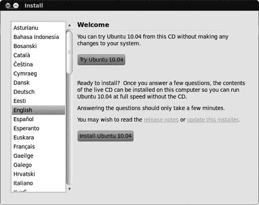
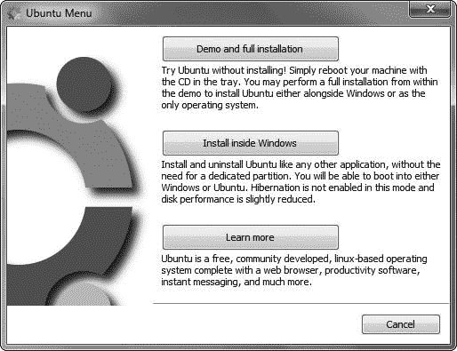
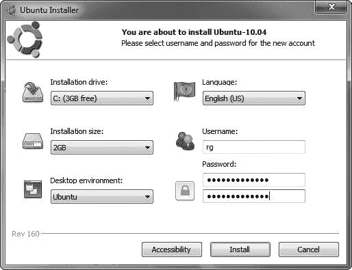
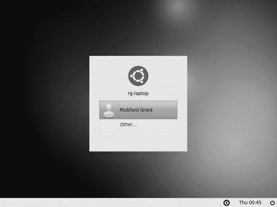
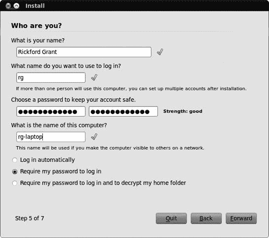

# 第二章。浅水区与潜水

### 运行和（如果喜欢）安装 Ubuntu

如我之前提到的，Ubuntu 的一个优点是它提供了一个 live CD，这意味着您可以在安装之前尝试它……或者如果您愿意，根本不安装它。更好的是，与 Ubuntu 的早期版本不同，如果您选择安装它，您不需要额外的安装 CD——Ubuntu 桌面 CD 既可以作为 live CD，也可以作为安装 CD。而在事情的好、更好、最好的趋势中，最好的点是，从 live CD 安装实际上比您处理过的任何其他安装过程都要简单得多，甚至提供了多种方法来实现。

在本章中，我将介绍从 live CD 启动和运行 Ubuntu 的基础知识，然后，假设您已经感染了 Linux 病毒，我将介绍在您的硬盘上安装 Ubuntu 作为您唯一的操作系统的无痛苦步骤，在您的硬盘上的独立分区中，在传统的双启动设置（Windows 在其自己的分区中）中，或者对于稍微不那么冒险的人来说，在您的 Windows 系统内。如果您的计算机没有 CD 驱动器，请不要担心，您仍然可以参与进来——查看附录 A，了解您如何从 USB 闪存驱动器运行或安装 Ubuntu。无论您最终选择哪种方式，让我们使用这本书，让 Ubuntu 启动并运行起来。

# 潜水体验

要了解 Ubuntu 是什么（并检查您的硬件是否与 Ubuntu 兼容），没有比直接从 live CD 运行 Ubuntu 更好的方法了。为此，只需将 Ubuntu 桌面 CD 放入光驱，然后重启您的计算机。当计算机启动时，它应该从 CD 启动，一两秒后，您应该看到一个带有底部几个图标的紫色 Ubuntu 启动屏幕。如果屏幕没有出现，而您的计算机反而启动到您通常的操作系统，那么您的计算机的 BIOS 设置可能需要更改，以便您可以从 CD 启动。

您可以通过重启并按屏幕启动说明中分配给访问 BIOS 设置的任意键来访问您的计算机的 BIOS。这通常是 **删除** 键或 F1（F2、F10 和 **esc** 也很常见），但并非所有计算机都相同。如果屏幕上的信息过快，以至于您错过了，您可以查看用户手册以了解正确的键是什么。一旦进入 BIOS 设置，请更改启动顺序，使您的 CD 驱动器排在第一位。

当你的机器从 live CD 启动并看到紫色 Ubuntu 启动屏幕时，你可以等待几秒钟让 Ubuntu 开始启动到 live CD，或者你可以按下一个键（任何键）来显示一个菜单，你可以选择你的语言和其他设置。默认设置应该足够我们使用，所以保持键盘几秒钟不动，紫色屏幕将让位给一个加载屏幕（也是紫色的）。

几分钟后，加载屏幕将消失，取而代之的是如图 2-1 所示的安装窗口。现在你应该能够使用鼠标以及键盘了，所以除非你想使用屏幕左侧的列表更改语言，否则点击**尝试 Ubuntu 10.04**按钮以启动一个 live 会话。再过几秒钟的加载，你将看到一个 Ubuntu 桌面，所有内容都从 CD 运行。记住，你的硬盘将保持不变，所以放心——你不会改变，更不用说伤害，任何东西。当你到达这个阶段，你就可以开始了——但我会在第三章中再谈这个问题。

### 注意

在 live CD 会话中不支持某些语言所需的特殊输入机制（即中文、日文和韩文）。

如果你想要退出 live CD 并返回到正常状态，点击屏幕右上角的电源按钮，选择**重启**，然后从出现的窗口中选择**重启**。过一会儿，你会被要求取出光盘并按**enter**键。计算机将重启并很快返回到你的正常 Windows 桌面。如果你因为某种原因无法使用重启按钮，只需使用前面的电源按钮关闭并重新打开计算机即可。

图 2-1. Ubuntu live CD 的安装窗口

# 选择，选择，选择——安装选项

如果你已经在你的机器上安装了 Ubuntu，并且满意从 live CD 运行它，或者还没有决定要做什么，你可以跳过本章的其余部分，继续到下一章开始使用 Ubuntu 桌面。如果你还没有安装 Ubuntu 并且准备好并且渴望这样做，那么你最好就留在原地继续阅读。

## 在 Windows 中安装 Ubuntu——游泳去——（Wubi 安装程序）

曾经，如果你非常喜欢 Ubuntu 并想将其安装在硬盘上，但又害怕这样做会破坏你精心设置的 Windows 系统，那么你 . . . 好吧，运气不佳。然而，情况已经改变，因为现在有一个名为 *Wubi* 的安装选项，允许你将 Ubuntu 直接安装在 Windows 的 C: 驱动器上，就像安装任何其他 Windows 程序一样。一旦安装，每次启动你的机器时，你都将能够在 Windows 启动加载器屏幕中选择启动到 Windows 还是 Ubuntu。你的 Windows 系统保持不变；你不需要分区硬盘；而且如果你以后出于任何原因想要删除 Ubuntu，你可以像删除任何其他 Windows 应用程序一样操作。这对于胆小的人来说是一个处理事情的好方法。

诚然，这种方法可以描述为一种折衷方案，因为它并没有真正给你提供从专用 Ubuntu 安装中通常能得到的完整体验。它安装起来也花费更长的时间，因为 Wubi 需要从互联网下载安装文件（正确的文件不在 CD 上）。但这是一个相当好的折衷方案——它确实运行得更快，比 Ubuntu live CD 会话更加实用和愉快。你还可以享受将文件和设置保存到磁盘的好处，这意味着你可以跟随本书中描述的任何内容。相当酷。

如果这种替代安装方法对你来说没有吸引力，请转到 关于企鹅——在 Windows 外安装 Ubuntu，了解更多信息。如果你还没有下定决心，并且想了解更多关于这个 Wubi 安装程序的信息，请将你的浏览器指向 [`wubi-installer.org/`](http://wubi-installer.org/)。另一方面，如果你已经决定 Wubi 安装程序是你祈祷的答案，那么你需要做以下事情：在 Windows 运行时，将这本书附带 Ubuntu live CD 插入你的电脑光驱。一个类似于 图 2-2 的窗口将自动出现。

图 2-2. 在 Windows 中自动启动的 Ubuntu live CD

1.  在那个窗口中，点击 **在 Windows 内安装** 按钮。Ubuntu 安装程序窗口将出现 (图 2-3)。

1.  使用 **安装驱动器** 选项来指定你想要放置 Ubuntu 文件的位置。确保你有足够的磁盘空间！

1.  Windows 和 Linux 不能共享相同的磁盘空间，因此你需要为 Ubuntu 保留一些空间（你可以通过稍后讨论的卸载 Ubuntu 来轻松恢复空间）。通过从安装大小下拉列表中选择大小来选择你希望在 Ubuntu 中可用的磁盘空间量。少于 6GB 的空间可能会非常受限。

1.  将桌面环境设置为默认值（Ubuntu），然后选择用户名和密码。一旦你对选择满意，点击**安装**按钮。

    

    图 2-3. 选择在 Windows 内部安装 Ubuntu

1.  如果你的机器此时还没有连接到互联网，你会被告知需要连接。如果你需要，请连接，如果出现警告窗口，请点击**重试**按钮。

    此时，Wubi 将开始下载它需要的文件，以便在你的 Windows 环境中创建一个可引导的 Ubuntu 安装。根据你的连接速度，这可能需要相当长的时间。

    一切完成后，你会看到一个像图 2-4 中的窗口，提示你重启。

    

    图 2-4. Ubuntu 已完成了其 Windows 内部安装的第一阶段。

1.  选择**现在重启**，在该窗口中点击**完成**按钮，之后你的机器将重启。

1.  当机器重启时，你会看到 Windows 引导加载程序，一个带有白色文字的黑屏，允许你决定是启动 Windows 还是 Ubuntu。使用你的向下箭头键选择**Ubuntu**，然后按**回车键**。

然后，你的机器将开始 Ubuntu 启动过程，这对你来说可能是新的领域。一旦 Ubuntu 桌面出现，Ubuntu 将开始为你设置一些事情，这可能会根据你机器的速度而花费一些时间。完成后，你将到达登录屏幕（图 2-5）；你现在可以翻到第三章，因为这里你已经完成了。

如果你决定不想在机器上保留 Ubuntu，你可以通过转到 Windows 控制面板，选择**添加或删除程序**，然后选择**Wubi**进行卸载来从 Windows 内部移除它。

图 2-5. Ubuntu 登录屏幕

## 全力投入——在 Windows 之外安装 Ubuntu

如果你机器上已经安装了 Windows，你可以跳过这一部分。如果你有，那么你将不得不决定是否保留它。

在同一台机器上安装 Windows 和 Linux，并且它们能够愉快共存是可能的。这被称为*双启动设置*。设置这样的系统也变得极其简单。我最初是从双启动设置开始的，尽管我最终发现我只使用 Linux 的那部分。让那么多的磁盘空间被我不使用的 Windows 系统占据，似乎是一种浪费，所以我最终放弃了整个系统，选择了纯 Linux 的设置。

我的看法是，你应该先尝试在 Windows 内部安装 Ubuntu 的 Wubi 方法，然后当你准备好了，再选择纯 Linux 设置，并完全放弃 Windows。大多数人发现 Ubuntu 可以做他们需要的一切，所以除非你需要一些 Linux 上没有的特定应用程序，否则没有必要双启动。

如果你选择双启动设置，启动任一系统都很容易。当你启动你的机器时，你会看到 GRand Unified Bootloader（更广为人知的 GRUB）屏幕，你可以选择继续启动 Linux 或选择 Windows。之后，启动过程将按照你选择的系统正常进行。这种设置运行良好且易于使用，所以你无需担心。

所以，无论你决定走哪条路，你实际上都不会出错。只需确保在开始安装之前备份你的重要文件。用常识、耐心和积极的态度去进行，你将一切顺利。简而言之，不要担心。

## 准备行动

准备安装 Ubuntu 所需做的事情比许多其他 Linux 发行版要少。一旦你决定是否要走双启动的路，你真正需要准备的就是一张 Ubuntu 桌面 CD，以及为了指导和安全，这本书。你可能唯一需要付出的精神能量就是想出一个用户名和用户密码，就像你在大多数其他操作系统中做的那样。

### 用户名和用户密码

你的用户名是你将会经常看到的东西。你每次启动系统时都需要点击它，所以请确保它是一个你可以接受的名称。它可以是你的名字、首字母或你想要的任何东西。然而，它必须以小写字母开头，后面跟着数字和/或其他小写字母。例如，我的用户名只是*rg*，但你也可以使用像*hope4u2pal*这样的名字，尽管看起来可能会有些累赘。

你还需要想出一个用户密码，每次登录时你都需要输入这个密码。安装新软件或更改某些系统设置时也需要使用它。它应该至少有八个字符长，并包含数字和字母（大小写）以提高安全性。当然，如果你愿意，可以用更少的字符和仅字母来通过。安装程序会告诉你输入的密码是否不可接受，所以不必过于担心。务必写下它，并将写有密码的纸张放在安全的地方，以免最终无法访问你的系统。

### 注意

如果你曾经使用过其他 Linux 发行版，你可能会惊讶地发现 Ubuntu 默认禁用了 root 账户。因此，没有输入 root 密码的安装步骤。你可以查看论坛（[`www.ubuntuforums.org/`](http://www.ubuntuforums.org/））了解绕过这种设置的途径。你也可以在系统安装后任何时候设置 root 密码，所以如果你认为拥有 root 账户很重要，不必担心。

### 双启动用户请注意

如果你打算创建一个双启动设置，在安装 Ubuntu 之前先对你的当前 Windows 磁盘进行碎片整理是个好主意。这一步并不是严格必要的，但它可以使安装过程中的分区阶段变得更快一些，并且有助于防止不希望出现的意外。

如果你使用的是 Windows Vista 或 Windows 7，你的系统默认设置为定期自动整理硬盘碎片，所以你无需额外努力就可以顺利使用。然而，在其他版本的 Windows 上，你将需要手动整理硬盘碎片。在 Windows XP 中，你可以通过双击“我的电脑”，右键单击硬盘图标，选择“属性”来完成此操作。然后，你可以通过在属性窗口中点击“工具”选项卡并点击“立即碎片整理”按钮来整理硬盘。在 Windows 2000 中，你可以通过转到“开始”菜单，选择“控制面板” ▸ “管理工具” ▸ “计算机管理” ▸ “磁盘碎片整理程序”来完成此操作，而在 Windows 98 和一些其他版本中，你可以通过选择“程序” ▸ “附件” ▸ “系统工具” ▸ “磁盘碎片整理程序”来完成。整理碎片可能需要相当长的时间，所以你可能想要让它整夜运行。

## 做出行动

好吧，既然我已经涵盖了所有这些初步内容，让我们开始实际的 Linux 安装。把这本书放在你的腿上，以便你可以跟随，然后准备行动。是时候做出行动了！

幸运的是，安装过程非常简单，因为其中很少有你需要实际做的事情。你将要做的大部分事情是在屏幕上点击按钮。这没什么难的，对吧？

当然，当你查看这里列出的指示和描述时，可能会觉得这是一个漫长而繁琐的过程。其实不是。它会比你想的更快完成。作为一个经常参考此文本的初学者，你当然可能会花更长的时间，但总的来说，整个过程比 Windows 或 Mac OS X 的整个过程要快、要简单。记住，使用 Windows 和 OS X 时，你只是安装了操作系统和一些捆绑的应用程序。而在 Ubuntu 安装中，你不仅安装了操作系统本身，还安装了你可能想要或需要的几乎所有应用程序。因此，你将一劳永逸地完成很多事情。

在我们开始之前，还有一件事。有些人安装系统时会有很多恐惧。这个过程让他们感到紧张，好像如果他们在某个地方点击了错误的东西，房子就会着火。不用说，没有必要有这样的担忧。只要你的数据已经备份，你就没问题。如果你第一次安装就搞砸了，那又怎样？重新开始即可。没有造成伤害，因为你没有什么可以伤害的。只是确保你给自己更多的时间来完成这个过程。不要在你必须上班或必须去市中心见朋友之前一个小时开始安装。匆忙会让人们做出奇怪的事情。给自己留出足够的时间，就像我之前提到的，备份任何你可能会感到失去的数据。

如果你准备好了，以下是步骤：

1.  **启动安装**。如果你还没有这样做，请从 Ubuntu 桌面 CD 启动你的机器。

1.  **开始安装**。这次，当你看到图 2-1 中显示的安装窗口时，点击**安装 Ubuntu 10.04**按钮开始安装。这将打开安装向导的第一页，即“你在哪里？”(图 2-6).

    

    图 2-6. 从“你在哪里？”屏幕选择你的位置

1.  **选择你的位置**。Ubuntu 安装程序将为你选择的安装语言选择默认位置。如果你的位置不同，请通过直接点击地图选择适合你的位置。一旦你做出了选择，点击**下一步**。

1.  **选择键盘布局**。你选择的安装语言的默认键盘布局将出现在下一个向导屏幕上。如果你的键盘布局不同，请选择**选择自己的布局**，从屏幕左侧的“位置”列表中进行适当的选项，然后在右侧的窗口中选择该位置的可用布局。如果你不确定是否做出了正确的选择，你可以在窗口底部的文本框中输入几个单词进行双重检查。完成此操作后，点击**前进**。如果需要，你可以在系统安装后添加其他键盘布局。

1.  **准备磁盘空间**。你在此处要做什么取决于你的机器上有什么。假设你的硬盘上已经有一个操作系统，比如 Windows，接受最上面的选项（安装它们并排）。这将减小你的 Windows（或其他操作系统）安装的大小，以便在新的分区中安装 Ubuntu。默认情况下，分区器将使用安装 Ubuntu 所需的最小空间量，但你无疑会想要更多一些，以便给自己留出成长和存储文件的空间。为了为 Ubuntu 创建更大的分区，将屏幕底部彩色条上的灰色按钮拖动到两个分区之间，直到你找到一个你认为对你适用的组合（图 2-7

    图 2-7. 为 Ubuntu 腾出空间（或不是）的硬盘分区

    **什么是硬盘分区**？

    我已经多次提到了*分区*，但可能对你来说并不明显我指的是什么。分区是你硬盘上被“隔离”出来的一个区域。这是一种将操作系统等东西分开的有用方式。因为它们彼此隔离，不同的分区被当作是连接到你的计算机的不同硬盘，尽管它们实际上是在同一个物理硬盘上。

    大多数计算机只有一个分区，占满了整个硬盘。这就像有一个完全开放的平面布局的房子——整个房子就是一个大房间。如果你想完全移除 Windows 并安装 Ubuntu，Ubuntu 可以愉快地接管整个分区（以及整个磁盘），并驱逐其前居民，Windows。

    如果你想在同一台计算机上安装两个操作系统，你必须为每个操作系统分配一个独立的分区（毕竟，它们需要各自的隐私）。用房屋的比喻来说，就像建造一堵隔墙来把房子分成两个房间。如果你选择双启动 Windows 和 Ubuntu，安装程序会自动为你完成分区。当然，你可以选择每个分区的大小：你使 Ubuntu 分区越大，在 Ubuntu 中可用的磁盘空间就越多（而在 Windows 中则越少）。毕竟，房子的大小是一样的；你只是改变了分隔墙的位置。

    如果你喜欢自己控制这个过程，可以在附录 C 中找到一些关于手动分区硬盘的信息。然而，通常不需要这样做，因为 Ubuntu 安装程序很乐意为你处理这个任务。

    如果你想要对你的磁盘空间进行更复杂的操作，比如为你的数据和系统文件分配独立的分区（如果你需要重新安装或者想要轻松地在 Windows 和 Ubuntu 之间共享文件，这会很有用），你需要使用最后一个选项手动指定分区。这是一个更高级的操作——查看附录 C 以获取一些指导。一旦你做出了选择，点击**前进**。

    根据你选择的分区方案，一旦你点击了前进按钮，可能会出现一个小窗口提醒你，你之前所做的任何更改现在都将写入磁盘（图 2-8）。

    

    图 2-8. 即将永久更改你请求的更改的警告

1.  点击**继续**按钮，记住，如果你看到了警告信息，这就是无法回头的点了。之后，等待分区器完成其工作（根据你的磁盘大小和磁盘上的内容，这可能需要一些时间）。

1.  **指定您的身份**。在安装向导的下一页，您被要求提供您的真实姓名、登录名和密码。向导将根据您的用户名自动为您生成一个计算机名称（以我的情况为例，为*rg-laptop*），但如果您喜欢，您可以将其更改为其他名称（我将我的更改为*Ubuntu-Acer*）。一旦填写完所有字段，就像我在图 2-9 中所做的那样，点击**前进**。如果您被警告说您的密码太弱，请返回并添加一些额外的字符，然后再次尝试（或者只是忽略消息并点击**继续**）。

    ### 注意

    对于那些注重安全的人来说，您可能会考虑在窗口底部选择“要求我输入密码以登录和解除我的家目录的加密”选项。这将加密您的家目录（其中存储了所有您的文档），这样没有您的密码，任何人都不可能看到其中的任何文件。如果您处理机密信息，这将很有用，因为即使您的计算机被盗，数据也会相当安全。

    

    图 2-9. 在安装向导中提供用户名、密码和计算机名称

1.  **迁移文档和设置**。如果你的机器上已经安装了另一个操作系统，并且你正在设置一个双启动系统，安装程序将扫描你的硬盘以尝试找到可以转移到你的新 Ubuntu 系统环境中的某些设置、文件夹和文档。如果出现迁移窗口，只需勾选你想要转移的项目旁边的复选框，然后点击**前进**。

1.  **准备安装**。向导的最后一页（图 2-10 中的警告消息）。点击**安装**。

    

    图 2-10. 准备安装——安装向导的最后一页

    分区器将完成必要的磁盘写入操作以完成分区过程，之后安装本身将无缝开始，无需你提供任何额外的输入。安装进度将在进度窗口中显示，并伴有简短的幻灯片展示，这样你就不必担心（并且你会知道你还有多少时间可以“放松”在电视前）。

1.  **安装完成**。当你完成安装的第一个阶段时，你将在一个新窗口中收到通知。你可以选择继续使用 Live CD 或重新启动机器并直接从硬盘运行 Ubuntu。嗯，你经历这一切不是为了继续使用 Live CD，所以让我们点击**现在重启**按钮，当 Live CD 自动弹出时将其从驱动器中移除，并在提示时按**回车**键。然后你的机器将重新启动。

之后……嗯，基本上就是这样。你现在已经在你的机器上安装了 Ubuntu。恭喜你！

# 我怎样才能重新进入 Windows？

如果你是在双启动配置中安装的系统，Ubuntu 与 Windows 并存，那么在计算机启动时你应该会看到一个新出现的启动菜单。10 秒后 Ubuntu 会自动启动，但你可以直接按**回车**键来加快这个过程。

如果你想要启动 Windows，请使用键盘的方向键在启动菜单中选择**Windows**选项，然后按**回车**键。Windows 应该会像往常一样启动。如果你想将 Windows 设置为默认启动或更改启动时间延迟，请查看第十八章。

# 哦不，我的电脑无法启动！

如果安装过程失败，你可能无法启动你的计算机。幸运的是，这种情况非常罕见，但如果它发生在你身上，不要慌张！你可以做很多事情来重新启动，所以翻到第二十一章以获取一些故障排除建议。
