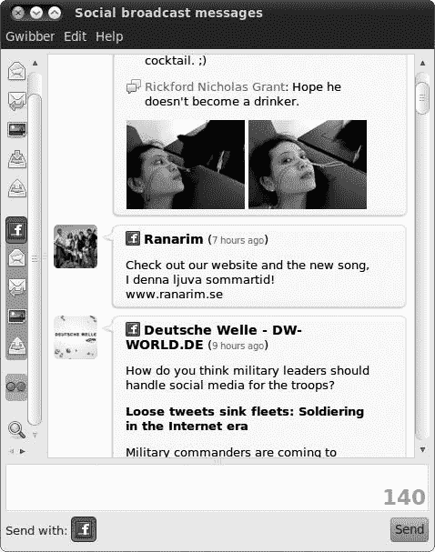
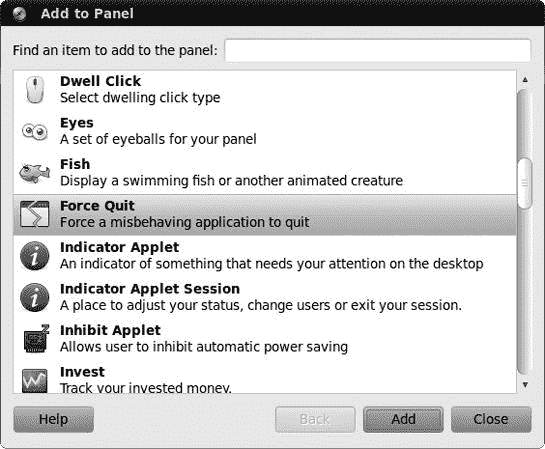
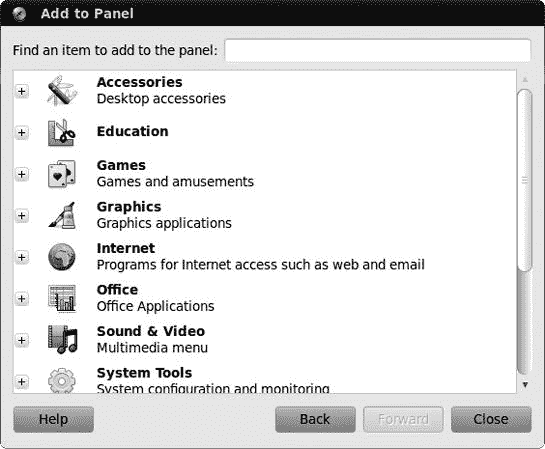
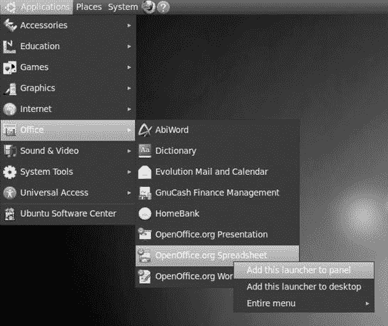
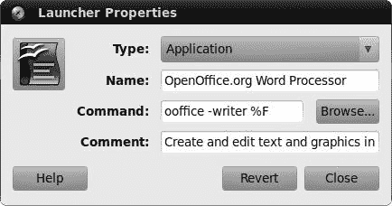
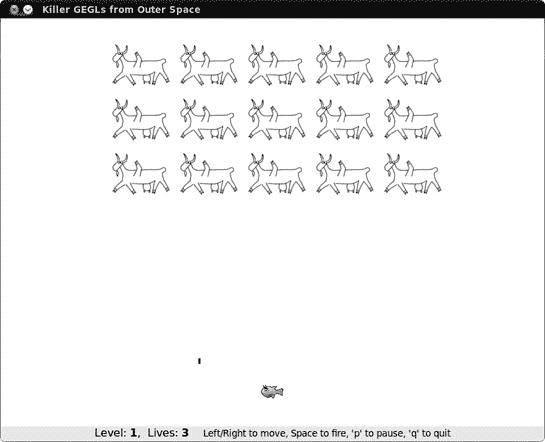
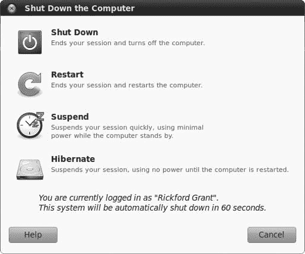

# 第三章. 一个新的家

### 了解桌面

现在 Ubuntu 已经启动并运行，你准备好跃跃欲试了。如果你是从硬盘上运行 Ubuntu，你将首先看到登录屏幕，每次启动时都会出现（图 3-1). 没有必要让登录屏幕等待，所以点击你的用户名，输入你的密码，然后按**回车**。片刻之后，你将面对 Ubuntu 的桌面。

# 欢迎来到 GNOME 桌面

图 3-2 显示了 Ubuntu 对 GNOME 桌面的实现，正如你所见，它与 Windows 或 Mac OS 环境中的体验并没有太大的不同，除了它屏幕顶部和底部都有任务栏，或者称为**面板**。除了从 Ubuntu 桌面 CD 运行实时会话时，没有桌面图标，在这种情况下，你会看到一个启动器来运行安装向导（标记为*安装 Ubuntu 10.04*）和一个*示例*文件夹，其中包含许多与 Ubuntu 捆绑的应用程序的样本文件。总的来说，这是一个非常整洁的地方，尽管它与其他操作系统桌面环境在外观上有相似之处，但 GNOME 中的事物足够不同，足以引起兴趣。

图 3-1. Ubuntu 登录屏幕

GNOME 桌面的主要元素是屏幕顶部和底部的面板以及出现在这些面板上的图标。桌面本身，尽管启动时是空的，但确实也经历了一些动作，但我会稍后提到。现在，我将专注于两个面板。

图 3-2. Ubuntu 中的 GNOME 桌面

# 顶部面板

在你的桌面上的两个 GNOME 面板中，顶部面板基本上是所有动作发生的地方。正如你所见，在面板的左端有三个菜单和一些图标，在另一端有许多零散的东西（图 3-3). 为了让你了解每个面板项的功能，我现在将简要描述每个项，从左到右，这似乎是现在的时尚。

图 3-3. 顶部 GNOME 面板的左右两侧

## 左端

在顶部面板的最左边，你会找到一组三个菜单。这些菜单提供了访问系统提供的应用程序、位置和工具的大部分功能：

应用程序菜单

到您大多数应用程序、软件管理器和一些系统工具的入口点

地点菜单

您的系统导航器，您可以通过它访问您的家目录，浏览您的计算机文件系统以及连接的网络，并在您的硬盘上搜索文件

系统菜单

到您系统首选项和管理工具的入口点

在三个菜单的右侧是两个启动器。当点击这些图标时，它们将启动以下应用程序：

Firefox

您的网页浏览器

帮助

访问您硬盘上安装的 Ubuntu 帮助文件

## 右端

在顶部面板的右侧是一系列可以执行各种功能的图标。其中一些是指示器，而其他则是小程序，允许您执行某些功能：

网络管理小程序

允许您查看您的网络状态并配置您的网络设备。当与无线网络连接一起使用时，此图标指示无线信号的强度，并允许您轻松地在无线网络之间切换。

音量控制

音量控制器。当然。

邮件/消息指示器

一个指示器，让您知道何时收到电子邮件或聊天消息。它还允许您轻松发送电子邮件消息，检查您的通讯录，甚至通过一个名为 Gwibber 的应用程序检查和发送消息到社交网络，如 Facebook、Twitter 和 Flickr，您将在第五章中了解更多关于 Gwibber 的信息。

图 3-4. Gwibber 允许您查看和发送社交网络上的消息。

日历/时钟

日期和时间以及天气。

会话指示器

显示当前用户的名字，并允许您更改您的即时消息状态和访问您的社交网络、即时消息和 Ubuntu One 的选项。

退出/注销

允许您锁定屏幕，注销，关机，重启或切换用户。

根据您的硬件配置或系统状态，将出现其他指示器：

蓝牙管理器

如其名所示，这仅在具有蓝牙功能的机器上出现。

电池指示器

在笔记本电脑上，显示您是使用电池还是线缆供电，如果是电池，则显示电池剩余的电量。

# 底部面板

如您在图 3-5 中看到的，底部面板是一个相对简单的事物，只包含我现在将简要描述的四个项目：

显示桌面

一个按钮，可以最小化所有打开的窗口，让您在桌面被遮挡时看到桌面。

窗口列表

你打开的窗口或应用程序的列表。如果没有打开任何东西，列表中将没有窗口。这与 Windows 任务栏中发生的情况非常相似。

工作区切换器

一个允许你在虚拟桌面之间切换的应用程序。（我将在虚拟桌面中详细介绍这一点。）

垃圾箱

垃圾箱并没有什么神秘之处……除了它在面板上的位置相当像 Mac OS X。

图 3-5. 底部 GNOME 面板

# 项目 3A：自定义 GNOME 面板

GNOME 面板不是一个静态的东西。你可以添加*启动器*（对于 Windows 和 Mac 用户分别称为*程序快捷方式*或*别名*），实用程序，甚至娱乐项目，使其几乎可以做任何你想做的事情——当然，在限制范围内。在这个项目的各个阶段，你将自定义你的面板，以获得一些实际操作经验，并在阅读本书的其余部分时使事情更加方便。当然，你可以自由更改我要求你做的任何自定义设置（尽管如果你是从 Ubuntu 桌面 CD 上的实时会话中工作，你将无法对这个问题发表意见，因为你无法保存你的设置）。

以下每个子项目都非常简单。大多数都是只有三步的点对点操作，你应该能够轻松处理。

## 3A-1: 向面板添加实用按钮

GNOME 面板允许你添加许多实用应用程序，这些应用程序被称为*小程序*。每个小程序都有一些特定的功能，例如跟踪你的股票，告诉你天气，或者执行一些特定的系统相关功能。首先，让我们向顶栏添加一个有用的实用程序：强制退出按钮。强制退出按钮让你可以快速轻松地处理无响应的窗口。

是的，偶尔会发生这种情况：一个窗口突然拒绝做任何事情。无论你想让它做什么，或者它应该做什么，它只是坐在那里，就像它在罢工一样（也许它真的在罢工）。只需点击一次强制退出按钮，你的光标就变成了一个强大的外科手术工具，可以杀死你点击的窗口。你绝对不希望没有这个按钮，所以这里是如何将它添加到面板上的方法：

1.  右键点击顶栏上的任何空白区域。

1.  从弹出菜单中选择**添加到面板**，之后将出现添加到面板窗口。

1.  在那个窗口中，向下滚动，点击**强制退出**一次以突出显示它，就像我在图 3-6 中所做的那样。点击**添加**按钮，然后点击**关闭**以完成工作。

图 3-6. 向面板添加启动器和实用小程序

为了巩固您刚刚学到的方法，让我们将另一个实用程序添加到面板：运行应用程序小程序。一旦您开始在 Ubuntu 中安装应用程序，您会发现其中一些应用程序不会自动在应用程序菜单中安装程序启动器。这意味着每次您想要运行此类程序时，您都必须打开一个终端窗口并输入一个命令，这可能会很快变得令人厌烦。运行应用程序小程序是解决这个问题的一种方法。

要将运行应用程序小程序添加到面板，只需按照添加强制退出按钮时使用的相同步骤操作，但在这次的第 3 步中，在添加到面板窗口中突出显示**运行应用程序**而不是强制退出。

### 注意

如果您后来决定不再保留运行应用程序小程序在面板上，或者如果您更喜欢键盘快捷键而不是指向和点击，请注意您也可以通过按**alt**-F2 打开小程序。

## 3A-2：将有趣的小程序添加到面板

GNOME 面板不仅允许您添加非常实用的实用程序，还允许您添加相当看似无用的娱乐项目。在本项目的这一部分，您将添加两个这样的娱乐项目：Eyes 和一个小名叫 Wanda 的鱼。

初看 Wanda 似乎只是摆动尾巴和喷出几个气泡。然而，如果您通过 Ubuntu 软件中心安装一个小程序 Fortune，您将在第六章中学习如何使用它，然后点击 Wanda，将弹出一个窗口，在那里她会吐出引言和独特的单行笑话。

要看看 Wanda 在行动中的样子，尽管这种行动可能有限，但步骤基本上与项目 3A-1 中的步骤相同，但我会再次过一遍：

1.  右键单击顶部面板上的任何空白区域。

1.  从弹出菜单中选择**添加到面板**，之后将出现添加到面板窗口。

1.  在该窗口中，点击**Fish**一次以突出显示它，然后点击**添加**按钮，最后点击**关闭**。

在您的面板上现在已安装了 Wanda 之后，您可以添加 Eyes，这是一对眼睛，它会跟随您的鼠标光标在桌面上移动。按照相同的步骤操作，但在第 3 步中点击**Eyes**而不是 Fish。

## 3A-3：将程序启动器添加到面板

现在，让我们继续做一些更实用的操作——将程序启动器添加到面板。虽然通过应用程序菜单导航运行应用程序非常容易，但无疑有一些您会频繁使用并希望更容易访问的应用程序。OpenOffice.org 的文本处理器 Writer 可能是这些应用程序之一。

### 方法 1

您可以通过多种方式将启动器添加到面板，但让我们从最传统的方法开始。要为 OpenOffice.org Writer 添加面板启动器，请按照以下步骤操作：

1.  右键单击顶部面板内的任何空白区域。

1.  在弹出菜单中选择**添加到面板**以打开添加到面板窗口。

1.  在该窗口中，选择**应用程序启动器**，然后点击随后出现的**前进**按钮。

1.  随后会出现一个新屏幕，显示应用程序菜单的内容 (图 3-7). 点击**Office**旁边的**+**以展开该菜单，然后向下滚动并点击**OpenOffice.org 文字处理器**以突出显示它。

1.  点击**添加**按钮，然后点击**关闭**以完成过程。

图 3-7. 向面板添加应用程序启动器

## 方法 2

实际上还有一种更快的方法可以向面板添加程序启动器。例如，你将为 OpenOffice.org 电子表格程序 Calc 添加一个启动器。以下是步骤：

1.  前往应用程序菜单，导航到**Office** ▸ **OpenOffice.org 电子表格**并右键单击。

1.  在随后出现的弹出菜单中，选择（这就是通常的点击操作）**将此启动器添加到面板** (图 3-8). 然后，应用程序启动器将出现在面板上。

图 3-8. 另一种向面板添加应用程序启动器

### 方法 3

现在你已经学会了两种向面板添加应用程序启动器的方法，我也可以向你透露第三种，甚至更简单的方法。只需打开一个菜单，选择你想要添加到面板的项目，然后将其拖动到那里。嗯，这已经很简单了，对吧？

## 3A-4: 更改面板启动器图标

你可能会认为你新增的两个程序启动器有些单调，因此，区分它们有些困难。幸运的是，你可以非常容易地更改任何启动器的图标。为了了解如何操作，我将针对两个 OpenOffice.org 启动器立即提出的问题进行解答。你需要做的是：

1.  右键单击你添加的第一个程序启动器（文字处理器），并从弹出菜单中选择**属性**。

1.  在随后出现的“启动器属性”窗口中，点击**OpenOffice.org 文字处理器**图标，这将打开一个选择图标窗口。

1.  在该窗口中，点击**浏览**按钮以打开浏览窗口。

1.  在该窗口顶部，点击**图标**按钮。在右侧窗格中，双击**hicolor**文件夹，然后双击**hicolor**文件夹内的**48×48**文件夹，接着双击**48×48**文件夹内的**apps**文件夹。

1.  在该窗口中向下滚动并点击一次**openofficeorg3-writer.png** (图 3-9).

    

    图 3-9. 选择新的面板启动器图标

1.  在该窗口中点击**打开**按钮，这将关闭它。

1.  然后，您将回到“启动器属性”窗口，此时它应该看起来像图 3-10。如果是这样，请点击**关闭**。

图 3-10. 启动器属性窗口

完成转换后，基本上按照为文字处理器启动器执行的相同步骤，但在第 3 步应选择**openofficeorg3-calc.png**作为图标。

## 3A-5: 将抽屉添加到面板

我相当喜欢 GNOME 面板的一个特性是抽屉。**抽屉**是一个小程序，它通过允许您添加下拉面板来节省面板空间，在这些面板中，您可以放置您在其他地方没有空间放置的启动器。这些抽屉也是放置您通常需要通过在终端窗口中键入命令或通过启动应用程序窗口运行的应用程序启动器的方便位置，例如您从源代码编译的或通过脚本运行的应用程序。您将在第九章中学习如何这样做。当然，您可以在抽屉中放置任何您想要的东西，包括常用文件甚至整个菜单。

将抽屉添加到您的面板非常简单，基本上与您用来将强制退出按钮添加到面板的相同程序。以下是您需要做的所有事情：

1.  在顶部面板的任何空白区域右键单击。

1.  从弹出菜单中选择**添加到面板**，之后将出现“添加到面板”窗口。

1.  在该窗口中，点击一次**抽屉**以突出显示它，然后点击**添加**按钮。通过逻辑上合理的点击**关闭**来关闭窗口。

## 3A-6: 将程序启动器添加到抽屉

您刚刚添加的抽屉目前是空的，所以让我们通过添加三个有用的但不太引人注目的系统实用程序的启动器来充分利用它。这些是系统监视器，它允许您查看计算机正在运行的应用程序和进程、内存和 CPU 使用情况以及存储设备使用情况；终端，您可以在其中键入并执行命令（我承认这有点儿技术性，但非常实用）；以及 Ubuntu 软件中心，您可以使用它下载和安装应用程序。

这里您需要做的是：

1.  在面板上右键单击**抽屉**小程序，并在弹出菜单中选择**添加到抽屉**。

1.  在随后出现的“添加到抽屉”窗口（其外观和操作方式与“添加到面板”窗口相同），选择**应用程序启动器**，然后点击出现的**前进**按钮。

1.  在下一个屏幕上，点击**附件**旁边的那个小+号，向下滚动并点击**终端**以选择它，然后点击**添加**按钮。现在，终端启动器将被加载到抽屉中。

1.  接下来，向下滚动并点击**管理**旁边的那个小箭头。

1.  在该类别内向下滚动，直到找到 **Ubuntu 软件中心**，点击它进行选择，然后点击 **添加**。

1.  最后，通过向下滚动到系统工具类别，点击该类别旁边的加号，从该组中选择 **系统监视器**，然后点击 **添加**，来添加系统监视器的启动器。你现在可以关闭添加到抽屉的窗口了。

现在三个启动器应该已经加载到抽屉中，所以点击抽屉偷偷看一下。你的应该和我 图 3-11 中的看起来一样。

图 3-11. 面板抽屉中的启动器

## 3A-7：将整个菜单内容添加到面板

如果你发现你经常使用应用程序菜单、位置菜单或系统菜单中的某个特定子菜单中的应用程序，你可以选择将整个菜单作为菜单或抽屉添加到面板中，方法与你在 3A-3 项目的 方法 2 部分的 方法 1 中使用的方法类似。为了了解如何做到这一点，让我们将游戏子菜单作为菜单添加到面板中，将声音与视频子菜单作为抽屉添加。你需要做以下事情：

1.  通过选择 **应用程序** ▸ **游戏** 并然后右键点击该子菜单内的任何启动器，将游戏菜单添加到面板中。

1.  在出现的弹出菜单中，选择 **整个菜单** ▸ **将此作为菜单添加到面板**。

1.  通过选择 **应用程序** ▸ **声音与视频** 并然后右键点击你找到的任何启动器，将声音与视频子菜单作为抽屉添加到面板中。

1.  在弹出菜单中，选择 **整个菜单** ▸ **将此作为抽屉添加到面板**。

现在你的面板上应该有两个新的启动器，它们的图标与应用程序菜单中相关项目旁边的图标相匹配。正如你在 图 3-12 中可以看到的，这两个图标的作用略有不同。

图 3-12. 将菜单作为菜单（左侧）和抽屉（右侧）添加到面板中

## 3A-8：在面板上移动项目

好吧，现在你已经添加了本章中要添加到面板上的所有内容。现在那里可能看起来有点乱，所以我们通过移动项目来整理一下。你将尝试将项目按主题分组，以便更容易处理。

幸运的是，你可以通过右键点击相关的启动器，从弹出菜单中选择 **移动**，然后将启动器拖动到你想要放置的位置来轻松地移动面板启动器。一旦启动器放置到你想要的位置，点击一次启动器，它就会停留在那里。

为了练习这个移动操作，让我们将你添加的启动器、菜单和抽屉按照以下从左到右的顺序移动：应用程序、位置、系统、Firefox、帮助、OpenOffice.org Writer、OpenOffice.org Calc、声音与视频、游戏、抽屉。将剩余的启动器放置在面板的右端，在网络管理器小程序或任何自动出现的其他小程序的左侧，按照以下从左到右的顺序：眼睛、Wanda（鱼）、强制退出。最后，将“运行应用程序”小程序单独放置在两个启动器群组中间。当你完成所有更改后，你的面板应该看起来几乎像我图 3-13 中的那样。

图 3-13. 带有新启动器的 GNOME 面板

## 更多面板乐趣

除了你在项目 3A 中进行的初步定制外，你还可以做更多的事情来改变面板的外观和感觉。当然，你可以通过右键单击相关项目并从弹出菜单中选择**从面板中删除**来删除任何启动器、抽屉或菜单，但仍有更多选项。其中大部分可以通过右键单击面板上的任何空白区域并选择**属性**来获得，这将打开面板属性窗口。

从这个窗口中，你可以更改面板的位置，改变其大小，更改其颜色，或者使其透明——非常酷。你还可以设置面板，使其在你不使用时自动消失，并在你将鼠标光标移到面板通常所在区域时重新出现。不要害怕尝试——这是乐趣的一半！

# 项目 3B：操作菜单

现在你已经了解了你可以用你的面板做一些酷而有用的东西，现在让我们继续讨论菜单的话题。GNOME 的一个非常好的特性是它允许你编辑其菜单。你可以添加启动器、删除项目、移动项目，甚至更改菜单中出现的图标。总的来说，你对这些事物有相当大的控制权，但在这个项目中，你将限制工作在以下两个领域：更改图标和移动菜单项。

## 3B-1：在菜单中更改图标

如你所回忆的那样，你添加到面板中的 OpenOffice.org Writer 和 Calc 启动器的一个问题是它们共享相当相似的图标。如果你选择**应用程序** ▸ **办公**，你会看到各种 OpenOffice.org 模块的图标，尽管它们不完全相同，但也有些相似。为了解决这个问题，你将把这些图标更改为与项目 3A-4 中使用的两个面板启动器相同的图标集。在这种情况下，只需遵循以下步骤：

1.  右键单击**应用程序**菜单并选择**编辑菜单**，或者转到**系统**菜单并选择**首选项** ▸ **主菜单**。

1.  在随后出现的菜单编辑窗口（图 3-14 中描述的方法，在随后出现的“选择图标”窗口中导航到*/usr/share/icons/hicolor/48x48/apps*。

1.  滚动到并单击**openofficeorg3-writer.png**，然后单击**打开**。

1.  新图标现在应该出现在启动器属性窗口中。单击**关闭**，您将在菜单编辑窗口中看到变化。

1.  重复此过程为 OpenOffice.org 电子表格，如果您愿意，甚至为 OpenOffice.org 演示文稿。只需确保为每个模块选择一个合适的名称，并选择合适的图标（例如，电子表格使用*openofficeorg3-calc.png*，演示文稿使用*openofficeorg3-impress.png*）。完成之后，请保持编辑窗口打开，以便继续进行 3B-2 项目的编辑工作。

图 3-14. 定制您的菜单

## 3B-2：更改菜单中图标顺序

当您仍然可以访问 Office 菜单时，让我们来处理我认为的另一个问题：菜单中项目顺序。在我看来，将最常用的办公应用程序——您的文字处理器——放在菜单底部实在说不通。

解决这种情况很简单。只需在菜单编辑窗口的右侧面板中单击**OpenOffice.org 文字处理器**图标。然后，在窗口右侧点击**向上移动**按钮，根据需要多次点击，直到文字处理器图标位于列表的顶部。

现在您的文字处理器已经位于菜单的顶部，其他 OpenOffice.org 模块似乎在底部显得有些不协调，所以您也可以通过相同的方法将其他 OpenOffice.org 模块移动到顶部附近。

当我在逻辑上思考的时候，为什么不更进一步，将 Evolution 启动器从“办公”菜单移到“互联网”菜单，这似乎是它更自然的位置？如果你同意并且想要隐藏这个 Evolution 实例，只需取消选中其名称旁边的复选框。那个条目的名称应该会变成斜体，表示所讨论的项目在实际上拉菜单中是不可见的。完成之后，你的菜单编辑器窗口应该看起来像我的图 3-15 中的那样。如果你一切都觉得满意，点击**关闭**，然后选择**应用程序** ▸ **办公**来查看结果。

图 3-15. 使用菜单编辑器管理菜单

现在通过在菜单编辑器窗口的左侧面板中点击**互联网**，然后点击**新建条目**按钮，将 Evolution 添加到互联网菜单中。在出现的创建启动器窗口中，在名称框中输入**`Evolution 邮件和日历`**，在命令框中输入**`evolution`**。Evolution 图标应该随后自动出现在图标按钮中。完成后，点击**确定**，之后新的 Evolution 条目将出现在互联网菜单中。关闭菜单编辑器窗口。

# 虚拟桌面

现在是时候讨论 Linux 的一个相当方便的功能了：*虚拟桌面*。尽管虚拟桌面功能最近才被引入到其他操作系统中，但它已经作为 Linux 的一个特性存在多年了（是的，它就是从这里开始的，朋友们）。但与其在这里喋喋不休地谈论虚拟桌面是什么以及它能为你做什么，不如通过给你一些实际操作经验来让你了解它可能更好。

在你的 GNOME 面板上，点击**Wanda (鱼)**、**OpenOffice.org Writer**和**Firefox**启动器。这样，你将在当前桌面或*工作区*上打开三个窗口。现在看看底部面板右侧的工作区切换器。应该有四个方框，其中左边的一个（你的当前工作区）是浅灰色。如果你点击那个现在是深灰色的方框，你所有的打开窗口会突然消失。

实际上，没有什么真正消失——你只是看到了一个新的桌面。你所有的其他窗口仍然在之前的桌面中打开并运行。在这个第二个桌面中，你可以打开其他东西：选择**应用程序** ▸ **游戏** ▸ **AisleRiot 争牌**。AisleRiot 争牌卡牌游戏很快就会出现。

现在，你在两个不同的桌面上有打开的窗口，你可以在这两个桌面之间来回切换。要做到这一点，只需转到你的面板中的工作区切换器，然后点击现在变灰的左框，这将带你回到你的原始桌面。一旦你这样做，你刚刚所在的工作区的框将变成深灰色，然后你可以点击它回到你的游戏桌面。

如你所想，这个功能除了帮助你避免杂乱之外，还有一些潜在的益处。想象一下，你正在使用 OpenOffice.org Writer 键入一些长文档。最终，你会感到疲倦，决定稍微放松一下，玩一会儿像扫雷这样的游戏。为了做到这一点，你切换到另一个桌面，在那里打开并玩这个游戏。过了一会儿，当你注意到你的老板在办公室里四处走动时，你只需简单地切换回第一个桌面，这样当他走过并问“忙吗，博阿兹？”时，你看起来很忙。

呼呼！

顺便说一句，你还可以通过同时按下并保持**ctrl**-**alt**，然后按下你的左右箭头键来在虚拟桌面之间切换。

那么，如果你在一个工作区运行 OpenOffice.org Writer，在另一个工作区运行 GIMP，但突然想到如果它们都在同一个工作区运行会很有用怎么办？你是退出 GIMP 并在另一个桌面再次启动它吗？幸运的是，事情比这简单得多，实际上有两种方法可以完成这项工作。

这些方法中的第一种是将你想要移动的窗口的标题栏右键单击，然后选择**移动到左侧工作区**或**移动到右侧工作区**。你也可以选择**移动到另一个工作区**，然后通过编号选择你想要移动窗口到的工作区：工作区 1，工作区 2，工作区 3，等等。

如果你更喜欢将手放在键盘上而不是鼠标上，你也可以通过使用快捷键将窗口从一个工作区移动到另一个工作区。当你想要移动的窗口处于活动状态（即在堆叠的顶部，换句话说），按下并保持**shift**-**ctrl**-**alt**，然后使用左右光标键将窗口移动到所需的桌面。

# 万达重访——GNOME 彩蛋

好吧，既然你已经完成了本章的工作，那么是时候通过重新拜访我们聪明的鱼朋友 Wanda 来放松一下了。鉴于你对 Wanda 这条鱼的了解，你可能会觉得我再次谈论她有些奇怪，但 Wanda 的鳍下还有一些小把戏。事实上，她是一个很好的介绍 GNOME 最著名两个彩蛋的手段。*彩蛋*，如果你不知道的话，是程序员似乎喜欢偷偷放入他们程序中的隐藏代码片段。它们通常没什么用，但可以在所有操作系统、众多应用程序甚至 DVD 中找到（想了解更多，请访问 [`www.dvdeastereggs.com/`](http://www.dvdeastereggs.com/)）。一个彩蛋的好例子是我第一次在我的第一台 Mac 上遇到的一个，那是一台古老的 Mac SE，拥有惊人的 2MB 内存。在这台机器上，你可以通过按下机器侧边很少使用的调试键，然后输入 **`G 41D89A`** 来调出一个图像（或者是一个幻灯片展示？）。挺酷的，我想，但如果没有在某个杂志上读到关于它的内容，我永远也不会偶然发现它。

如我的例子所示，访问这些彩蛋通常需要一些不寻常的操作，这些操作你通常不会在日常活动中执行。要查看与 Wanda 相关的彩蛋，点击你刚刚添加到面板上的 **“运行应用程序”** 按钮，在命令框中输入 **`gegls from outer space`**，然后点击 **“运行”**。你将看到一款奇怪的小游戏，属于太空侵略者类型，如 图 3-16 所示，其中 Wanda 保护我们心爱的星球免受……嗯， gegls 的侵害。

图 3-16. GNOME 中与 Wanda 相关的一个彩蛋

要尝试另一个 Wanda 彩蛋，再次打开“运行应用程序”面板小程序，但这次输入 **`free the fish`**，然后点击 **“运行”**。Wanda 现在将出现在你的桌面上游动。如果你点击她，她将游走并消失在画面之外……但她会回来。

要结束 Wanda 的来来去去，你需要重新启动 GNOME 面板。有几种相当不优雅的方法可以做到这一点，但到目前为止，你可以通过再次打开“运行应用程序”面板小程序，输入 **`killall gnome-panel`**，然后点击 **“运行”** 来完成。你的面板会消失一两秒钟，但很快就会重新出现。然而，Wanda 将会消失。

# 关闭

现在您已经非常熟悉您的桌面环境了，您可能觉得可以结束一天的工作并关闭电脑。为此，只需点击顶部面板最右角的**退出**按钮（它看起来像一个电源按钮）。会出现一个菜单（图 3-17

图 3-17. GNOME 的会话菜单选项

实际关机过程将花费几秒钟，因为系统正在关闭其各种服务。当一切完成后，系统应该也会关闭您的电脑，这样您就完成了。然而，在少数机器上，系统可能无法关闭您的电脑。您可以通过屏幕活动是否结束来判断这种情况是否发生在您身上。如果您到达那个点，大约 15 秒内没有任何其他动作发生，那么只需手动按下电源按钮关闭电脑即可。在那个时刻这样做是完全安全的。

图 3-18. 同时按下 ctrl-alt-delete 弹出的关闭计算机窗口
