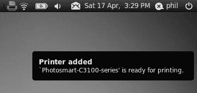
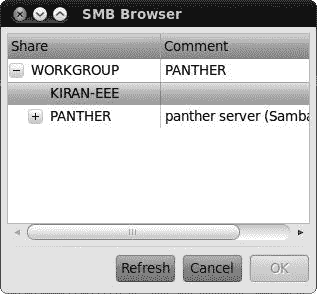
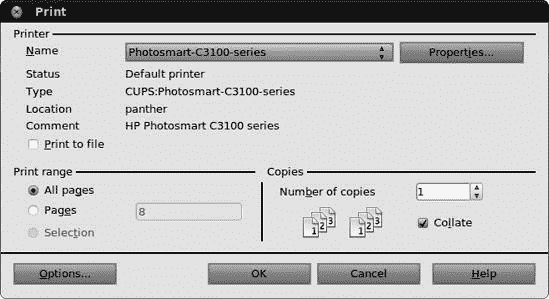
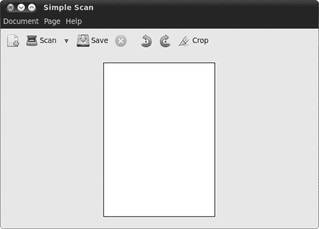
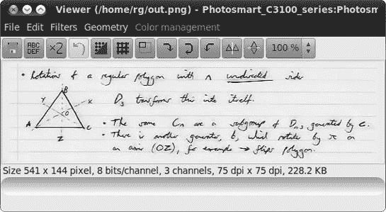

# 第十章。GUTENBIRD

### 设置和使用您的打印机和扫描仪

两种最常见的计算机外围设备是打印机和扫描仪。这完全合理，因为正是这两样工具将网络冲浪、游戏、音乐制作、数字处理等芯片盒变成了有意义的生产工具——如果你愿意，可以说是一个虚拟出版社。这两个工具帮助您的电脑将数字信息转换为纸质副本（在打印机的情况下）和将纸质副本转换为数字信息（在扫描仪的情况下）。因此，这些工具如今常常以多功能打印机的形式一起出现，这并不令人惊讶。

在本章中，你将学习如何将这些有用的设备连接到你的电脑，如何设置它们，以及如何使用它们。如果你更倾向于使用数码相机而不是扫描仪，你可能想偷看一下第十三章；否则，穿上你的打印机围裙，继续阅读。

# 打印机

除非你使用电脑的唯一目的是玩游戏、听 MP3 或在大风天关上门，否则你无疑会想将你的机器连接到打印机。尽管个人电脑被宣称为将引领无纸化办公时代，但电脑作为桌面出版和通用工作工具的强大功能使得生产高质量的打印文档比以往任何时候都更有吸引力。

## 确认您的打印机得到支持

将打印机设置为新系统的一部分是一项相对简单的任务，而且似乎 Linux 世界中的打印机支持随着每个版本的发布而变得越来越好。一般来说，对 Epson、Brother、Samsung 和 Hewlett-Packard 打印机的支持良好，而对其他制造商和其他打印机类型的支持则有点零散（尽管在改善）。

如果你真的想确保你的打印机得到支持，只需按照下一节中的说明尝试一下。如果你正在考虑购买打印机或正在考虑是否切换到 Linux，请访问[`www.linuxprinting.org/`](http://www.linuxprinting.org/)。在该网站上，你可以查看在线数据库以查看你的打印机是否目前得到支持，以及支持的程度。支持打印机的列表还包括有关最适合你目的的驱动程序的信息。还有一个建议的品牌和型号页面，以防你打算购买打印机并打算与 Linux 系统一起使用。在做出购买决定之前，请阅读此内容。你可能还想查阅 Ubuntu 的列表[`wiki.ubuntu.com/HardwareSupportComponentsPrinters/`](https://wiki.ubuntu.com/HardwareSupportComponentsPrinters/)。

## 让 Ubuntu 自动识别并设置您的打印机

在 Ubuntu 中处理打印机几乎不需要动脑筋，因为 Ubuntu 会自动检测大多数打印机。如果您有一个 USB 打印机，将其连接到您的计算机，然后打开打印机（反之亦然也应该工作得很好）。假设 Ubuntu 识别了您的打印机，而且可能性很大，系统在自动设置过程中，右上角面板会出现一个小的打印机图标。当它完成时，一个类似于图 10-1 中的小通知气泡会出现，告诉您您的打印机已被识别。在这种情况下，您不需要做任何事情——您的打印机已设置好，准备使用。

然而，也有可能 Ubuntu 会识别您的打印机但找不到与之完全匹配的驱动程序。在这种情况下，它会提供一个替代驱动程序，并且自动识别窗口将看起来与图 10-1 中的略有不同。

图 10-1. Ubuntu 自动识别并配置您的打印机。

如果您发现自己处于这种情况，打印一个测试页面来查看替换的驱动程序是否按预期工作也不是一个坏主意。您可以通过点击**系统** ▸ **管理** ▸ **打印**，然后在出现的打印窗口中双击您的打印机来完成此操作。将打开打印机属性窗口；请确保从窗口左侧的列表中选择**设置**，然后点击**打印测试页面**按钮（图 10-2

图 10-2. 通过打印机属性窗口打印您的测试打印机

如果你的打印机连接到电脑的并行端口，那么在开机时如果打印机已经连接，自动检测和设置也应该可以正常工作。如果没有连接，请关闭系统并关闭电脑，然后将打印机连接到电脑，打开打印机，然后再次启动电脑。如果幸运的话，这次打印机应该会被自动识别并设置好。你也可以尝试用这种方法来设置一个最初未被识别的 USB 打印机。

图 10-3. Ubuntu 测试打印页

## 手动配置打印机

如果你的打印机没有被自动识别，你仍然可以手动设置。以下是你需要做的：

1.  选择**系统** ▸ **管理** ▸ **打印**。一个打印窗口将出现，显示已经识别和/或配置的打印机。

1.  点击**添加**按钮，之后系统将在新打印机窗口中显示任何新的发现（图 10-4

    图 10-4. 手动设置打印机

    

    图 10-5. 打印机设置向导推荐使用哪个驱动程序。

1.  在向导的最后一步，填写适合你需要的空白，然后点击**应用**，之后向导将关闭，并询问你是否想打印测试页。为了确保一切正常，打印测试页总是一个好主意，所以点击**是**。

你的系统将向打印机发送测试文档，并在一个小窗口中通知你已发送，你可以关闭该窗口。打印机应该会很快打印测试页。

### 注意

如果你的测试页没有按照预期打印出来，或者如果你的打印机没有被系统自动或正确配置，请访问[`www.linuxprinting.org/`](http://www.linuxprinting.org/)查看是否有针对你型号的特殊要求或注意事项。

## 通过网络连接设置打印机

如果你想要使用通过家庭或办公室网络连接的打印机，只需按照以下步骤操作：

1.  选择**系统** ▸ **管理** ▸ **打印**。一个打印窗口将出现，显示已识别和/或配置的打印机。

1.  点击**添加**按钮，之后将出现新打印机窗口。

1.  在窗口的左侧面板中，选择**网络打印机** ▸ **通过 SMB 的 Windows 打印机**，点击该条目一次，然后点击页面右上角的**浏览**按钮。

1.  在出现的 SMB 浏览器窗口中（图 10-6 中的第 5 步开始。

    

    图 10-6. 在 Windows 网络上浏览连接的打印机

## 对于无驱动程序的您

正如我提到的，Linux 尚未内置对某些打印机的支持。对于那些发现自己使用这类打印机的用户，您可以通过几种途径来解决问题，使打印机工作。

### 检查连接

您可能会惊讶，我多次通过简单地打开打印机或摇晃或重新插拔 USB 或并行连接器来解决某人的打印机问题。如果打印机的型号名称在打印机设置向导的第一页中没有出现，那么关闭电源和/或连接松动的打印机通常要承担责任。

如果这种方法失败，请浏览到[`www.linuxprinting.org/`](http://www.linuxprinting.org/)，因为有时 Linux 只能通过并行端口连接某些打印机，即使在其他系统中它们通过 USB 工作。

### 尝试您的 Windows 驱动程序

如果您的打印机附带了安装光盘，您可能想看看是否可以在那里找到驱动程序。此类光盘上的驱动程序应以.*ppd*（表示“PostScript 打印机描述”）结尾。要使用这些驱动程序之一，请按照前面描述的方法添加打印机，但到达选择打印机型号的新打印机窗口时，点击**提供 PPD 文件**选项。然后通过点击页面中间的**（无）**按钮尝试定位适当的文件。如果您找到了驱动程序，点击**下一步**按钮，然后继续打印机设置。

### 使用第三方驱动程序

最近，越来越多的 Linux 打印机驱动程序变得可用。如果你在打印机设置向导的第二页找不到你的打印机，只需尝试在谷歌上搜索你的打印机型号加上单词*linux*。例如，过去我有一台激光打印机，在[`www.linuxprinting.org/`](http://www.linuxprinting.org/)上没有显示，所以我谷歌搜索了打印机，*samsung+SCX4100+linux*，这把我带到了[`www.driverstock.com/`](http://www.driverstock.com/)，这是一个为大多数操作系统提供免费打印机驱动程序的网站，包括 Linux。在该网站上，我不仅找到了我打印机的驱动程序，还找到了其内置扫描仪的驱动程序。

你还可能想检查你打印机制造商的网站，因为现在许多制造商为他们的许多打印机提供 Linux 驱动程序。兄弟、利盟、惠普、佳能和三星就是这样做的。还有一家德国公司([`www.turboprint.info/`](http://www.turboprint.info/))，它为一些难以处理的机器和高质量的图形解决方案提供 Linux 驱动程序，尽管需要付费。

如果你偶然发现并下载了一个没有自带安装程序的打印机驱动程序，只需按照尝试 Windows 驱动程序的说明操作。最后，别忘了尝试访问 Ubuntu 论坛([`www.ubuntuforums.org/`](http://www.ubuntuforums.org/))，看看那里是否有人有让打印机在其系统上工作的经验。

### 尝试错误

最后，总是有传统的尝试错误方法，有时也会奏效。在通过向导窗口设置打印机时，尝试选择打印机制造商提供的其他打印机型号和/或驱动程序之一。

完成向导后，在打印窗口中双击你添加的打印机，点击**设置**选项卡，然后点击**打印测试页**按钮以查看发生了什么。如果没有发生任何事，点击设置屏幕上制造和型号行最右端的**更改**按钮，选择不同的打印机型号和/或驱动程序，然后，回到设置屏幕，再次点击**打印测试页**按钮。重复此过程，直到找到可行的方法。如果有任何运气，可能会有所帮助……好吧，如果你真的绝望了，就试一试。

## 打印详情

现在你的打印机已经设置好了，你无疑会想要开始打印！这是一个简单的任务，并且与 Windows 和 Mac 世界中的操作并没有太大区别，所以你不需要太多解释就可以继续。事实上，在 Ubuntu 中打印变得比以往任何时候都要简单，因为所有你通常想要调整的设置都在打印窗口中，该窗口在应用程序文件菜单中选择打印时出现。我甚至敢说，现在在 Ubuntu 中了解打印选项比在 Windows 或 OS X 中还要简单。

您应该知道，选项卡的功能可能会根据您打印的应用程序而有所不同。例如，当您从 GIMP 打印时，您会看到的选项卡与您从 Firefox 打印时看到的选项卡略有不同。然而，通用和页面设置选项卡几乎总是存在的。话虽如此，我将为您提供一个关于在打印窗口选项卡中可用的某些设置的概览：

**通用**

打印机选择、打印页数、副本数量、打印顺序、整理

**页面设置**

每页页数、缩放、纸张类型、纸张来源、输出托盘

**选项**

打印边框、缩放以适应页面、打印背景、页眉和页脚

**图像设置**

大小、分辨率、页面定位

**作业**

打印时间（现在、稍后、在指定时间），封面页

**图像质量/高级**

输出分辨率（DPI）、打印速度和质量

### 在 OpenOffice.org 中打印

有时，您会遇到像 OpenOffice.org 这样的应用程序，它处理打印的方式略有不同。幸运的是，这些差异实际上可能使 OpenOffice.org 的打印更类似于 Windows，因此对于来自 Windows 世界的新手来说更容易跟随。正如您在图 10-7 中看到的那样，OpenOffice.org 应用程序的主要打印窗口允许您选择要使用的打印机、页面范围以及您想要打印的副本数量。您可以通过点击属性和/或选项按钮来访问其他选项。

图 10-7. OpenOffice.org 模块中的打印设置

### 打印到 PDF

Linux 的一个优点是您可以将大多数文档或网页保存为 PDF 文件。在某些情况下，例如在 OpenOffice.org 中，您通过将文档导出为 PDF 来完成此操作。然而，在大多数其他应用程序中，您通过打印窗口来完成此操作，在这种情况下，您被称为“打印到 PDF”。无论您是“另存为”PDF、“导出为”PDF 还是“打印到”PDF，本质上您都在做同样的事情：创建文档的 PDF 文件。

这非常方便，因为它允许您创建其他人无法更改的文档，同时可以轻松阅读，无论读者使用的是哪种字处理器程序或操作系统。最好的是，这个在 Windows 世界中可能需要支付一大笔钱的功能，对您来说却毫无成本，因为它已经内置到您的系统中。

在大多数 GNOME 应用程序（现在也包括 Firefox）中，您可以通过访问相关应用程序的**文件**菜单并选择**打印**来将文件打印为 PDF。当打印窗口（图 10-8

图 10-8. 在大多数 GNOME 应用程序中将文件打印为 PDF

### 取消打印作业

这发生在我们所有人身上。您只想打印 57 页文档中的一页，但您不小心开始打印了整个文档。您能做些什么来节省墨水和 56 张纸？幸运的是，解决方案很简单。

一旦您点击了打印按钮并将打印作业发送到您的打印机，一个小型打印机图标将出现在顶部 GNOME 面板的右端（通常位于其他项目左侧），如图 10-9 所示。

图 10-9. 打印时，GNOME 面板中会出现打印机图标。

只需单击该图标一次，就会出现一个显示您当前和队列中的打印作业的窗口（如图 10-10 所示）。您的错误打印作业将列在该窗口中，因此右键单击作业名称以选择它，然后在弹出菜单中选择**取消**。您将被告知是否真的想要取消作业；点击**是**。

在完成此操作后，队列窗口中列出的打印作业将消失，您的打印机将停止打印。然后您可以关闭打印队列窗口。这是一个非常简单的流程，您可能会发现它比在其他操作系统中的体验更有效。

图 10-10. 通过打印队列窗口取消打印作业

在某些情况下，事情将会更加简单，尤其是如果您通过随打印机一起打包的安装程序自行安装了打印机驱动程序。在许多此类情况下，驱动程序将提供自己的进度窗口，该窗口将在您打印文档时出现。如果是这样，您只需在该窗口中单击**取消**按钮（或等效按钮）即可取消打印作业。

### 注意

在某些情况下，您可能需要在取消打印作业后清除打印机。您可以通过关闭打印机，等待几秒钟，然后再次打开它来完成此操作。

### 检查墨水水平和打印机维护任务

打印机墨水（和碳粉）有一种以极快的速度消失的倾向，因此检查你的墨盒状况是很自然的。你也可能会遇到打印机的问题，比如打印输出上的条纹或本应直线的锯齿状线条，因此可能还需要清洁或校准打印头。不幸的是，没有一种简单的方法来做这件事，因为每种打印机制造商处理方式都不同。我只会提到一些方法，你可以通过这些方法访问最常见的品牌的一些选项：

**HPLIP**

这只适用于惠普打印机。打开 Ubuntu 软件中心，安装 HPLIP Toolbox。选择**系统** ▸ **首选项** ▸ **HPLIP Toolbox**来运行它，并使用**供应**选项卡来检查墨水水平，使用**操作**选项卡来校准和清洁你的墨盒。

**Inkblot**

这适用于许多爱普生、佳能和惠普打印机——检查[`libinklevel.sourceforge.net/#supported/`](http://libinklevel.sourceforge.net/#supported/)以查看你的打印机是否受支持。打开 Ubuntu 软件中心，安装 Inkblot，然后选择**应用程序** ▸ **系统工具** ▸ **Inkblot**来检查你的墨水水平。

**escputil**

这适用于一些爱普生打印机，如果 Inkblot 不支持你的型号，值得一试。打开 Ubuntu 软件中心，安装*escputil*。然后，通过选择**应用程序** ▸ **附件** ▸ **终端**来打开一个终端。输入**`escputil -i`**（不要忘记空格）并按回车键以显示墨水水平。要清洁打印头，输入**`escputil -c`**。

如果你使用这些实用程序没有成功，或者你的打印机品牌没有列出，你可能仍然可以通过制造商自己的 Linux 驱动程序（如果有的话）来访问墨水水平和维护功能。此外，一些较新的打印机允许你使用打印机上的控件来检查墨水水平、校准和清洁墨盒。如有疑问，请查阅你的打印机手册。

# 扫描仪

扫描仪非常实用，几乎是你能得到的性价比最高的外围设备。它们允许你将图像或文本页面输入到电脑中，以数字形式——就像你在复印机上复制文件一样。

尽管扫描仪已经存在了相当长的时间，但在 Linux 中对它们的支持仍然有些零散。幸运的是，随着每个新的 Linux 版本发布，这种情况正在逐渐改善。后端——处理 Linux 中扫描仪识别和支持的系统中隐藏的部分——被称为*Sane*。如果你想知道 Linux 是否能够识别你的扫描仪，或者你正在试图确定要购买哪种类型的扫描仪，你可以访问 Sane 网站[`www.sane-project.org/sane-mfgs.html/`](http://www.sane-project.org/sane-mfgs.html/)。

在那里，你可以查看你的扫描仪是否受支持，或者获得有关购买什么扫描仪的建议。页面相当长，你可能想使用网络浏览器的查找功能（在 Firefox 中选择**编辑** ▸ **查找**）来搜索你的扫描仪型号。正如我之前提到的，你还可以尝试 Ubuntu 论坛([`www.ubuntuforums.org/`](http://www.ubuntuforums.org/))并在那里寻求 Ubuntu 特定的推荐。

## 无需提问，使用 Simple Scan 进行扫描

Simple Scan 是 Ubuntu 默认应用程序系列中的新成员，它确实如其名——从扫描仪到电脑屏幕，不需要很多点击就能完成文档的扫描。要运行 Simple Scan，请确保你的扫描仪已连接并开启，然后选择**应用程序** ▸ **图形** ▸ **Simple Scan**。如果你收到一个警告说没有检测到扫描仪，请跳转到未识别的扫描仪。

假设你的扫描仪已被识别，你将看到图 10-11 中的屏幕。

从这里开始就很简单了——从扫描按钮旁边的下拉菜单中选择你正在扫描的文档类型（文本或照片）（菜单的图标是一个小向下箭头），然后点击**扫描**。你的扫描仪将开始工作，稍等片刻后，你将看到放置在扫描仪上的图片或文档的预览。你可以通过使用页面菜单中的选项或右键单击预览来裁剪和旋转图像。当你对扫描结果满意时，选择**文档** ▸ **保存**以完成操作。

一点小贴士：要更改扫描的分辨率，请选择**文档** ▸ **首选项**，然后在出现的窗口中调整设置。高分辨率扫描需要更长的时间，并且占用更多的磁盘空间，但低分辨率可能会看起来很糟糕，所以请明智选择！

图 10-11. 使用 Simple Scan 扫描

## 使用 XSane 进行不太简单的扫描

Simple Scan 可以处理您的大部分扫描需求，但如果您有一些特别复杂的扫描任务需要完成，可以使用 XSane。XSane 是一个真正的扫描程序巨兽，充满了专业功能和微调选项（见图 10-12）。使用 Ubuntu 软件中心搜索并安装 XSane，然后选择**应用程序** ▸ **图形** ▸ **XSane 图像扫描仪**。XSane 将搜索连接的扫描仪。如果找到，它将启动。如果没有找到，将出现一个窗口，显示“没有可用的设备”。如果发生这种情况，点击**关闭**按钮，并跳转到未知扫描仪。

图 10-12. 使用 XSane 扫描

要实际扫描某物，请将您的照片或文件放在扫描仪平台上，然后在 XSane 预览窗口的左下角点击**获取预览**按钮。一旦预览出现，使用选择工具定义您想要扫描的确切区域，然后在主 XSane 窗口中选择您的分辨率和颜色深度设置。一切准备就绪后，点击**扫描**按钮。您的扫描图像将随后出现在查看器窗口中（如图 10-13 所示）。

图 10-13. 扫描结果在单独的查看器窗口中显示

在那个窗口中，您可以使用提供的按钮和菜单项对扫描的图像进行一些微调，然后通过选择**文件** ▸ **保存图像**来保存图像。

如果您想将扫描的文档转换为文本文件，您首先必须使用 Ubuntu 软件中心安装 Gocr 软件包。Gocr 执行一个称为**光学字符识别**的过程，通过识别单个字母的形状来尝试确定图像中包含的文本。（它只适用于打印文本，不适用于手写文本。）

安装 Gocr 后，像之前一样将文档扫描到 XSane 中。这次，在点击**保存图像**之前，点击从左数第二个按钮（上面写着**ABCDEF**），您会发现现在也可以将文件保存为文本文档。文本识别并不完美，所以确保在之后检查文本文件以查找错误。 

XSane 还有更多技巧——访问[`www.xsane.org/doc/sane-xsane-doc.html/`](http://www.xsane.org/doc/sane-xsane-doc.html/)获取有关可用功能和如何使用它们的信息。

## 未知扫描仪

如果你打开扫描程序时收到一条消息告诉你没有检测到扫描仪，那么你的扫描仪可能没有被 Ubuntu 正确识别。以下是一些你可以尝试的解决方案来解决这个问题：

+   使用 Ubuntu 软件中心安装*libsane-extras*包。这个包包含了一些默认未安装的扫描仪驱动程序。安装完成后，再次尝试打开你的扫描程序，看看是否工作正常。

+   按**alt**-F2 打开运行应用程序窗口；然后输入**`gksudo simple-scan`**，然后点击**运行**，如果提示，输入你的密码。这将使用管理员（root）权限启动 Simple Scan，有时这一步可以成功地唤醒扫描仪。

+   如果你仍然没有运气，请查看[`wiki.ubuntu.com/HardwareSupportComponentsScanners/`](https://wiki.ubuntu.com/HardwareSupportComponentsScanners/)以查看是否有任何特殊说明需要遵循，或者在 Ubuntu 论坛([`www.ubuntuforums.org/`](http://www.ubuntuforums.org/))上寻求建议。

## 为什么我的扫描图像这么大？

在总结扫描这一部分之前，让我回答一个似乎让很多人感到困惑的问题：为什么电脑屏幕上的扫描图像看起来比现实生活中的图像大得多？首先的困惑领域之一是关于术语*每英寸像素（ppi）*和*每英寸点数（dpi）*的使用存在普遍的模糊。大多数应用程序使用这些术语互换，但它们实际上并不是同一回事。为了简化问题，当你谈论屏幕上的图像时，你是在谈论*像素*（组成你屏幕图像的小方块）每英寸，而当你谈论打印机分辨率时，你是在谈论*点*（打印机墨水）每英寸。

你的电脑屏幕通常具有 96ppi 的分辨率，而大多数现代喷墨和激光打印机具有 300 到 1200dpi 的分辨率范围，有时甚至更高。这意味着在 96ppi 下扫描的照片，在屏幕上看起来很正常，但当你打印时，效果可能相当差。另一方面，当你以 300ppi 扫描图片时，打印出来的图像将看起来更好，但如果你在屏幕上以全尺寸显示，它将显得巨大。这是因为每英寸将有三倍的像素，所以在屏幕上看起来大三倍。

例如，看看图 10-14，你可以看到在三个不同分辨率下扫描的相同图像：96ppi、150ppi 和 300ppi。正如你所见，最左边的 96ppi 图像（尺寸为 5 英寸乘以 6 英寸——大约与打印副本本身的大小相当）是最小的，而其他两个图像则按比例更大（150ppi 图像大约为 10 英寸乘以 12 英寸，300ppi 图像大约为 22 英寸乘以 25 英寸）。

图 10-14。以三种不同分辨率扫描的同一图像

## 扫描时我应该使用哪种分辨率？

在扫描时使用哪种分辨率取决于多种因素，其中最重要的是你计划在完成图像后做什么。当我查看电脑屏幕上的图 10-14 时，最小的图像看起来最好，中间的图像看起来不错，最大的图像看起来有点奇怪，不如其他两个清晰。基本上，当扫描图像用于在电脑上显示——例如在网页上——时，可能最好坚持使用与典型屏幕分辨率相似或略大的 ppi：96 到 150ppi。

当涉及到打印时，需要考虑一系列全新的因素。首先，是你的扫描仪的限制，因为不同型号的扫描仪有不同的最大分辨率。当然，你的打印机的分辨率限制也是一个重要的考虑因素。例如，激光打印机和喷墨打印机有不同的特性；激光打印机通常能产生比喷墨打印机更好的图像质量，而喷墨打印机的输出会受到所用纸张类型的更大影响。当然，如果你在扫描图像时使用的分辨率高于你计划打印的分辨率，你的打印输出不会受到影响，但你最终会得到很多占用过多磁盘空间的文件。记住，*扫描图像的分辨率越高，文件大小在磁盘空间方面就越大*。如果你对此感到担忧，你可以在打印完成后使用像 GIMP 这样的应用程序简单地调整图像大小（更多关于这一点在第十三章)，但如果你希望从一开始就不那么随意地使用磁盘空间，你可以遵循以下非常一般的指南：

+   如果你使用的是激光打印机，扫描时使用你打算打印的相同分辨率。

+   如果你打算使用带有照片质量纸张的喷墨打印机，扫描时大约为你的目标打印分辨率 80%——对于 300dpi 的打印输出大约为 240ppi。

+   如果你使用的是带有普通纸张的喷墨打印机，扫描时大约为你的目标打印分辨率 65%——对于 300dpi 的打印输出大约为 195ppi。

不言而喻，这些只是一些起始建议。对你和你的特定扫描仪/打印机设置来说，可能略有不同。没有什么比一点实验和试错更有效。在这种情况下，你实际上不可能出错。给自己一些时间，不要沮丧，最重要的是，不要等到你迫切需要扫描某样东西之前才尝试——保持领先。
