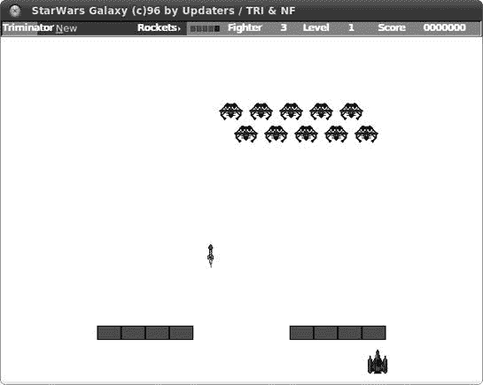
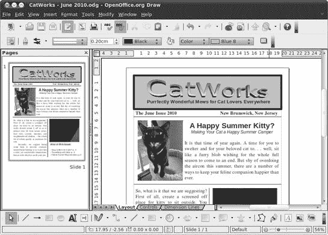
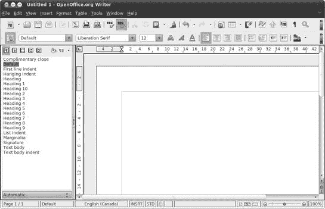
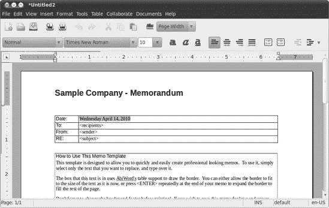

# 第十二章。工作中使用企鹅

### 在 Linux 中投入工作


我必须承认，当我想到计算带来的乐趣时，我往往会想到更享乐主义、自我放纵的领域，比如游戏、音乐和图形。然而，就像大多数电脑用户一样，我通常在电脑上做的是工作，写这本书也不例外。

幸运的是，Linux 可以投入工作，并且做得和下一个操作系统一样好。我认为可以肯定地说，你在 Linux 的家用和办公生产力程序方面没有错过任何东西，而且可能还获得了相当多的好处。在本章中，我将向您介绍 Linux 在这一领域的提供内容。

# OpenOffice.org

无论是否应该如此，人们对办公套件都非常着迷，尽管大多数人很少需要比文字处理软件更多的东西。办公套件的事实标准是 Microsoft Office，它在 Windows 和 Macintosh 世界中都可用。当然，因为它是一个 Microsoft 产品，你可以相当确信没有 Linux 版本。

幸运的是，Linux 确实有一个功能极其强大的办公套件，那就是 OpenOffice.org，顺便提一下，它也在 Windows 和 Mac OS X 版本中免费提供（这里的“免费”是指真正的免费）。OpenOffice.org 并不是 Linux 世界中对 Microsoft Office 的轻量级替代品；它是一个功能齐全的竞争者，在某些情况下，OpenOffice.org 是明显的赢家。

## OpenOffice.org 应用程序

整个 OpenOffice.org 办公套件由多个应用程序模块组成，其中最常用的模块捆绑在 Ubuntu 中。这些包括文字处理软件（Writer）、电子表格（Calc）以及演示创建和播放器（Impress），您可以通过选择**应用程序** ▸ **办公**来找到它们。此外，还有一个非常实用的矢量绘图程序（Draw），您可以通过选择**应用程序** ▸ **图形**来找到它。数据库模块（Base）和数学公式编辑器（Math），尽管不再捆绑在 Ubuntu 中，但仍然可以通过 Ubuntu 软件中心作为单独的下载获得（分别通过搜索并标记*openoffice.org-base*和*openoffice.org-math*）。

由于详细说明如何使用这些应用程序需要占用整整一本书的篇幅（而且关于这个主题也有整本书），我只需简单地为您介绍每个模块。

### Writer

如我之前提到的，文字处理软件是大多数用户最常使用的办公应用。幸运的是，OpenOffice.org Writer 是一款不错的软件（见图 12-1）。它功能丰富，可以读取和保存 Microsoft Word 文件。就像 Word 一样，它甚至允许您将文档保存为 HTML 文件，这样您就可以轻松地将文档转换为网页。

正如我所说，Writer 是一个非常直接的文字处理器，所以我就不多说了，但如果你想要了解如何使用 Writer（或其他 OpenOffice.org 模块），可以查看[`support.openoffice.org/`](http://support.openoffice.org/)提供的各种教程和其他资源。

### Calc

Calc 是 OpenOffice.org 的电子表格应用程序，在功能和总体布局方面与 Excel 相似（见图 12-2

图 12-1. OpenOffice.org Writer


图 12-2. 在 OpenOffice.org Calc 中创建的图表

大多数不使用电子表格的人认为它们是某种巨型计算器，用于计算不舒服的大量数字，例如工资单（这是此类应用程序的原始目的）。当然，这是正确的，但电子表格也可以用于日常任务，例如预测家庭预算、计算平均成绩点（由教师或学生进行）、计算你为前往匈牙利旅行存钱需要多长时间，或者甚至比较你试图从中选择的四或五辆摩托车的座椅高度。在进行任何这些小数学任务时，你可以轻松地创建图表，以便所有抽象的数字都能以视觉方式与你交流。

如果数字不是你的强项，你仍然可以使用 Calc 来创建信息列表，例如生日列表、班级名单、购物清单、地址列表……等等。你甚至可以让 Calc 将这些列表按字母顺序排序，按出生日期排序等等。似乎每个人最终都会找到一些 Calc 的用途，所以不要完全忽视它。

如果你仍然不相信 Calc 在你的生活中有位置，你至少可以从程序中隐藏的一个复活节彩蛋中找到一些乐趣，这个彩蛋允许你玩一个名为 Star-Wars 的空间入侵者克隆游戏（图 12-3`**，然后按**Enter**键。说明是德语，但即使你不记得任何高中德语，也应该足够容易找出如何玩游戏。



图 12-3. 在 OpenOffice.org Calc 中玩太空侵略者？是的。

### Impress

Impress 是 OpenOffice.org 对 Microsoft PowerPoint 的回应，它与 PowerPoint 兼容。它允许您创建用于演示的吸引人的幻灯片，并允许您创建与它们一起使用的笔记或讲义。尽管这些功能使 Impress 在商业和教育环境中非常方便，但您可能不会像家庭用户那样从中获得太多价值。

### Draw

对于家庭用户来说，OpenOffice.org Draw 更有用。虽然 Draw 在艺术意义上创建真正的图形并不出色，但它非常适合创建流程图、组织图（例如婚礼招待会或会议的座位安排），或任何需要更多控制文本和图形位置（尤其是当两者结合时）的文档，如传单、奖项、图表和通讯稿。在这方面，Draw 可以非常有效地作为简单的页面布局程序使用，正如您在图 12-4 中看到的那样。



图 12-4. 在 OpenOffice.org Draw 中创建（并显示）的通讯稿

## Microsoft Office 和 OpenOffice.org 文件兼容性

虽然我在本节中多次提到这一点，但值得再次强调的是，OpenOffice.org 可以读取和写入 Microsoft Office 文件。这种兼容性相当好，尽管表格有时会有些问题。

要读取 Microsoft Office 文件，您只需双击相关文件，它就会在适当的 OpenOffice.org 模块中打开。然而，当在 OpenOffice.org 中保存文件以用于 Microsoft Office 的早期版本时，您必须将其保存为适当的格式，因为默认情况下，OpenOffice.org 会将文件保存为其原生格式（Writer 文档为 *.odt*，Calc 文档为 *.ods*，Impress 文档为 *.odp*），并且只有 Office 的最新版本才能处理这些文件。

要这样做，在保存文件时，点击保存窗口中“文件类型”旁边的较小 **+** 号，然后从出现的可用文件格式列表中选择适当的 Microsoft Office 格式——例如，对于 Writer 文档，选择 **Microsoft Word 97/2000/XP**。

## OpenOffice.org 功能

OpenOffice.org 的三个主要应用程序（Writer、Calc 和 Impress）与 Microsoft Office 中 Office 2007 之前的等价物（Word、Excel 和 PowerPoint）相当相似，所以如果您习惯了那些版本的 Microsoft Office，切换到 OpenOffice.org 应用程序应该相对容易。

如果你没有使用过 Microsoft Office 的经验，你仍然会发现它很简单，因为基本布局相当直观。如果你在这方面缺乏直觉，内置的帮助文件也相当不错。为了进一步帮助你，提示系统在 Windows 和 Mac 世界中就像工具提示一样工作。（如果你不确定我在说什么，*工具提示*是在你将鼠标放在按钮或菜单项上时弹出的小黄色框，告诉你该按钮或菜单项的功能。）另一个酷而有用的帮助功能是“这是什么”，这是提示系统的更详细版本。如果你选择**帮助** ▸ **这是什么**，你的光标将变成一个小问号。将这个问号光标移到 OpenOffice.org 界面中的几乎所有项目上，你都会了解到它的功能，而不仅仅是它的名称。

尽管我所说的都是直截了当的，但一些界面元素可能对你来说很陌生。既然如此，我将简要讨论这些元素。在描述这些功能时，我会使用文字处理器 Writer，所以如果你想在跟随时运行 OpenOffice.org，Writer 可能也是你的一个方便的起点。

## 了解按钮

尽管你应该能够弄清楚 OpenOffice.org 工具栏上大多数按钮的功能，但有一些按钮在所有 OpenOffice.org 模块中都很常见，值得稍微详细解释一下。

### 导出为 PDF


导出为 PDF 按钮位于两个打印按钮（打印和页面预览）的左侧。您可以使用此按钮将文档*导出*或保存为 PDF 文件。

### 超链接


点击超链接按钮，即表格按钮左侧的按钮，将打开超链接窗口，您可以从该窗口为指定的文档分配链接——不仅限于网页，还可以是单个计算机上的文档，甚至是该文档内的目标。尽管网页上的超链接是我们都已经习以为常的东西，但文本文档之间超链接的想法听起来像是一个非常激进的观念。实际上，这是一个相当古老的观念，在我们甚至听说过互联网之前就已经存在了。

### 导航


顶行倒数第四个按钮（看起来像星爆的那个）是导航按钮。点击此按钮（或直接按 F5 键）将打开导航窗口（见图 12-5)，这是一个相当酷的导航功能，在处理长文档或复杂文档时非常有用。

导航器允许你轻松地在文档中的页面之间或甚至在其元素之间（如章节、链接等）来回跳转。假设你有一个包含大量插图（如本章）的文档，并且你想直接从一张图形跳转到另一张图形。在这种情况下，你会在导航器窗口的主面板中双击单词*图形*，然后点击跳转按钮（位于页面号码选择器左侧的奇小按钮）以开始跳转。


图 12-5. 导航器窗口

如果你正在处理包含各种标题级别的文档，例如本书的所有章节，你还可以使用导航器在这些级别之间切换。比如说，你决定在最后一刻向你一直在撰写的文档中添加一个新的主要标题。因此，你需要将之前所有的标题都降级；原来的主要标题变成子标题，依此类推。通过双击单词*标题*，文档中列出的所有标题文本都会出现。然后你可以从列表中选择一个标题并点击降级级别按钮（位于第二行按钮最右侧的那个按钮）以将其降级。

### 画廊


导航器按钮的右侧是画廊按钮。通过点击此按钮，画廊（用于在文档或网页中使用的图形元素库）将出现在文档窗口顶部的单独面板中（见图 12-6）。画廊中的元素从各种类型的线条到按钮再到彩色三维甜甜圈不等，你甚至可以添加自己的项目。


图 12-6. 画廊

即使不使用画廊，将图形插入到文档中也是一个足够简单的任务。你只需要选择**插入** ▸ **图片** ▸ **从文件**，然后找到你想要插入的图像文件。然而，当你打算频繁使用某些图形时，使用画廊会更方便。一旦在画廊中，你的图形只需点击一两次即可轻松访问，并且可以在画廊浏览器窗口中方便地查看。

随 OpenOffice.org 一起提供的艺术作品集主要面向构建网页，但其他剪贴画在其他地方也有可用。例如，你可以在[`www.openclipart.org/`](http://www.openclipart.org/)上找到一个很棒的在线收藏。那里的一切都属于公共领域，因此都是免费的。务必查看“游戏反派”收藏——这是我的最爱之一。

将这些（或任何其他）图形文件添加到图库相对简单。首先，您需要为要添加的每一组图片创建一个新的类别（称为*主题*）。要创建自己的图库主题，只需在图库窗口中点击**新建主题**按钮。这将打开新主题属性窗口，在那里您应该为您的主题命名。一旦完成，点击**文件**选项卡，然后点击**查找文件**按钮，这将打开选择路径窗口。从那里，您可以导航到您存储剪贴画、照片或其他图形的文件夹。一旦找到文件夹，点击**确定**按钮，之后该文件夹中所有文件的列表将出现在新主题属性窗口中。

从这个窗口，您可以通过点击您想要添加的每个图片的名称（您可能想要确保勾选了旁边单词*预览*旁边的框以使事情变得更容易）然后点击**添加**按钮，轻松地将图片添加到您的新图库主题中。一旦完成，图片的副本将立即出现在您主题的图库浏览器中，它将保留以供将来使用（图 12-7 可用的相当一部分剪贴画。只需搜索并安装*openclipart-openoffice.org*。在下载和安装过程（相对较长）完成后，重启 OpenOffice.org（如果正在运行），然后点击图库按钮。您的新收藏将全部在那里！


图 12-7. 在图库中查看剪贴画和您的个人收藏

### 样式和格式


我们在 OpenOffice.org 不熟悉的按钮之旅的最后一站是样式和格式按钮，它位于按钮第二行的最左侧。此按钮充当样式和格式窗口的切换按钮（图 12-8)，您可以从其中选择并将样式应用于文档中的任何各种元素。哦，如果您一时无法放下键盘去摆弄鼠标，您也可以通过按 F11 键打开窗口。


图 12-8. 样式和格式窗口

为了给您一个使用样式有多方便的例子，想象一下您正在为某个您准备的文档输入参考文献页面。您像输入任何段落一样输入每个条目，如下所示：

```
Smythe, W. (2004). Reconsidering the need for speech
 between non-human interlocutors beyond the age of seven. The Journal
 of the Society of Elves, Faeries, and Garden Gnomes, 20 (2), 125-147.
```

就像您输入的大多数段落一样，条目格式化为首行缩进，这很好，但您想要悬挂缩进，这是参考文献条目的常规格式。与其摆弄制表符或边距以获得您想要的方式，您只需在段落内的任何位置单击鼠标，然后在样式和格式窗口中双击**悬挂缩进**条目。之后，就像魔法一样（尽管您知道不是），转换就完成了：

```
Smythe, W. (2004). Reconsidering the need for speech
 between non-human interlocutors beyond the age of seven. The Journal
 of the Society of Elves, Faeries, and Garden Gnomes, 20 (2), 125-147.
```

您可以为您的其他条目遵循相同的程序，或者，在选择了悬挂缩进后，在样式和格式窗口中单击**油漆桶**按钮，之后当您的鼠标光标放在文档上时，将显示为油漆桶。在您的参考文献中的任何其他段落中单击，该条目也将以新样式格式化。将不同样式应用于任何其他文档元素的过程基本上是相同的。

当使用样式和格式窗口时，可能会让您感到烦恼的一件事是，它有时会漂浮在周围，妨碍您的文本，无论您将其放在哪里。当然，您可以切换它开或关，但如果您在同一个文档中多次使用它，这也会变得有些烦人。

一个快乐的折衷方案是将样式和格式窗口停靠到主文档窗口中。你可以通过将样式和格式窗口拖动到文档工作区的左上角或右上角来实现。当样式和格式窗口的轮廓出现在窗口的文档部分周围时（如图 12-9 所示），释放鼠标按钮。此时，样式和格式窗口将作为一个面板出现在文档窗口的侧面（图 12-10）。


图 12-9. 准备将样式和格式窗口停靠到主文档窗口中



图 12-10. 样式和格式窗口已停靠为主文档窗口中的一个面板

# 使用 AbiWord 轻松完成文字处理

如果 OpenOffice.org 的 Writer 比你所需要的日常文字处理任务更强大，而你又希望点击启动器时立即出现某个应用，那么你可能想尝试使用另一个文字处理器，AbiWord（图 12-11）。



图 12-11. 其他 Linux 文字处理器——AbiWord

AbiWord 拥有一个非常直观且易于使用的界面，你应该能够在没有太多，甚至没有帮助的情况下弄清楚它。它还有一些相当有趣的功能，例如其自动调整大小功能，可以根据你调整程序窗口的大小来放大或缩小屏幕上的文档大小（字体、图像等）。而且，如果你想知道的话，AbiWord 可以保存和读取 Microsoft Word DOC 文件，并将文档保存为 PDF 文件。

你可以通过在 Ubuntu 软件中心搜索*abiword*轻松安装 AbiWord。一旦安装了 AbiWord，你可以通过选择**应用程序** ▸ **办公** ▸ **AbiWord**来运行它。

# 一些其他酷炫的生产力应用

除了更传统的办公应用之外，还有许多其他应用要么包含在你的系统中，要么可供使用，可以归类为“生产力”标签下。我将在这里向你介绍其中的一些。

## 粘贴便签

Mac 用户对现在无处不在的类似黄色便利贴的数字版本——粘性便签（图 12-12

图 12-12. GNOME 的粘性便签

## Tomboy

如果粘性便签不能满足你更戏剧性的笔记需求，那么你可能需要另一个系统自带的应用程序来更好地满足你的需求，这个应用程序叫做 Tomboy（图 12-13

图 12-13. 认真记录的笔记——Tomboy

## GnuCash

如果你熟悉个人财务管理软件 Quicken，那么你可能会对 GnuCash 感兴趣，它是 Linux 世界在个人财务领域的知名产品。GnuCash 可以读取 Quicken 和 Intuit QIF 文件，如果你正在从其他操作系统迁移，这将使事情变得更加方便。不幸的是，除非你住在德国，否则你不能使用 GnuCash 进行在线银行。但正如 GnuCash 团队自己说的，不要责怪他们；责怪你的银行。

要安装 GnuCash，只需在 Ubuntu 软件中心搜索 *gnucash*，然后安装 *gnucash* 和 *gnucash-docs*。安装完成后，您可以通过选择 **应用程序** ▸ **办公** ▸ **GnuCash 财务管理** 来运行该应用。

## Scribus

为了使内容更加完整，我们来到了一个开源的桌面排版应用，Scribus (图 12-14)，对于那些 OpenOffice.org Writer 和 Draw 无法满足需求的时候。Scribus 旨在生成商业级输出，支持专业出版功能，例如 CMYK 颜色、PostScript 处理以及创建颜色分离等，仅举几例。


图 12-14. Scribus

您可以通过在 Ubuntu 软件中心搜索 *scribus* 来下载和安装 Scribus。安装完成后，您可以通过选择 **应用程序** ▸ **图形** ▸ **Scribus** 来运行该应用。
