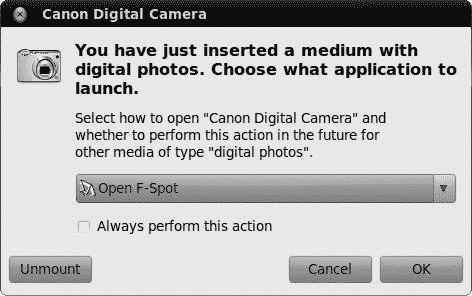
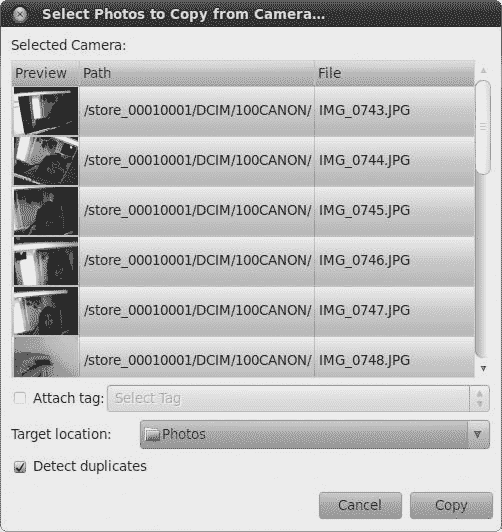
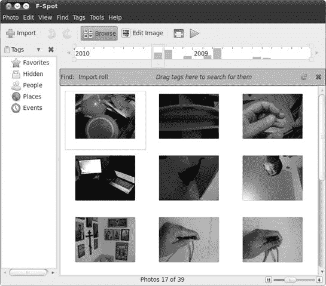
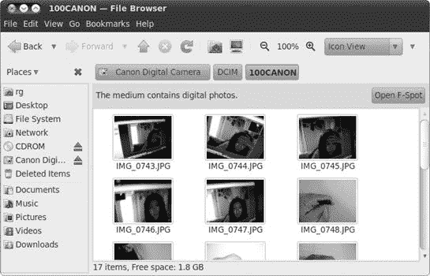
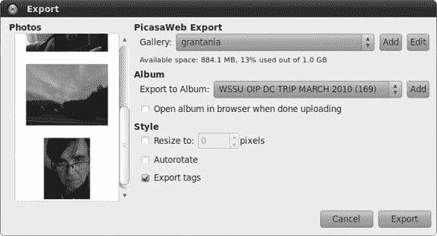
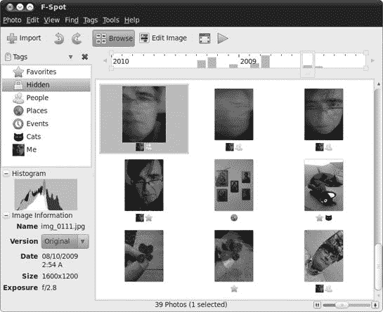
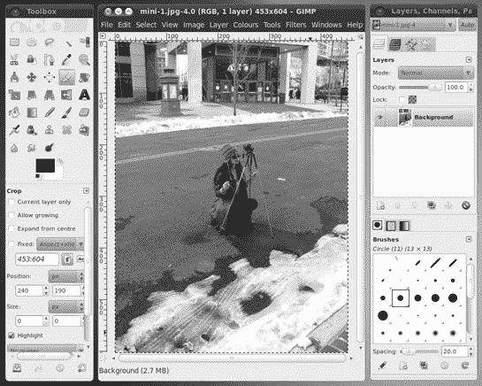
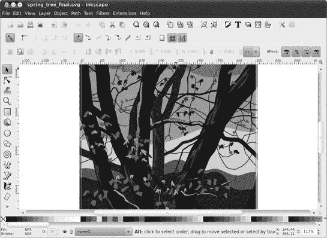
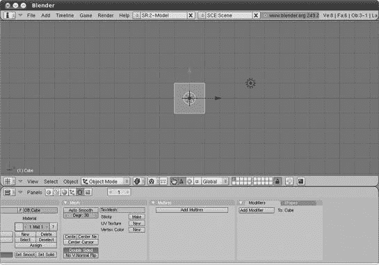

# 第十三章。手持画笔的企鹅

### Linux 做艺术

现在你已经知道你可以在 Linux 中开始工作了，是时候戴上你的贝雷帽，处理一下事情的艺术方面了。是的，Linux 也能做艺术，而且正如你很快就会发现的，你的系统中有很多程序允许你创建和操作图形文件。然而，对于大多数用户来说，他们的图形工具箱中可能没有什么比他们的数码相机更重要了，所以我们就从这里开始。

# 项目 13A：从数码相机导入图片

虽然 Linux 对扫描仪的支持可能有点不稳定，但对数码相机的支持几乎是无忧无虑的。事实上，如果 Ubuntu 无法识别你有什么样的相机，它就会将其视为连接到计算机 USB 端口的外部硬盘或闪存驱动器。即使你的相机在直接连接时似乎无法与计算机通信，你仍然可以通过从相机中取出存储卡，将其插入 USB 闪存卡读卡器，然后将该读卡器插入计算机的一个 USB 端口，将你的图片传输到硬盘。在这种情况下，你的系统将把读卡器挂载为外部驱动器（实际上它就是这样），从而允许你将图片复制到硬盘。当然，即使你的相机与 Ubuntu 配合得很好，你也可以使用这种方法——有些人发现这是处理事情的最简单方法。

## 13A-1：通过 F-Spot 自动将图片从相机导入到计算机

当你通过 USB 线将相机连接到计算机时，将相机设置为播放模式，并打开电源，Ubuntu 通常会自动识别它并打开一个窗口，询问你如何导入相机中的照片。要通过 F-Spot 导入照片，接受下拉菜单按钮中的默认选择，打开 F-Spot（如图图 13-1)，然后点击**确定**。之后，你需要做以下事情：

1.  在出现的窗口中，你会看到相机上所有照片的缩略图和文件名。默认情况下，所有图片都被选中。但是，如果你只想复制一些图片，你可以按住**ctrl**键并点击所需的图片，如图图 13-2 所示。

1.  一旦你做出了选择，点击**目标位置**按钮，选择复制照片的位置。你的**图片**文件夹或其子文件夹可能是一个合理的位置。

1.  您还可以通过勾选**附加标签**框并从右侧菜单按钮中选择所需的标签来标记您即将导入的照片。我将在项目 13B-2 中详细介绍标签的使用方法。

1.  最后，点击**复制**按钮。

    

    图 13-1. Ubuntu 识别您的相机并询问您如何操作。

    

    图 13-2. 通过 F-Spot 照片管理器选择从您的数码相机导入哪些照片

1.  F-Spot 将开始复制过程，并在单独的窗口中显示其进度。下载完成后，窗口进度条中将出现*下载完成*的字样。点击**确定**按钮。您现在可以在 F-Spot 主窗口(图 13-3)中查看您的图片。

    

    图 13-3. 在 F-Spot 中查看您导入的数码相机图像

## 13A-2: 通过 Nautilus 从相机传输图片到计算机

正如我提到的，您还可以使用 Nautilus 从您的相机导入照片。执行此操作的过程基本上与我在项目 13A-1 中讨论的相同，尽管略有不同。以下是您如何操作：

1.  将您的相机连接到计算机的 USB 端口之一，并将相机设置为播放模式。几秒钟内，就会出现一个类似于图 13-1 的窗口。在该窗口中，从下拉菜单按钮中选择**打开文件夹**而不是默认的*F-Spot*，然后点击**确定**。一个 Nautilus 窗口将出现，显示您的相机存储卡的内容。该窗口的侧面板以及任何其他打开的 Nautilus 窗口(图 13-4)和桌面上的图标都将出现，可以双击启动。

1.  双击您相机中的文件夹，直到找到您想要导入的照片。

1.  将相机中的图片拖放到您家目录中的任何合理位置，或者复制并粘贴图片。

1.  完成传输后，您可以在 Nautilus 窗口的左侧面板中点击相机条目的弹出图标，或者右键单击桌面上的相机图标，选择**卸载**。这样，您的相机图标将从侧面板和桌面上消失。或者，最简单的方法是直接关闭您的相机，这样桌面和 Nautilus 中的相机实例应该会自动消失。

    

    图 13-4. 你也可以像 USB 驱动器一样从你的数码相机拖放照片。

# 项目 13B：在 F-Spot 照片管理器中处理数字图片

F-Spot 不仅可以从你的相机导入图片到电脑，还充当了一个方便的图片组织、浏览、查看和编辑工具。与 Ubuntu 默认的电子邮件软件 Evolution 协同工作，F-Spot 允许你通过电子邮件轻松发送图片（**文件** ▸ **通过邮件发送**），无需处理附件。你可以通过选择**应用程序** ▸ **图形** ▸ **F-Spot 照片管理器**来运行 F-Spot。请注意，第一次运行时，你将被要求选择包含你想要导入到 F-Spot 中的图片的文件夹。

## 13B-1：将图片导出到在线相册和画廊

F-Spot 的一个非常酷的特性是它允许你将图片导出到多个在线相册或画廊网站，例如 Flickr 和 Picasa，就像 Windows Live Photo Gallery 一样。将图片导出到在线相册或画廊非常简单，我将使用 Picasa 网络相册作为示例。以下是你需要做的：

1.  通过按住**ctrl**键并单击每张照片一次来选择你想要放入在线相册的照片。

1.  在 F-Spot 的主窗口中，选择**照片** ▸ **导出到** ▸ **PicasaWeb**，之后将出现一个类似于图 13-5 的导出窗口。

    

    图 13-5. 通过 F-Spot 将图片导出到在线画廊

1.  第一次使用时，你需要点击窗口顶部的**添加**按钮（位于单词“画廊”的右侧），以便设置 F-Spot 可以访问你的在线画廊。

1.  在出现的窗口中，输入你的在线相册/画廊服务的用户名和密码（不是你的 Ubuntu 用户名和密码）。完成之后，点击窗口中的**添加**按钮。

1.  你还可以通过点击相册部分的下拉菜单来决定将照片添加到哪个在线相册。或者，如果你想创建一个新的相册，点击菜单右侧的**添加**按钮，在出现的窗口中提供标题和描述，然后点击**添加**。

1.  一旦回到导出窗口，点击**导出**按钮。

F-Spot 将开始上传您的图像到您的在线画廊网站，并在进度窗口中通知您正在做什么。完成后，您的网络浏览器将打开到您的在线画廊页面，显示您新上传的图像。您可以通过在导出窗口中勾选或取消勾选**上传完成后在浏览器中打开相册**框来切换此导出后自动打开浏览器功能（图 13-5）。

## 13B-2：使用标签组织您的照片收藏

随着您的照片收藏不断增长，整理事物并找到您确切需要的东西可能会变得相当困难。幸运的是，F-Spot 有一些方法可以使这更容易处理，其中之一就是位于缩略图查看面板上方的日历滑动条，它允许您通过年份和月份定位图像。

组织事物的一种额外且有趣的方法是使用**标签**，这允许您从主题上识别图像。应用标签并使用这些标签来缩小您的照片搜索范围相当简单。

首先，要将标签应用于您的图像，只需将适当的标签图标从 F-Spot 窗口的左侧面板直接拖动到您想要标记的图像上。您可以在一张图片上放置多个标签。一旦添加了标签，标签图标的缩略图将出现在图像下方，正如您在图 13-6 中看到的那样。

图 13-6. 使用 F-Spot 的标签功能帮助处理大量照片收藏

预设标签的数量相当有限，但您可以通过选择**标签** ▸ **创建新标签**来添加自己的标签。

在出现的“创建新标签”窗口中为您的标签命名，然后点击**创建**。新标签将随后出现在 F-Spot 窗口的左侧面板中，尽管没有图标。有两种方法可以添加图标。一种是将无图标的标签简单地拖动到您想要标记的照片上，之后该图像的迷你缩略图将成为标签的图标。

另一种方法是右键点击新标签，并在弹出的菜单中选择**编辑标签**。在出现的窗口中，点击“图标”一词旁边的无图标按钮，然后从出现的窗口中选择一个预定义的图标。您也可以使用这种方法编辑自动创建的标签的照片，这允许您确定您想要用作该标签图标的图片的精确部分（图 13-7）。

图 13-7. 在 F-Spot 中修改用作图标标签的图片部分

通过标签搜索图像可能甚至比最初给图像添加标签还要简单。假设你想找到所有被标记为*事件*的图像。你首先会去**查找**菜单并选择**查找所选标签**。然后，一个查找栏将直接出现在 F-Spot 窗口的缩略图查看区域上方。将事件标签的图标拖到那个查找栏，几乎立即，标记为*事件*的图像就会出现在下方的缩略图区域。真不错。

# 用 GIMP 玩创意

Windows 和 Mac 世界可能拥有 Photoshop，但 Linux 世界有 GIMP（见图 13-8). 虽然可能没有 Photoshop 那么强大，但 GIMP 是一个有能力的竞争者，这也可能解释了为什么它被移植到了 Mac 和 Windows 上。GIMP 允许你创建位图图形，而且非常重要，可以修复或完全处理图像文件。使用 GIMP，你可以去除你的数码照片中的红眼，用喷枪去除不想要的阴影（甚至面部瑕疵），给你的图像添加画布纹理，将照片变成油画，甚至在这里和那里添加甜椒——还有阴影。

图 13-8. 在 GIMP 中操作数字图像

由于并非每个人都需要或使用 GIMP 的强大功能，因此有权决定的人不幸地决定不再将其捆绑在 Ubuntu 桌面 CD 上，从而为更频繁运行的应用程序腾出空间。尽管这可能会让人感到遗憾，但你仍然可以通过 Ubuntu 软件中心安装 GIMP。只需搜索*GIMP*，然后像安装任何应用程序一样安装它，就像你在第六章中学到的那样。安装完成后，你可以通过选择**应用程序** ▸ **图形** ▸ **GIMP 图像编辑器**来运行 GIMP。

## 使用 GIMP 调整图像大小和转换文件格式

与 F-Spot 一样，GIMP 也是一个非常方便的调整图像大小的工具。你可以通过在 GIMP 中打开的图像上右键单击，然后在弹出菜单中选择**图像** ▸ **缩放图像**来完成此操作。这将打开缩放图像窗口，在那里你可以设置图像的新大小。

GIMP 也是一个将图像从一种文件格式转换为另一种格式的优秀工具。例如，你可以打开一个位图 (*.bmp*) 文件并将其保存为 PNG (*.png*) 文件，将 JPEG (*.jpg*) 文件保存为 GIF (*.gif*) 文件，等等。虽然这也可以用其他图形应用程序完成，但 GIMP 支持极其广泛的文件格式，甚至允许你将图像文件保存为压缩的 tarball，使其成为真正的文件转换之王。

要执行文件转换，只需在 GIMP 中打开的图像上右键单击，然后在弹出菜单中选择 **文件** ▸ **另存为**。如果你更喜欢从文件菜单进行选择，也可以这样做。无论哪种方式，都会出现保存图像窗口。在该窗口中，你可以通过在窗口顶部的名称框中替换原始文件扩展名来指定新文件格式。如果你不确定有哪些格式可供选择，请点击“选择文件类型（按扩展名）”左侧的小箭头，然后从出现的面板中选择选项。要保存正在进行的作品，请使用 GIMP 原生的 XCF 格式，这样你以后可以继续编辑图像。

## 学习更多

通过一段时间地随意玩 GIMP 来学习使用它是非常有趣的。为了帮助你开始，大多数有趣的功能都位于任何图像窗口的滤镜菜单中。当然，在修改任何计划进行实验的文件之前，你应该备份该文件。

如果你更喜欢通过阅读手册和教程来学习，而不是仅仅通过乱搞来学习，你可以通过在 Ubuntu 软件中心搜索 *gimp-help-en* 并安装 **Documentation for the GIMP (English)** 来下载并安装 GIMP 用户手册。一旦安装完成，你就可以从 GIMP 的帮助菜单中访问手册。你还可以在网上查看手册，网址为[`docs.gimp.org/en/`](http://docs.gimp.org/en/)，你还可以在[`www.gimp.org/tutorials/`](http://www.gimp.org/tutorials/)找到一系列教程。

# Phatch 照片批量处理器

虽然 GIMP 和 F-Spot 在处理你大部分照片组织和编辑任务方面相当强大，但它们缺少一个易于使用的批量文件转换方法，允许你同时将各种转换应用到一组文件上。例如，假设你想要将 100 张照片转换成黑白快照，带有白色边框，比原始照片小 50%，具有类似的主题文件名，并以*.tiff*格式保存而不是*.jpg*格式。逐个应用所有这些更改将是痛苦的——幸运的是，Phatch 来拯救！（见图 13-9。）

你可以通过在 Ubuntu 软件中心搜索 *phatch* 来下载并安装 Phatch。一旦安装完成，你可以通过选择 **应用程序** ▸ **图形** ▸ **Phatch PHoto bATCH Processor** 来运行它。

图 13-9. 使用 Phatch 批量转换照片文件

## 使用 Phatch

使用 Phatch 很简单，实际上相当有趣。然而，它的界面可能对初学者来说并不明显。考虑到这一点，以下是如何使用 Phatch 的简要说明：

1.  在主 Phatch 窗口中点击**+**按钮，Phatch 操作窗口将出现。

1.  在那个窗口中，选择你想要应用于照片的操作（转换），然后点击**添加**。对于你想要应用的其他任何操作，重复此过程。

1.  一旦你添加了你想要的所有操作，点击主操作列表中的每个操作，并为每个操作输入适当的参数（大小、文件格式、边框大小、输出位置等）。

1.  如果操作没有按照你想要的顺序列出，点击你想要移动的操作，然后使用上下箭头按钮更改其位置。

1.  一切准备就绪后，以一个有意义的名字保存你的操作列表，以便在需要时再次使用，然后选择**工具** ▸ **执行**。

1.  在出现的窗口中，点击**浏览文件夹**按钮以找到你想要转换的照片，然后点击**批量**按钮。

1.  然后将会打开另一个窗口，显示将要执行操作的文件。在那个窗口中点击**继续**。

Phatch 将会按照操作列表中的顺序执行列出的转换。它将显示其工作进度，然后会出现一个小窗口告诉你已完成。你可以在你选择的目标文件夹中找到你原始照片的新转换副本。如果你没有选择目标文件夹，新创建的转换应该出现在你桌面的*Phatch*文件夹中。

# gpaint

如果 GIMP 对你来说有点令人不知所措，或者它似乎对你的简单任务来说有点过度，你可能想尝试一个名为 gpaint（或 GNU Paint）的应用程序，你可以通过 Ubuntu 软件中心下载和安装（搜索*gpaint*）。正如你在图 13-10 中可以看到，gpaint 类似于 Windows Paint 和 MacPaint，同样简单。

图 13-10. 简单的艺术创作—gpaint

安装 gpaint 后，你可以通过选择**应用程序** ▸ **图形** ▸ **GNU Paint**来运行它。

# Inkscape

GIMP，就像其他所谓的绘图程序一样，以各种文件格式创建位图图像。这些图像记录了每个单独像素的位置和颜色。图像本质上是一系列点，或称为*像素*。你创建的文件是这些像素的相当庞大的地图，这张地图告诉你的系统在图像显示或打印时，图像中的每个元素应该放在哪里。

另一方面，*绘图程序* 创建矢量图像，实际上是由表示图像中各种形状的数学公式组成的集合。这可能对你来说听起来并不重要，但在某些情况下，这种绘图具有优势。其中一个优势是矢量图像文件在硬盘上占用的空间比位图小。另一个，也许是最重要的优势是，矢量图像中的形状在图像放大时仍然保持平滑的边缘。例如，作为一个位图创建的平滑圆圈，在放大到任何程度时都会开始显示出锯齿边缘（“锯齿”），而矢量图像中的相同圆圈无论你将其放大多少，都会保持平滑和圆形。

如果你想要尝试一个绘图程序，那么可以试试 Inkscape（见图 13-11）。要下载和安装它，请在 Ubuntu 软件中心搜索 *inkscape*。安装完成后，你可以通过选择 **应用程序** ▸ **图形** ▸ **Inkscape** 来运行它。

图 13-11. Inkscape

如果你想要学习如何使用 Inkscape，请访问 Inkscape 的主页 [`www.inkscape.org/`](http://www.inkscape.org/)。确保点击页面上的 **画廊** 链接，看看你可以用这个程序创建什么，例如图 13-11 中所示的形象（[`plurib.us/svg_gallery/`](http://plurib.us/svg_gallery/)）。

# 项目 13C：安装 Picasa

如果不提及其在 Linux 应用程序领域最新加入的一员——Picasa，那么就无法公正地用一整章来介绍 Linux 的图形功能。那些来自 Windows 和 Mac 世界的朋友们无疑对谷歌的这款非常流行的图像查看、组织和编辑应用非常熟悉，而且你们一定会很高兴地发现它也适用于 Linux。Picasa 不是开源应用，这可能会让一些 Linux 狂热者望而却步，但它免费、功能丰富、外观美观，并且绝对酷炫（见图 13-12）。它还为你提供了轻松访问各种在线照片博客、照片处理和产品提供商的途径，例如 PhotoStamps、Shutterfly、柯达，甚至沃尔格林。

图 13-12. Picasa

## 13C-1：下载和安装 Picasa 软件包

Picasa 是免费的，而且获取它相对简单——只需将你的浏览器指向 [`picasa.google.com/linux`](http://picasa.google.com/linux)，然后点击 **下载 Picasa for Linux** 按钮。一旦进入下载页面，点击适当的下载链接（如果你使用的是这本书的光盘，那么就是 *For Debian/Ubuntu i386* 下的链接）。

下载完成后，在你的硬盘上找到 Picasa DEB 包，并双击它。在出现的包安装器窗口中点击 **安装包** 按钮。如果需要，提供你的密码，然后点击 **确定** 以开始安装。安装过程完成后，你将在安装进度窗口中收到通知。之后，你可以关闭这两个窗口。

## 13C-2：运行和设置 Picasa

安装 Picasa 后，你可以通过转到 **应用程序** 菜单并选择 **图形** ▸ **Picasa** ▸ **Picasa** 或 **其他** ▸ **Picasa**（位置可能不同，即使是同一台电脑上的不同用户账户！）来运行它。第一次这样做时，你会看到一个警告窗口告诉你 Picasa 可以与 GNOME 集成，这样每当你的电脑连接上数码相机时，GNOME 将运行 Picasa 以处理照片导入过程。根据你的舒适度做出选择，之后将出现一个关于 Picasa/Firefox 集成的窗口（点击 **确定**），然后最终将出现一个 Picasa 许可协议窗口。通过点击 **下一步** 然后在下一屏幕上 **我同意** 来同意你所要求的内容。

然后 Picasa 将扫描你的桌面和主文件夹中的图片，并将找到的任何图片添加到其库中。

使用 Picasa 应该非常直接，但如果你想了解更多信息，请查看 [`picasa.google.com/linux/`](http://picasa.google.com/linux/)。在该页面上，你可以找到一个基本概述，链接到更多针对 Linux 的特定信息（包括常见问题解答和论坛页面），以及一个 Picasa 入门指南。

# 考虑的其他一些图形应用程序

除了我在本章中介绍的图形应用程序之外，还有更多可供选择。你可以通过 Ubuntu 软件中心获取所有这些应用程序。虽然你可以尝试使用可用的应用程序，但我将指出一些值得注意的其他应用程序。至少，这些应用程序将给你一个关于外面等待你的各种资源的概览。

## gThumb 图像查看器

在 Ubuntu 早期版本中，一个名为 gThumb 的应用程序（图 13-13

图 13-13. gThumb

## Blender

可能是今天可用的最令人印象深刻的开源应用之一是 Blender。Blender (图 13-14) 是一款专业级的 3D 建模、动画和渲染程序。它相当复杂，但这正是其力量和受欢迎的原因（它几乎适用于所有操作系统）。如果你想在安装它之前了解更多关于 Blender 的信息，请访问 [`www.blender3d.org/`](http://www.blender3d.org/)。通过在 Ubuntu 软件中心搜索 *blender* 来找到它；一旦安装，你可以通过选择 **应用程序** ▸ **图形** ▸ **Blender（全屏）** 或 **Blender（窗口模式）** 来运行它。

## QCad

另一个已经进入几乎所有操作系统的开源应用是 QCad (图 13-15). QCad 是一款 2D 计算机辅助设计 (CAD) 软件，你可以用它创建诸如室内设计、机械部件甚至乐器等技术图纸。（我见过用 QCad 做的 Nyckelharpa 计划！）要了解更多信息，请访问项目主页 [`www.ribbonsoft.com/qcad.html/`](http://www.ribbonsoft.com/qcad.html/)。在 Ubuntu 软件中心搜索 *qcad* 并安装该应用。安装完成后，你可以通过选择 **应用程序** ▸ **图形** ▸ **QCad** 来运行它。

图 13-14. Blender

图 13-15. QCad

## Tux Paint

为了总结，让我们转向一个适合孩子（或我们内心的小孩）的应用程序，看看 Tux Paint。Tux Paint，如图 图 13-16 所示，拥有大号彩色按钮和有趣且独特的工具，是一个孩子们可以操作并享受的应用程序。Tux Paint 最好的功能（至少在我看来）是其印章，种类繁多——从苹果到海马，从欧元硬币到靴子应有尽有！哦，是的，它还会和你说话。点击一只鸭子印章，你不仅会听到一个声音说“鸭子”，还会听到我们与绿色颈部的朋友联系在一起的“嘎嘎”声。在 Ubuntu 软件中心搜索 *tuxpaint*，安装后，从 **应用程序** ▸ **教育** ▸ **Tux Paint** 中启动它。

图 13-16. Tux Paint
