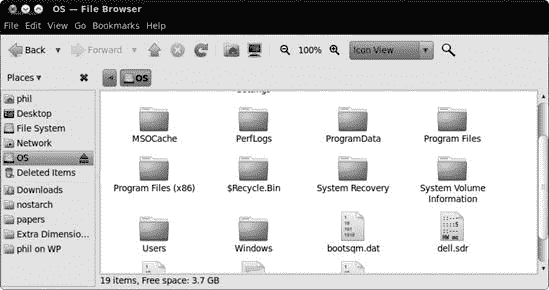
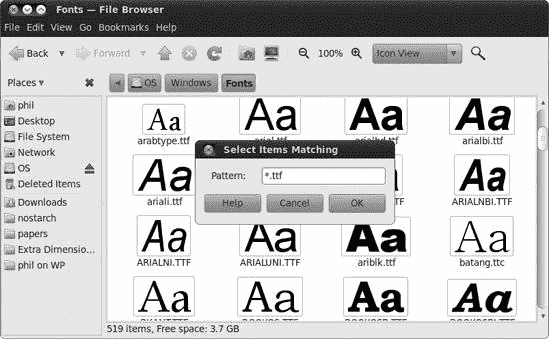
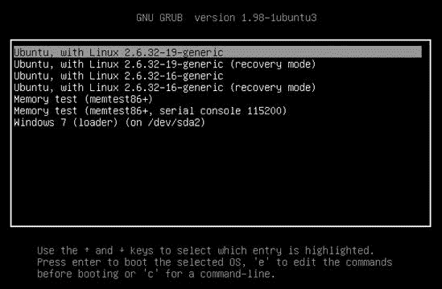
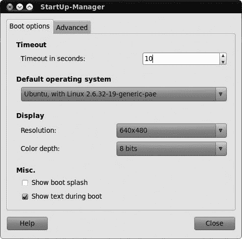
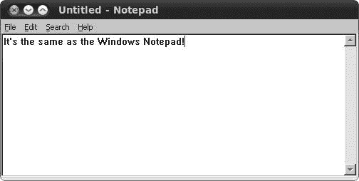
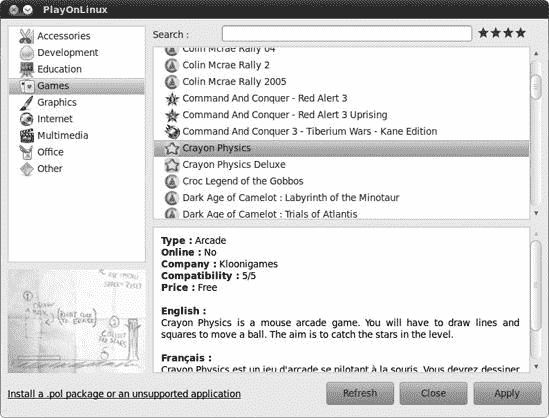
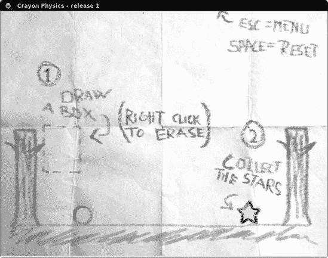

# 第十八章。大门前的企鹅

### 在 Windows 世界中使用 Ubuntu

尽管 Linux 的普及率迅速增长，但它仍然是一个非常 Windows 的世界。如果你像我一样，你经常会发现自己在与使用 Windows 的人一起工作，因此了解如何让 Ubuntu 与微软无处不在的操作系统愉快共存是很重要的。幸运的是，Linux 几乎是最宽容的操作系统之一，并且没有问题共享文件、读取 Windows 磁盘等。事实上，你的 Ubuntu 程序可能支持的文件格式范围比它们的 Windows 等价物更广；不止一次，我尝试在 Windows 中打开一个文件，失败了，然后启动到 Ubuntu 中，那里我可以轻松打开它。

当然，与他人共享文件可能不是你唯一的 Windows 相关担忧，尤其是如果你是双启动用户。很多人决定在他们的电脑上同时运行 Windows 和 Linux，因此了解如何最小化在两者之间切换的官僚程序是很有用的。如果你保留 Windows 的唯一目的是运行特定的应用程序，而你又找不到与之兼容的 Linux 等价物，那么你可能可以省去双启动的麻烦，直接在 Ubuntu 上安装该程序。我告诉你 Linux 是多么宽容……它甚至可以接受 Windows 程序作为自己的！

在本章中，你将学习如何充分利用你的双操作系统设置：你将安装一些 Windows 字体，安装一些 Windows 程序，并在 Windows 网络上共享文件。如果你对 Windows 还不够满意，你甚至可以看到如何在 Ubuntu 中运行 Windows（在窗口中！）如果你已经厌倦了窗口，那么到本章结束时你一定会感到疲惫！

# 项目 18A：访问你的 Windows 分区上的文件（适用于双启动用户）

如果你安装 Ubuntu 时选择了双启动与 Windows，那么你的硬盘上某个地方可能藏着一个分区，里面装满了你的 Windows 文件和程序（如果你需要复习分区的工作原理，请参阅第二章）。你可以通过在 Ubuntu 内部挂载分区来访问 Windows 上的文件。当你挂载一个分区时，文件将通过 Nautilus（以及其他程序）供你使用——挂载只是 Linux 识别分区并为其使用做准备的方式。

## 18A-1：挂载你的 Windows 分区

在 Linux 中挂载 Windows 分区过去可能是个麻烦事，但现在已经不是这样了（至少在 Ubuntu 中不是）。实际上，你只需要打开一个 Nautilus 窗口，然后在侧边栏中点击 Windows 分区。

您很可能会在侧边栏中找到至少两个硬盘图标，所以您可能不确定您的 Windows 分区实际上是哪一个。只需记住，您的 Linux 分区由名为 *文件系统* 的硬盘图标表示。不幸的是，Windows 分区的情况并不简单。它可能被标记为 *OS*（如图 18-1 中的侧边栏所示）或者以分区大小后跟单词 *媒体*（例如，如果您的 Windows 分区大小为 80GB，它可能出现在左侧窗格中的 *80GB 媒体*）。或者，它可能是其他完全不同的东西。如果需要，猜测它是哪一个——即使猜错了也不会有什么伤害。

现在您已经知道哪个硬盘图标代表哪个，是时候开始挂载了！只需点击 Nautilus 侧边栏中 Windows 分区的图标。可能会出现一个身份验证窗口；输入您的 Ubuntu 密码，如果出现，点击 **身份验证**按钮。然后会弹出一个显示您的 Windows 分区内容的窗口。

### 注意

如果您选择休眠而不是退出 Windows，那么在尝试挂载 Windows 分区时，您很可能会收到“无法挂载卷。您没有挂载此卷的权限。”的错误信息。一些休眠的 Windows 分区在 Linux 中无法安全地以读写方式挂载，因为当 Windows 休眠时添加新文件可能会在它再次启动时严重混淆它。要完全访问驱动器，请确保关闭 Windows 而不是休眠。

图 18-1. 在 Nautilus 中挂载 Windows 分区

## 18A-2：卸载您的 Windows 分区

在完成对 Windows 分区的操作后，您可以立即卸载它，或者您可以等待系统关闭，此时它将自动卸载。在您自己卸载之前，您必须首先确保没有任何程序正在访问分区上的文件或文件夹。Nautilus 和终端是常见的嫌疑人，因此在卸载之前，请关闭任何正在浏览该分区的 Nautilus 或终端窗口。完成这些操作后，点击 Nautilus 窗口侧边栏中 Windows 分区旁边的那个小弹出图标（图 18-2

图 18-2. Nautilus 侧边栏中的 Windows 分区 "OS"，包括弹出图标

# 在运行 Windows 时访问 Linux 分区

在 Ubuntu 中查看 Windows 文件并不太有压力，正如你无疑已经发现的那样。但反过来，让 Windows 识别你的 Linux 分区又如何呢？不幸的是，在这方面 Windows 并不太有帮助——它只能查看 FAT 或 NTFS 格式的分区，并且没有内置对 Linux 通常使用的 ext 格式的支持。因此，如果你需要在 Windows 中访问你的 Linux 文件，最简单的方法可能是创建一个单独的 FAT 分区，以便在两个操作系统之间共享（参见附录 C)。嗯，这并不太方便。

另一种选择是通过安装一些额外的软件将 Linux 分区的支持添加到 Windows 中。不幸的是，这类软件的状态相当糟糕：对老式的 ext2 格式的支持相当不错，但 Ubuntu 现在使用的是 ext4，这完全是另一种情况。据我所知，人们所能做到的最好的事情是在 Windows 中以只读模式挂载 ext4 分区。虽然你无法向分区添加新文件，但至少你可以查看里面的内容并将它们复制到 Windows 中。参见[`www.soluvas.com/read-browse-explore-open-ext2-ext3-ext4-partition-filesystem-from-windows-7/`](http://www.soluvas.com/read-browse-explore-open-ext2-ext3-ext4-partition-filesystem-from-windows-7/)，了解如何进行此操作的示例。

# 项目 18B：安装微软 Windows 核心字体

不管你是否喜欢，计算世界在很大程度上仍然是微软的世界，这意味着绝大多数用户，甚至是 Mac 用户，都在使用微软字体。既然如此，你不可避免地需要处理使用诸如 Georgia、Verdana、Times New Roman 和 Courier 等字体的文档。当然，你的系统可以替换文档中使用的字体。但为了让你看到事物如预期的那样，并允许他人以你期望的方式查看你的文档，最好是在自己的系统上安装这些微软核心字体。

幸运的是，有两种方法可以获取这些字体。一种是通过 Ubuntu 软件中心下载和安装它们，而对于那些双启动设置的用户来说，另一种方法就是简单地从 Windows 分区复制它们。在前一种情况下，你只需要使用 Ubuntu 软件中心安装 Microsoft Core Fonts 包。这是 Windows XP 的老款字体集，所以安装这个包不会给你带来后来 Windows 版本捆绑的新字体。当安装过程完成后，你的新微软字体将成功安装并准备好供机器上的每个用户账户立即使用。

如果你是一个双启动用户，你可以直接从 Windows 安装中复制字体。这有一个优点，就是可以将所有 Windows 字体安装到 Ubuntu 中，即使是新安装的（如果你安装了 Vista 或 Windows 7）。以下是你需要做的：

1.  按照在项目 18A：访问 Windows 分区上的文件（适用于双启动用户）"]中描述的方法挂载 Windows 分区。

1.  在 Nautilus 中打开 Windows 分区，浏览到 *Windows/Fonts* 文件夹。

1.  现在有一个小技巧：选择 **编辑** ▸ **选择匹配项**，在出现的框中输入 **`*.ttf`**，然后点击 **确定** (图 18-3）。这将选择文件夹中所有以 *.ttf* 结尾的文件，它们都是 TrueType 字体文件。

1.  将文件复制到方便的位置（在你的家文件夹中的任何地方都可以）。

    

    图 18-3. 在 *Windows/Fonts* 文件夹中选中所有 TrueType 字体

1.  现在，回到 *Windows/Fonts* 文件夹，再次选择 **编辑** ▸ **选择匹配项**。这次，请在框中输入 **`*.TTF`**。这将选择剩余的所有字体文件——项目选择功能区分大小写，并且由于某种原因，文件名使用不同的大小写。像之前一样复制选定的文件。

1.  将所有字体文件复制到 Ubuntu 后，你现在可以像安装其他字体一样安装它们。最简单的方法是将文件复制到您家文件夹中的隐藏 *.fonts* 文件夹中，但你应该查看项目 8C：安装 TrueType 字体以获取完整细节。

# 双启动：更改启动顺序和超时

如果你选择在“双启动”设置中与 Windows 一起安装 Ubuntu，你现在应该已经习惯了看到 GRUB 启动菜单屏幕（图 18-4）。这是每次启动计算机时出现的屏幕，它给你选择运行 Windows 或 Ubuntu 的选项。

如果你在几秒钟内没有选择不同的选项，Ubuntu 将会自动启动。这对于那些几乎想用 Ubuntu 做所有事情但偶尔需要使用 Windows 的人来说是合适的。然而，如果你在 Windows 上花费的时间更多，你可能更喜欢将其作为默认操作系统。要做出更改，首先使用 Ubuntu 软件中心安装 StartUp-Manager，然后通过选择 **系统** ▸ **管理** ▸ **StartUp-Manager** 来打开它。你可能需要输入密码，所以请这样做，然后等待一会儿，直到它加载完成。在 StartUp-Manager 窗口中点击 **引导选项** 选项卡（图 18-5)，并从 **默认操作系统** 下拉列表中选择 Windows。Windows 选项的实际名称将取决于你安装的版本——例如，我的显示为 *Windows 7 (loader)*。从下一次重启开始，Windows 将会自动引导而不是 Ubuntu。

图 18-4. GRUB 引导菜单屏幕

图 18-5. 使用 StartUp-Manager 更改引导选项

### 注意

如果你在某个时候对 Ubuntu 进行了重大更新，你可能会发现，下次启动计算机时，Windows 突然变成了默认操作系统。这是因为更新会在引导列表中添加一个新的条目，导致 Windows 项在列表中下滑，不再被识别为默认选项。要解决这个问题，请打开 StartUp-Manager，并再次选择 Windows 作为默认操作系统。

StartUp-Manager 允许你更改引导超时时间。默认情况下，GRUB 在加载默认操作系统之前会等待 10 秒，但我很没有耐心，觉得等待时间太长——实际上，我甚至将“超时（秒）”选项（也在引导选项选项卡上）改为 1 秒，这样菜单只显示一秒钟。这听起来可能很快，但当我想要进入 Windows 时，我只需在计算机启动时按几次向下箭头键。GRUB 在你按下一个键时会停止计时器，并保持菜单在屏幕上，所以一旦发生这种情况，我就可以随意选择 Windows 选项。

一旦你对修改后的引导超时时间和/或默认操作系统满意，点击 **关闭** 以应用设置。StartUp-Manager 将花费几秒钟来执行请求的更改，之后它会关闭。重新启动计算机以查看更新的引导菜单。

# Linux 与 Windows 应用程序的对应关系

在费尽周折在 Ubuntu 中运行 Windows 程序之前，尝试一些等效的 Linux 应用程序是个不错的主意。通常情况下，总有一款本地的 Linux 程序能够满足你的需求，而无需经历为其他操作系统设计的应用程序所带来的任何头痛。

然而，首先你必须找到那些 Linux 等效程序。幸运的是，许多网站列出了 Windows 软件的良好替代品：例如[`www.osalt.com/`](http://www.osalt.com/)和[`www.linuxalt.com/`](http://www.linuxalt.com/)相当全面。或者，你可以在 Ubuntu 软件中心随意浏览，安装一些让你感兴趣的应用程序。毕竟，尝试一个程序是了解你是否喜欢它的最佳方式！

### 注意

一些 Windows 程序在 Ubuntu 中没有直接等效程序，所以你可能需要安装几个程序来获得与 Windows 软件类似的功能。在极少数没有合适替代品的情况下，你可以尝试使用 Wine 或在虚拟机中安装 Windows，我将在下一节中讨论这一点。

# 项目 18C：运行 Windows 程序

在第六章中，你学到了许多向系统添加应用程序的方法，但你可能还没有考虑过另一种方法——安装 Windows 应用程序。尽管大多数你需要的 Windows 程序都有 Linux 等效程序，但可能有一两个程序是你怀念的。幸运的是，借助名为*wine*的程序，你可以在 Linux 中运行一些 Windows 应用程序。兼容的软件列表包括微软 Office、Internet Explorer、Adobe Photoshop 以及大量游戏，所以如果你非常怀念某个特定程序，那么查看它绝对值得。

公平地说，Wine 仍在不断改进中。它和一些程序配合得很好，而与其他程序则完全不兼容。然而，情况正在改善，Wine 现在似乎与更多应用程序配合得更好。如果你想知道哪些应用程序在 Wine 下运行以及成功率如何，请查看 Wine 主页[`www.winehq.org/`](http://www.winehq.org/)，并点击**AppDB**链接。程序 AppDB 条目通常包含有关在 Wine 中运行程序的有用建议，所以如果你遇到问题，请首先查看那里。

## 18C-1：安装和测试 Wine

你可以通过在 Ubuntu 软件中心搜索*wine*来获取 Wine，并安装 Wine 微软 Windows 兼容层（应该是第一个搜索结果）。安装完成后，你可以通过选择**应用程序** ▸ **Wine** ▸ **程序** ▸ **附件** ▸ **记事本**来测试它。几秒钟后（第一次使用 Wine 时可能需要更长的时间），Windows 记事本将出现（图 18-6）。

图 18-6. 在 Wine 下运行的 Windows 记事本

## 18C-2: 在 Wine 中安装 Windows 应用程序

现在你已经看到了在 Wine 下运行的 Windows 应用程序，你不妨学习如何自己安装更多应用程序。我会指向一个肯定能工作的应用程序——一个相当酷的文本编辑器，名为 NoteTab Light (图 18-7).

要获取 NoteTab Light，请访问 [`www.fookes.com/ftp/free/NoteTab_Setup.exe`](http://www.fookes.com/ftp/free/NoteTab_Setup.exe)，选择 **保存文件**，并在出现的窗口中点击 **确定** 以将文件保存到你的 *下载* 文件夹。

下载完成后，转到 *下载* 文件夹，右键单击 *NoteTab_Setup.exe* 文件，并在弹出菜单中选择 **属性**。然后，转到权限选项卡并勾选 **允许作为程序执行文件**。关闭属性窗口，再次右键单击文件，这次选择 **使用 Wine Windows 程序加载器打开**。片刻之后，就会出现你如果在 Windows 中安装 NoteTab 时看到的相同类型的安装向导 (图 18-8). 按照向导操作，接受许可协议，然后在安装过程中接受所有默认设置，直到安装完成。

图 18-7. NoteTab Light 在 Wine 下运行

图 18-8. 在 Wine 下运行的 Windows 安装向导

运行 NoteTab Light 相当简单，因为它为你提供了一个桌面启动器。不过，你首先需要做一些额外的设置，因为如果你现在双击启动器，你会收到一个关于“不受信任的应用程序启动器”的警告。要消除警告，请在桌面上右键单击 *NoteTab Light.desktop* 文件，并选择 **属性**。转到权限选项卡，并勾选 **允许作为程序执行文件**（就像你之前做的那样）。

完成这些操作后，只需双击该启动器，NoteTab Light 就会很快出现，就像一个普通的 Linux 应用程序一样。你还可以通过选择 **应用程序** ▸ **Wine** ▸ **程序** 来运行 NoteTab Light 和其他在 Wine 下安装的 Windows 应用程序，然后选择你想要运行的程序。然而，你可能发现，一些依赖于 Wine 的应用程序在安装后直到你注销并重新登录之前都不会出现在这个菜单中。

## 18C-3: 使用 PlayOnLinux 在 Wine 中使 Windows 应用程序工作

一些 Windows 软件固执地拒绝在 Wine 中工作，除非你以特定的方式设置好一切。Wine 网站充满了如何调整设置的技巧，直到你找到似乎适用于特定程序的神奇公式（这些设置实际上保证不会适用于你用 Wine 安装的其他程序）。有些说明甚至要求你为不同的程序安装不同版本的 Wine！幸运的是，有一个巧妙的方法可以绕过这些问题，称为 PlayOnLinux。它为你处理所有的设置调整，并支持许多常用的 Windows 程序（以及大量游戏）。你可以从 Ubuntu 软件中心以通常的方式安装 PlayOnLinux。

安装完成后，通过选择**应用程序** ▸ **游戏** ▸ **PlayOnLinux**来启动 PlayOnLinux，然后点击**前进**。它将花费一两分钟更新其支持的程序数据库，并在完成后将你留在主 PlayOnLinux 窗口(图 18-9)。在新窗口中，点击**安装**，并使用出现的窗口中的类别面板或搜索栏查找你选择的 Windows 程序。在这个例子中，我将安装令人愉快的 Crayon Physics 游戏：

1.  选择**游戏**类别，并在列表中找到 Crayon Physics 条目（不是 Deluxe 版本）。

1.  选择**Crayon Physics**（如图图 18-10)，然后点击**应用**以开始安装过程。如果窗口冻结，点击窗口的关闭按钮，然后点击**强制退出**以说服安装程序开始。

1.  点击**前进**，等待游戏下载。

1.  如果你愿意，勾选一个或两个复选框，将游戏快捷方式放在桌面和/或在你的应用程序菜单中。然后，点击**前进**，再点击**前进**以完成安装过程。

1.  要开始游戏，双击主 PlayOnLinux 窗口中程序列表中的 Crayon Physics 条目，或者从列表中选择它并点击**运行**。

假设游戏安装成功，你将看到一个 Crayon Physics 窗口。点击该窗口的任何位置，你会在显示上看到用蜡笔涂鸦的风景，类似于图 18-11 中的那个。游戏的目标是用鼠标在屏幕上画盒子，使球滚动到星星上。每次你得到星星，你就可以进入下一关，在那里你将被迫想出更巧妙的滚动球策略。听起来很简单，但我保证它会让你上瘾！

图 18-9. PlayOnLinux 主窗口

图 18-10. 在 PlayOnLinux 中选择要安装的 Windows 应用程序

图 18-11. 使用 PlayOnLinux 玩 Crayon Physics 游戏

# 在 Ubuntu 中安装 Windows

您可以用计算机做的奇怪事情之一是在其中运行计算机的模拟。这种模拟称为*虚拟机（VM）*软件，它允许您在另一个操作系统内安装一个操作系统，这样您就可以同时运行它们而无需重启。如果您需要出于某种原因运行 Windows，例如需要一些专用软件，但又太习惯于在 Ubuntu 中工作而不想考虑进行双启动用户必须遵循的耗时重启过程以返回到微软领域，这将非常有用。您甚至可以让 Windows 在一个窗口中运行，这个窗口可以像任何其他程序一样打开和关闭。

有一些注意事项。首先，虚拟机必须与您的所有其他程序共享计算机资源，因此如果您正在进行任何计算密集型操作，它可能会减慢速度。其次，它无法像“真实”操作系统那样访问您的计算机硬件，因此您可能无法通过虚拟机使 Windows 专用设备工作。最后，也许是最尴尬的，您需要一个 Windows 安装光盘才能将 Windows 放入虚拟机中，但大多数计算机只配备了恢复光盘，这无法解决问题。

如果您确实有一个安装光盘，将 Windows 安装到虚拟机中的工作并不比将其安装到真实计算机上多多少：

1.  打开 Ubuntu 软件中心，安装 VirtualBox。其他虚拟机也可用，但我发现这个最容易使用。

1.  选择**应用程序** ▸ **系统工具** ▸ **Sun VirtualBox** 来启动它，然后点击**新建**，接着点击**下一步**。

1.  为您的虚拟机选择一个名称和类型。名称由您决定，但操作系统应设置为 Microsoft Windows。

1.  点击**下一步**，选择您希望虚拟机访问的内存量（系统内存，而非硬盘空间）(图 18-12). 这是一个艰难的决定；一方面，您需要足够的内存以便“虚拟”操作系统能够运行（例如，Windows XP 至少需要 128MB），但您又希望为 Ubuntu 程序留出足够的空闲内存。VirtualBox 通常会建议一个合理的值。

1.  再次点击 **下一步**，并选择 **创建新的硬盘** (图 18-13)。确保勾选 **引导硬盘**，然后点击 **下一步** 以打开创建新虚拟磁盘窗口。

1.  运行虚拟磁盘向导，完成时点击 **完成**；大多数选项的默认设置应该就足够了，但你可能想自己选择虚拟磁盘的大小。这将作为虚拟机的硬盘使用，并存储在你家目录中的一个隐藏文件夹中。再次提醒，选择一个足够大以运行虚拟操作系统，但又不会占用你整个硬盘的空间的大小。

    

    图 18-12. 为虚拟机分配多少内存

    

    图 18-13. 创建新的虚拟硬盘

    ### 注意

    如果你选择 *动态扩展存储* 作为存储类型，虚拟磁盘将从一个较小的尺寸开始，随着你在虚拟机中添加更多文件而增长。这是一种节省磁盘空间的好方法。

1.  在虚拟磁盘设置完成后，你将被带到摘要页面，你可以点击 **完成** 来创建虚拟机。

到目前为止，一切顺利。有了准备就绪且跃跃欲试的虚拟机，现在是时候安装 Windows 了；我将把 Windows 的具体操作留给你（它们可能略超出了这本书的范围，你不这么认为吗？），但以下是你需要做的来开始这个过程：

1.  将 Windows 安装光盘插入您的 CD 驱动器，并关闭任何打开的窗口，询问如何处理它。

1.  在 VirtualBox 的主窗口中，从左侧面板选择您的虚拟机，然后点击 **启动**。将打开一个黑色窗口，以及一个首次运行向导；点击 **下一步**。

1.  确保在媒体类型下选中 CD/DVD-ROM 设备，然后再次点击 **下一步**。

1.  点击 **完成**，虚拟机应该尝试从你的 Windows 光盘启动。几秒钟后，你应该会面对 Windows 安装程序。享受这个过程吧！

1.  一旦 Windows 安装完成，虚拟机将重新启动。当提示时，请取出光盘，并在设置几分钟之后，你应该会看到 Windows 桌面出现在眼前。呼，辛苦的工作终于结束了！

### 注意

你可以在虚拟机中安装 Linux 和其他操作系统，以及 Windows。实际上，你甚至可以在虚拟机中安装另一个虚拟机，尽管如果你同时运行这两个虚拟机，你可能需要预留半天时间来检查你的电子邮件。

# 与您网络上的 Windows 用户共享文件

连接到网络的主要理由之一（除了访问互联网之外）是在计算机之间共享文件。你可能已经熟悉这个概念了；网络共享在许多工作场所中都被使用，你可能甚至在自己的家庭网络中设置过。对于初学者来说，网络共享就是另一台计算机上的一个文件夹，你可以像访问自己的文件夹一样访问它。文件在网络中传输，因此不需要使用便携式硬盘或闪存驱动器来在不同地方之间传输文件。

## 访问存储在 Windows 计算机上的文件

网络共享是双向的：你可以通过创建一个*共享文件夹*与他人共享文件，或者访问其他人创建的现有共享文件夹。如果你连接到一个 Windows 计算机的网络，那么你可能已经有一些网络共享了。我在使用 Nautilus 作为网络浏览器中深入讨论了浏览网络共享，在所有这些其他文件夹里有什么？，但为了避免你翻阅这么多页面，这里快速概述一下你需要做什么才能从 Ubuntu 访问共享：

1.  选择**位置** ▸ **网络**；Nautilus 将打开。

1.  双击**Windows 网络**文件夹，查看连接到网络的全部 Windows 计算机列表。

1.  双击其中一台计算机，查看其共享文件夹列表。

1.  选择一个共享文件夹，双击它以访问其中的文件。

## 使你的文件可以从 Windows 计算机访问

由于你的 Windows 计算机已经非常乐意在网络上共享它们的文件，让我们通过共享 Ubuntu 自己的文件夹来作为回报：

1.  打开 Nautilus，找到你想要共享的文件夹；然后右键单击它，并选择**共享选项**。

1.  在出现的文件夹共享窗口中勾选**共享此文件夹**。

1.  你会被告知共享服务尚未安装——点击**安装服务**，等待安装过程完成。

1.  在文件夹共享窗口（图 18-14

    图 18-14. 在网络上共享文件夹

1.  如果你希望网络上的其他人能够修改你那里的文件，请勾选**允许其他人创建或删除此文件夹中的文件**。如果不勾选此选项，其他人只能读取和复制这些文件。

1.  默认情况下，只有在你计算机上有用户账户的人才能访问你的共享文件夹。为了使网络上的任何人都能访问你的共享文件，请勾选**来宾访问**选项。

1.  点击**创建共享**以完成设置。

前往你的 Windows 电脑，尝试访问新创建的共享。在 Ubuntu 电脑上的共享文件夹可以像访问任何其他共享一样访问，所以做你通常寻找它的任何操作。（例如，在 Windows XP 中，你会在你的*网络共享*文件夹中找到它。）如果你能打开共享文件夹中的文件，那么你就知道一切设置都正确无误了。

如果你不再想共享文件夹，请在 Nautilus 中右键单击它，选择**共享选项**，然后取消选中**共享此文件夹**。
