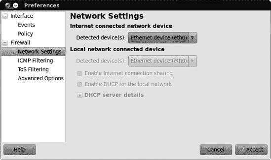
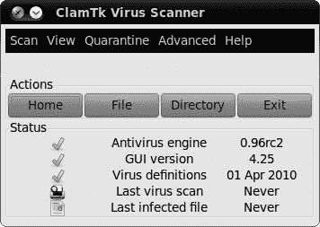
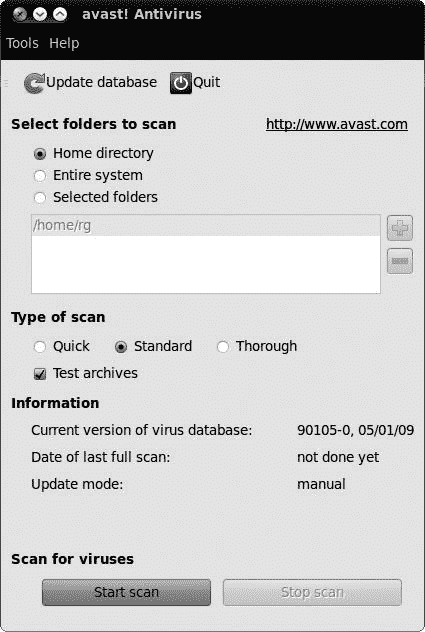
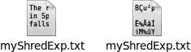

# 第十九章。保护巢穴

### 安全性

许多 Windows 用户在经历了 Windows 世界中的大量*恶意软件*（病毒、间谍软件以及各种其他恶意软件代码）的糟糕经历后，进入了 Linux 阵营——这些恶意软件数量繁多，难以想象。Windows 还受到似乎无穷无尽的安全漏洞的困扰，使系统容易成为心怀不轨的入侵者的猎物。因此，每次进入网络空间都像是在医院的传染病科跑一趟。对于 Windows 用户来说，有时似乎花在清除系统中的病毒害虫和防御入侵者身上的时间比实际完成任务的时间还要多。

幸运的是，Linux 并没有遭受如此严重的问题，这导致了人们广泛宣扬的 Linux 几乎无病毒且非常安全的说法。已经提出了许多理由来解释 Linux 对恶意软件和漏洞的抵抗力。一个原因仅仅是流行度——或者说缺乏流行度。因为 Linux 不像 Windows 那样广泛使用，它也远不是一个吸引数字恶棍的目标，他们往往被创造真正全球性的病毒或找到迄今为止未知的后门所带来的挑战和头条新闻的荣耀所驱动。

另一个原因是，一般来说，Linux 用户在非特权模式下使用他们的计算机，在这种模式下，用户没有密码安装软件的权利。在某些 Windows 版本中并非如此。因此，附着在电子邮件上或寄生在其他文件或应用程序上的病毒或其他形式的恶意软件无法在没有密码的情况下安装到您的 Linux 系统中……至少在理论上是这样。当然，现在较新版本的 Windows 默认使用权限结构，这个点的问题就小多了。

此外，还有结构设计的问题。每个系统都有可以被数字和人类敌人利用的安全漏洞。在这方面，Windows 可能被称作操作系统的瑞士奶酪。当然，Linux 也有其漏洞，但比 Windows 少得多；一旦发现，Linux 通过可下载的更新更快地填补这些漏洞。

最后，Ubuntu 的预配置安全策略带来了防御优势——Ubuntu 桌面系统中没有开放的入站端口。这意味着您的 Ubuntu Linux 系统对未授权入侵的抵抗力甚至更低。

# 我的系统需要保护吗？

所以，关于 Linux 出色安全性的所有这些讨论，你可能想知道你是否真的需要担心它。嗯，如果你查看 Ubuntu 论坛，你可能会感到有些困惑。当被问及 Linux 用户是否需要安装杀毒软件或防火墙时，大多数用户都会断然回答“不”。另一方面，你会发现很多人已经安装或正在尝试安装那种软件。嗯嗯。

那么，Linux 用户该怎么办呢？

如果你在一个网络环境中，需要在很多 Windows 机器之间传输大量文件，你可能需要考虑安装一些杀毒软件，即使只是为了保护涉及的 Windows 系统和那些系统用户——比如你的那些未开化的（即使用 Windows 的）电子邮件朋友。如果你天生就比较谨慎，你也可能想试一试。基本上，如果你觉得安装一些保护措施会让你感觉更安全，那就去做吧。如果你觉得安装我在本章中提到的完整防御机制会让你感觉更安全，那就去做吧。毕竟，无论你选择哪种方式，都不会让你付出任何代价，当然也不会伤害到你。

# 第一道防线

无论你使用的是哪种系统（尽管我假设你现在已经成为了一名 Linux 信徒），任何永久连接到互联网的计算机的第一道防线都是一个**路由器**——一种电子设备，它允许本地网络（如你的家庭或办公室）中的多台计算机连接并共享来自你的互联网服务提供商（ISP）的单个连接。虽然路由器通过电缆连接到你的调制解调器，但路由器与本地网络中的计算机之间的连接可以是有线、无线或两者兼有。

路由器与保护你的计算机有什么关系呢？嗯，大多数路由器都包含一个**防火墙**，它本质上起到将网络上的所有不良内容隔离在你的计算机之外的作用，就像你的汽车中的防火墙将发动机的热量、烟雾和噪音隔离在乘客舱外一样。这个内置的防火墙是即使只有一台计算机的人，他们本可以直接将计算机连接到他们的电缆或 DSL 调制解调器，也会使用路由器的原因之一。当然，你的路由器中的防火墙提供的安全性取决于你在防火墙设置软件中选择的哪些过滤器。例如，一个非常常见且有用的过滤器（尤其是对于无线网络用户来说）限制了只有防火墙访问列表上指定的机器才能访问互联网。这阻止了你的邻居通过你的 ISP 连接使用无线网络。毕竟，他们没有支付账单。

路由器的设置软件内置在路由器中，因此你不必担心软件安装和系统兼容性问题。使用 Linux 与使用 Windows 一样使用路由器。你可以通过简单的网页浏览器访问软件并修改设置，就像你在图 19-1 中看到的那样。只需在浏览器的地址栏中输入路由器的 IP 地址（通常在用户手册中提供），按**Enter**键，你就可以开始了。

图 19-1. 设置路由器

# 软件防火墙

如果你没有路由器，也不打算购买，或者你有一个但几乎到了偏执的地步，你可能想考虑使用软件防火墙，特别是 Linux 上最受欢迎的软件防火墙之一，Firestarter。

你可以通过在 Ubuntu 软件中心搜索*firestarter*并安装它来获取 Firestarter。安装完成后，通过选择**系统** ▸ **管理** ▸ **Firestarter**（你可能需要输入密码）来运行它。Firestarter 将打开一个自解释的设置向导，第一次使用时。只需仔细阅读每一屏；如果有的话，按照建议进行选择；然后在向导的每个屏幕上点击**前进**按钮，直到到达最后一个（如图 19-2 所示）。在该屏幕上，确保*现在启动防火墙*旁边的框被勾选，然后点击**保存**按钮。向导窗口将关闭，主 Firestarter 窗口将出现。假设正确检测并选择了正确的网络设备，并且正确选择了向导选项，防火墙将启动并运行。

图 19-2. Firestarter 设置向导的最后屏幕

如果选择了错误的网络设备，将出现一个警告窗口告诉你这一点。在这种情况下，你可以在主 Firestarter 窗口中选择**编辑** ▸ **首选项**进行一些尝试和错误操作，然后在出现的首选项窗口中点击**网络设置**（如图 19-3 所示）。在该窗口中，从“检测到的设备”下拉菜单中选择其他设备之一，然后点击**接受**按钮。一旦回到主 Firestarter 窗口，点击**启动防火墙**按钮（看起来像一个播放按钮），看看会发生什么。如果你仍然无法启动防火墙，重复我刚才描述的过程，这次选择不同的网络设备。

图 19-3. 在 Firestarter 中选择网络设备

一旦你的防火墙启动并运行，你实际上不需要做任何事情。你可以简单地查看 Firestarter 窗口（图 19-4

图 19-4. Firestarter 运行中的截图

## 掌控 Firestarter

你可以通过创建自己的*策略*来控制 Firestarter 如何处理各种网络事件。Firestarter 中默认设置的策略允许你通过互联网做你通常做的事情，同时它阻止来自互联网或你网络上的任何其他计算机到你的电脑的新连接。

要使事情变得更为严格，你可以点击**策略**标签，在编辑下拉菜单中选择**默认限制性，白名单流量**。如果你只想拒绝任何在电脑上工作的人访问特定的网站，例如，只需选择**默认允许，黑名单流量**，右键单击**拒绝连接到主机**字段，并在弹出菜单中选择**添加规则**。在添加新出站规则窗口中，输入目标网站的域名（如*example.com*），点击**添加**，然后在 Firestarter 主窗口中点击**应用策略**按钮（它看起来像绿色的勾号）。

## 确认 Firestarter 自动运行

第一次运行 Firestarter 后，它将自动设置为每次启动系统时启动。当你没有看到第一次启动时看到的图形界面时，不要担心；Firestarter 将在后台运行，默默地保护你的电脑。

如果你属于怀疑型的人，你可以通过打开一个终端窗口，输入**`sudo /etc/init.d/firestarter status`**，然后按**enter**键来检查 Firestarter 是否实际上在后台运行。如果 Firestarter 正在运行，你将在终端窗口中看到消息`* Firestarter is running...`。不用担心。如果 Firestarter 没有运行，响应将显示`* Firestarter is stopped`。

## 获取更多信息

如果防火墙的世界对您来说是新的，您可以查看 Firestarter 的主页以了解更多信息。要查看在线手册，只需转到 Firestarter 的**帮助**菜单，并选择**在线用户手册**，它将在您的网络浏览器中打开页面。如果您想在安装 Firestarter 之前查看手册，请将浏览器指向[`www.fs-security.com/docs/`](http://www.fs-security.com/docs/)。您在那里还可以找到一个相当不错的快速教程。

# ClamAV：Linux 风格的杀毒软件

尽管没有病毒可以对您的 Linux 系统造成破坏，但您的计算机仍然可能成为 Windows 病毒的传播者。因此，为那些希望帮助保护 Windows 用户免受病毒侵害的 Linux 用户提供了一些免费的杀毒扫描器。这些包括 Panda Desktop Secure ([`www.pandasecurity.com/usa/homeusers/downloads/desktopsecure/`](http://www.pandasecurity.com/usa/homeusers/downloads/desktopsecure/))、f-Prot ([`www.f-prot.com/`](http://www.f-prot.com/))以及许多其他软件。然而，对于大多数 Linux 用户来说，首选的病毒扫描器是开源的竞争者：ClamAV。

虽然它可以在多个操作系统上使用，但 ClamAV 被认为是**Linux**的杀毒软件包。它是开源的，完全免费，您不必担心许可证或忍受续订的麻烦。不幸的是，ClamAV 本身是一个基于命令的应用程序，这使得它稍微不太用户友好。幸运的是，对于所有相关人员来说，尽管是一个简单的图形界面，但 ClamTk 是可用的；它被称为 ClamTk。ClamAV 和 ClamTk 都可以通过 Ubuntu 软件中心获得——只需搜索*clamtk*，然后安装病毒扫描器。然后，Ubuntu 软件中心将自动安装 ClamAV 以及它运行所需的所有其他包。

一旦安装了 ClamAV，您可以通过选择**应用程序** ▸ **附件** ▸ **病毒扫描器**来执行病毒扫描。这将打开 ClamTk 病毒扫描器窗口（图 19-5）。

一旦启动并运行，您可以从扫描菜单中按需扫描您的系统。要扫描单个文件夹，请选择**一个目录**。要扫描目录及其所有内容，请选择**递归扫描**。在两种情况下，都会出现选择目录窗口。选择您想要扫描的文件夹或磁盘，然后点击**确定**。ClamAV 将开始扫描您的系统。ClamTk 将在按钮栏下方空白的区域通知您正在扫描的内容。如果它发现任何可疑内容，它将在窗口的主面板中列出该条目。

图 19-5. ClamTk——ClamAV 的图形界面

ClamAV 默认设置为在启动时检查 *签名更新*。这些签名更新告诉 ClamAV 应该注意哪些新病毒。如果你连续几天不关机，那么设置 ClamAV 每天自动检查签名更新而不是仅在启动时检查可能也是一个好主意。为此，转到 **高级** 菜单，并选择 **调度程序**。在调度窗口中，选择 ClamAV 进行更新检查的时间，位于窗口的下半部分。完成后点击 **添加** 按钮。你还可以使用此窗口设置定期扫描系统的时间——只需选择你希望扫描发生的时间，然后点击 **添加**。完成操作后，点击 **关闭**。

正如我提到的，你在病毒扫描过程中可能遇到的唯一病毒是针对 Windows 系统设计的，它们不会影响你的 Linux 系统。尽管扫描整个系统以查找病毒不会对你造成任何伤害，但如果你有 Windows 分区，并且会发送文件作为电子邮件附件，尤其是给 Windows 用户，那么将病毒扫描活动集中在你的 Windows 分区上可能更好。

# 项目 19A: 使用 avast! 进行病毒扫描

虽然在 Linux 世界中 ClamAV 可能是首选的病毒扫描器，但我的个人最爱仍然是 avast!，它在我的 Windows 年代保护了我。我认为它更容易使用，而且就其价值而言，看起来也更美观。缺点是它确实要求你每年注册一次，以便获取许可证密钥，但这几乎不是一项艰巨的任务，而且它仍然是免费的。

## 19A-1: 下载 avast! DEB 包和许可证密钥

首先，你必须获取 avast! 文件和许可证密钥。你可以通过打开你的网络浏览器并访问 [`www.avast.com/linux-home-edition/`](http://www.avast.com/linux-home-edition/) 来完成此操作。一旦你到达那里，点击 **下载** 选项卡，然后下载 avast! Linux 版本的 DEB 包。

下载完成后，双击 DEB 包，当出现软件包安装窗口时，点击 **安装软件包** 按钮。然后系统会提示你输入密码，请提供该密码，并点击 **确定**。下载和安装过程将开始。当这些过程完成后，关闭通知窗口和软件包安装器。一旦你下载并安装了 avast!，你将需要一个许可证密钥才能使用它。只需回到 Firefox 中的 avast! 下载页面，点击 **注册表单** 链接，然后填写并提交该表单。几分钟后你应该会通过电子邮件收到你的许可证密钥（尽管页面说可能需要长达 24 小时）。

## 19A-2: 运行和使用 avast!

安装 avast!后，你可以通过选择**应用程序** ▸ **附件** ▸ **avast!杀毒软件**来运行它。第一次运行 avast!时，将出现一个小窗口（图 19-6

图 19-6. 输入你的 avast!许可证密钥

图 19-7. avast!病毒扫描器

当 avast!完成病毒数据库的更新后，你可以通过首先决定是否只想扫描你的家目录、整个系统或选定的文件夹来开始病毒扫描工作。你还可以通过窗口中间提供的三个选项来决定你想要进行多彻底的扫描：快速、标准或彻底。

你选择哪种灵敏度模式取决于你希望扫描有多彻底。快速扫描仅扫描以某些扩展名结尾的文件（如*.exe*、*.scr*、*.com*、*.doc*等），因为这些是病毒最常携带的文件类型。标准扫描针对更多文件，忽略扩展名，但仍然限制扫描到通常与病毒关联的文件类型。最后，彻底扫描扫描一切，并搜索所有类型的病毒。

一旦你做出了选择，点击**开始扫描**按钮，avast!将开始执行——在同一个窗口中显示其进度。当扫描完成时，将弹出一个小窗口告诉你，理想情况下，没有发现病毒。你上次在 Windows 机器上收到这样的消息是什么时候？

# 项目 19B：加密你的文件

保护自己免受互联网恶意软件的侵害是件好事，但如果有人获得了对你的电脑的物理访问权限怎么办？数据盗窃是一项严肃的业务，所以如果你有任何敏感文件，你应该考虑保护它们。一种很好的方法是 *加密* 你的敏感文件。加密是一种将文件打乱的方式，只有拥有正确 *解密密钥* 的人才能恢复原始信息。如果有人试图在文件加密时查看它，他们所能看到的只是一堆无意义的字符。

## 19B-1：创建加密文件文件夹

Ubuntu 有一种加密文件的好方法，但使用时你应该小心！加密文件的全部意义在于，除了你之外没有人能够访问它们，所以如果你忘记了密码，几乎没有恢复的机会。以下是你需要遵循的步骤来获取加密：

1.  打开 Ubuntu 软件中心，搜索并安装 *ecryptfs-utils*。

1.  安装完成后，通过点击 **应用程序** ▸ **附件** ▸ **终端** 打开一个终端，输入 **`ecryptfs-setup-private`** 并按 **enter** 键。

1.  你将被提示输入用于登录 Ubuntu 的密码。输入它，并按 **enter** 键。（字母不会显示在屏幕上，这是正常的。）

1.  你将被要求输入你的挂载密码（密码）。选择一个 *非常* 好记的东西——如果你忘记了密码，将无法恢复！按 **enter** 键，重新输入密码（以确保没有打字错误），然后再次按 **enter** 键。

1.  关闭终端窗口，注销你的用户账户，然后再次登录。

1.  登录时，将出现一个更新信息窗口（图 19-8

    图 19-8. 检查你的加密口令

如果你打开你的个人文件夹，你现在会看到一个名为 *Private* 的文件夹。你放入这个文件夹中的任何东西都将被加密，并且会安全地避开好奇的目光。如果你的电脑被盗，这尤其有用——只有拥有你的挂载密码的人才能查看文件，理想情况下，只有你知道这个密码！

## 19B-2：如果出现问题恢复加密文件

如果你的电脑出现问题，需要从加密的*Private*目录中恢复文件，在 Ubuntu 重新启动并运行后，请按照以下步骤操作。如果你不自信按照这些说明操作，你绝对应该在 Ubuntu 论坛上先寻求建议。

1.  打开一个终端，输入**`sudo mount -t ecryptfs /home/`****``*`username`*``****`/.Private /home/`****``*`username`*``****`/Private`**，然后按**enter**。当然，你应该用你的用户名替换**``*`username`*``**。

1.  你将被要求输入密码短语。输入你的挂载密码短语（密码），然后按**enter**。

1.  现在，你将多次被提示创建一个部分。连续按**enter**键几次，直到你收到一个`WARNING`消息。

1.  输入**`yes`**，然后按**enter**；然后输入**`no`**，然后按**enter**。

1.  如果你输入了正确的挂载密码，*Private*文件夹将被解密，你将能够访问你的文件。将它们从该文件夹复制到安全的地方！

如果你没有成功恢复文件，请查看[`help.ubuntu.com/community/EncryptedPrivateDirectory/`](https://help.ubuntu.com/community/EncryptedPrivateDirectory/)，看看是否还有其他可以尝试的方法。

# 项目 19C：数字销毁文档

尽管大多数人认为，当他们不再需要文件时删除文件就足够了，但他们可能没有意识到被删除的文件数据仍然可以恢复。当涉及到你在马里兰州夏季旅行的照片或为泰国烹饪课程写的报告时，这可能不会引起太多关注，但如果你已经在硬盘上存储了银行详情或其他机密信息，情况就完全不同了。即使你重新格式化该磁盘，数据仍然存在。如果你想要恢复任何可能意外删除（或格式化）的文件，这当然是个好消息，但如果你的电脑丢失或被盗，或者你只是决定将其赠送出去，这就不那么好了。在这种情况下，进行一些数字销毁可能不是一个坏主意。

## 19C-1: 尝试使用 shred 命令

在 Linux 中，使用`shred`命令进行数字销毁。它的用法与你学过的`rm`命令非常相似，尽管在删除方面，`shred`要彻底得多。要尝试一下，打开一个 Nautilus 窗口的**文件**菜单，选择**创建文档** ▸ **空文件**。将新文档命名为**`myShredExp.txt`**，然后双击该文件。这将打开 gedit。在文档中输入几句话——任何内容都可以——然后保存。关闭 gedit。你现在应该能在你创建的新虚拟文件的图标上看到你输入的前几个单词（如图 19-9 左侧的示例所示）。

图 19-9. 文件在被切碎后外观发生变化。

拿着你的新文件，放在你的家目录中以便更容易跟随，你现在可以尝试使用`shred`了。打开一个终端窗口，输入**`shred myShredExp.txt`**，然后按**enter**。如果你现在查看你的家目录，你会立即注意到差异：你的原始文件还在那里，但图标上的文本现在看起来像乱码（如图 19-8 右边的示例中所示），这就是你的文件变成了的样子。如果你双击该文件，gedit 会像以前一样打开，但这次它将无法读取你的文件，并会告诉你（图 19-10）。

图 19-10. gedit 无法打开你的切碎文件。

所以，现在你文件夹里有一个被切碎的文件，但把它删除而不是让它在那里乱糟糟地堆放会方便得多，不是吗？当然，你可以通过终端使用`rm`命令来删除文件，但要在切碎后立即删除未来的切碎文件会更容易。幸运的是，通过使用带有`-u`标志的`shred`命令，这很容易做到。你可以通过打开一个终端窗口，输入**`shred -u myShredExp.txt`**，然后按**enter**来尝试它。然后你的文件将被进一步切碎并删除。

## 19C-2: 在 Nautilus 中图形化使用 shred 命令

虽然使用`shred`命令并不困难，但大多数普通用户更喜欢图形化操作。毕竟，你不必*必须*输入命令来删除或移动文件，对吧？你可以通过 Nautilus 轻松完成所有这些操作，`shred`也是一样。唯一的区别是，`shred`的功能不是 Nautilus 自带的功能——你必须自己添加。以下是你需要遵循的步骤：

1.  在 Ubuntu 软件中心中搜索*nautilus-actions*，并安装 Nautilus 动作配置。这个软件包允许你向 Nautilus 添加命令和其他功能。

1.  安装完成后，选择**系统** ▸ **首选项** ▸ **Nautilus 动作配置**。

1.  当 Nautilus 动作窗口出现时，点击**添加**按钮。

1.  在出现的添加新动作窗口中，在标签框中输入**`Shred`**，在工具提示框中输入**`更安全地擦除文件`**。

1.  如果你想为 Nautilus 中的 Shred 菜单项选择一个图标，点击浏览按钮左侧的箭头按钮，然后选择你想要的图标（我使用了删除图标）。完成后，你的窗口应该看起来像图 19-11 中的那样。

    

    图 19-11. 通过 Nautilus 使`shred`命令图形化

1.  接下来，点击**命令**标签页，在路径框中输入**`shred`**，在参数框中输入**`-f -u -v -z %M`**（确保使用大写字母*M*）。

1.  现在点击**条件**标签页。在该标签页的“如果选择包含”部分，选择你希望新的 Shred 菜单仅在选中文件时出现、仅在选中文件夹时出现，还是两者都出现。为了安全起见，一开始你可能想坚持默认设置，即“仅文件”，这样你就不会意外地粉碎一个包含重要文件的整个文件夹。完成设置后，勾选**如果选择包含多个文件或文件夹时出现**复选框，然后通过访问**文件**菜单并选择**保存**来保存你的工作。

1.  Nautilus Actions 窗口左侧面板中`shred`命令的标签现在将不再使用斜体。点击该窗口中的**关闭**按钮。

要在新的图形界面中使用`shred`命令，你必须首先注销并重新登录你的账户。之后，只需右键点击你想要粉碎的文件，然后从弹出菜单中选择**Shred**（图 19-12）。文件将被安全且永久地删除。这确实很酷。

图 19-12. 通过 Nautilus 调用`shred`命令
