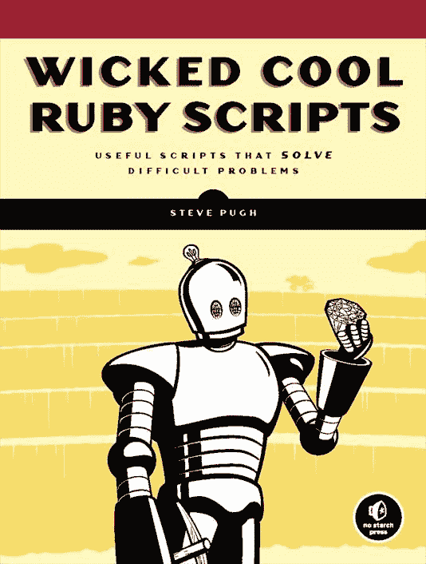

# 附录 A. 后记

嗯，这是我们通过一系列酷炫的 Ruby 脚本集的冒险之旅的结束。当我们开始时，我建议您记下您关于创建自己的酷炫脚本的任何想法。现在是时候开始您自己的旅程了。我很高兴能和您分享我对 Ruby 的热爱，并希望您将继续使用 Ruby 的力量来解决您可能遇到的问题。这确实是一门美妙的语言。

我很乐意听听您对脚本的评价——比如哪些是您最喜欢的，或者您写的更优雅的例子。通过共享知识，我们都能受益。我知道技术不断进化，尤其是在互联网上，所以如果您在这本书中发现任何错误，请务必给我发邮件。您可以查看本书的网站：[`www.nostarch.com/wcruby.htm/`](http://www.nostarch.com/wcruby.htm/)。再次感谢，并继续编程！

请多保重，

Steve Pugh

steve@pentest.it

# 关于作者

Steve Pugh 是一位有超过十年编程经验的程序员。他曾担任一家银行软件公司的软件分析师，运营过一个大型网络运营中心（监督 7000 名用户和 130 名网络技术人员），目前在美国政府进行安全研究。本书的大部分内容是在 Pugh 在美国政府为伊拉克北部的政府工作期间撰写的。

# 印刷信息

《Wicked Cool Ruby Scripts》中使用的字体有 New Baskerville、Futura 和 Dogma。

本书在密歇根州安阿伯的 Malloy Incorporated 印刷装订。纸张是 Glatfelter Spring Forge 60# Smooth Antique，该纸张已通过可持续林业倡议（SFI）认证。本书采用 RepKover 装订，使其打开时可以平铺。

